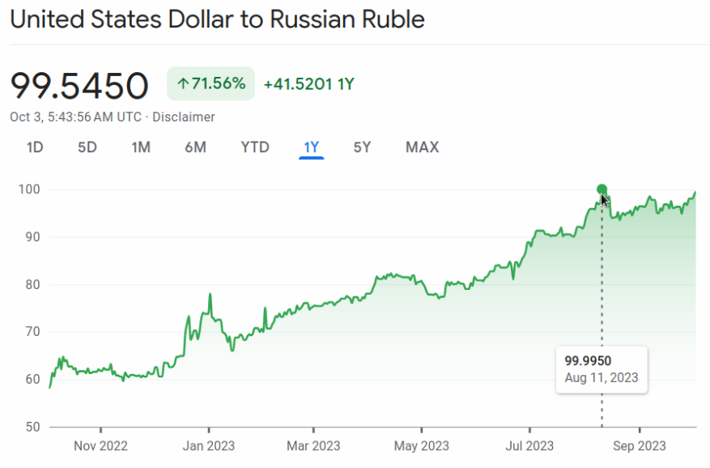

```{r setup, include=FALSE}
knitr::opts_chunk$set(echo = TRUE)
```

```{r libraries, include=FALSE}
library(tidyverse)
library(scales)
library(readxl)

theme_set(ggthemes::theme_fivethirtyeight())
main_palette_colors <- RColorBrewer::brewer.pal(12, name = "Paired")
update_geom_defaults("rect", list(fill  = main_palette_colors[2], alpha = 0.8)) 
update_geom_defaults("line", list(color = main_palette_colors[2], alpha = 0.8))
update_geom_defaults("area", list(fill  = main_palette_colors[2], alpha = 0.8))

doParallel::registerDoParallel()

rm(list = ls()); gc()

setwd(dirname(rstudioapi::getActiveDocumentContext()$path))

caption_arm = "Հեղինակ` Աղասի Թավադյան   |   tvyal.com   |   tavadyan.com"
```

```{r, include=FALSE}
russian_key_rate_link <- "https://www.cbr.ru/Content/Document/File/35859/rates_table_e.xlsx"
russian_key_rate_files <- "ru_rates.xlsx"

system(paste0("curl ", russian_key_rate_link, " -o ", russian_key_rate_files))

 
read_excel(russian_key_rate_files, sheet = "2016", skip = 1) %>% 
  # rename(c1 = 1, c2 = 2, c3 = 3, c4 = 4) %>% 
  # fill(c1, c2, c3, .direction = "down") %>% 
  # filter(!is.na(c4)) %>% 
  # mutate(
  #   c4 = str_replace(c4, "(days|year)\\d", "\\1"),
  #   c4 = str_remove(c4, ",.+$"),
  #   across(matches("c\\d"), ~str_trunc(.x, 10, ellipsis = "")),
  #   c4 = paste(c2, c3, c4, sep = "; ")
  # ) %>%
  # select(-c(c1, c2, c3)) %>% 
  # t(.) %>% as_tibble() %>% 
  # janitor::row_to_names(row_number = 1) %>%
  view()


sheets <- excel_sheets(russian_key_rate_files)[1:10]


database <- NULL
for (i in sheets) {
  data_temp <- 
    read_excel(russian_key_rate_files, sheet = i, skip = 1) %>% 
    rename(c1 = 1, c2 = 2, c3 = 3, c4 = 4) %>% 
    fill(c1, c2, c3, .direction = "down") %>% 
    filter(!is.na(c4)) %>% 
    mutate(
      c4 = str_replace(c4, "(days|year)\\d", "\\1"),
      c4 = str_remove(c4, ",.+$"),
      across(matches("c\\d"), ~str_trunc(.x, 10, ellipsis = "")),
      c4 = paste(c2, c3, c4, sep = "; ")
    ) %>%
    select(-c(c1, c2, c3)) %>% 
    t(.) %>% as_tibble() %>% 
    janitor::row_to_names(row_number = 1) %>% 
    janitor::clean_names()
  
  database <- bind_rows(database, data_temp)
}


database %>% colnames()

database %>% 
  rename(date = 1) %>% 
  mutate(
    date = str_remove(date, "Rate since "),
    date = str_remove(date, "\\(from [\\d\\:]+ Moscow time\\)"),
    date = dmy(date)
  ) %>%
  view()
  

```


***English summary below.***

Հարգելի գործընկեր,

Հուսով եմ լավ եք այս անորոշության մեջ:


Այսօր կլուսաբանեմ Ռուսական տնտեսությունը, ինչը հուսով եմ նաև կօգնի ընկալել մեր տարածաշրջանում տեղի ունեցած վերջին 2 շաբաթների իրադարձությունները։

### ՌԴ հիմնական տոկոսադրույքի բարձրացում

Վերջին երկու ամիսների ընթացքում Ռուսաստանի Կենտրոնական բանկը կայացրել է երեք արտահերթ նիստ, որոնց ընթացքում որոշվել է բարձրացնել ՌԴ ԿԲ հիմնական տոկոսադրույքը՝ 7,5%-ից հասցնելով 13%-ի։ Տոկոսադրույքների այս բարձրացումնը զգալի է Ռուսաստանի տնտեսության համար և պաշտոնապես ուղղված է գնաճի դեմ պայքարին: Այնուամենայնիվ, այս պահին գնաճի տեմպերը համեմատելի են [խխոշոր տնտեսությունների գնաճի հետ](https://tradingeconomics.com/country-list/inflation-rate-?continent=g20) (բացի Թուրքիայից և Արգենտինայից, որտեղ առկա են առանձին տնտեսական խնդիրներ)


**Գծապատկեր 1** ՌԴ ԿԲ հիմնական տոկոսադրույքը


### Գնաճի դինամիկա

Ռուսաստանում գնաճը Ուկրաինա ներխուժումից հետո 2022 թվականի փետրվարին հասել էր 18%-ի: Տոկոսադրույքի հետագա բարձրացումը մինչև 20% օգնեց զսպել գնաճը սկզբնական շրջանում: Այնուամենայնիվ, որոշակի հարցեր է առաջացնում այն, որ մի քանի ամիսների ընթացքում Ռուսաստանում գրանցվել է գնաճի աննախադեպ անկում՝ մեկ ամսում 11%-ից իջնելով 3,5%-ի: Սա նաև հուշում է նրա մասին, որ ՌԴ գնաճի վրա ավելի շատ ոչ մոնիտար ուժեր են ազդում:

**Գծապատկեր 2** ՌԴ գնաճը վերջին 12 ամսիներին


### Ռուսական ռուբլու տատանումներ

Ռուսական ռուբլին վերջին մեկ տարվա ընթացքում շարունակաբար արժեզրկվում է, և այն այժմ մեկ ԱՄՆ դոլարի փոխարեն վաճառվում է մոտ 99 ռուբլով, այն ինչ 2022 թվականի հունիսին 1 դոլարը արժեր մոտ 60 ռուբլի։ Վերջին շրջանում ռուբլու  արժեզրկումը դադարեցվել է հիմնական տոկոսադրույքի բարձրացումով։ Ամենակտրուկ բարձրացումը 3.5 տոկոսային կետով (8.5-ից 12 տոկոս) գրանցվել է օգոստոսի 15-ին հրավիրված արտահերթ նիստում։ Այդ օրը Ռուսական ռուբլին առաջին անգամ Ռուս-Ուկրաինական պատերազմի սկզբից հատեց 100 ռուբլի 1 դոլարի համար սահմանը, որից հետո հրավիրվեց արտահերթ նիստ։ Այս միջոցառումը ժամանակվորապես կանխեց ռուբլու հետագա արժեզրկումը։ Ըստ էության, տոկոսադրույքերի բարձրացումը ռուբլու անկման կանխարգելման և ամրացման փորձ է, այլ ոչ թե գնաճի զսպման միջոցառում։ Քանի որ ռուբլին շարունակում է արժեզրկվել և նորից ուզում է հատել 100 ռուբլի մեկ դոլարի համար հոգեբանական սահմանը կարելի է ակնկալել, որ մոտակա օրերը Ռուսաստանի ԿԲ կրկին կբարձրացնի հիմնական տոկոսադրույքը։

**Գծապատկեր 3** ԱՄՆ դոլար և ՌԴ Ռուբլու փոխարժեքը



**Գծապատկեր 4** Ռուսաստանի նավթամթերքից և բնական գազից ստացված արտահանման եկամուտը


### Առևտրային և ընթացիկ հաշիվ

Ռուսաստանի առևտրային հաշվեկշիռը զգալիորեն վատթարացել է վերջին շրջանում, և ներկայումս այն գտնվում է իր ամենացածր մակարդակի վրա՝ COVID-19 համաճարակից ի վեր: Այս անկմանը նպաստում են պատժամիջոցներն ու արտահանման կրճատումը։ Սա իր հերթին ճնշում է Ռուսաստանի ընթացիկ հաշվի վրա, որը վերջին 12 ամիսների ընթացքում նվազում է։ Նշեմ որ հիմնականում Ռուսաստանը իր դրական հաշվեկշիռը պատմականորեն ապահովել է նավթամթերքի և բնական գազի արտահանմամբ, ինչը վերջին ամսիսներին զգալիորեն կրճատվել է։

**Գծապատկեր 5** Ռուսաստանի ապրանքային հաշվեկշիռը


**Գծապատկեր 6** Ռուսաստանի ընթացիկ հաշվեկշիռը


### Բենզինի և դիզելի արտահանման անժամկետ դադարեցում

Սեպտեմբերի 21-ից ռուսաստանի դաշնությունը [անժամկետ արգելք է դրել նավթամթերքի արտահանման վրա](https://www.kommersant.ru/doc/6237192)։ Սա չի տարածվում ԵԱՏՄ երկրների վրա, որոնց մեջ է Հայաստանը։ Այս քայլը որոշակի հարցեր է առաջացնում, քանզի այս պահին առկա է վատթարացող առևտրային հաշվեկշիռ և Ռուսաստանին անհրաժեշտ է արտահանումը մեծացնել՝ ընթացիկ հաշվեկշռի դրական սալդոն ապահովելու համար։ Իսկ Նավթամթերըք, որի մեջ մտնում են բենզինը և դիզելային վառքլիքը, ունի ավելի մեծ ավելացված արժեք համեմատած հում նավթի։ Նշեմ, որ այս արգելքը չի տարածվում հում նավթի վրա, իսկ հում նավթի պահանջարկը Չինաստանում և Հնդկաստանում ավելի մեծ է։ Խնդիրը նրանում է, որ ՌԴ ներքին բենզինի գները վերջին շրջանում շարունակաբար աճում էին և առկա է հստակ նպատակ կայունացնել վառելիքի ներքին շուկան։ Այս պահին ռուսաստանում բերքահավաքի սեզոն է և հացահատիկի բերքահավաքի համար վառելիք չի հերիքում։ Սա պայմանավորված է նաև ռուբլու փոխարժեքի արժեզրկմամբ: Փաստացի ավելի ձեռք է տալիս արտահանել բենզինը, քան այն պահել ներքին շուկայում, որտեղ այն ունի ռուբլուն կցված կայուն գին։ Ռուսաստանին սպառնում է վառելիքի արտահանումից եկամտի կորուստ, ինչը էականորեն ազդում է տնտեսության վրա։ Այս զարգացումը բարդ մարտահրավեր է Ռուսաստանի համար, քանի որ նա ձգտում է կայունացնել իր ներքին շուկան՝ միաժամանակ գործ ունենալով արտահանման կրճատված ֆինանսական հետևանքների հետ՝ ազդելով իր տնտեսության և նավթավերամշակման գործարանների վրա:


### Եզրակացություն

Վերջին 18 ամիսների ընթացքում Ռուսաստանը հակամարտության մեջ է Ուկրաինայի հետ։ Բավականին մեծ քանակությամբ սանկցիաներ են այս պահին գործում ՌԴ տնտեսության վրա։ Սա բավականին թուլացրել է ռուսական տնտեսությունը։ Ռուսաստանը տնտեսական աճի և ընթացիկ հաշվեկշռի վերականգնման զգալի խնդիր ունի։

Ինչքան ուժեղ է տնտեսությունը, այնքան ուժեղ է պետությունը։ Վերջին ամիսները ընթացքում ՌԴ տնտեսության ցույց է տալիս որոշակի խնդիրներ, ինչը կարող է նաև հանդիսանալ տարածաշրջանի անկայունության պատճառներից մեկը։


##  English Summary

In recent months, the Russian economy has faced several significant challenges. The Central Bank of Russia raised its key interest rate from 7.5% to 13% in the declated effort to combat inflation. The depreciation of the Russian ruble, which has fallen from around 60 rubles to the dollar in June 2022 to around 99 rubles per dollar, has been temporarily halted by the interest rate increase but continues to be a concern. The deterioration of Russia's trade balance, driven by sanctions and reduced exports, has also put pressure on its current account.

One noteworthy development is the indefinite suspension of gasoline and diesel exports from Russia, except to EAEU countries. This move is puzzling, given the need to improve the trade balance and generate income, especially from higher-value oil products. The ban aims to stabilize the domestic fuel market, which has seen rising prices, exacerbated by the ruble's depreciation. However, this decision risks reducing income from fuel exports, further straining Russia's economy and refineries.

In summary, Russia's economy is facing multifaceted challenges, including high inflation, currency depreciation, deteriorating trade balances, and a complex policy response to its domestic fuel market. These issues are occurring against the backdrop of ongoing conflict 

   

                  
Այս վերլուծությունը առկա է նաև [մեր կայքեջում](https://www.tvyal.com/newsletter/2023_10_03), այս վերլուծության կոդը դրված է նաև [Github-ում](https://github.com/tavad/tvyal_newsletter)։            

Եթե հնարավոր է, խնդրում եմ այս նյութը ուղարկել նաև այն մարդկանց, ում այն կարծում եք կարող է հետաքրքրել:

Սպասեք հաջորդ հաղորդագրությանը մի շաբաթվա ընթացքում:        

          
           
           


Հարգանքներով,            
Աղասի Թավադյան         
03.10.2023          
[tvyal.com](https://www.tvyal.com/)      
[tavadyan.com](https://www.tavadyan.com/)

       
              
               


####### **Ուշադրություն. Ձեր էլ.փոստը մեյլիսթի մեջ է, որի միջոցով ես կիսվում եմ շաբաթական նյութեր, որոնք հիմնականում ներկայացնում են Հայաստանի տնտեսությանը: Նյութերը ներառում են գծապատկերներ, [տվյալների բազաներ](https://github.com/tavad/tvyal_newsletter), տեսանյութեր, հոդվածներ, [առցանց վահանակներ](https://www.tvyal.com/projects), տնտեսական գործիքներ, կանխատեսումներ և հաշվետվություններ: Եթե ցանկանում եք չեղարկել բաժանորդագրությունը, խնդրում եմ տեղեկացրեք ինձ, և ես կհեռացնեմ ձեր էլ. փոստը ցուցակից: Գրեք նաև եթե ունեք մենկնաբանություններ:**

####### **Important! Your email is part of the mailing list where I share weekly materials primarily focused on the Armenian economy. These materials encompass charts, [databases](https://github.com/tavad/tvyal_newsletter), videos, articles, [online dashboards](https://www.tvyal.com/projects), economic tools, forecasts, and reports. If you wish to unsubscribe, please let me know, and I will remove your email from the list. Please share your comments as well․**

