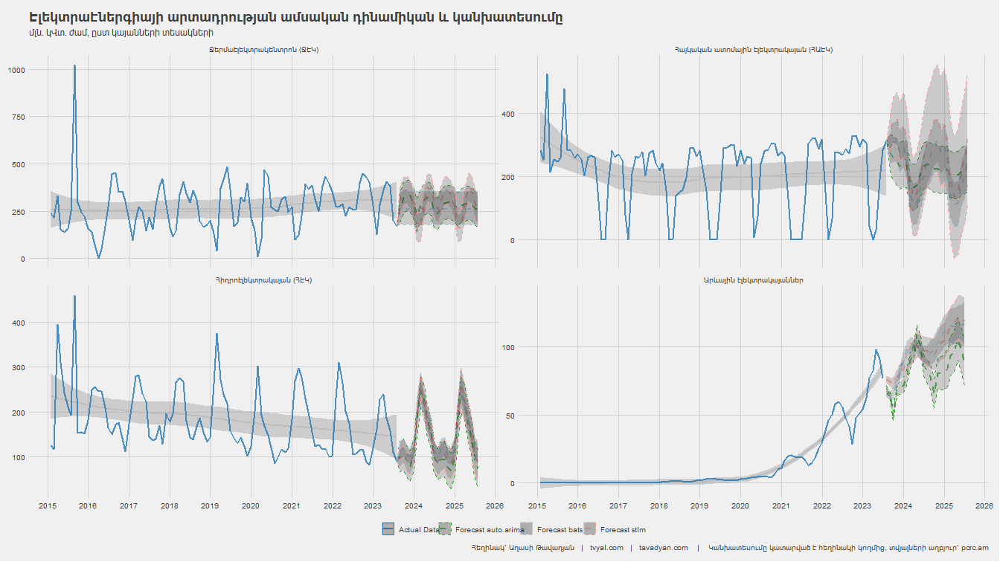
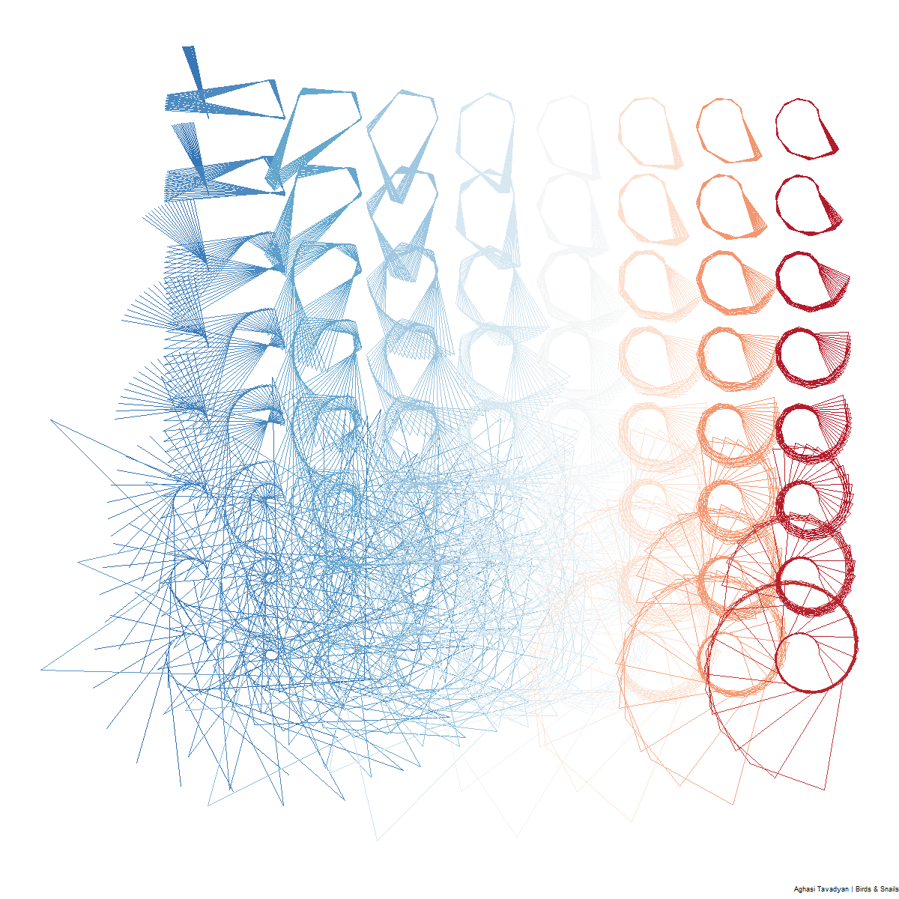

```{r setup, include=FALSE}
knitr::opts_chunk$set(echo = TRUE)

library(tidyverse)
library(rvest)
library(RcppRoll)
library(scales)
library(readxl)

rm(list = ls()); gc()

theme_tvyal <- function(base_size = 12, base_family = "sans") 
{
  colors <- deframe(ggthemes::ggthemes_data[["fivethirtyeight"]])
  (ggthemes::theme_foundation(
    base_size = base_size, base_family = base_family) + 
      theme(
        line = element_line(colour = "black"), 
        rect = element_rect(fill = "white", linetype = 0, colour = NA),
        text = element_text(colour = colors["Dark Gray"]), 
        # axis.title = element_blank(),
        # axis.text = element_text(), 
        axis.ticks = element_blank(),
        axis.line = element_blank(), 
        legend.background = element_rect(), 
        legend.position = "bottom", 
        legend.direction = "horizontal", 
        legend.box = "vertical", 
        panel.grid = element_line(colour = NULL), 
        panel.grid.major = element_line(colour = colors["Medium Gray"]), 
        panel.grid.minor = element_blank(), 
        plot.title = element_text(hjust = 0, size = rel(1.5), face = "bold"),
        plot.margin = unit(c(1, 1, 1, 1), "lines"), strip.background = element_rect()
      )
  )
}

theme_set(theme_tvyal())

save_last_plot <- 
  function(filename, extension = "png", width = 1344, height = 756) {
    
    filename <- str_replace_all(filename, " ", "_")
    last_plot <- recordPlot()
    
    if (extension == "png") {
      png(paste0(filename, ".", extension), width = width, height = height)
    } else if (extension == "pdf") {
      pdf(paste0(filename, ".", extension), width = width, height = height)
    } else {
      stop("Unsupported file extension. Use 'png' or 'pdf'.")
    }
    
    replayPlot(last_plot)
    dev.off()
    paste0(filename, ".", extension)
  }

new_palette_colors <- c(
  "#003f5c", "#2f4b7c", "#665191", "#a05195", 
  "#d45087", "#f95d6a", "#ff7c43", "#ffa600"
)
update_geom_defaults("rect", list(fill  = new_palette_colors[1], alpha = 0.8)) 
update_geom_defaults("line", list(color = new_palette_colors[1], alpha = 0.8))
update_geom_defaults("area", list(fill  = new_palette_colors[1], alpha = 0.8))

caption_arm <-  "Հեղինակ` Աղասի Թավադյան   |   tvyal.com   |   tavadyan.com"
caption_eng <-  "Author: Aghasi Tavadyan   |   tvyal.com   |   tavadyan.com"

doParallel::registerDoParallel(cores = 8)

setwd(dirname(rstudioapi::getActiveDocumentContext()$path))
```

```{r downloading GDP data, include=FALSE}
national_account_html_elements <- 
  read_html("https://www.armstat.am/am/?nid=202") |> 
  html_elements("a")

national_account_urls <- 
  tibble(
    url = html_attr(national_account_html_elements, "href"),
    text = html_text(national_account_html_elements)
  ) |> 
  filter(grepl("^\\.\\./", url)) |> 
  mutate(
    text = str_trim(text),
    url = str_replace(url, "^\\.\\.", "https://www.armstat.am")
    ) |> 
  filter(text != "")

GDP_services_links <- 
  national_account_urls |> 
  filter(grepl("ծառայությունների թողարկում", text)) |> 
  pull(url)

# system(
#   paste0("curl -A 'Mozilla/5.0' \"", GDP_services_links[2],
#          "\" -o \"GDP_services.xls\"")
# )

GDP_services <-
  read_excel("GDP_services.xls", skip = 4) |> 
  rename(code = 1, arm = 2, eng = 3, rus = 4) |> 
  pivot_longer(matches("\\d{4}"), names_to = "date")

GDP_services |> write_excel_csv("GDP_services_tidy.csv")
```


```{r constructing the main GDP plot, include=FALSE}

main_GDP_plot_data <- 
  GDP_services |> 
  filter(!is.na(code)) |> 
  mutate(
    date = yq(date) + months(3) - days(1),
    year = year(date),
    eng = str_trunc(eng, 20),
    eng = paste0(code, ". ", eng),
    eng = fct_lump(eng, n = 7, w = value)
  ) |> 
  group_by(date, year, eng) |> 
  summarise(value = sum(value), .groups = "drop") |> 
  group_by(eng) |> 
  mutate(value_yoy = roll_sumr(value, 4)) |> 
  ungroup() |> 
  group_by(date) |>
  na.omit() |>
  mutate(
    pct = value_yoy/ sum(value_yoy),
  ) |> 
  ungroup() |>
  group_by(year) |> 
  mutate(
    pct_text = ifelse(
      eng != "Other" & date == max(date) & year %in% c(2013, 2023), 
      paste0(
        "֏ ", number(value_yoy/1e6, accuracy = 0.01), "T (",
        percent(pct, accuracy = 0.1), ")", " "
        ),
      NA
    ),
    pct_text = ifelse(
      year == 2023 & eng != "Other",
      paste0(" ", eng,  " ", pct_text),
      pct_text
    ),
    value_yoy = value_yoy / 1e6
  ) |> 
  ungroup()

factoring_levels <- 
  main_GDP_plot_data |> 
  filter(date == max(date)) |> 
  mutate(
    eng = fct_reorder(eng, value_yoy),
    eng = fct_relevel(eng, "Other", after = 0),
    eng = fct_rev(eng)
  ) |> 
  count(eng) |> 
  pull(eng)

main_GDP_plot_data <- 
  main_GDP_plot_data %>%
  mutate(eng = factor(eng, levels = factoring_levels))
         

segments <- 
  main_GDP_plot_data |> 
  # filter(year %in% c(2013, 2017, 2020, 2023)) |> 
  group_by(year) |> 
  filter(date == max(date)) |> 
  ungroup() |> 
  group_by(date) |> 
  summarise(
    value_yoy = sum(value_yoy),
    value_yoy_text = number(value_yoy, accuracy = 0.01),
    value_yoy = value_yoy + 1
  ) |>  
  ungroup()


GDP_main_plot <- 
  main_GDP_plot_data |> 
  ggplot(aes(date, value_yoy)) +
  geom_segment(
    data = segments,
    aes(x = date, y = value_yoy - 1, xend = date, yend = value_yoy),color="black"
  ) +
  geom_point(
    data = segments,
    aes(x = date, y = value_yoy),color="black"
  ) +
  geom_text(
    data = segments,
    aes(x = date, y = value_yoy + 0.5, label = value_yoy_text)
  ) +
  geom_area(aes(fill = eng)) +
  geom_text(
    data = main_GDP_plot_data |> filter(date == min(date)),
    aes(label = pct_text, color = eng),
    position = position_stack(vjust = 0.5), hjust = 1
  ) +
  geom_text(
    data = main_GDP_plot_data |> filter(date == max(date)),
    aes(label = pct_text, color = eng),
    position = position_stack(vjust = 0.5), hjust = -0
  ) +
  scale_x_date(date_breaks = "1 year", date_labels = "%Y") +
  scale_y_continuous(breaks = seq(0, 14, 2), labels = number_format()) +
  scale_fill_manual(values = new_palette_colors) +
  scale_color_manual(values = new_palette_colors) +
  coord_cartesian(clip = "off") +
  ggthemes::theme_fivethirtyeight() +
  labs(
    x = NULL,
    y = NULL,
    fill = NULL,
    title = "The Change from Agriculture to Manufacturing",
    subtitle = "Output of Goods and Service in Armenia",
    captions = paste0(caption_eng, "    |    Data Source: armstat.am")
  ) +
  theme_minimal() +
  theme(
    axis.line.x = element_line(linewidth = .75),
    plot.title = element_text(size = 20),
    plot.subtitle = element_text(size = 18),
    panel.grid = element_blank(),
    axis.text.y=element_blank(),
    legend.position = "none",
    plot.margin = margin(10,210,10,100),
  )

```


```{r gas imports, include=FALSE}
GDP_change_plot <- 
  GDP_services |> 
  filter(!is.na(code)) |> 
  mutate(
    date = yq(date) + months(3) - days(1),
    year = year(date),
    eng = str_trunc(eng, 40),
    eng = paste0(code, ". ", eng),
  ) |> 
  group_by(code) |> 
  mutate(value_yoy = roll_sumr(value, 4) / 1e3) |> 
  na.omit() |> 
  filter(date %in% c(max(date), min(date))) |>
  # filter(date %in% c(max(date), as.Date("2018-03-31"))) |> 
  mutate(year = ifelse(year == min(year), "min_year", "max_year")) |> 
  select(code, eng, year, value_yoy) |> 
  pivot_wider(names_from = year, values_from = value_yoy) |> 
  mutate(
    pct_10y_change = number(max_year / min_year, accuracy = 0.01),
    middle_year = exp((log(min_year) + log(max_year))/2)  # geomean
  ) |>
  filter(code != "T") |> 
  ggplot() +
  geom_segment(
    aes(x = min_year, xend = max_year, y = fct_reorder(eng, max_year), yend = eng),
    color = new_palette_colors[1]
  ) +
  geom_point(aes(x = min_year, y = eng), color = new_palette_colors[3], size = 3) +
  geom_point(aes(x = max_year, y = eng), color = new_palette_colors[4], size = 3) +
  geom_text(aes(x = middle_year, y = eng, label = pct_10y_change), vjust = 0) +
  geom_point(aes(x = 450, y = 2.5), color = new_palette_colors[3], size = 3) +
  geom_point(aes(x = 450, y = 1.5), color = new_palette_colors[4], size = 3) +
  geom_text(aes(x = 600, y = 2.5, label = 2013)) +
  geom_text(aes(x = 600, y = 1.5, label = 2023)) +
  scale_x_log10(labels = number_format()) +
  labs(
    x = "Billion AMD",
    y = NULL,
    title = "From 2013 to 2023, what area had the biggest growth in GDP?",
    subtitle = "The numbers show the growth rate",
    captions = paste0(caption_eng, "    |    Data Source: armstat.am")
  )


```


***English summary below.***

Հարգելի գործընկեր,

Հուսով եմ լավ եք:
Ներկայացնում եմ անցած շաբաթվա վերլուծությունները և աշխատանքները.

1. Գյուղատնտեսությունից արդյունաբերություն անցումը
2. Սխալների ուղղում
3. ԶԼՄ հաղորդագրություններ
4. English summary
5. Նվեր Ամանորի նախօրեին / A little gift before Christmas


## 1. Գյուղատնտեսությունից արդյունաբերություն անցումը

### Կամ գյուղատնտեսությունը կոլապսի է ենթարվել

Ընդհանուր առմամբ այս 10 տարում ՀՆԱ-ն ավելի քան կրկնապատկվել է` 2013-ին կազմելով 6.38 տրիլիոն դրամ, իսկ 2023-ին ակնկալվում է որ ՀՆԱ-ն լինելու է ավելի քան 13 տրլն դրամ:
10 տարի առաջ 2013 թվականին Հայաստանի ՀՆԱ-ի 19.5 տոկոսը ապահովում էր գյուղատնտեսությունը, որը կազմում էր 1.24 տրիլիոն դրամ, արդյունաբերությունը գտնվում էր երկրորդ տեղում` կազմելով ՀՆԱ-ի 14.3 տոկոսը, կամ 920 մլրդ դրամ:

2023 թվականին պատկերը հակառակն է արդյունաբերությունը արդեն գտնվում է առաջին տեղը` ապահովելով ՀՆԱ-ի 17.3 տոկոսը, իսկ գյուղատնտեսությունը այս 10 տարվա մեջ գրեթե 20 տոկոս բաժնեմասից իջել է 10.2 տոկոսի:

Հուշագրավ է, որ այս 10 տարվա մեջ ՀՆԱ-ն աճել է ավելի քան 2 անգամ, իսկ գյուղատնտեսությունը գրեթե աճ չի արձանագրել աճելով չնչին 5 տոկոսով: Արդյունաբերությունը այս 10 տարվա մեջ աճել է 2.5 անգամ: Գյուղատնտեսությունը արդեն գտնվում է 3-րդ տեղում արդյունաբերությունից և մեծածախ ու մանրածախ առևտրից հետո:

Դիտարկենք նաև շինարարություն ոլորտը, որի մասնաբաժինը այս 10 տարիների ընթացքում 13-ից իջել է 9.1 տոկոս: Այս ոլորտում արձանագրվել է 40 տոկոս աճ: Անշարժ գույքի հետ կապված գործունեությունը (L) աճել է ավելի քան 2 անգամ:


**Գծապատկեր 1.**  ՀՆԱ մեջ ապրանքների և ծառայությունների թողարկումն փոփոխությունը

```{r, echo=FALSE, warning=FALSE, fig.width = 12, fig.height = 8}
GDP_main_plot
```

Դիտարկենք թե ապրանքների և ծառայությունների թողարկման որ ճյուղերն են ունեցել ամենազգալի աճը այս 10 տարիների ընթացքում:

Ինչպես երևում է միակ ճյուղը որը գրեթե նույն է մնացել այս 10 տարիների ընթացքում` դա գյուղատնտեսությունն է: Այս ճյուղը այս ընթացքում աճ չի արձանագրել: Եթե հաշվի առնենք նաև գնաճը, ապա աճի տենդենցը բացասական է եղել: Փաստացի գրեթե բոլոր ճյուղերը գրանցել են 2 և ավելի անգամ աճ, բացի գյուղատնտեսությունից:

Ամենամեծ աճը գրանցել է (I) Կացության և հանրային սննդի կազմակերպման և (R) Մշակույթի, զվարճությունների և հանգիստի ոլորտները որոնք այս 10 տարիների ընթացքում աճել են համապատասխանաբար ավելի քան 4.7 և 4 անգամ: Սա առաջին հերթին խոսում է Հայաստանում տուրիզմի զարգացման վերաբերյալ:

Ֆինանսական և ապահովագրական գործունեությունը աճել է ավելի քան 3.6 անգամ

* նշում. Այս հետազոտության մեջ 2023 թվականի տվյալները 2023 թվականի 1-ին, 2-րդ, 3-րդ, ինչպես նաև 2022 թվականի 4-րդ եռամսյակի կումուլատիվ գումարն են, որը ներկայացնում է տարեկան արժեքը:


**Գծապատկեր 2.** ՀՆԱ կառուցվածքի 2013-ից մինչև 2023 աճի համեմատություն

```{r, echo=FALSE, warning=FALSE, fig.width = 12, fig.height = 8}
GDP_change_plot
```


## 2. Սխալների ուղղում

Նախորդ նյութի մեջ առկա է կանխատեսման սխալ, որը պատճառը այն է որ [2023թ հուլիսից վիճակագրական կոմիտեում տեղադրված էլեկտրաէներգիայի արտադրության ծավալներում](https://www.armstat.am/file/article/sv_07_23a_121.pdf) ներառված են նաև էլեկտրաէներգիայի փոխհոսքերի մասով ինքնավար արտադրողների կողմից արտադրված էլեկտրաէներգիայի ծավալները: Տվյալների բազան ստացել է այս հաշվետվությունները համացանցից ավտոմատացված կերպով ներբեռնելով և տվյալների բազայի ավտոմատացված հաշվարկմամբ, որտեղ ամսվա տվյալը ստացվել է տվյալ ամսից հանելով նախորդ ամսվա կումուլատիվ գումարը:

Այս հանգամանքով անցած շաբաթ Ձեզ ուղարկած նյուզլեթերի մեջ 2023 թվականի հունի արևային էլեկտրաէներգիայի արտադրության տվյալը իր մեջ ներառում է այդ ամսվա կոմերցիոն արտադրության ծավալները, ինչպես նաև 2023 թվականի սկզբից մինչև հունիսը ներառյալ ինքնավար արտադրողների կողմից արտադրված էլեկտրաէներգիայի ծավալները: Դա է պատճառը որ տվյալների մեջ առկա է հանկարծակի և չկրկնվող աճ 2023թ. հունիսին, որը ենթադրաբար կազմում էր այդ ամսվա արտադրության մոտ 30 տոկոսը: Սա սխալ է:

Նախորդ վերլուծության մեջ բոլոր գծապատկերները, հաշվարկները, կանխատեսումները և տեքստը արդեն ուղղված են: [Սեղմեք այս հղումը ճշգրտված տարբերակին անցնելու համար](https://www.tvyal.com/newsletter/2023_12_11): [Հին տարբերակը չի ջնջվի և լինելու է այս հղման տակ](https://www.tvyal.com/newsletter/2023_12_11_old):

Գծապատկերում արտացոլված էլեկտրաէներգիայի արտադրության տարեկան ծավալների ճշգրտված կանխատեսումը


**Գծապատկեր 3.** Էլեկտրաէներգիայի արտադրության տարեկան ծավալները և կանխատեսումը





## 3. ԶԼՄ հաղորդագրություններ

[Panorama.am](https://www.youtube.com/watch?v=FV0NqHOHfY4) լրատվամիջոցին տվել եմ հարցազրույց: 

Այս վիդիոնյութը, ըստ իս, դեռևս իմ ամենաանմիջական զրույցներից է: Խորհուրդ եմ տալիս դիտել այն:
Պետք է հասկանալ, թե 2023 թ.-ին ինչու չունեցանք 2022 թ-ի չափ բարձր տնտեսական աճ:

<a href="https://www.youtube.com/watch?v=FV0NqHOHfY4">
  
</a>


## 4. English Summary

**The transition from agriculture to industry in Armenia**

In the past decade, Armenia has undergone a transformative shift from an agriculture-dominated economy to one led by industry. In 2013, agriculture contributed 19.5% to the GDP, amounting to 1.24 trillion drams, while industry held the second spot with 14.3% at 920 billion drams. Fast forward to 2023, industry has claimed the top spot, constituting 17.3% of the GDP, while agriculture has seen a decline from nearly 20% to 10.2%. Despite an overall GDP growth of over 2 times, agriculture has only experienced a marginal 5% increase, placing it in 3rd position after industry and wholesale/retail trade. Notably, the construction sector has witnessed a 40% increase, although its share in the GDP has decreased from 13% to 9.1% over the same period.

Examining the growth trajectory of various sectors reveals a stark contrast. While almost all industries recorded a 2-fold or more growth, agriculture remained stagnant, registering minimal positive growth even when adjusted for inflation. Branches like Accommodation and Catering, as well as Culture, Entertainment, and Recreation, stood out with growth rates exceeding 4.7 and 4 times, signaling a burgeoning tourism industry in Armenia. Financial and insurance activities also experienced significant expansion, increasing more than 3.6 times. This dynamic shift underscores Armenia's evolving economic landscape and the rising prominence of diverse sectors beyond traditional agriculture.


## 5. Նվեր Ամանորի նախօրեին / A little gift beforе Christmas

Ձեզ եմ ընծայում իմ կողմից կոդով ստեղսված նկարը:

Անվանումը` **Թռչուններ և խխունջներ**

Title: **Birds & Snails**



Սպասեք ավելի շատ նվարներ հաջորդ նյուզլեթերին, որը լինելու է մեր կողմից պատրաստած այս տարվա վերջին հաղորդագրությունը:


---

Այս վերլուծությունը առկա է նաև [մեր կայքէջում](https://www.tvyal.com/newsletter/2023_12_18), այս վերլուծության կոդը և տվյալները դրված են նաև [Github-ում](https://github.com/tavad/tvyal_newsletter)։                        
---                  

Եթե հնարավոր է, խնդրում եմ այս նյութը ուղարկել նաև այն մարդկանց, ում այն կարծում եք կարող է հետաքրքրել:

Սպասեք հաջորդ հաղորդագրությանը մի շաբաթվա ընթացքում:        


Հարգանքներով,            
Աղասի Թավադյան         
18.12.2023          
[tvyal.com](https://www.tvyal.com/)      
[tavadyan.com](https://www.tavadyan.com/)

---

[Was this email forwarded to you? Subscribe here.](https://www.tvyal.com/subscribe)

[Բաժանորդագրվեք](https://www.tvyal.com/subscribe)

       
---              
               


####### **Ուշադրություն. Ձեր էլ.փոստը մեյլիսթի մեջ է, որի միջոցով ես կիսվում եմ շաբաթական նյութեր, որոնք հիմնականում ներկայացնում են Հայաստանի տնտեսությանը: Նյութերը ներառում են գծապատկերներ, [տվյալների բազաներ](https://github.com/tavad/tvyal_newsletter), տեսանյութեր, հոդվածներ, [առցանց վահանակներ](https://www.tvyal.com/projects), տնտեսական գործիքներ, կանխատեսումներ և հաշվետվություններ: Եթե ցանկանում եք չեղարկել բաժանորդագրությունը, խնդրում եմ տեղեկացրեք ինձ, և ես կհեռացնեմ ձեր էլ. փոստը ցուցակից: Գրեք նաև եթե ունեք մենկնաբանություններ:**

####### **Important! Your email is part of the mailing list where I share weekly materials primarily focused on the Armenian economy. These materials encompass charts, [databases](https://github.com/tavad/tvyal_newsletter), videos, articles, [online dashboards](https://www.tvyal.com/projects), economic tools, forecasts, and reports. If you wish to unsubscribe, please let me know, and I will remove your email from the list. Please share your comments as well․**


