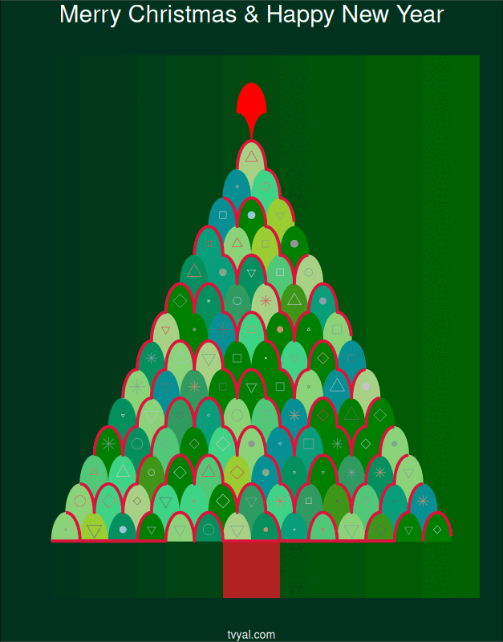

```{r setup, include=FALSE}
knitr::opts_chunk$set(echo = TRUE)

library(tidyverse)
library(scales)
library(gganimate)
library(transformr)

rm(list = ls()); gc()

setwd(dirname(rstudioapi::getActiveDocumentContext()$path))
```

**Հարգելի գործընկեր,**

## **Շնորհավոր Ամանոր և Սուրբ Ծնունդ**

🎄🎅🎁✨🔔🕯️🦌🎉🍪🥛⛄🌨️🧤🧣🍬🍭

Շնորհակալ եմ որ հետևում եք մեր գործունեությանը։

Thanks for your time and for hanging with us.

[](https://forms.gle/C7ouBuBafxquDiRN9)

## Ամփոփենք տարին

* գրեթե կես տարի՝ 25 շաբաթ, 25 վերլուծություն ⏳
* ավելի քան 10 հազար տող կոդ 💻
* ավելի քան 50 գծապատկեր 📊
* 930 էլ փոստ բաժանորդագրվածների ցանկում 📬

## Let's summarize the year

* Almost half a year: 25 weeks, 25 analyses ⏳
* More than 10 thousand lines of code 💻
* More than 50 plots 📊
* 930 subscribed emails 📬


## Խնդրում եմ գնահատեք մեր գործունեությունը

## Please rate our work

[Հարցումը կարճ է:](https://forms.gle/C7ouBuBafxquDiRN9)

[](https://forms.gle/C7ouBuBafxquDiRN9)

Հաջորդ շաբաթ նյուզլեթեր չի լինի։ Կհանդիպենք հաջորդ տարի։ Բարի հանգստյան օրեր։


## ԶԼՄ հաղորդագրություններ

[Դիտեք Նվեր Մնացականյանին տված իմ վերջին հարցազրույցը, որտեղ ամփոփում եմ 2023-ը։](https://www.youtube.com/watch?v=YbMAqFJkfeU)

Հարցազրույցում շոշափվել են հետևյալ թեմաները։

* Ինչո՞ւ 2023 թվականին Հայաստանում 242 մլրդ դրամով ավել հարկ է հավաքվել։
* Հայաստանի տնտեսությունն աճել է 7 տոկոսով՝ զբոսաշրջություն և ՏՏ լոկոմոտիվներ։
* Շինարարները Ռուսաստանից վերադառնում են Հայաստան. դրամն ամրապնդվում է ռուբլու նկատմամբ։

<a href="https://www.youtube.com/watch?v=YbMAqFJkfeU">
  
</a>


## The Christmas Tree code

Ձեզ ուղարկվող բոլոր վերլուծությունները պատրաստվել են կոդի միջոցով` հիմնականում R և markdown ծրագրավորման լեղվով։ Օֆիսային ծրագրեր չեն օգտագործվել հետազոտությունների իրականցման մեջ։ Բոլոր վերլուծությունները առկա են նաև [մեր կայքէջում](https://www.tvyal.com/newsletter), բոլոր վերլուծությունների կոդը և տվյալները դրված են [Github-ում](https://github.com/tavad/tvyal_newsletter)։

🎄 Այսօր առաջին անգամ որոշեցի ձեր հետ կիսվել նաև կոդով։ Այս պարագայում տոնածառի գծագրման կոդով։ 🎄

Ցանկանում եմ **ոգեշնչվեք ու ոգեշնչեք** եկող տարի։

-------------

The main colors of the Christmas Three and the main parameter `scale_factor`, which desides the hight of the three and ajast everything acordingly.

```{r setting the main colors}

# Change to adjust the tree height. Provide an odd number to works properly
scale_factor = 15

# defining the colors
tree_colors = c(
  "#A8D185", "#04905E", "#9acd32", "#3D9618", "#8AD378", "#3FD485",
  "#089E79", "#079094", "#2F9B61", "#50C878", "#008000", "#008000"
)

bauble_colours = c(
  "#646F75", "#949399", "#8C9EAA", "#C3C4C6",
  "#9CC6D4", "#CD936D", "#DB7076", "#E04C52"
)

garland_reds <- c(
  "#ff0000", "#ffa07a", "#fa8072", "#ff6347",
  "#cd5c5c", "#ff4500", "#dc143c", "#b22222"
)

green_shades <- 
  tibble(
    x = seq(0, scale_factor, by = 1),
    y = scale_factor/2 + 1,
    fill = colorRampPalette(c("#013220", "darkgreen"))(scale_factor + 1)
  )
 
set.seed(1234)
```

Constructing the Christmas Tree toys (bubbles) database and ploting it.

```{r tree bubbles}
# Christmas tree bubbles database
bubbles <- 
  crossing(
    x = 1:(scale_factor*2),
    y = 1:scale_factor
  ) |> 
  filter(
    x %% 2 != y %% 2,
    y <= x,
    y <= -x + max(x)
  ) %>%
  mutate(
    x = x / 2,
    shp = sample(1:6, nrow(.), replace = T),
    sz = sample(seq(0.5, 1, by=0.1), nrow(.), replace = T),
    color = sample(bauble_colours, nrow(.), replace = T),
  )

# Let's see the bubbles in a plot
bubbles |> 
  ggplot(aes(x = x, y = y + 0.4, shape = factor(shp), size=sz, color = I(color))) +
  geom_point() +
  scale_shape_manual(values = c(20:24,8))
```

Constructing the three database with geometric scales and the tree topper. Below is the plot of Christmas three scales. Here the heavy lifting does the x^2 + y^2 = 1 circle equation: `y_prime = sqrt(1 - x_prime^2)`.

```{r tree and the treetopper database}

main_shape_contour <- function(tbl) {
  tbl <- 
    tbl |> 
    mutate(
      y_prime = sqrt(1 - x_prime^2),
      y_prime2 = ifelse(x_prime >= 0, x_prime - 1, x_prime + 1),
      y_prime2 = sqrt(1 - (y_prime2)^2)-1,
      x_prime = x_prime + x,
      y_prime = y_prime + y,
      y_prime2 = y_prime2 + y,
      x_prime = x_prime / 2,
      x = x / 2,
    ) |> 
    pivot_longer(contains("y_prime"), values_to = "y_prime") |> 
    filter(y_prime >= 1)
  
  return(tbl)
}

main_tree <- 
  crossing(
    x = 1:(scale_factor*2),
    y = 1:scale_factor,
    x_prime = seq(-1, 1 , 0.01)
  ) |> 
  filter(
    x %% 2 != y %% 2,
    y <= x,
    y <= -x + max(x)
  ) %>%
  mutate(
      color = sample(tree_colors, nrow(.), replace = TRUE)
  ) %>% 
  main_shape_contour()

treetopper_data <- 
  tibble(
    x = scale_factor, 
    y = scale_factor + 1,   
    x_prime = seq(-1, 1 , 0.01)
  ) |> 
  main_shape_contour() |> 
  crossing(
    nesting(
      linetype = as.factor(1:7), 
      color = sample(garland_reds, 7)
    )
  )

# Let's see the tree in a plot
main_tree |> 
  ggplot(aes(x_prime, y_prime, group = paste(x, y))) +
  geom_polygon(aes(fill = I(color), color = I(color))) 

```

This function was the hardest. It randomly constructs a garland line that mimics the scales of the Tree.

```{r adding the garland}

# This function plots a random gerland based on the geometry of the tree
garland <-
  function(len = scale_factor * 2, resalution = 500) {
    j = NULL
    j[1] = 0
    
    for (i in 1:len) {
      # j[i + 1] = cumsum(j)
      if ((i + sum(j)) %% 2 == 0) {
        j[i + 1] = sample(c(0, 1), size = 1)
      } else{
        j[i + 1] = sample(c(0, -1), size = 1) 
      }
    }
    
    j = tail(j, -1)
    
    data <- 
      tibble(
        x_floor = 1:len,
        y_floor = cumsum(j)
      ) |> 
      crossing(x = seq(0, 1 - 1/resalution, 1/resalution)) |> 
      mutate(
        x = x_floor + x,
        y = case_when(
          (x_floor + y_floor) %% 2 == 0 ~ sqrt(1 - (x %% x_floor)^2),
          (x_floor + y_floor) %% 2 == 1 ~ sqrt(1 - (x %% x_floor - 1)^2),
        ),
        y = y + y_floor
      ) |> 
      select(x,y)
    
    return(data)
  }

# An exsample of a random garland
garland() |> 
  ggplot(aes(x,y)) +
  geom_line()
```

This functin just multiples the said random garland to be drown all over the Three.

```{r multiplaying the garland to rap up it across the tree}
garland_multiplayer <-
  function() {
  
    garland(resalution = 70) |> 
      crossing(
        nesting(
          linetype = as.factor(1:7), 
          color = sample(garland_reds, 7)
        ),
        nesting(
          hight = seq(-scale_factor, scale_factor * 2, 2),
        )
      ) |> 
      arrange(hight) |> 
      mutate(
        y = y + hight
      ) |> 
      filter(
        y > 1,
        floor(y) <= floor(x),
        floor(y) <= -floor(x) + max(x) - 1
      ) |> 
      mutate(x = x /2)
  }

# let's see multiplied garlands
garland_multiplayer() |> 
  filter(linetype == "1") |> 
  ggplot(aes(x, y, color = I(color), group = hight)) +
  geom_line()
```

Finialy. Combining everything and animating.

```{r combining everything together}
# Combine everything together in a animation

christmas_tree_animation <- 
  main_tree |> 
  ggplot(aes(x_prime, y_prime, group = paste(x, y))) +
  geom_tile(
    data = green_shades, 
    aes(x, y, width = 1, height = scale_factor * 1.266667, fill = I(fill))
  ) +
  geom_tile(aes(x = scale_factor/2, y = 0, width = 2, height = 2), fill = "#b22222") +
  geom_polygon(aes(fill = I(color), color = I(color))) +
  geom_point(
    data = bubbles, 
    aes(x = x, y = y + 0.4, shape = factor(shp), size=sz, color = I(color)), 
    show.legend = F
  ) +
  geom_line(
    data = garland_multiplayer(),
    aes(
      x, y, 
      linetype = as.factor(linetype),
      group = hight, color = I(color)
    ),
    linewidth = 1.8
  ) +
  geom_line(
    data = treetopper_data,
    aes(
      x_prime, y_prime, 
      linetype = as.factor(linetype),
      group = paste(x, y), color = I(color)
    ),
    linewidth = 1
  ) +
  labs(
    title = "Merry Christmas & Happy New Year",
    subtitle = NULL,
    caption = "tvyal.com"
  ) +
  scale_shape_manual(values = c(20:24,8)) +
  theme_void() + 
  coord_fixed() +
  theme(
    legend.position = "drop",
    plot.background = element_rect(fill="#013220"), 
    title = element_text(colour="white"),
    plot.title = element_text(
      size = 30, hjust = 0.5,
      margin = margin(t = 30, unit = "pt")
    ),
    plot.caption = element_text(
      size = 14, hjust = 0.5, 
      margin = margin(b = 12, unit = "pt")
    )
  ) +
  transition_states(linetype, transition_length = 2, state_length = 1) +
  enter_fade() +
  exit_fade()
```

Rendering and saving the animation.

```{r rendering and saving the animation, eval=FALSE}

animate(
  christmas_tree_animation,
  nframes = 26,
  width = 600,
  height = 806
)

gganimate::anim_save("christmas_tree_animation.gif")
```


**The end result:**

[](https://forms.gle/uwSiJNazakfP2EGj7)


---
               

Եթե հնարավոր է, խնդրում եմ այս նյութը ուղարկել նաև այն մարդկանց, ում այն կարծում եք կարող է հետաքրքրել:

Սպասեք հաջորդ հաղորդագրությանը մի շաբաթվա ընթացքում:        


Հարգանքներով,            
Աղասի Թավադյան         
25.12.2023          
[tvyal.com](https://www.tvyal.com/)      
[tavadyan.com](https://www.tavadyan.com/)

---

[Was this email forwarded to you? Subscribe here.](https://www.tvyal.com/subscribe)

[Բաժանորդագրվեք](https://www.tvyal.com/subscribe)

       
---              
               


####### **Ուշադրություն. Ձեր էլ.փոստը մեյլիսթի մեջ է, որի միջոցով ես կիսվում եմ շաբաթական նյութեր, որոնք հիմնականում ներկայացնում են Հայաստանի տնտեսությանը: Նյութերը ներառում են գծապատկերներ, [տվյալների բազաներ](https://github.com/tavad/tvyal_newsletter), տեսանյութեր, հոդվածներ, [առցանց վահանակներ](https://www.tvyal.com/projects), տնտեսական գործիքներ, կանխատեսումներ և հաշվետվություններ: Եթե ցանկանում եք չեղարկել բաժանորդագրությունը, խնդրում եմ տեղեկացրեք ինձ, և ես կհեռացնեմ ձեր էլ. փոստը ցուցակից: Գրեք նաև եթե ունեք մենկնաբանություններ:**

####### **Important! Your email is part of the mailing list where I share weekly materials primarily focused on the Armenian economy. These materials encompass charts, [databases](https://github.com/tavad/tvyal_newsletter), videos, articles, [online dashboards](https://www.tvyal.com/projects), economic tools, forecasts, and reports. If you wish to unsubscribe, please let me know, and I will remove your email from the list. Please share your comments as well․**


