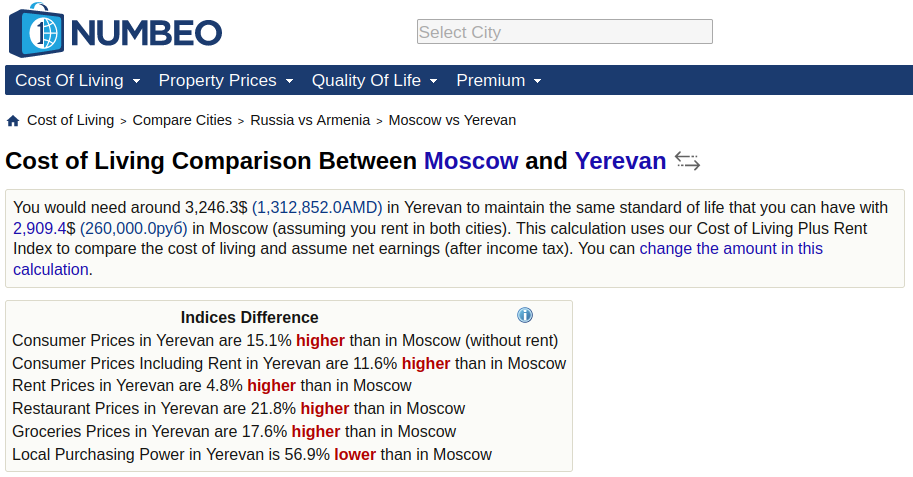
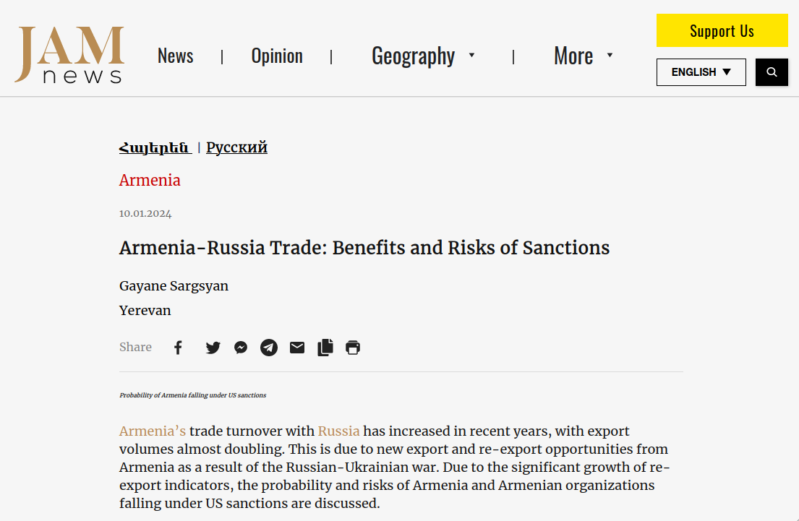

```{r setup, include=FALSE}
knitr::opts_chunk$set(echo = TRUE)

library(tidyverse)
library(scales)

rm(list = ls()); gc()

theme_tvyal <- function(base_size = 12, base_family = "sans") 
{
  colors <- deframe(ggthemes::ggthemes_data[["fivethirtyeight"]])
  (ggthemes::theme_foundation(
    base_size = base_size, base_family = base_family) + 
      theme(
        line = element_line(colour = "black"), 
        rect = element_rect(fill = "white", linetype = 0, colour = NA),
        text = element_text(colour = colors["Dark Gray"]), 
        # axis.title = element_blank(),
        # axis.text = element_text(), 
        axis.ticks = element_blank(),
        axis.line = element_blank(), 
        legend.background = element_rect(), 
        legend.position = "bottom", 
        legend.direction = "horizontal", 
        legend.box = "vertical", 
        panel.grid = element_line(colour = NULL), 
        panel.grid.major = element_line(colour = colors["Medium Gray"]), 
        panel.grid.minor = element_blank(), 
        plot.title = element_text(hjust = 0, size = rel(1.5), face = "bold"),
        plot.margin = unit(c(1, 1, 1, 1), "lines"), strip.background = element_rect()
      )
  )
}

theme_set(theme_tvyal())

save_last_plot <- 
  # function(filename, extension = "png", width = 1344, height = 756) {
  function(filename, extension = "png", width = 1008, height = 576) {
    
    filename <- str_replace_all(filename, " ", "_")
    last_plot <- recordPlot()
    
    if (extension == "png") {
      png(paste0(filename, ".", extension), width = width, height = height)
    } else if (extension == "pdf") {
      pdf(paste0(filename, ".", extension), width = width, height = height)
    } else {
      stop("Unsupported file extension. Use 'png' or 'pdf'.")
    }
    
    replayPlot(last_plot)
    dev.off()
    paste0(filename, ".", extension)
  }

new_palette_colors <- c(
  "#003f5c", "#2f4b7c", "#665191", "#a05195", 
  "#d45087", "#f95d6a", "#ff7c43", "#ffa600"
)
colfunc   <- colorRampPalette(c("#2f4b7c", "#fffcf5", "#f95d6a"))
colfunc_2 <- colorRampPalette(new_palette_colors)

update_geom_defaults("rect", list(fill  = new_palette_colors[2], alpha = 0.8)) 
update_geom_defaults("line", list(color = new_palette_colors[2], alpha = 0.8))
update_geom_defaults("area", list(fill  = new_palette_colors[2], alpha = 0.8))

caption_arm <-  "Հեղինակ` Աղասի Թավադյան   |   tvyal.com   |   tavadyan.com"
caption_eng <-  "Author: Aghasi Tavadyan   |   tvyal.com   |   tavadyan.com"

doParallel::registerDoParallel(cores = 8)

setwd(dirname(rstudioapi::getActiveDocumentContext()$path))
```

```{r data download, include=FALSE}

numbeo_8_cities <- read_csv("numbeo_8_cities_db.csv")

indicator_gr <- 
  numbeo_8_cities |> 
  mutate(indicator_group = fct_inorder(indicator_group)) |> 
  count(indicator_group) |> 
  pull(indicator_group)

numbeo_cities_popularity <- read_csv("numbeo_cities_popularity.csv")

select_countries <- c("Armenia", "Iran", "Azerbaijan", "Georgia",
                      "Kazakhstan", "Russia", "Belarus", "Turkey")

```


```{r vecor of places by cost of leaving, include = FALSE}

places_by_cost_of_leaving <- 
  numbeo_8_cities |> 
  select(country, city) |> 
  unique() |> 
  left_join(numbeo_cities_popularity, join_by(country, city)) |> 
  mutate(place = paste0(city, ", ", country)) |> 
  arrange(usd_ammount) |> 
  pull(place)

```


```{r, include=FALSE}

cities_popularity_plot <- 
  numbeo_cities_popularity |> 
  filter(country %in% select_countries) |> 
  arrange(desc(info_entries)) |> 
  slice_head(n = 14) |> 
  mutate(
    place = paste0(city, ", ",country),
    place = fct_reorder(place, info_entries)
  ) |> 
  select(place, info_entries, usd_ammount) |> 
  pivot_longer(-place) |> 
  mutate(
    text_entries = ifelse(
      name == "usd_ammount",
      dollar(value, accuracy = 1, prefix = " $"),
      number(value, accuracy = 1, prefix = " ")
    )
  ) |> 
  filter(name == "info_entries") |> 
  ggplot(aes(value, place, fill = place)) +
  # facet_wrap(~name, scale = "free_x") +
  geom_col() +
  geom_text(aes(x = 0, label = text_entries), hjust = 0) +
  scale_fill_manual(values = rev(colfunc_2(14))) +
  labs(
    x = NULL,
    y = NULL,
    title = "The Most Popular Cities to Visit in Armenia and Neighbouring Countries",
    subtitle = "Popularity is measured by the enteries on numbeo.com",
    caption = paste0(caption_eng, "   |   Data Source: numbeo.com")
  ) +
  theme(
    legend.position = "none",
    axis.text.x = element_blank(),
    panel.grid.major = element_blank()
  )


# numbeo_cities_popularity |> 
#   arrange(usd_ammount) |> 
#   view()
```


```{r city_comparation_plotter, include=FALSE}

city_comparation_plotter <- 
  function(tbl, currency_exchange = 1, indicator_group_ = 1:10, indicator_ = ""){
  
    plot <- 
      numbeo_8_cities |> 
      filter(
        indicator_group %in% indicator_gr[indicator_group_]
      ) |> 
      filter(
        grepl(indicator_, indicator)
      ) |>
      mutate(
        across(c(mean_price, min_range, max_range), ~.x * currency_exchange),
        place = paste0(city, ", ", country),
        place = factor(place, levels = places_by_cost_of_leaving),
        indicator = fct_inorder(indicator),
        text = formatC(mean_price, format = "f", width = 2, digits = 0,
                       big.mark = ",")
      ) |> 
      ggplot(aes(mean_price, place, fill = place)) +
      facet_wrap(~indicator, scales = "free_x") +
      geom_col()+
      geom_text(aes(x = 0, label = text), hjust = 0) +
      geom_errorbarh(aes(xmin = min_range, xmax = max_range), height = 0.5) +
      scale_fill_manual(values = rev(new_palette_colors)) +
      theme(
        legend.position = "drop", 
        panel.grid.major = element_blank(),
        axis.text.x = element_blank()
      )
  
  return(plot)
}

```

```{r plots, include=FALSE}

apartament_price_plot <- 
  numbeo_8_cities |> 
  city_comparation_plotter(indicator_group_ = 8:9) +
  labs(
    x = NULL,
    y = NULL,
    title = "Rent and Apartment Prices in Armenia and Neighbouring Countries",
    subtitle = "In USD, prices in 2023",
    caption = paste0(caption_eng, "   |   Data Source: numbeo.com")
  )

restaurant_price_plot <- 
  numbeo_8_cities |> 
  city_comparation_plotter(
    currency_exchange = 403,
    indicator_group_ = 1, indicator_ = "Meal|McDonalds|Cappuccino"
  ) +
  labs(
    x = NULL,
    y = NULL,
    title = "Restorant Prices in Armenia and Neighbouring Countries",
    subtitle = "In Armenian drams, prices in 2023",
    caption = paste0(caption_eng, "   |   Data Source: numbeo.com")
  )

leisure_price_plot <- 
  numbeo_8_cities |> 
  city_comparation_plotter(
    indicator_group_ = 5:6, indicator_ = ""
  ) +
  labs(
    x = NULL,
    y = NULL,
    title = "Sports, Leisure and Childcare Prices in Armenia and Neighbouring Countries",
    subtitle = "In USD, prices in 2023",
    caption = paste0(caption_eng, "   |   Data Source: numbeo.com")
  )

clothing_price_plot <- 
  numbeo_8_cities |> 
  city_comparation_plotter(
    indicator_group_ = 7, indicator_ = ""
  ) +
  labs(
    x = NULL,
    y = NULL,
    title = "Clothing and Shoes Prices in Armenia and Neighbouring Countries",
    subtitle = "In USD, prices in 2023",
    caption = paste0(caption_eng, "   |   Data Source: numbeo.com")
  )

```


***English summary below.***

Հարգելի գործընկեր,

Հուսով եմ լավ եք:
Ներկայացնում եմ անցած շաբաթվա վերլուծությունները և աշխատանքները.

1. Երևանը Մոսկվայից ավելի թանկ է
2. ԶԼՄ հաղորդագրություններ
3. English summary


## 1. Երևանը Մոսկվայից ավելի թանկ է

Ըստ Numbeo․com կայքի Երևանում ապրուսը 2023 թվականին ամենաթանկն է եղել մեր հարևան երկրների համեմատ։ [Երևանում ապրելն ավելի թանկ է, քան նույնիսկ Մոսկվայում](https://www.numbeo.com/cost-of-living/compare_cities.jsp?country1=Russia&city1=Moscow&country2=Armenia&city2=Yerevan&displayCurrency=USD)։

<a href="https://www.numbeo.com/cost-of-living/compare_cities.jsp?country1=Russia&city1=Moscow&country2=Armenia&city2=Yerevan&displayCurrency=USD">
  
</a>

Ըստ այս աղբյուրի կյանքի նույն որակը ապահովելու համար անհատին անհրաժեշտ կլինի ամսական [3,246,3 դոլար (1,312,852.0 դրամ) Երևանում, իսկ Մոսկվայում՝ 2,909,4 դոլար (260,000.0 ռուբլի)](https://www.numbeo.com/cost-of-living/compare_cities.jsp?country1=Russia&city1=Moscow&country2=Armenia&city2=Yerevan&displayCurrency=USD)։ Այս գումարի մեջ է մտնում նաև նույն որակի տան վարձակալությունը: Ըստ այս տվյալների տարածաշրջանի քաղաքների համեմատ երևանում ապրոստը ամենաթանկն է։

* Սպառողական գները Երևանում 15,1%-ով բարձր են, քան Մոսկվայում (առանց վարձակալության)
* Երևանում սպառողական գները ներառյալ վարձավճարը 11,6%-ով բարձր են, քան Մոսկվայում
* Երևանում վարձակալության գները 4,8%-ով բարձր են, քան Մոսկվայում
* Ռեստորանային գները Երևանում 21,8%-ով բարձր են, քան Մոսկվայում
* Մթերքները Երևանում 17,6%-ով բարձր են, քան Մոսկվայում
* Տեղական գնողունակությունը Երևանում 56,9%-ով ցածր է, քան Մոսկվայում

[Numbeo․com](https://www.numbeo.com/common/about.jsp) կայքին վստահում են BBC, Time, Forbes, The Economist, Business Insider, New York Times, The Telegraph և այլ հայտնի պարբերականները։ Նումբե կայքը հաշվարկում է կյանքի արժեքի, կյանքի որակի և տարբեր սոցիալ-տնտեսական գործոնների վերաբերյալ ճշգրիտ և արդի տեղեկատվություն ամբողջ աշխարհի քաղաքներում և երկրներում:


Երևանում են ամենաթանկ վարձով տները, եթե համեմատենք մեր հարևան երկրնորի հետ։ Ըստ տվյալների 2023 թվականին երևանի կենտրոնում 1 սենյականոց բնակարանի միջին ամսական արժքը կազմում էր 979 դոլար, կամ մոտ 400 հազար դրամ, իսկ Մոսկվայի կոնտրոնում նույնանման բնակարանը՝ 772 դոլար կամ 312 հազար դրամ։ Սրա պատճառը կարող է հանդիսանալ այն որ Ռուսաստանի հանդեպ պատժամիջոցներով պայմանավորված վարձակալության պահանջարկը ընկավ և համապատասխանաբար նաև գները, իսկ Հայաստանում հակառակը՝ մեծ քանակության ՌԴ քաղաքացիների ներհոսքից հայաստանում վարձակալության գները աճեցին։

**Գծապատկեր 1.** 

```{r, echo=FALSE, warning=FALSE, fig.width = 12, fig.height = 6}
apartament_price_plot
```

Նշեմ որ, 2021 թվականին 45 ք․մ․ բնակարանի վարձակալության գինը Երևանի կենտրոնում կազմում էր մոտ 700 դոլար, 2022 թվականի աշնանից մինչև 2023 թվականի աշունը արդեն՝ 1000 դոլար, որը վկայում է նաև վերևում ներկայացված տվյալները։ Սակայն այժմ նմանատիպ բնակարանի վարձակալության գինը իջել է 750 դոլարի։ Հավանական է, որ սա սեզենային տենդենց է, քանի որ ձմռան սեզոնին պահանջարկը ավելի քիչ է և ամռանը այն վերականգնվում է, սակայն 2022-23 թվականի ձմռանը բնակարանների գնի սեզոնային իջեցում նկատվեց, քանի որ առկա էր ՌԴ քաղաքացիների մեծ հոսք։ Սա վկայում է նրա մասին որ ՌԴ քաղաքացիները հոսքը ուներ միջնաժամկետ բնույթ և հնարավոր է որ 2024 թվականին վարձակալության գները ավելի ցածր լինեն 2023 թվականի համեմատ։

Հաջորդ գծապատկերը ցույց է տալիս ռեստորանների արժեքը Հայաստանում և հարևան երկրներում։ Ինչպես երևում է Ռեստորանները նույնպես թանկ են համեմատած մոսկվայի։ 2 հոգու համար 3 ուտեստից բաղկացած կերակուրի արժեքը Երևանի ռեստորանում կազմում է 20 հազար դրամ, իսկ Մոսկվայում մոտ 14 հազար դրամ։ Ըստ տվյալների արագ սնունդը և ոչ թանկ ռեստորանում սնունդը ամենաթանկը Թբիլիսիում է, որից հետո գալիս է Երևանը։

**Գծապատկեր 2.** 

```{r, echo=FALSE, warning=FALSE, fig.width = 12, fig.height = 8}
restaurant_price_plot
```


Երևանում թանկ է նաև բրենդային հագուտը։ Ասիայի բոլոր քաղաքներից, որոնք գրանցվեծ են Numbeo․com կայքում Երևանում միջին դասի Nike վազքի կոշիկները գնով ամենաթակն 2-րդ տեղում են։ [Տես՝ Rankings, History and Analysis](https://www.numbeo.com/cost-of-living/in/Yerevan)


**Գծապատկեր 3.** 

```{r, echo=FALSE, warning=FALSE, fig.width = 12, fig.height = 8}
clothing_price_plot
```

Ստորև ներկայացված է նաև տվյալ տարածաշրջանի ամենահանրաժան կամ պոպուլյար քաղաքները ըստ Numbeo․com կայքում  Ներկայացված գրառումներումների։

**Գծապատկեր 4.** 

```{r, echo=FALSE, warning=FALSE, fig.width = 12, fig.height = 6}
cities_popularity_plot
```

Երևանը զբաղեցնում է 11-րդ տեղը ըստ գրառումների քանակի և առաջին տեղը ըստ նույն որակը ապահովելու ապրուստի ծախսերի։ Ներկայացված տվյալները նախանշում են որ առկա է որոշակի անհավասարակշռություն, որը առաջացել է Ռուսաստանի դեմ պատժամիջոցներից և դեպի Հայաստան համեմատաբար մեծ քանակությամբ ՌԴ քաղաքացիների հոսքից։ Այս անհավասարակշռությունը ունի որոշակի վտանգներ։ Եթե ՌԴ քաղաքացիները Հայաստանում երկարատև չհաստատվեն և Ռուսատանի կապիտալի ներհոսքը վերականգնվի ապա Հայաստանում գները կարող են ընկանել՝ հատկապես վարձակալության և վաճառքի, որը տնտեսական աճի տեսանկյունից կունենա բացասական հետևանք։ Նշեմ, որ ամենայն հավանականությամբ Ռդ քաղաքացիների ներհոսքը հայաստան կրում էր միջնաժամկետ բնույթ։


Նշեմ, որ Numbeo․com կայքից վերծանված տվյալների բազաները կարող եք գտնել նաև մեր [Github-ում](https://github.com/tavad/tvyal_newsletter/2024)։


## 2. ԶԼՄ հաղորդագրություններ

Երևանում հարուստները ավելի են հարստացել, աղքատները՝ ավելի աղքատացել, մարզերում միայն աղքատացել են

Դիտեք իմ սիրելի գրծընկեր [Սոս Խաչիկյանի](https://www.linkedin.com/in/sos-khachikyan-46a51b3a/) և [իմ](https://www.linkedin.com/in/tavad/) [Ամանորյա հարցազրույցը](https://youtu.be/D0CsyhYC9Zo), որտեղ ամփոփել ենք տարին և քննարկել թե ինչ է մեզ սպասում 2024 թվականին։


<a href="https://youtu.be/D0CsyhYC9Zo">
  
</a>


<a href="https://www.youtube.com/shorts/11oDLyh4ukw">
  
</a>


Հայաստան-Ռուսաստան առևտուրը․ օգուտն ու պատժամիջոցների տակ հայտնվելու ռիսկերը 


<a href="https://jam-news.net/probability-of-armenia-falling-under-us-sanctions/">
  
</a>


## 3. English Summary

**Title**


---

Այս վերլուծությունը առկա է նաև [մեր կայքէջում](https://www.tvyal.com/newsletter/2024/2024_01_12), այս վերլուծության կոդը և տվյալները դրված են նաև [Github-ում](https://github.com/tavad/tvyal_newsletter)։                        
---                  

Եթե հնարավոր է, խնդրում եմ այս նյութը ուղարկել նաև այն մարդկանց, ում այն կարծում եք կարող է հետաքրքրել:

Սպասեք հաջորդ հաղորդագրությանը մի շաբաթվա ընթացքում:        


Հարգանքներով,            
Աղասի Թավադյան         
12.01.2024          
[tvyal.com](https://www.tvyal.com/)      
[tavadyan.com](https://www.tavadyan.com/)

---

[Was this email forwarded to you? Subscribe here.](https://www.tvyal.com/subscribe)

[Բաժանորդագրվեք](https://www.tvyal.com/subscribe)

       
---              
               


####### **Ուշադրություն. Ձեր էլ.փոստը մեյլիսթի մեջ է, որի միջոցով ես կիսվում եմ շաբաթական նյութեր, որոնք հիմնականում ներկայացնում են Հայաստանի տնտեսությանը: Նյութերը ներառում են գծապատկերներ, [տվյալների բազաներ](https://github.com/tavad/tvyal_newsletter), տեսանյութեր, հոդվածներ, [առցանց վահանակներ](https://www.tvyal.com/projects), տնտեսական գործիքներ, կանխատեսումներ և հաշվետվություններ: Եթե ցանկանում եք չեղարկել բաժանորդագրությունը, խնդրում եմ տեղեկացրեք ինձ, և ես կհեռացնեմ ձեր էլ. փոստը ցուցակից: Գրեք նաև եթե ունեք մենկնաբանություններ:**

####### **Important! Your email is part of the mailing list where I share weekly materials primarily focused on the Armenian economy. These materials encompass charts, [databases](https://github.com/tavad/tvyal_newsletter), videos, articles, [online dashboards](https://www.tvyal.com/projects), economic tools, forecasts, and reports. If you wish to unsubscribe, please let me know, and I will remove your email from the list. Please share your comments as well․**


