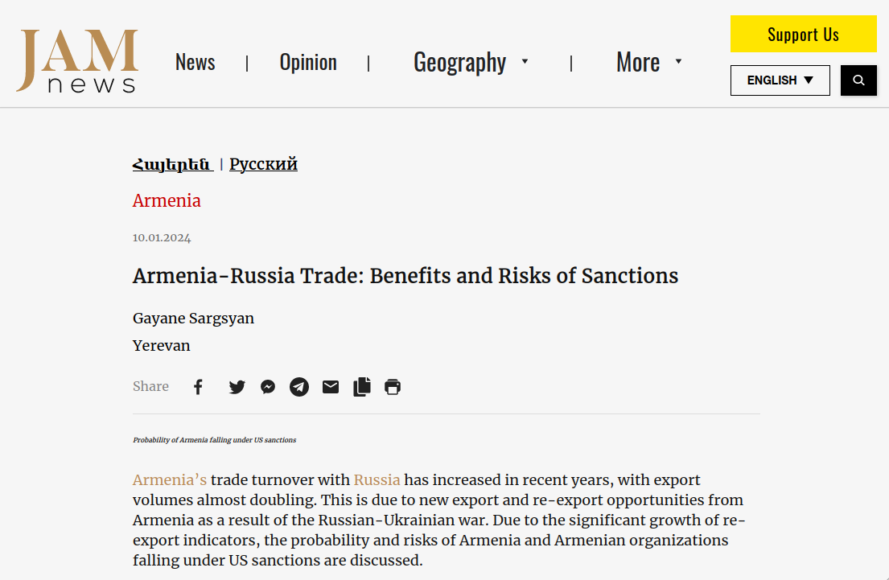

```{r setup, include=FALSE}
knitr::opts_chunk$set(echo = TRUE)

library(tidyverse)
library(scales)
library(countrycode)
library(patchwork)
library(ggstream)
library(knitr)
library(kableExtra)

rm(list = ls()); gc()

theme_tvyal <- function(base_size = 12, base_family = "sans") 
{
  colors <- deframe(ggthemes::ggthemes_data[["fivethirtyeight"]])
  (ggthemes::theme_foundation(
    base_size = base_size, base_family = base_family) + 
      theme(
        line = element_line(colour = "black"), 
        rect = element_rect(fill = "white", linetype = 0, colour = NA),
        text = element_text(colour = colors["Dark Gray"]), 
        # axis.title = element_blank(),
        # axis.text = element_text(), 
        axis.ticks = element_blank(),
        axis.line = element_blank(), 
        legend.background = element_rect(), 
        legend.position = "bottom", 
        legend.direction = "horizontal", 
        legend.box = "vertical", 
        panel.grid = element_line(colour = NULL), 
        panel.grid.major = element_line(colour = colors["Medium Gray"]), 
        panel.grid.minor = element_blank(), 
        plot.title = element_text(hjust = 0, size = rel(1.5), face = "bold"),
        plot.margin = unit(c(1, 1, 1, 1), "lines"), strip.background = element_rect()
      )
  )
}

theme_set(theme_tvyal())

save_last_plot <- 
  # function(filename, extension = "png", width = 1344, height = 756) {
  function(filename, extension = "png", width = 1008, height = 576) {
    
    filename <- str_replace_all(filename, " ", "_")
    last_plot <- recordPlot()
    
    if (extension == "png") {
      png(paste0(filename, ".", extension), width = width, height = height)
    } else if (extension == "pdf") {
      pdf(paste0(filename, ".", extension), width = width, height = height)
    } else {
      stop("Unsupported file extension. Use 'png' or 'pdf'.")
    }
    
    replayPlot(last_plot)
    dev.off()
    paste0(filename, ".", extension)
  }

new_palette_colors <- c(
  "#003f5c", "#2f4b7c", "#665191", "#a05195", 
  "#d45087", "#f95d6a", "#ff7c43", "#ffa600"
)
colfunc   <- colorRampPalette(c("#2f4b7c", "#fffcf5", "#f95d6a"))
colfunc_2 <- colorRampPalette(c("#005C4B", new_palette_colors,  "#FFC251", "#FFDFA3", "#FFFCF5"))


update_geom_defaults("rect", list(fill  = new_palette_colors[2], alpha = 0.8)) 
update_geom_defaults("line", list(color = new_palette_colors[2], alpha = 0.8))
update_geom_defaults("area", list(fill  = new_palette_colors[2], alpha = 0.8))

caption_arm <-  "Հեղինակ` Աղասի Թավադյան   |   tvyal.com   |   tavadyan.com"
caption_eng <-  "Author: Aghasi Tavadyan   |   tvyal.com   |   tavadyan.com"

doParallel::registerDoParallel(cores = 8)

setwd(dirname(rstudioapi::getActiveDocumentContext()$path))
```


```{r data download, include=FALSE}

vehicle_trade_armenia <- read_csv("vehicle_trade_armenia.csv")

vehicle_trade_georgia <- read_csv("vehicle_trade_georgia.csv")


```


```{r vehicle trade table function, include=FALSE}
vehicle_trade_table <- 
  function(
    tbl_initial, trade_code_, lumps, caption, years = 2021:2023, months = 1:10
  ){
    
    tbl <- 
      tbl_initial |>
      filter(
        year %in% years,
        month %in% months,
        aggregate_level == 4,
        trade_code %in% trade_code_
      ) |> 
      left_join(
        transmute(countrycode::codelist,
                  partner_iso = iso3c, partner_am = cldr.name.hy),
        by = join_by(partner_iso)
      ) |> 
      mutate(
        partner = fct_lump_n(partner, lumps, w = trade_value_us, 
                             other_level = "Other counties")
      ) |> 
      group_by(year, partner) |> 
      summarise(trade_value_us = sum(trade_value_us) / 1e6, .groups = "drop") |> 
      group_by(year) |> 
      mutate(pct = trade_value_us / sum(trade_value_us)) |> 
      pivot_wider(
        names_from = year, values_from = c(trade_value_us, pct), 
        names_vary = "slowest"
      ) %>%
      bind_rows(
        summarise(., across(where(is.numeric), sum))
      ) |> 
      mutate(
        partner = as.character(partner),
        partner = ifelse(is.na(partner), "Total", partner),
      ) |> 
      arrange(ifelse(partner == "Total", Inf, desc(pct_2022))) |> 
      ungroup() |> 
      mutate(
        across(contains("trade_value_us"), ~number(.x, accuracy = 0.1)),
        across(contains("pct"), ~percent(.x, accuracy = 0.1)),
      ) |> 
      knitr::kable(
        col.names = c("partner", "2021", "pct", "2022", "pct", "2023", "pct"),
        caption = caption,
        align = c("l", rep("r", 6))
      ) |> 
      kable_styling(full_width = FALSE) |> 
      column_spec(1, width = "600px", extra_css = "text-align: left;")
    
    return(tbl)
  }

vehicle_armenia_imports_table <- 
  vehicle_trade_armenia |> 
  vehicle_trade_table(
    trade_code_ = "M", lumps = 7,
    caption = "Armenia's Imports of Vehicles (mln USD, data for the first 10 months of the given year)"
  )

vehicle_armenia_exports_table <- 
  vehicle_trade_armenia |> 
  vehicle_trade_table(
    trade_code_ = "X", lumps = 1, 
    caption = "Armenia's Exports of Vehicles (mln USD, data for the first 10 months of the given year)"
  )
```


```{r tradee smooth plotter function, include=FALSE}

trade_smooth_plotter <- 
  function(
    tbl, trade_code_, lumps, fill_ = "partner", aggregate_level_ = 4,
    other_level = "Other counties",
    year_start = 2021, facet_label, ...
  ){
    
    smooth_plot <- 
      tbl |> 
      filter(
        trade_code %in% trade_code_,
        year >= year_start,
        aggregate_level == aggregate_level_
      ) |> 
      rename(fill_column = !!sym(fill_)) |>
      mutate(
        fill_column = as.character(fill_column),
        fill_column = fct_lump_n(fill_column, lumps, w = Qty, 
                           other_level = other_level),
      ) |> 
      group_by(period, fill_column, trade_code, trade_flow) |> 
      summarise(Qty = sum(Qty), .groups = "drop") |> 
      mutate(
        fill_column = fct_reorder(fill_column, Qty, .fun = sum, .desc = TRUE),
        fill_column = fct_relevel(fill_column, other_level, after = Inf)
      ) |> 
      ggplot(aes(period, Qty, fill = fill_column)) + 
      geom_stream(...) +
      scale_x_date(
        date_breaks = "1 year", date_labels = "%Y",
        limits = c(as.Date(paste0(year_start, "-01-01")), as.Date("2024-01-01"))
      ) +
      scale_y_continuous(labels = number_format(), n.breaks = 8) +
      scale_fill_manual(values = colfunc_2(lumps + 1)) +
      guides(fill = guide_legend(nrow = 2, byrow = TRUE)) +
      labs(
        x = NULL,
        y = NULL,
        fill = NULL,
        subtitle = facet_label
      ) +
      theme(
        plot.subtitle = element_text(hjust = 0.5),
        panel.grid.major.x = element_blank()
      )
    
    return(smooth_plot)
  }

```

```{r cehicle HS6 exports, include=FALSE}

vehicle_trade_armenia |> 
  trade_smooth_plotter(
    trade_code_ = "M", lumps = 7, year_start = 2017, 
    fill_ = "commodity_code", facet_label = "Import", aggregate_level_ = 6,
    other_level = "Other car types",
    type = "ridge", bw=0.55, n_grid = 5000, extra_span = 0.15
  ) +
  labs(
    title = "Armenia's Vehicle Export",
    subtitle = "Units in a Month, HS code 8703",
    caption = paste0(caption_eng, "    |    Data Source: Comtrade")
  ) +
  theme(
     plot.subtitle = element_text(hjust = 0)
  )

```


```{r Armenia Vehicle Trade, include=FALSE}

plot_armenia_imports_2017 <- 
  vehicle_trade_armenia |> 
  trade_smooth_plotter(
    trade_code_ = "M", lumps = 7, year_start = 2017,
    facet_label = "Import",
    type = "ridge", bw=0.55, n_grid = 5000, extra_span = 0.15
  ) +
  labs(
    title = "Armenia's Vehicle Export",
    subtitle = "Units in a Month, HS code 8703",
    caption = paste0(caption_eng, "    |    Data Source: Comtrade")
  ) +
  theme(
     plot.subtitle = element_text(hjust = 0)
  )

plot_armenia_imports <- 
  vehicle_trade_armenia |> 
  trade_smooth_plotter(
    trade_code_ = "M", lumps = 7, year_start = 2021,
    facet_label = "Import",
    type = "ridge", bw=0.75, n_grid = 5000, extra_span = 0.15
  )

plot_armenia_exports <- 
  vehicle_trade_armenia |> 
  trade_smooth_plotter(
    trade_code_ = "X", lumps = 3, year_start = 2021,
    facet_label = "Export",
    type = "ridge", bw=0.75, n_grid = 5000, extra_span = 0.15
  )

vehicle_trade_armenia_plot <- 
  plot_armenia_imports +
  plot_armenia_exports +
  plot_layout(ncol = 2) +
  plot_annotation(
    title = "Armenia's Vehicle Trade",
    subtitle = "Units in a Month, HS code 8703",
    caption = paste0(caption_eng, "    |    Data Source: Comtrade")
  )

```


```{r Georgia Vehicle Trade, include=FALSE}

plot_georgia_imports <- 
  vehicle_trade_georgia |> 
  trade_smooth_plotter(
    trade_code_ = "M", lumps = 6, year_start = 2021,
    facet_label = "Import",
    type = "ridge", bw=0.75, n_grid = 5000, extra_span = 0.15
  )

plot_georgia_exports <- 
  vehicle_trade_georgia |> 
  trade_smooth_plotter(
    trade_code_ = "X", lumps = 6, year_start = 2021,
    facet_label = "Export",
    type = "ridge", bw=0.75, n_grid = 5000, extra_span = 0.15
  )

vehicle_trade_georgia_plot <- 
  plot_georgia_imports +
  plot_georgia_exports +
  plot_layout(ncol = 2) +
  plot_annotation(
    title = "Georgia's Vehicle Trade",
  subtitle = "Units in a Month, HS code 8703",
    caption = paste0(caption_eng, "    |    Data Source: Comtrade")
  )

```


***English summary below.***

Հարգելի գործընկեր,

Հուսով եմ լավ եք:
Ներկայացնում եմ այս շաբաթվա վերլուծությունները և աշխատանքները.

1. Հայաստանի "ավտոարտադրույան" մահը
2. ԶԼՄ հաղորդագրություններ
3. English summary


## 1. Հայաստանի "ավտոարտադրույան" մահը

2023 թվականի առաջի 10 ամիսների կտրվածքով Հայաստանի արտահանման 7.2 տոկոսը եղել է մարդատար ավտոմեքենաները։ Այսպես մեր տնտեսության 7.2 տոկոսը ապահովել է ավտոմեքենաների "արտադրությունը" և արտահանումը։ Նշենք, որ նույն ժամանակահատվածում ավտոմեքենաների ներմուծումը կազմել է ընդհանուրի 10.5 տոկոսը։

Տնտեսության այս զգալի և համեմատաբար նոր հատվածը, որը ապահովվել է 2022 և 2023 թվականների տնտեսական աճի մի մասը մեծ խնդիրների առաջ է կանգնած և 2024 թվականին կարող է լիովին չեզոքանալ։

**Աղյուսակ 1** Հայաստանից մեքենաների արտահանումը (մլն ԱՄՆ դոլար, 1-ից 10-րդ ամիսների կտրվածքով)

```{r echo=FALSE, warning=FALSE, fig.width = 12, fig.height = 8}
vehicle_armenia_exports_table
```


Նշենք, որ 2021-ին ներմուծվել է 7362 թեթև մարդատար ավտոմեքենա (77.9 մլն դոլար), ապա 2022-ին արդեն՝ 42 293 ավտոմեքենա (360.2 մլն դոլար): Այսինքն մոտ 6 անգամ աճ է տեղի ունեցել: 2021-ին Հայաստանից արտահանել է 319 մեքենա, իսկ 2022-ին՝ 10936 ավտոմեքենա: Այսպիսով ներմուծված մեքենաների քառորդը վերաարտահանել ենք հիմնականում Ռուսաստան: Գրանցվել է ԱՄՆ-ից մեքենաների ներմուծման զգալի աճ` մոտ 7 անգամ 2022թ. ընթացքում։

Պետք է նշել որ այստեղ չի գնում պարզ վերաարտահանման մասին խոսք։ Հիմնականում Հյուսիսային Ամերիկայից վնասված մեքենաները ներմուծվում են Հայաստան, որից հետո այդ ավտոմեքենաների վրա կատարվում է որոշակի վերանորոգման աշխատանք, որը ստեղծում է ավելացված արժեք, որից հետո այն հիմնականում վերաարտահանվում է Ռուսատանի Դաշնություն՝ Հայաստանին թողելով նաև ծառայության միջնորդավճար։

2023 թվականի ավտոմեքենաների արտահանումը առաջին 10 ամսիներին համեմատած 2022 թվականի նույն ժամանակահատվածի հետ աճելի է 3.17 անգամ, որը առաջին հայացքից ցույց է տալիս այս բոլորտի ներուժը և աճը, բայց իրականությունը այլ է։

**Աղյուսակ 2** Հայաստանից մեքենաների ներմուծումը (մլն ԱՄՆ դոլար, 1-ից 10-րդ ամիսների կտրվածքով)

```{r echo=FALSE, warning=FALSE, fig.width = 12, fig.height = 8}
vehicle_armenia_imports_table
```

ԱՄՆ-ից ներմուծումը 2022 թվականին 2021-ի համեմատ աճել է մոտ 3,5 անգամ՝ 107 մլն դոլարից հասնելով 356 մլն դոլարի: Արտահանումը նույնն է մնացել: Հիմնականում ներմուծվել ավտոմեքենաներ: Ավտոմեքենաները կազմում են ԱՄՆ-ից ներմուծման մոտ 70 տոկոսը: Մնացածը ատոմային ռեակտորներն են, դեղագործական և օպտիկական ապրանքները: Եթե ավտոմեքենաների ներմուծումն ու արտահանումը համեմատենք, ապա 2021-ին ԱՄՆ-ի ներմուծվել է 7362 թեթև մարդատար ավտոմեքենա, իսկ 2022-ին՝ 42 293 ավտոմեքենա: Մոտ 6 անգամ աճ է տեղի ունեցել: Եթե 2021-ին արտահանել ենք 319 մեքենա, ապա 2022-ին՝ 10936 ավտոմեքենա: Այսինքն ներմուծված մեքենաների մեկ քառորդը վերաարտահանել ենք արտասահման, հիմնականում Ռուսաստան:

[Մինչև 2022 թվականը ԱՄՆ-ի հետ մեր առևտրաշրջանառությունը ընդհանուրի մեջ մոտ 4 տոկոս էր, իսկ 2022-ին, պայմանավորված հիմնականում ավտոմեքենաների ներմուծմամբ, այդ ցուցանիշը էական աճ է գրանցել](https://www.1in.am/3253116.html): Դեպի ԱՄՆ արտահանման գումարը նույնն է մնացել, բայց որոշակի փոփոխություններ տեղի են ունեցել։ Եթե 2021-ին մոտ 80 մլն դոլարի արտահանում ունեինք, 2022-ին իջել է 77 մլն, բայց ընդհանուր կառուցվածքի մեջ որոշակի փոփոխություններ կան: Օրինակ, մեծացել է մսեղենի արտահանումը դեպի ԱՄՆ, փոքրացել է ալյումինի արտահանումը, որը 2021-ին բավական մեծ տեղ ուներ: Հիմնականում մենք ԱՄՆ արտահանում էինք թանկարժեք և կիսաթանկարժեք քարեր:

Հասկանալի է, որ այս ամենը վերաարտահանում է, ու որ Հայաստանից ավտոմեքենաների արտահանումն աճել է 2022 թվականից Ռուսաստանի դեմ կիրառվող պատժամիջոցներից հետո։ Որպես ԵԱՏՄ անդամ այստեղ շահել ենք, քանի որ այլ իրավիճակում իմաստ չէր լինի ավտոմեքենաները Հյուսիսային Ամերիկայից բերել Վրաստան, ապա Հայաստան, որից հետո տանել Ռուսաստան։ ԵԱՏՄ ազատ առևտրի տարածքը որոշակի օգուտներ է տվել նաև այդ մասով։

Եթե նայենք խոշոր հարկատուների ցանկը, 2022 թվականին 2021-ի համեմատ Հայաստանի ավտոներմուծողների շահութահարկը 7-ից 15 անգամ կրկնապատկվել է։ Մեծ շահույթներ են ստացել։ Այդ շահույթը գնացել է հետագա վերաարտահանման հույսով նոր ավտոմեքենաներ ձեռքբերելուն։

### Ի՞նչ է սպառնում Հայաստանի "ավտոարտադրությանը" 2024 թվականին

**Գծապատկեր 1.** Հայաստանի ավտոմեքենաների արտահանումը (ամսական կտրվածքով)

```{r, echo=FALSE, warning=FALSE, fig.width = 12, fig.height = 8}
plot_armenia_imports_2017
```

Թվում է` ամեն ինչ լավ է. ավտոմեքենաների արտահանումն աճել է 2023-ին համեմատած 22 թվականի հետ։ Սակայն իրականությունը, ինչպես գծապատկերն է ցույց տալիս, այդքան էլ դրական չէ։
Վրաստանը այս տարածաշրջանի ավտոմեքենաների հիմնական շուկան է ու այդքան հեշտ չի զիջի իր փայի թեկուզ փոքր մասը Հայաստանին։ Այդ պատճառով է, որ օգոստոսի 1-ից Թբիլիսիի իշխանություններն արգելել են 1,9 լիտր և ավելի շարժիչով ամերիկյան ավտոմեքենաների, ինչպես նաև հիբրիդային և էլեկտրական մեքենաների արտահանումը։ Սա երևում է գծապատկերում։

Ինչպես երևում է առաջին գծապատկերում, ճիշտ է 2023 թվականին 2022-ի համեմատ ավտոմեքենաների կումուլատիվ արտահանումը ավելի շատ է, սակայն 2022 թվականի ավտոմեքենաների արտահանման կտրուկ և անսպասելի աճից հետո, 2023 թվականի սկզբին գրանցվել է արտահանման պիկային կետո, որից հետո այն կտրուկ անկում է։

Հետաքրքիր է նաև 2019-2020 թվականներին նույնպես գրանցվեց ավտոմեքենաների ներմուծման հանկարծակի աճ և տարեվերջան անկում։ Այս անկումը հիմնականում անդրադարձել է ճապոնական մեքենաների ներմուծման կրճատման վրա: Սրա հիմնական պատճառը ԵԱՏՄ տարածքում ավտոմեքենաների արտահանման ներ դրույքաչափերի ներդրումն էր, որը արդեն ձեռք չեր տալիս ավելի քան 3 տարվա մեքենաների վերաարտահանումը: Սա ոչնչացրեց այս ճյուղը։

Պաշտոնական Թբիլիսին օգոստոսի 1-ից սահմանափակեց է 1,9 լիտր և ավելի շարժիչով, ինչպես նաև հիբրիդային և էլեկտրական ամերիկյան մեքենաների արտահանումը։ Հայաստանի ավտոմեքենանրի արտահանման ավելի քան 90 տոկոսը այս դասի աստոմեքենաներ էին։

**Գծապատկեր 2.** Հայաստանի ավտոմեքենանրի արտահանումը և ներմուծումը (ամսական կտրվածքով)

```{r, echo=FALSE, warning=FALSE, fig.width = 12, fig.height = 8}
vehicle_trade_armenia_plot
```

2022-23 թվականներին Հայաստանը, Վրաստանից հետո տարածաշրջանի ամենախոշոր երկրորդ ավտոշուկան էր։ Հայաստանի մեծածավալ արտահանումը որոշակի խնդիրներ առաջացրեց Վերին Լարսի սահմանին, բացի այդ ըստ բիզնեսի կանոնների հաստատված շուկան դժվար թե կամենա այլ շուկաների ասպարեզ արագ դուրս գալը։ Այստեղ նաև առկա է որոշակի  քաղաքական գործոն։ 

2023 թվականի առաջին 10 ամիսների ընթացքում Հայաստանից արտահանվել է 18 835 ավտոմեքենա (ներմուծվել՝ 70 859), ամբողջ 2022 թվականին արտահանվել է 10 936 ավտոմեքենա (ներմուծվել՝ 42 293)։ 
2023 թվականին բոլոր պետությունների շարքում արտահանման ծավալներով ամենախոշոր 35֊րդ արտահանողը կլինի Հայաստանը, իսկ Վրաստանը մոտ 25-րդ տեղում։ Վրաստանը 2023-ին արտահանելու է մոտ 100 հազար ավտոմեքենա։

Մեր շուկա բավականին մեծ քանակությամբ մեքենա է մտել, ինչը լցրել է մաքսակետերը ու ներմուծողների ավտոկայանատեղիները։ Իսկ ավտոմեքենան այնպիսի ապրանք է, որ ժամանակի ընթացքում արժեզրկվում է։

Կարելի է սպասել, որ 2024 թվականին ավտոներմուծողները ստիպված են լինելու վնասով մեծ քանակությամբ ավտոմեքենաներ վաճառել ներքին շուկայում, այսինքն կարող է մեքենաների գները հաջորդ տարի լավ իջնեն, մեքենաների քանակը շատանա, բայց նաև փողոցներում ավտոմեքենաներն ավելի թարմ թվի լինեն։

3-րդ գծապատկերում ցուցադրված է Վրաստանի ավտոմքենաների ամսական արտահանումը և ներմուծումը ըստ տարբեր երկրների։ Վրաստանը մեծ քանակությամբ մեքենաներ չի արտահանում դեպի Ռուսաստան և դեպի Ռուսատան արտահանումը 2023 թվականի օոգոստոսից գրեթե դաթարից, ինչպես որ այն դադարեց Հայաստանում։ Հիմնականում Վրաստան ներմուծվում են մեքենաներ ԱՄՆ-ից և արտահանվում Ադրբեջան և Ղազախստան։ Հուշագրավ է նաև այն որ 2023 թվականի կեսերից դեպի Վրաստան ավտոմեքենանրի և արտահանումը և ներմուծումը կանգնել է, որը նույնպես խոսում է այս շուկայի հագեցվածության և շուկայում խնդիրների մասին։ 

**Գծապատկեր 3.** Վրաստանի ավտոմեքենանրի արտահանումը և ներմուծումը (ամսական կտրվածքով)

```{r, echo=FALSE, warning=FALSE, fig.width = 12, fig.height = 8}
vehicle_trade_georgia_plot
```

### Ռուսաստանն էլ չի կամենում վերաարտահանված մեքենաներ

2023 թվականին Ռուսաստանում վաճառված [յուրաքանչյուր 8-րդ մեքենան ներմուծվել է "գորշ" ներմուծմամբ](https://carsweek.ru/news/News_in_the_world/1277489/)։
2023 թվականի հունվարից սեպտեմբեր ՌԴ քաղաքացիները ձեռք են բերել ավելի քան 100 հազար ավտոմեքենա, որոնք ռուսական ավտոշուկա են մտել "գորշ" ներմուծման միջոցով։ Սեպտեմբերին նրանց շուկայական մասնաբաժինը օգոստոսի համեմատ նվազել է 13%-ից մինչև 11%։

Սեպտեմբեր ամսին "գորշ" ներմուծման ճանապարհով առավել հաճախ ՌԴ են բերվել [ճապոնական (4,4 հազար հատ, 34 տոկոս), կորեական (3,1 հազար հատ, 24 տոկոս) և գերմանական (2,7 հազար հատ, 20 տոկոս) ավտոմեքենաներ։ Չինական արտասահմանյան մեքենաների մասնաբաժինը նույնպես դրական դինամիկա է ցույց տալիս՝ օգոստոսի 7%-ից սեպտեմբերին հասնելով 12%-ի](https://www.autonews.ru/news/6501a9ec9a794705e42162ba):

2023 թվականի հոկտեմբերի 1-ից Ռուսաստանում փոխվել են մեքենաների "գորշ" կամ զուգահեռ ներմուծման կանոնները։ Այս տեսակի ներմուծումը սահմանափակվել է։ Այժմ նման մեքենաները ներկրվում են փոքր ընկերությունների կողմից և ավելի էժան են, քան պաշտոնական ավտոսրահներում։ Սա ձեռք չի տալիս Ռուսաստանի տնտեսությանը որը փորձում է զարգացնել իր ներսի արտադրությունը և առավելություն է տալիս այն ավտոմեքենաներին, որոնք արտադրվել են ՌԴ տարածքում։

Օգոստոսի 1-ից դեպի Ռուսատան "գորշ" ճանապարհով ավտոմեքենաների ներմուծման համար գործում է նաև վերամշակման արտոնյալ վճար, որը թույլ չի տալիս անձին տարեկան մեկից ավելի մեքենա ներկրել Ռուսատան և այն վաճառլ մեկ տարվա ընթացքում։

Այս ամենը մեծ հավանականությամբ հանգեցնելու է 2024թ․ ներմուծման և արտահանման զգալի չափաբաժնի կորստին, որը կարող է նաև անդրադառնալ ՀՆԱ-ի վրա։

## 2. ԶԼՄ հաղորդագրություններ

🇦🇲🇷🇺Հայաստան-Ռուսաստան առևտուրը․ օգուտն ու պատժամիջոցների տակ հայտնվելու ռիսկերը 🌐

🔗 [Կարդացեք իմ վերջին հարցազրույցը, տրված jam-news կայքին](https://jam-news.net/am/%d5%b0%d5%b0-%d5%b6-%d5%af%d5%a8%d5%b6%d5%af%d5%b6%d5%ab%d5%9e-%d5%a1%d5%b4%d5%b6-%d5%ba%d5%a1%d5%bf%d5%aa%d5%a1%d5%b4%d5%ab%d5%bb%d5%b8%d6%81%d5%b6%d5%a5%d6%80%d5%ab-%d5%bf%d5%a1%d5%af/)։ Հարցազրույցը հասանելի է նաև անգլերեն և ռուսերեն լեզուներով։

🔍 Հիմնական կետերը.

* 📈 Հայաստանի արտահանման ցուցանիշի կտրուկ աճ՝ Հայաստան Ռուսաստան է արտահանում ապրանքների կեսից ավելին՝ 52 տոկոսը։
* 🔄 Արտահանման փոփոխություն, ներառյալ ռադիո սարքավորումների, հեռախոսների, մեքենաների, մոնիտորների, պրոյեկտորների, ընդունիչ սարքավորումների, հեռուստացույցների և համակարգիչների արտահանման զգալի աճ:
* 📊 Տեխնիկական սարքավորումներ արտահանող ընկերությունների թվի աճ։
* 🇺🇸 Ռուսաստանի հետ առևտրով զբաղվող հայկական կազմակերպությունների նկատմամբ ԱՄՆ-ի հնարավոր պատժամիջոցների քննարկում։

<a href="https://jam-news.net/am/%d5%b0%d5%b0-%d5%b6-%d5%af%d5%a8%d5%b6%d5%af%d5%b6%d5%ab%d5%9e-%d5%a1%d5%b4%d5%b6-%d5%ba%d5%a1%d5%bf%d5%aa%d5%a1%d5%b4%d5%ab%d5%bb%d5%b8%d6%81%d5%b6%d5%a5%d6%80%d5%ab-%d5%bf%d5%a1%d5%af/">
  
</a>


## 3. English Summary

**The Death of Armenia's "Autoindustry"**


---

Այս վերլուծությունը առկա է նաև [մեր կայքէջում](https://www.tvyal.com/newsletter/2024/2024_01_19), այս վերլուծության կոդը և տվյալները դրված են նաև [Github-ում](https://github.com/tavad/tvyal_newsletter)։                        
---                  

Եթե հնարավոր է, խնդրում եմ այս նյութը ուղարկել նաև այն մարդկանց, ում այն կարծում եք կարող է հետաքրքրել:

Սպասեք հաջորդ հաղորդագրությանը հաջորդ ուրբաթ օրը:      


Հարգանքներով,            
Աղասի Թավադյան         
19.01.2024          
[tvyal.com](https://www.tvyal.com/)      
[tavadyan.com](https://www.tavadyan.com/)

---

[Was this email forwarded to you? Subscribe here.](https://www.tvyal.com/subscribe)

[Բաժանորդագրվեք](https://www.tvyal.com/subscribe)

       
---              
               


####### **Ուշադրություն. Ձեր էլ.փոստը մեյլիսթի մեջ է, որի միջոցով ես կիսվում եմ շաբաթական նյութեր, որոնք հիմնականում ներկայացնում են Հայաստանի տնտեսությանը: Նյութերը ներառում են գծապատկերներ, [տվյալների բազաներ](https://github.com/tavad/tvyal_newsletter), տեսանյութեր, հոդվածներ, [առցանց վահանակներ](https://www.tvyal.com/projects), տնտեսական գործիքներ, կանխատեսումներ և հաշվետվություններ: Եթե ցանկանում եք չեղարկել բաժանորդագրությունը, խնդրում եմ տեղեկացրեք ինձ, և ես կհեռացնեմ ձեր էլ. փոստը ցուցակից: Գրեք նաև եթե ունեք մենկնաբանություններ:**

####### **Important! Your email is part of the mailing list where I share weekly materials primarily focused on the Armenian economy. These materials encompass charts, [databases](https://github.com/tavad/tvyal_newsletter), videos, articles, [online dashboards](https://www.tvyal.com/projects), economic tools, forecasts, and reports. If you wish to unsubscribe, please let me know, and I will remove your email from the list. Please share your comments as well․**


