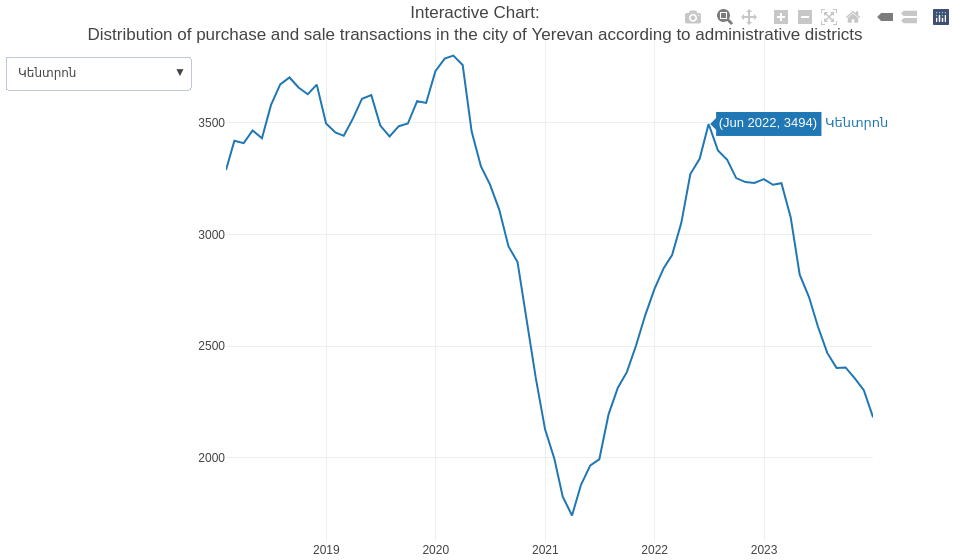

```{r setup, include=FALSE}
knitr::opts_chunk$set(echo = TRUE)

library(tidyverse)
library(scales)
library(plotly)
library(ggtext)
library(patchwork)

rm(list = ls()); gc()

theme_tvyal <- function(base_size = 12, base_family = "sans")
{
  colors <- deframe(ggthemes::ggthemes_data[["fivethirtyeight"]])
  (ggthemes::theme_foundation(
    base_size = base_size, base_family = base_family) +
      theme(
        line = element_line(colour = "black"),
        rect = element_rect(fill = "white", linetype = 0, colour = NA),
        text = element_text(colour = colors["Dark Gray"]),
        # axis.title = element_blank(),
        # axis.text = element_text(),
        axis.ticks = element_blank(),
        axis.line = element_blank(),
        legend.background = element_rect(),
        legend.position = "bottom",
        legend.direction = "horizontal",
        legend.box = "vertical",
        panel.grid = element_line(colour = NULL),
        panel.grid.major.x = element_line(colour = colors["Medium Gray"]),
        panel.grid.major.y = element_line(colour = colors["Medium Gray"]),
        panel.grid.minor = element_blank(),
        plot.title = element_text(hjust = 0, size = rel(1.5), face = "bold"),
        plot.margin = unit(c(1, 1, 1, 1), "lines"), strip.background = element_rect()
      )
  )
}

theme_set(theme_tvyal())

save_last_plot <-
  function(filename, extension = "png", width = 1008, height = 567) {

    filename <- str_replace_all(filename, " ", "_")
    last_plot <- recordPlot()

    if (extension == "png") {
      png(paste0(filename, ".", extension), width = width, height = height)
    } else if (extension == "pdf") {
      pdf(paste0(filename, ".", extension), width = width, height = height)
    } else {
      stop("Unsupported file extension. Use 'png' or 'pdf'.")
    }

    replayPlot(last_plot)
    dev.off()
    paste0(filename, ".", extension)
  }

new_palette_colors <- c(
  "#003f5c", "#2f4b7c", "#665191", "#a05195",
  "#d45087", "#f95d6a", "#ff7c43", "#ffa600"
)
colfunc <- colorRampPalette(c("#2f4b7c", "#fffcf5", "#f95d6a"))
colfunc2 <- colorRampPalette(new_palette_colors)
colfunc3 <- colorRampPalette(c("#005C4B", new_palette_colors, "#FFD17A", "#FFFCF5"))

update_geom_defaults("rect", list(fill  = new_palette_colors[2], alpha = 0.8))
update_geom_defaults("line", list(color = new_palette_colors[2], alpha = 0.8))
update_geom_defaults("area", list(fill  = new_palette_colors[2], alpha = 0.8))

caption_arm <-  "Հեղինակ` Աղասի Թավադյան   |   tvyal.com   |   tavadyan.com"
caption_eng <-  "Author: Aghasi Tavadyan   |   tvyal.com   |   tavadyan.com"

doParallel::registerDoParallel(cores = 8)

setwd(dirname(rstudioapi::getActiveDocumentContext()$path))
```


```{r get raw data download, include=FALSE}
apartament_annual_transactions <- read_csv("apartament_annual_transactions.csv")

apartament_annual_transactions_plot <- 
  apartament_annual_transactions |> 
  filter(name != "Total") |> 
  ggplot(aes(year, count, fill = name, label = number(count, accouracy = 1))) +
  geom_col() +
  geom_text( position = position_stack(vjust = 0.5)) +
  scale_x_continuous(breaks = 2010:2023) +
  scale_fill_manual(values = new_palette_colors[c(2,6,8)]) +
  labs(
    x = NULL,
    y = NULL,
    fill = NULL,
    title = "23.8% fewer apartments were sold in Yerevan in 2023",
    subtitle = "The distribution of apartament transactions in Armenia",
    caption = paste0(caption_eng, "   |   Data Source: cadastre.am")
  ) +
  theme(
    panel.grid.major.x = element_blank(),
    panel.grid.major.y = element_blank(),
    axis.text.y = element_blank(),
  )

```


```{r, include=FALSE}
yerevan_transactions_yoy <- 
  read_csv("yerevan_transactions_yoy.csv") |> 
  mutate(place = fct_reorder(place, n, max, .desc = TRUE))

yerevan_annual_transactions_data <- 
  yerevan_transactions_yoy |> 
  mutate(
    month = month(date),
    year = year(date),
    place = str_replace(place, "-", "-\n"),
    place = str_replace(place, " ", "\n"),
    place = fct_reorder(place, n, max, .desc = TRUE),
    count_text = number(n, accuracy = 1)
  ) |> 
  filter(
    month == 12,
    year %in% c(2020:2023)
  )


p1 <- 
  yerevan_annual_transactions_data |> 
  ggplot(aes(place, n, fill = as.factor(year))) +
  geom_col(position = position_dodge()) +
  scale_fill_manual(values = new_palette_colors[c(8,6,2,1)]) +
  theme(
    panel.grid.major.x = element_blank(),
    panel.grid.major.y = element_blank(),
    axis.text.y = element_blank(),
    legend.position = "null"
  ) +
  labs(
    x = NULL,
    y = NULL,
    fill = NULL,
    title = "Fewer apartments were sold in 2023 than even in 2020",
    subtitle = "The distribution of apartament transactions in the city of Yerevan by administrative districts",
  )


yerevan_annual_transactions_table_data <- 
  yerevan_annual_transactions_data |> 
  mutate(
    color = case_when(
      year == 2020 ~ new_palette_colors[8],
      year == 2021 ~ new_palette_colors[6],
      year == 2022 ~ new_palette_colors[2],
      year == 2023 ~ new_palette_colors[1],
    ),
    year = fct_reorder(as_factor(glue::glue("<b style='color:{color}'>■</b> {year}")), year)
  ) %>%
  select(year, place, count_text)

p2 <-
  yerevan_annual_transactions_table_data %>%
  ggplot(aes(place, year, label = count_text)) +
  geom_text() +
  geom_hline(yintercept = c(1.5, 2.5, 3.5), colour='grey') +
  theme_void() +
  theme(
    axis.text.y = element_markdown(),
    plot.title = element_blank()
  ) +
  labs(
     caption = paste0(caption_eng, "   |   Data Source: cadastre.am")
  )

yerevan_annual_transactions_plot <- 
  p1 + p2 + plot_layout(ncol = 1, heights = c(7, 2))


```


```{r, include=FALSE}

columns <- yerevan_transactions_yoy |> count(place) |> pull(place)

plotly_data <- 
  yerevan_transactions_yoy |> 
  arrange(place) |> 
  pivot_wider(names_from = "place", values_from = n)

fig <- plot_ly()


fig <- plot_ly(plotly_data, x = ~date)

for (i in 1:length(columns)) {
  if (columns[i] == columns[1]) {
    fig <- fig |> 
      add_lines(
        y = as.formula(paste0("~`", columns[i], "`")),
        # color = colfunc3(length(cofiglumns))[i],
        name = columns[i]
      )
  } else{
    fig <- fig |> 
      add_lines(
        y = as.formula(paste0("~`", columns[i], "`")), 
        # color = colfunc3(length(columns))[i],
        name = columns[i], visible = F
      )
  }
}

# 


generate_button_list <- function(labels) {
  button_list <- list()
  
  for (i in seq_along(labels)) {
    visible_values <- rep(FALSE, length(labels))
    visible_values[i] <- TRUE
    # visible_colors <- rep("lightgray", length(labels))
    # visible_colors[i] <- "midnightblue"
    
    button <- list(
      method = "restyle",
      args = list("visible", visible_values),
      # args = list("line.color", visible_colors),
      label = labels[i]
    )
    
    button_list[[i]] <- button
  }
  
  return(button_list)
}

# generate_button_list(columns)


plotly_fig <- 
  fig %>% 
  layout(
    title = "Interactive Chart:\nDistribution of purchase and sale transactions in the city of Yerevan according to administrative districts",
    yaxis = list(title = ""),
    xaxis = list(domain = c(0, 0.9), title = ""),
    showlegend = FALSE,
    updatemenus = list(
      list(
        y = 0.95,
        buttons = generate_button_list(columns)
      )
    )
  )
```


***English summary below.***

Հարգելի գործընկեր,

Հուսով եմ լավ եք:
Ներկայացնում եմ այս շաբաթվա վերլուծությունները և աշխատանքները.


## 🏠🔄🤔 Անշարժ գույքի գների 13.5% աճ, գործարքների 40.9% անկում*

### Երևանի անշարժ գույքի շուկայի 2023 թվականի հետազոտություն

Երևանում փաստացի երկրորդային շուկայում բնակարանների վաճառքի գները նվազել են: Այնուամենայնիվ, Կադաստրի կոմիտեի տվյալները ուսումնասիրելիս 2023 թվականի վերջին թվերը վկայում են զգալի աճի մասին: Երևանի կենտրոնում բազմաբնակարան բնակելի շենքերի մեկ քառակուսի մետրի միջին գինը 2023 թվականին կազմել է 837 700 դրամ, իսկ 2022 թվականի 737 800 դրամ։ Գներն աճել են 13,5 տոկոսով, իսկ 2022 թվականին աճը կազմել էր 16,6 տոկոս։ Հատկանշական է, որ Կենտրոնում բազմաբնակարան շենքերի մեկ քառակուսի մետրի միջին գինը 2023 թվականին աճել է 13,5%-ով, սակայն այս տիպի շենքերի վաճառքի գործարքների թիվը Կենտրոնում նվազել է 40,9%-ով։

**Գծապատկեր 1.** Հայաստանում առքուվաճառքի գործարքների բաշխումը

```{r, echo=FALSE, warning=FALSE, fig.width = 12, fig.height = 8}
apartament_annual_transactions_plot
```

Անհրաժեշտ է հասկանալ թե ինչով է պայմանավորված վերջին 2 տարիների ընթացքում գրանցված Երևանի առքուվաճառքի գների աճը, որպեսզի նաև կարողանանք գնահատել ապագա գնային փոփոխությունները։

Հիմնականում բնակարանների շինարարության աճի քանակի և գնի բարձրացման վրա ազդել են 2 գործոն՝ Ռուսաստանի դեմ սանկցիաներով պայմանավորված զգալի քանակությամբ կապիտալի ներհոսքը Հայաստան և մեծ քանակությամբ վերաբնակիչների մուտքը Ռուսատանից։

2022-ին բանկային համակարգով ֆիզիկական անձանց կողմից կատարված մուտքերը գրանցել են աննախադեպ 2.5 անգամ աճ, 2021 թվականին բանկային համակարգ իրավաբանական անձանց միջոցով մուտք է գործել 2.1 մլրդ դոլար, իսկ 2023-ին արդեն 5.2 մլրդ։ Այս գումարների մեծ մասը ուղղվել է շինարարություն, քանզի առաջի ձեռքից գնելու դեպքում բազմաբնակարան շենքերի գնելուց եկամտահարկի վերադարձը առաջնային խթան է հանդիսանում հիմնականում այդ ոլորտ ներդրումներ կատարելու համար։

2023 թվականին գրանցել է ֆիզիկական անձանց կողմից կատարված մուտքերի 9,7 տոկոս աճ՝ 2022 թվականի զգալի 2,5 անգամ աճի համեմատ: Այնուամենայնիվ, նկատվում է բանկային փոխանցումների կտրուկ անկում 2023 թվականի կեսից: Նշեմ նաև որ 2023 թվականին 55 տոկոսով ավելի շատ փող է դուրս եկել բանկային համակարգով Հայաստանից 2022-ի համեմատ։ Սա բացասական է հատկապես բնակարանաշինարարության տեսանկյունից, քանզի բանկային համակարգի եկամուտները հիմնականում ներդրվում են այս ոլորտում։

<small>Նշենք, որ եկամտահարկի վերադարձի օրենքը գործում է 2015-ից, նպատակը երկրում շինարարության ակտիվացումն էր։ Այս օրենքով բնակարան գնողների համար հիփոթեքային վարկի տոկոսները հետ են վերադարձվում գնորդի եկամտահարկի չափով։ 2021-ի սեպտեմբերին կառավարությունը որոշել էր աստիճանաբար հրաժարվել Երևանում եկամտահարկի վերադարձով բնակարանների ձեռքբերման հնարավորությունից։ Մասնավորապես, 2022-ից ծրագիրը դադարեցվել է Կենտրոնում և Արաբկիրում, իսկ 2025-ից՝ ամբողջ Երևանում։[**](https://infocom.am/hy/article/106185)</small>

Վերաբնակիչների մուտքը 2022 թվականին զգալի բարձրացրեց վարձով տրվող բնակարանների գինը, որի հետևանքով 1 սենյականոց բնակարանի վարձի գինը մինչև 2023 թվականի աշունը Երևանի կենտրոնում ավելի թանկ էր քան նույնիսկ Մոսկվայի կենտրոնում։ 

>
> Կարդացեք նաև. [💲🏙️  Երևանը Մոսկվայից ավելի թանկ է](https://www.tvyal.com/newsletter/2024/2024_01_12)։
>

2022 թվականին Ռուսաստանի Դաշնության քաղաքացիների ներհոսքը զգալիորեն բարձրացրեց վարձով բնակարանների գները։ Մինչև 2023 թվականի աշունը Երևանի կենտրոնում 1 սենյականոց բնակարանի արժեքը գերազանցում էր նույնիսկ Մոսկվայում նույն տիպի բնակարանի արժեքին։ Նշեմ որ, 2021 թվականին 45 ք․մ․ բնակարանի վարձակալության արժեքը Երևանի կենտրոնում կազմում էր մոտ 700 դոլար, 2022 թվականի սեպտեմբերից մինչև 2023 թվականի սեպտեմբերը արդեն՝ 1000 դոլար։ Սակայն այժմ նմանատիպ բնակարանի վարձակալության գինը իջել է 750 դոլար։ Հավանական է, որ սա սեզենային բնույթ ունի, քանզի ձմռան սեզոնին պահանջարկը ավելի ցածր է և վարձակալության գները ամռանը ունեն բարձրանալու միտում։ Սակայն 2022-23 թվականի ձմռանը բնակարանների գնի սեզոնային իջեցում չնկատվեց, քանզի առկա էր ՌԴ քաղաքացիների մեծ ներհոսք։ ՌԴ քաղաքացիները հոսքը ունի միջնաժամկետ բնույթ և հնարավոր է որ 2024 թվականին վարձակալության գները ավելի ցածր լինեն 2023 թվականի համեմատ։

Այս երկու գործոնների՝ բանկերի կապիտալի ներհոսքի և վերաբնակեցվողների ներհոսքի կրճատումը կարող է բացասական ազդեցություն ունենալ մեր անշարժ գույքի շուկայի վրա: 


Հատկանշական է, որ Երևանում բազմաբնակարան շենքերի գները շարունակում են թանկանալ։ Սակայն Երևանում անշարժ գույքի օտարման գործարքների թիվը 2023 թվականին նվազել է 14,2%-ով (25 644-ից իջնելով 22 012-ի), իսկ առքուվաճառքի գործարքները նվազել են 23,8%-ով (17 734-ից՝ մինչև 13 513)։ Ընդհանուր առմամբ, 2023 թվականին Երևանում գրանցվել է բազմաբնակարան շենքերի բնակարանների առքուվաճառքի 8 073 գործարք՝ 2022 թվականի 11 466 գործարքի համեմատ։ Ընդ որում, բազմաբնակարան շենքերի առքուվաճառքի գործարքների թիվը 2023 թվականին նվազել է 29,6%-ով։


**Աղյուսակ 2.** Երևան քաղաքում առքուվաճառքի գործարքների բաշխումը ըստ վարչական շրջանների

```{r, echo=FALSE, warning=FALSE, fig.width = 12, fig.height = 8}
yerevan_annual_transactions_plot
```


Երևանում առքուվաճառքի գործարքների ամենաէական նվազումը գրանցվել է Դավիթաշենում՝ 46,9 տոկոսով, գրեթե 2 անգամ։ 2023 թվականին գործարքների միակ աճը գրանցվել է Քանաքեռ-Զեյթունում՝ 5,5% աճ, իսկ քաղաքի մյուս հատվածներում անկում է գրանցվել։ Իրավաբանական անձինք 2023 թվականին Երևանում վաճառել են 2829 անշարժ գույք՝ 2022 թվականի 3078-ի դիմաց, այսինքն գրանցվել է 8.1% անկում։ Ամբողջ հանրապետությունում իրավաբանական անձինք 2023 թվականին վաճառել են 1777 բնակարան՝ 2022 թվականի 2364-ի դիմաց՝ 24,8 տոկոս անկում։ Նվազել են նաև օտարերկրյա քաղաքացիների կողմից իրականացված գործարքները՝ 2023 թվականին ձեռք է բերվել 738 բնակարան՝ 2022 թվականի 991-ի դիմաց, այսինքն 25,5% կրճատում։

Ստորև ներկայացված է Երևանի վարչական շրջանների բնակարանների առքուվաճառքի գործարքների քանակությունը։ Գծապատկերի յուրաքանչյուր կետը ներկայացնում է նախորդ 12 ամիսների գումարը։ Գծապատկերը ինտերակտիվ է, որի հետ կարող եք աշխատել, այցելելով [մեր կայքը](https://www.tvyal.com/newsletter/2024/2024_02_23)։

**Գծապատկեր 3.** [Երևան քաղաքում առքուվաճառքի գործարքների բաշխումը ըստ վարչական շրջանների](https://www.tvyal.com/newsletter/2024/2024_02_23)

```{r, echo=FALSE, warning=FALSE, fig.width = 10, fig.height = 6}
plotly_fig
```

<!-- [](https://www.tvyal.com/newsletter/2024/2024_02_23) -->

Հատկանշական է, որ 2020 թվականին, երբ գրանցվեց COVID-19 համավարակը և տեղի ունեցավ 44-օրյա պատերազմը, վաճառվել է բազմբանկելի 8 172 բնակարան։ Փաստորեն, 2023-ին ավելի քիչ բազմբանկելի բնակարան է վաճառվել, քան նույնիսկ 2020-ին: Սակայն քառակուսի մետրի միջին գինը 2023-ին շարունակել է աճել՝ գներն աճել են 13,5%-ով կենտրոնում, 12,6%-ով Կոմիտասում, և չնայած Դավիթաշենում գրանցվել ամենամեծ բազմաբնակարան շենքերի վաճառքի նվազումը (գրեթե 2 անգամ), այնտեղ նույնպես արձանագրվել է գնի աճ՝ 11,9%-ով։

>
> 2023-ին Երևանում ավելի քիչ բնակարան է վաճառվել քան նույնիսկ 2020 թվականին։
>


<small>Նշենք որ մեր կողմից քերվել է Կադաստրի պետական կոմիտեի կողմից ներկայացրած ավելի քան [400 շուկայի վերլուծությունները](https://www.cadastre.am/analyze): Այս գործողության արդյունքում ստացել եմ եզակի տվյալների բազա որը ներառում է անշարժ գույքի գործարքների և 1 ք.մ. մակերեսի գնի փոփոխության եզակի տվյալների բազա: 1 քմ մակերեսի գնի տվյալների բազան ներառում է գների փոփոխություններ Երևանի 58 վարչական շրջանի և գոտու ինչպես նաև հանրապետության 48 քաղաքի համար 2002 թվականից սկսած: Տվյալների բազան նաև ներառում է գործարքների քանակությունը ըստ տարբեր չափանիշների։ Նշենք նաև որ ընդհանուր 4 մոդելով իրականացվել է Հայստանի անշարժ գույքի գնի 84 տարածքի համար կանխատեսում (Երևանի 11 վարչական շրջանի 28 գնային գոտի, ՀՀ մարզերի 45 քաղաք):*
    
Պահանջարկ լինելու դեպքում հնարավոր է ստեղծել բոլոր կանխատեսումների համար ինտերակտիվ գործիք, որը թույլ կտա անշարժ գույքով զբաղվող մասնագետներին կատարել տեղեկացված որոշումներ: Վահանակը յուրաքանչյուր տեղի համար կներառի հավելյալ վերլուծություն և մոդելների հուսալիության գնահատականներ: Մեր կողմից ստեղծված նմանատիպ վահանակ արդեն առկա է Հայաստանի [արտահանման կանխատեսումներ համար](https://tavad.shinyapps.io/exports_forecast/): Վերջին վահանակում զետեղված է ավելի քան հազար կանխատեսում:</small>

>
> Ձեզ կարող է հետաքրքրել նաև հետևյալ նյութը․ [🏠💰 📉 Տնային տնտեսությունները աղքատացել են](https://www.tvyal.com/newsletter/2024/2024_01_07)։
>

Երևանի անշարժ գույքի շուկան 2023 թվականի ընթացքում բացասական միտումներ է դրսևորել: Թեև բազմաբնակարան շենքերի մեկ քառակուսի մետրի միջին գները նկատելի աճ են գրանցել՝ հատկապես Երևանի կենտրոնում, գործարքների ընդհանուր թիվը զգալի անկում է ապրել 2023 թվականին: Անշարժ գույքի գների աճի և գործարքների ծավալների նվազման միջև ակնհայտ հակասությունը մտահոգություն է առաջացնում այս ոլորտի երկարաժամկետ աճի կայունության վերաբերյալ: Ինչպես բանկերի կապիտալի ներհոսքի, այնպես էլ վերաբնակեցման ներհոսքի բացասական աճը կարող է մարտահրավերներ առաջացնել անշարժ գույքի շուկայի համար առաջիկա ժամանակահատվածում:


-----

\* Վերնագրում բերված ցուցանիշները վերաբերում են Երևանի կենտրոնում գտնվող բազմաբնակարան շենքերի առքուվաճառքի տվյալներին։ Այս վերլուծության բոլոր տվյալները վերցված են պաշտոնական աղբյուրներից, մասնավորապես՝ Կադաստրի կոմիտերի [հաշվետվություններից](https://cadastre.am/analyze)՝ [2022](https://cadastre.am/storage/files/2022.pdf), [2023](https://cadastre.am/storage/files/2023_3.pdf)։ Հաշվարկները ամբողջությամբ հասանելի են github-ում, դրանք կարելի է ստուգել այցելելով [github-ի](https://github.com/tavad/tvyal_newsletter/blob/main/2024/) մեր էջը, որտեղ տրված են տվյալները, հաշվարկների և գծապատկերների կոդը։


## English Summary

**🏠🔄🤔 13.5% increase in real estate prices, 40.9% decrease in transactions**

In 2023, fewer apartments were sold in Yerevan than even in 2020

The shift in apartment prices in Yerevan reveals a complex interplay of economic factors. The latest data from the Cadastre Committee for 2023 indicates a substantial increase. In the city center, the average price per square meter for apartment buildings rose to 837,700 AMD in 2023, marking a 13.5% increase from the previous year. Notably, this increase occurred alongside a sharp decline in the number of transactions for these buildings, dropping by 23.8% in 2023 in Yerevan. the figures visually represent these trends, illustrating the apparent discrepancy between declining transaction volumes and rising property values.

Two predominant factors emerge as key drivers behind the surge in both the number and prices of housing construction: the influx of capital into Armenia due to sanctions against Russia and a significant arrival of settlers from Russia. In 2023, individual inflows through the banking system reached 5.2 billion dollars, a substantial increase from the 2.1 billion dollars recorded in 2021. This capital injection, primarily directed toward construction, was incentivized by income tax refunds related to pre-sale apartment purchases. Additionally, the arrival of Russian settlers in 2022 notably impacted rental prices, making 1-room apartments in the center of Yerevan more expensive than their counterparts in Moscow until the fall of 2023. The interplay of these economic factors defines the landscape of Yerevan's real estate market and warrants close attention for future evaluations.


---

Այս վերլուծությունը առկա է նաև [մեր կայքէջում](https://www.tvyal.com/newsletter/2024/2024_02_23), այս վերլուծության կոդը և տվյալները դրված են նաև [Github-ում](https://github.com/tavad/tvyal_newsletter)։       

---                  

Եթե հնարավոր է, խնդրում եմ այս նյութը ուղարկել նաև այն մարդկանց, ում այն կարծում եք կարող է հետաքրքրել:

Սպասեք հաջորդ հաղորդագրությանը հաջորդ ուրբաթ օրը:      


Հարգանքներով,            
Աղասի Թավադյան         
23.02.2024          
[tvyal.com](https://www.tvyal.com/)      
[tavadyan.com](https://www.tavadyan.com/)

---

[Was this email forwarded to you? Subscribe here.](https://www.tvyal.com/subscribe)

[Բաժանորդագրվեք](https://www.tvyal.com/subscribe)

       
---              
               


####### **Ուշադրություն. Ձեր էլ.փոստը մեյլիսթի մեջ է, որի միջոցով ես կիսվում եմ շաբաթական նյութեր, որոնք հիմնականում ներկայացնում են Հայաստանի տնտեսությանը: Նյութերը ներառում են գծապատկերներ, [տվյալների բազաներ](https://github.com/tavad/tvyal_newsletter), տեսանյութեր, հոդվածներ, [առցանց վահանակներ](https://www.tvyal.com/projects), տնտեսական գործիքներ, կանխատեսումներ և հաշվետվություններ: Եթե ցանկանում եք չեղարկել բաժանորդագրությունը, խնդրում եմ տեղեկացրեք ինձ, և ես կհեռացնեմ ձեր էլ. փոստը ցուցակից: Գրեք նաև եթե ունեք մենկնաբանություններ:**

####### **Important! Your email is part of the mailing list where I share weekly materials primarily focused on the Armenian economy. These materials encompass charts, [databases](https://github.com/tavad/tvyal_newsletter), videos, articles, [online dashboards](https://www.tvyal.com/projects), economic tools, forecasts, and reports. If you wish to unsubscribe, please let me know, and I will remove your email from the list. Please share your comments as well․**


