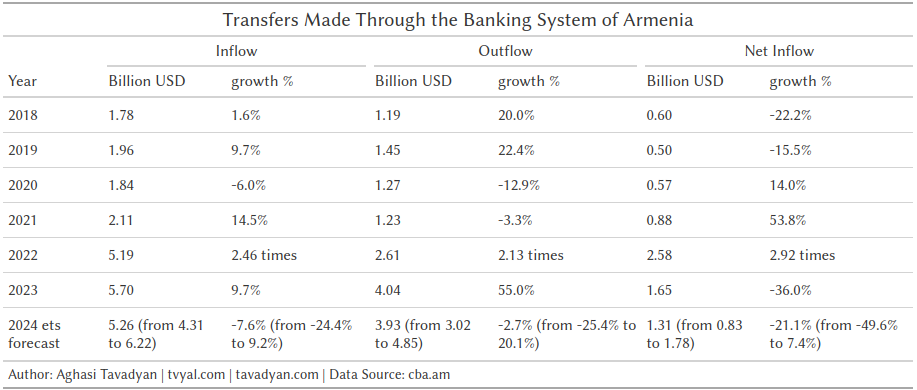

```{r setup, include=FALSE}
knitr::opts_chunk$set(echo = TRUE)

library(tidyverse)
library(scales)
library(readxl)
library(RcppRoll)
library(hpfilter)
library(gt)

rm(list = ls()); gc()

theme_tvyal <- function(base_size = 12, base_family = "sans")
{
  colors <- deframe(ggthemes::ggthemes_data[["fivethirtyeight"]])
  (ggthemes::theme_foundation(
    base_size = base_size, base_family = base_family) +
      theme(
        line = element_line(colour = "black"),
        rect = element_rect(fill = "white", linetype = 0, colour = NA),
        text = element_text(colour = colors["Dark Gray"]),
        # axis.title = element_blank(),
        # axis.text = element_text(),
        axis.ticks = element_blank(),
        axis.line = element_blank(),
        legend.background = element_rect(),
        legend.position = "bottom",
        legend.direction = "horizontal",
        legend.box = "vertical",
        panel.grid = element_line(colour = NULL),
        panel.grid.major.x = element_line(
          colour = colors["Medium Gray"], 
          linetype = "dotted"
        ),
        panel.grid.major.y = element_line(
          colour = colors["Medium Gray"], 
          linetype = "dotted"
        ),
        panel.grid.minor = element_blank(),
        plot.title = element_text(hjust = 0, size = rel(1.5), face = "bold"),
        plot.margin = unit(c(1, 1, 1, 1), "lines"), strip.background = element_rect()
      )
  )
}

theme_set(theme_tvyal())

save_last_plot <-
  function(filename, extension = "png", width = 1008, height = 567) {

    filename <- str_replace_all(filename, " ", "_")
    last_plot <- recordPlot()

    if (extension == "png") {
      png(paste0(filename, ".", extension), width = width, height = height)
    } else if (extension == "pdf") {
      pdf(paste0(filename, ".", extension), width = width, height = height)
    } else {
      stop("Unsupported file extension. Use 'png' or 'pdf'.")
    }

    replayPlot(last_plot)
    dev.off()
    paste0(filename, ".", extension)
  }

new_palette_colors <- c(
  "#003f5c", "#2f4b7c", "#665191", "#a05195",
  "#d45087", "#f95d6a", "#ff7c43", "#ffa600"
)
colfunc <- colorRampPalette(c("#2f4b7c", "#fffcf5", "#f95d6a"))
colfunc2 <- colorRampPalette(new_palette_colors)
colfunc3 <- colorRampPalette(c("#005C4B", new_palette_colors, "#FFD17A", "#FFFCF5"))

update_geom_defaults("rect", list(fill  = new_palette_colors[2], alpha = 0.8))
update_geom_defaults("line", list(color = new_palette_colors[2], alpha = 0.8))
update_geom_defaults("area", list(fill  = new_palette_colors[2], alpha = 0.8))

caption_arm <-  "Հեղինակ` Աղասի Թավադյան   |   tvyal.com   |   tavadyan.com"
caption_eng <-  "Author: Aghasi Tavadyan   |   tvyal.com   |   tavadyan.com"

doParallel::registerDoParallel(cores = 8)

setwd(dirname(rstudioapi::getActiveDocumentContext()$path))

```


```{r get databases, include=FALSE}
# # uncomment and run the command below to update the data
# system("curl https://www.cba.am/stat/stat_data_eng/5_Money_transfers_of_individuals_by_countries-eng.xlsx -o transfers_by_countries.xlsx")

transfers_raw <- read_excel("transfers_by_countries.xlsx")

transfers_forecast <- read_csv("transfers_forecast.csv")
```


```{r data cleaning, include=FALSE}

transfers_clean <-
  transfers_raw %>%
  t(.) |> as_tibble() |>
  # row_to_names is the function that gives the warning
  janitor::row_to_names(row_number = 1) |>
  rename(
    na = 1,
    year = 2,
    month = 3,
    direction = 4
  ) |>
  select(-na) |>
  mutate(
    type = case_when(
      grepl("of which", month) ~ "non-commercial",
      !grepl("of which", month) & !is.na(month) ~ "total"
    ),
    month = ifelse(grepl("of which", month), NA, month),
  ) |>
  fill(year, month, type, .direction = "down") |>
  pivot_longer(
    -c(year, month, direction, type),
    names_to = "country", values_to = "K_USD"
  ) |>
  mutate(
    K_USD = as.numeric(K_USD),
    month_name = month,
    month = c(1:12)[match(month_name, month.name)],
    date = ym(paste(year, month)),
    date = date + months(1) - days(1)
  ) |>
  relocate(date, year, month, month_name, country, direction, type, K_USD) |> 
  filter(!is.na(K_USD))

transfers_clean |>
  write_excel_csv("transfers_by_countries_clean.csv")

```


```{r chart_1, include=FALSE}
max_month <-
  transfers_clean |>
  filter(date == max(date)) |>
  pull(month) |>
  unique()

transfers_total_chart <- 
  transfers_clean |>
  filter(
    # month <= max_month,
    direction %in% c("Inflow", "Outflow"),
    # type == "non-commercial",
    type == "total",
    country != "Total",
    year <= 2023
  ) |>
  mutate(
    country = case_when(
      grepl("Emirates", country) ~ "UAE",
      grepl("Kingdom", country) ~ "UK",
      TRUE ~ country
    ),
    country = fct_lump_n(
      country, n = 10, w = K_USD,
      other_level = "Others"
    ),
    country = fct_reorder(country, K_USD, .desc = TRUE),
    country = fct_relevel(country, "Others", after = Inf)
  ) |>
  group_by(year, country, direction, type) |>
  summarise(K_USD = sum(K_USD), .groups = "drop") |>
  group_by(year, direction, type) |>
  mutate(
    pct = K_USD / sum(K_USD),
    pct_text = percent(pct, accuracy = 0.1),
    pct_text = ifelse(K_USD <= 1e5, "", pct_text)
  ) |>
  ungroup() |>
  ggplot(aes(year, K_USD / 1e6, fill = country)) +
  geom_col() +
  geom_text(aes(label = pct_text),  position = position_stack(vjust = .5)) +
  facet_wrap(~direction) +
  scale_y_continuous(labels = number_format(accuracy = 1), n.breaks = 6) +
  scale_fill_manual(values = colfunc3(10)) +
  labs(
    x = NULL,
    y = NULL,
    fill = NULL,
    title = "Transfers made by individuals through the banking system of Armenia",
    subtitle = "In a Year, Billions of USD",
    caption =paste0(caption_eng, "   |   Data Source: CBA.am")
  ) +
  theme(
     panel.grid.major.x = element_blank()
  )

```

```{r charts 2&3, include=FALSE}
transfers_date <-
  transfers_clean |>
  filter(
    direction %in% c("Inflow", "Outflow"),
    # type == "non-commercial",
    type == "total",
    country != "Total",
  ) |>
  mutate(
    country = case_when(
      grepl("Emirates", country) ~ "UAE",
      grepl("Kingdom", country) ~ "UK",
      TRUE ~ country
    ),
    country = fct_lump_n(
      country, n = 10, w = K_USD,
      other_level = "Others"
    )
  ) |>
  group_by(date, country, direction, type) |>
  summarise(K_USD = sum(K_USD), .groups = "drop") |>
  arrange(country, direction, type, date) |>
  group_by(country, direction, type) |>
  mutate(K_USD_YOY = roll_sumr(K_USD, 12)) |>
  ungroup() |>
  na.omit()


chart_2 <- 
  transfers_date |>
  mutate(
    country = fct_reorder(country, K_USD_YOY, .desc = TRUE),
    country = fct_relevel(country, "Others", after = Inf)
  ) |>
  filter(date >= ymd("2019-12-30")) |>
  ggplot(aes(date, K_USD_YOY / 1e6, fill = country)) +
  geom_area() +
  facet_wrap(~direction) +
  scale_x_date(date_breaks = "1 year", date_labels = "%Y") +
  scale_y_continuous(breaks = 0:7, labels = number_format(accuracy = 1)) +
  scale_fill_manual(values = colfunc3(10)) +
  # scale_fill_brewer(type = "qual", palette = 3) +
  labs(
    x = NULL,
    y = NULL,
    fill = NULL,
    title = "Transfers made by individuals through the banking system of Armenia",
    subtitle = "Year over Year, Billions of USD",
    caption =paste0(caption_eng, "   |   Data Source: CBA.am")
  )

chart_3 <-
  transfers_date |>
  mutate(
    country = fct_reorder(country, K_USD_YOY, .desc = TRUE),
    country = fct_relevel(country, "Others", after = Inf)
  ) |>
  filter(date >= ymd("2019-12-30")) |>
  ggplot(aes(date, K_USD / 1e3, fill = country)) +
  geom_area() +
  facet_wrap(~direction) +
  scale_x_date(date_breaks = "1 year", date_labels = "%Y") +
  scale_y_continuous(labels = number_format(accuracy = 1)) +
  scale_fill_manual(values = colfunc3(10)) +
  labs(
    x = NULL,
    y = NULL,
    fill = NULL,
    title = "Transfers made by individuals through the banking system of Armenia",
    subtitle = "On Monthly Basis, Millions of USD",
    caption =paste0(caption_eng, "   |   Data Source: CBA.am")
  )

# transfers_date |> 
#   group_by(date, direction, type) |> 
#   summarise(
#     K_USD = sum(K_USD), K_USD_YOY = sum(K_USD_YOY)
#   ) |> view()


transfers_date |>
  mutate(
    country_arm = countrycode(country, origin = "country.name", destination = "cldr.name.hy"),
    country_arm = ifelse(is.na(country_arm), "Այլ պետություններ", country_arm),
    country_arm = fct_reorder(country_arm, K_USD_YOY, .desc = TRUE),
    country_arm = fct_relevel(country_arm, "Այլ պետություններ", after = Inf),
    country = fct_reorder(country, K_USD_YOY, .desc = TRUE),
    country = fct_relevel(country, "Others", after = Inf),
    direction_arm = ifelse(direction == "Inflow", "Ներհոսք", "Արտահոսք"),
    direction_arm = fct_rev(direction_arm)
  ) |> 
  filter(date >= ymd("2019-12-30")) |>
  ggplot(aes(date, K_USD_YOY / 1e6, fill = country_arm)) +
  geom_area() +
  facet_wrap(~direction_arm) +
  scale_x_date(date_breaks = "1 year", date_labels = "%Y") +
  scale_y_continuous(breaks = 0:7, labels = number_format(accuracy = 1)) +
  scale_fill_manual(values = colfunc3(10)) +
  # scale_fill_brewer(type = "qual", palette = 3) +
  labs(
    x = NULL,
    y = NULL,
    fill = NULL,
    title = "Հայաստանի բանկային համակարգի միջոցով կատարված փոխանցումներ*",
    subtitle = "մլրդ ԱՄՆ դոլար, 12-ամսյա կտրվածքով",
    caption =paste0("* ֆիզիկական անձանց կողմից\n\n", caption_arm, "   |   Տվյալների աղբյուր՝ CBA.am")
  )

```


```{r, include=FALSE}
transfers_clean |>
  filter(
    direction %in% c("Inflow", "Outflow"),
    direction == "Outflow",
    type == "total",
    country != "Total",
    year >= 2022
    ) |>
  mutate(
    country = fct_lump_n(country, n = 11, w = K_USD,
                         other_level = "Other_countries")
  ) |>
  group_by(date, country, direction, type) |>
  summarise(K_USD = sum(K_USD), .groups = "drop") |>
  mutate(country = fct_reorder(country, K_USD)) |>
  ggplot(aes(date, K_USD / 1e3, fill = country)) +
  geom_area() +
  scale_x_date(date_breaks = "2 months", date_labels = "%m %Y") +
  scale_y_continuous(labels = number_format(accuracy = 1)) +
  scale_fill_brewer(type = "qual", palette = 3) +
  labs(
    fill = NULL,
    title = "Outflow of transfers made through the banking system of Armenia",
    subtitle = "From 2022, On Monthly Basis, Millions of USD",
    caption =paste0(caption_eng, "   |   Data Source: CBA.am")
  )
```

```{r, include=FALSE}
transfers_forecast_plot <- 
  transfers_forecast %>%
  filter(
    type == "total", 
    # direction == "Net inflow",
    !grepl("arima|bats", model_name),
    date >= ym("2019-01"),
    period == "YoY"
  ) |> 
  mutate(
    across(where(is.numeric), ~.x / 1e6),
    direction = factor(direction, levels = c("Inflow", "Outflow", "Net inflow"))
  ) |> 
  ggplot(aes(date, K_USD, color = model_name, lty = model_name)) +
  facet_wrap(~direction, scales = "free_y") +
  geom_line(linewidth = 1) +
  geom_ribbon(aes(ymin = ribbon_low, ymax = ribbon_high), alpha = .2) +
  scale_x_date(date_breaks = "2 year", date_labels = "%Y") +
  scale_y_continuous(labels = number_format(), n.breaks = 7) +
  scale_color_manual(values = new_palette_colors[c(2,5,7,8,4)]) +
  scale_linetype_manual(values = c(1, 2, 2, 2, 2)) +
  labs(
    x = NULL,
    y = NULL,
    color = "Model name",
    linetype = "Model name",
    title = "Forecast of Transfers",
    subtitle = "Year over Year, Billions of USD",
    caption =paste0(caption_eng, "   |   Data Source: CBA.am")
  ) +
  theme(
    panel.grid.minor.x = element_line(
      colour = "lightgray", 
      linetype = "dotted"
    )
  )

############

last_date_value <- 
  transfers_forecast |> 
  filter(date == max(date)) |> 
  pull(date) |> 
  unique() - years(2)

gt_table_transfers <- 
  transfers_forecast |> 
  filter(
    month(date) == 12,
    period == "YoY",
    type == "total",
    grepl("stlm|Data", model_name),
    !c(!grepl("Data", model_name) & date == ymd(last_date_value))
  ) |> 
  filter(date != max(date)) |> 
  arrange(type, direction, date) |>
  group_by(type, direction) |>
  mutate(
    year = year(date),
    across(matches("ribbon"), ~ifelse(is.na(.x), K_USD, .x)),
    pct_change = ifelse(
      ribbon_low == K_USD,
      ifelse(
        K_USD / lag(K_USD) < 2,
        percent(K_USD / lag(K_USD) - 1, accuracy = 0.1),
        paste(number(K_USD / lag(K_USD), accuracy = 0.01), "times")
      ),
      paste0(
        percent(K_USD / lag(K_USD) - 1, accuracy = 0.1),
        " (from\n", percent(ribbon_low / lag(ribbon_low) - 1, accuracy = 0.1),  " to ",
        percent(ribbon_high / lag(ribbon_high) - 1, accuracy = 0.1), ")"
      )
    ),
    across(matches("K_USD|ribbon"), ~number(.x/1e6, accuracy = 0.01)),
    K_USD = ifelse(
      ribbon_low == K_USD,
      K_USD,
      paste0(
        K_USD, " (from\n", ribbon_low, " to ", ribbon_high, ")"
      )
    ),
    year = ifelse(ribbon_low == K_USD, year, paste(year, "\nets forecast"))
  ) |>
  ungroup() |>
  filter(
    date >= ym("2018-01")
  ) |>
  select(year, direction, K_USD, pct_change) |>
  mutate(
    direction = factor(direction, levels = c("Inflow", "Outflow", "Net inflow"))
  ) |>
  arrange(direction) |>
  pivot_wider(
    names_from = direction, values_from = c(K_USD, pct_change),
    names_vary = "slowest"
  ) |> 
  gt() |> 
  cols_label(
    year = "Year",
    K_USD_Inflow = "Billion USD",
    pct_change_Inflow = "growth %",
    K_USD_Outflow = "Billion USD",
    pct_change_Outflow = "growth %",
    `K_USD_Net inflow` = "Billion USD",
    `pct_change_Net inflow` = "growth %"
  ) |> 
  tab_spanner(
    label = "Inflow",
    columns = contains("_Inflow")
  ) |>
  tab_spanner(
    label = "Outflow",
    columns = contains("_Outflow")
  ) |>
  tab_spanner(
    label = "Net Inflow",
    columns = contains("Net inflow")
  ) |> 
  tab_header(
    title = "Transfers Made Through the Banking System of Armenia",
    # subtitle = "Billions of USD"
  ) |> 
  tab_footnote(
    footnote = paste0(caption_eng, "    |    Data Source: cba.am")
  )

```


```{r russia_transfers, include=FALSE}

russia_transfers <-
  transfers_clean |>
  filter(
    # country == "Total",
    country == "Russian Federation",
    direction == "Inflow"
  ) |>
  filter(year >= 2019) |> 
  arrange(country, direction, type, date) |>
  group_by(country, direction, type) |>
  mutate(K_USD_YOY = roll_sumr(K_USD, n = 12)) |>
  ungroup() |>
  mutate(type = fct_rev(type)) |>
  ggplot(aes(date, K_USD / 1e3, color = type)) +
  geom_line(linewidth = 1.2) +
  scale_x_date(date_breaks = "1 year", date_labels = "%Y") +
  scale_y_continuous(labels = number_format(), n.breaks = 6) +
  scale_color_manual(values = new_palette_colors[c(2,6)]) +
  labs(
    x = NULL,
    y = NULL,
    color = NULL,
    title = "Transfers Received from Russia",
    subtitle = "On Monthly Basis, Millions of USD",
    caption =paste0(caption_eng, "   |   Data Source: CBA.am")
  )

```


```{r, include=FALSE}
# GDP <-
#   read_csv("~/R/projects/GDP/GDP_expenditure.csv") |>
#   filter(abb_code == "gdp") |>
#   transmute(date, gdp_usd = value_usd_yoy) |>
#   filter(!is.na(gdp_usd))
#
# transfers_clean |>
#   filter(
#     country != "Total",
#     direction == "Inflow",
#     type == "non-commercial"
#   ) |>
#   mutate(
#     country = case_when(
#       grepl("Emirates", country) ~ "UAE",
#       grepl("Kingdom", country) ~ "UK",
#       TRUE ~ country
#     ),
#     country = fct_lump_n(
#       country, n = 5, w = K_USD,
#       other_level = "Others"
#     )
#   ) |>
#   group_by(date, country, direction, type) |>
#   summarise(K_USD = sum(K_USD), .groups = "drop") |>
#   arrange(country, direction, type, date) |>
#   group_by(country, direction, type) |>
#   mutate(K_USD_YOY = roll_sumr(K_USD, 12)) |>
#   ungroup() |>
#   na.omit() |>
#   mutate(date = date + months(1) - days(1)) |>
#   right_join(GDP) |>
#   mutate(
#     pct = (K_USD_YOY / 1000) / gdp_usd
#   ) |>
#   ggplot(aes(date, pct, fill = country)) +
#   geom_area() +
#   scale_x_date(date_breaks = "1 year", date_labels = "%Y") +
#   scale_y_continuous(
#     breaks = seq(0, 0.5, 0.02),
#     labels = percent_format(accuracy = 1)
#   ) +
#   scale_fill_brewer(type = "qual", palette = 3)
```


```{r, include=FALSE}


transfers_commercial_russian <-
  transfers_clean |>
  filter(
    # country == "Total",
    country == "Russian Federation",
    direction == "Inflow"
  ) |>
  pivot_wider(names_from = type, values_from = K_USD) |>
  janitor::clean_names() |>
  mutate(commercial = total - non_commercial) |>
  select(date, commercial)


transfers_commercial_russian |>
  select(commercial) |>
  hp2() |>
  rename(commercial_trend = commercial) |>
  bind_cols(transfers_commercial_russian) |>
  as_tibble() |>
  mutate(commercial_cycle = commercial - commercial_trend) |>
  pivot_longer(contains("commercial")) |>
  mutate(
    facet = ifelse(name == "commercial_cycle", "cycle", "price"),
    facet = fct_rev(facet)
  ) |>
  filter(date >= as.Date("2020-01-01")) |>
  ggplot(aes(date, value, color = name)) +
  geom_line()+
  facet_wrap(~facet, nrow = 2, scales = "free_y")

#
# Ռիցեսիայի վտանգ
#
#
# 
```


```{r, include=FALSE}

# recrate this:
# https://media.licdn.com/dms/image/D4E22AQF-OWDT11l-rQ/feedshare-shrink_2048_1536/0/1711187970640?e=1714003200&v=beta&t=ED_S9tLTFwlc59iTZRZVZbDw9jwqfVzlyBW09UzpPvE

```


***English summary below.***

Հարգելի գործընկեր,

Հուսով եմ լավ եք:
Ներկայացնում եմ այս շաբաթվա վերլուծությունները և աշխատանքները.


## 💸🔚🏦 Կապիտալի արտահոսք

### Միջազգային դրամական փոխանցումների վերլուծություն


2022 թվականն աննախադեպ տարի էր ֆիզիկական անձանցից դեպի հայկական բանկեր փոխանցումների աճի առումով, դրանք աճել են 2,5 անգամ՝ 2,1 մլրդ դոլարից հասնելով 5,2 մլրդ դոլարի։ 2022 թվականին արտարժույթի ներհոսքը բանկային համակարգ աճել է 2,5 անգամ, իսկ արտահոսքը՝ 2.1, զուտ ներհոսքը 2022 թվականին աճել է գրեթե 3 անգամ՝ 0.9 մլրդ դոլարից մինչև 2.9 մլրդ դոլար։ Այս աճը հիմնականում պայմանավորված է եղել Ռուսաստանից ստացված բանկային փոխանցումներով, որոնք քառապատկվել են՝ 865 մլն դոլարից հասնելով 3,6 մլրդ դոլարի։ Արդյունքում Հայաստան է փոխանցվել զգալի գումար՝ հիմնականում դոլարով, ինչը հանգեցրել է դոլարի առաջարկի աճին, ինչպես նաև նպաստել 2022 թվականի ապրիլ֊հունիսին գրանցված դրամի ամրացմանը, երբ դոլարը 480 դրամից դարձավ 405 դրամ։

**Գծապատկեր 1.** ՀՀ բանկային համակարգի միջոցով կատարված դրամական փոխանցումներ (տարեկան, մլրդ դոլար)

```{r, echo=FALSE, fig.width = 12, fig.height = 8}
transfers_total_chart
```

Կապիտալի այսպիսի մեծ ներհոսքի արդյունքում [Հայաստանի առևտրային բանկերը 2022թ-ին արձանագրել են 255.6 մլրդ դրամի զուտ շահույթ, ինչը շուրջ 3 անգամ ավել է, քան նախորդ տարի: Ամենամեծ շահույթը արձանագրել է Ardshinbank-ը՝ 62.2 մլրդ դրամ](https://modex.am/net-profit-2022/): Այսինքն բանկային համակարգը 2022 թվականին արձանագրել է 0.58 մլրդ դոլարի շահույթ։ Քանի որ Հայաստանում գործում է [եկամտային հարկի վերադարձի օրենքը](https://www.arlis.am/DocumentView.aspx?docID=96164) բանկային համկարգ մտած դրամական միջոցները հիմնականում ներդրվեցին շինարարություն։

>
> Անշարժ գույքի շուկայի ապագա ռիսկերի մասին կարող եք կարդալ հետևյալ նյութը․ [🏠🔄🤔 Անշարժ գույքի գների 13.5% աճ, գործարքների 40.9% անկում](https://www.tvyal.com/newsletter/2024/2024_02_23)։
>

2023 թվականի կտրվածքով բանկային փոխանցումները 2023 թվականին գրանցել են 9.7 տոկոս աճ՝ 2022 թվականի զգալի 2,5 անգամ աճի համեմատ: Տարեկան 9.7 տոկոս աճը առաջին հայացքից վկայում է աճի մասին, սակայն եթե դիտարկենք ամսական կտրվածքը (գծապատկեր 2), ապա հստակ երևում է, որ 12-ամսվա դրամական փոխանցումների պիկային կետը գրանցվել է 2023 թվականի մայիսին՝ 6.4 մլրդ, որը 11 տոկոսով պակաս է տարեվերջյան 5.7 մլրդ դոլար դրամական ներհոսքի ցուցանիշից։ Բանկային համակարգից դուրս եկած գումարները աճել են 55 տոկոսով՝ հասնելով 4 մլրդ դոլարի։ Զուտ ներհոսքը կրճատվել է 36 տոկոսով՝ 2.6 միլիարդից մինչև 1.6 միլիարդ դոլար։  Նշենք նաև, որ դեռևս 5 ամիս առաջ մեր կողմից կանխատեսվել էր [բանկային համակարգ մտած դրամական միջոցների կրճատում](https://www.tvyal.com/newsletter/2023_10_16)։

**Գծապատկեր 2.** ՀՀ բանկային համակարգի միջոցով կատարված դրամական փոխանցումներ (12 ամսվա կտրվածքով, մլրդ ԱՄՆ դոլար)


```{r, echo=FALSE, fig.width = 12, fig.height = 8}
chart_2
```

Փաստացի 2023 թվականին գրանցվել է կապիտալի արտահոսք ու նույն տենդենցը այլ հավասար պայմաններում շարունակվելու է 2024 թվականին։ 2023 թվականին բանկային համակարգի [զուտ շահույթը կրճատվել է 9 տոկոսով՝ դառնալով շուրջ 230 մլրդ դրամ](https://modex.am/arevtrayin-bankeri-zut-shahuyt-2023/):

Հայաստանի բանկային համակարգով ֆիզիկական անձանց կողմից կատարված դրամական փոխանցումների 69,3 տոկոսը (3 946 մլն դոլար) ստացվել է Ռուսաստանի Դաշնությունից, 11,6 տոկոսը՝ ԱՄՆ-ից (663 մլն դոլար): 2023 թվականին Ռուսաստանից ստացված դրամական փոխանցումների 81.4 տոկոսը եղել են ոչ առևտրային նպատակներով։ Դիտարկենք նաև առանձին ՌԴ-ից կատարված բանկային փոխանցումները (գծապատկեր 3)։ Ինչպես երևում է գծապատկերից մինչև 2022 թվականը փոխանցումների գերակշիռ մասը ոչ կոմերցիոն բնույթի տրանսֆերտներն էին, իսկ 2022 թվականից սկսած փոխանցումների գերակշիռ մասը ունեն կոմերցիոն բնույթ։ Նշեմ նաև, որ ոչ կոմերցիոն տրանսֆերտներ / ՀՆԱ հարաբերությունը անկում է ապրել և 2023 թվականին ռեկորդային ցածր 6 տոկոսի մակարդակի վրա է։

**Գծապատկեր 3.** Ռուսատանից ստացված ոչ կեմերցիոն և ընդհանուր բանկային փոխանցումները (ամսական կտրվածքով, մլն ԱՄՆ դոլար)

```{r, echo=FALSE, fig.width = 12, fig.height = 8}
russia_transfers
```


Քանի որ բանկային փոխանցումները զգալի ազդեցություն ունեն բանկային համակարգի զուտ շահույթի և որպես հետևանք առողջական վիճակի վրա, դիտարկենք նաև բանկային փոխանցումների հաջորդ 2 տարիների կանխատեսումները։ Դիտարկվել է ժամանակային շարքի կանխատեսման 2 մոդել՝ էքսպոնենցիալ հարթեցում (ets) և սեզոնային-թրենդային դոկոմպոզիցիա (stlm), որոնք կիրառվել են ամսական ցուցանիշների վրա և համախմբվել 12 ամսյա կտրվածքով։

**Գծապատկեր 4.** ՀՀ բանկային համակարգի միջոցով կատարված դրամական հոսքերի կանխատեսում (12 ամսվա կտրվածքով, մլրդ ԱՄՆ դոլար)

```{r, echo=FALSE, warning=FALSE, fig.width = 12, fig.height = 8}
transfers_forecast_plot
```

Ինչպես երևում է կանխատեսումներից, 2024 թվականին բանկային փոխանցումները կրճատվելու են մոտ 7 տոկոսով՝ 5.7-ից, ամենայն հավանականությամբ, հասնելով մոտ 5.3 մլրդ դոլարի։ Բանկային համակարգից արտահոսքը կայունանալու է և գրեթե նույն մակարդակի վրա է գտնվելու ինչ` 2023 թվականին։ Բանկային համակարգի զուտ ներհոսքը 2024 թվականին կարող է կրճատվել հավելյալ 21 տոկոսով։

**Աղյուսակ 1.** ՀՀ բանկային համակարգի միջոցով կատարված դրամական փոխանցումներ և կանխատեսում

```{r, echo=FALSE, warning=FALSE, fig.width = 12, fig.height = 8}
gt_table_transfers
```
<!-- [](https://www.tvyal.com/newsletter/2024/2024_03_01) -->

Մեր կողմից ուսումնասիրված տվյալներից շատերի մեջ առկա են տնտեսական հնարավոր անկման նախանշաններ։  Այդ ցուցանիշներից մեկը այլ պետություններից ստացվող բանկային համակարգի միջոցով  դրամական փոխանցումներն են` կատարված ֆիզիկական անձանց կողմից։ 2023 թվականի կեսից սկսված կապիտալի արտահոսքի շարունակությունը ներկայացնում են հստակ ռիսկ բանկային համակարգի զուտ շահույթի ապահովման և առողջության տեսանկյունից։ Քանի որ բանկային համակարգի միջոցով փոխանցումները և բանկային համակարգի զուտ շահույթը փոխկապակցված են, կարելի է ենթադրել, որ 2024 թվականին նույնպես գրանցվելու է բանկային համակարգի շահույթի կրճատում։ Սա հստակ մարտահրավեր է մեր տնտեսության համար 2024 թվականին և չպետք է թույլատրել, որ նախորդ 2 տարիներին հիմնականում ռուսական կապիտալի արտահոսքով ապահովված զգալի տնտեսական աճը մթագնի իրական պատկերը։ Մոտակա 1 տարվա կտրվածքով բանկային համակարգին ու տնտեսությանը կարող է սպառնալ ցնցում։ Հատկապես երբ կապիտալի մեծ մասը Հայաստանի ներսում ներդրվել է [շինարարության վրա](https://www.tvyal.com/newsletter/2024/2024_02_23) և [Համաշխարհային բանկը 2024-ին կանխատեսում է գլոբալ տնտեսության հակառեկորդ, ըստ  որի համաշխարհային տնտեսության աճն այս տասնամյակի առաջին կեսում կարող է ամենաթույլը լինել վերջին 30 տարիների ընթացքում](https://www.civilnet.am/news/761511/%d5%b0%d5%a1%d5%b4%d5%a1%d5%b7%d5%ad%d5%a1%d6%80%d5%b0%d5%a1%d5%b5%d5%ab%d5%b6-%d5%a2%d5%a1%d5%b6%d5%af%d5%a8-2024-%d5%ab%d5%b6-%d5%af%d5%a1%d5%b6%d5%ad%d5%a1%d5%bf%d5%a5%d5%bd%d5%b8%d6%82%d5%b4-%d5%a7-%d5%a3%d5%ac%d5%b8%d5%a2%d5%a1%d5%ac-%d5%bf%d5%b6%d5%bf%d5%a5%d5%bd%d5%b8%d6%82%d5%a9%d5%b5%d5%a1%d5%b6-%d5%b0%d5%a1%d5%af%d5%a1%d5%bc%d5%a5%d5%af%d5%b8%d6%80%d5%a4/)։ Անհրաժեշտ է ռեալ գնահատել մեր տնտեսական հնարավորությունները։


<small>\* Նշենք որ որոշակի տերմինաբանական թյուրըմբռնում կա տրանսֆերտներ և բանկային փոխանցումներ եզրույթների միջև։ Բանկային փոխանցումները իրենց մեջ ներառում են բոլոր տիպի փոխանցումները՝ նաև կոմերցոն նպատակով։ Տրանսֆերտները միայն ֆիզիկական անձանց կողմից կատարված ոչ կոմերցիոն փոխացնումներն են, անգլերեն այս եզրույթը անվանում է "remittances"։ Շփոթմունք է առաջացնում այն, որ անգլերեն "transfers" եզրույթը վերաբերում է բոլոր տեսակի կոմերցիոն և ոչ կոմերցիոն փոխանցումներին։ Գծապատկերներում անգլերեն "transfers" եզրույթը ներկայացնում է բոլոր տեսակի կոմերցիոն և ոչ կոմերցիոն դրամական փոխանցումները։  Այս վերլուծության բոլոր տվյալները վերցված են պաշտոնական աղբյուրներից, մասնավորապես՝ [Կենտրոնական բանկի տվյալներից](https://www.cba.am/stat/stat_data_eng/5_Money_transfers_of_individuals_by_countries-eng.xlsx)։ Հաշվարկները և կանխատեսման կոդը ամբողջությամբ հասանելի են github-ում, դրանք կարելի է ստուգել այցելելով [github-ի](https://github.com/tavad/tvyal_newsletter/blob/main/2024/) մեր էջը, որտեղ տրված են տվյալները, հաշվարկների և գծապատկերների կոդը։</small>


## English Summary

### 💸🔚🏦 Capital outflow

*Analysis of International Money Transfers*

In 2022, Armenia experienced an unprecedented surge in international money transfers, witnessing a 2.5 times increase from \$2.1 billion to \$5.2 billion. The substantial growth was primarily attributed to a quadrupling of bank transfers from Russia, reaching \$3.6 billion. This influx of capital led to a stronger dram and a significant rise in the supply of dollars. The commercial banks in Armenia capitalized on this situation, recording a net profit of 255.6 billion drams in 2022, a threefold increase from the previous year. Ardshinbank emerged as the most profitable, securing 62.2 billion drams. However, the we anticipate challenges ahead, forecasting a potential economic downturn in 2024. Despite a 9.7 percent growth in bank transfers in 2023, there are signs of capital outflow, with a 55 percent increase in money leaving the banking system. Forecasts suggest a 7 percent decrease in bank transfers and a 21 percent reduction in net inflow in 2024, posing a threat to the banking system and the overall economy. The newsletter highlights the continued trend of capital outflow in 2023 and anticipates its persistence in 2024. The analysis introduces forecasting models projecting a 7 percent reduction in bank transfers and a 21 percent decrease in net inflow in 2024. The potential economic downturn is flagged as a significant risk.


---

Այս վերլուծությունը առկա է նաև [մեր կայքէջում](https://www.tvyal.com/newsletter/2024/2024_03_01), այս վերլուծության կոդը և տվյալները դրված են նաև [Github-ում](https://github.com/tavad/tvyal_newsletter)։       

---                  

Եթե հնարավոր է, խնդրում եմ այս նյութը ուղարկել նաև այն մարդկանց, ում այն կարծում եք կարող է հետաքրքրել:

Սպասեք հաջորդ հաղորդագրությանը հաջորդ ուրբաթ օրը:      


Հարգանքներով,            
Աղասի Թավադյան         
01.03.2024          
[tvyal.com](https://www.tvyal.com/)      
[tavadyan.com](https://www.tavadyan.com/)

---

[Was this email forwarded to you? Subscribe here.](https://www.tvyal.com/subscribe)

[Բաժանորդագրվեք](https://www.tvyal.com/subscribe)

       
---              
               


####### **Ուշադրություն. Ձեր էլ.փոստը մեյլիսթի մեջ է, որի միջոցով ես կիսվում եմ շաբաթական նյութեր, որոնք հիմնականում ներկայացնում են Հայաստանի տնտեսությանը: Նյութերը ներառում են գծապատկերներ, [տվյալների բազաներ](https://github.com/tavad/tvyal_newsletter), տեսանյութեր, հոդվածներ, [առցանց վահանակներ](https://www.tvyal.com/projects), տնտեսական գործիքներ, կանխատեսումներ և հաշվետվություններ: Եթե ցանկանում եք չեղարկել բաժանորդագրությունը, խնդրում եմ տեղեկացրեք ինձ, և ես կհեռացնեմ ձեր էլ. փոստը ցուցակից: Գրեք նաև եթե ունեք մենկնաբանություններ:**

####### **Important! Your email is part of the mailing list where I share weekly materials primarily focused on the Armenian economy. These materials encompass charts, [databases](https://github.com/tavad/tvyal_newsletter), videos, articles, [online dashboards](https://www.tvyal.com/projects), economic tools, forecasts, and reports. If you wish to unsubscribe, please let me know, and I will remove your email from the list. Please share your comments as well․**


