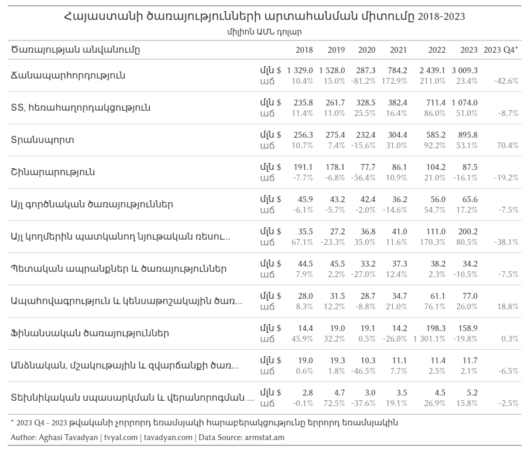

```{r setup, include=FALSE}
knitr::opts_chunk$set(echo = TRUE)

library(tidyverse)
library(RcppRoll)
library(scales)
library(rvest)
library(readxl)
library(gt)

rm(list = ls()); gc()

theme_tvyal <- function(base_size = 12, base_family = "sans")
{
  colors <- deframe(ggthemes::ggthemes_data[["fivethirtyeight"]])
  (ggthemes::theme_foundation(
    base_size = base_size, base_family = base_family) +
      theme(
        line = element_line(colour = "black"),
        rect = element_rect(fill = "white", linetype = 0, colour = NA),
        text = element_text(colour = colors["Dark Gray"]),
        # axis.title = element_blank(),
        # axis.text = element_text(),
        axis.ticks = element_blank(),
        axis.line = element_blank(),
        legend.background = element_rect(),
        legend.position = "bottom",
        legend.direction = "horizontal",
        legend.box = "vertical",
        panel.grid = element_line(colour = NULL),
        panel.grid.major.x = element_line(
          colour = colors["Medium Gray"], 
          linetype = "dotted"
        ),
        panel.grid.major.y = element_line(
          colour = colors["Medium Gray"], 
          linetype = "dotted"
        ),
        panel.grid.minor = element_blank(),
        plot.title = element_text(hjust = 0, size = rel(1.5), face = "bold"),
        plot.margin = unit(c(1, 1, 1, 1), "lines"), strip.background = element_rect()
      )
  )
}

theme_set(theme_tvyal())

save_last_plot <-
  function(filename, extension = "png", width = 1008, height = 567) {

    filename <- str_replace_all(filename, ", ", "_")
    last_plot <- recordPlot()

    if (extension == "png") {
      png(paste0(filename, ".", extension), width = width, height = height)
    } else if (extension == "pdf") {
      pdf(paste0(filename, ".", extension), width = width, height = height)
    } else {
      stop("Unsupported file extension. Use 'png' or 'pdf'.")
    }

    replayPlot(last_plot)
    dev.off()
    paste0(filename, ".", extension)
  }

new_palette_colors <- c(
  "#003f5c", "#2f4b7c", "#665191", "#a05195",
  "#d45087", "#f95d6a", "#ff7c43", "#ffa600"
)
colfunc <- colorRampPalette(c("#2f4b7c", "#fffcf5", "#f95d6a"))
colfunc2 <- colorRampPalette(new_palette_colors)
colfunc3 <- colorRampPalette(c("#005C4B", new_palette_colors, "#FFD17A", "#FFFCF5"))

test_colors <- c("#005C4B", "#FFD485", "#00415A", "#FFAD16",  "#264876", "#FF8730", "#564F8B", "#FB685B", "#8A5193", "#E45579",  "#BC508D")

update_geom_defaults("rect", list(fill  = new_palette_colors[2], alpha = 0.8))
update_geom_defaults("line", list(color = new_palette_colors[2], alpha = 0.8))
update_geom_defaults("area", list(fill  = new_palette_colors[2], alpha = 0.8))

caption_arm <-  "Հեղինակ` Աղասի Թավադյան   |   tvyal.com   |   tavadyan.com"
caption_eng <-  "Author: Aghasi Tavadyan   |   tvyal.com   |   tavadyan.com"

doParallel::registerDoParallel(cores = 8)

Sys.setlocale("LC_TIME", "hy_AM.UTF-8")

setwd(dirname(rstudioapi::getActiveDocumentContext()$path))

```


```{r get raw data, include=FALSE}

BoP_url <- read_html("https://www.armstat.am/am/?nid=203") |> 
  html_element(xpath = '//a[text()="Վճարային հաշվեկշիռ 6"]') |> 
  html_attr("href") |> 
  str_replace("\\.{2}", "https://www.armstat.am")

httr::GET(BoP_url, httr::write_disk(BoP_tempfile <- tempfile(fileext = ".xls")))

BoP_raw <- read_excel(BoP_tempfile, sheet = 1, skip = 4, trim_ws = FALSE)

```


```{r clean data, include=FALSE}

BoP_levels_dict = read_csv("levels_dict.csv")

BoP_semiraw <- 
  BoP_raw |> 
  rename(eng = 1, rus = 2, arm = 3) |>
  filter(!is.na(eng)) |> 
  mutate(
    nrow = row_number(),
    across(c(eng, rus, arm), ~str_trim(.x)),
    across(c(eng, rus, arm), ~str_replace_all(.x, "  ", " "))
  ) |> 
  left_join(BoP_levels_dict, by = join_by(nrow, eng)) |> 
  mutate(
    group = ifelse(grepl("^\\d\\.", eng), eng, NA),
    account = case_when(
      grepl("credit", tolower(eng)) ~ "Credit",
      grepl("debit", tolower(eng)) ~ "Debit",
      TRUE ~ "account"
    )
  ) |> 
  filter(eng != "") |> 
  fill(group, .direction = "down") |> 
  mutate(
    level = ifelse(is.na(codes), NA, level),
    across(c(eng, arm, rus), ~ifelse(account == eng, NA, .x))
  ) |> 
  fill(c(codes, level, eng, rus, arm), .direction = "down") |> 
  relocate(codes, level, eng, rus, arm)

BoP_semiraw |>  write_csv("BoP_semiraw.csv")
  
services_plot_data <- 
  BoP_semiraw |> 
  filter(
    grepl("^1.1.2.", codes),
    level == 4,
    !codes %in% c("1.1.2.X.")
  ) |>  
  pivot_longer(matches("\\d{4}"), names_to = "date") |> 
  mutate(
    date = yq(date) + months(3) - days(1),
    across(c(codes, eng, rus, arm), ~fct_inorder(.x)),
    account = case_when(
      account == "Credit" ~ "Արտահանում",
      account == "Debit" ~ "Ներմուծում",
      TRUE ~ account
    )
  ) |> 
  arrange(codes, account, date) |> 
  group_by(codes, account) |>  
  mutate(value_yoy = roll_sumr(value, 4)) |> 
  ungroup() |> 
  na.omit()

services_plot_data |> write_csv("services_plot_data.csv")

```


```{r, include=FALSE}

plot_data <- 
  BoP_semiraw |> 
  filter(codes == "1.1.") |> 
  pivot_longer(matches("\\d{4}"), names_to = "date") |> 
  mutate(
    date = yq(date) + months(3) - days(1),
    across(c(codes, eng, rus, arm), ~fct_inorder(.x))
  ) |> 
  arrange(codes, account, date) |> 
  group_by(codes, account) |>  
  mutate(value_yoy = roll_sumr(value, 4)) |> 
  ungroup() |> 
  mutate(month = month(date), year = year(date)) |> 
  filter(
    account != "account",
    date >= ymd("2013-12-31"),
  ) |> 
  na.omit()


plot_data_1 <- 
  plot_data |> 
  mutate(
    account = case_when(
      account == "Credit" ~ "Արտահանում",
      account == "Debit" ~ "Ներմուծում",
      TRUE ~ account
    )
  )
  
plot_data_2 <- 
  plot_data |> 
  filter(
    month == 12,
    year >= 2014
  ) |> 
  select(date, month, year, account, value_yoy) |> 
  na.omit() |> 
  pivot_wider(names_from = account, values_from = value_yoy) |> 
  mutate(
    diff = Debit / Credit - 1,
    diff_text = percent(diff, accuracy = 0.1),
    date = date + days(1) - months(6)
  )

import_export_plot <- 
  plot_data_2 |> 
  ggplot() +
  geom_col(
    mapping = aes(date, diff* 10, fill = "Ներմուծում / Արտահանում"),
    width = 200
  ) +
  geom_text(
    mapping = aes(date, y = 0, label = diff_text), vjust = -0.5
  ) +
  geom_line(
    data = plot_data_1,
    aes(date, value_yoy / 1000, color = account), linewidth = 1.2
  ) +
  scale_x_date(date_breaks = "1 year", date_labels = "%Y") +
  scale_y_continuous(
    breaks = seq(0, 14, 2),
    labels = number_format(accuracy = 1),
    sec.axis = sec_axis(
      transform = ~./10,
      breaks = seq(0, 1.4, 0.2),
      labels = percent_format(accuracy = 1)
    )
  ) +
  scale_color_manual(values = new_palette_colors[c(6,8)]) +
  scale_fill_manual(values = new_palette_colors[c(2)]) +
  guides(
    color = guide_legend(ncol = 2),
    fill = guide_legend(ncol = 2)
  ) +
  labs(
    x = NULL,
    y = NULL,
    color = NULL,
    fill = NULL,
    title = "Ապրանքների և ծառայությունների արտահանման և ներմուծման դինամիկան Հայաստանում",
    subtitle = "մլրդ ԱՄՆ դոլար, տասյերկուամսյա կտրվածքով",
    caption = paste0(caption_arm, "   |   տվյալների աղբյուր՝ armstat.am")
  ) +
  theme(
    legend.box = "horizontal",
  )


```

```{r, include=FALSE}

# services_plot_data_new |> count(eng)

services_plot_data_new <- 
  services_plot_data |> 
  mutate(
    arm = str_trunc(as.character(arm), 40),
    arm = case_when(
      grepl("^Հեռա", arm) ~ "ՏՏ, հեռահաղորդակցություն",
      TRUE ~ arm
    )
  )

second_table <- 
  services_plot_data_new |> 
  mutate(
    year = year(date),
    month = month(date)
  ) |> 
  filter(
    year == max(year)
  ) |> 
  arrange(arm, account, date) |> 
  group_by(arm, account) |> 
  mutate(
    pct_growth = value / lag(value) - 1,
    text = paste0(
      "<br><span style='color: gray;'>",
      percent(pct_growth, accuracy = 0.1), "</span>"
    )
  ) |> 
  filter(
    month == 12,
    account == "Արտահանում"
  ) |> 
  ungroup() |> 
  select(year, arm, text) |> 
  pivot_wider(names_from = year, values_from = text) |>
  rename(`2023 Q4*` = `2023`)


services_growth_gt_table <- 
  services_plot_data_new |> 
  mutate(
    year = year(date),
    month = month(date)
  ) |> 
  filter(month == 12) |> 
  arrange(arm, account, year) |> 
  group_by(arm, account) |> 
  mutate(
    pct_growth = value_yoy / lag(value_yoy) - 1,
    text = paste0(
      number(value_yoy, accuracy = 0.1),
      "<br><span style='color: gray;'>",
      percent(pct_growth, accuracy = 0.1), "</span>"
    )
  ) |> 
  filter(
    year >= 2018,
    account == "Արտահանում"
  ) |> 
  ungroup() |> 
  mutate(
    arm = fct_reorder(arm, value_yoy) |> fct_rev()
  ) |> 
  mutate(
    info = "մլն $<br><span style='color: gray;'>աճ</span>"
  ) |> 
  select(year, arm, info, text) |> 
  pivot_wider(names_from = year, values_from = text) |>
  arrange(arm) |> 
  left_join(second_table, by = "arm") |> 
  gt() |> 
  fmt_markdown(columns = everything()) |> 
  cols_align(align = "left", columns = c(arm, info)) |> 
  cols_align(align = "right", columns = -c(arm, info)) |> 
  cols_label(
    arm = "Ծառայության անվանումը",
    info = ""
  ) |> 
  tab_header(
    title = "Հայաստանի ծառայությունների արտահանման միտումը 2018-2023",
    subtitle = "միլիոն ԱՄՆ դոլար"
  ) |> 
  tab_footnote(
    footnote = "* 2023 Q4 - 2023 թվականի չորրորդ եռամսյակի հարաբերակցությունը երրորդ եռամսյակին"
  ) |> 
  tab_footnote(
    footnote = paste0(caption_eng, "    |    Data Source: armstat.am")
  )


```


```{r services charts, include=FALSE}

services_plot_data_2 <- 
  services_plot_data |> 
  filter(date >= as.Date("2009-12-31")) |> 
  mutate(
    value_lamp = ifelse(account == "account", 0, value_yoy),
    arm = str_trunc(as.character(arm), 30),
    arm = case_when(
      grepl("^Այլ", arm) ~ "Այլ ծառայություննր",
      grepl("^Հեռա", arm) ~ "ՏՏ, հեռահաղորդակցություն",
      TRUE ~ arm
    ),
    arm = fct_lump_n(arm, 8, w = value_lamp, other_level = "Այլ ծառայություննր"),
    arm = fct_reorder(arm, value_yoy)
  ) |> 
  group_by(date, account, arm) |> 
  summarise(value_yoy = sum(value_yoy), .groups = "drop")


services_change_plot_1 <- 
  services_plot_data_2 |> 
  filter(account != "account") |> 
  ggplot(aes(date, value_yoy / 1e3, fill = arm)) +
  geom_area(alpha = 0.8) +
  facet_wrap(~account) +
  scale_x_date(
    breaks = as.Date(ISOdate(seq(2000, 2024, 2), 1, 1)),
    date_labels = "%Y"
  ) +
  scale_y_continuous(breaks =1:10, labels = number_format()) +
  scale_fill_manual(values =   rev(colfunc3(9)[-9])) +
  guides(fill = guide_legend(nrow = 2, reverse = TRUE)) +
  labs(
    x = NULL,
    y = NULL,
    fill = NULL,
    title = "Հայաստանի ծառայությունների տասերկուամսյա արտահանումը և ներմուծումը",
    subtitle = "մլրդ ԱՄՆ դոլար, ըստ ոլորտների, տարեկան կտրվածքով",
    caption = paste0(caption_arm, "   |   տվյալների աղբյուր՝ armstat.am")
  )

services_change_plot_2 <- 
  services_plot_data_2 |> 
  filter(account != "account") |> 
  group_by(date, account) |> 
  mutate(pct = value_yoy / sum(value_yoy)) |> 
  ungroup() |> 
  ggplot(aes(date, pct, fill = arm)) +
  geom_area(alpha = 0.8) +
  facet_wrap(~account) +
  scale_x_date(
    breaks = as.Date(ISOdate(seq(2000, 2024, 2), 1, 1)),
    date_labels = "%Y"
  ) +
  scale_y_continuous(labels = percent_format()) +
  scale_fill_manual(values =   rev(colfunc3(9)[-9])) +
  guides(fill = guide_legend(nrow = 2, reverse = TRUE)) +
  labs(
    x = NULL,
    y = NULL,
    fill = NULL,
    title = "Հայաստանի ծառայությունների արտահանումը և ներմուծումը",
    subtitle = "տեսակարար կշիռ, ըստ ոլորտների, տարեկան կտրվածքով",
    caption = paste0(caption_arm, "   |   տվյալների աղբյուր՝ armstat.am")
  )

services_change_plot_3 <- 
  services_plot_data_2 |> 
  filter(account == "account") |> 
  ggplot(aes(date, value_yoy / 1e3, fill = arm)) +
  geom_area(alpha = 0.8) +
  scale_x_date(
    breaks = as.Date(ISOdate(seq(2000, 2024, 2), 1, 1)),
    date_labels = "%Y"
  ) +
  scale_y_continuous(labels = number_format(), n.breaks = 8) +
  scale_fill_manual(values =   rev(colfunc3(9)[-9])) +
  guides(fill = guide_legend(nrow = 2, reverse = TRUE)) +
  labs(
    x = NULL,
    y = NULL,
    fill = NULL,
    title = "Հայաստանի ծառայությունների հաշվեկշիռը",
    subtitle = "մլրդ ԱՄՆ դոլար, տարեկան կտրվածքով",
    caption = caption_arm
  )

```


***English summary below.***

Հարգելի գործընկեր,

Հուսով եմ լավ եք:
Ներկայացնում եմ այս շաբաթվա վերլուծությունները և աշխատանքները.

**ՈՒՇԱԴՐՈՒԹՅՈՒՆ․ ՄԵՆՔ !!PODCAST!! ՈՒՆԵՆՔ․ ՄԱՆՐԱՄԱՍՆԵՐԸ ՆԵՐՔԵՎՈՒՄ**

## 💼✈🥶️ Հայաստանի հյուրընկալության սառչում․ Ծառայությունների արտահանման ուսումնասիրություն


Հայաստանի ծառայությունների արտահանման և ներմուծման ուսումնասիրության համար օգտագործվել է ՀՀ վճարային հաշվեկշռի եռամսյակային տվյալները: Տվյալների վերլուծությունը ցույց է տվել, որ 2020 թվականին ծառայությունների առևտրաշրջանառությունը զգալի անկում է ունեցել՝ հիմնականում պայմանավորված զբոսաշրջային ծառայությունների արտահանման և ներմուծման նվազմամբ։ 2021 և հատկապես 2022 թվականին առկա են ծառայությունների առևտրաշրջանառության վերականգնողական աճ, որը շարունակվել է մինչև 2023 թվականի չորրորդ եռամսյակը։ 2023 թվականի չորրորդ եռամսյակում արդեն գրեթե բոլոր ծառայությունների արտահանումը կրճատվել է։


**Գծապատկեր 1.** 

```{r, echo=FALSE, warning=FALSE, message=FALSE, fig.width = 12, fig.height = 8}
services_change_plot_1
```


Ծառայությունների և՛ ներմուծումը, և՛ արտահանումը 2023-ի 4-րդ եռամսյակից անկում են ապրել։

Ինչպես երևում է, Հայաստանի 2023 թվականի ծառայությունների արտահանման հիմնական ոլորտներն են եղել ճանապարհորդությունը և ՏՏ ծառայությունները՝ համապատասխանաբար 3 մլրդ և 1 մլրդ դոլարի, որոնք կազմել են 2023 թվականի ծառայությունների արտահանման համապատասխանաբար 53.5 և 19.1 տոկոսը։ Այս ծառայությունների 2022-23 թվականների աճը ապահովել է նաև մեր տնտեսական աճի զգալի հատվածը։ Ծառայությունների կրճատման տենդենցը, որը կարող է շարունակվել 2024 թվականին, մտահոգիչ է հատկապես ընթացիկ հաշվեկշռի և բյուջեի մասին oրենքով պլանավորված 7 տոկոս տնտեսական աճի ապահովման տեսանկյունից։

Երկուս ու կես տարի վերականգնողական և կտրուկ աճից հետո 2023-ի 4-րդ եռամսյակից գրեթե բոլոր ծառայությունների արտահանումը և ներմուծումը կրճատվել են։ 2023 թվականի չորրորդ եռամսյակի հարաբերակցությունը երրորդ եռամսյակին ցույց է տալիս, որ տուրիստական կամ ճանապարհորդական ծառայությունները կրճատվել են գրեթե 2 անգամ՝ 42.6 տոկոսով, չնայած որ տարեկան կտրվածքով տուրիստական ծառայությունների արտահանումը աճել է 23.3 տոկոսով՝ հասնելով 3 մլրդ դոլարի։ Այսինքն տուրիստները 2023-ին Հայաստանում գնել են 3 մլրդ դոլարի տուրիստական ծառայություններ։ 2023-ի աճը հիմնականում ձևավորվել էր առաջին 3 եռամսյակների շարունակական աճի հաշվին։ Նշենք նաև, որ 2022 թվականին ծառայությունների արտահանումը աճել է ավելի քան 3 անգամ՝ հիմնականում ի հաշվի հետհամաճարակային վերականգնման աճի և ռուսական տուրիստների և ռելոկատների մեծ քանակությամբ ավելացմամբ։


**Աղյուսակ 1.**

```{r, echo=FALSE, warning=FALSE, message=FALSE, fig.width = 12, fig.height = 8}
services_growth_gt_table
```

<!--  -->


Ինչպես երևում է առաջին աղյուսակից 2023 թվականի չորրորդ եռամսյակում կրճատման միտում ունեն բոլոր ծառայությունների արտահանումը, բացառությամբ տրանսպորտային և կենսաթոշակային ծառայությունների։ Ֆինանսական ծառայությունները 2023 թվականի 4-րդ եռամսյակում չնչին աճ են ցուցաբերել՝ չնայած տարվա կտրվածքով ֆինանսական ծառայությունները կրճատվել են 19.8 տոկոսով։

Նշենք նաև, որ 2022 թվականին ապրանքների և ծառայությունների արտահանման 43 տոկոսը ծառայություններն են եղել, 2023-ին այդ ցուցանիշը իջել է մինչև 39.8 տոկոս։


>
> Ձեզ կարող է հետաքրքրել նաև հետևյալ վերլուծությունը.
>
> [💹🚀♻🟨 Ոսկու տենդ. Հայաստանի ապրանքների արտահանման կեսը վերաարտահանում է](https://www.tvyal.com/newsletter/2024/2024_02_12)։
>


**Գծապատկեր 2.** 

```{r, echo=FALSE, warning=FALSE, message=FALSE, fig.width = 12, fig.height = 8}
services_change_plot_2
```


### Դիտարկենք նաև 2020 թվականի ծառայությունների արտահանման և ներմուծամն անկումը։

Կորոնավիրուսի համաճարակի բռնկումը մեծ ազդեցություն ունեցավ Հայաստանում ծառայությունների արտահանման և ներմուծման ցուցանիշների վրա։ 2020 թվականին ծառայությունների առևտրաշրջանառության զգալի անկում է գրանցվել, ընդ որում՝ ինչպես ներմուծման, այնպես էլ արտահանման ցուցանիշների։ 2020թ. ծառայությունների ներմուծումը նվազել էր 61,3%-ով՝ 2485 մլն ԱՄՆ դոլարից իջնելով 961 մլն ԱՄՆ դոլարի։ Ծառայությունների արտահանումը նվազել էր 55,9%-ով՝ 2402 մլն ԱՄՆ դոլարից հասնելով մինչև 1060 մլն ԱՄՆ դոլար։ Առևտրաշրջանառության էական նվազումը առաջին հերթին պայմանավորված է եղել զբոսաշրջային ծառայությունների արտահանման և ներմուծման կտրուկ կրճատմամբ։

Զբոսաշրջության ոլորտը, որը զգալիորեն նպաստում է ծառայությունների առևտրին, 2020 թվականին համավարակի պատճառով լուրջ հետընթաց ապրեց։ Գրանցվել է զբոսաշրջային ծառայությունների և՛ արտահանման, և՛ ներմուծման ծավալների զգալի անկում՝ արտահանումը 2020 թվականին նվազել է 82,0%-ով, իսկ ներմուծումը 84,5%-ով: Այս թվերը ընդգծում են ծառայությունների առևտրի ոլորտի մեծ կախվածությունը զբոսաշրջությունից: Ծառայությունների առևտրաշրջանառության անկման մեկ այլ ուշագրավ կողմը տրանսպորտային ծառայությունների ներմուծման կրճատումն էր: 2020 թվականին գրանցվեց 36.3% անկում:


**Գծապատկեր 3.** 

```{r, echo=FALSE, warning=FALSE, message=FALSE, fig.width = 12, fig.height = 8}
services_change_plot_3
```

>
> Ձեզ կարող է հետաքրքրել նաև հետևյալ վերլուծությունը.
>
> [💸🔚🏦 Կապիտալի արտահոսք](https://www.tvyal.com/newsletter/2024/2024_03_01)։
>


Չնայած 2020 թվականին ծառայությունների առևտրաշրջանառության զգալի անկմանը, 2021 և 2022թ. առկա է ծառայությունների ներմուծման և հատկապես արտահանման զգալի վերականգնողական աճ։ Ինչպես երևում է առաջին աղյուսակից, Հայաստանում ծառայությունների արտահանումը 2022թ. աճել է գրեթե 3.5 անգամ:

2022 թվականին ծառայությունների արտահանումը կազմել է 4,2 մլրդ դոլար՝ զբոսաշրջային ծառայություններ՝ 58,4%, տեղեկատվական տեխնոլոգիաներ՝ 17,0%, տրանսպորտային ծառայություններ՝ 13,4%, շինարարական ծառայություններ՝ 2,5%։ 2021 թվականին ծառայությունների արտահանումը կազմել է 1,7 մլրդ դոլար՝ զբոսաշրջային ծառայություններ՝ 45,2%, տեղեկատվական տեխնոլոգիաներ՝ 22,0%, տրանսպորտային ծառայություններ՝ 17,5%, շինարարական ծառայություններ՝ 5,0%։ 

Ինչպես երևում է երրորդ գծապատկերից, Հայաստանը ավելի շատ ներմուծում է տրանսպորտային ծառայություններ, քան արտահանում: Տրանսպորտային ծառայությունների հաշվեկշիռը Հայաստանում պակասուրդային է: Այս ցուցանիշը կոռելացված է ապրանքների ներմուծման և արտահանման հետ:


<!-- **Գծապատկեր 1.**   -->

<!-- ```{r, echo=FALSE, warning=FALSE, message=FALSE, fig.width = 12, fig.height = 8} -->
<!-- import_export_plot -->
<!-- ``` -->


## PODCAST !!

### Խոսենք թվերով #5

[Ինչքա՞ն հայ կունենանք Հայաստանում 2100 թվականին](https://www.youtube.com/watch?v=-IOVtoBD5gE)

- 🔘 Ինչքա՞ն է Հայաստանի բնակչությունը և ինչպե՞ս է փոխվում վերջին տարիներին
- 🔘 Ի՞նչ է լինելու արցախահայերի, ռուսների և հնդիկների գալով
- 🔘 Ինչպիսի՞ն է Հայաստանի բնակչության սեռատարիքային կազմը
- 🔘 Ինչքա՞ն հայ կունենանք առաջիկայում

How2B-ում «խոսում ենք թվերով»՝ տնտեսագետ Աղասի Թավադյանի հետ:

- 00:00 Ժողովրդագրական ընդհանուր իրավիճակը Հայաստանում
- 01։53 Դեմոգրաֆիկ փուլերն աշխարհում վերջին 100 տարիներին
- 03։06 Հայաստանի բնակչության փոփոխությունը վերջին 30 տարիներին
- 06:57 Հայաստան են եկել ռուսներ, արցախահայեր, հնդիկներ․ Ինչպե՞ս է փոխվում իրավիճակը
- 10:44 Մենք էլ ենք դառնում ծերացող ազգ 
- 12։22 Կանայք Հայաստանում ավելի շատ են, թեև աղջիկ երեխաներ ավելի քիչ են ծնվում
- 17։55 Ամփոփում ենք

Թեմայով վերլուծությունը ներկայացված է tvyal.com կայքում՝
[👫🧭💀 Հայաստանում 2 մլն հայ 2100 թվականին](https://www.tvyal.com/newsletter/2024/2024_04_19)

<a href="https://www.youtube.com/watch?v=-IOVtoBD5gE">
  
</a>


## ԶԼՄ հաղորդագրություն


[Դիտեք Civilnet-ին տված իմ վերջին հարցազրույցը, որտեղ խոսում եմ 2024 թվականի տնտեսական մարտահրավերների մասին։](https://youtu.be/3HyOvSfikwo)

📺  Ոսկու տենդը Հայաստանում թափ է հավաքում. Աղասի Թավադյան 📺

<a href="https://youtu.be/3HyOvSfikwo">
  
</a>


## English Summary

### 💼✈🥶️ Armenia's Warm Welcome Runs Cold: Study of Export of Services

The analysis of quarterly data from Armenia's balance of payments reveals fluctuations in the country's service trade turnover, particularly in the export and import of tourism services. Following a significant decline in 2020 due to the COVID-19 pandemic, there was a gradual recovery in 2021 and 2022, with notable growth in tourism and IT services. However, since the fourth quarter of 2023, both imports and exports of services have experienced a contraction. Despite a slight increase in financial services, the overall trend indicates a decline in service trade, raising concerns regarding Armenia's economic growth targets. The heavy reliance on tourism services is evident from the substantial decrease in both export and import volumes in 2020, emphasizing the vulnerability of the service trade sector to external shocks such as pandemics.

While there was a remarkable recovery in service trade in 2021 and 2022, with exports nearly tripling in 2022 compared to the previous year, the recent downturn since the fourth quarter of 2023 signals a reversal of this trend. Notably, the export of services accounted for a significant portion of Armenia's economic activity, particularly driven by tourism and IT sectors. However, the imbalance in transport services, with imports exceeding exports, poses a challenge to the country's trade balance. The fluctuations in service trade underscore the importance of diversifying Armenia's economy to reduce dependency on sectors susceptible to external disruptions and ensuring a more balanced trade portfolio to sustain long-term economic growth.


---

Այս վերլուծությունը առկա է նաև [մեր կայքէջում](https://www.tvyal.com/newsletter/2024/2024_04_26), այս վերլուծության կոդը և տվյալները դրված են նաև [Github-ում](https://github.com/tavad/tvyal_newsletter)։       

---                  

Եթե հնարավոր է, խնդրում եմ այս նյութը ուղարկել նաև այն մարդկանց, ում այն կարծում եք կարող է հետաքրքրել:

Սպասեք հաջորդ հաղորդագրությանը հաջորդ ուրբաթ օրը:      


Հարգանքներով,            
Աղասի Թավադյան         
26.04.2024          
[tvyal.com](https://www.tvyal.com/)      
[tavadyan.com](https://www.tavadyan.com/)

---

[Was this email forwarded to you? Subscribe here.](https://www.tvyal.com/subscribe)

[Բաժանորդագրվեք](https://www.tvyal.com/subscribe)

       
---              
               


####### **Ուշադրություն. Ձեր էլ.փոստը մեյլլիսթի մեջ է, որի միջոցով ես կիսվում եմ շաբաթական նյութեր, որոնք հիմնականում ներկայացնում են Հայաստանի տնտեսությունը: Նյութերը ներառում են գծապատկերներ, [տվյալների բազաներ](https://github.com/tavad/tvyal_newsletter), տեսանյութեր, հոդվածներ, [առցանց վահանակներ](https://www.tvyal.com/projects), տնտեսական գործիքներ, կանխատեսումներ և հաշվետվություններ: Եթե ցանկանում եք չեղարկել բաժանորդագրությունը, խնդրում եմ տեղեկացրեք ինձ, և ես կհեռացնեմ ձեր էլ. փոստը ցուցակից: Գրեք նաև եթե ունեք մենկնաբանություններ:**

####### **Important! Your email is part of the mailing list where I share weekly materials primarily focused on the Armenian economy. These materials encompass charts, [databases](https://github.com/tavad/tvyal_newsletter), videos, articles, [online dashboards](https://www.tvyal.com/projects), economic tools, forecasts, and reports. If you wish to unsubscribe, please let me know, and I will remove your email from the list. Please share your comments as well․**


