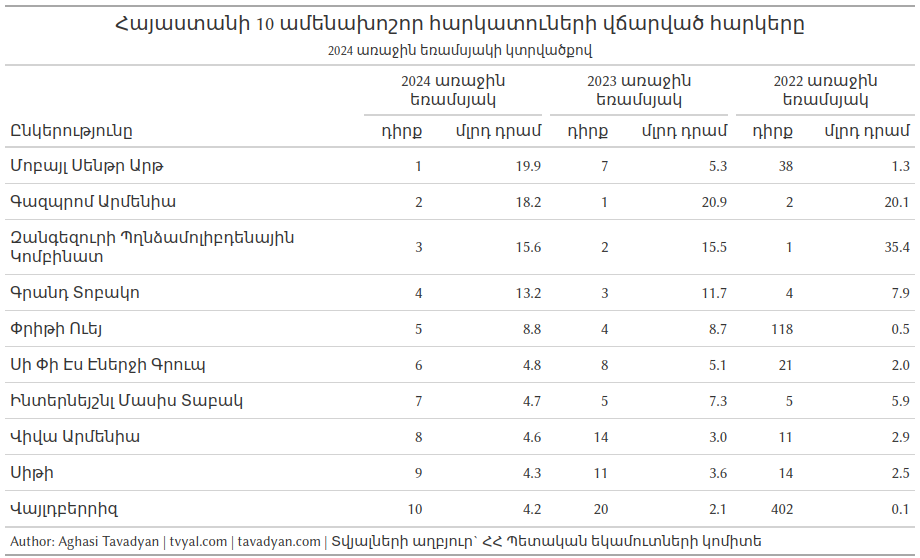

```{r setup, include=FALSE}
knitr::opts_chunk$set(echo = TRUE)

library(tidyverse)
library(scales)
library(png)
library(cowplot)
library(grid)
library(countrycode)
library(gt)

rm(list = ls()); gc()

theme_tvyal <- function(base_size = 12, base_family = "sans")
{
  colors <- deframe(ggthemes::ggthemes_data[["fivethirtyeight"]])
  (ggthemes::theme_foundation(
    base_size = base_size, base_family = base_family) +
      theme(
        line = element_line(colour = "black"),
        rect = element_rect(fill = "white", linetype = 0, colour = NA),
        text = element_text(colour = colors["Dark Gray"]),
        # axis.title = element_blank(),
        # axis.text = element_text(),
        axis.ticks = element_blank(),
        axis.line = element_blank(),
        legend.background = element_rect(),
        legend.position = "bottom",
        legend.direction = "horizontal",
        legend.box = "vertical",
        panel.grid = element_line(colour = NULL),
        panel.grid.major.x = element_line(
          colour = colors["Medium Gray"], 
          linetype = "dotted"
        ),
        panel.grid.major.y = element_line(
          colour = colors["Medium Gray"], 
          linetype = "dotted"
        ),
        panel.grid.minor = element_blank(),
        plot.title = element_text(hjust = 0, size = rel(1.5), face = "bold"),
        plot.margin = unit(c(1, 1, 1, 1), "lines"), strip.background = element_rect()
      )
  )
}

theme_set(theme_tvyal())

save_last_plot <-
  function(filename, extension = "png", width = 1152, height = 648) {

    filename <- str_replace_all(filename, ", ", "_")
    last_plot <- recordPlot()

    if (extension == "png") {
      png(paste0(filename, ".", extension), width = width, height = height)
    } else if (extension == "pdf") {
      pdf(paste0(filename, ".", extension), width = width, height = height)
    } else {
      stop("Unsupported file extension. Use 'png' or 'pdf'.")
    }

    replayPlot(last_plot)
    dev.off()
    paste0(filename, ".", extension)
  }

new_palette_colors <- c(
  "#003f5c", "#2f4b7c", "#665191", "#a05195",
  "#d45087", "#f95d6a", "#ff7c43", "#ffa600"
)
colfunc <- colorRampPalette(c("#2f4b7c", "#fffcf5", "#f95d6a"))
colfunc2 <- colorRampPalette(new_palette_colors)
colfunc3 <- colorRampPalette(c("#005C4B", new_palette_colors, "#FFD17A", "#FFFCF5"))

update_geom_defaults("rect", list(fill  = new_palette_colors[2], alpha = 0.8))
update_geom_defaults("line", list(color = new_palette_colors[2], alpha = 0.8))
update_geom_defaults("area", list(fill  = new_palette_colors[2], alpha = 0.8))

caption_arm <-  "Հեղինակ` Աղասի Թավադյան   |   tvyal.com   |   tavadyan.com"
caption_eng <-  "Author: Aghasi Tavadyan   |   tvyal.com   |   tavadyan.com"

doParallel::registerDoParallel(cores = 8)

Sys.setlocale("LC_TIME", "hy_AM.UTF-8")

setwd(dirname(rstudioapi::getActiveDocumentContext()$path))
```


```{r get download, include=FALSE}

taxes_data <- read_csv("hhpektt_2021_2024_I.csv")

# load logos
wildberries_logo    <- readPNG("media/wildberries_logo.png")
mobile_center_logo  <- readPNG("media/mobile_center_logo.png")
vesta_logo          <- readPNG("media/vesta_logo.png")

mobile_phone_reexports <- read_csv("mobile_phone_reexports.csv")

```


```{r plot generator function, include=FALSE}

taxes_quarter_plot <- function(registration, year_ = 2021, logo){
  
  taxes_data_with_quarter_label <- 
    taxes_data |> 
    filter(
      registration_number == registration,
      year >= year_
    ) |> 
    mutate(
      quarter_label = sprintf("%s (%s)", year(date), as.roman((month(date) - 1) %/% 3 + 1)),
      quarter_label = fct_rev(fct_inorder(quarter_label)),
      total_taxes_Q = total_taxes_Q / 1000
    )
  
  colors_count <- nrow(taxes_data_with_quarter_label)
  
  taxes_data_with_quarter_label |> 
    ggplot(aes(quarter_label, total_taxes_Q, fill = quarter_label)) +
    annotation_custom(
      rasterGrob(
        logo, interpolate = TRUE,
        width = unit(0.6, "npc") * (2024 - year_) / 4,
        height = unit(0.6, "npc") / 1.5
      ),
      xmin = 0, xmax = 6, ymin = 0, ymax = Inf
    ) +
    geom_col() +
    geom_text(aes(y = -500, label = n_Q)) +
    geom_text(
      aes(y = total_taxes_Q + 700,
          label = number(total_taxes_Q, accuracy = 1),
          color = quarter_label)
    ) +
    scale_fill_manual(values = colfunc2(colors_count)) +
    scale_color_manual(values = colfunc2(colors_count)) +
    # coord_fixed(ratio = 1/10000) +
    theme(
      legend.position = "none",
      axis.line.y = element_blank(),
      panel.grid.major.x = element_blank(),
      panel.grid.major.y = element_blank(),
      axis.text.y = element_blank(),
      axis.ticks.y = element_blank()
    ) +
    labs(
      x = NULL,
      y = NULL,
      caption = "Սյունակներում ներքևի թվերը ցույց են տալիս հարկ վճարողի տեղը տվյալ եռամսյակում\n\nՀեղինակ` Աղասի Թավադյան   |   tvyal.com   |   tavadyan.com   |   Տվյալների աղբյուր` ՀՀ Պետական եկամուտների կոմիտե"
    )
  
}

```

```{r main plots, include=FALSE}

wildberries_plot <- 
  taxes_quarter_plot("02681198", year_ = 2022, logo = wildberries_logo) +
  labs(
    title = "Mobile Center, 10-րդ խոշոր հարկատուն 2024 թվականի 1-ին եռամսյակում",
    subtitle = "Wildberries կազմակերպության վճարած հարկերը, միլիոն դրամ"
  )

mobile_center_plot <- 
  taxes_quarter_plot("01850138", logo = mobile_center_logo) +
  labs(
    title = "Mobile Center, 1-ին խոշոր հարկատուն 2024 թվականի 1-ին եռամսյակում",
    subtitle = "Mobile Center կազմակերպության վճարած հարկերը, միլիոն դրամ"
  )

vesta_plot <- 
  taxes_quarter_plot("01829451", logo = vesta_logo) +
  labs(
    title = "Vesta (Pretty Way), 5-րդ խոշոր հարկատուն 2024 թվականի 1-ին եռամսյակում",
    subtitle = "Vesta (Pretty Way) կազմակերպության վճարած հարկերը, միլիոն դրամ"
  )

```

```{r, include=FALSE}
top_10 <- 
  taxes_data |> 
  filter(date == max(date), n <= 10) |> 
  select(registration_number, name) |> 
  mutate(name = str_to_title(name))


top_10_gt_table <- 
  taxes_data |> 
  filter(
    registration_number %in% top_10$registration_number,
    Q == 1,
    year >= 2022
  ) |> 
  select(-name) |> 
  left_join(top_10, by = "registration_number") |> 
  select(name, year, n, total_taxes) |> 
  mutate(
    total_taxes = total_taxes / 1e6,
  ) |> 
  pivot_wider(names_from = year, values_from = c(n, total_taxes), names_vary = "slowest") |> 
  gt() |> 
  fmt_number(
    columns = contains("total_taxes"),
    decimals = 1, 
    use_seps = TRUE,
  ) |> 
  cols_label(
    name = "Ընկերությունը",
    n_2024 = "դիրք",
    total_taxes_2024 = "մլրդ դրամ",
    n_2023 =  "դիրք",
    total_taxes_2023 = "մլրդ դրամ",
    n_2022 = "դիրք",
    total_taxes_2022 = "մլրդ դրամ"
  ) |> 
  tab_spanner(
    label = "2024 առաջին եռամսյակ",
    columns = contains("2024")
  ) |>
  tab_spanner(
    label = "2023 առաջին եռամսյակ",
    columns = contains("2023")
  ) |>
  tab_spanner(
    label = "2022 առաջին եռամսյակ",
    columns = contains("2022")
  ) |>
  tab_header(
    title = "Հայաստանի 10 ամենախոշոր հարկատուների վճարված հարկերը",
    subtitle = "2024 առաջին եռամսյակի կտրվածքով"
  ) |> 
  tab_footnote(
    paste0(caption_eng, "   |   Տվյալների աղբյուր` ՀՀ Պետական եկամուտների կոմիտե")
  )


```


```{r, include=FALSE}
main_reexports_codes <- 
  tibble(
    year                = 2023,
    commodity_code      = 851713,
    commodity           = "Telephone sets; smartphones for cellular ...",
    reexports           = 465634940,
    X                   = 474560112,
    pct                 = 0.112386,
    pct_cum             = 0.5255819,
    reexports_text      = "465.6",
    pct_text            = "11.2%",
    prop_reexport       = 0.9811927,
    prop_reexport_text  = "98.1%",
    commodity_arm_short = "Սմարթֆոններ, բջջային ցանցերի համար"
  )


mobile_phone_reexports_plot <- 
  mobile_phone_reexports |> 
  left_join(
    codelist |> transmute(partner_iso = iso3c, partner_arm = cldr.name.hy),
    by = join_by(partner_iso)
  ) |> 
  mutate(
    partner_arm = ifelse(is.na(partner_arm), "Այլ պետություններ", partner_arm),
    partner_arm = fct_lump_n(partner_arm, 5, w = trade_value_us,
                         other_level = "Այլ պետություններ"),
    trade_flow = ifelse(trade_code == "X", "Արտահանում", "Ներմուծում")
  ) |> 
  group_by(period, partner_arm, trade_flow) |> 
  summarise(trade_value_us = sum(trade_value_us), .groups = "drop") |> 
  mutate(
    partner_arm = factor(partner_arm, levels = c("Ռուսաստան", "Բելառուս", "Վիետնամ", "Չինաստան", "Հնդկաստան", "Այլ պետություններ"))
  ) |> 
  ggplot(aes(period, trade_value_us / 1e6, fill = partner_arm)) +
  geom_col() +
  facet_wrap(~trade_flow, nrow = 2) +
  scale_x_date(date_breaks = "2 months", date_labels = "%m-%y") +
  scale_y_continuous(labels = number_format()) +
  scale_fill_manual(values = colfunc3(7)) +
  labs(
    x = NULL,
    y = NULL,
    fill = NULL,
    title = str_trunc(main_reexports_codes$commodity_arm_short, 70),
    subtitle = paste0(
      "ԱՏԳ ԱԱ ծածկագիր` ", main_reexports_codes$commodity_code,
      ", վերաարտահանման դիրքը` 2-րդ",
      ", ",
      "վերաարտահանման չափը` ", main_reexports_codes$reexports_text,
      " մլն ԱՄՆ դոլար (2023թ․) \n",
      "վերաարտահանման գնահատված չափաբաժինը` ", main_reexports_codes$prop_reexport_text, ", ",
      main_reexports_codes$pct_text,
      " ընդհանուր վերաարտահանման մեջ"
      ),
    caption = paste0(caption_eng, "   |   Տվյալների աղբյուր` Comtrade, հեղինակի հաշվարկ")
  )
```


***English summary below.***

Հարգելի գործընկեր,

Հուսով եմ՝ լավ եք: 
Ներկայացնում եմ այս շաբաթվա վերլուծությունները և աշխատանքները.

**ՈՒՇԱԴՐՈՒԹՅՈՒՆ․ ՄԵՆՔ !!PODCAST!! ՈՒՆԵՆՔ․ ՄԱՆՐԱՄԱՍՆԵՐԸ ՆԵՐՔԵՎՈՒՄ**

## [📱📍🖥 Mobile Centre-ը Հայաստանի ամենախոշոր հարկատուն է](https://www.tvyal.com/newsletter/2024/2024_05_03)

Տեխնիկա ներմուծող, վաճառող և արդեն նախորդ տարվանից արտահանող «Մոբայլ սենթր արթ» ՍՊԸ-ն (Mobile Centre) 2024 թվականի առաջին եռամսյակի արդյունքներով դարձել է Հայաստանի խոշորագույն հարկատուն՝ առաջ անցնելով «Զանգեզուրի պղնձամոլիբդենային կոմբինատ»-ից և «Գազպրոմ Արմենիա»-ից, որոնք մինչ այս զբաղեցնում էին խոշոր հարկատուների առաջին և երկրորդ հորիզոնականները։

Վերադառնալով ցանկի առաջին հորիզոնականներին՝ երկրորդ տեղում «Գազպրոմ Արմենիա» ՓԲԸ-ն է, որի հարկերը կազմել են 18,2 մլրդ դրամ՝ նվազելով 13%-ով։

Երրորդ տեղում հանքարդյունաբերող «Զանգեզուրի պղնձամոլիբդենային կոմբինատ» ՓԲԸ-ն է (ԶՊՄԿ)՝ 15,6 մլրդ դրամ հարկերով և մոտ 1% աճով
[[1](https://hetq.am/hy/article/166048)]։


**Աղյուսակ 1.** 

```{r, echo=FALSE, warning=FALSE, message=FALSE, fig.width = 12, fig.height = 8}
top_10_gt_table
```
<!--  -->

Մոբայլ Սենթր կազմակերպության հարկերի 95,5 տոկոսը ավելացված արժեքի հարկն է: Ընդ որում՝ 2023-ին ընդհանուր հարկային վճարները 2022 թվականի համեմատ աճել են 2,6 անգամ (17,6 մլրդ դրամից մինչև 46,1 մլրդ դրամ), իսկ 2021-ի համեմատ՝ 10,4 անգամ։ Մինչ ռուս֊ուկրաինական հակամարտության սկիզբը Մոբայլ Սենթր կազմակերպության եռամսյակային վճարված հարկերը չէին գերազանցում 1,3 մլրդ դրամը։

2023 թվականին Հայաստանն արտահանել է 466 մլն դոլարին համարժեք սմարթֆոններ, որոնք հիմնականում ներմուծվել են Վիետնամից և վերաարտահանվել Ռուսաստան։ Միայն սմարթֆոնների արտահանումը կազմել է ընդհանուր արտահանման 6 տոկոսը։ Նշենք նաև, որ մինչև 2022 թվականի մայիսը Հայաստանից սմարթֆոններ չեն արտահանվել։

**Գծապատկեր 1.** 

```{r, echo=FALSE, warning=FALSE, message=FALSE, fig.width = 12, fig.height = 8}
mobile_center_plot
```

Եթե մինչև 2021 թվականը ալկոհոլային խմիչքները՝ հայկական կոնյակի գլխավորությամբ, զբաղեցնում էին դեպի Ռուսաստան արտահանման առաջին տեղը, ապա այժմ առաջին տեղում են հեռախոսներն ու սպառողական էլեկտրոտեխնիկան։

>
> Նշենք, որ մեր կողմից ստեղծվել է օնլայն հարթակ, որը գնահատում և կանխատեսում է Հայաստանի արտահանումը՝ տարբեր տարածաշրջաններով և ապրանքներով։ Հարթակում տրված է ավելի քան 2000 կանխատեսում։
>
>[Ավելի քան 2000 կանխատեսում. Հայաստանի արտահանումը](https://tavad.shinyapps.io/exports_forecast/):
>


**Գծապատկեր 2.** 

```{r, echo=FALSE, warning=FALSE, message=FALSE, fig.width = 12, fig.height = 8}
mobile_phone_reexports_plot
```

Տեխնիկայի առևտրով զբաղվող «Փրիթի ուեյ» ՍՊԸ-ն (VESTA) ևս խոշոր հարկատուների ցանկում «պատվավոր» հորիզոնական է զբաղեցնում վերջին երկու տարիներին։ Այս տարվա առաջին եռամսյակում ընկերության հարկերը կազմել են 8.8 մլրդ դրամ՝ նախորդ տարվա նույն ժամանակաշրջանի համեմատ աճելով մոտ 1%-ով։ VESTA-ն խոշոր հարկատուների ցանկում այս անգամ 5-րդն է։

Ի տարբերություն Mobile Center-ի, Pretty Way (Vesta) ընկերությունը իր հարկային եկամուտների ընդամենը 62,1 տոկոսն է ստացել ավելացված արժեքի հարկից: Հատկանշական է, որ, ի տարբերություն վերոնշյալ ընկերությունների, Pretty Way-ը վճարում է զգալի մաքսավճարներ։ 2023 թվականին ընդհանուր հարկային եկամուտները կազմել են 33,3 մլրդ դրամ, մաքսատուրքերը կազմել են 29,5 մլրդ դրամ կամ ընդհանուր վճարված հարկերի 88,6 տոկոսը։ Մաքսատուրքերը սովորաբար հաշվարկվում են մաքսային արժեքի հիման վրա՝ ներառելով ներմուծվող ապրանքների արժեքը բոլոր կիրառելի հարկերի հետ միասին (ներառյալ ավելացված արժեքի հարկը): Ուստի մաքսային եկամուտների մի մասը ներառում է ներմուծվող ապրանքների ԱԱՀ-ն։

Դրա մասին է վկայում նաև այն, որ 2023 թվականին նախապատրաստված բյուջեից Pretty Way-ին վերադարձվել է անուղղակի հարկերից 17,7 մլրդ դրամ (53 տոկոս): Նման վերադարձերը կատարվում են հիմնականում մի պետությունից մյուս պետություն ապրանքի տեղափոխման հետ կապված անուղղակի հարկերի վերադարձից։

Pretty Way ընկերության հարկային եկամուտները 2023 թվականին 2022 թվականի համեմատ աճել են 3,9 անգամ (8,5 մլրդ դրամից մինչև 33,3 մլրդ դրամ), իսկ 2021 թվականի համեմատ՝ 16,5 անգամ։ 

Հարկ է նշել, որ կենցաղային տեխնիկան (համակարգիչներ, մոնիտորներ, հեռուստացույցներ, տպիչներ) կազմում է ՀՀ արտահանման զգալի տոկոսը։ Մասնավորապես, 2023 թվականին Էլեկտրական սարքավորումները (արտաքին տնտեսական գործունեության 85 երկնիշ ծածկագիր) կազմել են արտահանման 13 տոկոսը։

**Գծապատկեր 4.** 

```{r, echo=FALSE, warning=FALSE, message=FALSE, fig.width = 12, fig.height = 8}
vesta_plot
```


>
> Ձեզ կարող է հետաքրքրել նաև հետևյալ վերլուծությունները.
>
> - [🚀♻🟨 Ոսկու տենդ. Հայաստանի արտահանման կեսը վերաարտահանում է](https://www.tvyal.com/newsletter/2024/2024_04_12)։
> - [🍇🚀 Wildberries-ը աճել է 35 անգամ 1 տարվա ընթացքում](https://www.tvyal.com/newsletter/2024/2024_02_02)։
>


<!-- 2023 թվականի 4-րդ եռամսյակի կտրվածքով Wildberries ընկերությունը 4-րդ ամենախոշոր հարկատուն է, որի հարկերը մեկ տարվա մեջ աճել են 35 անգամ։ -->

<!-- Նույն միտումը նկատվում է Մոբայլ Սենթր և Վեստա ընկերությունների մոտ, որոնց հարկային մուտքերը մեկ տարվա ընթացքում աճել են համապատասխանաբար 2,6 և 3,9 անգամ։ Այս ընկերությունները նույնպես 2023 թվականի ամենախոշոր 5 հարկատուների ցանկում են։ -->

<!-- Անդրադառնանք յուրաքանչյուր ընկերությանը։ -->

<!-- ### Վայլդբերիս -->

<!-- Wildberries-ը 2023 թվականի 4-րդ եռամսյակի կտրվածքով դարձել է 4-րդ խոշոր հարկատուն՝ վճարելով 13,9 մլրդ դրամի հարկ։ 2023 թվականի 4-րդ եռամսյակում իրենից առաջ են միայն «Գրանդ Տոբակո» (24,3 մլրդ դրամ), «Զանգեզուրի պղնձամոլիբդենային կոմբինատ» (18,5 մլրդ դրամ) և «Մոբայլ սենթր արտ» (16,0 մլրդ դրամ) ընկերությունները։ -->

<!-- Նշենք, որ ընդհանուր 2023 թվականի համար Wildberries-ը 6-րդ տեղում է՝ վճարելով 26,5 մլրդ դրամի հարկ, որի կեսից ավելին վճարվել է վերջին եռամսյակում։ -->

<!-- Դեռևս երկու տարի առաջ Wildberries ընկերությունը Հայաստանի խոշորագույն հարկատուների ցանկում 400-րդ հորիզոնականից էլ ցածր էր։ 2022 թվականին այս կազմակերպությունը վճարել է 0,8 մլրդ դրամի հարկ՝ մեկ տարում աճելով 35 անգամ։ -->

<!-- Նշենք, որ այս կազմակերպության 2022 թվականին վճարված 762 միլիոն դրամ հարկի միայն 70,3 տոկոսն է եղել ավելացված արժեքի հարկը (ԱԱՀ), իսկ 21,6 տոկոսը՝ եկամտահարկ։ Փաստացի վճարված եկամտահարկի մասնաբաժինն ավելացել է 2023 թվականին, սակայն եկամտահարկի մասնաբաժինը զգալի կրճատվել է քանզի այս կազմակերպության ԱԱՀ վճարները 1 տարվա ընթացքում աճել են 48 անգամ։  -->

<!-- Նման արագ, էքսպոնենցիալ աճի պայմաններում Wildberries-ը հաջորդ տարի կարող է դառնալ ամենախոշոր հարկատուն: Wildberries-ի հարկերի 97,5 տոկոսը ԱԱՀ է, մաքսատուրքեր չի վճարել, քանի որ Հայաստանը ԵԱՏՄ անդամ երկիր է։ -->


<!-- **Աղյուսակ 1.** Wildberries, 4-րդ խոշոր հարկատուն 2023 թվականի 4-րդ եռամսյակում -->

<!-- ```{r, echo=FALSE, warning=FALSE, fig.width = 8, fig.height = 8} -->
<!-- wildberries_plot -->
<!-- ``` -->


## PODCAST !!

### Խոսենք թվերով #6

[Ինչքա՞ն հայ կունենանք Հայաստանում 2100 թվականին](https://www.youtube.com/watch?v=WHMZs1PZ9jo)

- 🔘 Ի՞նչ է ծառայությունների արտահանումը, և ինչո՞ւ է այն կարևոր
- 🔘 Որոնք են Հայաստանից արտահանվող ծառայությունները
- 🔘 Ինչպիսի դինամիկա կա ծառայությունների արտահանման ծավալներում

How2B-ում «խոսում ենք թվերով»՝ տնտեսագետ Աղասի Թավադյանի հետ:

Թեմայով վերլուծությունը ներկայացված է tvyal.com կայքում՝
[💼✈🥶️ Հայաստանի հյուրընկալության սառչում․ Ծառայությունների արտահանման ուսումնասիրություն](https://www.tvyal.com/newsletter/2024/2024_04_26)

<a href="https://www.youtube.com/watch?v=WHMZs1PZ9jo">
  
</a>


## ԶԼՄ հաղորդագրություն


[Դիտեք 1in.am լրատվամիջոցին տված իմ վերջին հարցազրույցը, որտեղ խոսում եմ տնտեսական մարտահրավերների մասին։](https://youtu.be/Dp___1wRZQQ)

📺  Կապիտալի արտահոսքը աճել է 55 տոկոսով, արտահանումը դեպի ԵԱՏՄ՝ 10 անգամ. Աղասի Թավադյան 📺

<a href="https://youtu.be/Dp___1wRZQQ">
  
</a>


## 2. English Summary

### 📱📍🖥 Mobile Center is the largest taxpayer in Armenia

In the 1th quarter of 2024, Mobile Center became the 1st largest taxpayer in Armenia. The company's tax contributions amounted to 19.9 billion drams, surpassing renowned entities like "Zangezur Copper-Molybdenum Combine" and "Gazprom Armenia". Mobile Center was the 3rd largest taxpayer in Q4 2023, closely followed Wildberries, contributing 46.1 billion drams in taxes, with a significant portion (95.5 percent) attributed to Value Added Tax. Meanwhile, Pretty Way (Vesta), securing the 5th position, demonstrated a distinctive tax structure with 62.1 percent of its revenue derived from VAT and notable customs fees. The company's tax revenues surged to 33.3 billion drams in 2023, showcasing a 3.9-fold increase compared to 2022. Additionally, Armenia's export dynamics highlighted a shift from alcoholic beverages to smartphones and consumer electronics, signifying changing trends in the country's economic landscape.


---

Այս վերլուծությունը առկա է նաև [մեր կայքէջում](https://www.tvyal.com/newsletter/2024/2024_05_03), այս վերլուծության կոդը և տվյալները դրված են նաև [Github-ում](https://github.com/tavad/tvyal_newsletter)։       

---                  

Եթե հնարավոր է, խնդրում եմ այս նյութը ուղարկել նաև այն մարդկանց, ում այն կարծում եք կարող է հետաքրքրել:

Սպասեք հաջորդ հաղորդագրությանը հաջորդ ուրբաթ օրը:      


Հարգանքներով,            
Աղասի Թավադյան         
03.05.2024          
[tvyal.com](https://www.tvyal.com/)      
[tavadyan.com](https://www.tavadyan.com/)

---

[Was this email forwarded to you? Subscribe here.](https://www.tvyal.com/subscribe)

[Բաժանորդագրվեք](https://www.tvyal.com/subscribe)

       
---              
               


####### **Ուշադրություն. Ձեր էլ.փոստը մեյլլիսթի մեջ է, որի միջոցով ես կիսվում եմ շաբաթական նյութեր, որոնք հիմնականում ներկայացնում են Հայաստանի տնտեսությունը: Նյութերը ներառում են գծապատկերներ, [տվյալների բազաներ](https://github.com/tavad/tvyal_newsletter), տեսանյութեր, հոդվածներ, [առցանց վահանակներ](https://www.tvyal.com/projects), տնտեսական գործիքներ, կանխատեսումներ և հաշվետվություններ: Եթե ցանկանում եք չեղարկել բաժանորդագրությունը, խնդրում եմ տեղեկացրեք ինձ, և ես կհեռացնեմ ձեր էլ. փոստը ցուցակից: Գրեք նաև եթե ունեք մենկնաբանություններ:**

####### **Important! Your email is part of the mailing list where I share weekly materials primarily focused on the Armenian economy. These materials encompass charts, [databases](https://github.com/tavad/tvyal_newsletter), videos, articles, [online dashboards](https://www.tvyal.com/projects), economic tools, forecasts, and reports. If you wish to unsubscribe, please let me know, and I will remove your email from the list. Please share your comments as well․**


