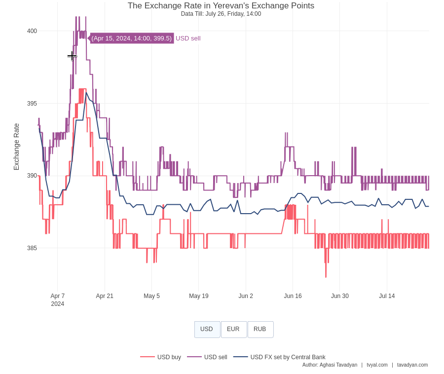

```{r setup, include=FALSE}
knitr::opts_chunk$set(echo = TRUE)

library(tidyverse)
library(scales)
library(plotly)

# rm(list = ls()); gc()

setwd(dirname(rstudioapi::getActiveDocumentContext()$path))

source("../../initial_setup.R")

```

```{r make exchange plotly chart, include=FALSE}

exchange_ponts_data <- read_csv("exchange_points_FX.csv")
CBA_FX <- read_csv("CBA_FX.csv")

exchange_plot_interactive <- function(cut_off_date = "2024-04-01") {
  
  exchange_data <- exchange_ponts_data |>
    filter(date >= ymd(cut_off_date)) |> 
    relocate(date, FX, possition, value)
  
  CBA_data <- CBA_FX |>
    filter(date >= ymd(cut_off_date)) |>
    mutate(
      possition = "FX set by Central Bank",
      date = ymd_h(paste(date, "12"))
    ) |> 
    rename(FX = FX_ISO, value = AMD) |> 
    relocate(date, FX, possition, value)
  
  data <- bind_rows(exchange_data, CBA_data)
  
  Sys.setlocale("LC_TIME", "en_US.UTF-8")
  
  subtitle <- 
    data |> 
    filter(date == max(date, na.rm = TRUE)) |>
    pull(date) |> 
    unique() |> 
    format("Data Till: %B %d, %A, %H:%M")
  
  plotly_data <- data |>
    pivot_wider(names_from = c(FX, possition), values_from = value) |> 
    fill(contains("Կենտրոնական"), .direction = "down")
  
  currency_order <- c("USD", "EUR", "RUB")
  positions <- c("buy", "sell", "FX set by Central Bank")
  
  # Create the plot
  fig <- plot_ly(plotly_data, x = ~date)
  
  # Add traces for each combination of FX and position
  for (fx in currency_order) {
    for (pos in positions) {
      column_name <- paste(fx, pos, sep = "_")
      if (fx == "USD") {
        fig <- fig |> add_lines(
          y = as.formula(paste0("~`", column_name, "`")),
          name = paste(fx, pos),
          line = list(color = case_when(
            pos == "buy" ~ new_palette_colors[6],
            pos == "sell" ~ new_palette_colors[4],
            TRUE ~ new_palette_colors[2]
          ))
        )
      } else {
        fig <- fig |> add_lines(
          y = as.formula(paste0("~`", column_name, "`")),
          name = paste(fx, pos),
          visible = FALSE,
          line = list(color = case_when(
            pos == "buy" ~ new_palette_colors[6],
            pos == "sell" ~ new_palette_colors[4],
            TRUE ~ new_palette_colors[2]
          ))
        )
      }
    }
  }
  
  # Generate button list
  generate_button_list <- function(currencies) {
    button_list <- list()
    
    for (i in seq_along(currencies)) {
      visible_values <- rep(FALSE, length(currencies) * length(positions))
      visible_values[((i-1)*length(positions)+1):(i*length(positions))] <- TRUE
      
      button <- list(
        method = "restyle",
        args = list("visible", visible_values),
        label = currencies[i]
      )
      
      button_list[[i]] <- button
    }
    
    return(button_list)
  }
  
  # Add layout
  fig <- fig |> layout(
    title = list(
      text = paste0("The Exchange Rate in Yerevan's Exchange Points<br>", 
                    "<sup>", subtitle, "</sup>"),
      y = 0.95
    ),
    yaxis = list(title = "Exchange Rate"),
    xaxis = list(title = ""),
    showlegend = TRUE,
    legend = list(orientation = "h", y = -0.2, x = 0.5, xanchor = "center"),
    updatemenus = list(
      list(
        y = -0.1,
        x = 0.5,
        xanchor = "center",
        yanchor = "top",
        direction = "right",
        type = "buttons",
        buttons = generate_button_list(currency_order)
      )
    ),
    annotations = list(
      list(
        x = 1,
        y = -0.27,
        xref = "paper",
        yref = "paper",
        text = caption_f(language = "eng"),
        showarrow = FALSE,
        xanchor = "right",
        yanchor = "auto",
        xshift = 0,
        yshift = 0,
        font = list(size = 10)
      )
    ),
    margin = list(b = 150)  # Increase bottom margin to accommodate buttons, legend, and caption
  )
  
  return(fig)
}

```


Dear Partner,

Hope you are well.

This week we seek for Collaboration!

## [💬🤝💬 Expanding Our Services and Team - Join Us in Shaping Armenia's Data Future](https://www.tvyal.com/newsletter/2024/2024_07_26)

Over the past year, Tvyal.com has been dedicated to exploring various aspects of the Armenian economy through [our weekly newsletter](https://www.tvyal.com/newsletter). [Using advanced programming techniques for data scraping, mining, manipulation, and forecasting](https://github.com/tavad/tvyal_newsletter), we've uncovered insights that have contributed to economic discussions across Armenia.

Today, we're excited to announce that we're expanding our services and our team.

### Enhancing Business Intelligence with SaaS Solutions

Are you looking to extract additional value from your existing data? [Tvyal.com](tvyal.com) now offers a range of SaaS solutions to help businesses optimize their operations:

* Data Scraping and Mining
* Process Automation and Browser Automation
* Data Cleaning and Optimization
* Machine Learning and Predictive Modeling
* Custom Dashboard Development
* CRM Improvements

Our past projects include:

* [A recommendation model providing daily predictions for customer purchases and optimal pricing](https://tavad.shinyapps.io/demo_customer/)
* An automated trading bot
* [Multiple interactive dashboards](https://www.tvyal.com/projects)
* An automated web-scraping and data gathering platform

While we maintain client confidentiality, we'd be happy to discuss our capabilities and past successes in more detail upon request.

### Join Our Growing Team

As we expand our services, we're also looking to grow our team. We're seeking individuals with the following profiles:

**Data Specialists:**

* Skills in R, Python, data mining, data scraping, machine learning, Git, and Linux (bash)
* Formal qualifications mentioned above are less important than honesty, work ethic, and a willingness to learn
* Show us something you've accomplished in the past year that you're proud of

We value potential over credentials. If you're passionate about data and economics, we want to hear from you.

**Why Join Tvyal.com?**

* Be part of a growing company at the forefront of economic analysis in Armenia
* Shape the future of our services and company culture
* Opportunity for initial remote work as we establish our office

### Collaboration Opportunity for Economic Scientists

* We invite accomplished economists to collaborate with us
* Opportunity to transform current economic trends into academic publications
* Ideal for those seeking to expand their research
* Experience in writing Scopus-worthy articles is highly valued
* Access to exclusive, current economic data on Armenia for your research
* Ability to efficiently turn data-driven ideas into scientific publications
* Please submit recent papers, examples of your work

We're seeking to collaborate with established economic scientists to elevate our newsletter insights into academic publications. Our weekly economic newsletter provides a constant stream of current, data-driven insights into the Armenian economy. This presents a unique opportunity for economists to access fresh data and analysis, which can be transformed into scholarly articles.

**Our Impact**

Since its inception 14 months ago, our newsletter has grown from 100 to 1,800 subscribers. Our work is frequently cited and discussed in Armenia's economic circles, demonstrating the value and impact of our analyses.

**Next Steps**

**Whether you're interested in our services or joining our team, we'd love to hear from you. Please reply to this email with your inquiries or applications by August 31, 2024.**

*Thank you for your continued support. We look forward to this new chapter and the opportunity to work with you in enhancing Armenia's economic landscape.*

-----

-----

Եթե հնարավոր է, խնդրում եմ այս նյութը ուղարկել նաև այն մարդկանց, ում այն կարծում եք կարող է հետաքրքրել:

**ԱՅՍ ՀՈԴՎԱԾԻ ՀՂՈՒՄԸ**

***Թավադյան, Աղ․Ա․ (2024)․ SOS ՀՀ ՏՏ․ Վայրիվերում ոլորտում [SOS Armenia IT: Ups and Downs in the Sector]․ Tvyal.com հարթակ [Tvyal.com platform], 19-08-2024․ https://www.tvyal.com/newsletter/2024/2024_08_19***

**Արգելվում է այս հարթակի նյութերը արտատպել առանց հղում կատարելու։**    

<small>\* Այս և մեր բոլոր այլ վերլուծությունների տվյալները վերցված են պաշտոնական աղբյուրներից։ Հաշվարկները ամբողջությամբ հասանելի են github-ում, դրանք կարելի է ստուգել` այցելելով [github-ի](https://github.com/tavad/tvyal_newsletter/blob/main/2024/) մեր էջը, որտեղ տրված են տվյալները, հաշվարկների և գծապատկերների կոդը։</small>


-----

# ՀԱՄԱԳՈՐԾԱԿՑՈՒԹՅՈՒՆ

<style>
.ai-services-banner-tvyal {
background-color: #0a192f;
color: #e6f1ff;
padding: 30px;
font-family: Arial, sans-serif;
border-radius: 10px;
box-shadow: 0 4px 6px rgba(0, 0, 0, 0.1);
position: relative;
overflow: hidden;
min-height: 400px;
display: flex;
flex-direction: column;
justify-content: center;
}
.ai-services-banner-tvyal::before {
content: '';
position: absolute;
top: -25%;
left: -25%;
right: -25%;
bottom: -25%;
background: repeating-radial-gradient(
circle at 50% 50%,
rgba(100, 255, 218, 0.1),
rgba(100, 255, 218, 0.1) 15px,
transparent 15px,
transparent 30px
);
animation: gaussianWaveTvyal 10s infinite alternate;
opacity: 0.3;
z-index: 0;
}
@keyframes gaussianWaveTvyal {
0% {
transform: scale(1.5) rotate(0deg);
opacity: 0.2;
}
50% {
transform: scale(2.25) rotate(180deg);
opacity: 0.5;
}
100% {
transform: scale(1.5) rotate(360deg);
opacity: 0.2;
}
}
.ai-services-banner-tvyal > * {
position: relative;
z-index: 1;
}
.ai-services-banner-tvyal h2,
.ai-services-banner-tvyal h3 {
margin-bottom: 20px;
color: #ccd6f6;
}
.ai-services-banner-tvyal ul {
margin-bottom: 30px;
padding-left: 20px;
}
.ai-services-banner-tvyal li {
margin-bottom: 10px;
}
.ai-services-banner-tvyal a {
color: #64ffda;
text-decoration: none;
transition: color 0.3s ease;
}
.ai-services-banner-tvyal a:hover {
color: #ffd700;
text-decoration: underline;
}
</style>

<div class="ai-services-banner-tvyal">
## [Եթե ուզում եք ձեր տվյլներից օգուտ քաղել AI գործիքներով` ԴԻՄԵՔ ՄԵԶ](mailto:a@tavadyan.com?subject=Let's Put Data to Work!)

### Մենք առաջարկում ենք

- Extensive databases for finding both international and local leads
- Exclusive reports on the Future of the Armenian Economy
- Work and browser automation to streamline operations and reduce staffing needs
- AI models for forecasting growth and optimizing various aspects of your business
- Advanced dashboarding and BI solutions
- Algorithmic trading

### [Let's Put Your Data to Work!](mailto:a@tavadyan.com?subject=Let's Put Data to Work!)

### [ՄԻԱՑԵՔ ՄԵՐ ԹԻՄԻՆ](mailto:a@tavadyan.com?subject=Work application)
</div>


-----

## A Token for Future Cooperation 

As a token of our potential cooperation we are happy to present the interactive plot of Armenia's exchange points. [The charts works on our website](https://www.tvyal.com/newsletter/2024/2024_07_26).

```{r, echo=FALSE, warning=FALSE, fig.width = 9, fig.height = 8}
exchange_plot_interactive()
```

<!-- [](https://www.tvyal.com/newsletter/2024/2024_07_26) -->

-----

**Some of our past work:**

* [🏠💰📉 An exploration of Armenia's Households](https://www.tvyal.com/newsletter/2024/2024_01_07),
* [💲🏙️ Yerevan is More Expensive than Moscow in 2023](https://www.tvyal.com/newsletter/2024/2024_01_12),
* [💸🔚🏦 Capital outflow](https://www.tvyal.com/newsletter/2024/2024_03_01),
* [🤒🟨♻️ Gold Rush 2: Gold and Diamonds are 75% of Armenia’s Exports](https://www.tvyal.com/newsletter/2024/2024_05_11),
* [🌿🤨💎 Expensive Effect: Unraveling the Economic Growth of 2024”](https://www.tvyal.com/newsletter/2024/2024_03_29),
* [🔌⚡🇦🇲 Electric Armenia: Reduction in Electricity Production and Exports](https://www.tvyal.com/newsletter/2024/2024_05_17),
* [💼✈🥶️ Armenia’s Warm Welcome Runs Cold: Study of Export of Services](https://www.tvyal.com/newsletter/2024/2024_04_26),
* [💵🪙🎭 The Drama of Dram. Why Does the Dram Depreciate and Appreciate?](https://www.tvyal.com/newsletter/2024/2024_04_05)
* [🇷🇺💰🇦🇲 Armenia: Russia’s Gold Hub - In 2024 88 percent of Russian gold exports passed through Armenia](https://www.tvyal.com/newsletter/2024/2024_07_05),
* [💰🚧⚖ The Pendulum of Public Debt: For the First Time, Domestic Debt Exceeds External Debt](https://www.tvyal.com/newsletter/2024/2024_06_28)։

-----


## Media Appearances


1. [Watch my interview given to 1in.am where I talk about economic challenges and potental changes in exchange rate and exonomic volatility.](https://youtu.be/EROKFOixiTA)

📺  Եթե դրամն արժեզրկվի, պետական պարտքը զգալի կմեծանա. մեր տնտեսական աճը որակի հաշվին չէ. Աղասի Թավադյան 📺

<a href="https://youtu.be/EROKFOixiTA">
  
</a>

2.  [Watch my interview titled "Yerevan became the most expensive city in the region: Dram "defeated" the dollar"](https://youtu.be/tLL3mn6unl4)

📺  Երևանը դարձել է տարածաշրջանի ամենաթանկ քաղաքը, Դրամը "հաղթել" է դոլարին. Աղասի Թավադյան 📺

<a href="https://youtu.be/tLL3mn6unl4">
  
</a>


---

This newletter is also available [on our website](https://www.tvyal.com/newsletter/2024/2024_07_26), and the code and data are also avalable on [Github](https://github.com/tavad/tvyal_newsletter).

---    

 

Best Regards,               
Aghasi Tavadyan        
26.07.2024          
[tvyal.com](https://www.tvyal.com/)      
[tavadyan.com](https://www.tavadyan.com/)

---

[Was this email forwarded to you? Subscribe here.](https://www.tvyal.com/subscribe)

[Բաժանորդագրվեք](https://www.tvyal.com/subscribe)

       
---              
               


####### **Ուշադրություն. Ձեր էլ.փոստը մեյլլիսթի մեջ է, որի միջոցով ես կիսվում եմ շաբաթական նյութեր, որոնք հիմնականում ներկայացնում են Հայաստանի տնտեսությունը: Նյութերը ներառում են գծապատկերներ, [տվյալների բազաներ](https://github.com/tavad/tvyal_newsletter), տեսանյութեր, հոդվածներ, [առցանց վահանակներ](https://www.tvyal.com/projects), տնտեսական գործիքներ, կանխատեսումներ և հաշվետվություններ: Եթե ցանկանում եք չեղարկել բաժանորդագրությունը, խնդրում եմ տեղեկացրեք ինձ, և ես կհեռացնեմ ձեր էլ. փոստը ցուցակից: Գրեք նաև եթե ունեք մենկնաբանություններ:**

####### **Important! Your email is part of the mailing list where I share weekly materials primarily focused on the Armenian economy. These materials encompass charts, [databases](https://github.com/tavad/tvyal_newsletter), videos, articles, [online dashboards](https://www.tvyal.com/projects), economic tools, forecasts, and reports. If you wish to unsubscribe, please let me know, and I will remove your email from the list. Please share your comments as well․**


