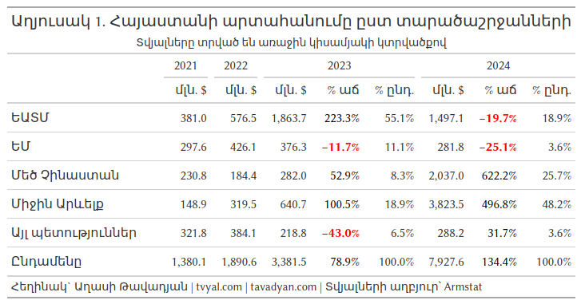

```{r setup, include=FALSE}
knitr::opts_chunk$set(echo = FALSE)

library(tidyverse)
library(RcppRoll)
library(scales)
library(gt)

# rm(list = ls()); gc()

setwd(dirname(rstudioapi::getActiveDocumentContext()$path))

source("../../initial_setup.R")

```

```{r get data, include=FALSE}

arm_trade_country <- 
  read_csv("arm_trade_country.csv") 

arm_trade_commodity <- 
  read_csv("arm_trade_commodity.csv")

names_dic <- 
  read_csv("names_en_am_ru_short.csv") |> 
  mutate(hs2 = as.character(hs2))

commodity_groups_dic <- 
  read_csv("commodity_groups_dic.csv")

```

```{r add regions, include=FALSE}
EU = c("Austria", "Belgium", "Bulgaria", "Croatia", "Cyprus", "Czech Rep.",
       "Denmark", "Estonia", "Finland", "France", "Germany", "Greece", "Hungary",
       "Ireland", "Italy", "Latvia", "Lithuania", "Luxembourg", "Malta", "Netherlands",
       "Poland", "Portugal", "Romania", "Slovakia", "Slovenia", "Spain", "Sweden")

EAEU = c("Russian Federation", "Kazakhstan", "Belarus", "Armenia", "Kyrgyzstan")
        
Middle_East = c("Bahrain", "Egypt", "Iran", "Iraq", "Israel", "Jordan", "Kuwait",
                "Lebanon", "Oman", "Qatar", "Saudi Arabia", "Syria", "Turkey", 
                "United Arab Emirates", "Yemen")

China = c("China", "Hong Kong")

arm_trade_country <- 
  arm_trade_country |> 
  mutate(country_region = case_when(
    country %in% EU ~ "EU",
    country %in% EAEU ~ "EAEU",
    country %in% Middle_East ~ "Middle East",
    country %in% China ~ "Greater China",
    TRUE ~ "Other countries"
  ))

rm(EU, EAEU, Middle_East, China)
```


```{r plot 1 arm trade by regions, include=FALSE}
region_dic <- 
  tibble(
    country_region = c("EAEU", "EU", "Greater China", "Middle East", "Other countries"),
    country_region_arm = c("ԵԱՏՄ", "ԵՄ", "Մեծ Չինաստան", "Միջին Արևելք", "այլ պետություններ")
  )

plot_1_arm_trade_by_regions <-
  arm_trade_country |> 
  mutate(date = date + months(1) - days(1)) |> 
  group_by(country_region, date) |> 
  summarise(export = sum(export, na.rm = TRUE), .groups = "drop") |> 
  group_by(country_region) |> 
  mutate(
    export_yoy = roll_sumr(export, 12)
  ) |> 
  na.omit() |> 
  filter(
    date >= ym("2019-12")
  ) |> 
  left_join(region_dic, by = "country_region") |> 
  mutate(
    country_region_arm = fct_inorder(country_region_arm)
  ) |> 
  ggplot(aes(date, export_yoy / 1e6, color = country_region_arm)) +
  geom_line(linewidth = 1.5, alpha = 1) +
  scale_x_date(date_breaks = "1 year", date_labels = "%Y") +
  scale_y_continuous(n.breaks = 6, labels = number_format(), limits = c(0,6)) +
  scale_color_manual(values = colfunc2(5)) +
  labs(
    x = NULL,
    y = NULL,
    color = NULL,
    title = "Հայաստանի արտահանումը Միջին Արևելք ԵԱՏՄ-ից մեծ է",
    subtitle = "ՀՀ արտահանումը ըստ տարածաշրջանների\nմլրդ ԱՄՆ դոլար, տարեկան (տվյալ ամիսը նախորդ տարվա նույն ամսվա համեմատ)",
    caption = caption_f("Armstat")
  )
```


```{r plot 2 exports by country, include=FALSE}

country_chosen = c("United Arab Emirates", "Russian Federation", "Hong Kong", "China")

plot_2_exports_by_country <- 
  arm_trade_country |> 
  mutate(
    country = ifelse(country %in% country_chosen, country, "The Rest (Other countries)"),
    country = ifelse(country %in% c("Hong Kong", "China"), "Hong Kong & China", country)
  ) |> 
  bind_rows(
    arm_trade_country |> mutate(country = "Total")
  ) |> 
  pivot_longer(
    contains("port"),
    names_to = "direction"
  ) |> 
  group_by(country, year, month, date, direction) |> 
  summarise(value = sum(value), .groups = "drop") |> 
  arrange(country, direction, date) |> 
  group_by(country, direction) |> 
  mutate(
    value_yoy = roll_sumr(value, 12),
    country = factor(
      country,
      levels = c("Russian Federation", "United Arab Emirates",
                 "Hong Kong & China", "Total", "The Rest (Other countries)"),
      labels = c("Ռուսաստանի Դաշնություն", "Արաբական Միացյալ Էմիրություններ",
                 "Հոնկոնգ և Չինաստան", "Ընդամենը", "Մնացածը (այլ պետություններ)"),
    )
  ) |> 
  filter(
    direction != "import_consignment",
    country != "Ընդամենը",
    year >= 2015
  ) |>
  ungroup() |> 
  na.omit() |> 
  filter(date >= ym("2020-01")) |> 
  ggplot(aes(date, value_yoy / 1e6, color = direction)) +
  geom_line(linewidth = 1.5) +
  facet_wrap(~country, scales = "free") +
  scale_x_date(date_breaks = "1 year", date_labels = "%Y") +
  scale_y_continuous(n.breaks = 6, labels = number_format()) +
  scale_color_manual(
    values = new_palette_colors[c(6,2)],
    labels = c("Արտահանում", "Ներմուծում")
  ) +
  labs(
    x = NULL,
    y = NULL,
    color = NULL,
    title = "Հայաստանից ներմուծումը և արտահանումը",
    subtitle = "Մլրդ ԱՄՆ դոլար, տարեկան (տվյալ ամիսը նախորդ տարվա նույն ամսվա համեմատ)",
    caption = caption_f("Armstat")
  )

```


```{r table 1 exports by regions, include=FALSE}
main_table_generator <- 
  function(tbl, year_, direction_ = "export", exclude_info_years, language){
    
    result_tbl <- 
      tbl |> 
      bind_rows(
        tbl |> 
          mutate(country_region = "Total")
      ) |> 
      group_by(year, country_region) |> 
      summarise(
        export = sum(export),
        import = sum(import_origin),
        .groups = "drop"
      ) |> 
      pivot_longer(c(export, import), names_to = "direction") |> 
      arrange(country_region, direction, year) |> 
      group_by(country_region, direction) |> 
      mutate(pct_growth = value / lag(value) - 1) |> 
      arrange(direction, year, country_region) |> 
      group_by(direction, year) |> 
      mutate(pct_part = value / sum(value) * 2) |> 
      ungroup() |> 
      filter(
        year %in% year_,
        direction == direction_
      ) |> 
      mutate(value = value / 1000) |> 
      pivot_wider(
        names_from = c(year, direction),
        values_from = c(value, pct_growth, pct_part),
        names_vary = "slowest"
      ) |> 
       select(-matches(paste0("pct_.*_", exclude_info_years, collapse = "|")))
  
    if(language == "rus"){
      result_tbl <- result_tbl |>  
        mutate(
          country_region = case_match(
            country_region,
            "EAEU" ~ "ЕАЭС",
            "EU" ~ "ЕС",
            "Greater China" ~ "Большой Китай",
            "Middle East" ~ "Средней Восток",
            "Other countries" ~ "Другие страны",
            "Total" ~ "Всего"
          )
        )
    } else if(language == "arm"){
      result_tbl <- result_tbl |>  
        mutate(
          country_region = case_match(
            country_region,
            "EAEU" ~ "ԵԱՏՄ",
            "EU" ~ "ԵՄ",
            "Greater China" ~ "Մեծ Չինաստան",
            "Middle East" ~ "Միջին Արևելք",
            "Other countries" ~ "Այլ պետություններ",
            "Total" ~ "Ընդամենը"
          )
        )
    }
    
    return(result_tbl)  
  }

table_1_exports_by_regions <- 
  main_table_generator(
    arm_trade_country |> filter(month %in% 1:6), year_ = 2021:2024,
    direction_ = "export", exclude_info_years = c(2021:2022), language = "arm"
  ) |> 
  gt() |> 
  fmt_number(
    columns = contains("value"),
    decimals = 1, 
    use_seps = TRUE,
  ) |> 
  fmt_number(
    columns = contains("pct"),
    scale_by = 100,
    decimals = 1,
    pattern = "{x}%"
  ) |> 
  cols_label(
    country_region = "", 
    value_2021_export = "մլն․ $", 
    value_2022_export = "մլն․ $", 
    value_2023_export = "մլն․ $", 
    pct_growth_2023_export = "% աճ", 
    pct_part_2023_export = "% ընդ․", 
    value_2024_export = "մլն․ $", 
    pct_growth_2024_export = "% աճ", 
    pct_part_2024_export = "%  ընդ․"
  ) |> 
  # tab_spanner(
  #   label = "Արտահանում",
  #   columns = country_region
  # ) |>
  data_color(
    columns = matches("pct_growth"),
    fn = function(x) ifelse(x < 0, "red", "black"),
    apply_to = "text"
  ) |> 
  text_transform(
    locations = cells_body(columns = matches("pct_growth")),
    fn = function(x) ifelse(x < 0, paste0("<strong>", x, "</strong>"), x)
  ) |> 
  tab_spanner(
    label = "2021",
    columns = contains("2021")
  ) |>
  tab_spanner(
    label = "2022",
    columns = contains("2022")
  ) |>
  tab_spanner(
    label = "2023",
    columns = contains("2023")
  ) |> 
  tab_spanner(
    label = "2024",
    columns = contains("2024")
  ) |> 
  tab_header(
    title = "Աղյուսակ 1. Հայաստանի արտահանումը ըստ տարածաշրջանների",
    subtitle = "Տվյալները տրված են առաջին կիսամյակի կտրվածքով"
  ) |> 
  tab_footnote(
    footnote = caption_f("Armstat")
  )

```


```{r plot 3 exports forecast, include=FALSE}
exports_forecast <- read_csv("exports_forecast.csv")

plot_3_exports_forecast <- 
  exports_forecast |> 
  mutate(across(matches("ribbon|value"), ~.x/1e6)) |> 
  ggplot(aes(date, value, color = info, lty = model_name)) +
  geom_segment(
    aes(x = ymd("2020-01-01"), y = 8.5, xend = ymd("2024-06-30"), yend = 8.5),
    arrow = arrow(length = unit(0.02, "npc")),
    color = new_palette_colors[3],
    lineend = "round", linejoin = "mitre"
  ) +
  geom_segment(
    aes(x = ymd("2024-06-30"), y = 0, xend = ymd("2024-06-30"), yend = 15),
    color = "gray", linetype = 2,
  ) +
  geom_line(linewidth = 1) +
  geom_ribbon(aes(ymin = ribbon_low , ymax = ribbon_high), alpha = .2) +
  geom_hline(yintercept = 0, color = "gray") +
  geom_text(
    aes(
      x = ymd("2022-01-01"), y = 10.3, fontface = "plain",
      label = "2024թ. հունիսի դրությամբ 12-ամսյա\nարտահանումը կազմել է 13.1 մլրդ դոլար,\nորից 62.4%-ը «Թանկարժեք քարեր և մետաղներ» (ԱՏԳ ԱԱ 71):\n2022թ. արտահանումը 3 մլրդ դոլար էր,\nորից այս ապրանքախումբը՝ 10.8%:"
    ),
    size = 3.2,
    color = "gray40",
    family = "DejaVu Sans Light"  # Change to a font that supports Armenian
  ) +
  scale_x_date(date_breaks = "1 year", date_labels = "%Y") +
  scale_y_continuous(breaks = seq(0,14,2), labels = dollar_format(), limits = c(0, 15)) +
  scale_color_manual(
    values = new_palette_colors[c(6,2)],
    labels = c("Ամբողջական արտահանումը", "Արտահանումը, բացառությամբ թանկարժեք քարեր և մետաղներ (ԱՏԳ ԱԱ 71)")
  ) +
  scale_linetype_manual(
    values = c(1, 2, 3),
    labels = c("Իրական տվյալներ", "ETS կանխատեսում", "STLM կանխատեսում")
  ) +
  guides(
    color = guide_legend(order = 1),
    linetype = guide_legend(order = 2)
  ) +
  labs(
    x = NULL,
    y = NULL,
    color = NULL,
    linetype = NULL,
    title = "ՀՀ արտահանման կանխատեսում",
    subtitle = "Մլրդ ԱՄՆ դոլար, տարեկան (տվյալ ամիսը նախորդ տարվա նույն ամսվա համեմատ)",
    caption = caption_f()
  )

```


```{r plot 4 gold trade, include=FALSE}

arm_trade_commodity_groupped <- 
  arm_trade_commodity |> 
  group_by(date, hs2) |> 
  summarise(
    import = sum(import),
    export = sum(export),
    .groups = "drop"
  ) |> 
  pivot_longer(c(import, export), names_to = "direction") |> 
  arrange(hs2, direction, date)

arm_trade_commodity_groupped |> 
  filter(direction == "export") |> 
  mutate(is71 = ifelse(hs2 == 71, "71", "not71")) |> 
  group_by(is71, date) |> 
  summarise(value = sum(value), .groups = "drop") |>
  mutate(value = roll_sumr(value, 12)) |> 
  filter(date >= ymd("2019-12-01")) |> 
  group_by(date) |> 
  mutate(
    total = sum(value),
    pct = value / total
  )
  # view()

arm_trade_commodity_groupped |> 
  filter(
    # direction == "export",
    hs2 == 71, 
    date >= ymd("2022-01-01")
  ) |> 
  mutate(
    direction = ifelse(direction == "export", "Արտահանում", "Ներմուծում")
  ) |> 
  mutate(date = date + days(16)) |> 
  ggplot(aes(date, value/1e3, fill = direction)) +
  geom_col() +
  facet_wrap(~direction, scales = "free_y", ncol = 1) +
  scale_y_continuous(labels = dollar_format()) +
  scale_fill_manual(values = new_palette_colors[c(6,2)]) +
  labs(
    x = NULL,
    y = NULL,
    fill = NULL,
    title = "Թանկարժեք քարերի և մետաղների արտահանում (ԱՏԳ ԱԱ 71)",
    subtitle = "մլն դոլար, ամսական",
    caption = caption_f()
  ) +
  theme(
    legend.position = "drop"
  )

plot_4_gold_trade <- 
  arm_trade_commodity_groupped |> 
  filter(
    # direction == "export",
    hs2 == 71, 
    date >= ymd("2022-01-01")
  ) |> 
  mutate(
    value = value/1e6,
    text = ifelse(date >= ymd("2023-09-01"), number(value, accuracy = 0.01), ""),
    value = ifelse(direction == "export", value, -value),
    direction = ifelse(direction == "export", "Արտահանում", "Ներմուծում")
  ) |> 
  mutate(date = date + days(16)) |> 
  ggplot(aes(date, value)) +
  geom_col(aes(fill = direction)) +
  geom_hline(yintercept = 0, color = "gray30") +
  geom_text(
    aes(label = text, color = direction,
    vjust = ifelse(direction == "Արտահանում", -0.3, 1.3))
  ) +
  geom_text(
    data = tibble(
      x = ymd("2022-07-01"), y = c(0.4,-0.4),
      label = c("Արտահանում", "Ներմուծում")
    ),
    mapping = aes(x, y , label = label, color = label),
    size = 5
  ) +
  scale_y_continuous(labels = NULL) +
  scale_fill_manual(values = new_palette_colors[c(6,2)]) +
  scale_color_manual(values = new_palette_colors[c(6,2)]) +
  labs(
    x = NULL,
    y = NULL,
    fill = NULL,
    title = "Հայաստանի արտահանման 71%-ը թանկարժեք քարեր և մետաղներն են*",
    subtitle = "Թանկարժեք քարերի և մետաղների արտահանում և ներմուծում (ԱՏԳ ԱԱ 71)\nմլրդ դոլար, ամսական",
    caption = caption_f("Armstat", suffix_text = "* 2024 թվականի առաջին կիսամյակի դրությամբ")
  ) + 
  theme(
    legend.position = "drop",
    panel.grid.major.y = element_blank()
  )

```


***English summary below.***

Հարգելի գործընկեր,

Հուսով եմ՝ լավ եք: 
Ներկայացնում եմ այս շաբաթվա վերլուծությունները և աշխատանքները.

## 💎🎭🔮️ [Ոսկե Պատրանք. Հայաստանի արտահանման իրական պատկերը](https://www.tvyal.com/newsletter/2024/2024_09_02)

Հայաստանի տնտեսությունում տարօրինակ իրավիճակ է ստեղծվել: Պաշտոնական վիճակագրությունը ցույց է տալիս արտահանման աննախադեպ աճ, սակայն իրականությունն այլ է:

Առաջին հայացքից Հայաստանի արտահանման ցուցանիշները ապշեցուցիչ են: 2024 թվականի առաջին կիսամյակում երկրի արտահանումը հասել է 7.9 միլիարդ դոլարի՝ ավելի քան կրկնապատկելով 2023 թվականի նույն ժամանակահատվածի 3.4 միլիարդ դոլարը: Սովորաբար նման կտրուկ աճը կնշանակեր, որ տնտեսությունը լիակատար թափով առաջ է շարժվում: Սակայն ավելի մանրակրկիտ ուսումնասիրությունը բացահայտում է ոչ այնքան դրական իրականություն:

Գծապատկեր 1.

```{r plot1, echo=FALSE, warning=FALSE, message=FALSE, fig.width = 12, fig.height = 8}
plot_1_arm_trade_by_regions
```


Առաջին գծապատկերը պատկերում է արտահանման կտրուկ փոփոխությունը: Գծապատկերը ցույց է տալիս, որ Հայաստանի արտահանումը դեպի Միջին Արևելք սրընթաց կտրուկ աճել է՝ գերազանցելով նույնիսկ դեպի Եվրասիական տնտեսական միություն (ԵԱՏՄ) արտահանումը: Առաջին հայացքից կարող է թվալ, թե սա տնտեսական դիվերսիֆիկացման հաջողություն է, սակայն իրականությունն այլ է:

Առաջին կիսամյակի կտրվածքով Հայաստանի արտահանման առյուծի բաժինը՝ ապշեցուցիչ 71%-ը, բաժին է ընկնում մեկ ապրանքատեսակի՝ թանկարժեք մետաղներին և քարերին, որի մեջ գերակշռում է ոսկին: Սակայն Հայաստանը չի ապրում ժամանակակից ոսկու տենդ: Փոխարենը, այն դարձել է Ռուսաստանի ոսկու առևտրի կարևոր հանգույց: 2024 թվականի առաջին եռամսյակում Ռուսաստանի ոսկու արտահանման 88%-ն անցել է Հայաստանով: [Կարդալ ավելին՝ 🇷🇺💰🇦🇲 Հայաստան` ռուսական ոսկու հանգրվան](https://www.tvyal.com/newsletter/2024/2024_07_05):

Այս երևույթը վերաարտահանման տիպիկ դեպք է, և այն արմատապես փոխել է Հայաստանի առևտրային պատկերը: Մերձավոր Արևելքը` հատկապես Արաբական Միացյալ Էմիրությունները, հանկարծակի դարձել են Հայաստանի արտահանման հիմնական ուղղությունը՝ կազմելով 2024 թվականի առաջին կիսամյակի ընդհանուր արտահանման գրեթե կեսը (48.2%): Սա հսկայական տեղաշարժ է ընդամենը մի քանի տարի առաջվա համեմատ, երբ ԵԱՏՄ-ն և Եվրոպական Միությունը հիմնական առևտրային գործընկերներն էին:

Աղյուսակ 1.

```{r table1, echo=FALSE, warning=FALSE, message=FALSE, fig.width = 12, fig.height = 8}
table_1_exports_by_regions
```

<!--  -->


Ներկայացված աղյուսակը ցույց է տալիս առևտրային հոսքերի կտրուկ փոփոխությունները: ԵՄ արտահանման չափաբաժինը նվազել է 2021 թվականի 21%-ից մինչև ընդամենը 3.6%։ 2024 թվականի առաջին կիսամյակում ԵՄ արտահանումը նվազել է 2023 թվականի նույն ժամանակաշրջանի համեմատ 25.1%-ով: Սա պարզապես չափաբաժինների փոփոխություն չէ, այլ հայեցակարգային փոփոխություն, որն ունի հեռուն գնացող հետևանքներ:

Իսկ ի՞նչ է կատարվում Հայաստանի ավանդական արտահանման հետ: Նշենք, որ մենք գնահատել ենք Հայաստանի իրական վերաարտահանման ծավալները՝ օգտագործելով նոր մեթոդաբանություն, որը մանրամասն ներկայացված է [🚀♻🟨 Ոսկու տենդ. Հայաստանի արտահանման կեսը վերաարտահանում է](https://www.tvyal.com/newsletter/2024/2024_04_12) հոդվածում: Այս վերլուծությունը ցույց է տալիս, որ Հայաստանի «իրական» արտահանումը փաստացի նվազել է: Ըստ մեր գնահատականի՝ 2024 թվականին արտահանման մոտ 75%-ն արդեն վերաարտահանում է, համեմատած 2021 թվականի հետ, երբ այս ցուցանիշը 6% էր: Փաստացի 2024 թվականի առաջին կիսամյակում` առանց վերաարտահանման, իրական արտահանումը կազմել է մոտ 3.2 միլիարդ դոլար, ինչը հազիվ է գերազանցում 2021 թվականի 2.8 միլիարդ դոլարը: Արտահանման թվերը ներառում են նաև վերաարտահանումը։ Այսպես, արտահանումը 2021 թվականի 3 մլրդ ցուցանիշից արդեն իսկ ուռճացվել է մինչև 13 մլրդ դոլարի։ Այսինքն՝ 4.3 անգամ առաջին հայացքից տպավորիչ ուռճացված աճ՝ այս պահին ի հաշիվ ոսկու վերաարտահանման։

Գծապատկեր 2.

```{r plot2, echo=FALSE, warning=FALSE, message=FALSE, fig.width = 12, fig.height = 8}
plot_2_exports_by_country
```

Երկրորդ գծապատկերը ցույց է տալիս սթափեցնող պատկեր: Մինչ ԱՄԷ և Հոնկոնգ արտահանումը (հիմնականում ոսկի) կտրուկ աճում է, այլ երկրներ, այդ թվում՝ Ռուսաստան արտահանումը նվազում է: Այս [🤒🟨♻️ «ոսկու տենդը»](https://www.tvyal.com/newsletter/2024/2024_05_11) քողարկում է Հայաստանի իրական տնտեսության, առևտրաշրջանառության և ՀՆԱ անկումը։ Այն ուռճացրել է ՀՆԱ-ի ցուցանիշները՝ ստեղծելով տնտեսական աճի պատրանք այնտեղ, որտեղ աճը փոքր է: 2024 թվականի առաջին եռամսյակում Հայաստանի կառավարությունը հպարտացել էր տպավորիչ 9.2% ՀՆԱ-ի աճով: Մեր [գնահատականները ցույց տվեցին](https://www.aravot.am/2024/08/10/1437252/), որ այս աճի ցնցող 4%-ը պայմանավորված էր միայն ոսկու վերաարտահանման «արդյունաբերությամբ» (կարդացեք ավելին՝ [🌿🤨💎 Թանկարժեք էֆեկտ․ 2024 թվականի տնտեսական աճի պատճառները](https://www.tvyal.com/newsletter/2024/2024_03_29)): Այս հրապարակումն անելուց հետո հոկտեմբերի 20-ին այս թիվը վերանայվեց՝ հասնելով 6.6%-ի: Հիմնական վերանայումը եղավ ոսկու վերաարտահանման «արտադրության» իջեցումը ՀՆԱ-ում` 4 տոկոսային կետից մինչև 1.2 տոկոսային կետ: Սա պարզապես վերանայում չէ, այլ հայեցակարգային փոփոխություն: Թվացյալ աճի միտումից Հայաստանն այժմ գտնվում է լճացման ուղղու վրա:

Գծապատկեր 3.

```{r plot3, echo=FALSE, warning=FALSE, message=FALSE, fig.width = 12, fig.height = 8}
plot_3_exports_forecast
```

Երրորդ գծապատկերը ցույց է տալիս ոչ դրական կանխատեսում: Մինչ ընդհանուր արտահանումը թվացյալ սլանում է վեր, թանկարժեք մետաղների և քարերի վերաարտահանման հաշվին (ԱՏԳ ԱԱ 71), այլ բոլոր ապրանքների արտահանման կտրվածքով առկա է անկում: Այս տարբերությունը Հայաստանի ներկայիս տնտեսական պատրանքի իրականությունն է: Գծապատկերում կարմիր և կապույտ գծերի միջև մակերեսն արտացոլում է թանկարժեք քարերի և մետաղների մասնաբաժինն ընդհանուր արտահանման մեջ:

Այս ոսկե շահույթի կայունությունը լավագույն դեպքում կասկածելի է: Հայաստանի միջոցով ոսկու վերաարտահանման աճը մեծապես պայմանավորված է աշխարհաքաղաքական հանգամանքներով, մասնավորապես՝ Ռուսաստանի նկատմամբ արևմտյան պատժամիջոցներով: Սա ժամանակավոր երևույթ է և պայմանավորված է համաշխարհային տնտեսական իրողություններով, որոնք արդեն իսկ փոխվում են:

Գծապատկեր 4.

```{r plot4, echo=FALSE, warning=FALSE, message=FALSE, fig.width = 12, fig.height = 8}
plot_4_gold_trade
```

Այս գծապատկերը ցույց է տալիս թանկարժեք մետաղների արտահանման և ներմուծման կտրուկ աճը 2023-ի նոյեմբերից մինչև 2024-ի ապրիլը: Ուշադրություն դարձրեք վերջին երկու ամիսներին, որը կարող է լինել Հայաստանի «ոսկե դարաշրջանի» ավարտի նախանշան:

Գծապատկերից երևում է, որ միայն 2024 թվականի ապրիլին 2 մլրդ դոլարի ոսկի է ներմուծվել Ռուսաստանից Հայաստան, որից հետո այն կտրուկ անկում է ապրել։ Մայիս ամսին ներմուծվել է 471 մլն դոլարի ոսկի։ Մայիս/ապրիլ թանկարժեք քարերի և մետաղների ներմուծումն ընկել է 4.3 անգամ։

Ռուսաստանում վերջերս տեղի ունեցած օրենսդրական փոփոխությունների արդյունքում [վերացվեց ոսկու արտահանման մաքսատուրքը](https://www.finam.ru/publications/item/otmena-eksportnoy-poshliny-na-zoloto-podderzhit-nastroeniya-na-rynke-20240417-1230/), որի ներդրումից հետո ՌԴ ոսկու արտահանման 88%-ն անցավ Հայաստանով։ Ոսկու տարանցիկ հոսքն արդեն իսկ նվազում է: Վերջին ամիսներում Հայաստանի արտահանման և ՀՆԱ-ի աճը հիմնված էր այս արտաքին, ժամանակավոր և արհեստական երևույթի վրա, որը տնտեսությունը դնում է խիստ անկայուն վիճակի մեջ: Այն քողարկում է իրական տնտեսության անկումը և շեղում ուշադրությունն իրական տնտեսական իրավիճակից և տնտեսական փոփոխությունների անհրաժեշտությունից:

Մինչ Հայաստանը հեծել է այս ոսկե ալիքը, անտեսվում է կայուն, բարձր ավելացված արժեք ունեցող ճյուղերի զարգացումը, որոնք կարող են ապահովել երկարաժամկետ տնտեսական կայունություն: ԵԱՏՄ և ԵՄ-ի ավանդական շուկաներ արտահանման անկումը հատկապես մտահոգիչ է, քանի որ այն կարող է վկայել մրցունակության կորստի մասին այն ոլորտներում, որոնք նախկինում Հայաստանի տնտեսության հենասյուներն էին:

Մոտակա ամիսները վճռորոշ կլինեն, քանի որ ոսկու վերաարտահանման սրընթաց աճն արդեն մարում է, Հայաստանը կարող է հայտնվել դաժան տնտեսական իրականության առջև: Տնտեսության իրական վիճակը, որը մինչ այժմ թաքնված էր ոսկու փայլի հետևում, կդառնա ավելի ակնհայտ:

Անհրաժեշտ է հայացքը բևեռել այս «ոսկե դարաշրջանից» այն կողմ և սկսել կառուցել իրական արտադրական հիմք ունեցող, երկարաժամկետ և կայուն ավելացված արժեք ստեղծող տնտեսություն, որը հիմնված չի լինի ժամանակավոր և ոչ կայուն արտաքին ազդակների վրա, որոնք և հիմնականում ապահովել են Հայաստանի ժամանակավոր երկնիշ տնտեսական աճը։ Անհրաժեշտ է կառուցել դիմացկուն տնտեսություն, որը ներառում է ներդրումներ կրթության մեջ, նորարարության խթանում և բարձր արժեք ունեցող ճյուղերի աճի համար նպաստավոր միջավայրի ստեղծում, ինչպես նաև [🧮⏳🎲 արդյունավետ հարկային դաշտի ձևավորում](https://www.tvyal.com/newsletter/2024/2024_08_02):

Այս վերլուծությունը ցույց է տալիս, որ Հայաստանը կանգնած է կարևոր խաչմերուկի առջև: Հայաստանի «ոսկե պատրանքը» զգուշացնող օրինակ է ծառայում զարգացող տնտեսությունների համար: Այն ընդգծում է ժամանակավոր շահույթների վրա հենվելու վտանգը և ամուր, բազմազանեցված տնտեսական հիմք ստեղծելու կարևորությունը: Ոսկու տենդից ապաքինվելուն զուգընթաց, Հայաստանի իրական տնտեսական ուժը կենթարկվի փորձության: Հարցը մնում է բաց. երբ ոսկու փոշին նստի, ի՞նչը կշարունակի փայլել Հայաստանի տնտեսությունում:


-----

-----

Եթե հնարավոր է, խնդրում եմ այս նյութը ուղարկել նաև այն մարդկանց, ում այն կարծում եք կարող է հետաքրքրել:

**ԱՅՍ ՀՈԴՎԱԾԻ ՀՂՈՒՄԸ**

***Թավադյան, Աղ․Ա․ (2024)․ Ոսկե Պատրանք. Հայաստանի արտահանման իրական պատկեր [Golden Illusion: The Real Picture of Armenia's Exports]․ Tvyal.com հարթակ [Tvyal.com platform], 02-09-2024․ https://www.tvyal.com/newsletter/2024/2024_09_02***

**Արգելվում է այս հարթակի նյութերը արտատպել առանց հղում կատարելու։**    

<small>\* Այս և մեր բոլոր այլ վերլուծությունների տվյալները վերցված են պաշտոնական աղբյուրներից։ Հաշվարկները ամբողջությամբ հասանելի են github-ում, դրանք կարելի է ստուգել` այցելելով [github-ի](https://github.com/tavad/tvyal_newsletter/blob/main/2024/) մեր էջը, որտեղ տրված են տվյալները, հաշվարկների և գծապատկերների կոդը։

</small>


-----

# ՀԱՄԱԳՈՐԾԱԿՑՈՒԹՅՈՒՆ

<style>
.ai-services-banner-tvyal {
background-color: #0a192f;
color: #e6f1ff;
padding: 30px;
font-family: Arial, sans-serif;
border-radius: 10px;
box-shadow: 0 4px 6px rgba(0, 0, 0, 0.1);
position: relative;
overflow: hidden;
min-height: 400px;
display: flex;
flex-direction: column;
justify-content: center;
}
.ai-services-banner-tvyal::before {
content: '';
position: absolute;
top: -25%;
left: -25%;
right: -25%;
bottom: -25%;
background: repeating-radial-gradient(
circle at 50% 50%,
rgba(100, 255, 218, 0.1),
rgba(100, 255, 218, 0.1) 15px,
transparent 15px,
transparent 30px
);
animation: gaussianWaveTvyal 10s infinite alternate;
opacity: 0.3;
z-index: 0;
}
@keyframes gaussianWaveTvyal {
0% {
transform: scale(1.5) rotate(0deg);
opacity: 0.2;
}
50% {
transform: scale(2.25) rotate(180deg);
opacity: 0.5;
}
100% {
transform: scale(1.5) rotate(360deg);
opacity: 0.2;
}
}
.ai-services-banner-tvyal > * {
position: relative;
z-index: 1;
}
.ai-services-banner-tvyal h2,
.ai-services-banner-tvyal h3 {
margin-bottom: 20px;
color: #ccd6f6;
}
.ai-services-banner-tvyal ul {
margin-bottom: 30px;
padding-left: 20px;
}
.ai-services-banner-tvyal li {
margin-bottom: 10px;
}
.ai-services-banner-tvyal a {
color: #64ffda;
text-decoration: none;
transition: color 0.3s ease;
}
.ai-services-banner-tvyal a:hover {
color: #ffd700;
text-decoration: underline;
}
</style>

<div class="ai-services-banner-tvyal">
## [Եթե ուզում եք  AI գործիքներով ձեր տվյալներից օգուտ քաղել` ԴԻՄԵՔ ՄԵԶ](mailto:a@tavadyan.com?subject=Let's Put Data to Work!)

### Մենք առաջարկում ենք

- Extensive databases for finding both international and local leads
- Exclusive reports on the Future of the Armenian Economy
- Work and browser automation to streamline operations and reduce staffing needs
- AI models for forecasting growth and optimizing various aspects of your business
- Advanced dashboarding and BI solutions
- Algorithmic trading

### [Let's Put Your Data to Work!](mailto:a@tavadyan.com?subject=Let's Put Data to Work!)

### [ՄԻԱՑԵՔ ՄԵՐ ԹԻՄԻՆ](mailto:a@tavadyan.com?subject=Work application)
</div>


-----

## ԶԼՄ հաղորդագրություն


Իրական տնտեսության և արտահանման անկման վերաբերյալ դիտեք և կարդացեք հետևյալ նյութերը․

1. 📺 [Տնտեսության բոլոր հիմնական ճյուղերն անկում են գրանցել. Աղասի Թավադյան](https://youtu.be/S0usSydpDoU),
2. 📄 [Հայաստանի տնտեսության հիմնական ճյուղերն անկում են գրանցել. Աղասի Թավադյանն ահազանգում է](https://www.aravot.am/2024/08/28/1439924/), Առավոտ,
3. 📄 [Հայաստանի տնտեսությունը 2024թ. առաջին կիսամյակում ԵԱՏՄ անդամակցության համատեքստում](https://soyuzinfo.am/hy/2024/08/2024-3/), soyuzinfo.am:

-----


## English Summary

### 💎🎭🔮 Golden Illusion: The Real Picture of Armenia's Exports

Armenia's economy is experiencing a deceptive boom, with official statistics showing unprecedented export growth. In the first half of 2024, exports reached \$7.9 billion, more than doubling the \$3.4 billion from the same period in 2023. However, this growth is primarily driven by the re-export of gold from Russia, accounting for 71% of export growth. The Middle East, particularly the UAE, has suddenly become Armenia's main export destination, comprising 48.2% of total exports in the first half of 2024. This shift has dramatically altered Armenia's trade landscape, with the EU's export share dropping from 21% in 2021 to just 3.6% in 2024.

This "golden illusion" masks a decline in Armenia's real economy. When excluding re-exports, Armenia's "real" exports have actually decreased. An estimated 75% of exports in 2024 are re-exports, compared to just 6% in 2021. The gold transit flow is already declining due to recent legislative changes in Russia. This temporary and artificial phenomenon has inflated Armenia's GDP figures, creating an illusion of economic growth where little exists. As the gold re-export boom fades, Armenia may face a harsh economic reality. The country needs to look beyond this "golden age" and start building a long-term, sustainable economy based on real production and high value-added sectors, rather than relying on temporary external factors.


---
 


Հարգանքներով,            
Աղասի Թավադյան         
02.09.2024          
[tvyal.com](https://www.tvyal.com/)      
[tavadyan.com](https://www.tavadyan.com/)

---

[Was this email forwarded to you? Subscribe here.](https://www.tvyal.com/subscribe)

[Բաժանորդագրվեք](https://www.tvyal.com/subscribe)

       
---              
               


####### **Ուշադրություն. Ձեր էլ.փոստը մեյլլիսթի մեջ է, որի միջոցով ես կիսվում եմ շաբաթական նյութեր, որոնք հիմնականում ներկայացնում են Հայաստանի տնտեսությունը: Նյութերը ներառում են գծապատկերներ, [տվյալների բազաներ](https://github.com/tavad/tvyal_newsletter), տեսանյութեր, հոդվածներ, [առցանց վահանակներ](https://www.tvyal.com/projects), տնտեսական գործիքներ, կանխատեսումներ և հաշվետվություններ: Եթե ցանկանում եք չեղարկել բաժանորդագրությունը, խնդրում եմ տեղեկացրեք ինձ, և ես կհեռացնեմ ձեր էլ. փոստը ցուցակից: Գրեք նաև եթե ունեք մենկնաբանություններ:**

####### **Important! Your email is part of the mailing list where I share weekly materials primarily focused on the Armenian economy. These materials encompass charts, [databases](https://github.com/tavad/tvyal_newsletter), videos, articles, [online dashboards](https://www.tvyal.com/projects), economic tools, forecasts, and reports. If you wish to unsubscribe, please let me know, and I will remove your email from the list. Please share your comments as well․**

