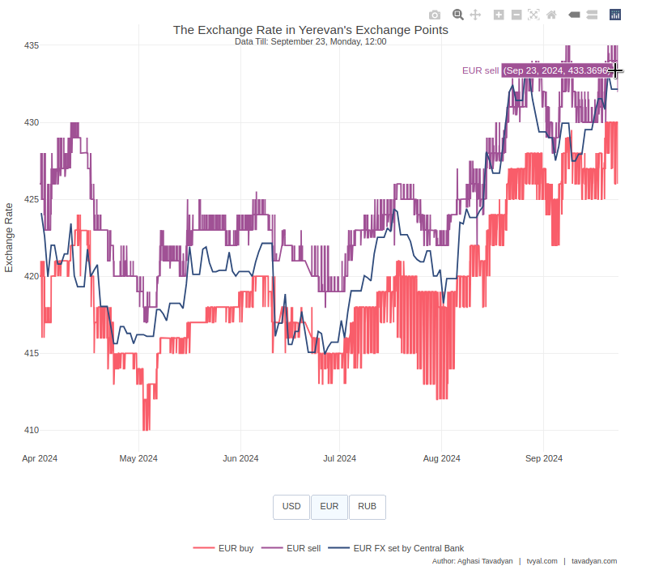

```{r setup, include=FALSE}
knitr::opts_chunk$set(echo = FALSE)

library(tidyverse)
library(scales)
library(plotly)

# rm(list = ls()); gc()

setwd(dirname(rstudioapi::getActiveDocumentContext()$path))

source("../../initial_setup.R")

```


```{r make exchange plotly chart, include=FALSE}

exchange_ponts_data <- read_csv("exchange_points_FX.csv")
CBA_FX <- read_csv("CBA_FX.csv")

exchange_plot_interactive <- function(cut_off_date = "2024-04-01") {
  
  exchange_data <- exchange_ponts_data |>
    filter(date >= ymd(cut_off_date)) |> 
    relocate(date, FX, possition, value)
  
  CBA_data <- CBA_FX |>
    filter(date >= ymd(cut_off_date)) |>
    mutate(
      possition = "FX set by Central Bank",
      date = ymd_h(paste(date, "12"))
    ) |> 
    rename(FX = FX_ISO, value = AMD) |> 
    relocate(date, FX, possition, value)
  
  data <- bind_rows(exchange_data, CBA_data)
  
  Sys.setlocale("LC_TIME", "en_US.UTF-8")
  
  subtitle <- 
    data |> 
    filter(date == max(date, na.rm = TRUE)) |>
    pull(date) |> 
    unique() |> 
    format("Data Till: %B %d, %A, %H:%M")
  
  plotly_data <- data |>
    pivot_wider(names_from = c(FX, possition), values_from = value) |> 
    fill(contains("Կենտրոնական"), .direction = "down")
  
  currency_order <- c("USD", "EUR", "RUB")
  positions <- c("buy", "sell", "FX set by Central Bank")
  
  # Create the plot
  fig <- plot_ly(plotly_data, x = ~date)
  
  # Add traces for each combination of FX and position
  for (fx in currency_order) {
    for (pos in positions) {
      column_name <- paste(fx, pos, sep = "_")
      if (fx == "USD") {
        fig <- fig |> add_lines(
          y = as.formula(paste0("~`", column_name, "`")),
          name = paste(fx, pos),
          line = list(color = case_when(
            pos == "buy" ~ new_palette_colors[6],
            pos == "sell" ~ new_palette_colors[4],
            TRUE ~ new_palette_colors[2]
          ))
        )
      } else {
        fig <- fig |> add_lines(
          y = as.formula(paste0("~`", column_name, "`")),
          name = paste(fx, pos),
          visible = FALSE,
          line = list(color = case_when(
            pos == "buy" ~ new_palette_colors[6],
            pos == "sell" ~ new_palette_colors[4],
            TRUE ~ new_palette_colors[2]
          ))
        )
      }
    }
  }
  
  # Generate button list
  generate_button_list <- function(currencies) {
    button_list <- list()
    
    for (i in seq_along(currencies)) {
      visible_values <- rep(FALSE, length(currencies) * length(positions))
      visible_values[((i-1)*length(positions)+1):(i*length(positions))] <- TRUE
      
      button <- list(
        method = "restyle",
        args = list("visible", visible_values),
        label = currencies[i]
      )
      
      button_list[[i]] <- button
    }
    
    return(button_list)
  }
  
  # Add layout
  fig <- fig |> layout(
    title = list(
      text = paste0("The Exchange Rate in Yerevan's Exchange Points<br>", 
                    "<sup>", subtitle, "</sup>"),
      y = 0.95
    ),
    yaxis = list(title = "Exchange Rate"),
    xaxis = list(title = ""),
    showlegend = TRUE,
    legend = list(orientation = "h", y = -0.2, x = 0.5, xanchor = "center"),
    updatemenus = list(
      list(
        y = -0.1,
        x = 0.5,
        xanchor = "center",
        yanchor = "top",
        direction = "right",
        type = "buttons",
        buttons = generate_button_list(currency_order)
      )
    ),
    annotations = list(
      list(
        x = 1,
        y = -0.27,
        xref = "paper",
        yref = "paper",
        text = caption_f(language = "eng"),
        showarrow = FALSE,
        xanchor = "right",
        yanchor = "auto",
        xshift = 0,
        yshift = 0,
        font = list(size = 10)
      )
    ),
    margin = list(b = 150)  # Increase bottom margin to accommodate buttons, legend, and caption
  )
  
  return(fig)
}

```


***English summary below.***

Հարգելի գործընկեր,

Հուսով եմ՝ լավ եք: 
Ներկայացնում եմ այս շաբաթվա վերլուծությունները և աշխատանքները.


## [🔢💡🔬 tvyal-ների հորիզոն](https://www.tvyal.com/newsletter/2024/2024_09_23)


Այս շաբաթվա նյութը աշխատանքի ընթացքում պահանջեց հավելյալ աշխատաժամանակ, այդ իսկ պատճառով մեր թիմը որոշեց հետաձգել դրա հրապարակումը։

Նշեմ, որ մոտակա ամսվա ընթացքում մենք պլանավորում ենք ուսումնասիրել հետևյալ թեմաները․

1. Բենզինի գնի ուսումնասիրություն,
2. Երևանում և մարզերում բնակարանների գների ուսումնասիրություն և դրանց կանխատեսում,
3. ՀՀ արդյունաբերության ուսումնասիրություն ըստ ճյուղերի,
4. Կանդրադառնանք նաև գնաճի որոշ հատվածներին։

Սպասեք այս վերլուծություններին։

## *Ապագա պլաններ*

Մեր թիմը նպատակադրված է առաջիկա տարվա ընթացքում հասնել հետևյալ նպատակներին․

1. [tvyal.com](https://www.tvyal.com/) հարթակը պլանավորում ենք դարձնել բոլոր հայկական (և ոչ միայն) տվյալների նորմալիզացված պորտալը, որտեղ հիմնականում անվճար նորմալիզացված տվյալներ հնարավոր կլինի ներբեռնել նաև API-ով, որը հետագայում հասանելի կլինի JS, Python, R և այլ լեզուների գրադարաններում։ Նշեմ, որ Armstat, CBA, cadastre.am և այլ պորտալների կողմից տրամադրվող տվյալները խառն են և չունեն ստանդարտիզացված կառուցվածք, տվյալներից շատերը PDF ֆորմատով են կամ ամսական տրվող առանձին աղյուսակներում, որոնք անհրաժեշտ է մաքրել և միավորել ժամանակային շարք ստանալու համար։ Բոլոր տվյալները պետք է ունենան նորմալիզացված, մաքուր տեսք, որտեղ․
   * յուրաքանչյուր փոփոխական կամ բնորոշիչ պետք է ներկայացված լինի սյունակում։
   * յուրաքանչյուր սյունակում պետք է ներկայացված լինեն մեկ տեսակի տվյալ կամ մեկ տեսակի չափման միավոր
   * յուրաքանչյուր տող պետք է լինի առանձին դիտարկում
   * յուրաքանչյուր արժեք պետք է ունենա իր սեփական տեղը
   
* Նշենք, որ [tvyal.com](https://www.tvyal.com/) հարթակն իր գործունեությամբ արդեն իսկ այդ տվյալներից շատերի ավտոմատիզացված ներբեռնումը, մաքրումը և նորմալիզացված տվյալների բազա ստեղծելը կատարել է։ Տվյալների 70-90 տոկոսը հարթակում անվճար է լինելու։

2. Պլանավորվում է շարունակել շաբաթական անվճար վերլուծությունները։ Սակայն ապագայում դրվելու է վերլուծության հիմնական մասը։ Որոշ զգայուն վերլուծություններ կամ վերլուծությունների ավելի խորը ներկայացումը վճարովի է լինելու։ Ամենայն հավանականությամբ գրանցումով ու ամսական վճարով, որը նաև ներառելու է նախորդ կետում նշած բոլոր տվյալներից API-ով օգտվելու հնարավորությունը։

3. Պլանների մեջ կա նաև փոխարժեքի տվյալների լիարժեք ներկայացումը։ Արդեն 6 ամիս է, ինչ մենք ավտոմատիզացված ստանում ենք այդ տվյալները։ Պլանավորվում է գրաֆիկական ներկայացում դնել փոխարժեքի վերջին բոլոր տվյալների։

```{r, echo=FALSE, warning=FALSE, fig.width = 9, fig.height = 8}
exchange_plot_interactive()
```

<!-- [](https://www.tvyal.com/newsletter/2024/2024_09_23) -->

<!-- ***սեղմեք նկարի վրա ինտերակտիվ դեմոյի համար*** -->

4. Պլանավորվում է մեծացնել ստորաբաժանումը, որը զբաղված կլինի հայկական ու այլ պետությունների կազմակերպությունների տվյալների մշակմամբ, համակարգմամբ, դրանցից արժեք քաղելով, ավտոմատիզացմամբ, կանխատեսմամբ և այլն։

Այս ամենի համար անհրաժեշտ է tvyal.com կայքը զրոյից հավաքել, քանզի այն համակարգը որով այն հավաքած է արդեն սահմանափակ է մեր այսօրվա պահանջների համար։

Եթե այս ամենը հետաքրքրում է, ուզում եք աջակցել մեզ կամ կարծում եք, որ մեր թիմը ձեզ կարող է օգտակար լինել, ապա գրեք մեզ [a@tavadyan.com](mailto:a@tavadyan.com?subject=Let's Put Data to Work!) հասցեով:

Մինչ այդ կարող եք ծանոթանալ մեր [նախորդ վերլուծություններին](https://www.tvyal.com/newsletter)։

- [💸🔚🏦 Կապիտալի ներհոսքից մինչև արտահոսք. Հայաստանի տնտեսական հրաշքի ներքին խոհանոցը](https://www.tvyal.com/newsletter/2024/2024_09_16)
- [🔌⚡🇦🇲 էլեկտրիկ Հայաստան․ Ցանցի խոցելիությունից մինչև արևային հեռանկարներ](https://www.tvyal.com/newsletter/2024/2024_09_09)
- [💎🎭🔮️ Ոսկե Պատրանք. Հայաստանի արտահանման իրական պատկերը](https://www.tvyal.com/newsletter/2024/2024_09_02)
- [🐅🌆💸 Հայաստան` Կովկասի վագր, թե՞ թանկ երազանք](https://www.tvyal.com/newsletter/2024/2024_08_26)
- [🆘🇦🇲🧑🏼‍💻 SOS ՀՀ ՏՏ․ Վայրիվերում ոլորտում](https://www.tvyal.com/newsletter/2024/2024_08_19)
- [👛💨💰 Դատարկ գրպաններ, բարձր աշխատավարձր](https://www.tvyal.com/newsletter/2024/2024_08_12)
- [🧮⏳🎲 Հայաստանը հարկում է ժամանակը․ Խաղ տնտեսական աճի հետ](https://www.tvyal.com/newsletter/2024/2024_08_02)
- [🇷🇺💰🇦🇲 Հայաստան` ռուսական ոսկու հանգրվան](https://www.tvyal.com/newsletter/2024/2024_07_05)
- [💰🚧⚖️ Պետական պարտքի ճոճանակ․ Առաջին անգամ ներքին պարտքը գերազանցում է արտաքինը](https://www.tvyal.com/newsletter/2024/2024_06_28)
- [🌅🏖🌄 Սահմանից այն կողմ․ Հայաստանի տուրիստական աճը և հնարավոր անկումը](https://www.tvyal.com/newsletter/2024/2024_06_17)
- [💹🎏🏦 Վարկի տակ․ Վարկավորման միտումները ըստ ճյուղերի](https://www.tvyal.com/newsletter/2024/2024_06_07)
- [🤒🟨♻️ Ոսկու տենդի շարունակություն. Հայաստանի արտահանման 75%-ը ոսկի և ադամանդ է](https://www.tvyal.com/newsletter/2024/2024_05_11)
- [💼✈🥶️ Հայաստանի հյուրընկալության սառչում․ Ծառայությունների արտահանման ուսումնասիրություն](https://www.tvyal.com/newsletter/2024/2024_04_26)
- [👫🧭💀 Հայաստանում 2 մլն հայ 2100 թվականին](https://www.tvyal.com/newsletter/2024/2024_04_19)
- [💵🪙🎭 Դրամի դրամա․ Ինչո՞ւ է արժեզրկվում և արժևորվում դրամը](https://www.tvyal.com/newsletter/2024/2024_04_05)
- [🚜🌾📉 10 տարվա գյուղատնտեսության կոլափսը](https://www.tvyal.com/newsletter/2024/2024_03_15)
- [💹💳 Մասնավոր աշխատատեղերի 76 տոկոսը Երևանում է](https://www.tvyal.com/newsletter/2024/2024_02_09)
- [👨‍👩‍👧‍👦✨ Ամուր ընտանիք․ հարուստ ընտանիք](https://www.tvyal.com/newsletter/2024/2024_01_26)
- [🚗💨 Հայաստանի "ավտոարտադրության" մահը](https://www.tvyal.com/newsletter/2024/2024_01_19)
- [💲🏙️ Երևանը Մոսկվայից ավելի թանկ է](https://www.tvyal.com/newsletter/2024/2024_01_12)
- [🏠💰📉 Տնային տնտեսությունները աղքատացել են](https://www.tvyal.com/newsletter/2024/2024_01_07)


-----

# ՀԱՄԱԳՈՐԾԱԿՑՈՒԹՅՈՒՆ

<style>
.ai-services-banner-tvyal {
background-color: #0a192f;
color: #e6f1ff;
padding: 30px;
font-family: Arial, sans-serif;
border-radius: 10px;
box-shadow: 0 4px 6px rgba(0, 0, 0, 0.1);
position: relative;
overflow: hidden;
min-height: 400px;
display: flex;
flex-direction: column;
justify-content: center;
}
.ai-services-banner-tvyal::before {
content: '';
position: absolute;
top: -25%;
left: -25%;
right: -25%;
bottom: -25%;
background: repeating-radial-gradient(
circle at 50% 50%,
rgba(100, 255, 218, 0.1),
rgba(100, 255, 218, 0.1) 15px,
transparent 15px,
transparent 30px
);
animation: gaussianWaveTvyal 10s infinite alternate;
opacity: 0.3;
z-index: 0;
}
@keyframes gaussianWaveTvyal {
0% {
transform: scale(1.5) rotate(0deg);
opacity: 0.2;
}
50% {
transform: scale(2.25) rotate(180deg);
opacity: 0.5;
}
100% {
transform: scale(1.5) rotate(360deg);
opacity: 0.2;
}
}
.ai-services-banner-tvyal > * {
position: relative;
z-index: 1;
}
.ai-services-banner-tvyal h2,
.ai-services-banner-tvyal h3 {
margin-bottom: 20px;
color: #ccd6f6;
}
.ai-services-banner-tvyal ul {
margin-bottom: 30px;
padding-left: 20px;
}
.ai-services-banner-tvyal li {
margin-bottom: 10px;
}
.ai-services-banner-tvyal a {
color: #64ffda;
text-decoration: none;
transition: color 0.3s ease;
}
.ai-services-banner-tvyal a:hover {
color: #ffd700;
text-decoration: underline;
}
</style>

<div class="ai-services-banner-tvyal">
## [Եթե ուզում եք  AI գործիքներով ձեր տվյալներից օգուտ քաղել` ԴԻՄԵՔ ՄԵԶ](mailto:a@tavadyan.com?subject=Let's Put Data to Work!)

### Մենք առաջարկում ենք

- Extensive databases for finding both international and local leads
- Exclusive reports on the Future of the Armenian Economy
- Work and browser automation to streamline operations and reduce staffing needs
- AI models for forecasting growth and optimizing various aspects of your business
- Advanced dashboarding and BI solutions
- Algorithmic trading

### [Let's Put Your Data to Work!](mailto:a@tavadyan.com?subject=Let's Put Data to Work!)

### [ՄԻԱՑԵՔ ՄԵՐ ԹԻՄԻՆ](mailto:a@tavadyan.com?subject=Work application)
</div>


-----


## English Summary

### 🔢💡🔬 Data Horizons 

Our team has postponed this week's publication due to additional time requirements. In the coming month, we plan to analyze gasoline prices, housing prices in Yerevan and the regions, Armenia's industrial sectors, and address certain aspects of inflation. These analyses will be presented as part of our weekly free publications.

Future plans include transforming [tvyal.com](https://www.tvyal.com/) into a normalized portal for Armenian and other data, with API accessibility. We aim to improve data quality and availability, expand our range of analyses, including comprehensive presentation of exchange rate data, and grow our team to process and analyze a wider scope of data. We encourage interested parties to contact us at [a@tavadyan.com](mailto:a@tavadyan.com).


---


Հարգանքներով,            
Աղասի Թավադյան         
23.09.2024          
[tvyal.com](https://www.tvyal.com/)      
[tavadyan.com](https://www.tavadyan.com/)

---

[Was this email forwarded to you? Subscribe here.](https://www.tvyal.com/subscribe)

[Բաժանորդագրվեք](https://www.tvyal.com/subscribe)

       
---              
               


####### **Ուշադրություն. Ձեր էլ.փոստը մեյլլիսթի մեջ է, որի միջոցով ես կիսվում եմ շաբաթական նյութեր, որոնք հիմնականում ներկայացնում են Հայաստանի տնտեսությունը: Նյութերը ներառում են գծապատկերներ, [տվյալների բազաներ](https://github.com/tavad/tvyal_newsletter), տեսանյութեր, հոդվածներ, [առցանց վահանակներ](https://www.tvyal.com/projects), տնտեսական գործիքներ, կանխատեսումներ և հաշվետվություններ: Եթե ցանկանում եք չեղարկել բաժանորդագրությունը, խնդրում եմ տեղեկացրեք ինձ, և ես կհեռացնեմ ձեր էլ. փոստը ցուցակից: Գրեք նաև եթե ունեք մենկնաբանություններ:**

####### **Important! Your email is part of the mailing list where I share weekly materials primarily focused on the Armenian economy. These materials encompass charts, [databases](https://github.com/tavad/tvyal_newsletter), videos, articles, [online dashboards](https://www.tvyal.com/projects), economic tools, forecasts, and reports. If you wish to unsubscribe, please let me know, and I will remove your email from the list. Please share your comments as well․**


