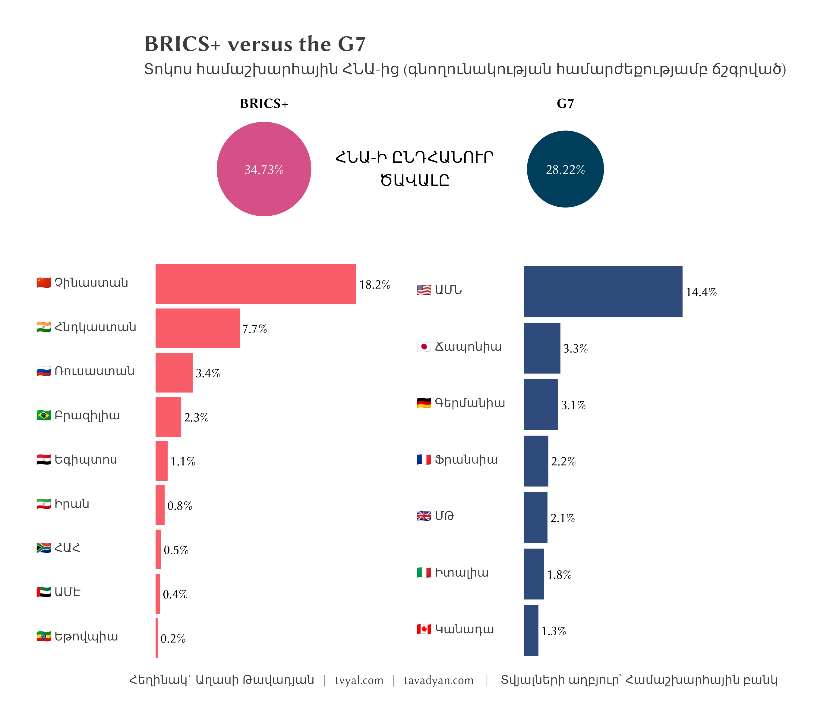
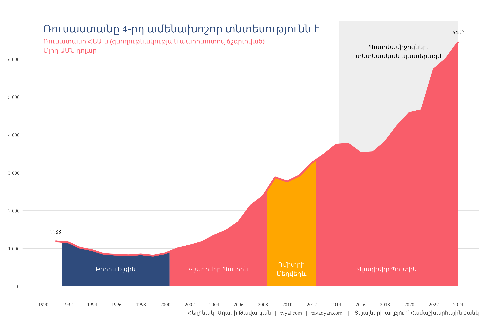
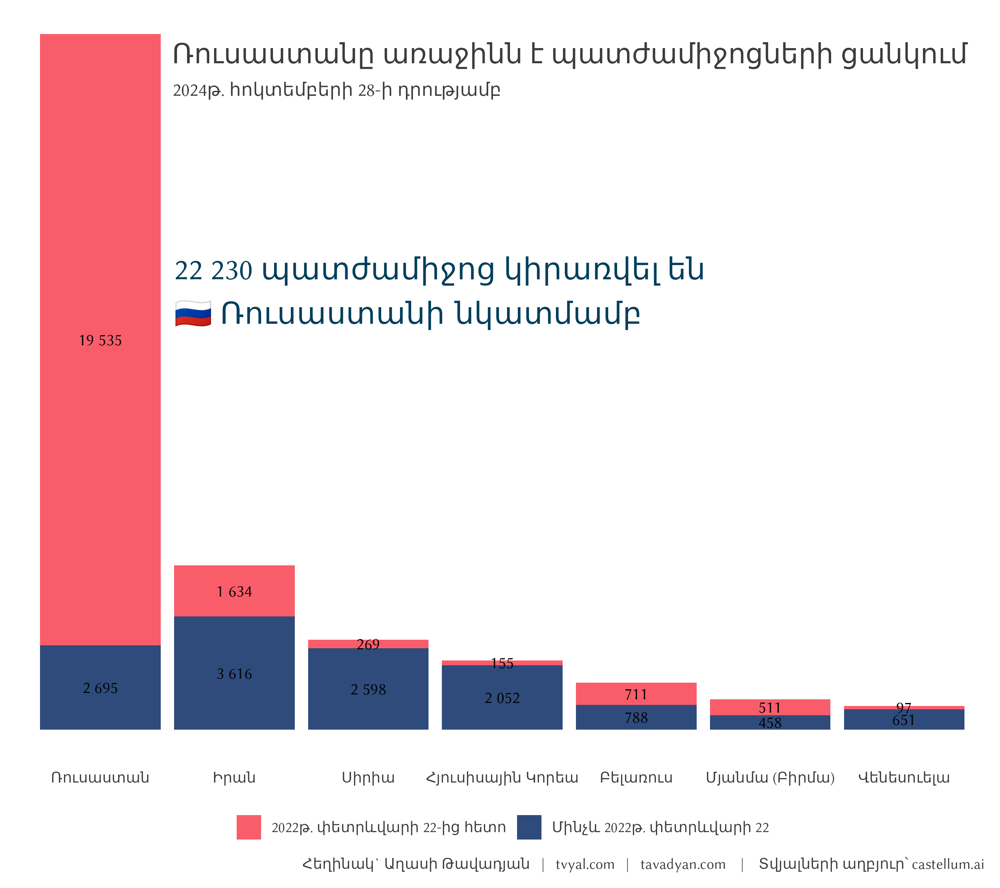
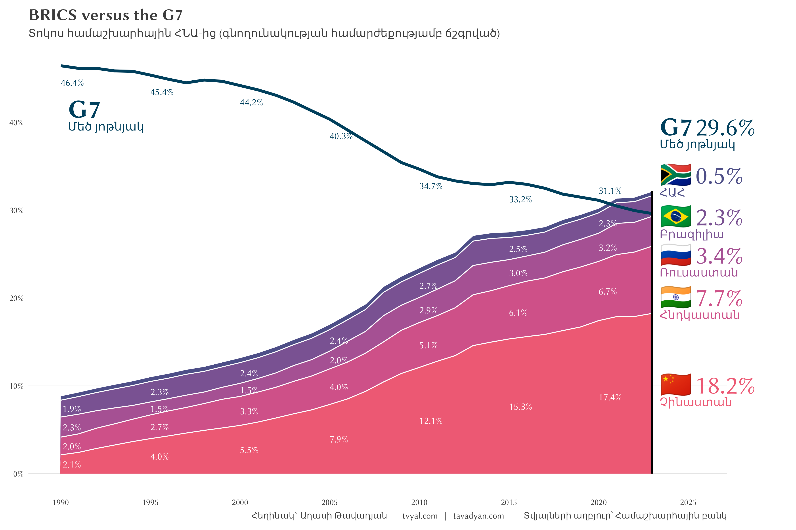
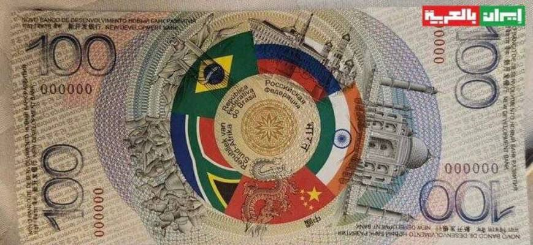

```{r setup, include=FALSE}
knitr::opts_chunk$set(echo = FALSE)

library(tidyverse)
library(scales)
library(RcppRoll)
library(rvest)
library(WDI)
library(janitor)
library(zoo)
library(countrycode)
library(tidytext)
library(ggtext)
library(patchwork)

# rm(list = ls()); gc()

setwd(dirname(rstudioapi::getActiveDocumentContext()$path))

source("../../initial_setup.R")

```


```{r get raw data download, include=FALSE}

# # uncomment below code to update databses
# gdp_ppp <- 
#   WDI(indicator = "NY.GDP.MKTP.PP.CD", start = 1990) |>
#   # WDI(indicator = "NY.GDP.MKTP.CD") |>  
#   as_tibble() |> 
#   rename(gdp_ppp = 5)
# 
# gdp_ppp |> write_csv("gdp_ppp.csv")

gdp_ppp <- read_csv("gdp_ppp.csv")

```


```{r russia president gdp plot, include=FALSE}

russia_presidents <- 
  read_html("https://en.wikipedia.org/wiki/List_of_presidents_of_Russia") |> 
  html_elements("table") |> 
  html_table()

russia_presidents <- 
  russia_presidents[[2]] |> 
  janitor::row_to_names(row_number = 1) |> 
  janitor::clean_names() |> 
  select(president, term_of_office) |> 
  unique() |> 
  extract(
    president, into = c("president_eng", "president_rus"),
    regex = "([a-zA-Z ]+)([а-яА-Я ]+).+"
  ) |> 
  extract(
    term_of_office, into = c("start", "end"),
    regex = "([a-zA-Z0-9 ]+) – ([a-zA-Z0-9 ]+).+"
  ) |> 
  mutate(
    start = dmy(start),
    end = lead(start) - days(1),
    president_number = as.character(row_number())
  ) |> 
  pivot_longer(c(start, end), values_to = "date") |> 
  filter(!is.na(date))

sanction_date = as.Date("2014-03-26")

gdp_ppp_ceiling <- 
  gdp_ppp |> 
  filter(iso3c == "RUS") |> 
  filter(gdp_ppp == max(gdp_ppp)) |> 
  mutate(gdp_ppp = ceiling(gdp_ppp/1e12) * 1000) |> 
  pull(gdp_ppp)
  

Russia_GDP_plot_data <- 
  gdp_ppp |> 
  filter(iso3c == "RUS") |> 
  mutate(date = ym(paste(year, 12)) + months(1) - days(1)) |> 
  select(gdp_ppp, date) |> 
  bind_rows(
    tibble(date = sanction_date)
  ) |> 
  full_join(russia_presidents, join_by(date)) |> 
  arrange(date) |> 
  fill(contains("president"), .direction = "down") |> 
  mutate(
    gdp_ppp = na.approx(gdp_ppp, x = date, na.rm = FALSE),
    gdp_ppp = gdp_ppp / 1e9,
    max_min_value = ifelse(date == max(date) | date == min(date), gdp_ppp, NA),
    max_min_value = number(max_min_value, accuracy = 1, big.mark = ""),
    sanctions = ifelse(date >= sanction_date, gdp_ppp_ceiling - gdp_ppp, NA)
  ) |> 
  filter(!is.na(gdp_ppp)) |> 
  select(-name)


plot_text <- 
  russia_presidents |> 
  pivot_wider(values_from = date) |> 
  bind_rows(
    tibble(
      president_eng = "Sanctions,\neconomic war",
      president_rus = "Санкции,\nэкономическая война",
      start = sanction_date
    )
  ) |> 
  mutate(
    end = ifelse(
      is.na(end),
      Russia_GDP_plot_data |>
        slice_max(date) |>
        pull(date),
      end
    ),
    start = as.numeric(start),
    date_middle = (start + end)/2,
    date_middle = as.Date(date_middle),
    y = ifelse(!grepl("Sanctions", president_eng), 450, 6200)
  ) |> 
  transmute(
    date = date_middle, y, 
    president_eng = ifelse(
      grepl("Medvedev", president_eng),
      str_replace(president_eng, " ", "\n"), 
      president_eng
    )
  ) |> 
  mutate(
    president_eng = case_when(
      grepl("Yeltsin", president_eng) ~ "Բորիս Ելցին",
      grepl("Medvedev", president_eng) ~ "Դմիտրի\nՄեդվեդև",  
      grepl("Putin", president_eng) ~ "Վլադիմիր Պուտին",   
      grepl("Sanctions", president_eng) ~ "Պատժամիջոցներ,\nտնտեսական պատերազմ",  
    )
  )

plot_russia_president_gdp <- 
  Russia_GDP_plot_data |> 
  ggplot(aes(date, gdp_ppp)) +
  geom_area(
    data =  Russia_GDP_plot_data |> 
      pivot_longer(c(sanctions, gdp_ppp), values_to = "gdp_ppp") |> 
      mutate(
        president_number = ifelse(name == "sanctions", 3.5, president_number),
      ),
    mapping = aes(fill = president_number),
    alpha = 1
  ) +
  geom_text(aes(y = gdp_ppp + max(gdp_ppp) * 0.04, label = max_min_value)) +
  geom_text(
    data = plot_text,
    mapping = aes(date, y, label = president_eng, color = ifelse(y == max(y), "black", "white"))
  ) +
  geom_line(color = new_palette_colors[6], alpha = 1, linewidth = 1.5) +
  scale_x_date(
    date_breaks = "2 years", date_labels = "%Y",
    limits = c(as.Date("1990-01-01"), as.Date("2024-01-01"))
  ) +
  geom_text(
    data = tibble(x = ymd("1990-01-01"), y = 6800, label = "Ռուսաստանը 4-րդ ամենախոշոր տնտեսությունն է", color = "d"),
    aes(x, y, label = label),
    hjust = 0, size = 6.5, alpha = 1,
    color = new_palette_colors[2], fontface = "bold"
  ) +
  geom_text(
    data = tibble(x = ymd("1990-01-01"), y = 6350, label = "Ռուսատանի ՀՆԱ-ն (գնողութնակության պարիտոտով ճշգրտված)\nՄլրդ ԱՄՆ դոլար", color = "d"),
    aes(x, y, label = label),
    hjust = 0, size = 4, alpha = 1,
    color = new_palette_colors[6], fontface = "bold"
  ) +
  # scale_y_log10() +
  scale_y_continuous(breaks = seq(0, 6e3, 1e3), labels = number_format()) +
  scale_fill_manual(
    values = c(new_palette_colors[c(2,6,8)], "#eeeeee", new_palette_colors[6])
  ) +
  scale_color_manual(values = c("black", "white")) +
  labs(
    x = NULL, y = NULL,
    # title = "Ռուսաստանը 4-րդ ամենախոշոր տնտեսությունն է",
    # subtitle = "Ռուսատանի ՀՆԱ-ն (գնողութնակության պարիտոտով ճշգրտված)\nՄլրդ ԱՄՆ դոլար",
    caption = caption_f(language = "arm", source = "Համաշխարհային բանկ"),
  ) +
  theme(
    legend.position = "drop",
    panel.grid.major.x = element_blank(),
    panel.grid.major.y = element_line(
      colour = "gray", linewidth = 0.1,
      linetype = 1
    )
  )

```


```{r data manipulations, include=FALSE}
g7_countries <- c("CA", "FR", "DE", "IT", "JP", "GB", "US")
brics_countries <- c("BR", "RU", "IN", "CN", "ZA")
new_brics_countries <-  c("EG", "ET", "IR", "AE")
brics_potential <- c("AO", "BF", "CM", "CF", "CG", "CD", "GQ", "GH", "LY", "ML", "NG", "SN", "SS", "SD", "TN", "UG", "ZW", "BO", "CO", "CU", "SV", "NI", "PE", "VE", "AF", "AZ", "BH", "BD", "ID", "IQ", "KZ", "KW", "LA", "MY", "MM", "PK", "PS", "SA", "LK", "SY", "TH", "TR", "VN", "YE", "BY", "RS")


members <- 
  read_html("https://en.wikipedia.org/wiki/Member_states_of_BRICS#Countries_that_have_applied_for_membership") |> 
  html_elements("table") |> 
  html_table()

brics_applicants <- 
  members[[2]] |> 
  mutate(iso2c = countrycode(Country, origin = 'country.name', destination = 'iso2c')) |> 
  pull(iso2c)

valid_countries <- 
  countrycode::codelist |> 
  filter(!is.na(iso2c)) |> 
  pull(iso2c)


iso_to_unicode_flag <- function(iso2c) {
  sapply(iso2c, function(code) {
    if (is.na(code)) return(NA)
    paste0(
      intToUtf8(127462L + which(LETTERS == substr(code, 1, 1)) - 1L),
      intToUtf8(127462L + which(LETTERS == substr(code, 2, 2)) - 1L)
    )
  })
}

gdp_ppp_plot_data <- 
  gdp_ppp |> 
  filter(iso2c %in% valid_countries) |> 
  mutate(
    block = case_when(
      iso2c %in% g7_countries ~ "G7 countries",
      iso2c %in% brics_countries ~ "BRICS",
      iso2c %in% new_brics_countries ~ "BRICS+",
      iso2c %in% brics_potential ~ "Potential BRICS+ members",
      TRUE ~ "Other Countries"
    )
  ) |> 
  group_by(year, block) |> 
  summarise(
    gdp_ppp = sum(gdp_ppp, na.rm = TRUE),
    .groups = "drop"
  ) |> 
  filter(gdp_ppp != 0) |> 
  group_by(year) |> 
  mutate(
    pct = gdp_ppp / sum(gdp_ppp)
  ) |> 
  ungroup() |> 
  mutate(
    pct_text = ifelse(
      year %% 5 == 0 | year == max(year),
      percent(pct, accuracy = 0.1),
      NA
    ) 
  )


gdp_ppp_flag_db <- 
  gdp_ppp |> 
  filter(iso2c %in% valid_countries) |> 
  mutate(
     block = case_when(
      iso2c %in% g7_countries ~ "G7 countries",
      iso2c %in% brics_countries ~ "BRICS",
      iso2c %in% new_brics_countries ~ "BRICS+",
      iso2c %in% brics_potential ~ "Potential BRICS+ members",
      TRUE ~ "Other Countries"
    ),
    estimate = ifelse(is.na(gdp_ppp), "estimated", ""),
    flag_unicode = iso_to_unicode_flag(iso2c),
    # country = countrycode(iso2c, origin = 'iso2c', destination = 'country.name'),
    country = countrycode(iso2c, origin = 'iso2c', destination = 'cldr.short.hy')
  ) |> 
  arrange(iso3c, year) |> 
  fill(gdp_ppp, .direction = "down") |> 
  group_by(year) |> 
  mutate(
    pct = gdp_ppp / sum(gdp_ppp, na.rm = TRUE),
    block = fct_reorder(block, gdp_ppp)
  ) |> 
  ungroup()

```


```{r BRICS plot 1, include=FALSE}

circles_plot <- 
  gdp_ppp_flag_db |> 
  filter(
    block %in% c("BRICS", "BRICS+", "G7 countries"),
    year == max(year)
  ) |> 
  mutate(block = ifelse(grepl("BRICS", block), "BRICS+", "G7")) %>%
  group_by(block) |> 
  summarise(total_pct = sum(pct)) |> 
  ggplot(aes(x = c(0.85,2), y = 1)) +
  geom_point(aes(size = total_pct, color = block), shape = 16, alpha = 1) +
  geom_text(
    aes(label = percent(total_pct, accuracy = 0.01)),
    # position = position_nudge(y = 0.2),
    size = 4, color = "white"
  ) +
  geom_text(
    aes(label = block),
    position = position_nudge(y = 1.7),
    size = 4, fontface = "bold"
  ) +
  geom_text(
    data = tibble(x = 1.425, y = 1, label = "ՀՆԱ-Ի ԸՆԴՀԱՆՈՒՐ\nԾԱՎԱԼԸ"),
    aes(x, y, label = label),
    size = 4.5, fontface = "bold"
  ) +
  scale_x_continuous(limits = c(0.5, 2.7)) +
  scale_y_continuous(limits = c(-0.1, 3)) +
  scale_size_continuous(range = c(28.4, 34.95)) +
  scale_color_manual(values = new_palette_colors[c(5, 1)]) +
  labs(
    x = NULL, y = NULL,
    title = "BRICS+ versus the G7",
    subtitle = "Տոկոս համաշխարհային ՀՆԱ-ից (գնողունակության համարժեքությամբ ճշգրված)",
  )  +
  theme(
    legend.position = "none",
    panel.grid.major.y = element_blank(),
    panel.grid.major.x = element_blank(),
    axis.text.x = element_blank(),
    axis.text.y = element_blank(),
  )

main_plot <-
  gdp_ppp_flag_db |> 
  filter(
    block %in% c("BRICS", "BRICS+", "G7 countries"),
    year == max(year)
  ) |> 
  mutate(
    block = ifelse(grepl("BRICS", block), "BRICS+", "G7"),
    country = case_when(
      country == "Հարավաֆրիկյան Հանրապետություն" ~ "ՀԱՀ",
      country == "Արաբական Միացյալ Էմիրություններ" ~ "ԱՄԷ",
      TRUE ~ country
    ),
    country = paste(flag_unicode, country),
    country = reorder_within(country, pct, block),
  ) |> 
  ggplot(aes(pct, country)) +
  geom_col(aes(fill = block), alpha = 1) +
  geom_text(aes(label = percent(pct, accuracy = 0.1)), hjust = -0.1) +
  facet_wrap(~block, scales = "free_y") +
  scale_x_continuous(limits = c(0, 0.22)) +
  scale_y_reordered() +
  scale_fill_manual(values = new_palette_colors[c(6,2)]) +
  labs(
    x = NULL,
    y = NULL,
    caption = caption_f("Համաշխարհային բանկ")
  ) +
  theme(
    panel.grid.major.y = element_blank(),
    panel.grid.major.x = element_blank(),
    legend.position = "none",
    axis.text.x = element_blank(),
    axis.text.y = element_markdown(hjust = 0),
    strip.text = element_blank(),
  )

# Combine the plots
plot_brics_1 <- circles_plot / main_plot +
  plot_layout(heights = c(1.3, 4))
```


```{r BRICS plot 2, include=FALSE}

plot_data_1 <- 
  gdp_ppp_flag_db |> 
  filter(
    block %in% c("BRICS"),
    year >= 1990
  ) |> 
  mutate(
    country = ifelse(country == "Հարավաֆրիկյան Հանրապետություն", "ՀԱՀ", country),
    country = fct_reorder(country, pct),
    pct_text = ifelse(year %% 5 == 0 & iso2c != "ZA", pct, NA),
    pct_text = percent(pct_text, accuracy = 0.1),
  )

plot_data_2 <-
  # gdp_ppp_flag_db |> 
  # filter(
  #   block %in% c("G7 countries"),
  #   year >= 1990
  # ) |> 
  # group_by(year) |> 
  # summarise(pct = sum(pct, na.rm = TRUE), .groups = "drop")
  gdp_ppp_plot_data |> 
  filter(block == "G7 countries",  year >= 1990) |> 
  mutate(
    pct_text = ifelse(year %% 5 == 0, pct, NA),
    pct_text = percent(pct_text, accuracy = 0.1),
  ) |> 
  select(year, pct, pct_text)


g7_pct <- plot_data_2 |> filter(year == max(year)) |> pull(pct) |> percent(accuracy = 0.1)

plot_data_3 <- 
  plot_data_1 |> 
  filter(year == max(year)) |> 
  arrange(desc(country)) |> 
  mutate(
    pct_text = percent(pct, accuracy = 0.1),
    pct2 = ifelse(pct == max(pct), pct / 2, (pct + lag(pct)) / 2),
    pct = cumsum(pct2),
    pct = case_when(
      iso2c %in% c("IN") ~ pct - 0.03,
      iso2c %in% c("RU") ~ pct - 0.037,
      iso2c %in% c("BR") ~ pct - 0.022,
      iso2c %in% c("ZA") ~ pct + 0.011,
      TRUE ~ pct
    )
  ) |> 
  bind_rows(
    tibble(
      country = "Մեծ յոթնյակ", flag_unicode = "G7", year = c(1990, 2023), pct = c(0.405, 0.385), pct_text = c("", g7_pct)
    )
  ) |> 
  mutate(
    country = fct_inorder(country) |> fct_rev()
  )


max_year = plot_data_1$year |> max()
ymax = plot_data_1 |> 
  filter(year == max(year)) |> 
  summarise(pct = sum(pct)) |> 
  pull(pct)

plot_brics_2 <-
  ggplot() +
  geom_area(
    data = plot_data_1,
    mapping = aes(year, pct, fill = country),
    color = "white",
    alpha = 1
  ) +
  geom_line(
    data = plot_data_2,
    mapping = aes(year, pct), color = new_palette_colors[1], size = 1.5, alpha = 1
  ) +
  geom_text(
    data = plot_data_2,
    mapping = aes(year, pct, label = pct_text, vjust = ifelse(year == 2020, -1, 3)),
    color = new_palette_colors[1], hjust = 0,
  ) +
  geom_text(
    data = plot_data_1,
    mapping = aes(
      year, pct, fill = country, label = pct_text, 
      hjust = ifelse(year == min(year), -0.1, 0)
    ),
    position = position_stack(vjust = 0.5), color = "white"
  ) +
  geom_text(
    data = plot_data_3,
    aes(year + 0.4, pct, color = country, label = flag_unicode),
    hjust = 0, vjust = 0, fontface = "bold", size = 10
  ) +
  geom_text(
    data = plot_data_3,
    aes(year + 0.4, pct, color = country, label = country),
    hjust = 0, vjust = 1.6, size = 4.5
  ) +
  geom_text(
    data = plot_data_3,
    aes(year + 2.4, pct, color = country, label = pct_text),
    hjust = 0, vjust = 0, size = 10
  ) +
  geom_segment(
    data = tibble(x = max_year, xend = max_year, y = 0, yend = ymax),
    mapping = aes(x, y, xend = xend, yend = yend),
    linewidth = 1, color = "black"
  ) +
  scale_x_continuous(breaks = seq(1990, 2025, 5)) +
  scale_y_continuous(n.breaks = 8, label = percent_format()) +
  scale_fill_manual(values = colfunc2(10)[3:7]) +
  scale_color_manual(values = c(new_palette_colors[1], colfunc2(10)[3:7])) +
  coord_cartesian(clip = "off") +
  labs(
    x = NULL,
    y = NULL,
    color = NULL,
    title = "BRICS versus the G7",
    subtitle = "Տոկոս համաշխարհային ՀՆԱ-ից (գնողունակության համարժեքությամբ ճշգրված)",
    # subtitleC = "ներկայացված եկամտային խմբերով",
    caption = caption_f("Համաշխարհային բանկ")
  ) +
  theme(
    panel.grid.major.x = element_blank(),
    panel.grid.major.y = element_line(
      colour = "gray", linewidth = 0.1,
      linetype = 1
    ),
    legend.position = "none",
    plot.margin = margin(10, 75, 10, 10)
  )

```

```{r russia sanctions plot, include=FALSE}

sanctions_tibble <- 
  tibble(
    iso2c = c("RU", "IR", "SY", "KP", "BY", "VE", "MM"),
    before_2022 = c(2695, 3616, 2598, 2052, 788, 651, 458),
    after_2022 = c(19535, 1634, 269, 155, 711, 97, 511)
  )

plot_russia_sunctions <- 
  sanctions_tibble |> 
  mutate(
    country_eng = countrycode(iso2c, origin = 'iso2c', destination = 'country.name'),
    country_arm = countrycode(iso2c, origin = 'iso2c', destination = 'cldr.short.hy')
  ) |> 
  pivot_longer(matches("\\d{4}")) |> 
  mutate(
    country_eng = fct_reorder(country_eng, value, .desc = TRUE),
    country_arm = fct_reorder(country_arm, value, .desc = TRUE),
  ) |> 
  ggplot(aes(country_arm, value, label = number(value, accuracy = 1))) +
  geom_col(aes(fill = name), alpha = 1) +
  geom_text(position = position_stack(vjust = 0.5)) +
  geom_text(
    data = tibble(
      x = 1.55, y = 14000, label = "22 230 պատժամիջոց կիրառվել են\n🇷🇺 Ռուսաստանի նկատմամբ"
    ),
    aes(x, y, label = label),
    hjust = 0, size = 7, color = new_palette_colors[1]
  ) +
  scale_fill_manual(
    values = new_palette_colors[c(6,2)],
    labels = c("2022թ․ փետրևվարի 22-ից հետո", "Մինչև 2022թ․ փետրևվարի 22")
  ) +
  labs(
    x = NULL,
    y = NULL,
    fill = NULL,
    title = "Ռուսաստանը առաջինն է պատժամիջոցների ցանկում",
    subtitle = "2024թ․ հոկտեմբերի 28-ի դրությամբ",
    caption = caption_f(source = "castellum.ai")
  ) +
  theme(
    panel.grid.major.x = element_blank(),
    panel.grid.major.y = element_blank(),
    axis.text.y = element_blank(),
    plot.title = element_text(vjust = -15, hjust = 0.9),
    plot.subtitle = element_text(vjust = -22, hjust = 0.24),
    plot.margin = margin(-40, 10, 10, 10)
  )

```


```{r save plots, include=FALSE}

ggsave("plots/plot_brics_1.png", plot_brics_1, width = 9, height = 8)
ggsave("plots/plot_brics_2.png", plot_brics_2, width = 12, height = 8)
ggsave("plots/plot_russia_president_gdp.png", plot_russia_president_gdp, width = 12, height = 8)
ggsave("plots/plot_russia_sunctions.png", plot_russia_sunctions, width = 9, height = 8)

```

***English summary below.***

Հարգելի գործընկեր,

Հուսով եմ՝ լավ եք: 
Ներկայացնում եմ այս շաբաթվա վերլուծությունները և աշխատանքները.

## [🇷🇺🔗🌍 ԲՐԻՔՍ, 22,000 պատժամիջոց և բլոկչեյն](https://www.tvyal.com/newsletter/2024/2024_10_28)

### Ինչպես է ընդլայնված ԲՐԻՔՍ+-ը վերաձևավորում համաշխարհային տնտեսական ճարտարապետությունը

> #### **Չնայած հսկայական պատժամիջոցներին, Ռուսաստանն այս պահին չորրորդ խոշորագույն տնտեսությունն է - ԱՄՀ**

Անցյալ շաբաթ Կազանի կոնգրեսների պալատում տեղի ունեցավ ԲՐԻՔՍ+ պետությունների հերթական գագաթնաժողովը։ ԲՐԻՔՍ-ի 16-րդ գագաթնաժողովը, որին մասնակցում էին աննախադեպ թվով՝ 37 պետությունների ղեկավարներ, ցույց տվեց, թե որքան խորն է փոխվում համաշխարհային տնտեսության ծանրության կենտրոնը։ Միասին վերցրած, այս առաջնորդները ներկայացնում են համաշխարհային ՀՆԱ-ի 46.9%-ը (2023թ․ գնողունակության համարժեքությամբ) և աշխարհի բնակչության 57.4%-ը։ Սակայն թվերը պատմության միայն մի մասն են արտացոլում։

Այս գագաթնաժողովով պայմանավորված մեր թիմը որոշեց այս շաբաթ ուսումնասիրել ԲՐԻՔՍ պետությունների և հատկապես Ռուսաստանի տնտեսական ներուժը։

Գծապատկեր 1



ԲՐԻՔՍ+ պետությունները 2023թ․ դրությամբ ապահովում են համաշխարհային ՀՆԱ-ի 34.73%-ը (գնողունակության համարժեքությամբ)՝ արդեն գերազանցելով G7 պետությունների ցուցանիշը՝ 28.22%։ Այս ցուցանիշն արտացոլում է համաշխարհային տնտեսական ուժերի հիմնարար վերադասավորումը։ Չինաստանը հանդիսանում է ԲՐԻՔՍ+ տնտեսական առաջատար անդամ՝ ապահովելով համաշխարհային ՀՆԱ-ի 18.2%-ը, մինչդեռ Հնդկաստանը՝ 7.7%-ը, իսկ Ռուսաստանը՝ 3.4%-ը։ Այս ցուցանիշները վկայում են 1990-ականների համեմատ տեղի ունեցած զգալի փոփոխության մասին, երբ G7 տնտեսությունները գերիշխում էին՝ ապահովելով համաշխարհային տնտեսության գրեթե կեսը՝ 46.4%։

Այս տարվա գագաթնաժողովն առանձնահատուկ է նաև ԲՐԻՔՍ-ի գործընկերության շրջանակի ընդլայնմամբ։ Տասներեք նոր երկրներ ստացան ԲՐԻՔՍ-ի գործընկեր երկրի կարգավիճակ, այդ թվում՝ ռազմավարական դիրք ունեցող տնտեսություններ, ինչպիսիք են Թուրքիան, Ինդոնեզիան և Սաուդյան Արաբիան։

Գծապատկեր 2



Թերևս ամենահուշագրավ տնտեսական փաստարկը Ռուսաստանի տնտեսական դիմակայունությունն է։ Չնայած 2022 թվականից ի վեր կիրառված աննախադեպ՝ ավելի քան 19 հազար միջազգային պատժամիջոցներին, Արժույթի միջազգային հիմնադրամի վերջին տվյալների համաձայն, [Ռուսաստանը դարձել է աշխարհի չորրորդ խոշորագույն տնտեսությունը](https://www.imf.org/en/Publications/WEO/Issues/2024/10/22/world-economic-outlook-october-2024)՝ հաշվի առնելով գնողունակության համարժեքությունը։ Սա որոշակի հարցեր է բարձրացնում բազմաբևեռ աշխարհում տնտեսական պատժամիջոցների արդյունավետության վերաբերյալ։

Գնողունակության համարժեքությունը (PPP) տնտեսագիտական ցուցանիշ է, որն օգտագործվում է տարբեր երկրների տնտեսությունները համեմատելիս։ Այն հաշվի է առնում երկրների միջև գների տարբերությունը՝ չափելով, թե նույն ապրանքների և ծառայությունների զամբյուղը որքան է արժենում տարբեր երկրներում։ Օրինակ՝ եթե ԱՄՆ-ում միևնույն սպառողական զամբյուղի համար ծախսվում է 100 դոլար, իսկ Հայաստանում՝ 25,000 դրամ, ապա PPP փոխարժեքը կլինի 1 դոլար = 250 դրամ։ Սա թույլ է տալիս ավելի ճշգրիտ համեմատել երկրների իրական տնտեսական ներուժը, որով տնտեսությունները կարող են ձեռք բերել համարժեք ապրանքներ, ծառայություններ, ինչպես նաև վճարել աշխատավարձեր:

Գծապատկեր 3



Մինչ արևմտյան երկրները կիրառել են հազարավոր պատժամիջոցներ, դրանք ակամայից արագացրել են այլընտրանքային ֆինանսական մեխանիզմների զարգացումը։ Գագաթնաժողովի ընթացքում հայտարարված ԲՐԻՔՍ Pay համակարգը թերևս ամենակոնկրետ քայլն է զուգահեռ ֆինանսական ենթակառուցվածքի ստեղծման ուղղությամբ։ [Այս բլոկչեյնի վրա հիմնված վճարային համակարգը նպատակ ունի դյուրացնել տեղական արժույթներով գործարքները՝ պոտենցիալ կերպով նվազեցնելով ԲՐԻՔՍ+ անդամ պետությունների կախվածությունը SWIFT-ից](https://www.financial-news.co.uk/brics-summit-unveils-groundbreaking-payment-system-xi-jinpings-vision/)։

#### Հայաստանը ԲՐԻՔՍ+ գագաթնաժողովի համատեքստում

Գագաթնաժողովի հետևանքները տարածաշրջանային տնտեսական ճարտարապետության համար հատկապես հետաքրքիր են Կովկասի տարածաշրջանում։ Թուրքիայի մուտքը ԲՐԻՔՍ-ի գործընկերության շրջանակ՝ որպես տասներեք նոր գործընկեր երկրներից մեկը, նշանակալի տեղաշարժ է։ Իր զգալի՝ 3.77 տրիլիոն դոլար ՀՆԱ-ով (գնողունակության համարժեքությամբ) 2023 թվականին, Թուրքիայի մասնակցությունը կարող է հիմնովին փոխել տարածաշրջանային առևտրի օրինաչափությունները։

Հայաստանի դիրքը նույնպես ուշագրավ է։ Որպես ԵԱՏՄ անդամ, Հայաստանը գտնվում է կարևոր խաչմերուկում։ Հարևան Իրանի՝ որպես ԲՐԻՔՍ+ լիիրավ անդամի կարգավիճակը ստեղծում է տնտեսական համագործակցության նոր հնարավորություններ։ [ԲՐԻՔՍ+ և ԵԱՏՄ անդամների միջև գոյություն ունեցող արտոնյալ և զրոյական մաքսատուրքերով առևտրի պայմանավորվածությունները Հայաստանին առաջարկում են կոնկրետ ուղիներ՝ իրանական առևտրային ուղիների միջոցով արտահանման շուկաները դիվերսիֆիկացնելու համար](https://eec.eaeunion.org/hy/news/eaes-i-iran-sozdayut-polnoformatnuyu-zonu-svobodnoy-torgovli/)։

Ադրբեջանի ներկայությունը գագաթնաժողովին ավելացնում է այս տարածաշրջանային տնտեսական վերափոխման մեկ այլ շերտ։ ԲՐԻՔՍ-ի շրջանակներում տարածաշրջանային առևտրային համագործակցության ընդլայնման ներուժը կարող է վերաձևավորել Կովկասում ավանդական տնտեսական հարաբերությունները։

#### Նոր ֆինանսական ճարտարապետություն

ԲՐԻՔՍ-ի գագաթնաժողովին Ռուսաստանի նախագահը հայտարարեց հացահատիկային բորսայի ստեղծման մասին, որը կոնկրետ քայլ է ապրանքների առևտրի այլընտրանքային մեխանիզմների ստեղծման ուղղությամբ։ [Այս բորսան, որը «կնպաստի ապրանքների և հումքի համար արդար և կանխատեսելի գնային ցուցիչների ձևավորմանը», նախատեսված է որպես ավելի լայն ապրանքային և ռեսուրսային բորսայի համակարգի նախադրյալ](https://www.reuters.com/markets/commodities/russias-putin-outlines-brics-grain-exchange-proposal-2024-10-23/)։

Գծապատկեր 4



ԲՐԻՔՍ+ անդամների միջև այլընտրանքային վճարման միջոցների ստեղծումը խոսուն է նաև մեծ յոթնյակի (G7) մասնաբաժնի համաշխարհային ՀՆԱ-ում կայուն անկման համատեքստում՝ 1990 թվականի 46.4%-ից հասնելով 2025 թվականի 29.6%-ին, մինչդեռ ԲՐԻՔՍ երկրները գրանցել են կայուն աճ։ Սա միայն հարաբերական տնտեսական կշռի մասին չէ. այն վերաբերում է զուգահեռ տնտեսական ինստիտուտների և մեխանիզմների ստեղծմանը։

Գագաթնաժողովը ներկայացրել է մի շարք կոնկրետ տնտեսական նախաձեռնություններ՝

1. **ԲՐԻՔՍ Pay համակարգ**։ Այս բլոկչեյնի վրա հիմնված վճարային մեխանիզմն ավելին է, քան պարզապես տեխնիկական նորարարությունը։ Այն ռազմավարական քայլ է արևմտյան գերիշխանությամբ ֆինանսական ենթակառուցվածքներից կախվածությունը նվազեցնելու ուղղությամբ։ Համակարգի կենտրոնացումը տեղական արժույթներով գործարքների վրա կարող է էականորեն փոխել միջազգային առևտրի օրինաչափությունները։

Ստորև ներկայացված սիմվոլիկ թղթադրամը, որը գագաթնաժողովի ընթացքում ընծայվել էր ՌԴ նախագահին, խորհրդանշում է ԲՐԻՔՍ Pay համակարգը



2. **Ապրանքների առևտրի ենթակառուցվածք**։ Առաջարկվող հացահատիկային բորսան, որը կարող է վերաճել ավելի լայն ապրանքային բորսայի, կարող է վերաձևավորել համաշխարհային ապրանքային շուկաները։ Այս նախաձեռնությունն ուղղակիորեն անդրադառնում է զարգացող տնտեսությունների հիմնական խոցելի կետերից մեկին՝ դոլարով արտահայտված ապրանքային առևտրից նրանց կախվածությանը։

3. **Տեղական արժույթներով հաշվարկների մեխանիզմներ**։ Գագաթնաժողովի շեշտադրումը տեղական արժույթներով առևտրի հաշվարկների ընդլայնման վրա արտացոլում է դոլարից կախվածության նվազեցման ավելի լայն միտումը։ Խոսքը դոլարը լիովին փոխարինելու մասին չէ, այլ միջազգային առևտրի համար կենսունակ այլընտրանքներ ստեղծելու մասին։

#### Եզրակացություն

Կազանի գագաթնաժողովն արդեն ավելին է, քան պարզապես զարգացող տնտեսությունների հերթական հավաքը։ Այն առաջարկել է քայլեր դեպի այլընտրանքային տնտեսական ճարտարապետություն, որտեղ ավանդական արևմտյան առաջնորդությամբ ինստիտուտները լրացվում են, իսկ գուցե ի վերջո մրցակցության մեջ մտնում զուգահեռ կառույցների հետ։


>
> Ծանոթացեք մեր նախորդ շաբաթական վերլուծությունների հետ
>
>* [👛💨💰 Դատարկ գրպաններ, բարձր աշխատավարձեր](https://www.tvyal.com/newsletter/2024/2024_08_12)
>* [🔌⚡🇦🇲 էլեկտրիկ Հայաստան․ Ցանցի խոցելիությունից մինչև արևային հեռանկարներ](https://www.tvyal.com/newsletter/2024/2024_09_09)
>* [🚨📉🕵 Քողարկված անկում․ Ինչո՞վ է ապրում Հայաստանի տնտեսությունը](https://www.tvyal.com/newsletter/2024/2024_09_30)
>* [🆘🇦🇲🧑🏼‍💻 SOS ՀՀ ՏՏ․ ռազմավարական առաջնահերթությունից մինչև հնարավոր անկում](https://www.tvyal.com/newsletter/2024/2024_08_19)
>
> [Վերլուծությունների ամբողջական ցանկը այստեղ](https://www.tvyal.com/newsletter)


-----

-----

Եթե հնարավոր է, խնդրում եմ այս նյութը ուղարկել նաև այն մարդկանց, ում այն կարծում եք կարող է հետաքրքրել:

**ԱՅՍ ՀՈԴՎԱԾԻ ՀՂՈՒՄԸ**

***Թավադյան, Աղ․Ա․ (2024) ԲՐԻՔՍ, 22,000 պատժամիջոց և բլոկչեյն [Beyond the Average Wage], tvyal.com հարթակ [tvyal.com platform], 28-10-2024․ https://www.tvyal.com/newsletter/2024/2024_10_28***

**Արգելվում է այս հարթակի նյութերը արտատպել առանց հղում կատարելու։**    

<small>\* Այս և մեր բոլոր այլ վերլուծությունների տվյալները վերցված են պաշտոնական աղբյուրներից։ Հաշվարկները ամբողջությամբ հասանելի են github-ում, դրանք կարելի է ստուգել` այցելելով [github-ի](https://github.com/tavad/tvyal_newsletter/blob/main/2024/) մեր էջը, որտեղ տրված են տվյալները, հաշվարկների և գծապատկերների կոդը։

</small>


-----

# ՀԱՄԱԳՈՐԾԱԿՑՈՒԹՅՈՒՆ

<style>
.ai-services-banner-tvyal {
background-color: #0a192f;
color: #e6f1ff;
padding: 30px;
font-family: Arial, sans-serif;
border-radius: 10px;
box-shadow: 0 4px 6px rgba(0, 0, 0, 0.1);
position: relative;
overflow: hidden;
min-height: 400px;
display: flex;
flex-direction: column;
justify-content: center;
}
.ai-services-banner-tvyal::before {
content: '';
position: absolute;
top: -25%;
left: -25%;
right: -25%;
bottom: -25%;
background: repeating-radial-gradient(
circle at 50% 50%,
rgba(100, 255, 218, 0.1),
rgba(100, 255, 218, 0.1) 15px,
transparent 15px,
transparent 30px
);
animation: gaussianWaveTvyal 10s infinite alternate;
opacity: 0.3;
z-index: 0;
}
@keyframes gaussianWaveTvyal {
0% {
transform: scale(1.5) rotate(0deg);
opacity: 0.2;
}
50% {
transform: scale(2.25) rotate(180deg);
opacity: 0.5;
}
100% {
transform: scale(1.5) rotate(360deg);
opacity: 0.2;
}
}
.ai-services-banner-tvyal > * {
position: relative;
z-index: 1;
}
.ai-services-banner-tvyal h2,
.ai-services-banner-tvyal h3 {
margin-bottom: 20px;
color: #ccd6f6;
}
.ai-services-banner-tvyal ul {
margin-bottom: 30px;
padding-left: 20px;
}
.ai-services-banner-tvyal li {
margin-bottom: 10px;
}
.ai-services-banner-tvyal a {
color: #64ffda;
text-decoration: none;
transition: color 0.3s ease;
}
.ai-services-banner-tvyal a:hover {
color: #ffd700;
text-decoration: underline;
}
</style>

<div class="ai-services-banner-tvyal">
## [Եթե ուզում եք  AI գործիքներով ձեր տվյալներից օգուտ քաղել` ԴԻՄԵՔ ՄԵԶ](mailto:a@tavadyan.com?subject=Let's Put Data to Work!)

### Մենք առաջարկում ենք

- Extensive databases for finding both international and local leads
- Exclusive reports on the Future of the Armenian Economy
- Work and browser automation to streamline operations and reduce staffing needs
- AI models for forecasting growth and optimizing various aspects of your business
- Advanced dashboarding and BI solutions
- Algorithmic trading

### [Let's Put Your Data to Work!](mailto:a@tavadyan.com?subject=Let's Put Data to Work!)

### [ՄԻԱՑԵՔ ՄԵՐ ԹԻՄԻՆ](mailto:a@tavadyan.com?subject=Work application)
</div>


---


## English Summary

### 🇷🇺🔗🌍 BRICS, 22,000 Sanctions, and Blockchain

***How BRICS+ is Reshaping the Global Economic Architecture***

The 16th BRICS Summit in Kazan demonstrated a significant shift in global economic power dynamics, with BRICS+ nations now representing 46.9% of global GDP (PPP) and 57.4% of the world's population. The expansion to include 13 new partner countries, including strategic economies like Turkey, Indonesia, and Saudi Arabia, marks a pivotal moment in the organization's evolution.

A particularly noteworthy development is Russia's economic resilience despite facing over 19,000 international sanctions since 2022. According to the IMF, Russia has become the world's fourth-largest economy by PPP, raising questions about the effectiveness of economic sanctions in a multipolar world. The summit also introduced concrete initiatives including the BRICS Pay system - a blockchain-based payment mechanism aimed at reducing dependence on SWIFT, and plans for a new grain exchange that could reshape global commodity markets by offering alternatives to dollar-denominated trade.

---


Հարգանքներով,            
Աղասի Թավադյան         
28.10.2024          
[tvyal.com](https://www.tvyal.com/)      
[tavadyan.com](https://www.tavadyan.com/)

---

[Was this email forwarded to you? Subscribe here.](https://www.tvyal.com/subscribe)

[Բաժանորդագրվեք](https://www.tvyal.com/subscribe)

       
---              
               


####### **Ուշադրություն. Ձեր էլ.փոստը մեյլլիսթի մեջ է, որի միջոցով ես կիսվում եմ շաբաթական նյութեր, որոնք հիմնականում ներկայացնում են Հայաստանի տնտեսությունը: Նյութերը ներառում են գծապատկերներ, [տվյալների բազաներ](https://github.com/tavad/tvyal_newsletter), տեսանյութեր, հոդվածներ, [առցանց վահանակներ](https://www.tvyal.com/projects), տնտեսական գործիքներ, կանխատեսումներ և հաշվետվություններ: Եթե ցանկանում եք չեղարկել բաժանորդագրությունը, խնդրում եմ տեղեկացրեք ինձ, և ես կհեռացնեմ ձեր էլ. փոստը ցուցակից: Գրեք նաև եթե ունեք մենկնաբանություններ:**

####### **Important! Your email is part of the mailing list where I share weekly materials primarily focused on the Armenian economy. These materials encompass charts, [databases](https://github.com/tavad/tvyal_newsletter), videos, articles, [online dashboards](https://www.tvyal.com/projects), economic tools, forecasts, and reports. If you wish to unsubscribe, please let me know, and I will remove your email from the list. Please share your comments as well․**


