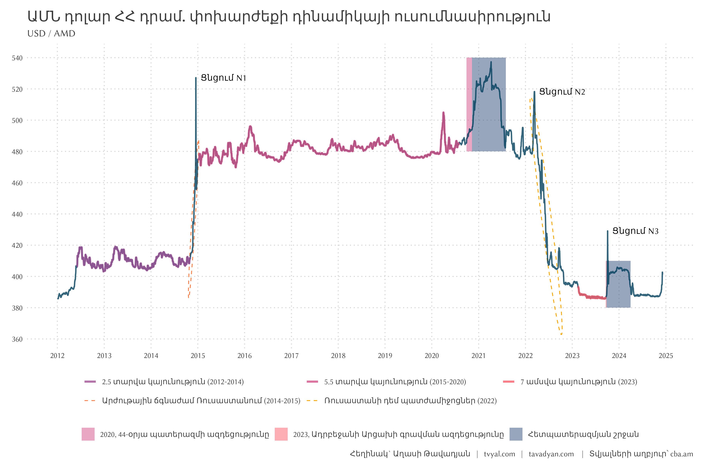
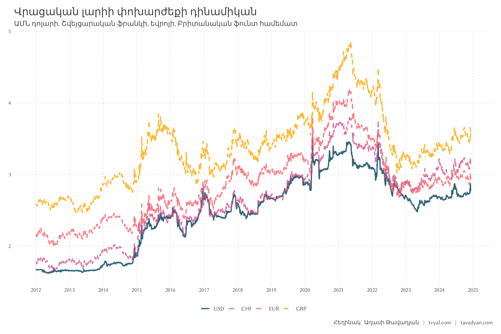
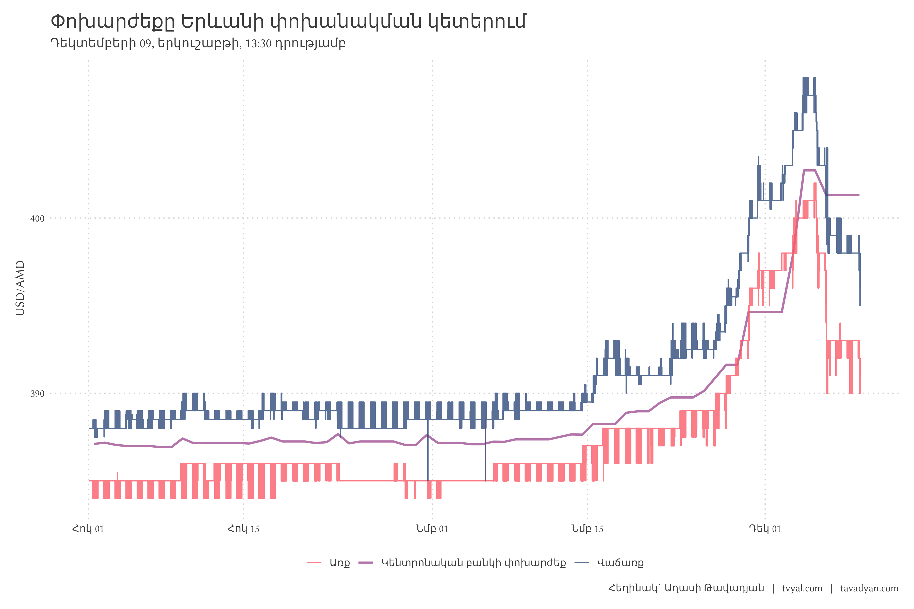
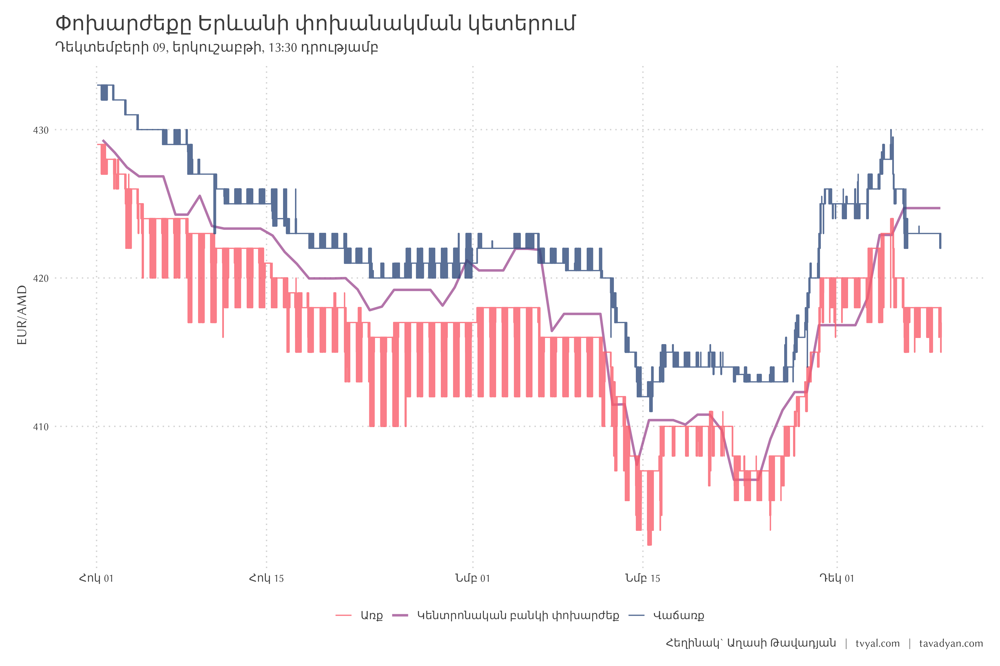
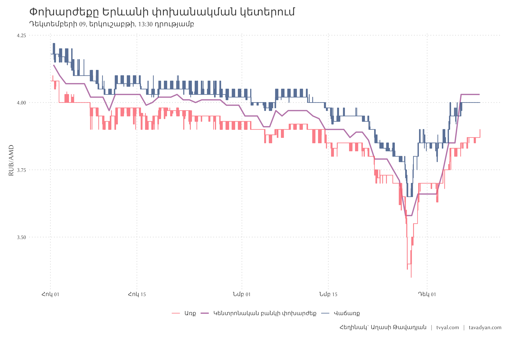
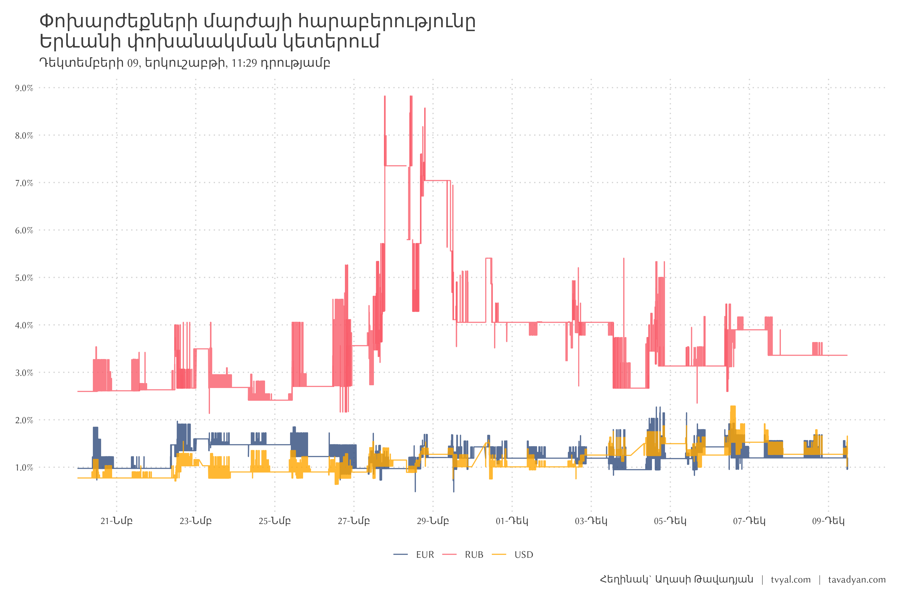
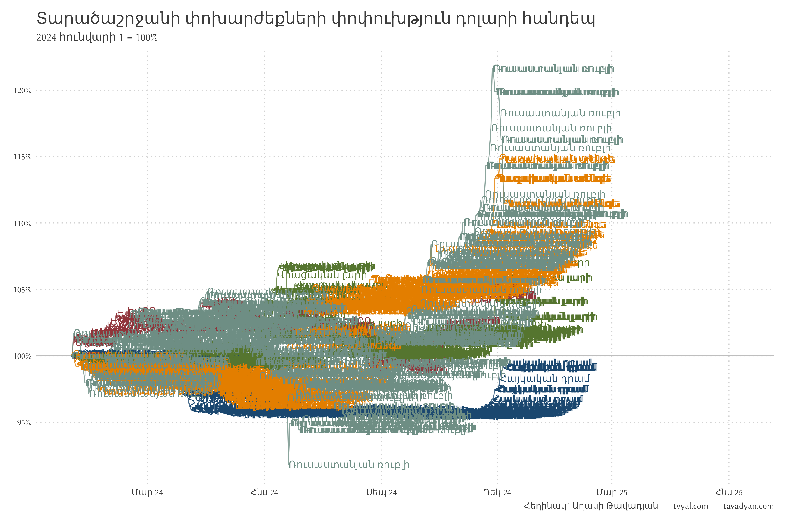

```{r setup, include=FALSE}
knitr::opts_chunk$set(echo = FALSE)

library(tidyverse)
library(scales)
library(RcppRoll)
library(gt)

# rm(list = ls()); gc()

setwd(dirname(rstudioapi::getActiveDocumentContext()$path))

source("../../initial_setup.R")

```


```{r get FX data, include=FALSE}

CBA_FX_data <- read_csv("CBA_FX_data_cleaned.csv")

exchange_points <- read_csv("rate_by_exchange_points.csv")

FX_names <- read_csv("FX_names_arm.csv")
```


```{r story of USD / AMD, include=FALSE}

rect_data_2 <- 
  tibble(
    xmin = ymd("2020-09-27", "2020-11-09", "2023-09-19", "2023-09-25"), 
    xmax = ymd("2020-11-09", "2021-08-01", "2023-09-25", "2024-04-01"), 
    ymin = c(480, 480, 380, 380), 
    ymax = c(540, 540, 410, 410),
    text = c(
      "2020, 44-օրյա պատերազմի ազդեցությունը",
      "Հետպատերազմյան շրջան",
      "2023, Ադրբեջանի Արցախի գրավման ազդեցությունը",
      "Հետպատերազմյան շրջան"
    )
  )

story_of_USD_AMD_plot <- 
  CBA_FX_data |> 
  filter(year >= 2012) |> 
  filter(FX_ISO %in%  c("USD")) |> 
  mutate(
    ellips_1 = case_when(
      date >= ymd("2012-06-01") &  date <= ymd("2014-11-01") ~ "a_stability1",
      date >= ymd("2015-01-01") &  date <= ymd("2020-08-01") ~ "b_stability2",
      date >= ymd("2023-02-15") &  date <= ymd("2023-09-18") ~ "c_stability3",
      TRUE ~ NA
    ),
    ellips_1_AMD = ifelse(!is.na(ellips_1), AMD, NA),
    # ellips_2 = case_when(
    #   date >= ymd("2020-09-01") &  date <= ymd("2021-09-01") ~ "ellipse_4",
    #   date >= ymd("2023-09-01") &  date <= ymd("2024-09-01") ~ "ellipse_5",
    #   TRUE ~ NA
    # ),
    # ellips_2_AMD = ifelse(!is.na(ellips_2), AMD, NA),
    ellips_3 = case_when(
      date >= ymd("2014-11-01") &  date <= ymd("2014-12-30") ~ "d_crisis1",
      date >= ymd("2022-03-11") &  date <= ymd("2022-09-15") ~ "e_crisis2",
      TRUE ~ NA
    ),
    ellips_3_AMD = ifelse(!is.na(ellips_3), AMD, NA),
    peaks = case_when(
      date == ymd("2014-12-17") ~ "Ցնցում N1",
      date == ymd("2022-03-11") ~ "Ցնցում N2",
      date == ymd("2023-10-04") ~ "Ցնցում N3",
    )
  ) |> 
  ggplot() +
  geom_rect(
    data = rect_data_2,
    mapping = aes(xmin = xmin, xmax = xmax, ymin = ymin, ymax = ymax, fill = text),
    alpha = 0.5
  ) +
  stat_ellipse(aes(date, ellips_3_AMD, color = ellips_3), na.rm = TRUE, linetype = 2) +
  geom_line(aes(date, AMD), linewidth = 0.8, color = new_palette_colors[1]) +
  geom_line(aes(date, ellips_1_AMD, color = ellips_1), linewidth = 1.2) +
  geom_text(aes(date, AMD, label = peaks),  hjust = -0.1) +
  # stat_ellipse(aes(date, ellips_2_AMD, color = ellips_2), na.rm = TRUE, linetype = 2) +
  scale_x_date(date_breaks = "1 year", date_labels = "%Y") +
  scale_y_continuous(breaks = seq(340, 600, 20)) +
  scale_color_manual(
    values = new_palette_colors[c(4,5,6,7,8)], na.value = "transparent",
    labels = c(
      "2.5 տարվա կայունություն (2012-2014)", "5.5 տարվա կայունություն (2015-2020)",
      "7 ամսվա կայունություն (2023)",
      "Արժութային ճգնաժամ Ռուսաստանում (2014-2015)",
      "Ռուսաստանի դեմ պատժամիջոցներ (2022)",
      "")
  ) +
  scale_fill_manual(values = new_palette_colors[c(5,6,2)]) +
  labs(
    x = NULL,
    y = NULL,
    fill = NULL,
    color = NULL,
    title = "ԱՄՆ դոլար ՀՀ դրամ. փոխարժեքի դինամիկայի ուսումնասիրություն",
    subtitle = "USD / AMD",
    caption =  paste(
      caption_arm, "   |   Տվյալների աղբյուր՝ cba.am"
    )
  ) +
  guides(
    color = guide_legend(nrow = 2, byrow = TRUE, order = 1)
  )
```

```{r, include=FALSE}

plot_amd_dynamics <- 
  CBA_FX_data |> 
  filter(year >= 2012) |> 
  filter(FX_ISO %in%  c("USD", "EUR", "GBP", "CHF")) |>
  mutate(FX_ISO = fct_reorder(FX_ISO, AMD, .desc = FALSE)) |>  
  ggplot(aes(date, AMD, color =  FX_ISO, linetype = FX_ISO)) +
  geom_line(linewidth = 1) +
  scale_x_date(date_breaks = "1 year", date_labels = "%Y") +
  scale_color_manual(values = new_palette_colors[c(1,5,6,8)]) +
  scale_linetype_manual(values = c(1,2,2,2)) +
  labs(
    x = NULL,
    y = NULL,
    color = NULL,
    linetype = NULL,
    title = "ՀՀ դրամի փոխարժեքի դինամիկան",
    subtitle = "ԱՄՆ դոլարի, Շվեյցարական ֆրանկի, եվրոյի, Բրիտանական ֆունտ համեմատ",
    caption =  caption_arm
  )


plot_amd_dynamics <- 
  CBA_FX_data |> 
  filter(year >= 2012) |> 
  filter(FX_ISO %in%  c("USD", "EUR", "GBP", "CHF")) |> 
  left_join(
    CBA_FX_data |> 
      filter(FX_ISO  == "GEL") |> 
      transmute(date, LAR_AMD = AMD),
    by = "date"
  ) |> 
  mutate(GEL = AMD / LAR_AMD) |> 
  mutate(FX_ISO = fct_reorder(FX_ISO, AMD, .desc = FALSE)) |>  
  ggplot(aes(date, GEL, color =  FX_ISO, linetype = FX_ISO)) +
  geom_line(linewidth = 1) +
  scale_x_date(date_breaks = "1 year", date_labels = "%Y") +
  scale_color_manual(values = new_palette_colors[c(1,5,6,8)]) +
  scale_linetype_manual(values = c(1,2,2,2)) +
  labs(
    x = NULL,
    y = NULL,
    color = NULL,
    linetype = NULL,
    title = "Վրացական լարիի փոխարժեքի դինամիկան",
    subtitle = "ԱՄՆ դոլարի, Շվեյցարական ֆրանկի, եվրոյի, Բրիտանական ֆունտ համեմատ",
    caption =  caption_arm
  )
```


```{r exchange points plot, include=FALSE}


exchange_plot <-
  function(
    FX_ISO_select = "USD", cut_off_date = "2024-03-18", type_ = "exchange-points"
  ){
    
    subtitle_ <- 
      exchange_points |> 
      filter(date == max(date, na.rm = TRUE)) |>
      pull(date) |> 
      unique() |> 
      format("%B %d, %A, %H:%M") |> 
      paste("դրությամբ") |> 
      str_to_sentence()
    
    USD_short_data <- 
      CBA_FX_data |> 
      filter(
        FX_ISO == FX_ISO_select,
        date >= ymd(cut_off_date)
      ) |> 
      mutate(
        possition_arm = "Կենտրոնական բանկի փոխարժեք",
        date = ymd_h(paste(date, "12"))
      )
    
    plot <- 
      exchange_points |> 
      mutate(
        value = ifelse(FX_ISO_select == "RUB" & value >= 100, NA, value)
      ) |> 
      filter(
        FX %in% c(FX_ISO_select),
        type == type_,
        !is.na(value),
        date >= ymd(cut_off_date)
      ) |> 
      ungroup() |> 
      ggplot() +
      geom_line(
        data = USD_short_data,
        mapping = aes(date, AMD, color = possition_arm),
        linewidth = 1
      ) +
      geom_step(aes(date, value, color = possition_arm), alpha = 0.8) +
      # facet_wrap(~FX, scales = "free_y") +
      scale_x_datetime(date_breaks = "1 month", date_labels = "%Y %b") +
      scale_color_manual(values = new_palette_colors[c(6,4,2)]) +
      labs(
        x = NULL,
        y = paste0(FX_ISO_select, "/AMD"),
        color = NULL,
        title = "Փոխարժեքը Երևանի փոխանակման կետերում",
        subtitle = subtitle_,
        caption =  caption_arm
      )
    
    return(plot)
  }

plot_usd_amd <- exchange_plot(FX_ISO_select = "USD", cut_off_date = "2024-10-01") + scale_x_datetime()
plot_eur_amd <- exchange_plot(FX_ISO_select = "EUR", cut_off_date = "2024-10-01") + scale_x_datetime()
plot_rub_amd <- exchange_plot(FX_ISO_select = "RUB", cut_off_date = "2024-10-01") + scale_x_datetime()

```


```{r , include=FALSE}


subtitle_ <- 
  exchange_points |> 
  filter(date == max(date, na.rm = TRUE)) |>
  pull(date) |> 
  unique() |> 
  format("%B %d, %A, %H:%M") |> 
  paste("դրությամբ") |> 
  str_to_sentence()

plot_margin <- 
  exchange_points |> 
  select(-possition_arm) |> 
  filter(
    type == "exchange-points",
    date >= ymd_hm("2024-11-20 00:00"),
    FX %in% c("USD", "EUR", "RUB")
  ) |> 
  pivot_wider(names_from = possition, values_fn = mean) |> 
  mutate(
    marja = (sell - buy) / buy
  ) |> 
  ggplot() +
  geom_line(
    aes(date, marja, color = FX),
    # alpha = 1, linewidth = 1
  ) +
  scale_y_continuous(breaks = seq(0,0.1,0.01), labels = percent_format()) +
  scale_x_datetime(date_breaks = "2 day", date_labels = "%d-%b") +
  scale_color_manual(values = new_palette_colors[c(2,6,8)]) +
  labs(
    x = NULL, y = NULL,
    color = NULL,
    title = "Փոխարժեքների մարժայի հարաբերությունը\nԵրևանի փոխանակման կետերում",
    subtitle = subtitle_,
    caption =  caption_arm
  )


```


```{r, include=FALSE}


FX_comperation <- function(year_start, year_end, FX_list){
  
  CBA_FX_data_altered <- 
    CBA_FX_data |> 
    bind_rows(
      tibble(
        date = ymd("2000-01-01"),
        FX_ISO = "AMD",
        AMD = 1
      )
    ) |> 
    complete(date, FX_ISO, fill = list(year = NA, AMD = 1)) |> 
    left_join(
      CBA_FX_data |> 
        filter(FX_ISO == "USD") |> 
        transmute(date, USD_AMD = AMD),
      by = "date"
    ) |> 
    mutate(
      USD_FX = USD_AMD / AMD,
      year = year(date)
    ) |> 
    filter(
      year >= year_start,
      year < year_end,
      FX_ISO %in% FX_list,
      # FX_ISO %in% c("AMD", "EUR", "RUB", "GEL", "KZT", "BYN")
    )
  
  CBA_FX_data_altered |> 
    group_by(FX_ISO) |> 
    arrange(FX_ISO) |> 
    mutate(
      USD_FX = USD_FX / first(USD_FX)
    ) |> 
    left_join(FX_names, by = "FX_ISO") |> 
    mutate(
      across(contains("FX_name"), ~ifelse(date == max(date), paste0(FX_ISO, ", ", .x), NA)),
      label_fx = ifelse(date == max(date), name_arm, NA)
    ) |> 
    ungroup() |> 
    ggplot(aes(date, USD_FX, color = FX_ISO, label = label_fx)) +
    geom_hline(yintercept = 1, color = "gray") +
    geom_line() +
    geom_text(hjust = 0) +
    scale_x_date(
      date_breaks = "3 months", 
      date_labels = "%b %y",
      limits = c(
        min(CBA_FX_data_altered$date) - days(1),
        max(CBA_FX_data_altered$date) + days(1) + months(6)
      )
    ) +
    scale_y_continuous(
      # breaks = seq(0.7, 2, 0.1), 
      n.breaks = 10,
      label = percent_format()
    ) +
    ggthemes::scale_color_stata() +
    labs(
      x = NULL,
      y = NULL,
      color = NULL,
      title = "Համաշխարհային փոխարժեքների փոփուխթյուն դոլարի հանդեպ",
      subtitle = paste(year_start, "հունվարի 1 = 100%")
    ) +
    theme(
      legend.position = "none"
    )
}

plot_fx_comperation_2024 <- 
  FX_comperation(2024, 2025, c(
    "KZT", "GEL",
    "AMD", "EUR", "RUB", "BYN" #"PLN",
  )) +
  labs(
    title = "Տարածաշրջանի փոխարժեքների փոփուխթյուն դոլարի հանդեպ",
    caption = caption_f()
  )


```


```{r save plots, include=FALSE}

ggsave("plots/story_of_USD_AMD_plot.png", story_of_USD_AMD_plot, width = 12, height = 8)
ggsave("plots/plot_amd_dynamics.png", plot_amd_dynamics, width = 12, height = 8)
ggsave("plots/plot_amd_dynamics.png", plot_amd_dynamics, width = 12, height = 8)
ggsave("plots/plot_usd_amd.png", plot_usd_amd, width = 12, height = 8)
ggsave("plots/plot_eur_amd.png", plot_eur_amd, width = 12, height = 8)
ggsave("plots/plot_rub_amd.png", plot_rub_amd, width = 12, height = 8)
ggsave("plots/plot_margin.png", plot_margin, width = 12, height = 8)
ggsave("plots/plot_fx_comperation_2024.png", plot_fx_comperation_2024, width = 12, height = 8)


system("cd ../.. | git all")

```

***English summary below.***


## [💵🪙🎭 Դրամի դրամա․ Ինչո՞ւ է արժեզրկվում և արժևորվում դրամը](https://www.tvyal.com/newsletter/2024/2024_12_09)


Վերջին շաբաթվա ընթացքում դրամի արժևորումը որոշակի անհանգստություն է առաջացրել շուկայում։ Այս վերլուծությունը կուսումնասիրի դրամի փոխարժեքի փոփոխության պատմությունը, կբացատրի թե ինչով է պայմանավորված դրամի առժևվորումը։

Նախ դիտարկենք ԱՄՆ դոլարի, եվրոյի և ռուսական ռուբլու փոխարժեքնեը, որոնք ներկայացված են առաջին գծապատկերում։

Գծապատկեր 1




Երկրորդ գծապատկերը պատկերում է ԱՄՆ դոլարի արժեքի պատմությունը ՀՀ դրամի նկատմամբ՝ սկսած 2012 թվականից: Գծապատկերում երևում են կայունության 3 շրջան, 3 ցնցում, Ռուսաստանի Դաշնության փոխարժեքի 2 ճգնաժամ և Արցախի կորստի ազդեցությունը:

2012 թվականից մինչև 2014 թվականի վերջը ԱՄՆ դոլարի փոխարժեքը հարաբերականորեն կայուն էր՝ մոտ 410 դրամի սահմաններում: 2014 թվականի երկրորդ կեսին Ռուսաստանում սկսվեց ֆինանսական ճգնաժամ, որը պայմանավորված էր համաշխարհային նավթի գների անկմամբ և Ռուսաստանի դեմ պատժամիջոցներով, որոնք կիրառվել էին Ղրիմի թերակղզու Ռուսատանին միացման հետևանքով: Ընդհանուր առմամբ այս իրադարձությունները արժեզրկեցին տարածաշրջանի բոլոր արժույթները, այդ թվում՝ եվրոն: Հատկանշական է, որ 2014-2015 ընկած ժամանակահատվածում եվրոն ավելի շատ արժեզրկեց ԱՄՆ դոլարի նկատմամբ, քան դրամը: Սակայն, ի տարբերություն եվրոյի, որի արժեզրկումն աստիճանական էր, դրամի արժեզրկումը կարճաժամկետ էր, անսպասելի և ապակայունացնող:

Գծապատկերում մեկ ԱՄՆ դոլարի արժեքի՝ 410-ից 480 դրամի հանկարծակի անցումը նշված է որպես «Ցնցում N1»: Այս ցնցումը պայմանավորված էր նրանով, որ Կենտրոնական բանկը այլևս ի վիճակի չէր շուկայական միջամտություններով ապահովել ԱՄՆ դոլարի փոխարժեքը մոտ 410 դրամի սահմաններում, և դրամը խուճապային արժեզրկեց՝ հասնելով ընդուպ մինչև 580 դրամի: Սա մի քանի օր խուճապ առաջացրեց շուկայում, այնուհետև իրավիճակը կայունացավ՝ մեկ ԱՄՆ դոլարը 480 դրամի շրջանակներում: Այս կայունությունը տևեց 5,5 տարի՝ մինչև 2020 թվականի աշունը:

Գծապատկեր 2










Այս ժամանակահատվածում տեղի ունեցավ 2020 թվականի 44-օրյա պատերազմը։ Պետք է նշել, որ թղթադրամը նման է հավատի։ Թղթադրամը իր մեջ ոչ մի իրական արժեք չի կրում, պարզապես հասարակությունը կոլեկտիվ հավատ ունի թղթադրամի արժեքի նկատմամբ։ Երբ հավատը դեպի տնտեսությունը և, որպես հետևանք, դեպի արժույթը մեծ է, ապա վերջինս արժևորվում է, իսկ հավատի կորստի դեպքում՝ արժեզրկվում։

2020 թվականի 44-օրյա պատերազմից հետո, ինչպես նաև 2023 թվականին Արցախի կորստից հետո, հասարակության մի մասը կորցրեց հավատը դեպի տնտեսությունը և, որպես հետևանք, դեպի դրամը։ Սա հանգեցրեց դրամի վաճառքի և արտարժույթի ձեռքբերման, որի արդյունքում դրամը 2020 թվականի հոկտեմբերին սկսեց արժեզրկվել։ Նշենք, որ հասարակության անդամները չեն կարող երկար պահել գնված արտարժույթը, քանի որ Հայաստանում, բացի դրամից, այլ արժույթ չի կարող հանդիսանալ վճարամիջոց։ Ուստի, որոշ ժամանակ անց կուտակված արտարժույթը հետ է վաճառվում, և դրամ է գնվում, ինչը հետ է արժևորում դրամը հետպատերազմյան մակարդակին։

Գծապատկերում պատկերված N2 ցնցումը տեղի ունեցավ 2022 թվականի մարտի 11-ին, որը ռուս-ուկրաինական հակամարտության և Ռուսաստանի դեմ պատժամիջոցների արձագանք էր։ Սա հանգեցրեց այդ ընթացքում ռուսական ռուբլու կտրուկ արժեզրկմանը։ 2014 թվականի դեկտեմբերյան դեպքերի պես, Հայաստանի շուկան նույնպես սպասում էր, որ դրամը ռուսական ռուբլու նման կարժեզրկվի, ինչը որոշակի խուճապ էր առաջացրել ներքին շուկայում։ Այնուամենայնիվ, այս անգամ Ռուսաստանի դեմ պատժամիջոցները հանգեցրին Ռուսաստանից բավականին մեծ քանակությամբ արտարժույթի արտահոսքի։

2022 թվականի ընթացքում ՀՀ բանկային համակարգ կատարված փոխանցումները 2.5 անգամ աճեցին հիմնականում Ռուսատանից, որոնց ներհոսքը այդ տարվա ընթացքում աճեց 4.5 անգամ։ Այս ամենի արդյունքում Հայաստանի բանկային համակարգի զուտ շահույթը 2022 թվականին աճեց 3 անգամ։ Դոլարը կարելի է դիտարկել որպես ապրանք։ 2022 թվականի ընթացքում այդ ապրանքը հեղեղեց Հայաստանի շուկան և որպես արդյունք դոլարը սկսեց արժեզրկվել դրամի հանդեպ, իսկ դրամը ամրանալ։ Այսպես 2022 թվականի փետրվարին ռուս-ուկրաինական հակամարտության սկսման արդյունքում շուկան սպասում էր, որ դրամը սկսելու էր արժեզրկվել 2014 թվականի վերջի դեպքերի պես, սակայն Ռուսատանից զգալի քանակությամբ արտարժույթի արտահոսքով պայմանավորված դրամը արժևորվեց՝ նախնական սպասմանը հակառակ ուղղությամբ։ Այս դեպքերից հետո 2023 թվականի սկզբից դոլար-դրամ փոխարժեքի կայունության 3֊րդ շրջանն էր, որը համեմատաբար կարճ տևեց՝ պայմանավորված Ադրբեջանի կողմից Արցախի գրավմամբ։

>
> Ձեզ կարող է հետաքրքրել նաև հետևյալ վերլուծությունը.
>
> [💸🔚🏦 Կապիտալի արտահոսք](https://www.tvyal.com/newsletter/2024/2024_03_01)։
>

Արցախի գրավումը (2020 թվականի 44-օրյա պատերազմի պես) հանգեցրեց հասարակության մի զանգվածի կողմից դրամի և տնտեսության նկատմամբ հավատի կորստին։ Հասարակության մի մասը սկսեց դրամը վաճառել և արտարժույթ գնել, ինչը հանգեցրեց դրամի արժեզրկման։ Այս ժամանակ գրանցվեց N3 ցնցումը։ Այս ժամանակահատվածում տնտեսության սպեկուլյատիվ խաղացողները՝ հիմնականում փոխանակման կետերը, զգալով, որ կրկնվելու է 2020 թվականի հոկտեմբերի սցենարը, սկսեցին դոլար գնել, և 2023 թվականի հոկտեմբերի 4-ին դոլարի գինը սպեկուլյատիվ բարձրացավ՝ հասնելով մինչև 450 դրամի մեկ դոլարի համար։ Իհարկե, սկզբնապես դրամի արժեզրկումը բնականոն էր, սակայն այն սկսեց կրել սպեկուլյատիվ բնույթ, որի արդյունքում հիմնականում տուժեցին հենց փոխանակման կետերը։


Գծապատկեր 3


Վերջին մի քանի օրերի ընթացքում (2024թ․ մարտի կեսից) շուկայում նկատվում է դրամի արժևորում, որը, ինչպես և 2020-21 թվականին պայմանավորված է նրանով որ, արտարժույթը Հայաստանում պաշտոնական վճարման միջոց չէ։ Այն մարդիկ որոնք 2022 թվականի հոկտեմբերին Արցախի կորստից հետո արտարժույթ են պահել ստիպված հետ են վաճառում, որը արժեզրկում է դրամը։ Դոլարի փոխարժեքը հետ է վերադառնելու մինչև 2022 թվականի սեպտեմբերի մակարդակը։

Չորրորդ գծապատկերում պատկերված է Երևանի փոխանակման կետերի առքի և վաճառքի փոխարժեքները վերջին մեկ ամսվա ընթացքում։ Ընդհանուր առմամբ գծագրից կարելի է տեսնել որ փոխարժեքի շուկան արդեն հանդարտվել է և գտել է նոր հավասարակշռության կետերը։

Հայաստանի կենտրոնական բանկը հանդարտության ժամանակ որոշակիորեն կցում է փոխարժեքը դոլարին։ Նշենք որ 2-րդ գծապատկերում ներկայացված կայունության ժամանակահատվածում դոլարի փոխարժեքը ավելի քիչ է տատանվել դրամի հանդեպ քան դոլարին թույլ կցված փոխարժեքներից շատերը։ Եթե շուկայում մեծ ցնցումներ չլինեն, ապա փոխարժեքը գտնվելու է այս նոր հավասարակշռության կետում։

Արցախի գրավումը 2020 թվականի 44 օրյա պատերազմի պես հանգեցրեց հասարակության մի զանգվածի դրամի և տնտեսության հանդեպ հավատի կորստին։ Հասարակության մի մասը սկսեց դրամը վաճառել և արտարժույթ գնել, որը արժեզրկեց դրամը։ Այս ժամանակ գրանցվեց N3 ցնցումը։ Այս ժամանակահատվածում տնտեսության սպեկուլատիվ խաղացողները՝ հիմնականում փոխանակման կետերը, զգալով որ կրկնվելու է 2020 թվականի հոկտեմբերի սցենարը սկսեցին դոլար առնել և 2023 թվականի հոկտեմբերի 4-ին դոլարի գինը սպեկուլատիվ բարձրացավ ընդուպ մինչև 450 դրամ մեկ դոլարի համար։ Իհարկե ի սկզբանե դրամի արժեզրկումը բնականոն էր, սակայն այն սկսեց կրել սպեկուլատիվ բնույթ, որի արդյունքում հիմնականում տուժեցին փոխանակման կետերը։


Գծապատկեր 4


### Դրամի արժևորման հետևանքները

Դրամի արժևորումը բացասական անդրադարձ կունենա ապրանքների և ծառայությունների արտահանման, ինչպես նաև բանկային փոխանցումների վրա։

2023 թվականին արտահանման 55 տոկոսանոց աճը հիմնականում ապահովվել է ոսկու և ադամանդների վերաարտահանման հաշվին, որոնց տեսակարար կշիռը կազմել է արտահանման 28 տոկոսը։ Սակայն, արտահանման ավանդական ուղղություններից շատերը անկում են արձանագրել 2022 թվականին։ Դրամի արժևորումը թանկացնելու է Հայաստանի իրական արտադրանքի արտահանումը դեպի արտասահմանյան շուկաներ։ Բացի այդ, դրամի արժևորումը կհանգեցնի տուրիստական և տեղեկատվական տեխնոլոգիաների ոլորտների ծառայությունների թանկացման։

>
> Ձեզ կարող է հետաքրքրել նաև հետևյալ վերլուծությունը.
>
> [📈📉❓ Արտահանման 55.3 տոկոս աճ թե՞ -12.2 տոկոս անկում](https://www.tvyal.com/newsletter/2024/2024_02_16)։
>

Կոմերցիոն նպատակով բանկային փոխանցումները վճռորոշ դեր են ունեցել 2022 թվականի տնտեսական աճի համար։ [Այժմ գրանցվում է բանկային կապիտալի արտահոսք և ներհոսքի դանդաղում](https://www.tvyal.com/newsletter/2024/2024_03_01)։ Առևտրային նպատակով ներհոսքը կարժեզրկվի դրամի արժևորման հետևանքով։

Դրամի արժեզրկումը նաև կհանգեցնի դոլարով պետական պարտքի ծավալի ավելացման՝ դոլարային պարտավորությունների սպասարկման արժեքի իջեցման պատճառով։ Սա որոշակի ռիսկեր է իր մեջ պարունակում։ Միևնույն ժամանակ, դրամի արժեզրկումը կարճաժամկետ հատվածում կարող է նաև բերել բենզինի գնի նվազման՝ շուրջ 20 դրամով։ Սակայն, այս էֆեկտը կարող է տևել կարճ ժամանակահատված, քանի որ ներկայումս գրանցվում են նավթի և բենզինի համաշխարհային գների աճ։


-----

-----

Եթե հնարավոր է, խնդրում եմ այս նյութը ուղարկել նաև այն մարդկանց, ում այն կարծում եք կարող է հետաքրքրել:

**ԱՅՍ ՀՈԴՎԱԾԻ ՀՂՈՒՄԸ**

***Թավադյան, Աղ․Ա․ (2024) Վտանգավոր թվեր․ Հայաստանի տնտեսական «հրաշքի» մութ կողմը [Dangerous Numbers: The Dark Side of Armenia's Economic 'Miracle'], tvyal.com հարթակ [tvyal.com platform], 09-12-2024․ https://www.tvyal.com/newsletter/2024/2024_12_09***

**Արգելվում է այս հարթակի նյութերը արտատպել առանց հղում կատարելու։**    

<small>\* Այս և մեր բոլոր այլ վերլուծությունների տվյալները վերցված են պաշտոնական աղբյուրներից։ Հաշվարկները ամբողջությամբ հասանելի են github-ում, դրանք կարելի է ստուգել` այցելելով [github-ի](https://github.com/tavad/tvyal_newsletter/blob/main/2024/) մեր էջը, որտեղ տրված են տվյալները, հաշվարկների և գծապատկերների կոդը։

</small>


-----

# ՀԱՄԱԳՈՐԾԱԿՑՈՒԹՅՈՒՆ

<style>
.ai-services-banner-tvyal {
background-color: #0a192f;
color: #e6f1ff;
padding: 30px;
font-family: Arial, sans-serif;
border-radius: 10px;
box-shadow: 0 4px 6px rgba(0, 0, 0, 0.1);
position: relative;
overflow: hidden;
min-height: 400px;
display: flex;
flex-direction: column;
justify-content: center;
}
.ai-services-banner-tvyal::before {
content: '';
position: absolute;
top: -25%;
left: -25%;
right: -25%;
bottom: -25%;
background: repeating-radial-gradient(
circle at 50% 50%,
rgba(100, 255, 218, 0.1),
rgba(100, 255, 218, 0.1) 15px,
transparent 15px,
transparent 30px
);
animation: gaussianWaveTvyal 10s infinite alternate;
opacity: 0.3;
z-index: 0;
}
@keyframes gaussianWaveTvyal {
0% {
transform: scale(1.5) rotate(0deg);
opacity: 0.2;
}
50% {
transform: scale(2.25) rotate(180deg);
opacity: 0.5;
}
100% {
transform: scale(1.5) rotate(360deg);
opacity: 0.2;
}
}
.ai-services-banner-tvyal > * {
position: relative;
z-index: 1;
}
.ai-services-banner-tvyal h2,
.ai-services-banner-tvyal h3 {
margin-bottom: 20px;
color: #ccd6f6;
}
.ai-services-banner-tvyal ul {
margin-bottom: 30px;
padding-left: 20px;
}
.ai-services-banner-tvyal li {
margin-bottom: 10px;
}
.ai-services-banner-tvyal a {
color: #64ffda;
text-decoration: none;
transition: color 0.3s ease;
}
.ai-services-banner-tvyal a:hover {
color: #ffd700;
text-decoration: underline;
}
</style>

<div class="ai-services-banner-tvyal">
## [Եթե ուզում եք  AI գործիքներով ձեր տվյալներից օգուտ քաղել` ԴԻՄԵՔ ՄԵԶ](mailto:a@tavadyan.com?subject=Let's Put Data to Work!)

### Մենք առաջարկում ենք

- Extensive databases for finding both international and local leads
- Exclusive reports on the Future of the Armenian Economy
- Work and browser automation to streamline operations and reduce staffing needs
- AI models for forecasting growth and optimizing various aspects of your business
- Advanced dashboarding and BI solutions
- Algorithmic trading

### [Let's Put Your Data to Work!](mailto:a@tavadyan.com?subject=Let's Put Data to Work!)

### [ՄԻԱՑԵՔ ՄԵՐ ԹԻՄԻՆ](mailto:a@tavadyan.com?subject=Work application)
</div>

---


## ԶԼՄ հաղորդագրություն


### **[Դիտեք 1in.am-ին տված հարցազրույցը որը քաննարկում է բյուջեի կատարման, ինչպես նաև Հայաստանի տնտեսության հիվանդությունները](https://youtu.be/tNEGkDCOvy4?t=123)**

📺 Հայաստանի տնտեսությունը շատ է կախված Ռուսաստանից. դա ազդում է մեր արտաքին քաղաքականության վրա 📺

<a href="https://youtu.be/tNEGkDCOvy4?t=123">
  
</a>


---

---


## English Summary

### 💵🪙🎭


---


Հարգանքներով,            
Աղասի Թավադյան         
09.12.2024          
[tvyal.com](https://www.tvyal.com/)      
[tavadyan.com](https://www.tavadyan.com/)

---

[Was this email forwarded to you? Subscribe here.](https://www.tvyal.com/subscribe)

[Բաժանորդագրվեք](https://www.tvyal.com/subscribe)

       
---              
               


####### **Ուշադրություն. Ձեր էլ.փոստը մեյլիսթի մեջ է, որի միջոցով ես կիսվում եմ շաբաթական նյութեր, որոնք հիմնականում ներկայացնում են Հայաստանի տնտեսությանը: Նյութերը ներառում են գծապատկերներ, [տվյալների բազաներ](https://github.com/tavad/tvyal_newsletter), տեսանյութեր, հոդվածներ, [առցանց վահանակներ](https://www.tvyal.com/projects), տնտեսական գործիքներ, կանխատեսումներ և հաշվետվություններ: Եթե ցանկանում եք չեղարկել բաժանորդագրությունը, խնդրում եմ տեղեկացրեք ինձ, և ես կհեռացնեմ ձեր էլ. փոստը ցուցակից: Գրեք նաև եթե ունեք մենկնաբանություններ:**

####### **Important! Your email is part of the mailing list where I share weekly materials primarily focused on the Armenian economy. These materials encompass charts, [databases](https://github.com/tavad/tvyal_newsletter), videos, articles, [online dashboards](https://www.tvyal.com/projects), economic tools, forecasts, and reports. If you wish to unsubscribe, please let me know, and I will remove your email from the list. Please share your comments as well․**


