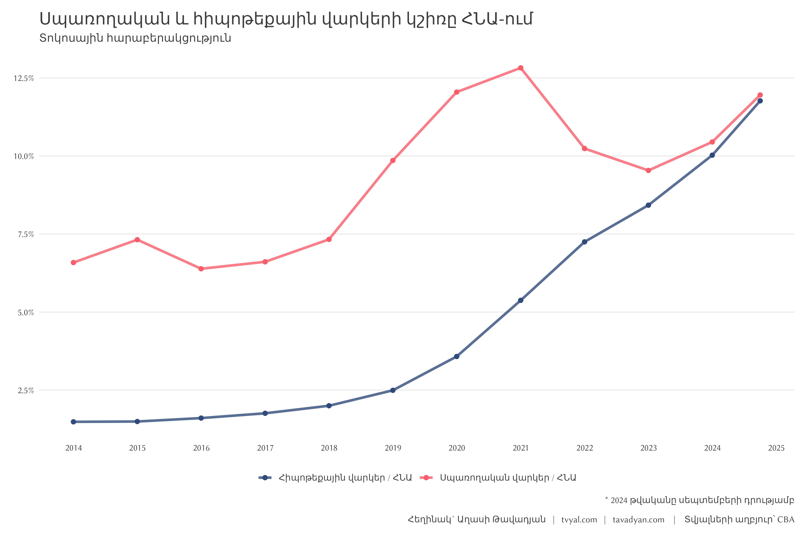
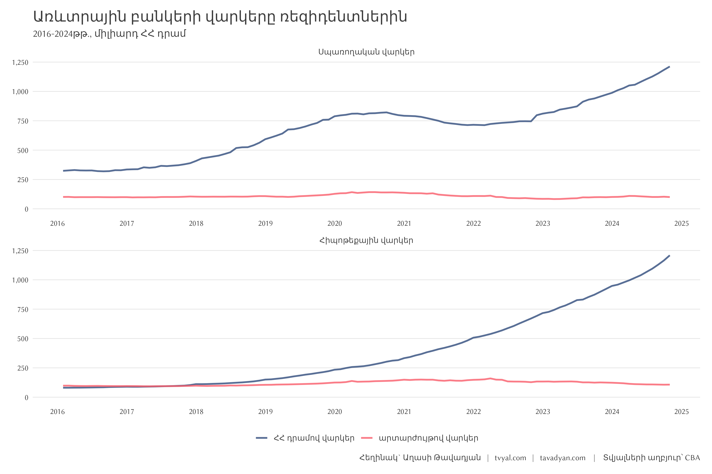
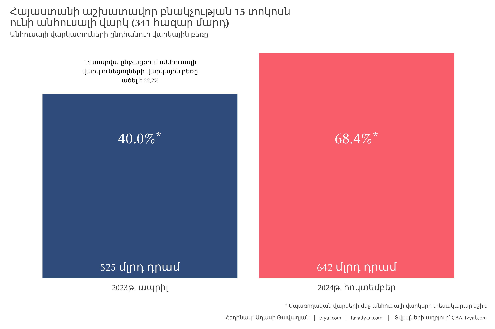
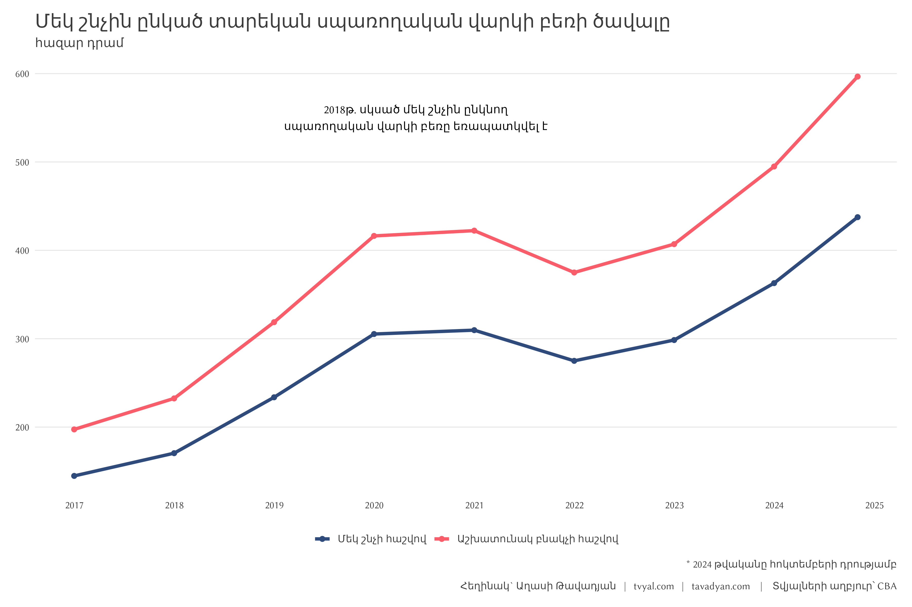
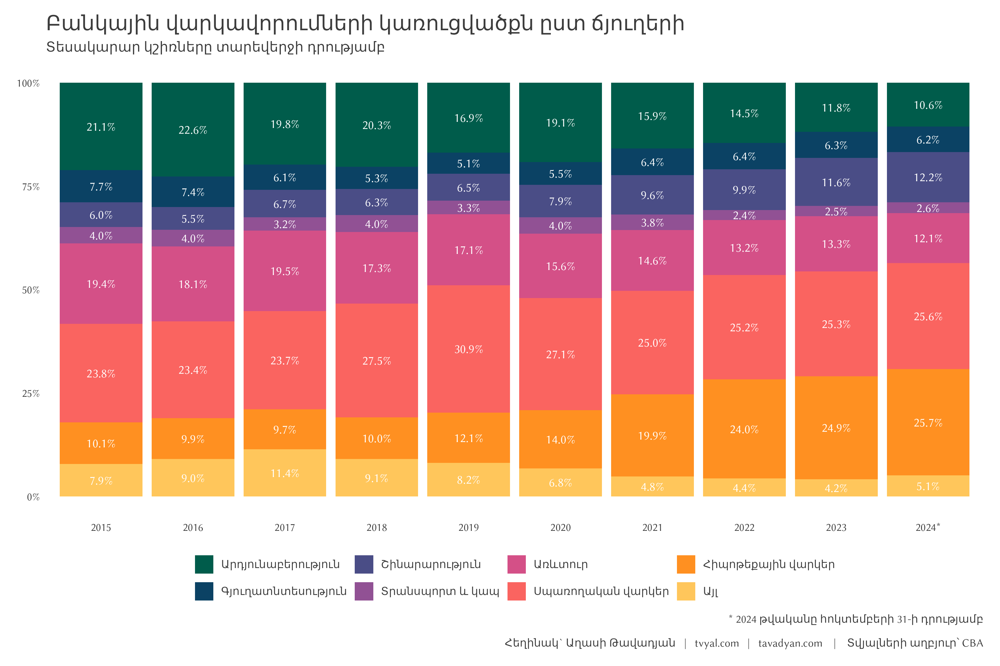

```{r setup, include=FALSE}
knitr::opts_chunk$set(echo = TRUE)

library(tidyverse)
library(RcppRoll)
library(scales)
library(readxl)
library(janitor)
library(rvest)

# rm(list = ls()); gc()

setwd(dirname(rstudioapi::getActiveDocumentContext()$path))

source("../../initial_setup.R")

```


```{r reading data, include=FALSE}

# system("curl --insecure 'https://www.cba.am/stat/stat_data_arm/7_loans%20by%20branches_arm.xlsx' -o '7_loans_by_branches_arm.xlsx'")

readxl::excel_sheets("7_loans_by_branches_arm.xlsx")

loans_by_branches_row <- read_excel("7_loans_by_branches_arm.xlsx", sheet = 1)

arm_month_names <- c(
  "Հունվար", "Փետրվար", "Մարտ", "Ապրիլ", "Մայիս", "Հունիս", "Հուլիս",
  "Օգոստոս", "Սեպտեմբեր", "Հոկտեմբեր", "Նոյեմբեր", "Դեկտեմբեր"
  )

```


```{r, include=FALSE}

loans_by_branches <- 
  loans_by_branches_row  |> 
  rename(sphere = 1, temp = 2) |> 
  mutate(
    task = ifelse(grepl("ՀՀ առևտրային", sphere), sphere, NA),
    task = str_remove_all(task, "ՀՀ առևտրային բանկերի կողմից ռեզիդենտներին տրամադրված *"),
    task = str_remove_all(task, "ն ըստ ոլորտների ?1,2")
  ) |> 
  relocate(task) |> 
  fill(task, .direction = "down") |>
  filter(
    !is.na(temp) |
      sphere %in% c("Սպասարկման ոլորտ", "Սպառողական վարկեր", "Հիպոթեքային վարկեր", "Այլ")
  ) |>
  t() |>  as_tibble(header = TRUE) |>
  fill(V1, .direction = "down") |>
  mutate(date = paste(V2, V1)) |> 
  relocate(date) |> 
  t() |>  as_tibble(header = TRUE) |> 
  row_to_names(row_number = 1) |> 
  rename(bank_loans = 1, sphere = 2) |> 
  filter(!grepl("լորտ", sphere), !is.na(sphere)) |>
  pivot_longer(-c(bank_loans, sphere), names_to = "date", values_to = "dram") |> 
  extract(date, into = c("month_name", "year"), regex = "(.*) (\\d{4})") |> 
  mutate(
    month = c(1:12)[match(month_name, arm_month_names)],
    date = ym(paste(year, month)),
    date = date + months(1) - days(1),
    dram = as.numeric(dram),
    sphere = fct_inorder(sphere),
    bank_loans = fct_inorder(bank_loans)
  ) |> 
  filter(sphere != "Ընդամենը") |> 
  relocate(-dram) |> 
  group_by(date, bank_loans) |> 
  mutate(pct_dram = dram / sum(dram)) |> 
  ungroup()

loans_by_branches |> 
  write_csv("loans_by_branches_clean.csv")

```


```{r, include=FALSE}

GDP_per_capita_url <- read_html("https://armstat.am/en/?nid=202") |> 
  html_elements(xpath = '//a[text()="Gross domestic product (GDP) and GDP per capita"]') |> 
  html_attr("href") |> 
  str_replace("\\.{2}", "https://www.armstat.am")


GDP_per_capita <- 
  rio::import(GDP_per_capita_url[1], skip = 11) |> 
  as_tibble() |> 
  rename(year = 1, GDP_AMD = 2) |> 
  transmute(year = parse_number(year), GDP_AMD) |> 
  filter(!is.na(GDP_AMD))


GDP_url <- read_html("https://armstat.am/en/?nid=202") |> 
  html_elements(xpath = '//a[text()="GDP"]') |> 
  html_attr("href") |> 
  str_replace("\\.{2}", "https://www.armstat.am")


loans_by_branches |> 
  filter(
    year >= 2012,
    bank_loans != "ընդհանուր վարկեր",
    sphere %in% c("Սպառողական վարկեր", "Հիպոթեքային վարկեր"),
    grepl("ՀՀ", bank_loans),
    month %in% c(3,6,9,12)
  ) |> 
  group_by(year) |> 
  filter(month == max(month)) |> 
  ungroup() |> 
  mutate(
    year = parse_number(year),
    sphere = paste(sphere, "/ ՀՆԱ")
  ) |> 
  left_join(GDP_per_capita, by = join_by(year)) |> 
  mutate(vark_GDP = dram / GDP_AMD) |> 
  ggplot(aes(year, vark_GDP, color = sphere)) +
  geom_line(size = 1.3) +
  scale_x_continuous(breaks = 2012:2024) +
  scale_y_continuous(labels = percent_format()) +
  scale_color_manual(values = new_palette_colors[c(2,6)]) +
  labs(
    x = NULL,
    y = NULL,
    color = NULL,
    title = "Սպառողական և հիպոթեքային վարկերի կշիռը ՀՆԱ-ին",
    subtitle = "Տոկոս",
    caption = caption_f("CBA")
  )


GDP_Q <- 
  rio::import(GDP_url[2], skip = 4) |> 
  as_tibble() |> 
  rename(code = 1, nace_arm = 2, nace_eng = 3, nace_rus = 4) |> 
  pivot_longer(matches("\\d{4}"), names_to = "date", values_to = "GDP_AMD") |> 
  mutate(date = yq(date) + months(3) - days(1)) |> 
  group_by(code, nace_arm) |> 
  mutate(GDP_AMD_yoy = roll_sumr(GDP_AMD, 4)) |> 
  ungroup()

GDP_per_capita_q <- 
  GDP_Q |> 
  filter(grepl("Ներքին արդյունք", nace_arm), !is.na(GDP_AMD_yoy)) |> 
  select(date, GDP_AMD_yoy)


plot_loans_to_GDP <-
  loans_by_branches |>
  filter(
    year >= 2013,
    bank_loans != "ընդհանուր վարկեր",
    sphere %in% c("Սպառողական վարկեր", "Հիպոթեքային վարկեր"),
    grepl("ՀՀ", bank_loans),
    month %in% c(3,6,9,12)
  ) |> 
  group_by(year) |>
  filter(month == max(month)) |>
  ungroup() |>
  mutate(
    year = parse_number(year),
    sphere = paste(sphere, "/ ՀՆԱ")
  ) |> 
  left_join(GDP_per_capita_q, by = join_by(date)) |> 
  mutate(vark_GDP = dram / GDP_AMD_yoy) |> 
  ggplot(aes(date, vark_GDP, color = sphere)) +
  geom_line(size = 1.3) +
  geom_point(size = 2) +
  scale_x_date(date_breaks = "1 year", date_labels = "%Y") +
  scale_y_continuous(labels = percent_format()) +
  scale_color_manual(values = new_palette_colors[c(2,6)]) +
  labs(
    x = NULL,
    y = NULL,
    color = NULL,
    title = "Սպառողական և հիպոթեքային վարկերի կշիռը ՀՆԱ-ում",
    subtitle = "Տոկոսային հարաբերակցություն",
    caption = caption_f("CBA", suffix_text = "* 2024 թվականը սեպտեմբերի դրությամբ")
  ) +
  theme(
    panel.grid.major.x = element_blank(),
    panel.grid.major.y = element_line(
      color = "gray90",
      linetype = 1, size = 0.4
    ),
  )

```


```{r, include=FALSE}

plot_mortgage_consumer_loans <- 
  loans_by_branches |> 
  filter(
    year >= 2016,
    bank_loans != "ընդհանուր վարկեր",
    # !sphere %in% c("Այլ", "Տրանսպորտ և կապ"),
    sphere %in% c("Սպառողական վարկեր", "Հիպոթեքային վարկեր")
  ) |> 
  ggplot(aes(date, dram / 1000, color = bank_loans)) +
  geom_line(size = 1) +
  facet_wrap(~sphere, nrow = 2, scales = "free_x") +
  scale_x_date(date_breaks = "1 years", date_labels = "%Y") +
  scale_y_continuous(labels = scales::comma_format(), limits = c(0, NA)) +
  scale_color_manual(values = new_palette_colors[c(2,6)]) +
  labs(
    x = NULL, 
    y = NULL,
    color = NULL,
    title = "Առևտրային բանկերի վարկերը ռեզիդենտներին",
    subtitle = "2016-2024թթ․, միլիարդ ՀՀ դրամ",
    caption = caption_f("CBA")
  ) +
  theme(
    panel.grid.major.x = element_blank(),
    panel.grid.major.y = element_line(
      color = "gray90",
      linetype = 1, size = 0.4
    ),
  )


# loans_by_branches |> 
#   filter(year >= 2005) |> 
#   ggplot(aes(date, pct_dram, fill = sphere)) + 
#   geom_area(stat="identity") +
#   facet_wrap(~ bank_loans)

max_month <- loans_by_branches$date |> max() |> month()

plot_loan_types_pct <- 
  loans_by_branches |> 
  filter(year >= 2015, bank_loans == "ընդհանուր վարկեր") |> 
  group_by(year) |> 
  filter(month == max(month)) |> 
  ungroup() |>
  mutate(
    pct_txt = percent(pct_dram, accuracy = 0.1),
    year = ifelse(year == max(year), paste0(year, "*"), year)
  ) |> 
  ggplot(aes(year, pct_dram, fill = sphere, label = pct_txt)) + 
  geom_col(alpha = 1) +
  geom_text(position = position_stack(vjust = .5), color = "white") +
  scale_y_continuous(labels = percent_format()) +
  # scale_fill_brewer(type = "qual", palette = 3) +
  scale_fill_manual(values = colfunc3(9)) +
  labs(
    x = NULL,
    y = NULL,
    fill = NULL,
    title = "Բանկային վարկավորումների կառուցվածքն ըստ ճյուղերի",
    subtitle = "Տեսակարար կշիռները տարեվերջի դրությամբ",
    caption = caption_f("CBA", suffix_text = "* 2024 թվականը հոկտեմբերի 31-ի դրությամբ")
  ) +
  theme(
    panel.grid.major.x = element_blank(),
    panel.grid.major.y = element_blank(),
  )


# loans_by_branches |> 
#   filter(year >= 2015, month == 12, bank_loans == "ընդհանուր վարկեր") |> 
#   mutate(
#     dram = dram / 1000,
#     dram_text = number(dram,  accuracy = 1)
#   ) |> 
#   ggplot(aes(year, dram, fill = sphere, label = dram_text)) + 
#   geom_col(stat="identity") +
#   geom_text(position = position_stack(vjust = .5)) +
#   scale_y_continuous(labels = number_format()) +
#   # scale_fill_brewer(type = "qual", palette = 3) +
#   scale_fill_manual(values = colfunc3(9)) +
#   labs(
#     x = NULL,
#     y = NULL,
#     fill = NULL,
#     title = "Բանկային վարկավորումները ըստ ճյուղերի",
#     subtitle = "մլրդ դրամ",
#     caption = paste0(caption_arm, "   |    տվյալների աղբյուր՝ cba.am")
#   ) +
#   theme(
#     panel.grid.major.x = element_blank()
#   )


# loans_by_branches |> 
#   filter(bank_loans != "ընդհանուր վարկեր") |> 
#   group_by(sphere, date) |> 
#   mutate(pct = dram/sum(dram), .groups = "drop") |>
#   ggplot(aes(date, pct, fill = bank_loans)) +
#   geom_area(stat="identity", alpha = 0.5) +
#   facet_wrap(~ sphere)


```


```{r, include=FALSE}

loans_by_branches |> 
  filter(
    date %in% ymd("2024-10-31", "2023-04-30"),
    bank_loans != "ընդհանուր վարկեր",
    # !sphere %in% c("Այլ", "Տրանսպորտ և կապ"),
    sphere %in% c("Սպառողական վարկեր")
  ) |> 
  group_by(sphere, month_name, year, month, date) |> 
  summarise(dram = sum(dram), .groups = "drop") |>
  left_join(
    tibble(
      date = ymd("2024-10-31", "2023-04-30"), 
      unreliable_loans = c(525000, 642000)
    ),
    by = "date"
  ) |> 
  mutate(unreliable_pct = unreliable_loans / dram)


plot_unreliable_loans <- 
  tibble(
    date = ymd("2024-10-01", "2023-04-01"),
    unreliable_loans = c(642, 525),
    date_name = c("2024թ․ հոկտեմբեր", "2023թ․ ապրիլ")
  ) |> 
  ggplot(aes(date_name, unreliable_loans)) +
  geom_col(aes(fill = date_name), alpha = 1) +
  geom_text(
    aes(y = 0, label = paste(unreliable_loans, "մլրդ դրամ")),
    vjust = -1, size = 7, color = "white"
  ) +
  geom_text(
    data = tibble(
      x = "2023թ․ ապրիլ", y = 590, 
      label = "1.5 տարվա ընթացքում անհուսալի\nվարկ ունեցողների վարկային բեռը\nաճել է 22.2%"
    ),
    aes(x, y, label = label)
  ) +
  geom_text(
    data = tibble(
      x = c("2023թ․ ապրիլ", "2024թ․ հոկտեմբեր"), y = 400, 
      label = c("40.0%*", "68.4%*"), 
    ),
    aes(x, y, label = label),
    color = "white", size = 10
  ) +
  scale_fill_manual(values = new_palette_colors[c(2,6)]) +
  labs(
    x = NULL,
    y = NULL, 
    fill = NULL,
    title = "Հայաստանի աշխատավոր բնակչության 15 տոկոսն\nունի անհուսալի վարկ (341 հազար մարդ)",
    subtitle = "Անհուսալի վարկատուների ընդհանուր վարկային բեռը",
    caption = caption_f(
      "CBA, tvyal.com", 
      suffix_text = "* Սպառողական վարկերի մեջ անհուսալի վարկերի տեսակարար կշիռ"
    )
  ) +
  theme(
    legend.position = "drop",
    panel.grid.major.x = element_blank(),
    panel.grid.major.y = element_blank(),
    axis.text.y = element_blank(),
    axis.text.x = element_text(vjust = 5, size = 15)
  )


```


```{r, include=FALSE}

plot_loans_per_capita <- 
  loans_by_branches |> 
  filter(
    year >= 2016,
    bank_loans != "ընդհանուր վարկեր",
    # !sphere %in% c("Այլ", "Տրանսպորտ և կապ"),
    sphere %in% c("Սպառողական վարկեր")
  ) |> 
  group_by(year) |>
  filter(month == max(month)) |>
  ungroup() |>
  group_by(sphere, date, month_name, year, month) |> 
  summarise(dram = sum(dram), .groups = "drop") |> 
  mutate(
    pop = 3e6,
    pop_work = 2.2e6,
    loans_per_person = dram / pop * 1e6,
    loans_per_worker = dram / pop_work * 1e6,
  ) |> 
  select(date, loans_per_person, loans_per_worker) |> 
  pivot_longer(-date) |> 
  ggplot(aes(date, value / 1000)) +
  geom_line(aes(color = name), alpha = 1, size = 1.5) +
  geom_point(aes(color = name), size = 2) +
  geom_text(
    data = tibble(
      x = ymd("2020-06-01"), y = 550, 
      label = "2018թ․ սկսած մեկ շնչին ընկնող\nսպառողական վարկի բեռը եռապատկվել է"
    ),
    aes(x, y, label = label)
  ) +
  scale_x_date(date_breaks = "1 year", date_labels = "%Y") +
  scale_color_manual(
    values = new_palette_colors[c(2,6)], 
    labels = c(
      "Մեկ շնչի հաշվով",
      "Աշխատունակ բնակչի հաշվով"
    )
  ) +
  labs(
    x = NULL,
    y = NULL,
    color = NULL,
    title = "Մեկ շնչին ընկած տարեկան սպառողական վարկի բեռի ծավալը",
    subtitle = "հազար դրամ",
    caption = caption_f("CBA", suffix_text = "* 2024 թվականը հոկտեմբերի դրությամբ")
  ) +
  theme(
    panel.grid.major.x = element_blank(),
    panel.grid.major.y = element_line(
      color = "gray90",
      linetype = 1, size = 0.4
    ),
  )


```


```{r save plots, include=FALSE}

ggsave("plots/plot_loans_to_GDP.png", plot_loans_to_GDP, width = 12, height = 8)
ggsave("plots/plot_mortgage_consumer_loans.png", plot_mortgage_consumer_loans, width = 12, height = 8)
ggsave("plots/plot_loan_types_pct.png", plot_loan_types_pct, width = 12, height = 8)
ggsave("plots/plot_unreliable_loans.png", plot_unreliable_loans, width = 12, height = 8)
ggsave("plots/plot_loans_per_capita.png", plot_loans_per_capita, width = 12, height = 8)

system("cd ../.. | git all")

```


***English summary below.***

Հարգելի գործընկեր,

## [💳🚨🏦 Անհուսալի վարկառուների աջակցության ծրագիր. պոպուլիստական քայլ, թե՞ տնտեսական անհրաժեշտություն](https://www.tvyal.com/newsletter/2024/2024_12_17)

2024թ․ դեկտեմբերի 12-ին Կառավարությունը որոշում ընդունեց անհուսալի վարկեր ունեցող քաղաքացիների մի մասի վարկերի ներման վերաբերյալ։ Սա առաջին հայացքից դրական միջոցառում է, սակայն խնդիրն ավելի խորքային է, քանի որ սպառողական վարկերի ծավալը 2018 թվականից սկսած եռապատկվել է, և այդ վարկերի 68 տոկոսը անհուսալի է։

Հայաստանը ներկայումս բախվել է եկամուտների հավաքագրման լուրջ խնդրի։ [Թերի հարկաբյուջետային քաղաքականության](https://www.tvyal.com/newsletter/2024/2024_11_19) հետևանքով 2024 թվականի առաջին 9 ամիսների ընթացքում հավաքագրված հարկերը 8 տոկոսով պակաս են, քան պլանավորված ցուցանիշը։ Վերջին 20 տարվա ընթացքում առաջին անգամ է, որ հավաքագրված հարկերը երեք եռամսյակ շարունակ նշաձողից պակաս են 8 տոկոսով։ Այս պայմաններում նման քաղաքականությունը լրացուցիչ բեռ է առաջացնում բյուջեի վրա։

Գծապատկեր 1



### Կառավարության առաջարկը

Կառավարությունն առաջարկում է մինչև 1 միլիոն դրամ անհուսալի վարկ ունեցող շուրջ 220 հազար քաղաքացիների դուրս գալ ստվերային տնտեսությունից և գրանցվել որպես օրինական աշխատող: Փոխարենը նրանք կստանան երկու տեսակի աջակցություն՝

* Վարկի մարում եկամտահարկից (20%) 
* Աշխատավարձից լրացուցիչ 20%-ի գանձում վարկի մարման համար
* Բանկերի կողմից տույժերի և տուգանքների մինչև 80% զիջում

Հատկանշական է, որ ծրագիրը համընկնում է 2025թ․ հունվարից Երևանում հիպոթեքային վարկերի եկամտահարկի վերադարձի դադարեցման հետ: Նշենք, որ վերջին 3 տարիների ընթացքում այս օրենքի շնորհիվ Ռուսաստանից դուրս եկած դրամական միջոցները հիմնականում ներդրվեցին շինարարությունում, քանի որ այս ոլորտում վարկի տոկոսադրույքը փաստացի զրոյական էր։ Սա հանգեցրեց նրան, որ հատկապես Երևանում սկսեցին կառուցվել նոր շենքեր, որոնք հիմնականում նախատեսված էին միջինից բարձր եկամուտ ունեցող մարդկանց համար։ Քանի որ այս պահին Հայաստանում նկատվում է կապիտալի, ինչպես նաև Ռուսաստանից եկած ռելոկանտների արտահոսք, հարցեր են առաջանում այդ բնակարանների ապագա պահանջարկի վերաբերյալ։

Գծապատկեր 2



### Բանկային համակարգի շահերը

Այս որոշումից առաջին հերթին շահում է բանկային համակարգը: 2025թ․ հունվարից Երևանում հիպոթեքային վարկերի եկամտահարկի վերադարձի դադարեցումը կարող է բացասաբար անդրադառնալ կառուցապատողների և, որպես հետևանք, բանկային համակարգի վրա, քանի որ 2022թ․ բանկային համակարգ մուտք գործած գումարները հիմնականում ներդրվել են շինարարության ոլորտում։

### Վարկային բեռի դինամիկան

2024թ․ հոկտեմբերի 1-ի դրությամբ անհուսալի վարկ ունեցող ֆիզիկական անձ վարկառուների թիվը կազմում է շուրջ 341 հազար, իսկ նրանց վարկային բեռը՝ շուրջ 642 մլրդ դրամ: 2023թ․ ապրիլի դրությամբ այդ բեռը կազմել է 525 մլրդ դրամ: Հայաստանի աշխատունակ տարիքում գտնվող բնակչության թիվը կազմում է 2.2 մլն մարդ։ Այսինքն՝ աշխատունակ բնակչության 15.5 տոկոսն այս պահին ունի անհուսալի վարկ, որը չի կարող սպասարկել, և այդ ցուցանիշը շարունակում է աճել։

Գծապատկեր 3



2023 թվականի ապրիլին սպառողական վարկերի ծավալը կազմում էր 929 մլրդ դրամ, որից 525-ը, այսինքն՝ 40 տոկոսը, համարվում էր անհուսալի։ 2024 թվականի հոկտեմբերի դրությամբ սպառողական վարկերի արդեն 68.4 տոկոսն էր համարվում անհուսալի։ Վերջին տվյալներով սպառողական վարկերը կազմում են 1.312 տրիլիոն դրամ, որից 68.4 տոկոսը համարվում է անհուսալի։ Հարկ է նշել, որ բանկային համակարգի բոլոր վարկերի 12.5 տոկոսը անհուսալի է, և այս ցուցանիշը նույնպես աճման միտում ունի։ Սա վկայում է ինչպես սոցիալական առանցքային խնդիրների մասին, երբ բնակչության զգալի հատվածը չի կարող հոգալ իր ամենօրյա կարիքները, այնպես էլ բանկային համակարգում աճող ռիսկայնության մասին։

Գծապատկեր 4



### Վարկավորման միտումները 2018-2024թթ․

2018թ․ սկսած հիպոթեքային և սպառողական վարկերը գրանցել են կտրուկ աճ՝ գրեթե եռապատկվելով։ ՀՀ դրամով տրամադրված հիպոթեքային վարկերը 2024 թվականի դեկտեմբերի դրությամբ գերազանցել են 1.2 տրիլիոն դրամը։ 2023 թվականի վերջի դրությամբ այս ցուցանիշը կազմում էր 951 մլրդ դրամ։ Փաստացի, հիպոթեքային վարկեր/ՀՆԱ հարաբերակցությունն արդեն կազմում է 12 տոկոս և ունի հստակ աճի միտում՝ համեմատած 2018 թվականի հետ, երբ այս ցուցանիշը կազմում էր 2.5 տոկոս։ Ինչպես երևում է գծապատկերում, սպառողական վարկեր/ՀՆԱ հարաբերակցությունը նույնպես աճի միտում ունի։



Նմանատիպ պատկեր է նաև սպառողական վարկերի դեպքում։ Այս վարկերի բեռը 2020 թվականից մինչև 2022 թվականի վերջ որոշակիորեն թեթևացել էր բնակչության համար, սակայն 2023 թվականից սկսած զգալիորեն աճել է։ Եթե 2021 թվականի վերջին սպառողական վարկերը կազմում էին 716 մլրդ դրամ, ապա այժմ դրանք գերազանցում են 1.2 տրիլիոն դրամը։ Փաստացի, սպառողական վարկերը 67 տոկոսով աճել են 3 տարվա ընթացքում։

Հաջորդ գծապատկերը ցույց է տալիս բանկային վարկերի տեսակարար կշիռն ըստ ճյուղերի։ 2018 թվականին ընդհանուր վարկերի 20.3 տոկոսը տրամադրվում էր արդյունաբերությանը, 17.1 տոկոսը՝ առևտրին։ 2024թ․ հոկտեմբերին այս ցուցանիշների տեսակարար կշիռը նվազել է՝ համապատասխանաբար հասնելով 11.8 և 12.1 տոկոսի։ Փոխարենն աճել է սպառողական և հիպոթեքային վարկերի տեսակարար կշիռը։ 2018 թվականին հիպոթեքային վարկերը կազմում էին ընդհանուր վարկերի 10 տոկոսը, իսկ 2024-ի հոկտեմբերին՝ արդեն 25.7 տոկոսը։ Այս երկու վարկատեսակները միասին 2018 թվականին կազմում էին ընդհանուր վարկերի 37.5 տոկոսը, իսկ 2024-ի հոկտեմբերին՝ արդեն 51.3 տոկոսը, և այս ցուցանիշը շարունակում է աճել։


### Սոցիալ-տնտեսական հետևանքները

Ինչպես նշել ենք մեր [նախորդ վերլուծություններում](https://www.tvyal.com/newsletter/2024/2024_09_30), այս պահին Հայաստանի իրական տնտեսությունը բարվոք վիճակում չէ, ինչի մասին վկայում են և՛ [հարկերի թերհավաքագրումը](https://www.tvyal.com/newsletter/2024/2024_11_19), և՛ դեպի ԵԱՏՄ ու ԵՄ արտահանման համապատասխանաբար 17 և 25 տոկոսով [կրճատումը](https://www.tvyal.com/newsletter/2024/2024_09_02)։

Անհուսալի վարկառուների վարկային բեռի սպասարկման գումարները պետք է որևէ աղբյուրից գոյանան, որպեսզի նաև սպասարկեն բանկային համակարգը 2025 թվականի անորոշ պայմաններում։ Դրանց մեծ մասը գալու է գործատուներից՝ հավելյալ հարկային բեռի տեսքով։ Սա կարող է խնդրահարույց լինել, քանի որ իրական տնտեսությունն այս պահին բարվոք վիճակում չէ։ Բացի այդ, կասկածելի է 220 հազար անհուսալի վարկառուների մասնակցությունը ծրագրին, քանի որ նրանք հիմնականում ցածր եկամուտ ունեցող կամ գործազուրկ անձինք են:

### Համակարգային խնդիրներ և հեռանկարներ

Խնդիրը խորքային է. լավ օրից չէ, որ մարդիկ դարձել են անհուսալի վարկառու։ Վերջին 6 տարում սպառողական վարկերն աճել են 3 անգամ և այս պահին ընդհանուր վարկերի 25.7 տոկոսն են կազմում։ Մենք այս պահին խոսում ենք 220 հազար անհուսալի վարկառուի մասին, որոնց վարկը չի գերազանցում մեկ միլիոն դրամը։ Սա վկայում է նաև այն մասին, որ Հայաստանի սոցիալական քաղաքականությունը խնդիրներ ունի։ 

### Եզրակացություն

Առաջարկված վարկերի ներման ծրագիրը չի կարող հանդիսանալ համակարգային խնդիրների լիարժեք լուծում։ Այն ավելի շուտ ժամանակավոր միջոց է՝ միտված սոցիալական լարվածության մեղմմանը։ Փոխարենը անհրաժեշտ են հետևյալ քայլերը՝

* Սոցիալական քաղաքականության արմատական վերանայում
* Աշխատավարձերի բարձրացման և զբաղվածության ընդլայնման ծրագրերի մշակում
* Ֆինանսական գրագիտության բարձրացման համալիր միջոցառումներ
* Սպառողական վարկավորման ոլորտի կարգավորման նոր մեխանիզմների ներդրում

Առանց այս համակարգային բարեփոխումների՝ անհուսալի վարկերի թիվը և սպառողական վարկերի տեսակարար կշիռը շարունակելու են աճել՝ խորացնելով առկա սոցիալ-տնտեսական խնդիրները։

> **Ձեզ կարող է հետաքրքրել նաև**
>
> [💹🎏🏦 Վարկի տակ․ Վարկավորման միտումները ըստ ճյուղերի](https://www.tvyal.com/newsletter/2024/2024_06_07)
>
> [💎🎭🔮️ Ոսկե Պատրանք. Հայաստանի արտահանման իրական պատկերը](https://www.tvyal.com/newsletter/2024/2024_09_02)
>
> [🎭🇦🇲💸️ Վտանգավոր թվեր․ Հայաստանի տնտեսական «հրաշքի» մութ կողմ](https://www.tvyal.com/newsletter/2024/2024_11_19)
>
> [🚨📉🕵 Քողարկված անկում. Ինչո՞վ է ապրում Հայաստանի տնտեսությունը](https://www.tvyal.com/newsletter/2024/2024_09_30)
>


-----

-----

Եթե հնարավոր է, խնդրում եմ այս նյութը ուղարկել նաև այն մարդկանց, ում այն կարծում եք կարող է հետաքրքրել:

**ԱՅՍ ՀՈԴՎԱԾԻ ՀՂՈՒՄԸ**

***Թավադյան, Աղ․Ա․ (2024)․ Անհուսալի վարկառուների աջակցության ծրագիր. պոպուլիստական քայլ, թե՞ տնտեսական անհրաժեշտություն [USupport Program for Unreliable Borrowers: A Populist Move or Economic Necessity?]․ Tvyal.com հարթակ [Tvyal.com platform], 17-12-2024․ https://www.tvyal.com/newsletter/2024/2024_12_17***

**Արգելվում է այս հարթակի նյութերը արտատպել առանց հղում կատարելու։**    

<small>\* Այս և մեր բոլոր այլ վերլուծությունների տվյալները վերցված են պաշտոնական աղբյուրներից։ Հաշվարկները ամբողջությամբ հասանելի են github-ում, դրանք կարելի է ստուգել` այցելելով [github-ի](https://github.com/tavad/tvyal_newsletter/blob/main/2024/) մեր էջը, որտեղ տրված են տվյալները, հաշվարկների և գծապատկերների կոդը։</small>


-----

# ՀԱՄԱԳՈՐԾԱԿՑՈՒԹՅՈՒՆ

<style>
.ai-services-banner-tvyal {
background-color: #0a192f;
color: #e6f1ff;
padding: 30px;
font-family: Arial, sans-serif;
border-radius: 10px;
box-shadow: 0 4px 6px rgba(0, 0, 0, 0.1);
position: relative;
overflow: hidden;
min-height: 400px;
display: flex;
flex-direction: column;
justify-content: center;
}
.ai-services-banner-tvyal::before {
content: '';
position: absolute;
top: -25%;
left: -25%;
right: -25%;
bottom: -25%;
background: repeating-radial-gradient(
circle at 50% 50%,
rgba(100, 255, 218, 0.1),
rgba(100, 255, 218, 0.1) 15px,
transparent 15px,
transparent 30px
);
animation: gaussianWaveTvyal 10s infinite alternate;
opacity: 0.3;
z-index: 0;
}
@keyframes gaussianWaveTvyal {
0% {
transform: scale(1.5) rotate(0deg);
opacity: 0.2;
}
50% {
transform: scale(2.25) rotate(180deg);
opacity: 0.5;
}
100% {
transform: scale(1.5) rotate(360deg);
opacity: 0.2;
}
}
.ai-services-banner-tvyal > * {
position: relative;
z-index: 1;
}
.ai-services-banner-tvyal h2,
.ai-services-banner-tvyal h3 {
margin-bottom: 20px;
color: #ccd6f6;
}
.ai-services-banner-tvyal ul {
margin-bottom: 30px;
padding-left: 20px;
}
.ai-services-banner-tvyal li {
margin-bottom: 10px;
}
.ai-services-banner-tvyal a {
color: #64ffda;
text-decoration: none;
transition: color 0.3s ease;
}
.ai-services-banner-tvyal a:hover {
color: #ffd700;
text-decoration: underline;
}
</style>

<div class="ai-services-banner-tvyal">
## [Եթե ուզում եք ձեր տվյլներից օգուտ քաղել AI գործիքներով` ԴԻՄԵՔ ՄԵԶ](mailto:a@tavadyan.com?subject=Let's Put Data to Work!)

### Մենք առաջարկում ենք

- Extensive databases for finding both international and local leads
- Exclusive reports on the Future of the Armenian Economy
- Work and browser automation to streamline operations and reduce staffing needs
- AI models for forecasting growth and optimizing various aspects of your business
- Advanced dashboarding and BI solutions
- Algorithmic trading

### [Let's Put Your Data to Work!](mailto:a@tavadyan.com?subject=Let's Put Data to Work!)

### [ՄԻԱՑԵՔ ՄԵՐ ԹԻՄԻՆ](mailto:a@tavadyan.com?subject=Work application)
</div>


-----


## ԶԼՄ հաղորդագրություն


[Դիտեք news.am-ին տրված իմ ակնարկը այս թեմայի մասին](https://youtu.be/WbS1mjPK1Qw)

📺 Նախընտրական կաշա՞ռք. ինչու է Փաշինյանն օգնում անհուսալի վարկառուներին 📺

<a href="https://youtu.be/WbS1mjPK1Qw">
  
</a>

[Դիտեք 1in.am-ին տրված հարցազրույցը 2025 թվականի հարկային փոփոխությունների մաիսն](https://youtu.be/tqXdEhCI3ok?t=11)

📺 Կառավարության ընդունած հարկային փոփոխություններն ավելի է վատացնելու բնակչության սոցիալական վիճակը 📺

<a href="https://youtu.be/tqXdEhCI3ok?t=11">
  
</a>


## English Summary

### 💳🚨🏦 Support Program for Unreliable Borrowers: A Populist Move or Economic Necessity?

On December 12, 2024, the Armenian government announced a decision to forgive certain loans for citizens with bad debt. While this appears to be a positive measure at first glance, the issue is more complex, as consumer loans have tripled since 2018, with 68% of these loans now classified as non-performing. The program aims to help around 220,000 citizens with bad debts up to 1 million drams by offering loan repayment assistance through income tax returns and bank penalty waivers.

The situation reflects deeper socioeconomic issues in Armenia. As of October 2024, there are approximately 341,000 individual borrowers with non-performing loans, totaling about 642 billion drams. This means that 15.5% of Armenia's working-age population currently has non-performing loans they cannot service, and this figure continues to rise. The situation is particularly concerning as it coincides with other economic challenges, including tax collection shortfalls and declining exports to both the EAEU and EU markets. especially considering the downward trend in overall lending and economic contraction indicators, suggesting a potential overreliance on unsustainable factors like gold re-exports for economic growth.

---


Հարգանքներով,            
Աղասի Թավադյան         
17.12.2024          
[tvyal.com](https://www.tvyal.com/)      
[tavadyan.com](https://www.tavadyan.com/)

---

[Was this email forwarded to you? Subscribe here.](https://www.tvyal.com/subscribe)

[Բաժանորդագրվեք](https://www.tvyal.com/subscribe)

       
---              
               


####### **Ուշադրություն. Ձեր էլ.փոստը մեյլլիսթի մեջ է, որի միջոցով ես կիսվում եմ շաբաթական նյութեր, որոնք հիմնականում ներկայացնում են Հայաստանի տնտեսությունը: Նյութերը ներառում են գծապատկերներ, [տվյալների բազաներ](https://github.com/tavad/tvyal_newsletter), տեսանյութեր, հոդվածներ, [առցանց վահանակներ](https://www.tvyal.com/projects), տնտեսական գործիքներ, կանխատեսումներ և հաշվետվություններ: Եթե ցանկանում եք չեղարկել բաժանորդագրությունը, խնդրում եմ տեղեկացրեք ինձ, և ես կհեռացնեմ ձեր էլ. փոստը ցուցակից: Գրեք նաև եթե ունեք մենկնաբանություններ:**

####### **Important! Your email is part of the mailing list where I share weekly materials primarily focused on the Armenian economy. These materials encompass charts, [databases](https://github.com/tavad/tvyal_newsletter), videos, articles, [online dashboards](https://www.tvyal.com/projects), economic tools, forecasts, and reports. If you wish to unsubscribe, please let me know, and I will remove your email from the list. Please share your comments as well․**


