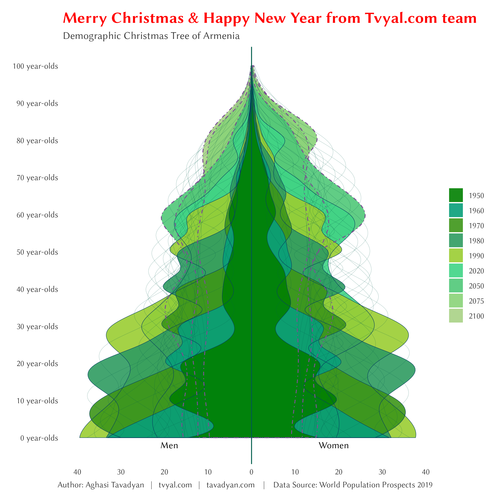

```{r setup, include=FALSE}
knitr::opts_chunk$set(echo = TRUE)

library(tidyverse)
library(wpp2019)
library(scales)

# rm(list = ls()); gc()

setwd(dirname(rstudioapi::getActiveDocumentContext()$path))

source("../../initial_setup.R")

```

```{r, include=FALSE}
data(pop)
data(popMT)
data(popFT)
data(popM)
data(popF)

data(popproj)
data(popproj80l)
data(popproj80u)
data(popproj95l)
data(popproj95u)
data(popprojHigh)
data(popprojLow)

data(popMTproj)
data(popFTproj)

data(popMprojMed)
data(popFprojMed)
data(popMprojHigh)
data(popFprojHigh)
data(popMprojLow)
data(popFprojLow)
```


```{r, include=FALSE}
convert_population <- function(tbl, value){
  tbl %>% 
    as_tibble() %>% 
    pivot_longer(
      matches("\\d{4}"), names_to = "year",
      values_to = value
    ) %>% 
    mutate(
      year = as.numeric(year)
    )
}


combine_datasets <- function(data_sets, join_by){
  
  pop_forecast = NULL
  for (i in 1:length(data_sets)) {
    
    dataset_name <- 
      names(data_sets)[i]
    
    table_converted <- 
      data_sets[[i]] %>% 
      convert_population(dataset_name)
    
    if (is.null(pop_forecast)) {
      pop_forecast <- 
        table_converted
    } else {
      pop_forecast <- 
        full_join(
          pop_forecast, table_converted, 
          by = join_by
        )
    }
  }
  
  return(pop_forecast)
}
```


```{r, include=FALSE}
datasets <- list(
  pop = pop,
  popMT = popMT,
  popFT = popFT,
  popproj = popproj, 
  popproj80l = popproj80l,
  popproj80u = popproj80u,
  popproj95l = popproj95l,
  popproj95u = popproj95u, 
  popprojHigh = popprojHigh,
  popprojLow = popprojLow,
  popMTproj = popMTproj,
  popFTproj = popFTproj
)

pop_forecast <- 
  combine_datasets(datasets, join_by = c("country_code", "name", "year"))

# pop_forecast %>% view()


datasets2 <- list(
  popM = popM,
  popF = popF,
  popMprojMed = popMprojMed,
  popFprojMed = popFprojMed,
  popMprojHigh = popMprojHigh,
  popFprojHigh = popFprojHigh,
  popMprojLow = popMprojLow,
  popFprojLow = popFprojLow
)

pop_forecast_age_gender <- 
  combine_datasets(datasets2, join_by = c("country_code", "name", "year", "age"))


rm(datasets, datasets2,
   pop, popMT, popFT, popproj, popproj80l, popproj80u, popproj95l, popproj95u, 
   popprojHigh, popprojLow, popMTproj, popFTproj,
   
   popM, popF, popMprojMed, popFprojMed, popMprojHigh, popFprojHigh,
   popMprojLow, popFprojLow)

``` 


```{r, include=FALSE}

tree_colors <- c("#A8D185", "#8AD378", "#50C878", "#3FD485", "#9ACD32", "#2F9B61", "#3D9618", "#089E79", "#008000")

demographic_tree_plot_data <-
  pop_forecast_age_gender |> 
  rename(country = name) |> 
  filter(
    country %in% "Armenia"
    # country %in% c("Armenia", "Russian Federation", "China"),
    # country %in% c("Armenia", "Azerbaijan", "Georgia"),
    # country %in% c("World")
  ) |> 
  mutate(
    age = str_replace_all(age, "(\\d+)[-+].*", "\\1") |> parse_number()
  ) |> 
  mutate(
    popM = ifelse(is.na(popM), -popMprojMed, -popM),
    popF = ifelse(is.na(popF), popFprojMed, popF)
  ) |> 
  select(year, age, popM, popF, country) |> 
  pivot_longer(c(popM, popF)) |> 
  group_by(year, name) |> 
  nest(data = c(age, value)) |> 
  mutate(
    data = map(data, ~ as.data.frame(spline(.x$age, .x$value, n = 200)))
  ) |> 
  unnest(data) |> 
  ungroup() |> 
  rename(age = x, value = y) |> 
  mutate(
    age2 = ifelse(name == "popM", -age, age),
    value = value / 5
    ) |> 
  arrange(desc(year), name, age2) |> 
  mutate(
    color_ = case_when(
      year %in% c(1950, 1960, 1970, 1980, 1990, 2020) ~ "Actual Data",
      year %in% c(2050, 2075, 2100) ~ "Projection",
      TRUE ~ ""
    ),
    fill_ = ifelse(color_ != "", year, ""),
    fill_ = fct_rev(fill_)
  )


text_anntotations <- 
  demographic_tree_plot_data |> 
  group_by(country) |> 
  summarise(value = max(value)/2) |> 
  crossing(
    text = c("Men", "Women")
  ) |> 
  mutate(
    value = ifelse(text == "Men", -value, value),
    age = -2
  )


ggplot() +
  geom_polygon(
    data = demographic_tree_plot_data |> filter(fill_ != ""),
    mapping = aes(
      value, age, 
      fill = fill_
    ),
    alpha = 0.9
  ) +
  geom_path(
    data = demographic_tree_plot_data,
    mapping = aes(
      value, age, 
      color = color_,
      linetype = color_,
      linewidth = color_
    )
  ) +
  geom_text(
    data = text_anntotations,
    mapping = aes(value, age, label = text)
  ) +
  geom_vline(xintercept = 0, color = "#005C4B") +
  # facet_wrap(~country, scales = "free_x", nrow = 1) +
  scale_x_continuous(
    labels = function(x) formatC(abs(x), big.mark = " ", format = "f", digits = 0),
    n.breaks = 9, 
    # position = "top"
  ) +
  scale_y_continuous(
    breaks = seq(0,100,10), labels = number_format(suffix = " year-olds"),
  ) +
  scale_fill_manual(
    values = tree_colors
    # values = c(
    #   "#FFCC6C", "#FF9C0E", "#FC7150", "#E85776", "#B7508E",
    #   "#795192", "#3B4C80", "#05405F", "#005C4B"
    # )
  ) +
  # theme_void() +
  scale_color_manual(values = c("#005C4B", "#05405F", "#795192")) +
  scale_linetype_manual(values = c(1, 1, 4)) +
  scale_linewidth_manual(values = c(0.05, 0.2, 0.5)) +
  guides(fill = guide_legend(reverse = TRUE, order = 1)) +
  labs(
    x = NULL, y = NULL, color = NULL, fill = NULL, linetype = NULL, linewidth = NULL,
    title = "Merry Christmas & Happy New Year from Tvyal.com team",
    subtitle = "Demographic Christmas Tree of Armenia",
    caption = caption_f(language = "eng", source = "World Population Prospects 2019")
  ) +
  guides(
    color = "none",
    linetype = "none",
    linewidth = "none",
  ) +
  theme(
    legend.position = "right",
    legend.direction = "vertical",
    legend.box = "horizontal",
     plot.title = element_text(color = "#FF0000"), 
    panel.grid.major.x = element_blank(),
    panel.grid.major.y = element_blank(),
  )

ggsave("plots/tree_2024.png", ggplot2::last_plot(), width = 8, height = 8)


```


**Հարգելի գործընկեր,**

## **Շնորհավոր Ամանոր և Սուրբ Ծնունդ**
## **Merry Christmas & Happy New Year**

🎄🎅🎁✨🔔🕯️🦌🎉🍪🥛⛄🌨️🧤🧣🍬🍭

Շնորհակալ եմ որ հետևում եք մեր գործունեությանը ([կայքի հղումը](https://www.tvyal.com/newsletter/2024/2024_12_30))

Thanks for your time and for hanging with us ([link to the website](https://www.tvyal.com/newsletter/2024/2024_12_30))



Երկու խոսք գծապատկեր-բացիկի մասին։ Գծապատկերը ՀՀ դեմոգրաֆիկ ծառն է՝ 1950 թվականից սկսած մինչև 2100 թվականի կանխատեսումը` ներկայացված որպես տոնածառ։

### ***Թող 2025 թվականը բացի նոր հնարավորությունների և հաջողությունների դռներ Ձեր առջև։***

## Ամփոփենք տարին

Այս տարվա ընթացքում մենք ստեղծել ենք․

* [ավելի քան 45 վերլուծություն](https://www.tvyal.com/newsletter) ⏳
* [ավելի քան 16 հազար տող կոդ](https://github.com/tavad/tvyal_newsletter/tree/main/2024) 💻
* ավելի քան 200 գծապատկեր 📊
* 1950 էլ փոստ բաժանորդագրվածների ցանկում, նախորդ տարվա վերջի 950-ի համեմատ 📬
* Ավելի քանի 75 ԶԼՄ հաղորդակցություն

## Let's Summarize the Year

This year we have created:

* [more than 45 analyses](https://www.tvyal.com/newsletter) ⏳
* [more than 16 thousand lines of code](https://github.com/tavad/tvyal_newsletter/tree/main/2024) 💻
* more than 200 charts 📊
* 1950 subscribers in the mailing list, compared to 950 at the end of last year 📬
* More than 75 media communications

-----


## *Ապագա պլաններ*

Մեր թիմը նպատակադրված է առաջիկա տարվա ընթացքում հասնել հետևյալ նպատակներին․

1. Կայքի ամբողջական թարմացում։ Անգլերեն և ռուսերեն լեզուների լիարժեք ընդգրկում։ Քոմենթների և ինտերակտիվ այլ համակարգերի ներդնում։ 

2. [tvyal.com](https://www.tvyal.com/) հարթակը պլանավորում ենք դարձնել բոլոր հայկական (և ոչ միայն) տվյալների նորմալիզացված պորտալը, որտեղ հիմնականում անվճար նորմալիզացված տվյալներ հնարավոր կլինի ներբեռնել նաև API-ով, որը հետագայում հասանելի կլինի JS, Python, R և այլ լեզուների գրադարաններում։ Նշեմ, որ Armstat, CBA, cadastre.am և այլ պորտալների կողմից տրամադրվող տվյալները խառն են և չունեն ստանդարտիզացված կառուցվածք, տվյալներից շատերը PDF ֆորմատով են կամ ամսական տրվող առանձին աղյուսակներում, որոնք անհրաժեշտ է մաքրել և միավորել ժամանակային շարք ստանալու համար։ Բոլոր տվյալները պետք է ունենան նորմալիզացված, մաքուր տեսք:
   
* Նշենք, որ [tvyal.com](https://www.tvyal.com/) հարթակն իր գործունեությամբ արդեն իսկ այդ տվյալներից շատերի ավտոմատիզացված ներբեռնումը, մաքրումը և նորմալիզացված տվյալների բազա ստեղծելը կատարել է։ Տվյալների 70-90 տոկոսը հարթակում անվճար է լինելու։

3. Պլանավորվում է շարունակել շաբաթական անվճար վերլուծությունները։ Սակայն ապագայում դրվելու է վերլուծության հիմնական մասը։ Որոշ զգայուն վերլուծություններ կամ վերլուծությունների ավելի խորը ներկայացումը վճարովի է լինելու։ Ամենայն հավանականությամբ գրանցումով ու ամսական վճարով, որը նաև ներառելու է նախորդ կետում նշած բոլոր տվյալներից API-ով օգտվելու հնարավորությունը։

4. Պլանների մեջ կա նաև փոխարժեքի տվյալների լիարժեք ներկայացումը։ Արդեն 1 տարի է, ինչ մենք ավտոմատիզացված ստանում ենք այդ տվյալները։ Պլանավորվում է գրաֆիկական ներկայացում դնել փոխարժեքի վերջին բոլոր տվյալների։

5. Պլանավորվում է մեծացնել ստորաբաժանումը, որը զբաղված կլինի հայկական ու այլ պետությունների կազմակերպությունների տվյալների մշակմամբ, համակարգմամբ, դրանցից արժեք քաղելով, ավտոմատիզացմամբ, կանխատեսմամբ և այլն։


-----

# ՀԱՄԱԳՈՐԾԱԿՑՈՒԹՅՈՒՆ

<style>
.ai-services-banner-tvyal {
background-color: #0a192f;
color: #e6f1ff;
padding: 30px;
font-family: Arial, sans-serif;
border-radius: 10px;
box-shadow: 0 4px 6px rgba(0, 0, 0, 0.1);
position: relative;
overflow: hidden;
min-height: 400px;
display: flex;
flex-direction: column;
justify-content: center;
}
.ai-services-banner-tvyal::before {
content: '';
position: absolute;
top: -25%;
left: -25%;
right: -25%;
bottom: -25%;
background: repeating-radial-gradient(
circle at 50% 50%,
rgba(100, 255, 218, 0.1),
rgba(100, 255, 218, 0.1) 15px,
transparent 15px,
transparent 30px
);
animation: gaussianWaveTvyal 10s infinite alternate;
opacity: 0.3;
z-index: 0;
}
@keyframes gaussianWaveTvyal {
0% {
transform: scale(1.5) rotate(0deg);
opacity: 0.2;
}
50% {
transform: scale(2.25) rotate(180deg);
opacity: 0.5;
}
100% {
transform: scale(1.5) rotate(360deg);
opacity: 0.2;
}
}
.ai-services-banner-tvyal > * {
position: relative;
z-index: 1;
}
.ai-services-banner-tvyal h2,
.ai-services-banner-tvyal h3 {
margin-bottom: 20px;
color: #ccd6f6;
}
.ai-services-banner-tvyal ul {
margin-bottom: 30px;
padding-left: 20px;
}
.ai-services-banner-tvyal li {
margin-bottom: 10px;
}
.ai-services-banner-tvyal a {
color: #64ffda;
text-decoration: none;
transition: color 0.3s ease;
}
.ai-services-banner-tvyal a:hover {
color: #ffd700;
text-decoration: underline;
}
</style>

<div class="ai-services-banner-tvyal">
## [Եթե ուզում եք  AI գործիքներով ձեր տվյալներից օգուտ քաղել` ԴԻՄԵՔ ՄԵԶ](mailto:a@tavadyan.com?subject=Let's Put Data to Work!)

### Մենք առաջարկում ենք

- Extensive databases for finding both international and local leads
- Exclusive reports on the Future of the Armenian Economy
- Work and browser automation to streamline operations and reduce staffing needs
- AI models for forecasting growth and optimizing various aspects of your business
- Advanced dashboarding and BI solutions
- Algorithmic trading

### [Let's Put Your Data to Work!](mailto:a@tavadyan.com?subject=Let's Put Data to Work!)

### [ՄԻԱՑԵՔ ՄԵՐ ԹԻՄԻՆ](mailto:a@tavadyan.com?subject=Work application)
</div>


-----


## ԶԼՄ հաղորդագրություններ

[Դիտեք 1in.am-ին տված իմ վերջին հարցազրույցը, որտեղ ամփոփում եմ 2024-ը։](https://www.youtube.com/watch?v=FqSxs6Hypp4&t=11s)

Հարցազրույցում շոշափվել են հետևյալ թեմաները։

* 🎯 Ո՞րն է մեր տնտեսության զարգացման իրական ուղղությունը արդեն 20 տարի։
* 🎯 Ինչո՞վ է թերի մեր հարկային համակարգը։
* 🎯 Ինչպե՞ս ուժեղացավ Ռուսաստանի ազդեցությունը Հայաստանի տնտեսության վրա։
* 🎯 Ի՞նչ սպասել 2025 թվականին։

<a href="https://youtu.be/FqSxs6Hypp4&t=11s">
  
</a>


---
               

Եթե հնարավոր է, խնդրում եմ այս նյութը ուղարկել նաև այն մարդկանց, ում այն կարծում եք կարող է հետաքրքրել:

Սպասեք հաջորդ հաղորդագրությանը մի շաբաթվա ընթացքում:        


Հարգանքներով,            
Աղասի Թավադյան         
30.12.2024       
[tvyal.com](https://www.tvyal.com/)      
[tavadyan.com](https://www.tavadyan.com/)

---

[Was this email forwarded to you? Subscribe here.](https://www.tvyal.com/subscribe)

[Բաժանորդագրվեք](https://www.tvyal.com/subscribe)

       
---              
               


####### **Ուշադրություն. Ձեր էլ.փոստը մեյլլիսթի մեջ է, որի միջոցով ես կիսվում եմ շաբաթական նյութեր, որոնք հիմնականում ներկայացնում են Հայաստանի տնտեսությունը: Նյութերը ներառում են գծապատկերներ, [տվյալների բազաներ](https://github.com/tavad/tvyal_newsletter), տեսանյութեր, հոդվածներ, [առցանց վահանակներ](https://www.tvyal.com/projects), տնտեսական գործիքներ, կանխատեսումներ և հաշվետվություններ: Եթե ցանկանում եք չեղարկել բաժանորդագրությունը, խնդրում եմ տեղեկացրեք ինձ, և ես կհեռացնեմ ձեր էլ. փոստը ցուցակից: Գրեք նաև եթե ունեք մենկնաբանություններ:**

####### **Important! Your email is part of the mailing list where I share weekly materials primarily focused on the Armenian economy. These materials encompass charts, [databases](https://github.com/tavad/tvyal_newsletter), videos, articles, [online dashboards](https://www.tvyal.com/projects), economic tools, forecasts, and reports. If you wish to unsubscribe, please let me know, and I will remove your email from the list. Please share your comments as well․**

