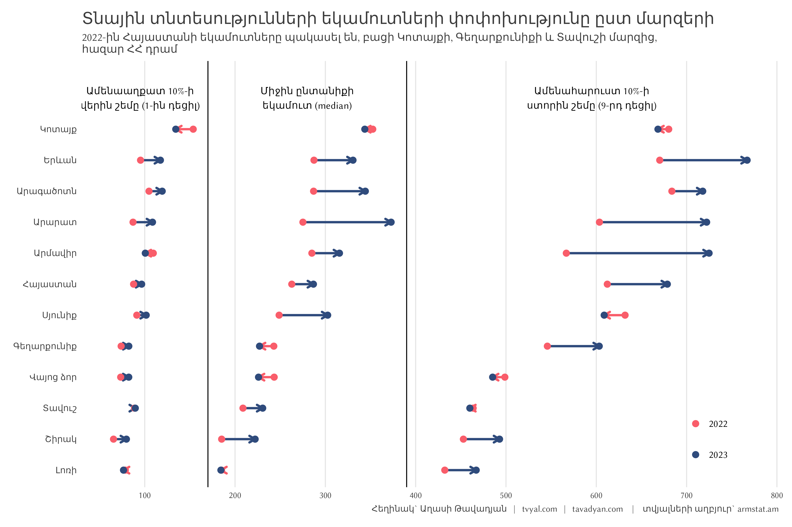
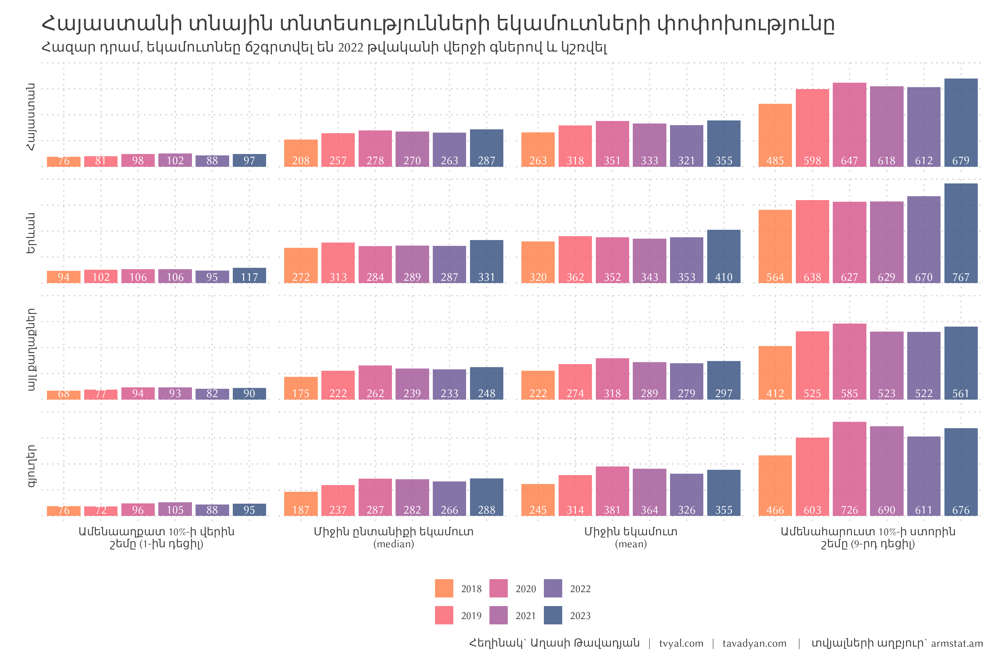
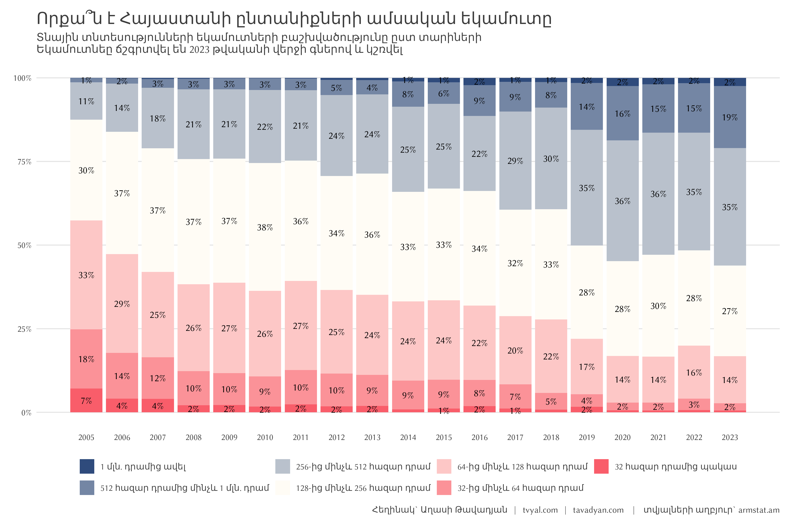
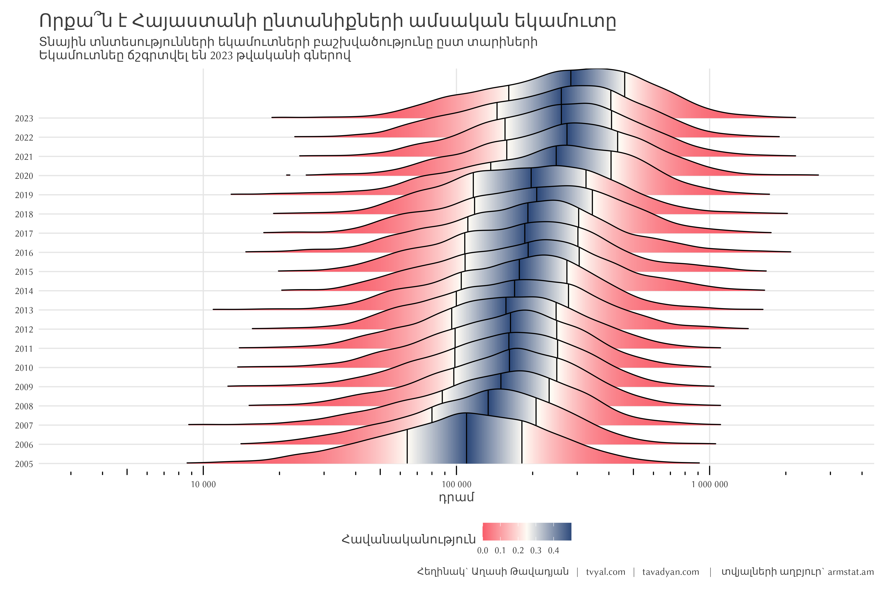

```{r setup, include=FALSE}
knitr::opts_chunk$set(echo = TRUE)

library(tidyverse)
library(scales)
library(readxl)
library(Hmisc)
library(ggridges)

# rm(list = ls()); gc()

setwd(dirname(rstudioapi::getActiveDocumentContext()$path))

source("../../initial_setup.R")

```


```{r data download, include=FALSE}
# Household database is aggregated from this official source:
# https://www.armstat.am/en/?nid=205

household_income_db <- read_csv("household_income_db.csv")

# consumer price index is downloaded from cba.am:
# https://www.cba.am/en/sitepages/statrealsector.aspx
# commencement and run only to update the database

# system(
#   paste0(
#     "curl \"", "https://www.cba.am/stat/stat_data_eng/6_CPI_eng.xls", "\"",
#     " -o ", "\"cpi_armenia_eng.xls\""
#   )
# )

inflation_row <- read_excel("cpi_armenia_eng.xls", skip = 3)

inf_cumprod <- 
  inflation_row |> 
  rename(date = 1, cpi_m = 2) |> 
  select(date, cpi_m) |> 
  mutate(
    date = ym(date),
    cpi_m = cpi_m / 100,
    year = year(date)
  ) |> 
  filter(year <= 2023) |>
  select(-year) |> 
  arrange(desc(date)) |> 
  mutate(
    adj_price = cumprod(cpi_m),
    adj_price = lag(adj_price),
    adj_price = ifelse(is.na(adj_price), 1, adj_price)
  )

marz_dict <- 
  tibble(
    marz = 1:12,
    marz_eng = c(
      "Yerevan", "Aragatsotn", "Ararat", "Armavir", "Gegharkunik", "Lori", 
      "Kotayk", "Shirak", "Syunik", "Vayots Dzor", "Tavush", "Armenia"
    ),
     marz_arm = c(
      "Երևան", "Արագածոտն", "Արարատ", "Արմավիր", "Գեղարքունիք", "Լոռի",
       "Կոտայք", "Շիրակ", "Սյունիք", "Վայոց ձոր", "Տավուշ", "Հայաստան"
    )
  )
```


```{r income_table, include=FALSE}
income_table <- 
  household_income_db |> 
  left_join(inf_cumprod, by = "date") |> 
  mutate(totincome = totincome * adj_price) |> 
  filter(marz == 1) |>
  group_by(year) |> 
  summarise(
    q10 = wtd.quantile(totincome, weight, probs = 0.1),
    median = wtd.quantile(totincome, weight, probs = 0.5),
    mean = sum(totincome*weight)/sum(weight),
    q90 = wtd.quantile(totincome, weight, probs = 0.9),
  ) |> 
  mutate(
    across(-year, ~number(.x/1000, accuracy = 1))
  ) |> 
  knitr::kable(
    align = c("l", "r", "r", "r", "r"),
    col.names = c(
      "Տարի", "Ամենաաղքատ 10%-ի վերին շեմը (1-ին դեցիլ)",
      "Միջին ընտանիքի եկամուտ (median)",
      "Միջին եկամուտ (mean)", "Ամենահարուստ 10%-ի ստորին շեմը (9-րդ դեցիլ)"
    ),
    caption = "**Հայաստանի տնային տնտեսությունների եկամուտների փոփխությունը\nհազար դրամ, եկամուտնեը ճշգրտվել են 2023 թվականի վերջի գներով և կշռվել**",
    label = paste0(caption_arm, "    |    տվյալների աղբյուր` armstat.am"),
    col.width = c("5cm", "2cm", "2cm")
  )
  
```


```{r 2021 2022 change, include=FALSE}

years_select = c(2022, 2023) # provide 2 consecutive years that are in household_income_db

date_legend <- 
  tibble(
    x = 710, y = c(1.5, 2.5), 
    color = c("#2f4b7c", "#f95d6a"), text = rev(years_select)
  )

plot_household_change_in_2_years <- 
  household_income_db %>%
  bind_rows(
    mutate(., marz = 12)
  ) |> 
  left_join(inf_cumprod, by = "date") |> 
  mutate(totincome = totincome * adj_price) |> 
  group_by(year, marz) |>  
  summarise(
    mean = sum(totincome*weight)/sum(weight),
    median = wtd.quantile(totincome, weight, probs = 0.5),
    q10 = wtd.quantile(totincome, weight, probs = 0.1),
    q90 = wtd.quantile(totincome, weight, probs = 0.9),
  ) |>
  pivot_longer(-c(year, marz)) |> 
  left_join(marz_dict, by = "marz") |> 
  filter(
    year %in% years_select,
    name != "mean"
  ) |> 
  ungroup() |> 
  mutate(
    value = value / 1000,
    year = ifelse(year == min(year), "begining", "end")
  ) |> 
  pivot_wider(names_from = year, values_from = value) |> 
  mutate(
    marz_arm = fct_reorder(marz_arm, (begining + end)/2, .fun = mean),
    marz_eng = fct_reorder(marz_eng, (begining + end)/2, .fun = mean),
    color = ifelse(begining > end, "#f95d6a", "#2f4b7c")
  ) |> 
  ggplot() +
  geom_segment(
    aes(x = begining, xend= end,  y= marz_arm, 
        yend=marz_arm, group = name, color = I(color)),
    linewidth = 1.2,
    lineend = 'round', linejoin = 'round',
   arrow = arrow(length = unit(0.1, "inches"))
  ) +
  geom_point(aes(x=begining, y=marz_arm, color=I("#f95d6a")), size = 3) +
  geom_point(aes(x=end, y=marz_arm, color=I("#2f4b7c")), size = 3) +
  geom_point(data = date_legend, aes(x, y, color = I(color)), size = 3) +
  geom_text(data = date_legend, aes(x + 25, y, label = text)) +
  geom_vline(xintercept = c(170, 390)) +  #dividers are changed manually
  annotate(
    geom = "text", x = c(95, 280, 595), y = 13, #dividers are changed manually
    label = c(
      "Ամենաաղքատ 10%-ի\nվերին շեմը (1-ին դեցիլ)",
      "Միջին ընտանիքի\nեկամուտ (median)",
      "Ամենահարուստ 10%-ի\nստորին շեմը (9-րդ դեցիլ)"
    )
  ) +
  scale_x_continuous(breaks = seq(0, 800, 100), labels = number_format()) +
  scale_y_discrete(expand = c(0.05,0,0.2,0)) +
  labs(
    x = NULL,
    y = NULL,
    color = NULL,
    title = "Տնային տնտեսությունների եկամուտների փոփոխությունը ըստ մարզերի",
    subtitle = "2022-ին Հայաստանի եկամուտները պակասել են, բացի Կոտայքի, Գեղարքունիքի և Տավուշի մարզից,\nհազար ՀՀ դրամ",
    caption = paste0(caption_arm, "    |    տվյալների աղբյուր` armstat.am")
  ) +
  theme(
    panel.grid.major.y = element_blank(),
    panel.grid.major.x = element_line(
      colour = "gray90",
      linetype = 1
    ),
  )
```


```{r income change from 2018 to 2022, include=FALSE}

wealth_change_data <- 
  household_income_db %>%
  bind_rows(
    mutate(., settlement = "Total")
  ) |> 
  left_join(inf_cumprod, by = "date") |> 
  mutate(totincome = totincome * adj_price) |> 
  group_by(year, settlement) |> 
  summarise(
    mean = sum(totincome*weight)/sum(weight),
    median = wtd.quantile(totincome, weight, probs = 0.5),
    q10 = wtd.quantile(totincome, weight, probs = 0.1),
    q90 = wtd.quantile(totincome, weight, probs = 0.9),
  )

plot_household_change_18_23 <- 
  wealth_change_data |> 
  pivot_longer(c(mean, median, q10, q90)) |> 
  filter(year %in% 2018:2023) |> 
  mutate(
    settlement = factor(
      settlement,
      levels = c("Total", "Yerevan", "urban", "rural"),
      labels = c("Հայաստան", "Երևան", "այլ քաղաքներ", "գյուղեր")
    ),
    name = factor(
      name, 
      levels = c("q10", "median", "mean", "q90"),
      labels = c("Ամենաաղքատ 10%-ի վերին\nշեմը (1-ին դեցիլ)", "Միջին ընտանիքի եկամուտ\n(median)",
                 "Միջին եկամուտ\n(mean)", "Ամենահարուստ 10%-ի ստորին\nշեմը (9-րդ դեցիլ)")
    ),
    text = number(value / 1000, accuracy = 1)
  ) |> 
  ggplot(aes(as.factor(year), value, label = text, fill = as.factor(year))) +
  geom_col(alpha = 1) +
  geom_text(aes(y = 50000), color = "white") +
  facet_grid(settlement~name, switch = "both") +
  scale_fill_manual(values = new_palette_colors[7:2]) +
  labs(
    y = NULL,
    x = NULL,
    fill = NULL,
    title = "Հայաստանի տնային տնտեսությունների եկամուտների փոփոխությունը",
    subtitle = "Հազար դրամ, եկամուտնեը ճշգրտվել են 2022 թվականի վերջի գներով և կշռվել",
    caption = paste0(caption_arm, "    |    տվյալների աղբյուր` armstat.am")
  ) +
  guides(fill = guide_legend(nrow = 1)) +
  theme(
    axis.text = element_blank(),
    panel.grid.major.x = element_blank(),
    panel.grid.major.y = element_blank()
  )
```


```{r percentage change, include=FALSE}

plot_household_pct_change <- 
  household_income_db |> 
  select(year, date, weight, marz, totincome) |> 
  left_join(inf_cumprod, join_by(date)) |> 
  mutate(totincome = totincome * adj_price) |>
  mutate(
    income_bin = cut(
      totincome/1000,
      breaks = c(0, 2^(5:10), 1e5),
      include.lowest = TRUE
    )
  ) |> 
  group_by(year) |> 
  # begin weighting data
  count(year, income_bin, wt = weight) |> 
  # end weighting data
  group_by(year) |> 
  extract(income_bin, into = c("lower_cut", "upper_cut"),
          regex = ".(.*),(.*)\\]", remove = FALSE, convert = TRUE) |> 
  mutate(
    pct = n/sum(n),
    label = case_when(
      lower_cut == 0 ~ paste0(upper_cut, " հազար դրամից պակաս"),
      upper_cut == 1e5 ~ paste0(round(lower_cut/1000), " մլն. դրամից ավել"),
      lower_cut == 512 ~ paste0(lower_cut, " հազար դրամից մինչև ",
                                round(upper_cut/1000), " մլն. դրամ"),
      lower_cut > 1000 ~ paste0(round(lower_cut/1000), "-ից մինչև ",
                                round(upper_cut/1000), " մլն. դրամ"),
      TRUE ~ paste0(lower_cut, "-ից մինչև ", upper_cut, " հազար դրամ")
    )
  ) |> 
  arrange(lower_cut) |> 
  mutate(
    label = fct_inorder(label),
    label = fct_rev(label),
    pct_text = ifelse(pct <= 0.01, NA, percent(pct, accuracy = 1))
  ) |> 
  ungroup() |> 
  ggplot(aes(year, pct, fill = label, label = pct_text)) +
  geom_col(alpha = 1) +
  geom_text(position = position_stack(vjust = .5)) +
  scale_x_continuous(breaks = seq(2005, 2023, 1)) +
  scale_y_continuous(labels = percent_format()) +
  # scale_fill_brewer(type = "div", palette = 1, direction = -1) +
  scale_fill_manual(values = colfunc(7)) +
  labs(
    x = NULL,
    y = NULL,
    fill = NULL,
    title = "Որքա՞ն է Հայաստանի ընտանիքների ամսական եկամուտը",
    subtitle = "Տնային տնտեսությունների եկամուտների բաշխվածությունը ըստ տարիների\nԵկամուտնեը ճշգրտվել են 2023 թվականի վերջի գներով և կշռվել",
    caption = paste0(caption_arm, "    |    տվյալների աղբյուր` armstat.am")
  ) +
  theme(
    panel.grid.major.x = element_blank(),
    panel.grid.major.y = element_line(
      colour = "gray90",
      linetype = 1
    ),
  )

```


```{r percentage change 2, include=FALSE}

plot_household_pct_change_2 <-
  household_income_db |> 
  filter(
    year >= 2005,
    totincome != 0,
    !is.na(totincome)
  ) |> 
  select(year, date, marz, totincome, weight) |> 
  left_join(inf_cumprod, join_by(date)) |> 
  mutate(totincome = totincome * adj_price) |> 
  ggplot(aes(
    x = totincome, y = as.factor(year), 
    fill = 0.5 - abs(0.5 - after_stat(ecdf)),
    # weight = weight
  )) +
  stat_density_ridges(
    quantile_lines = TRUE, scale = 3,
    rel_min_height = 0.01,  quantiles = 4, alpha = 0.5,
    geom = "density_ridges_gradient", calc_ecdf = TRUE
  ) +
  scale_x_log10(breaks = 10^(4:6), labels = number_format(), limits = c(10^3.5, 10^6.5)) +
  # scale_fill_viridis_c(name = "Հավանականություն", direction = -1) +
  scale_fill_gradientn(name = "Հավանականություն", colors = rev(colfunc(100))) +
  labs(
    x = "դրամ",
    y = NULL,
    title = "Որքա՞ն է Հայաստանի ընտանիքների ամսական եկամուտը",
    subtitle = "Տնային տնտեսությունների եկամուտների բաշխվածությունը ըստ տարիների\nԵկամուտնեը ճշգրտվել են 2023 թվականի գներով",
    caption = paste0(caption_arm, "    |    տվյալների աղբյուր` armstat.am")
  ) +
  annotation_logticks(base = 10, sides = "b") +
  theme(
    panel.grid.major.x = element_line(
      colour = "gray90",
      linetype = 1
    ),
    panel.grid.major.y = element_line(
      colour = "gray90",
      linetype = 1
    ),
  )
```


```{r, include=FALSE}
# yereven_mean_price <- read_csv("~/R/projects/Cadastre_v0.1/data_prices/data_yerevan_finish.csv")
# 
# household_income_db |> 
#   filter(settlement == "Yerevan") |> 
#   group_by(year) |> 
#   summarise(
#     mean = sum(totincome*weight) / sum(weight),
#     median = wtd.quantile(totincome, weight, probs = 0.5),
#   ) |> 
#   left_join(
#     yereven_mean_price |> 
#       filter(place == "Արաբկիր միջին") |> 
#       group_by(year) |> 
#       summarise(price = mean(price)),
#     by = "year"
#   ) |> 
#   mutate(
#     price = price * 60,
#     months_to_by_a_flat = price / median / 12
#   ) |> 
#   ggplot(
#     aes(year, months_to_by_a_flat)
#   ) +
#   geom_col()


```

```{r, include=FALSE}
# Regional changes analysis 2022-2023
regional_changes <- 
  household_income_db %>%
  left_join(inf_cumprod, by = "date") |> 
  mutate(totincome = totincome * adj_price) |> 
  filter(year %in% c(2022, 2023)) |> 
  group_by(year, marz) |> 
  summarise(
    mean = sum(totincome*weight)/sum(weight),
    median = wtd.quantile(totincome, weight, probs = 0.5),
    q10 = wtd.quantile(totincome, weight, probs = 0.1),
    q90 = wtd.quantile(totincome, weight, probs = 0.9)
  ) |> 
  pivot_wider(
    names_from = year,
    values_from = c(mean, median, q10, q90)
  ) |>
  left_join(marz_dict, by = "marz") |>
  mutate(across(contains("2023"), ~./1000)) |> # Convert to thousands
  mutate(across(contains("2022"), ~./1000)) |> # Convert to thousands
  mutate(
    mean_change = (mean_2023/mean_2022 - 1) * 100,
    median_change = (median_2023/median_2022 - 1) * 100,
    q10_change = (q10_2023/q10_2022 - 1) * 100,
    q90_change = (q90_2023/q90_2022 - 1) * 100
  )

print("Regional changes 2022-2023:")
print(regional_changes)

# Income brackets detailed analysis for 2023
income_brackets_2023 <- 
  household_income_db |> 
  filter(year == 2023) |> 
  left_join(inf_cumprod, by = "date") |> 
  mutate(totincome = totincome * adj_price) |>
  mutate(
    income_bin = cut(
      totincome/1000,
      breaks = c(0, 32, 64, 128, 256, 512, 1000, Inf),
      labels = c("<32K", "32K-64K", "64K-128K", "128K-256K", 
                 "256K-512K", "512K-1M", ">1M")
    )
  ) |> 
  count(income_bin, wt = weight) |> 
  mutate(pct = n/sum(n) * 100)

print("\nIncome brackets distribution 2023:")
print(income_brackets_2023)

inf_cumprod |> 
  mutate(year = year(date)) |> 
  group_by(year) |> 
  summarise(cpi = (prod(cpi_m) - 1) * 100) |> 
  arrange(desc(year))

```


```{r, include=FALSE}

incomes <- 
  household_income_db |> 
  filter(year %in% c(2023)) |> 
  group_by(year) |> 
  summarise(
    mean = sum(totincome*weight)/sum(weight),
    median = wtd.quantile(totincome, weight, probs = 0.5),
    q10 = wtd.quantile(totincome, weight, probs = 0.1),
    q90 = wtd.quantile(totincome, weight, probs = 0.9)
  )


# Creating comparison with basic goods
basic_goods_comparison <-
  tibble(
    item = c(
      "iPhone 15 (128GB)\n300 հազար դրամ", 
      "1 տարվա սնունդ 4 հոգանոց ընտանիքի համար\n(օրական 5 հազար դրամ)",
      "Նոր Toyota Corolla Sedan 1.6l 97kW Comfort\nմիջինը՝ 13.8 մլն դրամ",  
      "Բնակարան Երևանում (60ք.մ.)\nկենտրոնից դուրս՝ միջին ք․մ արժեքը 615 հազար դրամ"
    ),
    price_amd = c(
      300000, 12*30*5000, 13881818, 615355*60
    )
  ) |> 
  mutate(
    months_median = price_amd / (incomes$median),
    months_q10 = price_amd / (100000),
    months_q90 = price_amd / (incomes$q90),
    item = fct_inorder(item)
  )


# Function to format time duration
format_duration <- function(months) {
  years <- floor(months / 12)
  remaining_months <- floor(months %% 12)
  days <- floor((months %% 1) * 30)
  
  if (years > 0) {
    if (remaining_months > 0) {
      return(sprintf("%d տ․ %d ամ․", years, remaining_months))
    } else {
      return(sprintf("%d տ․", years))
    }
  } else if (remaining_months > 0) {
    if (days > 0) {
      return(sprintf("%d ամ․ %d օր", remaining_months, days))
    } else {
      return(sprintf("%d ամ․", remaining_months))
    }
  } else {
    return(sprintf("%d օր", days))
  }
}

# Modify the plot with new formatting
plot_months_to_buy <-
  basic_goods_comparison |> 
  pivot_longer(cols = starts_with("months")) |> 
  mutate(
    name = factor(
      name,
      levels = c("months_q10", "months_median", "months_q90"),
      labels = c("Ցածր եկամուտով\nընտանիք", "Միջին\nընտանիք", "Բարձր եկամուտով\nընտանիք")
    ),
    duration_label = sapply(value, format_duration)
  ) |>
  ggplot(aes(x = name, y = value, fill = name)) +
  geom_col(alpha = 1) +
  facet_wrap(~item, scales = "free") +
  geom_text(aes(y = 0, label = duration_label), vjust = -1, color = "white", size = 4) +
  scale_fill_manual(values = new_palette_colors[c(6,4,2)]) +
  labs(
    title = "Որքա՞ն ժամանակ է պետք ապրելու համար",
    subtitle = "2023թ. տվյալներով, եթե ընտանիքի ամբողջ եկամուտը ուղղվի տվյալ ապրանքի ձեռքբերմանը",
    x = NULL, y = NULL,
    fill = NULL,
    caption = caption_f(source = "Number, Armstat", suffix_text = "\nՑածր եկամուտ՝ 100 հազար դրամ, միջին եակամուտ՝ 285 հազար դրամ, բարձր եկամուտ՝ 674 հազար դրամ")
  ) +
  theme(
    legend.position = "none",
    axis.text.y = element_blank(),
    panel.grid.major.y = element_blank(),
    panel.grid.major.x = element_blank()
  )
  
ggsave("plots/plot_months_to_buy.png", plot_months_to_buy, width = 9, height = 8)
```


```{r, include=FALSE}
# Creating purchasing power comparison across regions
regional_basket <- 
  household_income_db |> 
  filter(year == 2023) |> 
  group_by(marz) |> 
  summarise(median_income = median(totincome) / 1000) |> 
  left_join(marz_dict, by = "marz") |> 
  mutate(
    bread = median_income / 0.6,    # հաց 600 դրամ
    meat = median_income / 4,       # 1կգ միս 4000 դրամ
    fuel = median_income / 0.5,     # 1լ բենզին 500 դրամ
    restaurant = median_income / 5   # 1 անգամ ռեստորանում ճաշել 5000 դրամ
  ) |> 
  select(-median_income, -marz) |> 
  pivot_longer(-c(marz_arm, marz_eng)) |> 
  mutate(
    name = factor(
      name,
      levels = c("bread", "meat", "fuel", "restaurant"),
      labels = c("Հաց (հատ)", "Միս (կգ)", "Բենզին (լիտր)", "Ռեստորան (անգամ)")
    )
  )

plot_purchasing_power <- 
  regional_basket |> 
  ggplot(aes(x = value, y = reorder(marz_arm, value), fill = name)) +
  geom_col() +
  facet_wrap(~name, scales = "free_x") +
  geom_text(aes(label = round(value)), hjust = -0.1) +
  scale_fill_brewer(palette = "Set2") +
  labs(
    title = "Ի՞նչ կարող եք գնել միջին աշխատավարձով տարբեր մարզերում",
    subtitle = "2023թ. միջին ամսական եկամտով",
    x = "Քանակ", y = NULL,
    fill = NULL
  ) +
  theme(legend.position = "none")
```


```{r, include=FALSE}
# Creating winners and losers visualization
income_changes_summary <- 
  regional_changes |> 
  select(marz_arm, mean_change) |> 
  mutate(
    direction = if_else(mean_change > 0, "Աճ", "Նվազում"),
    marz_arm = fct_reorder(marz_arm, mean_change)
  )

plot_winners_losers <- 
  income_changes_summary |> 
  ggplot(aes(x = mean_change, y = marz_arm, fill = direction)) +
  geom_col() +
  geom_text(
    aes(label = paste0(round(mean_change, 1), "%"),
        hjust = if_else(mean_change > 0, -0.1, 1.1))
  ) +
  scale_fill_manual(values = c("Աճ" = "#2f4b7c", "Նվազում" = "#f95d6a")) +
  labs(
    title = "Որտե՞ղ են եկամուտներն ամենաշատը փոխվել",
    subtitle = "2023թ. փոփոխությունը 2022-ի համեմատ",
    x = "Փոփոխություն (%)", y = NULL,
    fill = NULL
  )
```


```{r, include=FALSE}
living_standards_table <- 
  tibble(
    category = c(
      "Նվազագույն սպառողական զամբյուղ",
      "Վարձով ապրող ընտանիքի նվազագույն ծախսեր",
      "Հարմարավետ կյանքի համար անհրաժեշտ եկամուտ",
      "Միջին եկամուտ (2023)",
      "Միջին եկամուտ Երևանում (2023)"
    ),
    amount = c(
      85000, 250000, 500000, 410000, 450000
    ),
    description = c(
      "Սնունդ, կոմունալ, տրանսպորտ",
      "Զամբյուղ + վարձ + տարրական ժամանց",
      "Զամբյուղ + վարձ + ժամանց + խնայողություններ",
      "Փաստացի միջին եկամուտ",
      "Փաստացի միջին եկամուտ մայրաքաղաքում"
    )
  ) |> 
  knitr::kable(
    col.names = c("Կատեգորիա", "Գումար (դրամ)", "Նկարագրություն"),
    caption = "Կյանքի արժեքը Հայաստանում (2023թ.)"
  )
```


```{r save plots, include=FALSE}

ggsave("plots/plot_household_change_in_2_years.png", plot_household_change_in_2_years, width = 12, height = 8)
ggsave("plots/plot_household_change_18_23.png", plot_household_change_18_23, width = 12, height = 8)
ggsave("plots/plot_household_pct_change.png", plot_household_pct_change, width = 12, height = 8)
ggsave("plots/plot_household_pct_change_2.png", plot_household_pct_change_2, width = 12, height = 8)

# ggsave("plots/plot_loans_per_capita.png", plot_loans_per_capita, width = 12, height = 8)

system("cd ../.. | git all")

```


***English summary below.***

## [🏠💰📉 Տնային տնտեսությունները աղքատացել են](https://www.tvyal.com/newsletter/2025/2025_01_06)

2022-ին գրանցվել է 12.6 տոկոս տնտեսական աճ, մեկ շնչին ընկնող ՀՆԱ-ն աճել է 4 972 դոլարից մինչև 7 018 դոլար, այսինքն 41 տոկոսով, սակայն ժողովրդի իրակական եկամուտները ընկել են։

2021-ին տնային տնտեսությունների միջին ճշգրտված եկամուտը կազմել էր 333 հազար դրամ, իսկ 2022-ին՝ 320 հազար դրամ։ Բնակչության ամենաաղքատ 10% շեմը ստանում էր մինչև 101 հազար դրամ 2021 թվականին, իսկ 2022-ին՝ արդեն 88 հազար դրամ:

Առաջին գծապատկերում տողերը ներկայացնում են մարզերը, իսկ սյուները հասարակության խավերը (անապահով խավ, միջին խավ և հարուստներ)։ Եթե գիծը կարմիր է, ապա նախորդ տարվա համեմատ եկամուտները պակասել են, եթե կապույտ ապա՝ աճել։

Գծապատկեր 1.
<!-- Տնային տնտեսությունների համախառն եկամուտների փոփոխությունը ըստ մարզերի -->



Տնային տնտեսությունների եկամուտները 2022 թվականին պակասել են բոլոր մարզերում բացի Կոտայքի, Գեղարքունիքի և Տավուշի մարզերից։

Երևանում և Արագածոտնում 2022 թվականին հարուստները ավելի են հարստացել, իսկ աղքատները ավելի են աղքատացնել։

Մնացած մարզերում, ինչպես նաև ամբողջ Հայաստանի համար, բոլոր խավերի եկամուտները համեմատած 2021 թվականի հետ պակասել են։

Դիտարկենք տնային տնտեսությունների եկամուտների փոփոխությունը 2018 թվականից սկսած։ Ինչպես երևում է գնաճով ճշգրտված եկամուտները Հայաստանի համար ամենաբարձր կետում էին 2020 թվականին, միջին վիճակագրական ընտանիքը ստանում էր ամսական 278 հազար դրամ (2022 տարեվերջի գներով): Երկու տարվա ընթացքում միջին ընտանիքի եկամուտը ընկել է 15 հազար դրամով՝ մինչև 263 հազար դրամ։ Երևանում միջին ընտանիքի եկամտաբերությունը չի փոխվել այս 2 տարիների ընթացքում, այն հիմականում ընկել է մարզերում։ Նշված 2 տարիների ընթացքում եկամուտի աճ են գրանցել Երևանի հարուստ խաղվի ներկայացուցչները (9-րդ դեցիլ), որոնց ընտանեկան իրական եկամուտի շեմը բարձրացել է 629 հազարից 2022 թվականին մինչև 671 հազար դրամ։

Գծապատկեր 2.
<!-- Հայաստանի տնային տնտեսությունների եկամուտների փոփոխությունը 2018-ից 2022 թվականներին -->




Հաջորդ գծապատկերը համեմատում է գնաճով ճշգրտված տնային տնտեսությունների տարեկան եկամուտները 2005 թվականից սկսած։ Եկամուտները բաժանվել են աճողական զամբյուղների։ 

Գծապատկեր 3.
<!-- Որքա՞ն է Հայաստանի ընտանիքների ամսական եկամուտը -->



Ինչպես երևում է գծապատկերից մինչև 128 հազար դրամ ստացողները 3.5 տոկոսային կետով աճել են համեմատած 2021-ի։ 128-256 հազար դրամ ստացողների թիվը կրճատվել է 1.9 տոկոսային կետով։

Տվյալները առկա են 2005 թվականից։ Գծապատկերից նաև երևում է որ 2005 թվականից տնային տնտեսություններ գնաճով ճշգրտված եկամուտները գրանցել են կայուն աճ։ Ըստ տվյալների տնային տնտեսությունների իրական եկամուտները ամենամեծ աճն են արձանագրել 2006 և 2007, ինչպես նաև 2019 թվականին։

Անվանական եկամուտների աճ գրանցվել է նաև 2021 և 2022 թվականներին, սակայն այդ տարիներին գրանցվել է համապատասխանաբար 7.2 և 8.6 տոկոս գնաճ, որը զգալի իջեցրել է իրական եկամուտները։ Սա նշանակում է որ 2022 թվականի վերջին աշխատավարձերը դեռ չեն հասել գնաճի տեմպին և 2022 թվականին գրանցված 12.6 տոկոս տնտեսական աճը դեռ չի անդրադարձել տնային տնտեսությունների եկամուտների կամ աշխատավարձերի աճի վրա։ Նշեմ որ 2023 թվականի վերջին գրանցվել է գրեթե զրոյական գնաճ։ Զրոյական գնաճի տեսակետը ներկայացված է [տեսանյութում](https://youtu.be/Va5q9efWaI4)։

Երրորդ գծապատկերում ներկայացված միտքը այլընտրանքային կերպով արտացոլում է նաև հաջորդ գծապատկերը։

**Գծապատկեր 4.** 
<!-- Որքա՞ն է Հայաստանի ընտանիքների ամսական եկամուտը, այլընտրանքային հայացք -->



Այղուսակի տեսքով ներկայացնենք նաև տնային տնտեսությունների եկամուտների փոփոխությունը տարիների ընթացքում։

```{r, echo=FALSE, fig.width = 6}
income_table
```


Տվյալները վերցված են պաշտոնական աղբյուրներից, մասնավորապես՝ [տնային տնտեսությունների կենսամակարդակի (կենսապայմանների) ամբողջացված հետազոտության անվանազերծված միկրոտվյալների բազա (ըստ տնային տնտեսությունների)](https://www.armstat.am/en/?nid=205) և [Հայաստանի սպառողական գների ամսական ինդեքսը](https://www.cba.am/stat/stat_data_arm/6_CPI_arm.xls): Տնային տնտեսությունների կենսամակարդակի ցուցանիշները ճշգրտվել են ամսական կումուլատիվ գնաճով, այսինքն յուրաքանչյուր ցուցանիշ ներկայացնում է 2023 թվականի վերջի գնողունակությունը։ Ցուցանիշները նաև կշռվել են։ Հաշվարկները կարելի է ստուգել այցելելով [github-ի](https://github.com/tavad/tvyal_newsletter) մեր էջը, որտեղ տրված են տվյալները, հաշվարկների և գծապատկերների կոդը։ 


***English summary below.***

## [🏠💰📈 Հայաստանի տնտեսական վերելքը արտացոլվում է տնային տնտեսությունների եկամուտներում](https://www.tvyal.com/newsletter/2025/2025_01_06)

2023 թվականը նշանավորվեց հայաստանցիների իրական եկամուտների աննախադեպ աճով: Նախորդ տարվա անկումից հետո, երբ բարձր գնաճը (8.3%) էապես նվազեցրել էր իրական եկամուտները, 2023-ին գների կայունությունը (-0.6% գնաճ) և տնտեսական աճը հանգեցրին կենսամակարդակի զգալի բարելավման:

Միջին ընտանիքի ճշգրտված եկամուտը աճել է 15.3%-ով՝ 287 հազար դրամից հասնելով 331 հազար դրամի: Առավել ուշագրավ է, որ բնակչության ամենաաղքատ 10%-ի վերին շեմը աճել է 23.2%-ով՝ 95 հազար դրամից հասնելով 117 հազար դրամի: Միևնույն ժամանակ, ամենահարուստ 10%-ի ստորին շեմը աճել է 14.5%-ով՝ 670 հազար դրամից հասնելով 767 հազար դրամի:

### Տարածաշրջանային անհավասարություն

Սակայն այս աճը հավասարաչափ չի բաշխվել ըստ մարզերի: Արարատի մարզում գրանցվել է տպավորիչ 35.5% աճ միջին եկամտում, մինչդեռ Վայոց Ձորում նկատվել է 7.1% անկում: Երևանում միջին եկամուտն աճել է 15%-ով, ինչը համապատասխանում է հանրապետական միջին ցուցանիշին:

Գծապատկեր 1.
<!-- Տնային տնտեսությունների եկամուտների փոփոխությունը ըստ մարզերի -->

<!--  -->

Հատկանշական է, որ մարզերի միջև եկամուտների անհավասարությունը խորացել է: Եթե 2022-ին ամենաբարձր և ամենացածր միջին եկամուտ ունեցող մարզերի տարբերությունը կազմում էր 172 հազար դրամ, ապա 2023-ին այն հասել է 171 հազար դրամի: Կոտայքի մարզը, որը 2022-ին առաջատար էր ըստ միջին եկամտի (404 հազար դրամ), 2023-ին արձանագրել է 4.2% անկում:

### Եկամտային խմբերի վերադասավորում

2023 թվականի տվյալները ցույց են տալիս եկամտային խմբերի հետաքրքիր վերադասավորում: Ընտանիքների 35.1%-ը գտնվում է միջին-բարձր եկամտային խմբում (256-512 հազար դրամ), ինչը վկայում է միջին խավի ամրապնդման մասին: Միջին-ցածր եկամտային խումբը (128-256 հազար դրամ) կազմում է 27.1%:

Գծապատկեր 2.
<!-- Որքա՞ն է Հայաստանի ընտանիքների ամսական եկամուտը -->

<!--  -->

Հատկանշական է, որ ընտանիքների միայն 2.6%-ն է ստանում 1 միլիոն դրամից բարձր ամսական եկամուտ, մինչդեռ 2.7%-ը դեռևս ապրում է ծայրահեղ ցածր եկամտով (64 հազար դրամից պակաս): Սա վկայում է, որ չնայած ընդհանուր առմամբ դրական միտումներին, դեռևս կան լուրջ մարտահրավերներ աղքատության հաղթահարման ուղղությամբ:

### Պատմական համատեքստ և միտումներ

Վերջին տասնամյակի դինամիկան ցույց է տալիս, որ 2023-ին գրանցված աճը բացառիկ է: 2020-ի համեմատ, երբ նախկին ռեկորդային ցուցանիշն էր, միջին եկամուտն աճել է 47 հազար դրամով:

Գծապատկեր 3.
<!-- Հայաստանի տնային տնտեսությունների եկամուտների փոփոխությունը 2018-ից -->

<!--  -->

Եկամուտների անհավասարությունը թեթևակի նվազել է: 2022-ին ամենահարուստ 10%-ի եկամուտը 7.05 անգամ գերազանցում էր ամենաաղքատ 10%-ի եկամուտը, 2023-ին այս հարաբերակցությունը նվազել է մինչև 6.56: Սա դրական միտում է, թեև անհավասարությունը դեռ բարձր է մնում միջազգային չափանիշներով:

### Գնաճի և իրական եկամուտների փոխկապվածություն

2023-ի իրական եկամուտների աճը մեծապես պայմանավորված էր գների կայունությամբ: Գնաճի զսպումը (-0.6%) թույլ տվեց անվանական աշխատավարձերի աճին ուղղակիորեն արտացոլվել իրական եկամուտների աճի մեջ: Սա հակադրվում է 2022-ի իրավիճակին, երբ 12.6% տնտեսական աճը չէր արտացոլվում տնային տնտեսությունների եկամուտներում՝ բարձր գնաճի (8.3%) պատճառով:

Գծապատկեր 4.
<!-- Եկամուտների բաշխվածության փոփոխությունը -->

<!--  -->

Աղյուսակ 1.
<!-- Եկամուտների փոփոխությունը -->

```{r, echo=FALSE, fig.width = 6}
income_table
```

Տվյալները վերցված են պաշտոնական աղբյուրներից, մասնավորապես՝ [տնային տնտեսությունների կենսամակարդակի (կենսապայմանների) ամբողջացված հետազոտության անվանազերծված միկրոտվյալների բազա](https://www.armstat.am/en/?nid=205) և [Հայաստանի սպառողական գների ամսական ինդեքսը](https://www.cba.am/stat/stat_data_arm/6_CPI_arm.xls): Տնային տնտեսությունների կենսամակարդակի ցուցանիշները ճշգրտվել են ամսական կումուլատիվ գնաճով և կշռվել են: Հաշվարկները կարելի է ստուգել այցելելով github-ի մեր էջը:

### Եզրակացություն

2023 թվականին Հայաստանի տնային տնտեսությունների եկամուտների աճը վկայում է տնտեսության առողջացման մասին: Սակայն մարզային անհավասարությունը և եկամուտների զգալի շերտավորումը մնում են լուրջ մարտահրավերներ: Գների կայունությունը էական դեր է խաղացել իրական եկամուտների աճում, ինչը ընդգծում է մակրոտնտեսական կայունության կարևորությունը կենսամակարդակի բարձրացման համար:


-----

-----

Եթե հնարավոր է, խնդրում եմ այս նյութը ուղարկել նաև այն մարդկանց, ում այն կարծում եք կարող է հետաքրքրել:

**ԱՅՍ ՀՈԴՎԱԾԻ ՀՂՈՒՄԸ**

***Թավադյան, Աղ․Ա․ (2024)․ Անհուսալի վարկառուների աջակցության ծրագիր. պոպուլիստական քայլ, թե՞ տնտեսական անհրաժեշտություն [USupport Program for Unreliable Borrowers: A Populist Move or Economic Necessity?]․ Tvyal.com հարթակ [Tvyal.com platform], 06-01-2025․ https://www.tvyal.com/newsletter/2025/2025_01_06***

**Արգելվում է այս հարթակի նյութերը արտատպել առանց հղում կատարելու։**    

<small>\* Այս և մեր բոլոր այլ վերլուծությունների տվյալները վերցված են պաշտոնական աղբյուրներից։ Հաշվարկները ամբողջությամբ հասանելի են github-ում, դրանք կարելի է ստուգել` այցելելով [github-ի](https://github.com/tavad/tvyal_newsletter/blob/main/2024/) մեր էջը, որտեղ տրված են տվյալները, հաշվարկների և գծապատկերների կոդը։</small>


-----

# ՀԱՄԱԳՈՐԾԱԿՑՈՒԹՅՈՒՆ

<style>
.ai-services-banner-tvyal {
background-color: #0a192f;
color: #e6f1ff;
padding: 30px;
font-family: Arial, sans-serif;
border-radius: 10px;
box-shadow: 0 4px 6px rgba(0, 0, 0, 0.1);
position: relative;
overflow: hidden;
min-height: 400px;
display: flex;
flex-direction: column;
justify-content: center;
}
.ai-services-banner-tvyal::before {
content: '';
position: absolute;
top: -25%;
left: -25%;
right: -25%;
bottom: -25%;
background: repeating-radial-gradient(
circle at 50% 50%,
rgba(100, 255, 218, 0.1),
rgba(100, 255, 218, 0.1) 15px,
transparent 15px,
transparent 30px
);
animation: gaussianWaveTvyal 10s infinite alternate;
opacity: 0.3;
z-index: 0;
}
@keyframes gaussianWaveTvyal {
0% {
transform: scale(1.5) rotate(0deg);
opacity: 0.2;
}
50% {
transform: scale(2.25) rotate(180deg);
opacity: 0.5;
}
100% {
transform: scale(1.5) rotate(360deg);
opacity: 0.2;
}
}
.ai-services-banner-tvyal > * {
position: relative;
z-index: 1;
}
.ai-services-banner-tvyal h2,
.ai-services-banner-tvyal h3 {
margin-bottom: 20px;
color: #ccd6f6;
}
.ai-services-banner-tvyal ul {
margin-bottom: 30px;
padding-left: 20px;
}
.ai-services-banner-tvyal li {
margin-bottom: 10px;
}
.ai-services-banner-tvyal a {
color: #64ffda;
text-decoration: none;
transition: color 0.3s ease;
}
.ai-services-banner-tvyal a:hover {
color: #ffd700;
text-decoration: underline;
}
</style>

<div class="ai-services-banner-tvyal">
## [Եթե ուզում եք ձեր տվյլներից օգուտ քաղել AI գործիքներով` ԴԻՄԵՔ ՄԵԶ](mailto:a@tavadyan.com?subject=Let's Put Data to Work!)

### Մենք առաջարկում ենք

- Extensive databases for finding both international and local leads
- Exclusive reports on the Future of the Armenian Economy
- Work and browser automation to streamline operations and reduce staffing needs
- AI models for forecasting growth and optimizing various aspects of your business
- Advanced dashboarding and BI solutions
- Algorithmic trading

### [Let's Put Your Data to Work!](mailto:a@tavadyan.com?subject=Let's Put Data to Work!)

### [ՄԻԱՑԵՔ ՄԵՐ ԹԻՄԻՆ](mailto:a@tavadyan.com?subject=Work application)
</div>


-----


## ԶԼՄ հաղորդագրություն


[Դիտեք news.am-ին տրված իմ ակնարկը այս թեմայի մասին](https://youtu.be/WbS1mjPK1Qw)

📺 Նախընտրական կաշա՞ռք. ինչու է Փաշինյանն օգնում անհուսալի վարկառուներին 📺

<a href="https://youtu.be/WbS1mjPK1Qw">
  
</a>

[Դիտեք 1in.am-ին տրված հարցազրույցը 2025 թվականի հարկային փոփոխությունների մաիսն](https://youtu.be/tqXdEhCI3ok?t=11)

📺 Կառավարության ընդունած հարկային փոփոխություններն ավելի է վատացնելու բնակչության սոցիալական վիճակը 📺

<a href="https://youtu.be/tqXdEhCI3ok?t=11">
  
</a>


## English Summary

### 🏠💰📉 2022- A Year of Declining Household Incomes in Armenia

In 2022, household incomes in Armenia witnessed a notable shift, with declines evident in most regions, except for Kotayk, Gegharkunik, and Tavush marzes. Within the capital city, Yerevan, and Aragatsotn, the affluent experienced a rise in income while the less privileged faced a further decrease. A broader analysis of income trends since 2018 reveals that Armenia reached its peak in 2020, with the average monthly household income standing at 278,000 AMD. However, by the end of 2022, this figure dropped by 15,000 drams to 263,000 AMD. Although the income for an average family in Yerevan remained unchanged over the two years, a decline was observed in other marzes. Notably, the top 10% of wealthy families in Yerevan saw an increase in real income from 629,000 to 671,000 drams during this period.

Examining the longer-term perspective, the second chart highlights the evolution of annual household incomes since 2005, categorized into ascending income brackets. Notably, the data reveals a 3.5 percentage point increase in recipients earning up to 128,000 AMD, while the 128,000-256,000 AMD bracket witnessed a 1.9 percentage point reduction. Despite nominal income growth in 2021 and 2022, high inflation rates of 7.2% and 8.6%, respectively, have mitigated real income gains. The disparity is emphasized by the fact that the 12.6% economic growth in 2022 has yet to translate into household income or wage growth, with the impact only starting to show in late 2023 due to almost zero inflation. These insights are supported by an alternative view presented in the fourth diagram, underscoring the intricate relationship between inflation, economic growth, and household income shifts.


---


Հարգանքներով,            
Աղասի Թավադյան         
06.01.2025          
[tvyal.com](https://www.tvyal.com/)      
[tavadyan.com](https://www.tavadyan.com/)

---

[Was this email forwarded to you? Subscribe here.](https://www.tvyal.com/subscribe)

[Բաժանորդագրվեք](https://www.tvyal.com/subscribe)

       
---              
               


####### **Ուշադրություն. Ձեր էլ.փոստը մեյլլիսթի մեջ է, որի միջոցով ես կիսվում եմ շաբաթական նյութեր, որոնք հիմնականում ներկայացնում են Հայաստանի տնտեսությունը: Նյութերը ներառում են գծապատկերներ, [տվյալների բազաներ](https://github.com/tavad/tvyal_newsletter), տեսանյութեր, հոդվածներ, [առցանց վահանակներ](https://www.tvyal.com/projects), տնտեսական գործիքներ, կանխատեսումներ և հաշվետվություններ: Եթե ցանկանում եք չեղարկել բաժանորդագրությունը, խնդրում եմ տեղեկացրեք ինձ, և ես կհեռացնեմ ձեր էլ. փոստը ցուցակից: Գրեք նաև եթե ունեք մենկնաբանություններ:**

####### **Important! Your email is part of the mailing list where I share weekly materials primarily focused on the Armenian economy. These materials encompass charts, [databases](https://github.com/tavad/tvyal_newsletter), videos, articles, [online dashboards](https://www.tvyal.com/projects), economic tools, forecasts, and reports. If you wish to unsubscribe, please let me know, and I will remove your email from the list. Please share your comments as well․**


