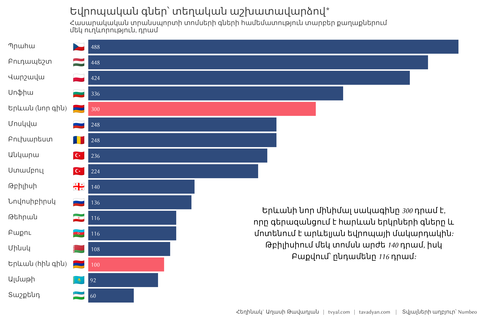
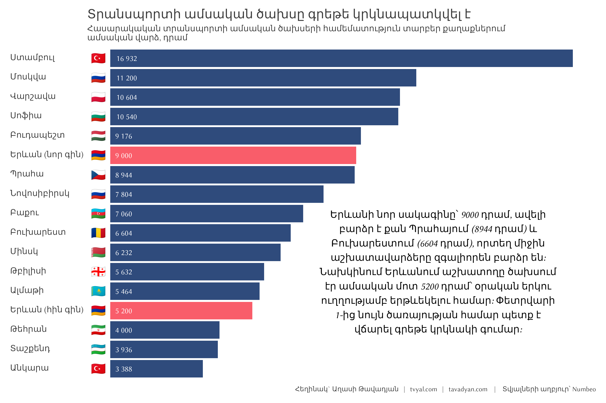
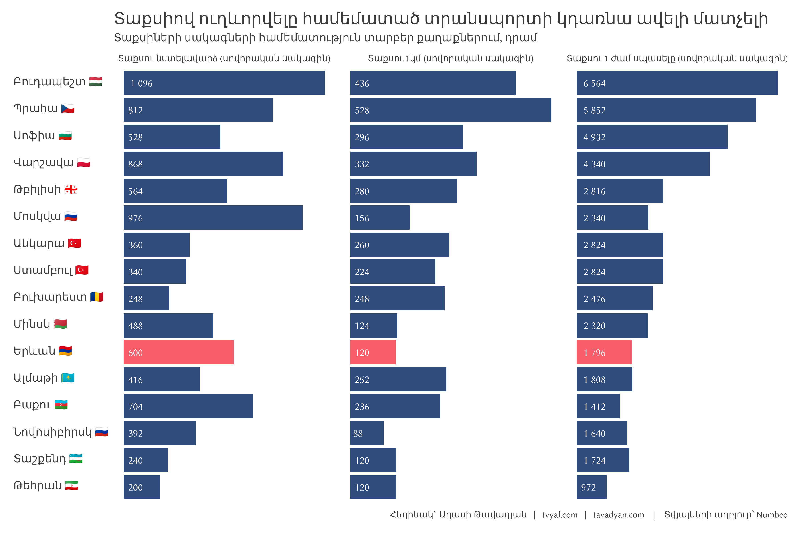
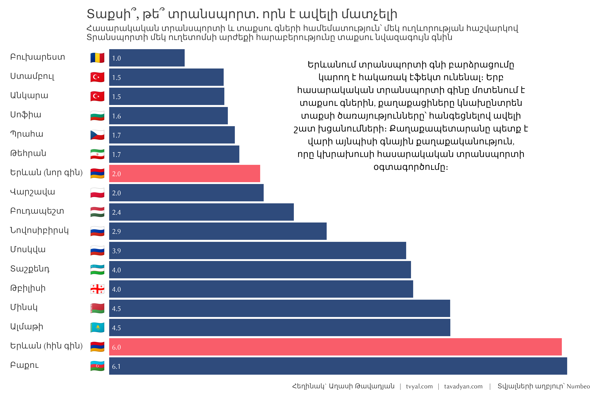
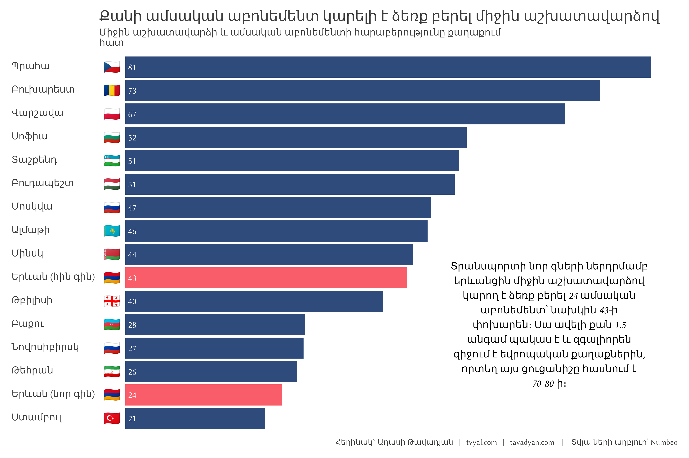

```{r setup, include=FALSE}
knitr::opts_chunk$set(echo = TRUE)

library(tidyverse)
library(scales)
library(countrycode)

# rm(list = ls()); gc()

setwd(dirname(rstudioapi::getActiveDocumentContext()$path))

source("../../initial_setup.R")

system("cd ../.. | git all")

```

***English summary below.***

## [🏠💰📈 Առաջընթացի գինը․ Երևանի հասարակական տրանսպորտի բարեփոխումները և մատչելիության սահմանները](https://www.tvyal.com/newsletter/2025/2025_01_20)

Ավելի քան երկու տասնամյակ Երևանի բնակիչները հասարակական տրանսպորտից օգտվելու համար վճարում էին 100 դրամ (\$0.25)՝ գին, որը մնաց անփոփոխ տնտեսական ցիկլերի, արժութային տատանումների և երեք տարբեր նախագահական վարչակազմերի ընթացքում։ Այս գինը փոխվելու է 2025թ․ փետրվարի 1-ից, երբ ուղեվարձը եռապատկվելու է՝ հասնելով 300 դրամի (\$0.75) մեկ ուղերթի համար։ Գնի բարձրացումը համընկնում է քաղաքի՝ հնացած միկրոավտոբուսներից դեպի չինական արտադրության ժամանակակից ավտոբուսների անցման հետ, ինչը վերջին տարիների ընթացքում Երևանի հասարակական տրանսպորտի համակարգի ամենանշանակալի վերափոխումն է։


Աղյուսակ 1. **Հասարակական տրանսպորտի ուղեվարձերի համեմատությունտարբեր քաղաքներում**

*Գները ցուցադրված են տեղական արժույթով և հայկական դրամով (AMD)*

| Քաղաք | Երկիր | Տոմսի տեսակ (հղում) | Տեղական գին | Գինը դրամով |
|:--------|:--------|:--------------|:--------------:|:--------------:|
| Բուդապեշտ | Հունգարիա | [Մեկ տոմս](https://housinganywhere.com/Budapest--Hungary/budapest-public-transport) | 600,00 HUF | 601 |
| Պրահա | Չեխիա | [30 րոպեանոց տոմս](https://pragueclassicalconcerts.com/en/public-transport-tickets) | 30,00 CZK | 486 |
| Սոֆիա | Բուլղարիա | [Մեկ ուղևորություն](https://openbulgaria.org/post/public-transport-sofia/) | 1,60 BGN | 338 |
| Վարշավա | Լեհաստան | [20 րոպեանոց տոմս](https://community.ricksteves.com/travel-forum/poland/senior-transit-in-warsaw) | 3,40 PLN | 326 |
| Ստամբուլ | Թուրքիա | [Մետրոյի մեկ ուղևորություն](https://www.duvarenglish.com/public-transportation-fares-in-istanbul-increased-by-35-pct-news-65538) | 27,00 TRY | 304 |
| Երևան | Հայաստան | [Ստանդարտ ուղևորություն](https://www.301.am/yerevans-public-transport-fare-hike-to-300-amd-places-city-among-most-expensive-in-cis-capitals/) | 300,00 AMD | 300 |
| Բուխարեստ | Ռումինիա | [Մեկ ուղևորություն](https://www.inyourpocket.com/bucharest/Bucharest-Public-Transport) | 3,00 RON | 249 |
| Մոսկվա | Ռուսաստան | [Մետրոյի մեկ ուղևորություն](https://weheart.moscow/publictransport/) | 57,00 RUB | 221 |
| Թբիլիսի | Վրաստան | [Մետրոյի մեկ ուղևորություն](https://www.worldofmetro.com/tbilisi-metro/) | 1,00 GEL | 140 |
| Բաքու | Ադրբեջան | [Մետրոյի մեկ ուղևորություն](https://turan.az/en/social/subway-and-bus-fares-have-increased-in-azerbaijan-782016) | 0,50 AZN | 118 |
| Մինսկ | Բելառուս | [Մետրոյի մեկ ժետոն](https://www.belarus.by/en/travel/transport-in-belarus/minsk-metro) | 0,90 BYN | 103 |
| Թեհրան | Իրան | [Մետրոյի մեկ ուղևորություն](https://www.iraniantours.com/price/) | 10.000,00 IRR | 95 |
| Կիև | Ուկրաինա | [Ստանդարտ ուղևորություն](https://en.tripmydream.com/ukraine/kiev/local-transport) | 8,00 UAH | 76 |
| Ալմաթի | Ղազախստան | [Մեկ ուղևորություն](https://www.lonelyplanet.com/articles/getting-around-kazakhstan) | 90,00 KZT | 68 |
| Տաշքենդ | Ուզբեկստան | [Կանխիկ/բանկային քարտ](https://www.uzdaily.uz/en/public-transport-fares-in-tashkent-to-increase-from-1-november/) | 2.000,00 UZS | 61 |

2025թ․ փետրվարի 1-ից տրանսպորտային տոմսերի արժեքը կազմելու է՝

- 90 րոպե տևողությամբ ուղերթ - 300 դրամ 
- Մեկօրյա ուղետոմս - 900 դրամ 
- 10 ուղերթի ուղետոմս - 2,200 դրամ 
- 7-օրյա ուղետոմս - 5,000 դրամ 
- ամսական ուղետոմս - 9,000 դրամ 
- 90-օրյա աբոնեմենտ - 24,000 դրամ 
- տարեկան ուղետոմս – 90,000 դրամ

Եթե ենթադրենք, որ ուղևորը յուրաքանչյուր օր երթևեկում է 2 անգամ, ապա միջին երթևեկության արժեքը կազմելու է՝

- Տարեկան քարտով՝ մեկ ուղերթը 123 դրամ
- Ամսական քարտով՝ 150 դրամ 
- 10 ուղևորության քարտով՝ 220 դրամ 
- 7-օրյա քարտով՝ 357 դրամ

Գծապատկեր 1.



Նոր սակագները համապատասխանում են Արևելյան Եվրոպայի մայրաքաղաքների գներին, սակայն չեն համապատասխանում Հայաստանի անմիջական հարևանների գներին։ Վարշավայում մեկ ուղերթի տոմսն արժե 3.40 զլոտի (326 դրամ), մինչդեռ Սոֆիայում թվային տոմսի արժեքը կազմում է 1.6 լև (338 դրամ)։ Համեմատության համար՝ Թբիլիսիում գինը 140 դրամ է, իսկ Բաքվում՝ 118 դրամ։

Գծապատկեր 2․



Տրանսպորտային ծախսերի իրական ազդեցությունն ավելի ակնհայտ է դառնում տեղական աշխատավարձերի համատեքստում։ Մինչ Երևանցի աշխատողի ամսական տրանսպորտային ծախսերն աճել են 5,000-ից մինչև 9,000 դրամ, այս գումարը կազմում է տեղական եկամուտների զգալիորեն ավելի մեծ մասը՝ համեմատած տարածաշրջանի այլ մայրաքաղաքների հետ։ Վարշավայում, որտեղ միջին ամսական աշխատավարձը գերազանցում է 716,000 դրամը, տրանսպորտային ծախսերը կազմում են աշխատողի եկամտի մոտ 1.5%-ը։ Երևանում, որտեղ միջին ամսական աշխատավարձը մոտ 216,000 դրամ է, նոր տրանսպորտային ծախսերը կազմում են եկամուտների գրեթե 4.2%-ը։

Գծապատկեր 3


Այս անհամաչափությունն ավելի ցայտուն է դառնում, երբ ուսումնասիրում ենք, թե քանի ամսական աբոնեմենտ կարող է գնել միջին աշխատավարձ ստացող քաղաքացին յուրաքանչյուր քաղաքում։ Վարշավայի միջին աշխատողը կարող է իր աշխատավարձով գնել 61 ամսական աբոնեմենտ։ Մինչդեռ հին համակարգում երևանցի աշխատողը կարող էր միջինում գնել 43 աբոնեմենտ, իսկ նոր համակարգում՝ ընդամենը 24, ինչը տարածաշրջանի քաղաքների համեմատ ամենացածր ցուցանիշներից է։ Այս մետրիկան վառ կերպով ցույց է տալիս նոր սակագների իրական բեռը տեղի բնակիչների վրա։

Գծապատկեր 4․



Քաղաքային իշխանությունները փորձել են մեղմել ազդեցությունը զեղչերի բազմաշերտ համակարգի միջոցով։ Ուսանողները ստանում են 15% զեղչ, թոշակառուները՝ 30%, իսկ քաղաքացիների մի շարք խմբեր, ներառյալ հաշմանդամություն ունեցող անձինք և չորս և ավելի երեխա ունեցող ընտանիքները, կարող են անվճար օգտվել տրանսպորտից։ Նոր համակարգը ներդնում է նաև տեխնոլոգիական բարելավումներ՝ հնարավորություն տալով վճարել քաղաքապետարանի կայքի, բջջային հավելվածների և բանկային քարտերի միջոցով։

Գծապատկեր 5․



Այնուամենայնիվ, գնագոյացման կառուցվածքը կարող է հանգեցնել անկանխատեսելի հետևանքների։ 90-րոպեանոց տոմսն արժե 300 դրամ, մինչդեռ Երևանում տաքսիի միջին ուղերթը սկսվում է 600 դրամից։ Երկու կամ երեք հոգով միասին ճամփորդելու դեպքում տաքսին հանկարծ դառնում է տնտեսապես մրցունակ տարբերակ, ինչը ճիշտ հակառակն է հասարակական տրանսպորտի բարեփոխումների սովորական նպատակների։

Հարմարավետության մաթեմատիկան այժմ նպաստում է մասնավոր տրանսպորտին։ Երեք հոգանոց ընտանիքը հասարակական տրանսպորտի համար կվճարի 900 դրամ՝ ավելին, քան կարճ տաքսի ուղերթի համար։ Այս տնտեսական հաշվարկը վտանգում է Երևանի առանց այն էլ գերծանրաբեռնված փողոցներում տրանսպորտային միջոցների քանակի ավելացումը՝ պոտենցիալ կերպով խաթարելով հասարակական տրանսպորտի հիմնական նպատակներից մեկը՝ քաղաքային երթևեկության նվազեցումը։

Այս մարտահրավերը բացառիկ չէ Երևանի համար։ Հետխորհրդային տարածաշրջանի ողջ տարածքում քաղաքները պայքարում են արդիականացման ծախսերի և սոցիալական մատչելիության հավասարակշռության համար։ Վրաստանի մայրաքաղաք Թբիլիսին պահպանում է ավելի ցածր սակագներ՝ 1 լարի (140 դրամ), սակայն շահագործում է ավելի հին շարժակազմ։ Բաքուն վերջերս բարձրացրել է մետրոյի սակագինը մինչև 0.50 մանաթ (118 դրամ), թեև այն դեռևս զգալիորեն ցածր է Երևանի նոր գներից։ Միևնույն ժամանակ, Մոսկվան, չնայած ավելի բարձր աշխատավարձերին, պահպանում է հասարակական տրանսպորտի համեմատաբար մատչելի գներ՝ զգալի քաղաքային սուբսիդիաների շնորհիվ։

### Եզրակացություն

Երևանի հասարակական տրանսպորտի առջև ծառացած է բարդ հավասարակշռություն։ Մինչ մարշրուտկաներից նոր ավտոբուսներին անցումը լուծում է ծառայության որակի հետ կապված երկարամյա մտահոգությունները, սակագների կտրուկ բարձրացումը զգալի բեռ է դառնում բնակիչների համար։ Միջին վիճակագրական երևանցի աշխատողն այժմ կարող է իր աշխատավարձով գնել ընդամենը 24 ամսական աբոնեմենտ՝ նախկին 43-ի փոխարեն, ինչը գնողունակության դրամատիկ անկում է հազարավոր ընտանիքների համար։ Նոր համակարգի բարդությունը՝ իր բազմազան վճարման մեթոդներով և զեղչային կատեգորիաներով, ավելացնում է բնակիչների հարմարվելու անհրաժեշտությունը։

Երևանի առջև ծառացած հիմնական հարցը ոչ թե արդիականացման անհրաժեշտությունն է՝ դա ակնհայտ է, այլ այն, թե ինչպես պետք է պլանավորել և ֆինանսավորել այս բարելավումները՝ առանց հասարակական տրանսպորտը դարձնելու չափազանց թանկ իր հիմնական օգտագործողների համար։ Երբ երեք հոգուց բաղկացած խումբը նախընտրում է տաքսի վերցնել՝ հասարակական տրանսպորտից օգտվելու փոխարեն, համակարգը հավանաբար հակասում է իր իսկ նպատակներին՝ երթևեկության նվազեցմանը և բոլորի համար մատչելի տրանսպորտ ապահովելուն։ Մինչ Երևանի բնակիչները հարմարվում են այս փոփոխություններին, քաղաքի փորձը կարող է ցույց տալ, թե արդյոք մատչելիության հաշվին արագ արդիականացումը կայուն ճանապարհ է Հայաստանի քաղաքային զարգացման համար։

-----

-----

Եթե հնարավոր է, խնդրում եմ այս նյութը ուղարկել նաև այն մարդկանց, ում այն կարծում եք կարող է հետաքրքրել:

**ԱՅՍ ՀՈԴՎԱԾԻ ՀՂՈՒՄԸ**

***Թավադյան, Աղ․Ա․ (2024)․ Անհուսալի վարկառուների աջակցության ծրագիր. պոպուլիստական քայլ, թե՞ տնտեսական անհրաժեշտություն [USupport Program for Unreliable Borrowers: A Populist Move or Economic Necessity?]․ Tvyal.com հարթակ [Tvyal.com platform], 20-01-2025․ https://www.tvyal.com/newsletter/2025/2025_01_20***

**Արգելվում է այս հարթակի նյութերը արտատպել առանց հղում կատարելու։**    

<small>\* Այս և մեր բոլոր այլ վերլուծությունների տվյալները վերցված են պաշտոնական աղբյուրներից։ Հաշվարկները ամբողջությամբ հասանելի են github-ում, դրանք կարելի է ստուգել` այցելելով [github-ի](https://github.com/tavad/tvyal_newsletter/blob/main/2024/) մեր էջը, որտեղ տրված են տվյալները, հաշվարկների և գծապատկերների կոդը։</small>


-----

# ՀԱՄԱԳՈՐԾԱԿՑՈՒԹՅՈՒՆ

<style>
.ai-services-banner-tvyal {
background-color: #0a192f;
color: #e6f1ff;
padding: 30px;
font-family: Arial, sans-serif;
border-radius: 10px;
box-shadow: 0 4px 6px rgba(0, 0, 0, 0.1);
position: relative;
overflow: hidden;
min-height: 400px;
display: flex;
flex-direction: column;
justify-content: center;
}
.ai-services-banner-tvyal::before {
content: '';
position: absolute;
top: -25%;
left: -25%;
right: -25%;
bottom: -25%;
background: repeating-radial-gradient(
circle at 50% 50%,
rgba(100, 255, 218, 0.1),
rgba(100, 255, 218, 0.1) 15px,
transparent 15px,
transparent 30px
);
animation: gaussianWaveTvyal 10s infinite alternate;
opacity: 0.3;
z-index: 0;
}
@keyframes gaussianWaveTvyal {
0% {
transform: scale(1.5) rotate(0deg);
opacity: 0.2;
}
50% {
transform: scale(2.25) rotate(180deg);
opacity: 0.5;
}
100% {
transform: scale(1.5) rotate(360deg);
opacity: 0.2;
}
}
.ai-services-banner-tvyal > * {
position: relative;
z-index: 1;
}
.ai-services-banner-tvyal h2,
.ai-services-banner-tvyal h3 {
margin-bottom: 20px;
color: #ccd6f6;
}
.ai-services-banner-tvyal ul {
margin-bottom: 30px;
padding-left: 20px;
}
.ai-services-banner-tvyal li {
margin-bottom: 10px;
}
.ai-services-banner-tvyal a {
color: #64ffda;
text-decoration: none;
transition: color 0.3s ease;
}
.ai-services-banner-tvyal a:hover {
color: #ffd700;
text-decoration: underline;
}
</style>

<div class="ai-services-banner-tvyal">
## [Եթե ուզում եք ձեր տվյլներից օգուտ քաղել AI գործիքներով` ԴԻՄԵՔ ՄԵԶ](mailto:a@tavadyan.com?subject=Let's Put Data to Work!)

### Մենք առաջարկում ենք

- Extensive databases for finding both international and local leads
- Exclusive reports on the Future of the Armenian Economy
- Work and browser automation to streamline operations and reduce staffing needs
- AI models for forecasting growth and optimizing various aspects of your business
- Advanced dashboarding and BI solutions
- Algorithmic trading

### [Let's Put Your Data to Work!](mailto:a@tavadyan.com?subject=Let's Put Data to Work!)

### [ՄԻԱՑԵՔ ՄԵՐ ԹԻՄԻՆ](mailto:a@tavadyan.com?subject=Work application)
</div>


-----

## ԶԼՄ հաղորդագրություն
[Դիտեք 1in.am-ին տրված հարցազրույցը ԵՄ մտնելու կառավարության որոշման մասին](https://youtu.be/dykq_VHYUQM?t=605)

📺 Կառավարությունը հայտարարել է Եվրոմիություն մտնելու որոշման մասին, որը կարող է քաղաքական և տնտեսական մեծ խնդիրներ առաջացնել՝ հատկապես երբ 2018-ից ի վեր Ռուսաստանի հետ տնտեսական կապերն մի քանի անգամ ավելի են ամրապնդվել։ Իրական թվերը այլ պատկեր են ցույց տալիս։

<a href="https://youtu.be/dykq_VHYUQM?t=605">
  
</a>

Որոշ համատեքստ․
2018-2024թթ. ընթացքում Հայաստանի արտաքին տնտեսական կապերում տեղի են ունեցել էական փոփոխություններ՝ ՌԴ-ից կախվածությունը մի քանի անգամ աճել է․

➡️ ԵԱՏՄ ուղղությամբ արտահանումն աճել է 5 անգամից ավելի՝ 2018թ. 628 մլն դոլարից հասնելով 2024թ. 3.4 մլրդ դոլարի,

➡️ ԵՄ ուղղությամբ արտահանման ծավալները նվազել են՝ 2018թ. 28.7%-ից իջնելով մինչև 2024թ. 4.5%,

➡️ Ռուսաստանից դեպի Հայաստան բանկային փոխանցումների ծավալն աճել է 3.5 անգամ՝ 2018թ. 1 մլրդ դոլարից հասնելով 2024թ. 3.5 մլրդ դոլարի:

-----

## English Summary
### 🏠💰📉 Armenian Household Incomes Show Growth in 2023

Armenia experienced a remarkable economic turnaround in 2023, with household real incomes growing substantially amid unprecedented price stability. The median household income rose by 15.3% to 331,000 AMD, while the poorest segment saw an even more impressive 23.2% increase, reaching 117,000 AMD. This growth was largely facilitated by negative inflation (-0.6%), contrasting sharply with 2022's high inflation rate of 8.3% that had previously eroded purchasing power.

However, the recovery has been uneven across regions, highlighting persistent economic disparities within the country. While the Ararat region recorded a remarkable 35.5% growth in median income, some regions like Vayots Dzor saw declines. Income inequality showed modest improvement, with the ratio between the richest and poorest deciles decreasing from 7.05 to 6.56, though the middle class strengthened with 35.1% of families now in the upper-middle income bracket (256,000-512,000 AMD). Despite these positive trends, challenges remain, particularly in addressing regional economic imbalances and supporting the 2.7% of households still living on extremely low incomes.

---

Հարգանքներով,            
Աղասի Թավադյան         
20.01.2025          
[tvyal.com](https://www.tvyal.com/)      
[tavadyan.com](https://www.tavadyan.com/)

---

[Was this email forwarded to you? Subscribe here.](https://www.tvyal.com/subscribe)
[Բաժանորդագրվեք](https://www.tvyal.com/subscribe)

---              
               


####### **Ուշադրություն. Ձեր էլ.փոստը մեյլլիսթի մեջ է, որի միջոցով ես կիսվում եմ շաբաթական նյութեր, որոնք հիմնականում ներկայացնում են Հայաստանի տնտեսությունը: Նյութերը ներառում են գծապատկերներ, [տվյալների բազաներ](https://github.com/tavad/tvyal_newsletter), տեսանյութեր, հոդվածներ, [առցանց վահանակներ](https://www.tvyal.com/projects), տնտեսական գործիքներ, կանխատեսումներ և հաշվետվություններ: Եթե ցանկանում եք չեղարկել բաժանորդագրությունը, խնդրում եմ տեղեկացրեք ինձ, և ես կհեռացնեմ ձեր էլ. փոստը ցուցակից: Գրեք նաև եթե ունեք մենկնաբանություններ:**

####### **Important! Your email is part of the mailing list where I share weekly materials primarily focused on the Armenian economy. These materials encompass charts, [databases](https://github.com/tavad/tvyal_newsletter), videos, articles, [online dashboards](https://www.tvyal.com/projects), economic tools, forecasts, and reports. If you wish to unsubscribe, please let me know, and I will remove your email from the list. Please share your comments as well․**


