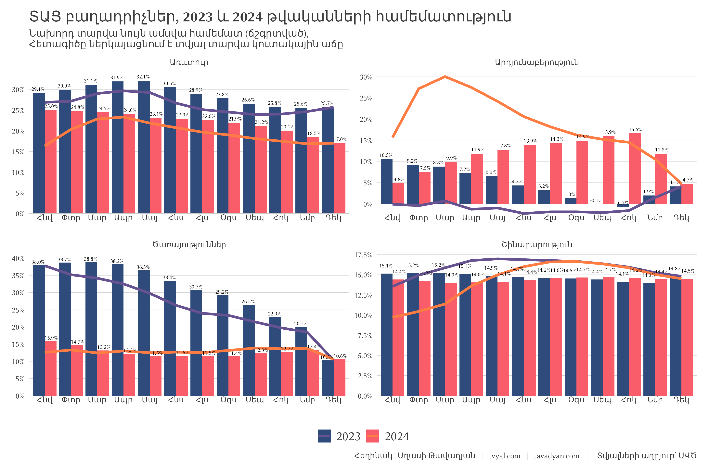

```{r setup, include=FALSE}
knitr::opts_chunk$set(echo = TRUE)

library(tidyverse)
library(scales)
library(countrycode)

# rm(list = ls()); gc()

setwd(dirname(rstudioapi::getActiveDocumentContext()$path))

source("../../initial_setup.R")

system("cd ../.. | git all")

```

***English summary below.***

## [🌿🤨💎 Թանկարժեք էֆեկտ․ 2024 թվականի տնտեսական աճի պատճառները](https://www.tvyal.com/newsletter/2025/2025_02_03)

Տնտեսական ակտիվության ցուցանիշը 2024 թվականի փետրվարին կազմել է 16.3%, հիմնականում պայմանավորված հենց փետրվար ամսում գրանցված աճով՝ 11.2%։ 

Գծապատկեր 1.


Ինչպես երևում է գծապատկերից, տնտեսական ակտիվության միտումը 2023 թվականի սկզբից բացասական է, որը շարունակվել է մինչև 2024 թվականի փետրվար ամիսը։ Նշենք, որ մեկ ամսում գրանցված կտրուկ աճը չի կարող բավարար հիմք հանդիսանալ այն պնդման համար, որ տնտեսությունը հաղթահարել է տնտեսական աճի դանդաղման միտումը։

2024 թվականի փետրվարին տնտեսական ակտիվության ցուցանիշը կտրուկ աճել է, որի արդյունքում տարեկան կտրվածքով աճը նախորդ տարվա փետրվարի համեմատ կազմել է 16.3%։ Սակայն այս աճը պայմանավորված է կարճաժամկետ գործոնով՝ հիմնականում ոսկերչական գործունեության կտրուկ աճով։ Այսպես 2024 թվականի Հայաստանի 8.4 մլրդ դոլար արտահանման 21.5 տոկոսը կամ 1.8 մլրդ դոլարը կազմել է ոսկու արտահանումը, իսկ 7.0 տոկոսը կամ 589 միլիոն դոլարը ադամանդների արտահանումը։ [Ըդհանուր առմամբ արտահանման 28.5 տոկոսը եղել է ոսկու և ադամանդնարի վերաարտահանում Ռուսատանից դեպի Արաբական Միացյալ Էմիրություններ և Հոնկոնգ](https://www.tvyal.com/newsletter/2024/2024_02_16)։

Գծապատկեր 2.



Ոսկերչական գործունեության աճը հանգեցրել է արտահանման ծավալների 55 տոկոս աճին։ Թեև այս աճը արտարժույթ է բերում Հայաստանի տնտեսություն, դրա դրական ազդեցությունը որոշակիորեն չեզոքանում է ներմուծման գրեթե համարժեք աճով: Այս արագ աճի պայմաններում առկա արտահանման դասական ճյուղերը կրճատվում են, [նկատվում է ապրանքների տարբեր կատեգորիաների արտահանման կրճատում](https://www.tvyal.com/newsletter/2024/2024_02_16): Մասնավորապես նկատվում է «պատրաստի սննդի արտադրանք» և «կենդանի կենդանիներ և կենդանական ծագման արտադրանք» ապրանքախմբերի արտահանման ծավալների անկում, խնդրահարույց է նաև հանքահումքային ապրանքների արտահանման էական անկումը:

Գծապատկեր 3.


Երկրորդ գծապատկերը ցույց է տալիս տնտեսական աճի տարեկան տեմպը, ինչպես նաև կուտակային աճի տեմպը տարեկան կտրվածքով: Գծապատկերից երևում է, որ 12-ամսյա տնտեսական ակտիվության աճի ամենաբարձր ցուցանիշը գրանցվել է 2022 թվականի հունիսին՝ 19,8 տոկոս, որին հաջորդել է աճի դանդաղում 2022 թվականի մնացած ամիսների համար: 2023 թվականին 12-ամսյա աճի առավելագույն ցուցանիշը գրանցվել է մարտին՝ 14,2 տոկոս, որին հաջորդել է անկում:

Գծապատկեր 4.


Երրորդ գծապատկերում պատկերված է տնտեսական ակտիվության բաղադրիչները ըստ տարիների։ Նշենք որ գյուղատնտեսությունը ամսական կտրվածքով արտացոլվում էր մինչև 2018 թվականի վերջը վիճակագրության կոմիտեի կողմից ներկայացված [Հայաստանի սոցիալ-տնտեսական վիճակը բնութագրող ընթացիկ-օպերատիվ մակրոտնտեսական ցուցանիշների մեջ](https://armstat.am/file/doc/99511688.pdf)։ [2019 թվականից ի վեր գյուղատնտեսության ամսական տվյալները անտեսվել են](https://armstat.am/file/doc/99517378.pdf): Գյուղատնտեսությունը կազմում էր տնտեսական ակտիվության 12.9 տոկոսը 2017 թվականին, 2023-ին այս ոլորտի մասնաբաժինը արդեն կրճատվեց մինչև 7.4 տոկոս։ Ամենախոշոր ոլորտը տնսական ակտիվության մեջ մեծածախ և մանրածախ առևտուրն է, որի մասնաբաժինը արդեն կազմում է 42.7 տոկոս։

[Կարդացեք թե որ ճյուղերն են նպաստում տնտեսական աճին](https://www.tvyal.com/newsletter/2024/2024_03_09)։

[Մանրամասն կարդացեք 10 տարվա գյուղատնտեսության կոլափսի մասին](https://www.tvyal.com/newsletter/2024/2024_03_15)։


-----

-----

Եթե հնարավոր է, խնդրում եմ այս նյութը ուղարկել նաև այն մարդկանց, ում այն կարծում եք կարող է հետաքրքրել:

**ԱՅՍ ՀՈԴՎԱԾԻ ՀՂՈՒՄԸ**

***Թավադյան, Աղ․Ա․ (2025)․ Տրանսպորտի թանկացում․ Երևանի հասարակական տրանսպորտի բարեփոխումները և մատչելիության սահմանները [Transportation Price Increase: Yerevan's Public Transport Reforms and the Limits of Affordability]․ Tvyal.com հարթակ [Tvyal.com platform], 03-02-2025․ https://www.tvyal.com/newsletter/2025/2025_02_03***

**Արգելվում է այս հարթակի նյութերը արտատպել առանց հղում կատարելու։**    

<small>\* Այս և մեր բոլոր այլ վերլուծությունների տվյալները վերցված են պաշտոնական աղբյուրներից։ Հաշվարկները ամբողջությամբ հասանելի են github-ում, դրանք կարելի է ստուգել` այցելելով [github-ի](https://github.com/tavad/tvyal_newsletter/blob/main/2025/) մեր էջը, որտեղ տրված են տվյալները, հաշվարկների և գծապատկերների կոդը։</small>


-----

# ՀԱՄԱԳՈՐԾԱԿՑՈՒԹՅՈՒՆ

<style>
.ai-services-banner-tvyal {
background-color: #0a192f;
color: #e6f1ff;
padding: 30px;
font-family: Arial, sans-serif;
border-radius: 10px;
box-shadow: 0 4px 6px rgba(0, 0, 0, 0.1);
position: relative;
overflow: hidden;
min-height: 400px;
display: flex;
flex-direction: column;
justify-content: center;
}
.ai-services-banner-tvyal::before {
content: '';
position: absolute;
top: -25%;
left: -25%;
right: -25%;
bottom: -25%;
background: repeating-radial-gradient(
circle at 50% 50%,
rgba(100, 255, 218, 0.1),
rgba(100, 255, 218, 0.1) 15px,
transparent 15px,
transparent 30px
);
animation: gaussianWaveTvyal 10s infinite alternate;
opacity: 0.3;
z-index: 0;
}
@keyframes gaussianWaveTvyal {
0% {
transform: scale(1.5) rotate(0deg);
opacity: 0.2;
}
50% {
transform: scale(2.25) rotate(180deg);
opacity: 0.5;
}
100% {
transform: scale(1.5) rotate(360deg);
opacity: 0.2;
}
}
.ai-services-banner-tvyal > * {
position: relative;
z-index: 1;
}
.ai-services-banner-tvyal h2,
.ai-services-banner-tvyal h3 {
margin-bottom: 20px;
color: #ccd6f6;
}
.ai-services-banner-tvyal ul {
margin-bottom: 30px;
padding-left: 20px;
}
.ai-services-banner-tvyal li {
margin-bottom: 10px;
}
.ai-services-banner-tvyal a {
color: #64ffda;
text-decoration: none;
transition: color 0.3s ease;
}
.ai-services-banner-tvyal a:hover {
color: #ffd700;
text-decoration: underline;
}
</style>

<div class="ai-services-banner-tvyal">
## [Եթե ուզում եք ձեր տվյլներից օգուտ քաղել AI գործիքներով` ԴԻՄԵՔ ՄԵԶ](mailto:a@tavadyan.com?subject=Let's Put Data to Work!)

### Մենք առաջարկում ենք

- Extensive databases for finding both international and local leads
- Exclusive reports on the Future of the Armenian Economy
- Work and browser automation to streamline operations and reduce staffing needs
- AI models for forecasting growth and optimizing various aspects of your business
- Advanced dashboarding and BI solutions
- Algorithmic trading

### [Let's Put Your Data to Work!](mailto:a@tavadyan.com?subject=Let's Put Data to Work!)

### [ՄԻԱՑԵՔ ՄԵՐ ԹԻՄԻՆ](mailto:a@tavadyan.com?subject=Work application)
</div>


-----

## English Summary
### 💸💳🚍 Transportation Price Increase: Yerevan's Public Transport Reforms and the Limits of Affordability


---

Հարգանքներով,            
Աղասի Թավադյան         
03.02.2025          
[tvyal.com](https://www.tvyal.com/)      
[tavadyan.com](https://www.tavadyan.com/)

---

[Was this email forwarded to you? Subscribe here.](https://www.tvyal.com/subscribe)
[Բաժանորդագրվեք](https://www.tvyal.com/subscribe)

---              
               


####### **Ուշադրություն. Ձեր էլ.փոստը մեյլլիսթի մեջ է, որի միջոցով ես կիսվում եմ շաբաթական նյութեր, որոնք հիմնականում ներկայացնում են Հայաստանի տնտեսությունը: Նյութերը ներառում են գծապատկերներ, [տվյալների բազաներ](https://github.com/tavad/tvyal_newsletter), տեսանյութեր, հոդվածներ, [առցանց վահանակներ](https://www.tvyal.com/projects), տնտեսական գործիքներ, կանխատեսումներ և հաշվետվություններ: Եթե ցանկանում եք չեղարկել բաժանորդագրությունը, խնդրում եմ տեղեկացրեք ինձ, և ես կհեռացնեմ ձեր էլ. փոստը ցուցակից: Գրեք նաև եթե ունեք մենկնաբանություններ:**

####### **Important! Your email is part of the mailing list where I share weekly materials primarily focused on the Armenian economy. These materials encompass charts, [databases](https://github.com/tavad/tvyal_newsletter), videos, articles, [online dashboards](https://www.tvyal.com/projects), economic tools, forecasts, and reports. If you wish to unsubscribe, please let me know, and I will remove your email from the list. Please share your comments as well․**


