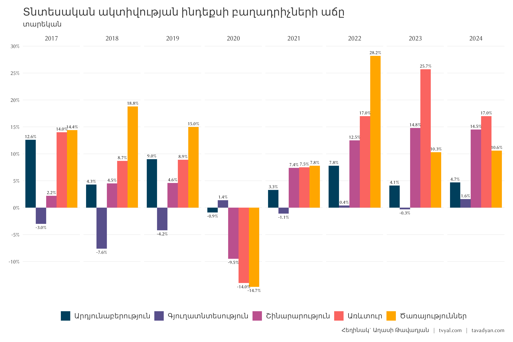
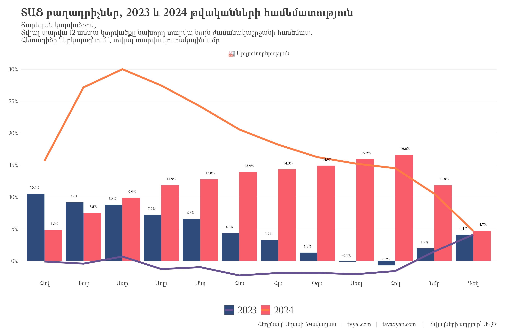
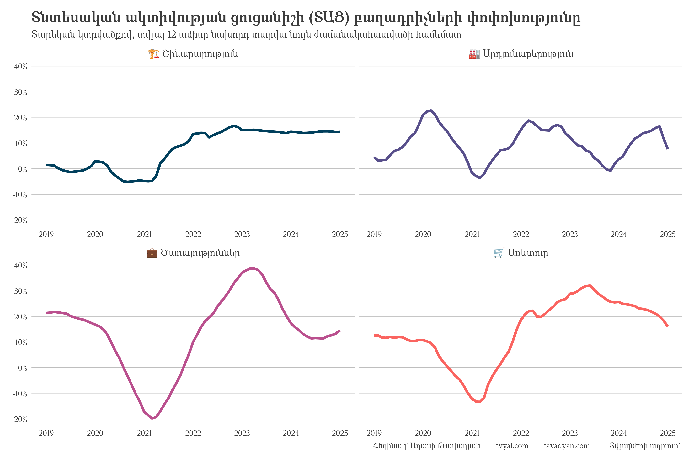
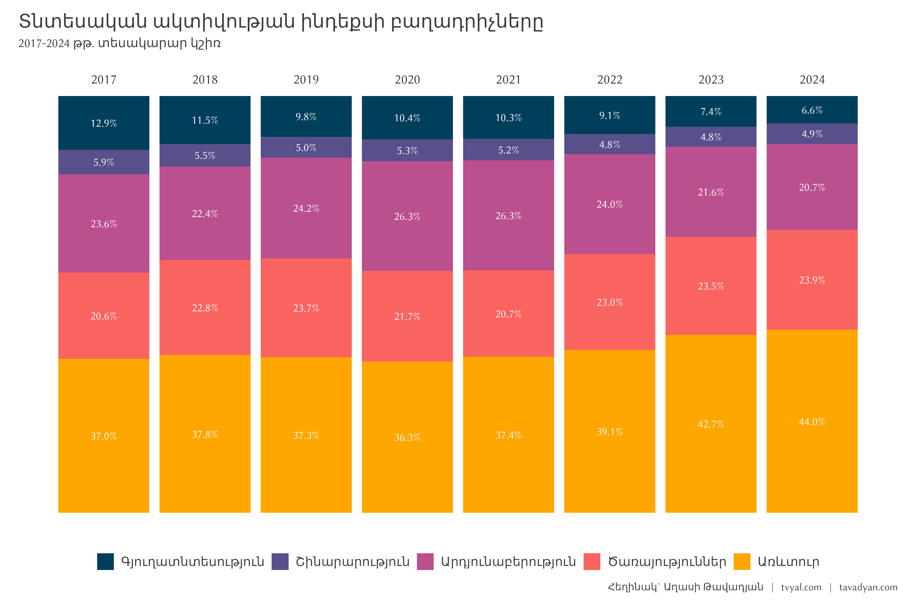

```{r setup, include=FALSE}
knitr::opts_chunk$set(echo = TRUE)

library(tidyverse)
library(scales)
library(countrycode)

# rm(list = ls()); gc()

setwd(dirname(rstudioapi::getActiveDocumentContext()$path))

source("../../initial_setup.R")

system("cd ../.. | git all")

```

***English summary below.***

## [🌿🤨💎 Թանկարժեք էֆեկտ․ 2024 թվականի տնտեսական աճի պատրանքը](https://www.tvyal.com/newsletter/2025/2025_02_03)

### Հայաստանի տնտեսական աճի իրական պատկերը

Առաջին հայացքից Հայաստանի արդյունաբերական աճի ցուցանիշները 2024 թվականի համար խոստումնալից են թվում՝ 4.7% աճ 2023-ի 4.1%-ի համեմատ։ Սակայն այս մակերեսային թվերի տակ թաքնված է առավել բարդ իրականություն։

Գծապատկեր 1.



2024թ․ հոկտեմբերին Հայաստանը հպարտորեն գլխավորում էր ԵԱՏՄ երկրների շարքը՝ 17% արդյունաբերական աճով։ Սակայն այս ձեռքբերումը կարճատև էր։ Թեև 2024թ․ արտահանման ցուցանիշները ցույց են տալիս տպավորիչ՝ 51% աճ նախորդ տարվա համեմատ, սակայն 2024թ․ վերջին արդեն արձանագրվել է կտրուկ անկում․ 2024թ․ դեկտեմբերին արտահանումը կրճատվել է երկու անգամ նախորդ տարվա համեմատ, իսկ ընդհանուր արտաքին առևտրաշրջանառությունը նվազել է 37.7%-ով։ Այսինքն ունենք տարվա ընթացքում [51% աճ](https://www.armstat.am/file/doc/99555273.pdf), սակայն վերջին ամսվա համար սթափեցնող [2 անգամ անկում](https://www.armstat.am/file/doc/99555268.pdf)։ Սա մտահոգիչ է և տնտեսական «փուչիկի» նախանշան է։

Գծապատկեր 2.



Պատճա՞ռը։ Ռուսաստանից Հայաստանի միջոցով իրականացված ոսկու մեծածավալ վերաարտահանման գործարքները, որոնք ժամանակավորապես ուռճացրին տնտեսական ցուցանիշները։ Այս «ոսկե փուչիկը» հասավ իր գագաթնակետին 2023թ․ մարտին՝ երբ գրանցվեց թանկարժեք քարերի և մետաղների 1.1 միլիարդ ԱՄՆ դոլարի «արտահանում», սակայն 2024թ․ վերջին այս այս ցուցանիշը արդեն նվազել է մինչև 119 միլիոն ԱՄՆ դոլար՝ այսինքն տասն անգամ։ Փաստացի այն իրական խթանը, որը ապահովում էր տնտեսական և աչտահանման «աճը» արդեն 10 անգամ նվազել է։ [Սա մենք կանխատեսել էինք](https://www.tvyal.com/newsletter/2024/2024_09_02)։ Այս Ռուսատանից եկող արտաքին խթանը հասցերել է ուռճացնել 2024թ․ տարեկան գումարային ցուցանիշը, սակայն, ինչպես նշեցինք, 2024թ․ վերջի ցուցանիշները արդեն իսկ կտրուկ անկում են գրանցել։

Գծապատկեր 2.



### Արդյունաբերական պատրանք

2024թ․ արդյունաբերական հատվածի թվացյալ հզորությունը քողարկում է տնտեսության հիմնարար թուլությունը։ Ինչպես երևում է երկրորդ գծապատկերում 2023թ․ արտադրության աճ գրեթե չի գրանցվել։ Աճը սկսեց երևալ միայն 2024թ․ նոյեմբերին՝ զուգընթաց միլիարդավոր դոլարների ոսկու վերաարտահանման մեկնարկին, որը շարունակվեց մինչև 2024թ․ մարտ և ապահովեց Տնտեսական Ակտիվության Ցուցանիշի (ՏԱՑ) արտադրության աճի առյուծի բաժինը։

Պաշտոնական վիճակագրությունը ցույց է տալիս աճ, սակայն այս աճի 90%-ը բաժին է ընկնում «ոսկու արդյունաբերությանը»՝ ըստ էության վերաարտահանման գործառնություններին, այլ ոչ թե իրական արդյունաբերական արտադրությանը։ Նշենք որ [2024թ․ տարեսկզբից](https://www.armstat.am/file/article/sv_03_24a_121.pdf) որոշակի վերադասավորման արդյունքում «ոսկու արդյունաբերությունը» արդեն իսկ քողարկված է «հիմնական մետաղների արդյունաբերության» հոդվածի ներքո։ Նշենք նաև որ [2024թ․ առաջին կիսամյակում](https://www.tvyal.com/newsletter/2024/2024_09_02) ընդհանուր արտահանման 71%-ը կազմել են թանկարժեք քարերի և մետաղների վերաարտահանումը՝ ստեղծելով արտահանման դիվերսիֆիկացման պատրանք։

### Արտահանման պատրանքային դիվերսիֆիկացիա

Այս «դիվերսիֆիկացիայի» արդյունքում ունենք

* Հայաստանի արտահանման առաջին տեղում արդեն Արաբական Միացյալ Էմիրություններն են։ Այսինքն ԱՄԷ արժույթային ներկայացմամբ արդեն ավելի շատ ենք արտահանում քան ՌԴ։ Կարևոր ձեռքբերում։ Սակայն սա պարզապես արտացոլում է ոսկու վերաարտահանման ուղին, այլ ոչ թե իրական շուկայական դիվերսիֆիկացիան։
* Դեպի Ռուսատան և Եվրոմիություն արտահանման կրճատում։ Ավանդական արտահանումը դեպի հիմնական գործընկերներ փաստացի նվազել է՝ Ռուսաստան արտահանումը կրճատվել է նախնական 16%-ով, իսկ ԵՄ՝ նախնական 25%-ով։

### Առևտրային դինամիկայի տեղաշարժ

Արտաքին առևտրի ցուցանիշները հատկապես խոսուն են։ [2024թ․ դեկտեմբերին]((https://www.armstat.am/file/doc/99555268.pdf) արձանագրվել է․

- Ընդհանուր առևտրաշրջանառության 37.3% անկում (ընթացիկ գներով),
- Արտահանման 2 անգամ կրճատում մինչև 2023թ․ դեկտեմբերի մակարդակի 51.4%-ը,
- Ներմուծման նվազում մինչև 73.5%։

Սակայն [տարեկան ցուցանիշները](https://www.armstat.am/file/doc/99555273.pdf) ցույց են տալիս այլ պատկեր․

- Առևտրաշրջանառության 41.5% աճ,
- Արտահանման 53.1% աճ,
- Ներմուծման 33.8% աճ։

### Գյուղատնտեսության լուռումունջ անկումը

Գծապատկեր 3.



Առավել մտահոգիչ է գյուղատնտեսության ոլորտի կայուն անկումը։ 2017թ․ տնտեսական ակտիվության 12.9%-ից գյուղատնտեսության մասնաբաժինը 2024թ․ նվազել է մինչև ընդամենը 6.6%։ 2019թ․-ից սկսած՝ գյուղատնտեսության ամսական տվյալներն այլևս չեն հրապարակվում պաշտոնական վիճակագրությունում, մտահոգիչ է որ այս կաևոր ոլորտի ամսական ցուցանիշները չեն հրապարակվում։ Միևնույն ժամանակ, մեծածախ և մանրածախ առևտուրը դարձել է տնտեսության գերիշխող ճյուղը՝ կազմելով տնտեսական ակտիվության 44%-ը։ Ծառայությունների հետ միասին այս ոլորտները կազմում են տնտեսության 68%-ը՝ ստեղծելով երկարաժամկետ տնտեսական կայունության համար պոտենցիալ վտանգավոր իրավիճակ։

### Շինարարության կայունություն

Դրական միտում է նկատվում շինարարության ոլորտում, որը ցուցաբերում է կայուն աճ․

- 12.9% աճ 2024թ․ դեկտեմբերին՝ 2023թ․ դեկտեմբերի համեմատ,
- 14.5% աճ ամբողջ տարվա կտրվածքով,
- Դրական դինամիկայի պահպանում՝ չնայած ավելի լայն տնտեսական մարտահրավերներին։

### Կանխատեսված նախազգուշացում

Ինը ամիս առաջ՝ 2024թ․ մարտին, մեր վերլուծությունում [տվել էինք վաղ նախազգուշացման ազդակներ](https://www.tvyal.com/newsletter/2024/2024_03_29) հենց այս ռիսկերի մասին։ Մենք հատկապես զգուշացրել էինք ոսկու վերաարտահանման սխեմայի անկայուն բնույթի և դրա՝ արհեստական տնտեսական ցուցանիշներ ստեղծելու վտանգի մասին։ Այս փուչիկն արդեն թուլանում է, ինչը վկայում է, որ 2025թ․ արտահանման ցուցանիշները և տնտեսական աճն այլևս չեն ներառի այս արհեստական խթանը՝ հավանաբար բացահայտելով տնտեսության իրական վիճակի ավելի սթափեցնող պատկերը։

### Ապագայի հեռանկարներ

Տարեկան և դեկտեմբերյան ցուցանիշների միջև տարբերությունը վկայում է, որ 2025 թվականը կարող է լուրջ մարտահրավերներ պարունակել․

- Ոսկու վերաարտահանման դադարեցումը շարունակելու է ազդել արդյունաբերական ցուցանիշների վրա,
- Առևտրային հաշվեկշիռը կարող է վատթարանալ արհեստական արտահանման խթանների վերացման հետևանքով,
- Ծառայությունների ոլորտի գերակշռությունը մեծացնում է տնտեսության խոցելիությունն արտաքին ցնցումների նկատմամբ։

### Լրացուցիչ վերլուծություններ

> Կարդացեք մեր լրացուցիչ նյութերը այս թեմայով․
>
> [💎🎭🔮️ Ոսկե Պատրանք. Հայաստանի արտահանման իրական պատկերը](https://www.tvyal.com/newsletter/2024/2024_09_02)
>
> [🐅🌆💸 Հայաստան` Կովկասի վագր, թե՞ թանկ երազանք](https://www.tvyal.com/newsletter/2024/2024_08_26)
>
> [🤒🟨♻️ Ոսկու տենդի շարունակություն. Հայաստանի արտահանման 75%-ը ոսկի և ադամանդ է](https://www.tvyal.com/newsletter/2024/2024_05_11)
>
> [🌿🤨💎 Թանկարժեք էֆեկտ․ 2024 թվականի տնտեսական աճի պատճառները, հրապարակվել է 9 ամիս առաջ](https://www.tvyal.com/newsletter/2024/2024_03_29)
>
> [Մեր վերլուծությունների ամբողջական ցանկը](https://www.tvyal.com/newsletter)

### Աղբյուրներ

Տնտեսական ակտիվության ցուցանիշի (ՏԱՑ) հաշվետվություններ․
- [ՏԱՑ 2024թ․ դեկտեմբեր](https://www.armstat.am/file/doc/99555268.pdf)
- [ՏԱՑ 2024թ․ տարեկան](https://www.armstat.am/file/doc/99555273.pdf)
- [ՏԱՑ 2024թ․ հաշվետվություն](https://www.armstat.am/file/doc/99555148.pdf)
- [ՏԱՑ 2023թ․ դեկտեմբեր](https://www.armstat.am/file/doc/99544198.pdf)
- [ՏԱՑ 2023թ․ տարեկան](https://www.armstat.am/file/doc/99544153.pdf)
- [ՏԱՑ 2023թ․ հաշվետվություն](https://www.armstat.am/file/doc/99544118.pdf)

<hr>

<hr>

Եթե հնարավոր է, խնդրում եմ այս նյութը ուղարկել նաև այն մարդկանց, ում այն կարծում եք կարող է հետաքրքրել:

**ԱՅՍ ՀՈԴՎԱԾԻ ՀՂՈՒՄԸ**

***Թավադյան, Աղ․Ա․ (2025)․ Թանկարժեք էֆեկտ․ 2024 թվականի տնտեսական աճի պատրանքը []․ Tvyal.com հարթակ [Tvyal.com platform], 04-02-2025․ https://www.tvyal.com/newsletter/2025/2025_02_04***

**Արգելվում է այս հարթակի նյութերը արտատպել առանց հղում կատարելու։**

<small>\* Այս և մեր բոլոր այլ վերլուծությունների տվյալները վերցված են պաշտոնական աղբյուրներից։ Հաշվարկները ամբողջությամբ հասանելի են github-ում, դրանք կարելի է ստուգել` այցելելով [github-ի](https://github.com/tavad/tvyal_newsletter/blob/main/2025/) մեր էջը, որտեղ տրված են տվյալները, հաշվարկների և գծապատկերների կոդը։</small>


<hr>

# ՀԱՄԱԳՈՐԾԱԿՑՈՒԹՅՈՒՆ

<style>
.ai-services-banner-tvyal {
background-color: #0a192f;
color: #e6f1ff;
padding: 30px;
font-family: Arial, sans-serif;
border-radius: 10px;
box-shadow: 0 4px 6px rgba(0, 0, 0, 0.1);
position: relative;
overflow: hidden;
min-height: 400px;
display: flex;
flex-direction: column;
justify-content: center;
}
.ai-services-banner-tvyal::before {
content: '';
position: absolute;
top: -25%;
left: -25%;
right: -25%;
bottom: -25%;
background: repeating-radial-gradient(
circle at 50% 50%,
rgba(100, 255, 218, 0.1),
rgba(100, 255, 218, 0.1) 15px,
transparent 15px,
transparent 30px
);
animation: gaussianWaveTvyal 10s infinite alternate;
opacity: 0.3;
z-index: 0;
}
@keyframes gaussianWaveTvyal {
0% {
transform: scale(1.5) rotate(0deg);
opacity: 0.2;
}
50% {
transform: scale(2.25) rotate(180deg);
opacity: 0.5;
}
100% {
transform: scale(1.5) rotate(360deg);
opacity: 0.2;
}
}
.ai-services-banner-tvyal > * {
position: relative;
z-index: 1;
}
.ai-services-banner-tvyal h2,
.ai-services-banner-tvyal h3 {
margin-bottom: 20px;
color: #ccd6f6;
}
.ai-services-banner-tvyal ul {
margin-bottom: 30px;
padding-left: 20px;
}
.ai-services-banner-tvyal li {
margin-bottom: 10px;
}
.ai-services-banner-tvyal a {
color: #64ffda;
text-decoration: none;
transition: color 0.3s ease;
}
.ai-services-banner-tvyal a:hover {
color: #ffd700;
text-decoration: underline;
}
</style>

<div class="ai-services-banner-tvyal">
## [Եթե ուզում եք ձեր տվյլներից օգուտ քաղել AI գործիքներով` ԴԻՄԵՔ ՄԵԶ](mailto:a@tavadyan.com?subject=Let's Put Data to Work!)

### Մենք առաջարկում ենք

- Extensive databases for finding both international and local leads
- Exclusive reports on the Future of the Armenian Economy
- Work and browser automation to streamline operations and reduce staffing needs
- AI models for forecasting growth and optimizing various aspects of your business
- Advanced dashboarding and BI solutions
- Algorithmic trading

### [Let's Put Your Data to Work!](mailto:a@tavadyan.com?subject=Let's Put Data to Work!)

### [ՄԻԱՑԵՔ ՄԵՐ ԹԻՄԻՆ](mailto:a@tavadyan.com?subject=Work application)
</div>


<hr>

## English Summary
### 💸💳🚍 Transportation Price Increase: Yerevan's Public Transport Reforms and the Limits of Affordability

<hr>


## ԶԼՄ հաղորդագրություններ

Ներկայացնենք վերջին 2 շաբաթվա ընթացքում ԶԼՄ հաղորդագորությունները

1. [📺 Ինչու է Թանկանում Կյանքը Հայաստանում և Ովքեր են Շահում Այս Ամենից.Ոսկու և Ադամանդի Առեղծվածը](https://youtu.be/NmgiZ0-ZISw)

<a href="https://youtu.be/NmgiZ0-ZISw">
  
</a>

2. [📺 Քաղաքացու ֆինանսական բեռի ավելացումը մինչև ու՞ր // Press Կենտրոն](https://youtu.be/U4zVIl1pfUg)

<a href="https://youtu.be/U4zVIl1pfUg">
  
</a>

3. [📺 ՔՆՆԱՐԿՈՒՄ. Ովքե՞ր են խոշոր հարկատուները Տնտեսության բացակայության ցուցիչ](https://youtu.be/Ejp5bIFsVCg)

<a href="https://youtu.be/Ejp5bIFsVCg">
  
</a>

Հարգանքներով,            
Աղասի Թավադյան         
04.02.2025          
[tvyal.com](https://www.tvyal.com/)      
[tavadyan.com](https://www.tavadyan.com/)

<hr>

[Was this email forwarded to you? Subscribe here.](https://www.tvyal.com/subscribe)
[Բաժանորդագրվեք](https://www.tvyal.com/subscribe)

<hr>


####### **Ուշադրություն. Ձեր էլ.փոստը մեյլլիսթի մեջ է, որի միջոցով ես կիսվում եմ շաբաթական նյութեր, որոնք հիմնականում ներկայացնում են Հայաստանի տնտեսությունը: Նյութերը ներառում են գծապատկերներ, [տվյալների բազաներ](https://github.com/tavad/tvyal_newsletter), տեսանյութեր, հոդվածներ, [առցանց վահանակներ](https://www.tvyal.com/projects), տնտեսական գործիքներ, կանխատեսումներ և հաշվետվություններ: Եթե ցանկանում եք չեղարկել բաժանորդագրությունը, խնդրում եմ տեղեկացրեք ինձ, և ես կհեռացնեմ ձեր էլ. փոստը ցուցակից: Գրեք նաև եթե ունեք մենկնաբանություններ:**

####### **Important! Your email is part of the mailing list where I share weekly materials primarily focused on the Armenian economy. These materials encompass charts, [databases](https://github.com/tavad/tvyal_newsletter), videos, articles, [online dashboards](https://www.tvyal.com/projects), economic tools, forecasts, and reports. If you wish to unsubscribe, please let me know, and I will remove your email from the list. Please share your comments as well․**


