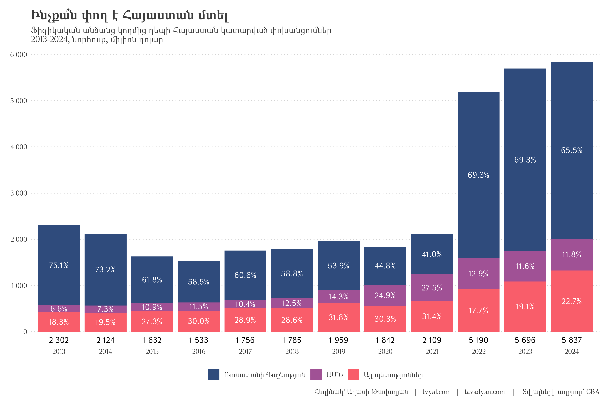
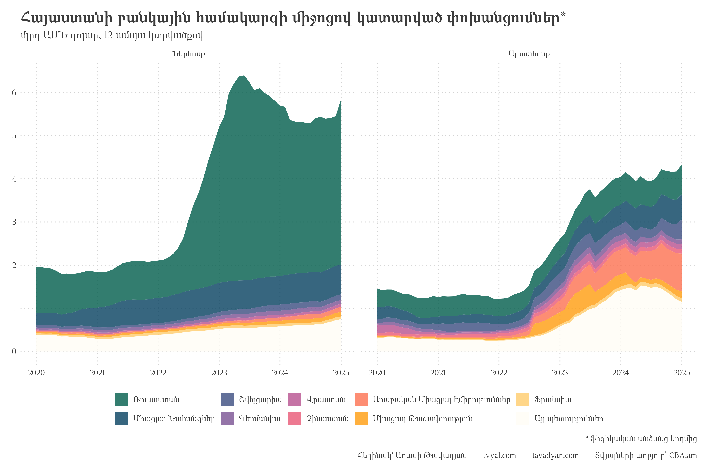
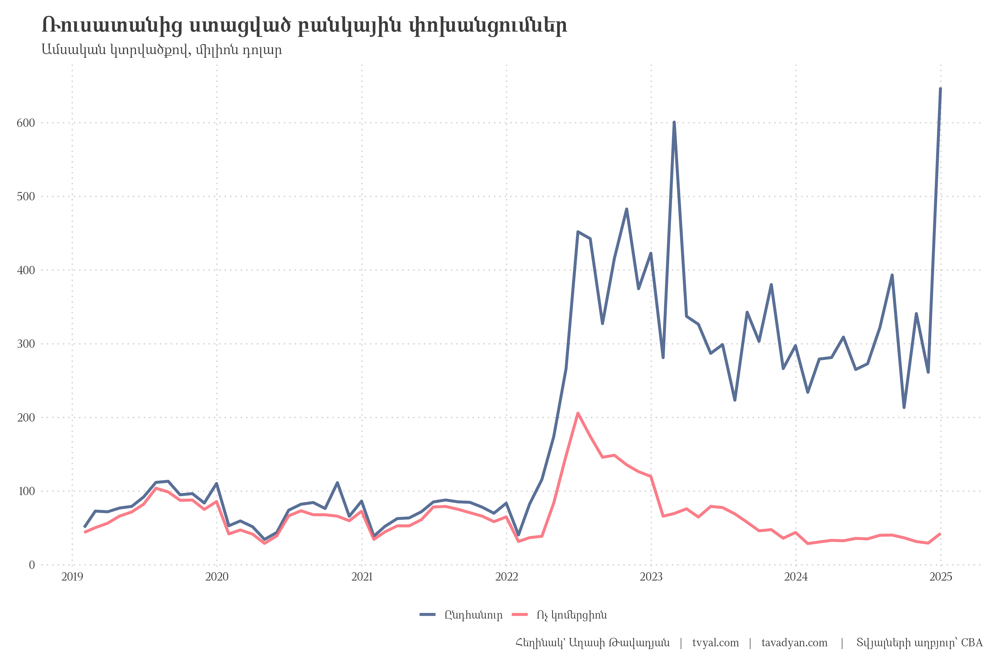
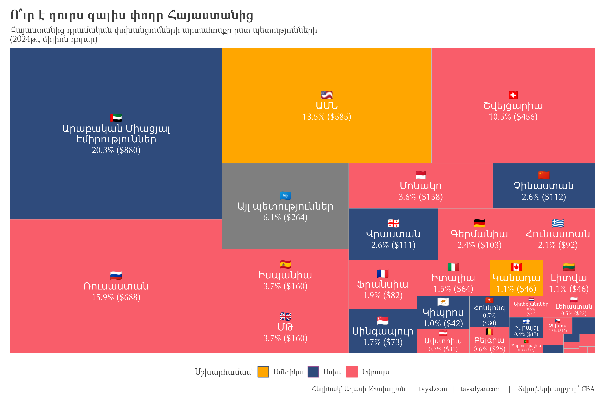
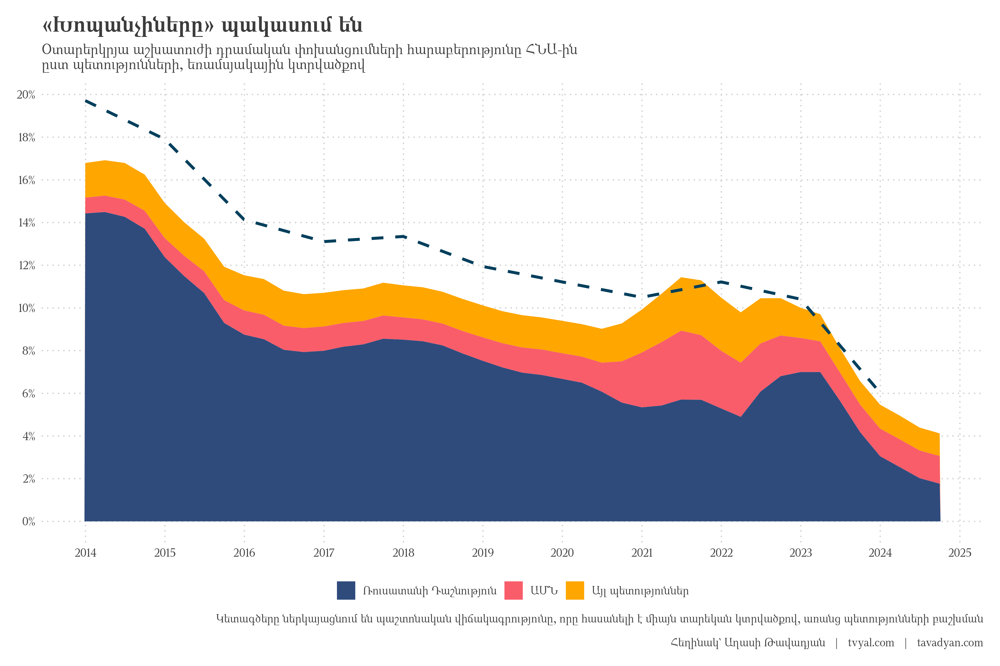

```{r setup, include=FALSE}
knitr::opts_chunk$set(
  echo = FALSE,          # Don't show code
  warning = FALSE,       # Don't show warnings
  message = FALSE,       # Don't show messages
  error = FALSE,        # Don't show errors
  fig.align = "center", # Center align figures
  out.width = "100%",   # Make figures full width
  dpi = 300,           # High resolution for plots
  fig.showtext = TRUE,  # Enable showtext for custom fonts
  dev = "png",         # Use png device for plots
  cache = TRUE         # Cache results to speed up rendering
)

# For better figure handling
options(
  digits = 2,          # Number of digits to show in numbers
  scipen = 999,        # Avoid scientific notation
  knitr.kable.NA = '', # Empty string for NA in tables
  width = 120          # Console width for output
)

library(tidyverse)
library(scales)
library(readxl)
library(RcppRoll)
library(hpfilter)
library(gt)
library(countrycode)
library(treemapify)
library(ggfittext)
library(WDI)

# rm(list = ls()); gc()

setwd(dirname(rstudioapi::getActiveDocumentContext()$path))

source("../../initial_setup.R")

```


```{r get databases, include=FALSE}
# # uncomment and run the command below to update the data
# system("curl https://www.cba.am/stat/stat_data_eng/5_Money_transfers_of_individuals_by_countries-eng.xlsx -o transfers_by_countries.xlsx")

transfers_raw <- read_excel("transfers_by_countries.xlsx")

transfers_forecast <- read_csv("transfers_forecast.csv")
```


```{r data cleaning, include=FALSE}

transfers_clean <-
  transfers_raw |> 
  t() |> as_tibble() |>
  # row_to_names is the function that gives the warning
  janitor::row_to_names(row_number = 1) |>
  rename(
    na = 1,
    year = 2,
    month = 3,
    direction = 4
  ) |>
  select(-na) |>
  mutate(
    type = case_when(
      grepl("of which", month) ~ "non-commercial",
      !grepl("of which", month) & !is.na(month) ~ "total"
    ),
    month = ifelse(grepl("of which", month), NA, month),
  ) |>
  fill(year, month, type, .direction = "down") |>
  pivot_longer(
    -c(year, month, direction, type),
    names_to = "country", values_to = "K_USD"
  ) |>
  mutate(
    K_USD = as.numeric(K_USD),
    month_name = month,
    month = c(1:12)[match(month_name, month.name)],
    date = ym(paste(year, month)),
    date = date + months(1) - days(1)
  ) |>
  relocate(date, year, month, month_name, country, direction, type, K_USD) |> 
  filter(!is.na(K_USD))

transfers_clean |>
  write_excel_csv("transfers_by_countries_clean.csv")

```


```{r chart_1, include=FALSE}
max_month <-
  transfers_clean |>
  filter(date == max(date)) |>
  pull(month) |>
  unique()

transfers_total_chartdata <- 
  transfers_clean |>
  filter(
    # month <= 6,
    direction %in% c("Inflow"),
    # type == "non-commercial",
    type == "total",
    country != "Total",
    # year <= 2023
  ) |>
  mutate(
    country = case_when(
      grepl("Emirates", country) ~ "UAE",
      grepl("Kingdom", country) ~ "UK",
      TRUE ~ country
    ),
    country = fct_lump_n(
      country, n = 2, w = K_USD,
      other_level = "Others"
    ),
    country = fct_reorder(country, K_USD, .desc = TRUE),
    country = fct_relevel(country, "Others", after = Inf)
  ) |>
  group_by(year, country, direction, type) |>
  summarise(K_USD = sum(K_USD), .groups = "drop") |>
  group_by(year, direction, type) |>
  mutate(
    pct = K_USD / sum(K_USD),
    pct_text = percent(pct, accuracy = 0.1),
    # pct_text = ifelse(K_USD <= 1e5, "", pct_text)
  ) |>
  ungroup()

plot_transfers_total <- 
  transfers_total_chartdata |> 
  ggplot(aes(year, K_USD / 1e3)) +
  geom_col(aes(fill = country), alpha = 1) +
  geom_text(
    aes(label = pct_text, fill = country),
    position = position_stack(vjust = .5),
    color = "white", family = "GHEA Grapalat"
  ) +
  geom_text(
    data = transfers_total_chartdata |> 
      group_by(year) |> 
      summarise(
        K_USD = sum(K_USD) / 1000,
        text_USD = number(K_USD, accuracy = 1),
        .groups = "drop"
      ),
    aes(year, 0, label = text_USD),
    vjust = 2, family = "GHEA Grapalat"
  ) +
  # facet_wrap(~direction) +
  scale_y_continuous(labels = number_format(accuracy = 1), n.breaks = 6) +
  scale_fill_manual(
    values = new_palette_colors[c(2,4,6)],
    labels = c("Ռուսատանի Դաշնություն", "ԱՄՆ", "Այլ պետություններ")
  ) +
  labs(
    x = NULL,
    y = NULL,
    fill = NULL,
    title = "Ինչքա՞ն փող է Հայաստան մտել",
#     subtitle = "Ֆիզիկական անձանց կողմից դեպի Հայաստան կատարված փոխանցումներ
# Առաջին կիսամյակ, նորհոսք, միլիոն դոլար",
    subtitle = "Ֆիզիկական անձանց կողմից դեպի Հայաստան կատարված փոխանցումներ
2013-2024, նորհոսք, միլիոն դոլար",
caption = caption_f("CBA")
  ) +
  theme(
     panel.grid.major.x = element_blank(),
     text = element_text(family = "GHEA Mariam") 
  )


```

```{r charts 2&3, include=FALSE}

transfers_date <-
  transfers_clean |>
  filter(
    direction %in% c("Inflow", "Outflow"),
    # type == "non-commercial",
    type == "total",
    country != "Total",
  ) |>
  mutate(
    country = case_when(
      grepl("Emirates", country) ~ "UAE",
      grepl("Kingdom", country) ~ "UK",
      TRUE ~ country
    ),
    country = fct_lump_n(
      country, n = 10, w = K_USD,
      other_level = "Others"
    )
  ) |>
  group_by(date, country, direction, type) |>
  summarise(K_USD = sum(K_USD), .groups = "drop") |>
  arrange(country, direction, type, date) |>
  group_by(country, direction, type) |>
  mutate(K_USD_YOY = roll_sumr(K_USD, 12)) |>
  ungroup() |>
  na.omit()


plot_inflow_outflow_dynamics <- 
  transfers_date |>
  mutate(
    country_arm = countrycode(country, origin = "country.name", destination = "cldr.name.hy"),
    country_arm = ifelse(is.na(country_arm), "Այլ պետություններ", country_arm),
    country_arm = fct_reorder(country_arm, K_USD_YOY, .desc = TRUE),
    country_arm = fct_relevel(country_arm, "Այլ պետություններ", after = Inf),
    country = fct_reorder(country, K_USD_YOY, .desc = TRUE),
    country = fct_relevel(country, "Others", after = Inf),
    direction_arm = ifelse(direction == "Inflow", "Ներհոսք", "Արտահոսք"),
    direction_arm = fct_rev(direction_arm)
  ) |> 
  filter(date >= ymd("2019-12-30")) |>
  ggplot(aes(date, K_USD_YOY / 1e6, fill = country_arm)) +
  geom_area(alpha = 1) +
  facet_wrap(~direction_arm) +
  scale_x_date(date_breaks = "1 year", date_labels = "%Y") +
  scale_y_continuous(breaks = 0:7, labels = number_format(accuracy = 1)) +
  scale_fill_manual(values = colfunc3(10)) +
  # scale_fill_brewer(type = "qual", palette = 3) +
  labs(
    x = NULL,
    y = NULL,
    fill = NULL,
    title = "Հայաստանի բանկային համակարգի միջոցով կատարված փոխանցումներ*",
    subtitle = "մլրդ ԱՄՆ դոլար, 12-ամսյա կտրվածքով",
    caption =paste0("* ֆիզիկական անձանց կողմից\n\n", caption_arm, "   |   Տվյալների աղբյուր՝ CBA.am")
  )

```


```{r, include=FALSE}
# transfers_clean |>
#   filter(
#     direction %in% c("Inflow", "Outflow"),
#     direction == "Outflow",
#     type == "total",
#     country != "Total",
#     year == 2024
#   ) |>
#   mutate(
#     country = fct_lump_n(country, n = 11, w = K_USD,
#                          other_level = "Other_countries")
#   ) |>
#   group_by(date, country, direction, type) |>
#   summarise(K_USD = sum(K_USD), .groups = "drop") |>
#   mutate(country = fct_reorder(country, K_USD)) |>
#   ggplot(aes(date, K_USD / 1e3, fill = country)) +
#   geom_area() +
#   scale_x_date(date_breaks = "2 months", date_labels = "%m %Y") +
#   scale_y_continuous(labels = number_format(accuracy = 1)) +
#   scale_fill_brewer(type = "qual", palette = 3) +
#   labs(
#     fill = NULL,
#     title = "Outflow of transfers made through the banking system of Armenia",
#     subtitle = "From 2022, On Monthly Basis, Millions of USD",
#     caption =paste0(caption_eng, "   |   Data Source: CBA.am")
#   )
#########################################

iso_to_unicode_flag <- function(iso2c) {
  sapply(iso2c, function(code) {
    if (is.na(code)) return(NA)
    paste0(
      intToUtf8(127462L + which(LETTERS == substr(code, 1, 1)) - 1L),
      intToUtf8(127462L + which(LETTERS == substr(code, 2, 2)) - 1L)
    )
  })
}

transfers_cleant_reemap_data <- 
  transfers_clean |>
  filter(
    direction == "Outflow",
    type == "total",
    country != "Total",
    year == 2024
  ) |> 
  mutate(
    country = ifelse(K_USD <= 1100 | country == "Australia", "Others", country),
  ) |> 
  group_by(country) |> 
  summarise(K_USD = sum(K_USD)) |> 
  ungroup() |> 
  mutate(
    pct = K_USD / sum(K_USD),
    pct = percent(pct, accuracy = 0.1),
    iso2c = countrycode(country, origin = "country.name", destination = "iso2c"),
    flag_unicode = iso_to_unicode_flag(iso2c),
    flag_unicode = ifelse(is.na(flag_unicode), "🇺🇳", flag_unicode),
    continent = countrycode(country, origin = "country.name", destination = "continent"),
    country = countrycode(country, origin = "country.name", destination = "cldr.short.hy"),
    country = ifelse(is.na(country), "Այլ պետություններ", country),
    country = ifelse(grepl("Էմիրություններ", country), "Արաբական Միացյալ\nԷմիրություններ", country)
  ) |> 
  arrange(desc(K_USD)) |> 
  mutate(country = factor(country, levels = c(country[country != "Այլ պետություններ"], "Այլ պետություններ")))

# countrycode::codelist |> select(contains("hy"))

plot_outflow_countries <-
  transfers_cleant_reemap_data |> 
  ggplot(aes(
    area = K_USD, fill = continent, 
    label = paste0(flag_unicode, "\n", country, "\n", pct, " (", dollar(K_USD/1e3, accuracy = 1), ")")
  )) +
  geom_treemap(layout = "squarified", start = "topleft", alpha = 1) +
  geom_treemap_text(
    place = "centre", 
    start = "topleft",
    size = 14, 
    color = "white",
    reflow = TRUE
  ) +
  theme_tvyal() +
  scale_fill_manual(
    values = new_palette_colors[c(8,2,6)],
    labels = c("Ամերիկա", "Ասիա", "Եվրոպա", "")
  ) +
  labs(
    fill = "Սշխարհամաս`",
    title = "Ո՞ւր է դուրս գալիս փողը Հայաստանից",
    subtitle = "Հայաստանից դրամական փոխանցումների արտահոսքը ըստ պետությունների\n(2024թ․, միլիոն դոլար)",
    caption = caption_f("CBA")
  ) +
  guides(fill = guide_legend(override.aes = list(alpha = c(1, 1, 1, 0), color = c(new_palette_colors[c(2,4,6)], NA))))


```

```{r, include=FALSE}
transfers_forecast_plot <- 
  transfers_forecast %>%
  filter(
    type == "total", 
    # direction == "Net inflow",
    !grepl("arima|bats", model_name),
    date >= ym("2019-01"),
    period == "YoY"
  ) |> 
  mutate(
    across(where(is.numeric), ~.x / 1e6),
    direction = factor(direction, levels = c("Inflow", "Outflow", "Net inflow"))
  ) |> 
  ggplot(aes(date, K_USD, color = model_name, lty = model_name)) +
  facet_wrap(~direction, scales = "free_y") +
  geom_line(linewidth = 1) +
  geom_ribbon(aes(ymin = ribbon_low, ymax = ribbon_high), alpha = .2) +
  scale_x_date(date_breaks = "2 year", date_labels = "%Y") +
  scale_y_continuous(labels = number_format(), n.breaks = 7) +
  scale_color_manual(values = new_palette_colors[c(2,5,7,8,4)]) +
  scale_linetype_manual(values = c(1, 2, 2, 2, 2)) +
  labs(
    x = NULL,
    y = NULL,
    color = "Model name",
    linetype = "Model name",
    title = "Forecast of Transfers",
    subtitle = "Year over Year, Billions of USD",
    caption =paste0(caption_eng, "   |   Data Source: CBA.am")
  ) +
  theme(
    panel.grid.minor.x = element_line(
      colour = "lightgray", 
      linetype = "dotted"
    )
  )

############

last_date_value <- 
  transfers_forecast |> 
  filter(date == max(date)) |> 
  pull(date) |> 
  unique() - years(2)

gt_table_transfers <-
  transfers_forecast |> 
  filter(
    month(date) == 12,
    year(date) != 2025,
    period == "YoY",
    type == "total",
    grepl("stlm|Data", model_name),
    !c(!grepl("Data", model_name) & date == ymd(last_date_value))
  ) |> 
  filter(date != max(date)) |> 
  arrange(type, direction, date) |>
  group_by(type, direction) |>
  mutate(
    year = year(date),
    across(matches("ribbon"), ~ifelse(is.na(.x), K_USD, .x)),
    pct_change = ifelse(
      ribbon_low == K_USD,
      ifelse(
        K_USD / lag(K_USD) < 2,
        percent(K_USD / lag(K_USD) - 1, accuracy = 0.1),
        paste(number(K_USD / lag(K_USD), accuracy = 0.01), "անգամ")
      ),
      paste0(
        percent(K_USD / lag(K_USD) - 1, accuracy = 0.1),
        "\n(", percent(ribbon_low / lag(ribbon_low) - 1, accuracy = 0.1),  "-ից մինչև ",
        percent(ribbon_high / lag(ribbon_high) - 1, accuracy = 0.1), ")"
      )
    ),
    across(matches("K_USD|ribbon"), ~number(.x/1e6, accuracy = 0.01)),
    K_USD = ifelse(
      ribbon_low == K_USD,
      K_USD,
      paste0(
        K_USD, " \n(", ribbon_low, "-ից մինչև ", ribbon_high, ")"
      )
    ),
    year = ifelse(ribbon_low == K_USD, year, paste(year, "\n կանխատեսում"))
  ) |>
  ungroup() |>
  filter(
    date >= ym("2018-01")
  ) |>
  select(year, direction, K_USD, pct_change) |>
  mutate(
    direction = factor(direction, levels = c("Inflow", "Outflow", "Net inflow"))
  ) |>
  arrange(direction) |>
  pivot_wider(
    names_from = direction, values_from = c(K_USD, pct_change),
    names_vary = "slowest"
  ) |> 
  gt() |> 
  cols_label(
    year = "տարի",
    K_USD_Inflow = "մլրդ դոլար",
    pct_change_Inflow = "աճ %",
    K_USD_Outflow = "մլրդ դոլար",
    pct_change_Outflow = "աճ %",
    `K_USD_Net inflow` = "մլրդ դոլար",
    `pct_change_Net inflow` = "աճ %"
  ) |> 
  tab_spanner(
    label = "Ներհոսք",
    columns = contains("_Inflow")
  ) |>
  tab_spanner(
    label = "Արտահոսք",
    columns = contains("_Outflow")
  ) |>
  tab_spanner(
    label = "Զուտ ներհոսք",
    columns = contains("Net inflow")
  ) |> 
  tab_header(
    title = "ՀՀ բանկային համակարգով կատարված փոխանցումներ",
    subtitle = "մլրդ դոլար"
  ) |> 
  tab_footnote(
    footnote = caption_f("CBA")
  ) |>
  text_transform(
    locations = cells_body(),
    fn = function(x) {
      str_replace_all(x, "\n", "<br>") |>
        map(~ htmltools::HTML(.x))
    }
  )

```

```{r russia_transfers, include=FALSE}

plot_russia_transfers <- 
  russia_transfers <-
  transfers_clean |>
  filter(
    # country == "Total",
    country == "Russian Federation",
    direction == "Inflow"
  ) |>
  filter(year >= 2019) |> 
  arrange(country, direction, type, date) |>
  group_by(country, direction, type) |>
  mutate(K_USD_YOY = roll_sumr(K_USD, n = 12)) |>
  ungroup() |>
  mutate(type = fct_rev(type)) |>
  ggplot(aes(date, K_USD / 1e3, color = type)) +
  geom_line(linewidth = 1.2, alpha = 1) +
  scale_x_date(date_breaks = "1 year", date_labels = "%Y") +
  scale_y_continuous(labels = number_format(), n.breaks = 6) +
  scale_color_manual(
    values = new_palette_colors[c(2,6)],
    labels = c("Ընդհանուր", "Ոչ կոմերցիոն")
  ) +
  labs(
    x = NULL,
    y = NULL,
    color = NULL,
    title = "Ռուսատանից ստացված բանկային փոխանցումներ",
    subtitle = "Ամսական կտրվածքով, միլիոն դոլար",
    caption = caption_f("CBA")
  )

```


```{r, include=FALSE}
# Տրանսֆերտնռր ՀՆԱ հարաբերություն
# non-commercial transfers inflow to GDP


GDP <-
  read_csv("~/R/projects/GDP/GDP_expenditure.csv") |>
  filter(grepl("Domestic produc", description_eng)) |>
  transmute(date, gdp_usd = value_usd_yoy) |>
  filter(!is.na(gdp_usd))

plot_transfers_to_gdp <- 
  transfers_clean |>
  filter(
    country != "Total",
    direction == "Inflow",
    type == "non-commercial"
  ) |>
  mutate(
    country = case_when(
      grepl("Emirates", country) ~ "UAE",
      grepl("Kingdom", country) ~ "UK",
      TRUE ~ country
    ),
    country = fct_lump_n(
      country, n = 2, w = K_USD,
      other_level = "Others"
    ),
    country = fct_reorder(country, K_USD)
  ) |>
  group_by(date, country, direction, type) |>
  summarise(K_USD = sum(K_USD), .groups = "drop") |>
  arrange(country, direction, type, date) |>
  group_by(country, direction, type) |>
  mutate(K_USD_YOY = roll_sumr(K_USD, 12)) |>
  ungroup() |>
  na.omit() |>
  right_join(GDP, by = join_by(date)) |>
  mutate(
    pct = (K_USD_YOY / 1000) / gdp_usd
  ) |>
  ggplot(aes(date, pct)) +
  geom_area(aes(fill = country), alpha = 1) +
  scale_x_date(date_breaks = "1 year", date_labels = "%Y") +
  scale_y_continuous(
    breaks = seq(0, 0.5, 0.02),
    labels = percent_format(accuracy = 1)
  ) +
  scale_fill_manual(
    values = new_palette_colors[c(8,6,2)],
    labels = c("Այլ պետություններ", "ԱՄՆ", "Ռուսատանի Դաշնություն")
  ) +
  labs(
    x = NULL,
    y = NULL,
    fill = NULL,
    title = "Տրանսֆերտներ / ՀՆԱ հարաբերություն",
    subtitle = "Ոչ կոմերցիոն մասնավոր փոխանցումներ / ՀՆԱ հարաբերություն",
    caption = caption_f()
  ) +
  guides(fill = guide_legend(reverse = TRUE))

plot_transfers_to_gdp |> write_rds("plots/plot_transfers_to_gdp.rds")
# plot_transfers_to_gdp <- read_rds("plots/plot_transfers_to_gdp.rds")

remittances_gdp_db <- 
  WDI(indicator = "BX.TRF.PWKR.DT.GD.ZS") |> 
  as_tibble() |> 
  rename(remittances_gdp = BX.TRF.PWKR.DT.GD.ZS)

remittances_gdp_armenia <- 
  remittances_gdp_db |> 
  filter(iso3c == "ARM", !is.na(remittances_gdp), year >= 2013) |> 
  mutate(
    remittances_gdp = remittances_gdp / 100,
    date = ymd(paste(year, "12 31"))
  )

plot_transfers_to_gdp_2 <- 
  plot_transfers_to_gdp +
  geom_line(
    data = remittances_gdp_armenia,
    aes(date, remittances_gdp), size = 1.2, linetype = 2,
    color = new_palette_colors[1], alpha = 1
  ) +
  labs(
    title = "«Խոպանչիները» պակասում են",
    subtitle = "Օտարերկրյա աշխատուժի դրամական փոխանցումների հարաբերությունը ՀՆԱ-ին\nըստ պետությունների, եռամսյակային կտրվածքով",
   caption = caption_f(
      suffix_text = "Կետագծերը ներկայացնում են պաշտոնական վիճակագրությունը, որը հասանելի է միայն տարեկան կտրվածքով, առանց պետությունների բաշխման"
    )
  )

```

```{r save plots, include=FALSE}

ggsave("plots/plot_transfers_total.png", plot_transfers_total, width = 12, height = 8)
ggsave("plots/plot_inflow_outflow_dynamics.png", plot_inflow_outflow_dynamics, width = 12, height = 8)
ggsave("plots/plot_outflow_countries.png", plot_outflow_countries, width = 12, height = 8)
ggsave("plots/plot_russia_transfers.png", plot_russia_transfers, width = 12, height = 8)
ggsave("plots/plot_transfers_to_gdp.png", plot_transfers_to_gdp, width = 12, height = 8)
ggsave("plots/plot_transfers_to_gdp_2.png", plot_transfers_to_gdp_2, width = 12, height = 8)

system("cd ../.. | git all")

# save_dir <- "/home/tavad/Downloads/plots/"
# 
# ggsave(
#   file.path(save_dir, "transfers_2024_12_total.png"), 
#   transfers_total_chart, width = 12, height = 8
# )
# ggsave(
#   file.path(save_dir, "transfers_2024_12_flow.png"), 
#   chart_2, width = 12, height = 8
# )
# ggsave(
#   file.path(save_dir, "transfers_2024_12_outflow.png"), 
#   chart_3, width = 12, height = 8
# )
# ggsave(
#   file.path(save_dir, "transfers_2024_12_russia.png"), 
#   russia_transfers_plot, width = 12, height = 8
# )
# ggsave(
#   file.path(save_dir, "transfers_2024_12_remittances_to_gdp.png"), 
#   transfers_to_gdp_plot, width = 12, height = 8
# )

```


***English summary below.***

## [💸🎢🏦 Ռուսական փողերը հետ են գնում. ի՞նչ է սպասվում Հայաստանի տնտեսությանը](https://www.tvyal.com/newsletter/2024/2025_02_18)

### **Միջազգային դրամական փոխանցումների վերլուծություն**

Ռուս-ուկրաինական պատերազմը արմատապես փոխեց Հայաստանի տնտեսական պատկերը։ 2022 թվականին Հայաստան մտավ աննախադեպ ծավալի կապիտալ՝ հիմնականում Ռուսաստանից։ Փոխանցումները 2.5 անգամ աճեցին՝ 2.1 մլրդ դոլարից հասնելով 5.2 մլրդ դոլարի։ Միայն Ռուսաստանից ստացված գումարները քառապատկվեցին՝ 865 մլն դոլարից հասնելով 3.6 մլրդ դոլարի։ 

Այս հսկայական կապիտալի ներհոսքը հանգեցրեց երկու կարևոր փոփոխության։ Առաջինը՝ դրամը կտրուկ արժևորվեց, դոլարը 480 դրամից դարձավ 405 դրամ։ Երկրորդը՝ բանկային համակարգի շահութաբերությունը աննախադեպ աճեց՝ [շահույթը գրեթե եռապատկվեց՝ հասնելով 255.6 մլրդ դրամի](https://modex.am/net-profit-2022/)։ Միայն Ardshinbank-ը գրանցեց 62.2 մլրդ դրամի շահույթ։

Գծապատկեր 1.



Հետաքրքիր է, որ մինչև 2022 թվականը Ռուսաստանից ստացվող փոխանցումների մեծ մասը «խոպանչիների» կողմից ուղարկված գումարներն էին։ Սակայն 2022 թվականից պատկերը կտրուկ փոխվեց՝ փոխանցումները դարձան հիմնականում առևտրային բնույթի։ Այս փոփոխությունը նշանակում էր, որ Հայաստանը դարձել էր ոչ թե աշխատուժ, այլ կապիտալ «ներմուծող» երկիր։ Քանի որ Հայաստանում լիարժեքորեն գործում էր եկամտային հարկի վերադարձի օրենքը, այս կապիտալի զգալի մասը ուղղվեց շինարարության ոլորտ։

Գծապատկեր 2.



2023 թվականին աճի տեմպը նվազեց՝ կազմելով 9.7 տոկոս, սակայն ներհոսքի ծավալը շարունակում էր տպավորիչ մնալ՝ 5.7 մլրդ դոլար։ 2024 թվականին պատկերը նորից փոխվեց։ Դեպի Հայաստան փոխանցումները դանդաղեցին, մինչդեռ Հայաստանից դուրս եկող գումարները զգալիորեն աճեցին։ 

Առանձնակի ուշադրության է արժանի 2024-ի դեկտեմբերը։ Այդ ամիս միայն Ռուսաստանից մտավ 691 միլիոն դոլար՝ նախորդ ամիսների 300 միլիոնի համեմատ։ Այս կտրուկ աճը առանց որևէ տնտեսական հիմնավորման կարող է վկայել կապիտալի արտահոսքի նոր փուլի նախաշեմին կանգնած լինելու մասին։

Գծապատկեր 3.



Ո՞ւր է գնում փողը Հայաստանից։ Հետաքրքիր է, որ արտահոսքի առյուծի բաժինը՝ 20.3 տոկոսը, բաժին է ընկնում Արաբական Միացյալ Էմիրություններին։ Սա պատահական չէ․ [այստեղ է գնում Հայաստանի արտահանման գրեթե կեսը](https://www.tvyal.com/newsletter/2024/2024_09_02), որը հիմնականում ոսկու և ադամանդների վերաարտահանումն է Ռուսաստանից։ Երկրորդ տեղում ԱՄՆ-ն է՝ 13.5 տոկոսով, երրորդը՝ Շվեյցարիան՝ 10.5 տոկոսով։ Այս երեք երկրներին բաժին է ընկնում արտահոսքի գրեթե կեսը։

Գծապատկեր 4.



Ամենահետաքրքիր փոփոխությունը տեղի է ունեցել «խոպանչիների» փոխանցումների հետ։ 2013 թվականին Հայաստանի եկամուտների մոտ 20 տոկոսը գալիս էր արտագնա աշխատանքից, երբ 1000 ռուբլին արժեր 12 հազար դրամ։ Այսօր պատկերը լրիվ այլ է․ ռուբլին արժեզրկվել է (1000 ռուբլին՝ 4000 դրամ), իսկ դրամը՝ ամրացել։ Արդյունքում արտագնա աշխատանքից եկամուտների կշիռը ՀՆԱ-ում իջել է 4 տոկոսի, որից ընդամենը կեսն է գալիս Ռուսաստանից։ Երեկվա «խոպանչին» այսօր Երևանում նորակառույցներ է կառուցում։

Գծապատկեր 5.



[Մեր վերլուծություններում տեսնում ենք տնտեսական հնարավոր անկման նախանշաններ](https://www.tvyal.com/newsletter)։ Կապիտալի ներհոսքի կրճատումը (9.7 տոկոս աճը 2024-ին՝ նախորդ տարվա 146 տոկոսի համեմատ) և արտահոսքի աճը (14.7 տոկոս) լուրջ մարտահրավեր են ներկայացնում բանկային համակարգի կայունության համար։ Չպետք է թույլ տալ, որ վերջին երկու տարիների տպավորիչ թվերը մթագնեն իրական պատկերը։ Ռուսաստանից կապիտալի ներհոսքով և ոսկու վերաարտահանմամբ պայմանավորված տնտեսական աճը կարող է ունենալ ժամանակավոր բնույթ։ Անհրաժեշտ է իրատեսորեն գնահատել մեր տնտեսական հնարավորությունները։

<small>\* Նշենք որ որոշակի տերմինաբանական թյուրըմբռնում կա տրանսֆերտներ և բանկային փոխանցումներ եզրույթների միջև։ Բանկային փոխանցումները իրենց մեջ ներառում են բոլոր տիպի փոխանցումները՝ նաև կոմերցոն նպատակով։ Տրանսֆերտները միայն ֆիզիկական անձանց կողմից կատարված ոչ կոմերցիոն փոխացնումներն են, անգլերեն այս եզրույթը անվանում է "remittances"։ Շփոթմունք է առաջացնում այն, որ անգլերեն "transfers" եզրույթը վերաբերում է բոլոր տեսակի կոմերցիոն և ոչ կոմերցիոն փոխանցումներին։ Գծապատկերներում անգլերեն "transfers" եզրույթը ներկայացնում է բոլոր տեսակի կոմերցիոն և ոչ կոմերցիոն դրամական փոխանցումները։  Այս վերլուծության բոլոր տվյալները վերցված են պաշտոնական աղբյուրներից, մասնավորապես՝ [Կենտրոնական բանկի տվյալներից](https://www.cba.am/stat/stat_data_eng/5_Money_transfers_of_individuals_by_countries-eng.xlsx)։ Հաշվարկները և կանխատեսման կոդը ամբողջությամբ հասանելի են github-ում, դրանք կարելի է ստուգել այցելելով [github-ի](https://github.com/tavad/tvyal_newsletter/blob/main/2024/) մեր էջը, որտեղ տրված են տվյալները, հաշվարկների և գծապատկերների կոդը։</small>


-----

-----

Եթե հնարավոր է, խնդրում եմ այս նյութը ուղարկել նաև այն մարդկանց, ում այն կարծում եք կարող է հետաքրքրել:

**ԱՅՍ ՀՈԴՎԱԾԻ ՀՂՈՒՄԸ**

***Թավադյան, Աղ․Ա․ (2025)․ Ռուսական փողերը հետ են գնում. ի՞նչ է սպասվում Հայաստանի տնտեսությանը [Russian Capital in Retreat: What's Next for Armenia's Economy]․ Tvyal.com հարթակ [Tvyal.com platform], 18-02-2024․ https://www.tvyal.com/newsletter/2024/2025_02_18***

**Արգելվում է այս հարթակի նյութերը արտատպել առանց հղում կատարելու։**    

<small>\* Այս և մեր բոլոր այլ վերլուծությունների տվյալները վերցված են պաշտոնական աղբյուրներից։ Հաշվարկները ամբողջությամբ հասանելի են github-ում, դրանք կարելի է ստուգել` այցելելով [github-ի](https://github.com/tavad/tvyal_newsletter/blob/main/2025/) մեր էջը, որտեղ տրված են տվյալները, հաշվարկների և գծապատկերների կոդը։

</small>


-----

# ՀԱՄԱԳՈՐԾԱԿՑՈՒԹՅՈՒՆ

<style>
.ai-services-banner-tvyal {
background-color: #0a192f;
color: #e6f1ff;
padding: 30px;
font-family: Arial, sans-serif;
border-radius: 10px;
box-shadow: 0 4px 6px rgba(0, 0, 0, 0.1);
position: relative;
overflow: hidden;
min-height: 400px;
display: flex;
flex-direction: column;
justify-content: center;
}
.ai-services-banner-tvyal::before {
content: '';
position: absolute;
top: -25%;
left: -25%;
right: -25%;
bottom: -25%;
background: repeating-radial-gradient(
circle at 50% 50%,
rgba(100, 255, 218, 0.1),
rgba(100, 255, 218, 0.1) 15px,
transparent 15px,
transparent 30px
);
animation: gaussianWaveTvyal 10s infinite alternate;
opacity: 0.3;
z-index: 0;
}
@keyframes gaussianWaveTvyal {
0% {
transform: scale(1.5) rotate(0deg);
opacity: 0.2;
}
50% {
transform: scale(2.25) rotate(180deg);
opacity: 0.5;
}
100% {
transform: scale(1.5) rotate(360deg);
opacity: 0.2;
}
}
.ai-services-banner-tvyal > * {
position: relative;
z-index: 1;
}
.ai-services-banner-tvyal h2,
.ai-services-banner-tvyal h3 {
margin-bottom: 20px;
color: #ccd6f6;
}
.ai-services-banner-tvyal ul {
margin-bottom: 30px;
padding-left: 20px;
}
.ai-services-banner-tvyal li {
margin-bottom: 10px;
}
.ai-services-banner-tvyal a {
color: #64ffda;
text-decoration: none;
transition: color 0.3s ease;
}
.ai-services-banner-tvyal a:hover {
color: #ffd700;
text-decoration: underline;
}
</style>

<div class="ai-services-banner-tvyal">
## [Եթե ուզում եք  AI գործիքներով ձեր տվյալներից օգուտ քաղել` ԴԻՄԵՔ ՄԵԶ](mailto:a@tavadyan.com?subject=Let's Put Data to Work!)

### Մենք առաջարկում ենք

- Extensive databases for finding both international and local leads
- Exclusive reports on the Future of the Armenian Economy
- Work and browser automation to streamline operations and reduce staffing needs
- AI models for forecasting growth and optimizing various aspects of your business
- Advanced dashboarding and BI solutions
- Algorithmic trading

### [Let's Put Your Data to Work!](mailto:a@tavadyan.com?subject=Let's Put Data to Work!)

### [ՄԻԱՑԵՔ ՄԵՐ ԹԻՄԻՆ](mailto:a@tavadyan.com?subject=Work application)
</div>


-----


## English Summary

### 💸🎢🏦 Russian Capital in Retreat: What's Next for Armenia's Economy

This article examines the dramatic shifts in Armenia's financial flows, highlighting a significant transformation in the pattern of money transfers through the banking system. After an unprecedented surge in 2022 where transfers from Russia quadrupled to $3.6 billion, 2024 has shown signs of reversal. While annual figures show modest 2.5% growth, this masks a concerning trend: declining inflows throughout most of the year, offset only by an unusual December spike of $691 million from Russia. Meanwhile, outflows have increased by 14.7%, with the UAE emerging as the primary destination.

The analysis reveals a fundamental change in Armenia's economic structure. The country has shifted from being primarily dependent on labor remittances (which constituted nearly 20% of GDP in 2013) to becoming a hub for commercial capital flows. However, this transformation brings new vulnerabilities. With Russian transfers showing signs of retreat and capital increasingly flowing outward, Armenia's banking sector and broader economy face significant challenges ahead. The data suggests that the economic boom of 2022-2023, largely driven by Russian capital inflow, may be giving way to a more complex and potentially challenging phase.


---


Հարգանքներով,            
Աղասի Թավադյան         
18.02.2024          
[tvyal.com](https://www.tvyal.com/)      
[tavadyan.com](https://www.tavadyan.com/)

---

[Was this email forwarded to you? Subscribe here.](https://www.tvyal.com/subscribe)

[Բաժանորդագրվեք](https://www.tvyal.com/subscribe)

       
---              
               


####### **Ուշադրություն. Ձեր էլ.փոստը մեյլլիսթի մեջ է, որի միջոցով ես կիսվում եմ շաբաթական նյութեր, որոնք հիմնականում ներկայացնում են Հայաստանի տնտեսությունը: Նյութերը ներառում են գծապատկերներ, [տվյալների բազաներ](https://github.com/tavad/tvyal_newsletter), տեսանյութեր, հոդվածներ, [առցանց վահանակներ](https://www.tvyal.com/projects), տնտեսական գործիքներ, կանխատեսումներ և հաշվետվություններ: Եթե ցանկանում եք չեղարկել բաժանորդագրությունը, խնդրում եմ տեղեկացրեք ինձ, և ես կհեռացնեմ ձեր էլ. փոստը ցուցակից: Գրեք նաև եթե ունեք մենկնաբանություններ:**

####### **Important! Your email is part of the mailing list where I share weekly materials primarily focused on the Armenian economy. These materials encompass charts, [databases](https://github.com/tavad/tvyal_newsletter), videos, articles, [online dashboards](https://www.tvyal.com/projects), economic tools, forecasts, and reports. If you wish to unsubscribe, please let me know, and I will remove your email from the list. Please share your comments as well․**


