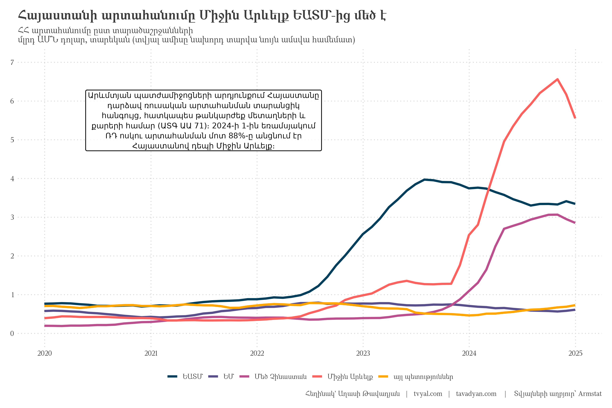
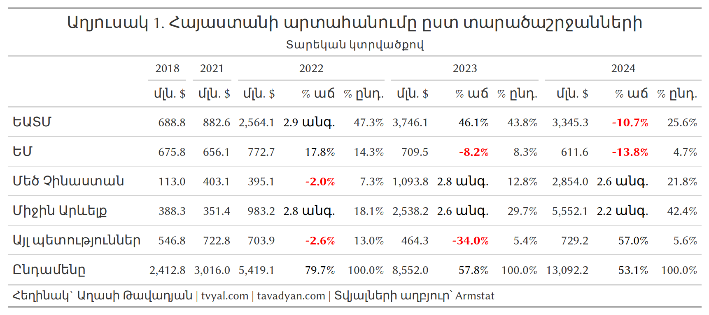
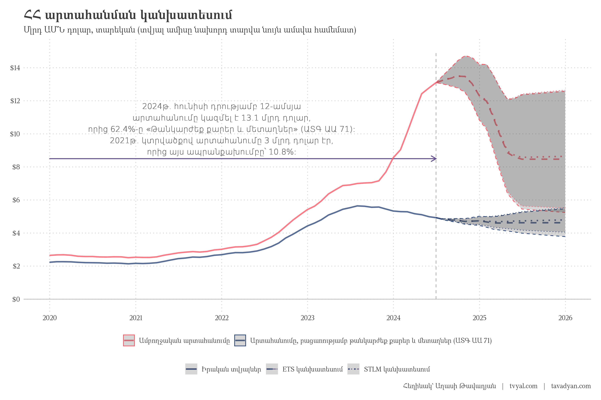
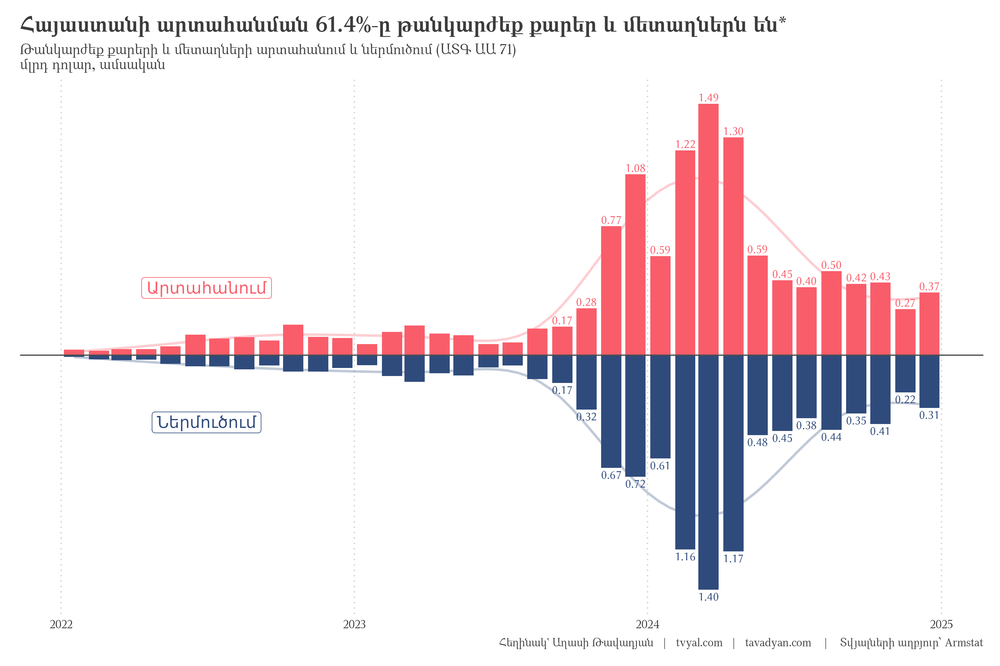

```{r setup, include=FALSE}
knitr::opts_chunk$set(echo = FALSE)

library(tidyverse)
library(RcppRoll)
library(scales)
library(gt)
library(webshot2)

# rm(list = ls()); gc()

setwd(dirname(rstudioapi::getActiveDocumentContext()$path))

source("../../initial_setup.R")

yaml_date <- as.Date(rmarkdown::metadata$date)

# Format the date for different uses
formatted_date_dmy <- format(yaml_date, "%d-%m-%Y")
formatted_date_year <- format(yaml_date, "%Y")
formatted_date_url <- format(yaml_date, "%Y_%m_%d")

# Create URL paths
newsletter_url <- paste0("https://www.tvyal.com/newsletter/", formatted_date_year, "/", formatted_date_url)
github_url <- paste0("https://github.com/tavad/tvyal_newsletter/blob/main/", formatted_date_year, "/")

```

```{r get data, include=FALSE}

arm_trade_country <- 
  read_csv("arm_trade_country.csv") 

arm_trade_commodity <- 
  read_csv("arm_trade_commodity.csv")

names_dic <- 
  read_csv("names_en_am_ru_short.csv") |> 
  mutate(hs2 = as.character(hs2))

commodity_groups_dic <- 
  read_csv("commodity_groups_dic.csv")

```

```{r add regions, include=FALSE}
EU = c("Austria", "Belgium", "Bulgaria", "Croatia", "Cyprus", "Czech Rep.",
       "Denmark", "Estonia", "Finland", "France", "Germany", "Greece", "Hungary",
       "Ireland", "Italy", "Latvia", "Lithuania", "Luxembourg", "Malta", "Netherlands",
       "Poland", "Portugal", "Romania", "Slovakia", "Slovenia", "Spain", "Sweden")

EAEU = c("Russian Federation", "Kazakhstan", "Belarus", "Armenia", "Kyrgyzstan")
        
Middle_East = c("Bahrain", "Egypt", "Iran", "Iraq", "Israel", "Jordan", "Kuwait",
                "Lebanon", "Oman", "Qatar", "Saudi Arabia", "Syria", "Turkey", 
                "United Arab Emirates", "Yemen")

China = c("China", "Hong Kong")

arm_trade_country <- 
  arm_trade_country |> 
  mutate(country_region = case_when(
    country %in% EU ~ "EU",
    country %in% EAEU ~ "EAEU",
    country %in% Middle_East ~ "Middle East",
    country %in% China ~ "Greater China",
    TRUE ~ "Other countries"
  ))

rm(EU, EAEU, Middle_East, China)
```


```{r plot 1 arm trade by regions, include=FALSE}
region_dic <- 
  tibble(
    country_region = c("EAEU", "EU", "Greater China", "Middle East", "Other countries"),
    country_region_arm = c("ԵԱՏՄ", "ԵՄ", "Մեծ Չինաստան", "Միջին Արևելք", "այլ պետություններ")
  )

plot_1_arm_trade_by_regions <-
  arm_trade_country |> 
  mutate(date = date + months(1) - days(1)) |> 
  group_by(country_region, date) |> 
  summarise(export = sum(export, na.rm = TRUE), .groups = "drop") |> 
  group_by(country_region) |> 
  mutate(
    export_yoy = roll_sumr(export, 12)
  ) |> 
  na.omit() |> 
  filter(
    date >= ym("2019-12")
  ) |> 
  left_join(region_dic, by = "country_region") |> 
  mutate(
    country_region_arm = fct_inorder(country_region_arm)
  ) |> 
  ggplot(aes(date, export_yoy / 1e6, color = country_region_arm)) +
  geom_line(linewidth = 1.5, alpha = 1) +
    annotate(
    "label",
    x = as.Date("2021-07-01"), 
    y = 5.5,
    label = "Արևմտյան պատժամիջոցների արդյունքում Հայաստանը\nդարձավ ռուսական արտահանման տարանցիկ\nհանգույց, հատկապես թանկարժեք մետաղների և\nքարերի համար (ԱՏԳ ԱԱ 71)։ 2024-ի 1-ին եռամսյակում\nՌԴ ոսկու արտահանման մոտ 88%-ը անցնում էր\nՀայաստանով դեպի Միջին Արևելք։",
    hjust = 0.5,
    vjust = 0.5,
    size = 3.8,
    lineheight = 1.1,
    family = "DejaVu Sans",
    color = "black",
    fill = "white",
    alpha = 0.8,
    label.size = 0.5
  ) +
  scale_x_date(date_breaks = "1 year", date_labels = "%Y") +
  scale_y_continuous(n.breaks = 8, labels = number_format(), limits = c(0,7)) +
  scale_color_manual(values = colfunc2(5)) +
  labs(
    x = NULL,
    y = NULL,
    color = NULL,
    title = "Հայաստանի արտահանումը Միջին Արևելք ԵԱՏՄ-ից մեծ է",
    subtitle = "ՀՀ արտահանումը ըստ տարածաշրջանների\nմլրդ ԱՄՆ դոլար, տարեկան (տվյալ ամիսը նախորդ տարվա նույն ամսվա համեմատ)",
    caption = caption_f("Armstat")
  )
```


```{r plot 2 exports by country, include=FALSE}

country_chosen = c("United Arab Emirates", "Russian Federation", "Hong Kong", "China")

plot_2_exports_by_country <- 
  arm_trade_country |> 
  mutate(
    country = ifelse(country %in% country_chosen, country, "The Rest (Other countries)"),
    country = ifelse(country %in% c("Hong Kong", "China"), "Hong Kong & China", country)
  ) |> 
  bind_rows(
    arm_trade_country |> mutate(country = "Total")
  ) |> 
  pivot_longer(
    contains("port"),
    names_to = "direction"
  ) |> 
  group_by(country, year, month, date, direction) |> 
  summarise(value = sum(value), .groups = "drop") |> 
  arrange(country, direction, date) |> 
  group_by(country, direction) |> 
  mutate(
    value_yoy = roll_sumr(value, 12),
    country = factor(
      country,
      levels = c("Russian Federation", "United Arab Emirates",
                 "Hong Kong & China", "Total", "The Rest (Other countries)"),
      labels = c("Ռուսաստանի Դաշնություն", "Արաբական Միացյալ Էմիրություններ",
                 "Հոնկոնգ և Չինաստան", "Ընդամենը", "Մնացածը (այլ պետություններ)"),
    ),
    date = date + months(1) - days(1)
  ) |> 
  filter(
    direction != "import_consignment",
    country != "Ընդամենը",
    year >= 2015
  ) |>
  ungroup() |> 
  na.omit() |> 
  filter(date >= ym("2019-12")) |> 
  ggplot(aes(date, value_yoy / 1e6, color = direction)) +
  geom_line(linewidth = 1.5) +
  facet_wrap(~country, scales = "free") +
  scale_x_date(date_breaks = "1 year", date_labels = "%Y") +
  scale_y_continuous(n.breaks = 6, labels = number_format()) +
  scale_color_manual(
    values = new_palette_colors[c(6,2)],
    labels = c("Արտահանում", "Ներմուծում")
  ) +
  labs(
    x = NULL,
    y = NULL,
    color = NULL,
    title = "Հայաստանից ներմուծումը և արտահանումը",
    subtitle = "Մլրդ ԱՄՆ դոլար, տարեկան (տվյալ ամիսը նախորդ տարվա նույն ամսվա համեմատ)",
    caption = caption_f("Armstat")
  )

```


```{r table 1 exports by regions, include=FALSE}
main_table_generator <- 
  function(tbl, year_, direction_ = "export", exclude_info_years, language){
    
    result_tbl <- 
      tbl |> 
      bind_rows(
        tbl |> 
          mutate(country_region = "Total")
      ) |> 
      group_by(year, country_region) |> 
      summarise(
        export = sum(export),
        import = sum(import_origin),
        .groups = "drop"
      ) |> 
      pivot_longer(c(export, import), names_to = "direction") |> 
      arrange(country_region, direction, year) |> 
      group_by(country_region, direction) |> 
      mutate(pct_growth = value / lag(value) - 1) |> 
      arrange(direction, year, country_region) |> 
      group_by(direction, year) |> 
      mutate(pct_part = value / sum(value) * 2) |> 
      ungroup() |> 
      filter(
        year %in% year_,
        direction == direction_
      ) |> 
      mutate(value = value / 1000) |> 
      pivot_wider(
        names_from = c(year, direction),
        values_from = c(value, pct_growth, pct_part),
        names_vary = "slowest"
      ) |> 
       select(-matches(paste0("pct_.*_", exclude_info_years, collapse = "|")))
  
    if(language == "rus"){
      result_tbl <- result_tbl |>  
        mutate(
          country_region = case_match(
            country_region,
            "EAEU" ~ "ЕАЭС",
            "EU" ~ "ЕС",
            "Greater China" ~ "Большой Китай",
            "Middle East" ~ "Средней Восток",
            "Other countries" ~ "Другие страны",
            "Total" ~ "Всего"
          )
        )
    } else if(language == "arm"){
      result_tbl <- result_tbl |>  
        mutate(
          country_region = case_match(
            country_region,
            "EAEU" ~ "ԵԱՏՄ",
            "EU" ~ "ԵՄ",
            "Greater China" ~ "Մեծ Չինաստան",
            "Middle East" ~ "Միջին Արևելք",
            "Other countries" ~ "Այլ պետություններ",
            "Total" ~ "Ընդամենը"
          )
        )
    }
    
    return(result_tbl)  
  }

table_1_exports_by_regions <- 
  main_table_generator(
    arm_trade_country |> filter(month %in% 1:12), year_ = c(2018, 2021:2024),
    direction_ = "export", exclude_info_years = c(2018:2021), language = "arm"
  ) |> 
  gt() |> 
  fmt_number(
    columns = contains("value"),
    decimals = 1, 
    use_seps = TRUE,
  ) |> 
  fmt_number(
    columns = contains("pct_part"),
    scale_by = 100,
    decimals = 1,
    pattern = "{x}%"
  ) |> 
  cols_label(
    country_region = "", 
    value_2018_export = "մլն․ $", 
    # value_2019_export = "մլն․ $", 
    # value_2020_export = "մլն․ $",
    value_2021_export = "մլն․ $", 
    value_2022_export = "մլն․ $", 
    pct_growth_2022_export = "% աճ", 
    pct_part_2022_export = "% ընդ․", 
    value_2023_export = "մլն․ $", 
    pct_growth_2023_export = "% աճ", 
    pct_part_2023_export = "% ընդ․", 
    value_2024_export = "մլն․ $", 
    pct_growth_2024_export = "% աճ", 
    pct_part_2024_export = "%  ընդ․"
  ) |> 
  # tab_spanner(
  #   label = "Արտահանում",
  #   columns = country_region
  # ) |>
  data_color(
    columns = matches("pct_growth"),
    fn = function(x) ifelse(x < 0, "red", "black"),
    apply_to = "text"
  ) |> 
  text_transform(
    locations = cells_body(columns = matches("pct_growth")),
    fn = function(x) {
      sapply(x, function(val) {
        val_num <- suppressWarnings(as.numeric(gsub("[^0-9.-]", "", val)))
        if (is.na(val_num)) {
          return(as.character(val))  # Return original if conversion fails
        } else if (val_num < 0) {
          return(paste0("<strong>", number(val_num * 100, accuracy = 0.1), "%", "</strong>"))
        } else if (val_num >= 1) {
          return(sprintf("%.1f անգ.", val_num + 1))
        } else {
          return(paste0(number(val_num * 100, accuracy = 0.1), "%"))
        }
      })
    }
  ) |> 
  tab_spanner(
    label = "2018",
    columns = contains("2018")
  ) |>
  #  tab_spanner(
  #   label = "2019",
  #   columns = contains("2019")
  # ) |>
  #  tab_spanner(
  #   label = "2020",
  #   columns = contains("2020")
  # ) |>
  tab_spanner(
    label = "2021",
    columns = contains("2021")
  ) |>
  tab_spanner(
    label = "2022",
    columns = contains("2022")
  ) |>
  tab_spanner(
    label = "2023",
    columns = contains("2023")
  ) |> 
  tab_spanner(
    label = "2024",
    columns = contains("2024")
  ) |> 
  tab_header(
    title = "Աղյուսակ 1. Հայաստանի արտահանումը ըստ տարածաշրջանների",
    subtitle = "Տարեկան կտրվածքով"
  ) |> 
  tab_footnote(
    footnote = caption_f("Armstat")
  )

gtsave(
  table_1_exports_by_regions,
  filename = "plots/table_1_exports_by_regions.png",
  expand = 10  # Add some padding around the table (in pixels)
)

arm_trade_country |> 
  select(year, country, export, import_origin) |> 
  pivot_longer(contains("port")) |> 
  group_by(year, country) |> 
  summarise(
    value = sum(value, na.rm = TRUE), .groups = "drop"
  ) |> 
  group_by(year) |> 
  mutate(
    pct = value / sum(value),
    pct_text = percent(pct, accuracy = 0.1)
  ) |> 
  ungroup() |> 
  arrange(desc(year), desc(value)) |> 
  filter(country == "Russian Federation")

```


```{r table 1 exports by goods, include=FALSE}
groups <- read_csv("~/proj/2021_CBA_grant/data_forecast/commodity_gruppings_dic.csv")

expand_range <- function(range_str) {
  parts <- strsplit(range_str, ",")[[1]]
  result <- numeric()
  for(part in parts) {
    part <- trimws(part)
    if(grepl("-", part)) {
      nums <- as.numeric(strsplit(part, "-")[[1]])
      nums <- as.numeric(nums)
      result <- c(result, seq(nums[1], nums[2]))
    } else {
      result <- c(result, as.numeric(part))
    }
  }
  return(result)
}

groups_expanded <- groups |> 
  mutate(
    hs2 = map(commodity_code_group, expand_range)
  ) |> 
  unnest(hs2) |> 
  mutate(
    hs2 = ifelse(commodity_code_group == "TOTAL", 0, hs2)
  )

main_table_commodity_generator <- 
  function(tbl, year_, direction_ = "export", exclude_info_years){
    
    result_tbl <-
      tbl |> 
      bind_rows(
        tbl |> 
          mutate(hs2 = 0)
      ) |> 
      left_join(groups_expanded, by = "hs2") |> 
      group_by(year, commodity_code_names_arm) |> 
      summarise(
        export = sum(export),
        import = sum(import),
        .groups = "drop"
      ) |> 
      pivot_longer(c(export, import), names_to = "direction") |> 
      arrange(commodity_code_names_arm, direction, year) |> 
      group_by(commodity_code_names_arm, direction) |> 
      mutate(pct_growth = value / lag(value) - 1) |> 
      arrange(direction, year, commodity_code_names_arm) |> 
      group_by(direction, year) |> 
      mutate(pct_part = value / sum(value) * 2) |> 
      ungroup() |> 
      filter(
        year %in% year_,
        direction == direction_
      ) |> 
      mutate(value = value / 1000) |> 
      pivot_wider(
        names_from = c(year, direction),
        values_from = c(value, pct_growth, pct_part),
        names_vary = "slowest"
      ) |> 
      select(-matches(paste0("pct_.*_", exclude_info_years, collapse = "|")))
  
    # if(language == "rus"){
    #   result_tbl <- result_tbl |>  
    #     mutate(
    #       country_region = case_match(
    #         country_region,
    #         "EAEU" ~ "ЕАЭС",
    #         "EU" ~ "ЕС",
    #         "Greater China" ~ "Большой Китай",
    #         "Middle East" ~ "Средней Восток",
    #         "Other countries" ~ "Другие страны",
    #         "Total" ~ "Всего"
    #       )
    #     )
    # } else if(language == "arm"){
    #   result_tbl <- result_tbl |>  
    #     mutate(
    #       country_region = case_match(
    #         country_region,
    #         "EAEU" ~ "ԵԱՏՄ",
    #         "EU" ~ "ԵՄ",
    #         "Greater China" ~ "Մեծ Չինաստան",
    #         "Middle East" ~ "Միջին Արևելք",
    #         "Other countries" ~ "Այլ պետություններ",
    #         "Total" ~ "Ընդամենը"
    #       )
    #     )
    # }
    
    return(result_tbl)  
  }

# table_1_exports_by_regions <- 
main_table_commodity_generator(
    arm_trade_commodity |> filter(month %in% 1:12), year_ = 2018:2024,
    direction_ = "export", exclude_info_years = c(2018:2022)
  ) |> 
  gt() |> 
  fmt_number(
    columns = contains("value"),
    decimals = 1, 
    use_seps = TRUE,
  ) |> 
  fmt_number(
    columns = contains("pct"),
    scale_by = 100,
    decimals = 1,
    pattern = "{x}%"
  ) |> 
  cols_label(
    commodity_code_names_arm = "", 
    value_2018_export = "մլն․ $", 
    value_2019_export = "մլն․ $", 
    value_2020_export = "մլն․ $",
    value_2021_export = "մլն․ $", 
    value_2022_export = "մլն․ $", 
    value_2023_export = "մլն․ $", 
    pct_growth_2023_export = "% աճ", 
    pct_part_2023_export = "% ընդ․", 
    value_2024_export = "մլն․ $", 
    pct_growth_2024_export = "% աճ", 
    pct_part_2024_export = "%  ընդ․"
  ) |> 
  # tab_spanner(
  #   label = "Արտահանում",
  #   columns = country_region
  # ) |>
  data_color(
    columns = matches("pct_growth"),
    fn = function(x) ifelse(x < 0, "red", "black"),
    apply_to = "text"
  ) |> 
  text_transform(
    locations = cells_body(columns = matches("pct_growth")),
    fn = function(x) ifelse(x < 0, paste0("<strong>", x, "</strong>"), x)
  ) |> 
   tab_spanner(
    label = "2018",
    columns = contains("2018")
  ) |>
   tab_spanner(
    label = "2019",
    columns = contains("2019")
  ) |>
   tab_spanner(
    label = "2020",
    columns = contains("2020")
  ) |>
  tab_spanner(
    label = "2021",
    columns = contains("2021")
  ) |>
  tab_spanner(
    label = "2022",
    columns = contains("2022")
  ) |>
  tab_spanner(
    label = "2023",
    columns = contains("2023")
  ) |> 
  tab_spanner(
    label = "2024",
    columns = contains("2024")
  ) |> 
  tab_header(
    title = "Աղյուսակ 1. Հայաստանի արտահանումը ըստ տարածաշրջանների",
    subtitle = "Տվյալները տրված են առաջին կիսամյակի կտրվածքով"
  ) |> 
  tab_footnote(
    footnote = caption_f("Armstat")
  )


#########################################################

table_2_exports_by_goods <- 
  arm_trade_commodity |> 
  bind_rows(
    arm_trade_commodity |> 
      mutate(hs2 = 0)
  ) |> 
  left_join(groups_expanded, by = "hs2") |> 
  group_by(year, commodity_code_names_arm) |> 
  summarise(
    export = sum(export),
    import = sum(import),
    .groups = "drop"
  ) |> 
  pivot_longer(c(export, import), names_to = "direction") |> 
  filter(year %in% c(2021,2024)) |> 
  arrange(commodity_code_names_arm, direction, year) |> 
  group_by(commodity_code_names_arm, direction) |> 
  mutate(pct_growth = value / lag(value) - 1) |> 
  arrange(direction, year, commodity_code_names_arm) |> 
  group_by(direction, year) |> 
  mutate(pct_part = value / sum(value) * 2) |> 
  ungroup() |> 
  filter(
    direction == "export"
  ) |> 
  mutate(value = value / 1000) |> 
  pivot_wider(
    names_from = c(year, direction),
    values_from = c(value, pct_growth, pct_part),
    names_vary = "slowest"
  ) |> 
  select(-pct_growth_2021_export) |> 
  gt() |> 
  fmt_number(
    columns = contains("value"),
    decimals = 1, 
    use_seps = TRUE,
  ) |> 
  fmt_number(
    columns = contains("pct_part"),
    scale_by = 100,
    decimals = 1,
    pattern = "{x}%"
  ) |> 
  cols_label(
    commodity_code_names_arm = "", 
    value_2021_export = "մլն․ $", 
    pct_part_2021_export = "% ընդ․", 
    value_2024_export = "մլն․ $", 
    pct_growth_2024_export = "% աճ", 
    pct_part_2024_export = "%  ընդ․"
  ) |> 
  # tab_spanner(
  #   label = "Արտահանում",
  #   columns = country_region
  # ) |>
  data_color(
    columns = matches("pct_growth"),
    fn = function(x) ifelse(x < 0, "red", "black"),
    apply_to = "text"
  ) |> 
  text_transform(
    locations = cells_body(columns = matches("pct_growth")),
    fn = function(x) {
      sapply(x, function(val) {
        val_num <- suppressWarnings(as.numeric(gsub("[^0-9.-]", "", val)))
        if (is.na(val_num)) {
          return(as.character(val))  # Return original if conversion fails
        } else if (val_num < 0) {
          return(paste0("<strong>", number(val_num * 100, accuracy = 0.1), "%", "</strong>"))
        } else if (val_num >= 1) {
          return(sprintf("%.1f անգ.", val_num + 1))
        } else {
          return(paste0(number(val_num * 100, accuracy = 0.1), "%"))
        }
      })
    }
  ) |> 
  tab_spanner(
    label = "2021",
    columns = contains("2021")
  ) |>
  tab_spanner(
    label = "2024",
    columns = contains("2024")
  ) |> 
  tab_header(
    title = "Աղյուսակ 2. Հայաստանի արտահանումը ըստ տարածաշրջանների",
    subtitle = "Տարեկան կտրվածքով"
  ) |> 
  tab_footnote(
    footnote = caption_f("Armstat")
  )

gtsave(
  table_2_exports_by_goods,
  filename = "plots/table_2_exports_by_goods.png",
  expand = 10  # Add some padding around the table (in pixels)
)


```


```{r plot 3 exports forecast, include=FALSE}
exports_forecast <- read_csv("exports_forecast.csv")

plot_3_exports_forecast <- 
  exports_forecast |> 
  mutate(across(matches("ribbon|value"), ~.x/1e6)) |> 
  ggplot(aes(date, value, color = info, lty = model_name)) +
  geom_segment(
    aes(x = ymd("2020-01-01"), y = 8.5, xend = ymd("2024-06-30"), yend = 8.5),
    arrow = arrow(length = unit(0.02, "npc")),
    color = new_palette_colors[3],
    lineend = "round", linejoin = "mitre"
  ) +
  geom_segment(
    aes(x = ymd("2024-06-30"), y = 0, xend = ymd("2024-06-30"), yend = 15),
    color = "gray", linetype = 2,
  ) +
  geom_line(linewidth = 1) +
  geom_ribbon(aes(ymin = ribbon_low , ymax = ribbon_high), alpha = .2) +
  geom_hline(yintercept = 0, color = "gray") +
  geom_text(
    aes(
      x = ymd("2022-01-01"), y = 10.3, fontface = "plain",
      label = "2024թ. հունիսի դրությամբ 12-ամսյա\nարտահանումը կազմել է 13.1 մլրդ դոլար,\nորից 62.4%-ը «Թանկարժեք քարեր և մետաղներ» (ԱՏԳ ԱԱ 71):\n2021թ. կտրվածքով արտահանումը 3 մլրդ դոլար էր,\nորից այս ապրանքախումբը՝ 10.8%:"
    ),
    size = 4,
    color = "gray40",
    family = "DejaVu Sans Light"  # Change to a font that supports Armenian
  ) +
  scale_x_date(date_breaks = "1 year", date_labels = "%Y") +
  scale_y_continuous(breaks = seq(0,14,2), labels = dollar_format(), limits = c(0, 15)) +
  scale_color_manual(
    values = new_palette_colors[c(6,2)],
    labels = c("Ամբողջական արտահանումը", "Արտահանումը, բացառությամբ թանկարժեք քարեր և մետաղներ (ԱՏԳ ԱԱ 71)")
  ) +
  scale_linetype_manual(
    values = c(1, 2, 3),
    labels = c("Իրական տվյալներ", "ETS կանխատեսում", "STLM կանխատեսում")
  ) +
  guides(
    color = guide_legend(order = 1),
    linetype = guide_legend(order = 2)
  ) +
  labs(
    x = NULL,
    y = NULL,
    color = NULL,
    linetype = NULL,
    title = "ՀՀ արտահանման կանխատեսում",
    subtitle = "Մլրդ ԱՄՆ դոլար, տարեկան (տվյալ ամիսը նախորդ տարվա նույն ամսվա համեմատ)",
    caption = caption_f()
  )

```


```{r plot 4 gold trade, include=FALSE}

arm_trade_commodity_groupped <- 
  arm_trade_commodity |> 
  group_by(date, hs2) |> 
  summarise(
    import = sum(import),
    export = sum(export),
    .groups = "drop"
  ) |> 
  pivot_longer(c(import, export), names_to = "direction") |> 
  arrange(hs2, direction, date)

arm_trade_commodity_groupped |> 
  filter(direction == "export") |> 
  mutate(is71 = ifelse(hs2 == 71, "71", "not71")) |> 
  group_by(is71, date) |> 
  summarise(value = sum(value), .groups = "drop") |>
  mutate(value = roll_sumr(value, 12)) |> 
  filter(date >= ymd("2019-12-01")) |> 
  group_by(date) |> 
  mutate(
    total = sum(value),
    pct = value / total
  )
  # view()

arm_trade_commodity_groupped |> 
  filter(
    # direction == "export",
    hs2 == 71, 
    date >= ymd("2022-01-01")
  ) |> 
  mutate(
    direction = ifelse(direction == "export", "Արտահանում", "Ներմուծում")
  ) |> 
  mutate(date = date + days(16)) |> 
  ggplot(aes(date, value/1e3, fill = direction)) +
  geom_col() +
  facet_wrap(~direction, scales = "free_y", ncol = 1) +
  scale_y_continuous(labels = dollar_format()) +
  scale_fill_manual(values = new_palette_colors[c(6,2)]) +
  labs(
    x = NULL,
    y = NULL,
    fill = NULL,
    title = "Թանկարժեք քարերի և մետաղների արտահանում (ԱՏԳ ԱԱ 71)",
    subtitle = "մլն դոլար, ամսական",
    caption = caption_f()
  ) +
  theme(
    legend.position = "drop"
  )

plot_4_gold_trade <-
  arm_trade_commodity_groupped |> 
  filter(
    # direction == "export",
    hs2 == 71, 
    date >= ymd("2022-01-01")
  ) |> 
  mutate(
    value = value/1e6,
    text = ifelse(date >= ymd("2023-09-01"), number(value, accuracy = 0.01), ""),
    value = ifelse(direction == "export", value, -value),
    direction = ifelse(direction == "export", "Արտահանում", "Ներմուծում")
  ) |> 
  mutate(date = date + days(16)) %>%
  ggplot(aes(date, value)) +
  geom_smooth(
    data = . %>% filter(direction == "Ներմուծում"),
    se = FALSE, 
    method = "gam",
    color = adjustcolor(new_palette_colors[2], alpha.f = 0.3),
  ) +
  geom_smooth(
    data = . %>% filter(direction == "Արտահանում"),
    se = FALSE, 
    method = "gam",
    color = adjustcolor(new_palette_colors[6], alpha.f = 0.3),
  ) +
  geom_col(aes(fill = direction), alpha = 1) +
  geom_hline(yintercept = 0, color = "gray30") +
  geom_text(
    aes(label = text, color = direction,
    vjust = ifelse(direction == "Արտահանում", -0.3, 1.3))
  ) +
  geom_label(
    data = tibble(
      x = ymd("2022-07-01"), y = c(0.4,-0.4),
      label = c("Արտահանում", "Ներմուծում")
    ),
    mapping = aes(x, y , label = label, color = label),
    size = 5
  ) +
  scale_y_continuous(labels = NULL) +
  scale_fill_manual(values = new_palette_colors[c(6,2)]) +
  scale_color_manual(values = new_palette_colors[c(6,2)]) +
  labs(
    x = NULL,
    y = NULL,
    fill = NULL,
    title = "Հայաստանի արտահանման 61.4%-ը թանկարժեք քարեր և մետաղներն են*",
    subtitle = "Թանկարժեք քարերի և մետաղների արտահանում և ներմուծում (ԱՏԳ ԱԱ 71)\nմլրդ դոլար, ամսական",
    caption = caption_f("Armstat")
  ) + 
  theme(
    legend.position = "drop",
    panel.grid.major.y = element_blank()
  )

```


```{r save plots, include=FALSE}

ggsave("plots/plot_1_arm_trade_by_regions.png", plot_1_arm_trade_by_regions, width = 12, height = 8)
ggsave("plots/plot_2_exports_by_country.png", plot_2_exports_by_country, width = 12, height = 8)
ggsave("plots/plot_3_exports_forecast.png", plot_3_exports_forecast, width = 12, height = 8)
ggsave("plots/plot_4_gold_trade.png", plot_4_gold_trade, width = 12, height = 8)

system("cd ../.. | git all")
```


***English summary below.***

## 💎🎭🔮️ [Ոսկե Պատրանք. Հայաստանի արտահանման իրական պատկերը](`r newsletter_url`)

Հայաստանի տնտեսությունում տարօրինակ իրավիճակ է ստեղծվել: Պաշտոնական վիճակագրությունը ցույց է տալիս արտահանման աննախադեպ աճ, սակայն իրականությունն այլ է:

Առաջին հայացքից Հայաստանի արտահանման ցուցանիշները ապշեցուցիչ են: 2024 թվականին երկրի արտահանումը հասել է 13.1 միլիարդ դոլարի՝ ավելի քան քառապատկելով 2021 թվականի 3.0 միլիարդ դոլարը: Սովորաբար նման կտրուկ աճը կնշանակեր, որ տնտեսությունը լիակատար թափով առաջ է շարժվում: Սակայն ավելի մանրակրկիտ ուսումնասիրությունը բացահայտում է ոչ այնքան դրական իրականություն:

Գծապատկեր 1.



Առաջին գծապատկերը պատկերում է արտահանման կտրուկ փոփոխությունը: Գծապատկերը ցույց է տալիս, որ Հայաստանի արտահանումը դեպի Միջին Արևելք սրընթաց կտրուկ աճել է՝ գերազանցելով նույնիսկ դեպի Եվրասիական տնտեսական միություն (ԵԱՏՄ) արտահանումը: Առաջին հայացքից կարող է թվալ, թե սա տնտեսական դիվերսիֆիկացման հաջողություն է, սակայն իրականությունն այլ է:

2024 թվականին Հայաստանի արտահանման առյուծի բաժինը՝ ապշեցուցիչ 61.4%-ը, բաժին է ընկնում մեկ ապրանքատեսակի՝ թանկարժեք մետաղներին և քարերին, որի մեջ գերակշռում է ոսկին: Սակայն Հայաստանը չի ապրում ժամանակակից ոսկու տենդ: Փոխարենը, այն դարձել է Ռուսաստանի ոսկու առևտրի կարևոր հանգույց: 2024 թվականի առաջին եռամսյակում Ռուսաստանի ոսկու արտահանման 88%-ն անցել է Հայաստանով:[Կարդալ ավելին՝ 🇷🇺💰🇦🇲 Հայաստան` ռուսական ոսկու հանգրվան](https://www.tvyal.com/newsletter/2024/2024_07_05):

Այս երևույթը վերաարտահանման տիպիկ դեպք է, և այն արմատապես փոխել է Հայաստանի առևտրային պատկերը: Մերձավոր Արևելքը` հատկապես Արաբական Միացյալ Էմիրությունները, հանկարծակի դարձել են Հայաստանի արտահանման հիմնական ուղղությունը՝ կազմելով 2024 թվականի ընդհանուր արտահանման 42.4%-ը: Սա հսկայական տեղաշարժ է ընդամենը մի քանի տարի առաջվա համեմատ, երբ ԵԱՏՄ-ն և Եվրոպական Միությունը հիմնական առևտրային գործընկերներն էին:

Աղյուսակ 1.

```{r table1, echo=FALSE, warning=FALSE, message=FALSE, fig.width = 12, fig.height = 8}
table_1_exports_by_regions
```

<!--  -->


Ներկայացված աղյուսակը ցույց է տալիս առևտրային հոսքերի կտրուկ փոփոխությունները: ԵՄ արտահանման չափաբաժինը նվազել է 2021 թվականի 21%-ից մինչև ընդամենը 4.7%։ 2024 թվականին ԵՄ արտահանումը նվազել է 2023 թվականի համեմատ 13.8%-ով: Սա պարզապես չափաբաժինների փոփոխություն չէ, այլ հայեցակարգային փոփոխություն, որն ունի հեռուն գնացող հետևանքներ: նշենք որ 2018-ից սկսած ԵՄ արտահանումը կրճատվել է 9.5%-ով։

Աղյուսակ 2.

```{r table2, echo=FALSE, warning=FALSE, message=FALSE, fig.width = 12, fig.height = 8}
table_2_exports_by_goods
```

Աղյուսակ 2-ը ցույց է տալիս ապրանքախմբերի ըստ արտահանման կտրուկ փոփոխությունները 2021 և 2024 թվականների միջև: Ամենացայտուն փոփոխությունը տեղի է ունեցել թանկարժեք քարերի և մետաղների (ԱՏԳ ԱԱ 71) կատեգորիայում, որն աճել է ապշեցուցիչ 24.6 անգամ՝ 2021թ. 326.3 միլիոն դոլարից հասնելով 2024թ. 8 միլիարդ դոլարի: Սա կազմում է 2024թ. ընդհանուր արտահանման 61.4%-ը, համեմատած 2021թ. ընդամենը 10.8%-ի հետ: Նշանակալի աճ է գրանցվել նաև տրանսպորտի և սարքավորումների (ԱՏԳ ԱԱ 84-89) ոլորտում՝ 15.2 անգամ աճելով՝ 95.4 միլիոն դոլարից հասնելով 1.45 միլիարդ դոլարի:

Մինչդեռ Հայաստանի ավանդական արտահանման ոլորտները, ինչպիսիք են մետաղները և դրանցից արտադրանքը (ԱՏԳ ԱԱ 72-83), ցույց են տալիս անփոփոխ կամ նույնիսկ նվազող արդյունքներ: Այս փոփոխությունները հստակորեն վկայում են, որ Հայաստանի արտահանման աճը գլխավորապես պայմանավորված է եղել վերաարտահանման գործունեությամբ, այլ ոչ թե տեղական արտադրության կամ ավելացված արժեքի ավելացմամբ:

2024թ. արտահանման 13.1 մլրդ դոլար ընդհանուր ծավալից շուրջ 9.3 մլրդ դոլարը (71%) վերաարտահանում է, որը կազմում է թանկարժեք քարերն ու մետաղները (8.0 մլրդ), էլեկտրական սարքավորումները (1.1 մլրդ) և մեքենաները (0.2 մլրդ): Եթե հանենք այս ապրանքները 2024թ․ արտահանումից, ապա իրական արտահանումը կազմում է մոտ 3.7 մլրդ դոլար, ինչը համադրելի է 2021թ. 3.0 մլրդ դոլար ընդհանուր արտահանման ցուցանիշի հետ: Այստեղ 71% ստացվել է պարզ հաշվարկով՝ իրար գումարոլով թանկարժեք քարարի և մետաղների, ինչպես նաև տեխնիկայի և ավտոմեքնենաների առևտրաշրջանառութայան հոդվածները։

Սա վկայում է, որ վերջին երեք տարիների ընթացքում Հայաստանի իրական արտահանման ներուժը էական փոփոխություն չի կրել՝ չնայած ընդհանուր արտահանման ցուցանիշների կտրուկ աճին:

Իսկ ի՞նչ է կատարվում Հայաստանի ավանդական արտահանման հետ: Նշենք, որ մենք գնահատել ենք Հայաստանի իրական վերաարտահանման ծավալները՝ օգտագործելով նոր մեթոդաբանություն, որը մանրամասն ներկայացված է [🚀♻🟨 ️Ոսկու տենդ. Հայաստանի արտահանման կեսը վերաարտահանում է](https://www.tvyal.com/newsletter/2024/2024_04_12) հոդվածում: Այս վերլուծությունը ցույց է տալիս, որ Հայաստանի «իրական» արտահանումը փաստացի նվազել է: Ըստ ավելի խորքային գնահատականի՝ 2024 թվականին արտահանման մոտ 75%-ն արդեն վերաարտահանում է, համեմատած 2021 թվականի հետ, երբ այս ցուցանիշը 6% էր: Փաստացի 2024 թվականին` առանց վերաարտահանման, իրական արտահանումը կազմել է մոտ 3.7 միլիարդ դոլար, ինչը հազիվ է գերազանցում 2021 թվականի 3.0 միլիարդ դոլարը: Արտահանման թվերը ներառում են նաև վերաարտահանումը։ Այսպես, արտահանումը 2021 թվականի 3 մլրդ ցուցանիշից արդեն իսկ ուռճացվել է մինչև 13 մլրդ դոլարի։ Այսինքն՝ 4.3 անգամ առաջին հայացքից տպավորիչ ուռճացված աճ՝ այս պահին ի հաշիվ ոսկու վերաարտահանման։

Մեր կատարած կանխատեսումը իրականանում է․ Մենք կես տարի առաջ գրել էինք արտահանման վտանգավոր իրավիճակի մասին և տվել կանխատեսումը։

Մինչ ԱՄԷ և Հոնկոնգ արտահանումը (հիմնականում ոսկի) կտրուկ աճում է, այլ երկրներ, այդ թվում՝ Ռուսաստան արտահանումը նվազում է: Այս  [🤒🟨♻️ «ոսկու տենդը»](https://www.tvyal.com/newsletter/2024/2024_05_11) քողարկում է Հայաստանի իրական տնտեսության, առևտրաշրջանառության և ՀՆԱ անկումը։ Այն ուռճացրել է ՀՆԱ-ի ցուցանիշները՝ ստեղծելով տնտեսական աճի պատրանք այնտեղ, որտեղ աճը փոքր է: 2024 թվականի առաջին եռամսյակում Հայաստանի կառավարությունը հպարտացել էր տպավորիչ 9.2% ՀՆԱ-ի աճով: Մեր  [գնահատականները ցույց տվեցին](https://www.aravot.am/2024/08/10/1437252/), որ այս աճի ցնցող 4%-ը պայմանավորված էր միայն ոսկու վերաարտահանման «արդյունաբերությամբ» (կարդացեք ավելին՝ [🌿🤨💎 Թանկարժեք էֆեկտ․ 2024 թվականի տնտեսական աճի պատճառները](https://www.tvyal.com/newsletter/2024/2024_03_29)): Այս հրապարակումն անելուց հետո հոկտեմբերի 20-ին այս թիվը վերանայվեց՝ հասնելով 6.6%-ի: Հիմնական վերանայումը եղավ ոսկու վերաարտահանման «արտադրության» իջեցումը ՀՆԱ-ում` 4 տոկոսային կետից մինչև 1.2 տոկոսային կետ: Սա պարզապես վերանայում չէ, այլ հայեցակարգային փոփոխություն: Թվացյալ աճի միտումից Հայաստանն այժմ գտնվում է լճացման ուղղու վրա:

Գծապատկեր 3.



Երրորդ գծապատկերը ցույց է տալիս ոչ դրական կանխատեսում: Մինչ ընդհանուր արտահանումը թվացյալ սլանում է վեր, թանկարժեք մետաղների և քարերի վերաարտահանման հաշվին (ԱՏԳ ԱԱ 71), այլ բոլոր ապրանքների արտահանման կտրվածքով առկա է անկում: Այս տարբերությունը Հայաստանի ներկայիս տնտեսական պատրանքի իրականությունն է: Գծապատկերում կարմիր և կապույտ գծերի միջև մակերեսն արտացոլում է թանկարժեք քարերի և մետաղների մասնաբաժինն ընդհանուր արտահանման մեջ:

Այս ոսկե շահույթի կայունությունը լավագույն դեպքում կասկածելի է: Հայաստանի միջոցով ոսկու վերաարտահանման աճը մեծապես պայմանավորված է աշխարհաքաղաքական հանգամանքներով, մասնավորապես՝ Ռուսաստանի նկատմամբ արևմտյան պատժամիջոցներով: Սա ժամանակավոր երևույթ է և պայմանավորված է համաշխարհային տնտեսական իրողություններով, որոնք արդեն իսկ փոխվում են:

Գծապատկեր 4.



Այս գծապատկերը ցույց է տալիս թանկարժեք մետաղների արտահանման և ներմուծման կտրուկ աճը 2023-ի նոյեմբերից մինչև 2024-ի ապրիլը: Ուշադրություն դարձրեք վերջին ամիսներին, որը Հայաստանի «ոսկե արտահանման դարաշրջանի» ավարտի նշան է:

Գծապատկերից երևում է, որ միայն 2024 թվականի մարտին 1.4 մլրդ դոլարի թանկարժեք քարեր և մետաղներ է ներմուծվել Ռուսաստանից Հայաստան, որից հետո այն կտրուկ անկում է ապրել։ Դեկտեմբերին ներմուծվել է 310 մլն դոլարի ոսկի։ Պիկային կետից ոսկու և այլ թանկարժեք քարերի և մետաղների ներմուծումն ընկել է 4.5 անգամ։

Ռուսաստանում վերջերս տեղի ունեցած օրենսդրական փոփոխությունների արդյունքում [վերացվեց ոսկու արտահանման մաքսատուրքը](https://www.finam.ru/publications/item/otmena-eksportnoy-poshliny-na-zoloto-podderzhit-nastroeniya-na-rynke-20240417-1230/), որի ներդրումից հետո ՌԴ ոսկու արտահանման 88%-ն անցավ Հայաստանով։ Ոսկու տարանցիկ հոսքն արդեն իսկ նվազում է: Վերջին ամիսներում Հայաստանի արտահանման և ՀՆԱ-ի աճը հիմնված էր այս արտաքին, ժամանակավոր և արհեստական երևույթի վրա, որը տնտեսությունը դնում է խիստ անկայուն վիճակի մեջ: Այն քողարկում է իրական տնտեսության անկումը և շեղում ուշադրությունն իրական տնտեսական իրավիճակից և տնտեսական փոփոխությունների անհրաժեշտությունից:

Մինչ Հայաստանը հեծել է այս ոսկե ալիքը, անտեսվում է կայուն, բարձր ավելացված արժեք ունեցող ճյուղերի զարգացումը, որոնք կարող են ապահովել երկարաժամկետ տնտեսական կայունություն: ԵԱՏՄ և ԵՄ-ի ավանդական շուկաներ արտահանման անկումը հատկապես մտահոգիչ է, քանի որ այն կարող է վկայել մրցունակության կորստի մասին այն ոլորտներում, որոնք նախկինում Հայաստանի տնտեսության հենասյուներն էին:

Մոտակա ամիսները վճռորոշ կլինեն, քանի որ ոսկու վերաարտահանման սրընթաց աճն արդեն մարում է, Հայաստանը կարող է հայտնվել դաժան տնտեսական իրականության առջև: Տնտեսության իրական վիճակը, որը մինչ այժմ թաքնված էր ոսկու փայլի հետևում, կդառնա ավելի ակնհայտ:

Անհրաժեշտ է հայացքը բևեռել այս «ոսկե դարաշրջանից» այն կողմ և սկսել կառուցել իրական արտադրական հիմք ունեցող, երկարաժամկետ և կայուն ավելացված արժեք ստեղծող տնտեսություն, որը հիմնված չի լինի ժամանակավոր և ոչ կայուն արտաքին ազդակների վրա, որոնք և հիմնականում ապահովել են Հայաստանի ժամանակավոր երկնիշ տնտեսական աճը։ Անհրաժեշտ է կառուցել դիմացկուն տնտեսություն, որը ներառում է ներդրումներ կրթության մեջ, նորարարության խթանում և բարձր արժեք ունեցող ճյուղերի աճի համար նպաստավոր միջավայրի ստեղծում, ինչպես նաև [🧮⏳🎲 արդյունավետ հարկային դաշտի ձևավորում](https://www.tvyal.com/newsletter/2024/2024_08_02):

Այս վերլուծությունը ցույց է տալիս, որ Հայաստանը կանգնած է կարևոր խաչմերուկի առջև: Հայաստանի «ոսկե պատրանքը» զգուշացնող օրինակ է ծառայում զարգացող տնտեսությունների համար: Այն ընդգծում է ժամանակավոր շահույթների վրա հենվելու վտանգը և ամուր, բազմազանեցված տնտեսական հիմք ստեղծելու կարևորությունը: Ոսկու տենդից ապաքինվելուն զուգընթաց, Հայաստանի իրական տնտեսական ուժը կենթարկվի փորձության: Հարցը մնում է բաց. երբ ոսկու փոշին նստի, ի՞նչը կշարունակի փայլել Հայաստանի տնտեսությունում:


-----

-----

Եթե հնարավոր է, խնդրում եմ այս նյութը ուղարկել նաև այն մարդկանց, ում այն կարծում եք կարող է հետաքրքրել:

***Թավադյան, Աղ․Ա․ (`r formatted_date_year`)․ Ոսկե Պատրանք. Հայաստանի արտահանման իրական պատկեր [Golden Illusion: The Real Picture of Armenia's Exports]․ Tvyal.com հարթակ [Tvyal.com platform], `r formatted_date_dmy`․ `r newsletter_url`***

**Արգելվում է այս հարթակի նյութերը արտատպել առանց հղում կատարելու։**    

<small>\* Այս և մեր բոլոր այլ վերլուծությունների տվյալները վերցված են պաշտոնական աղբյուրներից։ Հաշվարկները ամբողջությամբ հասանելի են github-ում, դրանք կարելի է ստուգել` այցելելով [github-ի](`r github_url`) մեր էջը, որտեղ տրված են տվյալները, հաշվարկների և գծապատկերների կոդը։
</small>


-----

# ՀԱՄԱԳՈՐԾԱԿՑՈՒԹՅՈՒՆ

<style>
.ai-services-banner-tvyal {
background-color: #0a192f;
color: #e6f1ff;
padding: 30px;
font-family: Arial, sans-serif;
border-radius: 10px;
box-shadow: 0 4px 6px rgba(0, 0, 0, 0.1);
position: relative;
overflow: hidden;
min-height: 400px;
display: flex;
flex-direction: column;
justify-content: center;
}
.ai-services-banner-tvyal::before {
content: '';
position: absolute;
top: -25%;
left: -25%;
right: -25%;
bottom: -25%;
background: repeating-radial-gradient(
circle at 50% 50%,
rgba(100, 255, 218, 0.1),
rgba(100, 255, 218, 0.1) 15px,
transparent 15px,
transparent 30px
);
animation: gaussianWaveTvyal 10s infinite alternate;
opacity: 0.3;
z-index: 0;
}
@keyframes gaussianWaveTvyal {
0% {
transform: scale(1.5) rotate(0deg);
opacity: 0.2;
}
50% {
transform: scale(2.25) rotate(180deg);
opacity: 0.5;
}
100% {
transform: scale(1.5) rotate(360deg);
opacity: 0.2;
}
}
.ai-services-banner-tvyal > * {
position: relative;
z-index: 1;
}
.ai-services-banner-tvyal h2,
.ai-services-banner-tvyal h3 {
margin-bottom: 20px;
color: #ccd6f6;
}
.ai-services-banner-tvyal ul {
margin-bottom: 30px;
padding-left: 20px;
}
.ai-services-banner-tvyal li {
margin-bottom: 10px;
}
.ai-services-banner-tvyal a {
color: #64ffda;
text-decoration: none;
transition: color 0.3s ease;
}
.ai-services-banner-tvyal a:hover {
color: #ffd700;
text-decoration: underline;
}
</style>

<div class="ai-services-banner-tvyal">
## [Եթե ուզում եք  AI գործիքներով ձեր տվյալներից օգուտ քաղել` ԴԻՄԵՔ ՄԵԶ](mailto:a@tavadyan.com?subject=Let's Put Data to Work!)

### Մենք առաջարկում ենք

- Extensive databases for finding both international and local leads
- Exclusive reports on the Future of the Armenian Economy
- Work and browser automation to streamline operations and reduce staffing needs
- AI models for forecasting growth and optimizing various aspects of your business
- Advanced dashboarding and BI solutions
- Algorithmic trading

### [Let's Put Your Data to Work!](mailto:a@tavadyan.com?subject=Let's Put Data to Work!)

### [ՄԻԱՑԵՔ ՄԵՐ ԹԻՄԻՆ](mailto:a@tavadyan.com?subject=Work application)
</div>


-----

## ԶԼՄ հաղորդագրություն


Իրական տնտեսության և արտահանման անկման վերաբերյալ դիտեք և կարդացեք հետևյալ նյութերը․

1. 📺 [Տնտեսության բոլոր հիմնական ճյուղերն անկում են գրանցել. Աղասի Թավադյան](https://youtu.be/S0usSydpDoU),
2. 📄 [Հայաստանի տնտեսության հիմնական ճյուղերն անկում են գրանցել. Աղասի Թավադյանն ահազանգում է](https://www.aravot.am/2024/08/28/1439924/), Առավոտ,
3. 📄 [Հայաստանի տնտեսությունը 2024թ. առաջին կիսամյակում ԵԱՏՄ անդամակցության համատեքստում](https://soyuzinfo.am/hy/2024/08/2024-3/), soyuzinfo.am:

-----


## English Summary

### 💎🎭🔮 Golden Illusion of Exports: The Real Picture of Armenia's Exports

Armenia's economy is experiencing a deceptive boom, with official statistics showing unprecedented export growth. In 2024, exports reached \$13.1 billion, more than quadrupling the \$3.0 billion from 2021. However, this growth is primarily driven by the re-export of precious stones and metals (mainly gold) from Russia, which has increased by a staggering 24.6 times and now accounts for 61.4% of total exports (up from just 10.8% in 2021). The Middle East, particularly the UAE, has become Armenia's main export destination, comprising 42.4% of total exports in 2024, while EU's export share has dropped from 21% in 2021 to just 4.7% (having decreased by 9.5% since 2018).

This "golden illusion" masks a decline in Armenia's real economy. Approximately 9.3 billion USD (71%) of Armenia's exports are re-exports, primarily consisting of precious metals and stones (\$8.0 billion), electrical equipment (\$1.1 billion), and machinery (\$0.2 billion). When excluding these re-exports, Armenia's actual exports amount to only about \$3.7 billion, barely exceeding the \$3.0 billion from 2021. This shows that despite the dramatic increase in total export figures, Armenia's real export potential has not significantly changed over the past three years. The gold transit flow is already declining, with monthly imports of precious metals dropping 4.5 times from their peak. As this temporary phenomenon fades, Armenia may face a harsh economic reality that has been masked by the artificial export boom, highlighting the urgent need to develop sustainable, high-value-added sectors rather than relying on temporary external factors.


---

Հարգանքներով,            
Աղասի Թավադյան         
`r format(yaml_date, "%d.%m.%Y")`          
[tvyal.com](https://www.tvyal.com/)      
[tavadyan.com](https://www.tavadyan.com/)


---

[Was this email forwarded to you? Subscribe here.](https://www.tvyal.com/subscribe)

[Բաժանորդագրվեք](https://www.tvyal.com/subscribe)

       
---              
               


####### **Ուշադրություն. Ձեր էլ.փոստը մեյլլիսթի մեջ է, որի միջոցով ես կիսվում եմ շաբաթական նյութեր, որոնք հիմնականում ներկայացնում են Հայաստանի տնտեսությունը: Նյութերը ներառում են գծապատկերներ, [տվյալների բազաներ](https://github.com/tavad/tvyal_newsletter), տեսանյութեր, հոդվածներ, [առցանց վահանակներ](https://www.tvyal.com/projects), տնտեսական գործիքներ, կանխատեսումներ և հաշվետվություններ: Եթե ցանկանում եք չեղարկել բաժանորդագրությունը, խնդրում եմ տեղեկացրեք ինձ, և ես կհեռացնեմ ձեր էլ. փոստը ցուցակից: Գրեք նաև եթե ունեք մենկնաբանություններ:**

####### **Important! Your email is part of the mailing list where I share weekly materials primarily focused on the Armenian economy. These materials encompass charts, [databases](https://github.com/tavad/tvyal_newsletter), videos, articles, [online dashboards](https://www.tvyal.com/projects), economic tools, forecasts, and reports. If you wish to unsubscribe, please let me know, and I will remove your email from the list. Please share your comments as well․**

