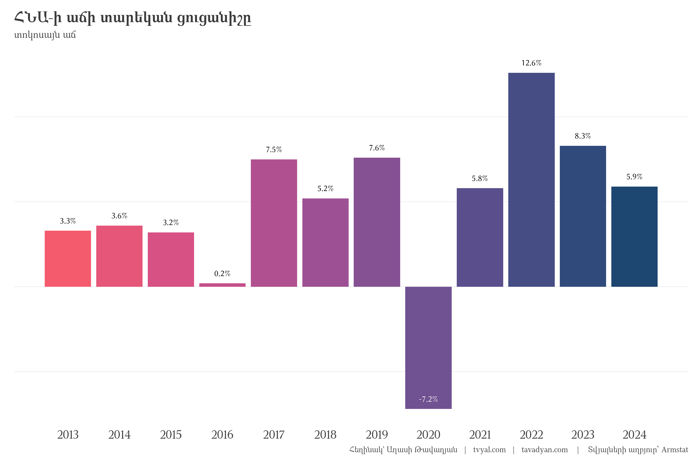
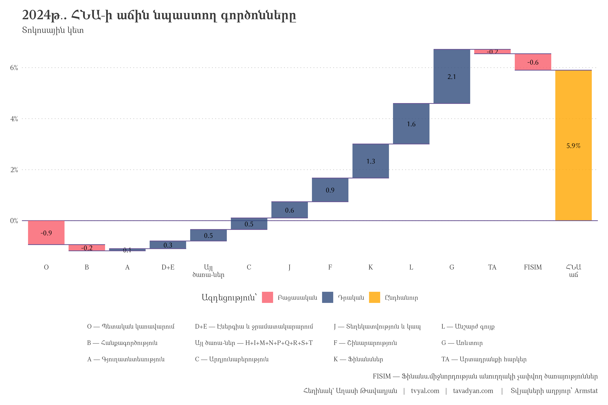
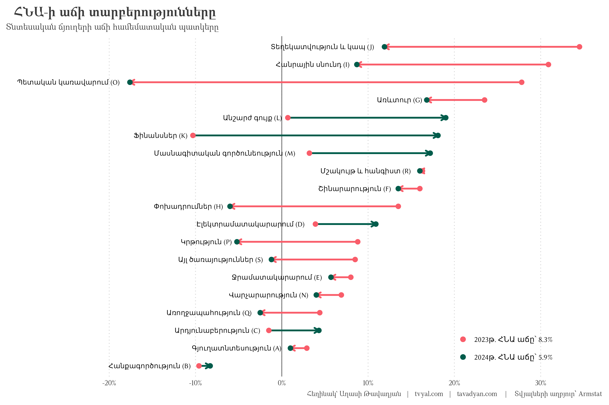
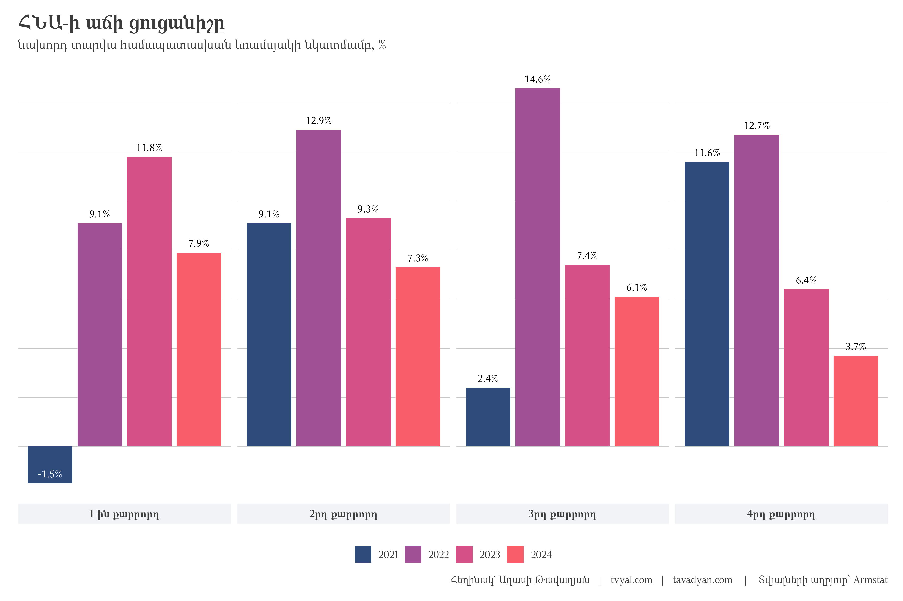
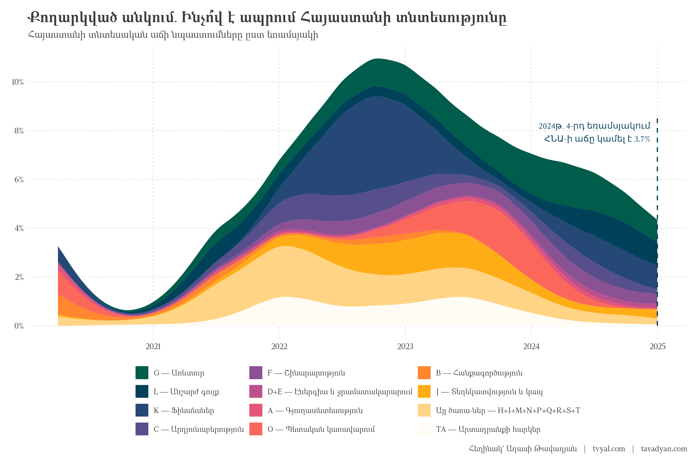

```{r setup, include=FALSE}
knitr::opts_chunk$set(
  echo = FALSE,          # Don't show code
  warning = FALSE,       # Don't show warnings
  message = FALSE,       # Don't show messages
  error = FALSE,        # Don't show errors
  fig.align = "center", # Center align figures
  out.width = "100%",   # Make figures full width
  dpi = 300,           # High resolution for plots
  fig.showtext = TRUE,  # Enable showtext for custom fonts
  dev = "png",         # Use png device for plots
  cache = TRUE         # Cache results to speed up rendering
)

# For better figure handling
options(
  digits = 2,          # Number of digits to show in numbers
  scipen = 999,        # Avoid scientific notation
  knitr.kable.NA = '', # Empty string for NA in tables
  width = 120          # Console width for output
)

library(tidyverse)
library(rvest)
library(RcppRoll)
library(scales)
library(readxl)

# rm(list = ls()); gc()

setwd(dirname(rstudioapi::getActiveDocumentContext()$path))

source("../../initial_setup.R")

yaml_date <- as.Date(rmarkdown::metadata$date)

# Format the date for different uses
formatted_date_dmy <- format(yaml_date, "%d-%m-%Y")
formatted_date_year <- format(yaml_date, "%Y")
formatted_date_url <- format(yaml_date, "%Y_%m_%d")

# Create URL paths
newsletter_url <- paste0("https://www.tvyal.com/newsletter/", formatted_date_year, "/", formatted_date_url)
github_url <- paste0("https://github.com/tavad/tvyal_newsletter/blob/main/", formatted_date_year, "/")

```

```{r downloading GDP data, include=FALSE}
national_account_html_elements <- 
  read_html("https://www.armstat.am/am/?nid=202") |> 
  html_elements("a")

national_account_urls <- 
  tibble(
    url = html_attr(national_account_html_elements, "href"),
    text = html_text(national_account_html_elements)
  ) |> 
  filter(grepl("^\\.\\./", url)) |> 
  mutate(
    text = str_trim(text),
    url = str_replace(url, "^\\.\\.", "https://www.armstat.am")
    ) |> 
  filter(text != "")

GDP_services_links <- 
  national_account_urls |> 
  filter(grepl("^ՀՆԱ", text)) |> 
  pull(url)

# Quarterly GDP download

system(
  paste0("curl -A 'Mozilla/5.0' \"", GDP_services_links[4],
         "\" -o \"GDP_quarter.xls\"")
)

GDP_quarter  <-
  left_join(
    
    read_excel("GDP_quarter.xls", skip = 4) |> 
      rename(code = 1, arm = 2, eng = 3, rus = 4) |> 
      pivot_longer(matches("\\d{4}"), names_to = "date", values_to = "production"),
    
    read_excel("GDP_quarter.xls", skip = 4, sheet = 4) |> 
      rename(code = 1, arm = 2, eng = 3, rus = 4) |> 
      pivot_longer(matches("\\d{4}"), names_to = "date", values_to = "vol_YoY_pct"),
    
    by = join_by(code, arm, eng, rus, date)
  )

GDP_quarter |> write_excel_csv("GDP_quarter_tidy.csv")

# Annual GDP download

system(
  paste0("curl -A 'Mozilla/5.0' \"", GDP_services_links[1],
         "\" -o \"GDP_annual.xls\"")
)

GDP_annual  <-
  left_join(
    
    read_excel("GDP_annual.xls", skip = 4) |> 
      rename(code = 1, arm = 2, eng = 3, rus = 4) |> 
      pivot_longer(matches("\\d{4}"), names_to = "year", values_to = "production"),
    
    read_excel("GDP_annual.xls", skip = 4, sheet = 4) |> 
      rename(code = 1, arm = 2, eng = 3, rus = 4) |> 
      pivot_longer(matches("\\d{4}"), names_to = "year", values_to = "vol_YoY_pct"),
    
    by = join_by(code, arm, eng, rus, year)
  ) |> 
  mutate(year = as.integer(year))

GDP_annual |> write_excel_csv("GDP_annual_tidy.csv")
```


```{r armenian short names dict, include=FALSE}

armenian_short_names <- tibble::tribble(
  ~code, ~arm_short,
  # NA, "Ներքին արդյունք",
  # NA, "Արտադրանքի հարկեր",
  # NA, "Ավելացված արժեք",
  # NA, "ՖՄԱՉԾ",
  "A", "Գյուղատնտեսություն",
  "B", "Հանքագործություն",
  "C", "Արդյունաբերություն",
  "D", "Էլեկտրամատակարարում",
  "E", "Ջրամատակարարում",
  "F", "Շինարարություն",
  "G", "Առևտուր",
  "H", "Փոխադրումներ",
  "I", "Հանրային սնունդ",
  "J", "Տեղեկատվություն և կապ",
  "K", "Ֆինանսներ",
  "L", "Անշարժ գույք",
  "M", "Մասնագիտական գործունեություն",
  "N", "Վարչարարություն",
  "O", "Պետական կառավարում",
  "P", "Կրթություն",
  "Q", "Առողջապահություն",
  "R", "Մշակույթ և հանգիստ",
  "S", "Այլ ծառայություններ",
  "T", "Տնային տնտեսություններ"
)
```

```{r GDP growth comparation, include=FALSE}

legend_data <- 
  tibble(
    x = 0.223, y = c(2.5, 1.5),
    label = c("2023թ․ ՀՆԱ աճը՝ 8.3%", "2024թ․ ՀՆԱ աճը՝ 5.9%")
  )


plot_3_gdp_comporation <-
  GDP_annual |> 
  left_join(armenian_short_names, by = "code") |> 
  mutate(  
    date = ymd(paste(year, "12-31")),
    year = year(date)
  ) |> 
  filter(
    # year %in% c(2022,2023),
    date %in% c(max(date), max(date) - years(1)),
    !is.na(code),
    !grepl("^T$", code)
  ) |> 
  mutate(
    vol_YoY_pct = vol_YoY_pct / 100 - 1,
    eng = arm_short,
    eng = ifelse(is.na(code), eng, paste0(eng, " (", code, ")")),
    eng = str_trunc(eng, 40),
    eng = fct_reorder(eng, vol_YoY_pct, max),
    year = ifelse(year == min(year), "min_year", "max_year")
  ) |> 
  select(eng, year, vol_YoY_pct) |> 
  pivot_wider(names_from = year, values_from = vol_YoY_pct) |> 
  mutate(
    color = ifelse(min_year > max_year, "#f95d6a", "#005C4B")
  ) |> 
  # ggplot(aes(vol_YoY_pct, eng, fill = as.factor(year))) +
  # geom_col(position = "dodge")
  ggplot() +
  geom_vline(xintercept = 0, color = "gray40") +
  geom_segment(
    aes(x = min_year, xend = max_year, y = eng, yend = eng,color = I(color)),
    linewidth = 1.2,
    lineend = 'round', linejoin = 'round',
    arrow = arrow(length = unit(0.1, "inches"))
  ) +
  geom_text(
    aes(x = ifelse(min_year < max_year, min_year, max_year), y = eng, label = eng),
    hjust = 1.1, size = 3.5
  ) +
  geom_point(aes(x = min_year, y = eng), color = "#f95d6a", size = 3) +
  geom_point(aes(x = max_year, y = eng), color = "#005C4B", size = 3) +
  # geom_text(aes(x = middle_year, y = eng, label = pct_10y_change), vjust = 0) +
  geom_point(aes(x = 0.21, y = 2.5), color = "#f95d6a", size = 3) +
  geom_point(aes(x = 0.21, y = 1.5), color = "#005C4B", size = 3) +
  geom_text(
    data = legend_data,
    aes(x, y, label = label), hjust = 0
  ) +
  scale_x_continuous(breaks = seq(-0.2, 1, 0.1), labels = percent_format()) +
  coord_cartesian(clip = "off") +
  labs(
    x = NULL,
    y = NULL,
    title = "ՀՆԱ-ի աճի տարբերությունները",
    subtitle = "Տնտեսական ճյուղերի աճի համեմատական պատկերը",
    captions = caption_f("Armstat")
  ) +
  theme(
    # panel.grid.minor.x = element_line(
    #   colour = "#D2D2D2", 
    #   linetype = "dotted"
    # ),
    panel.grid.major.y = element_blank(),
    axis.text.y = element_blank(),
    plot.margin = margin(10,10,10,150),
    plot.title = element_text(hjust = -0.32),
    plot.subtitle = element_text(hjust = -0.36)
  )

```


```{r GDP growth revision, include=FALSE}

GDP_quarter_old <- read_csv("GDP_quarter_tidy_as_of_2024Q1.csv") |> 
  mutate(source = "old")

GDP_quarter_new <- GDP_quarter |> 
  mutate(source = "revised") |> 
  bind_rows(GDP_quarter_old)


GDP_quarter_pct <- 
  GDP_quarter_new |> 
  filter(grepl("Domestic product", eng)) |> 
  transmute(date, source, GDP_growth = vol_YoY_pct/100 - 1) |> 
  na.omit()

GDP_annual_pct <- 
  GDP_annual |> 
  filter(grepl("Domestic product", eng)) |> 
  transmute(year, GDP_growth = vol_YoY_pct/100 - 1) |> 
  na.omit() |> 
  mutate(source = "annual")

plot_1_growth_revision <- 
  GDP_quarter_pct |> 
  mutate(
    date = yq(date) + months(3) - days(1),
    source = fct_rev(source)
  ) |> 
  filter(
    !(source != "revised" & date <= ymd("2023-07-01")),
    date >= ymd("2020-12-31")
  ) |> arrange(date) |> 
  ggplot(aes(date, GDP_growth, color = source)) +
  geom_hline(yintercept = 0, color = "gray") +
  geom_line(linewidth = 1.5) +
  scale_x_date(date_breaks = "1 year", date_labels = "%Y") +
  scale_y_continuous(labels = percent_format()) +
  scale_color_manual(
    values = new_palette_colors[c(6,2)],
    labels = c("ՀՆԱ վերանայված աճ", "ՀՆԱ-ի աճ մինչև 2024թ․ օգոստոսի վերանայումը")
  ) +
  labs(
    x = NULL,
    y = NULL,
    color = NULL,
    title = "ՀՆԱ-ի աճը վերանայվել է, նոր աճի տենդենց չկա",
    subtitle = "Աճի տենդենցը գրանցվել էր ոսկու վերաարտահանման հաշվին, ընդհանուր տնտեսության անկման ֆոնին",
    captions = caption_f()
  )


  
```

```{r gdp annual growth barplot, include=FALSE}

plot_gdp_annual_growth <- 
  GDP_annual_pct |>
  mutate(GDP_growth = GDP_growth * 100) |> 
  ggplot(aes(year, GDP_growth, fill = year)) +
  geom_col(
    position = position_dodge(width = 0.8),
    width = 0.9, alpha = 1
  ) +
  geom_text(
    aes(
      y = GDP_growth + 0.6, label = percent(GDP_growth/100, accuracy = 0.1),
      color = ifelse(GDP_growth >= 0, "black", "white")
    ),
    position = position_dodge(width = 0.8)
  ) +
  scale_x_continuous(breaks = 2013:2024) +
  scale_fill_gradientn(colors = colfunc2(100)[70:10]) +
  scale_color_manual(values = c("black", "white"), guide = "none") + 
  labs(
    x = NULL,
    y = NULL,
    fill = NULL,
    title = "ՀՆԱ-ի աճի տարեկան ցուցանիշը",
    subtitle = "տոկոսայն աճ",
    caption = caption_f(source = "Armstat")
  ) +
  theme(
    legend.position = "none",
    panel.grid.major.x = element_blank(),
    panel.grid.major.y = element_line(
      colour = "gray", linewidth = 0.1,
      linetype = 1
    ),
    axis.text.x = element_text(size = 14),
    axis.text.y = element_blank(),
    strip.background = element_rect(fill = "#2f4b7c11"),
    strip.text = element_text(size = 10, face = "bold")
  )
```


```{r gdp quarter gowth plot, include=FALSE}

plot_gdp_quarter_gowth <- 
  # GDP_annual_pct |> 
  # rename(date = year) |> 
  # mutate(date = paste(date, "annual")) |> 
  bind_rows(GDP_quarter_pct) |> 
  mutate(
    quarter = str_extract(date, "\\d$") |> as.numeric(),
    quarter_text = paste0(quarter, ifelse(quarter == 1, "-ին", "րդ"), " քարրորդ"),
    quarter_text = ifelse(is.na(quarter), "ՏԱՐԵԿԱՆ", quarter_text),
    date = ifelse(grepl("annual", date), paste(date, "4"), date),
    date = yq(date) + months(3) - days(1),
    year = year(date),
    GDP_growth = GDP_growth * 100
  ) |> 
  filter(
    year >= 2021,
    source %in% c("revised", "annual")
  ) |> 
  complete(nesting(quarter, quarter_text), year) |>
  ggplot(aes(year, GDP_growth, fill = as.factor(year))) +
  geom_col(
    position = position_dodge(width = 0.8),
    width = 0.9, alpha = 1
  ) +
  geom_text(
    aes(
      y = GDP_growth + 0.4, label = percent(GDP_growth/100, accuracy = 0.1),
      color = ifelse(GDP_growth >= 0, "black", "white")
    ),
    position = position_dodge(width = 0.8)
  ) +
  scale_y_continuous(breaks = seq(0, 16, 2)) +
  scale_fill_manual(values = new_palette_colors[c(2,4,5,6)]) +
  scale_color_manual(values = c("black", "white"), guide = "none") + 
  facet_wrap(~quarter_text, nrow = 1, strip.position = "bottom") + 
  labs(
    x = NULL,
    y = NULL,
    fill = NULL,
    title = "ՀՆԱ-ի աճի ցուցանիշը",
    subtitle = "նախորդ տարվա համապատասխան եռամսյակի նկատմամբ, %",
    caption = caption_f(source = "Armstat")
  ) +
  theme(
    panel.grid.major.x = element_blank(),
    panel.grid.major.y = element_line(
      colour = "gray", linewidth = 0.1,
      linetype = 1
    ),
    axis.text = element_blank(),
    strip.background = element_rect(fill = "#2f4b7c11"),
    strip.text = element_text(size = 10, face = "bold")
  )

```

```{r}


GDP_annual_pct <- 
  GDP_annual |> 
  filter(grepl("Domestic product", eng)) |> 
  transmute(year, GDP_growth = vol_YoY_pct/100 - 1) |> 
  na.omit()


GDP_year_contribution <- 
  GDP_annual |> 
  left_join(GDP_annual_pct, by = c("year")) |>
  group_by(eng) |> 
  mutate(
    vol_YoY_pct = vol_YoY_pct/100,
    contribution = lag(production) * (vol_YoY_pct - 1),
    contribution = ifelse(grepl("gross,", eng), NA, contribution)
  ) |> 
  group_by(year) |> 
  mutate(
    contribution = contribution / sum(contribution, na.rm = TRUE) * GDP_growth,
    contribution = ifelse(grepl("Domestic product", eng), vol_YoY_pct - 1, contribution)
  ) |> 
  select(-GDP_growth)


groupping_contributions_annual <- function(select_year, groupped_codes_ = c("H","I","L","M","N","P","Q","S","T")){
  
  if (!is.null(select_year)) {
    GDP_year_contribution <- 
      GDP_year_contribution |> 
      filter(year %in% select_year)
  }
  
  tbl_groupped <- 
    GDP_year_contribution |> 
    left_join(armenian_short_names, by = "code") |> 
    # filter(date == "2024-Q2") |>
    ungroup() |> 
    filter(!is.na(contribution)) |> 
    mutate(
      groupped_codes = case_when(
        code %in% c("D", "E") ~ "D+E",
        code %in% groupped_codes_ ~ "Այլ\nծառա-ներ",  # R հանել
        grepl("Taxes on products", eng) ~ "TA",
        grepl("Financial Intermediate", eng) ~ "FISIM",
        grepl("Domestic product", eng) ~ "ՀՆԱ\nաճ",
        TRUE ~ code
      ),
      groupped_arm = case_when(
        code %in% c("D", "E") ~ "Էներգիա և ջրամատակարարում",
        code %in% groupped_codes_ ~ paste(groupped_codes_, collapse = "+"),
        grepl("Domestic product", eng) ~ NA,
        code %in% LETTERS ~ arm_short,
        TRUE ~ arm
      ),
      groupped_arm = str_remove(groupped_arm, ". պարտադիր սոցիալական ապահովագրություն"),
      groupped_arm = str_remove(groupped_arm, " .ՖՄԱՉԾ."),
      groupped_arm = str_remove(groupped_arm, ". ավտոմեքենաների և մոտոցիկլների նորոգում"),
      groupped_arm = str_remove(groupped_arm, ". անտառային տնտեսություն և ձկնորսություն"),
      groupped_arm = str_remove(groupped_arm, " .հանած սուբսիդիաներ."),
    ) |> 
    group_by(groupped_codes, year, groupped_arm) |> 
    summarise(
      contribution = sum(contribution),
      .groups = "drop"
    ) |> 
    group_by(year) |> 
    arrange(year) |> 
    mutate(
      labels = percent(contribution, accuracy = 0.1),
      groupped_codes = fct_reorder(groupped_codes, contribution),
      groupped_codes = fct_relevel(
        groupped_codes, "TA", "FISIM", "ՀՆԱ\nաճ", after = Inf
      ),
      id = as.numeric(groupped_codes)
    ) |> 
    arrange(id) |> 
    mutate(
      annotation = paste(groupped_codes, groupped_arm, sep = " — "),
      annotation = str_replace(annotation, "\n", " "),
      annotation = ifelse(grepl("ՀՆԱ", annotation), " ", annotation),
      annotation = ifelse(grepl("FISIM", annotation), " ", annotation),
      annotation = fct_reorder(annotation, id),
      end = cumsum(contribution),
      start = end - contribution,
      end = ifelse(groupped_codes == "ՀՆԱ\nաճ", 0, end),
      start = ifelse(groupped_codes == "ՀՆԱ\nաճ", contribution, start),
      fill_ = case_when(
        groupped_codes == "ՀՆԱ\nաճ" ~ "Ընդհանուր",
        contribution < 0 ~ "Բացասական",
        TRUE ~ "Դրական"
      )
    ) |> 
    ungroup()
  
  return(tbl_groupped)
}


plot_gdp_components_2024 <- 
  groupping_contributions_annual(
  select_year = 2024, 
  groupped_codes_ = c("H","I","M","N","P","Q","R","S","T")
  # groupped_codes_ = c("H","I","L","M","N","P","Q","S","T")
) |> 
  mutate(
    labels = ifelse(groupped_codes == "ՀՆԱ\nաճ", labels, str_remove(labels, "\\%$"))
  ) |> 
  ggplot() +
  geom_hline(yintercept = 0, color = new_palette_colors[3]) +
  geom_rect(
    aes(xmin = id - 0.45, xmax = id + 0.45,
        ymin = end, ymax = start, fill = fill_, linetype = annotation)
  ) +
  geom_text(aes(x = groupped_codes, y = (end+start)/2, label = labels)) +
  geom_segment(
    aes(x = id - 0.45, xend = ifelse(id == max(id), id + 0.45, id + 0.45 + 1),
        y = end, yend = end),
    linetype = 1, color = new_palette_colors[3]
  ) +
  scale_y_continuous(labels = percent_format(), n.breaks = 6) +
  scale_fill_manual(values = new_palette_colors[c(6,2,8)]) + 
  labs(
    x = NULL,
    y = NULL,
    fill = "Ազդեցություն՝",
    linetype = NULL,
    title = "2024թ․. ՀՆԱ-ի աճին նպաստող գործոնները",
    subtitle = "Տոկոսային կետ",
    captions = caption_f(
      "Armstat", 
      suffix_text = "FISIM — Ֆինանս.միջնորդության անուղղակի չափվող ծառայություններ"
    )
  ) +
  guides(
    linetype = guide_legend(override.aes = list(fill = "#FFFFFF00"), nrow = 3),
    color = guide_legend(order = 2),
    fill = guide_legend(order = 1),
  ) +
  theme(
    panel.grid.major.x = element_blank(),
    legend.text = element_text(size = 9),
  )

```


```{r gdp components calculation, include=FALSE}

GDP_quarter_contribution <- 
  GDP_quarter_new |> 
  left_join(GDP_quarter_pct, by = c("date", "source")) |>
  group_by(eng, source) |> 
  mutate(
    vol_YoY_pct = vol_YoY_pct/100,
    contribution = lag(production) * (vol_YoY_pct - 1),
    contribution = ifelse(grepl("gross,", eng), NA, contribution)
  ) |> 
  group_by(date, source) |> 
  mutate(
    contribution = contribution / sum(contribution, na.rm = TRUE) * GDP_growth,
    contribution = ifelse(grepl("Domestic product", eng), vol_YoY_pct - 1, contribution)
  ) |> 
  select(-GDP_growth)

groupping_contributions <- function(select_date, groupped_codes_ = c("H","I","L","M","N","P","Q","S","T")){
  
  if (!is.null(select_date)) {
    GDP_quarter_contribution <- 
      GDP_quarter_contribution |> 
      filter(date %in%  select_date)
  }
  
  tbl_groupped <- 
    GDP_quarter_contribution |> 
    left_join(armenian_short_names, by = "code") |> 
    # filter(date == "2024-Q2") |>
    ungroup() |> 
    filter(!is.na(contribution)) |> 
    mutate(
      groupped_codes = case_when(
        code %in% c("D", "E") ~ "D+E",
        code %in% groupped_codes_ ~ "Այլ\nծառա-ներ",  # R հանել
        grepl("Taxes on products", eng) ~ "TA",
        grepl("Financial Intermediate", eng) ~ "FISIM",
        grepl("Domestic product", eng) ~ "ՀՆԱ\nաճ",
        TRUE ~ code
      ),
      groupped_arm = case_when(
        code %in% c("D", "E") ~ "Էներգիա և ջրամատակարարում",
        code %in% groupped_codes_ ~ paste(groupped_codes_, collapse = "+"),
        grepl("Domestic product", eng) ~ NA,
        code %in% LETTERS ~ arm_short,
        TRUE ~ arm
      ),
      groupped_arm = str_remove(groupped_arm, ". պարտադիր սոցիալական ապահովագրություն"),
      groupped_arm = str_remove(groupped_arm, " .ՖՄԱՉԾ."),
      groupped_arm = str_remove(groupped_arm, ". ավտոմեքենաների և մոտոցիկլների նորոգում"),
      groupped_arm = str_remove(groupped_arm, ". անտառային տնտեսություն և ձկնորսություն"),
      groupped_arm = str_remove(groupped_arm, " .հանած սուբսիդիաներ."),
    ) |> 
    group_by(groupped_codes, date, source, groupped_arm) |> 
    summarise(
      contribution = sum(contribution),
      .groups = "drop"
    ) |> 
    group_by(date, source) |> 
    arrange(date, source) |> 
    mutate(
      labels = percent(contribution, accuracy = 0.1),
      groupped_codes = fct_reorder(groupped_codes, contribution),
      groupped_codes = fct_relevel(
        groupped_codes, "TA", "FISIM", "ՀՆԱ\nաճ", after = Inf
      ),
      id = as.numeric(groupped_codes)
    ) |> 
    arrange(id) |> 
    mutate(
      annotation = paste(groupped_codes, groupped_arm, sep = " — "),
      annotation = str_replace(annotation, "\n", " "),
      annotation = ifelse(grepl("ՀՆԱ", annotation), " ", annotation),
      annotation = ifelse(grepl("FISIM", annotation), " ", annotation),
      annotation = fct_reorder(annotation, id),
      end = cumsum(contribution),
      start = end - contribution,
      end = ifelse(groupped_codes == "ՀՆԱ\nաճ", 0, end),
      start = ifelse(groupped_codes == "ՀՆԱ\nաճ", contribution, start),
      fill_ = case_when(
        groupped_codes == "ՀՆԱ\nաճ" ~ "Ընդհանուր",
        contribution < 0 ~ "Բացասական",
        TRUE ~ "Դրական"
      )
    ) |> 
    ungroup()
  
  return(tbl_groupped)
}

GDP_quarter_contribution |> 
  ungroup() |> 
  filter(
    grepl("2024-Q1", date),
    # date == "2024-Q1_old"
  ) |> 
  left_join(armenian_short_names, by = "code") |> 
  select(production, code, arm_short, source) |> 
  filter(!is.na(arm_short)) |> 
  pivot_wider(names_from = source, values_from = production)

```


```{r GDP components 2024 Q2 revsion, include=FALSE}

plot_4_components_2024_Q4 <- 
  groupping_contributions(
    select_date = "2024-Q4", 
    groupped_codes_ = c("H","I","M","N","P","Q","R","S","T")
    # groupped_codes_ = c("H","I","L","M","N","P","Q","S","T")
  ) |> 
  mutate(
    labels = ifelse(groupped_codes == "ՀՆԱ\nաճ", labels, str_remove(labels, "\\%$"))
  ) |> 
  ggplot() +
  geom_hline(yintercept = 0, color = new_palette_colors[3]) +
  geom_rect(
    aes(xmin = id - 0.45, xmax = id + 0.45,
        ymin = end, ymax = start, fill = fill_, linetype = annotation)
  ) +
  geom_text(aes(x = groupped_codes, y = (end+start)/2, label = labels)) +
  geom_segment(
    aes(x = id - 0.45, xend = ifelse(id == max(id), id + 0.45, id + 0.45 + 1),
        y = end, yend = end),
    linetype = 1, color = new_palette_colors[3],
  ) +
  scale_y_continuous(labels = percent_format(), n.breaks = 6) +
  scale_fill_manual(values = new_palette_colors[c(6,2,8)]) + 
  labs(
    x = NULL,
    y = NULL,
    fill = "Ազդեցություն՝",
    linetype = NULL,
    title = "ՀՆԱ-ի աճին նպաստող գործոնները",
    subtitle = "2024թ․ չորրորդ եռամսյակ, Տոկոսային կետ",
    captions = caption_f(
      "Armstat", 
      suffix_text = "FISIM — Ֆինանս.միջնորդության անուղղակի չափվող ծառայություններ"
    )
  ) +
  guides(
    linetype = guide_legend(override.aes = list(fill = "#FFFFFF00"), nrow = 3),
    color = guide_legend(order = 2),
    fill = guide_legend(order = 1),
  ) +
  theme(
    panel.grid.major.x = element_blank(),
    legend.text = element_text(size = 9),
  )


```

```{r GDP comepnents fynamics, include=FALSE}

tbl_groupped_full_positives <- 
  groupping_contributions(
    select_date = NULL,              
    groupped_codes_ = c("H","I","M","N","P","Q","R","S","T")
  ) |> 
  filter(source == "revised") |> 
  left_join(GDP_quarter_pct |> filter(source == "revised")) |> 
  filter(contribution >= 0) |>
  group_by(date, source) |> 
  mutate(contribution = contribution / sum(contribution) * GDP_growth) |> 
  filter(contribution >= 0)

library(ggstream)


# groupping_contributions(
#   select_date = NULL,              
#   groupped_codes_ = c("H","I","M","N","P","Q","R","S","T")
# ) |>
#   ungroup() |>
#   filter(date == max(date)) |>
#   arrange(desc(contribution)) |>
#   pull(groupped_codes) |>
#   paste(collapse = '", "')


last_year_segment <- 
  tbl_groupped_full_positives |> 
  mutate(
    date = yq(date) + months(3) - days(1),
  ) |> 
  ungroup() |> 
  filter(date == max(date)) |> 
  group_by(date) |> 
  summarise(
    contribution = sum(contribution)
  )

plot_5_components_dynamics <-
  tbl_groupped_full_positives |> 
  ungroup() |> 
  mutate(groupped_codes = as.character(groupped_codes)) |> 
  arrange(groupped_codes) |> 
  mutate(
    date = yq(date) + months(3) - days(1),
    groupped_codes = fct_inorder(groupped_codes),
    groupped_codes = factor(groupped_codes, levels = c("G", "L", "K", "C", "F", "D+E", "A", "O", "B", "J", "Այլ\nծառա-ներ", "TA", "FISIM", "ՀՆԱ\nաճ"))  # update or comment if necessary 
    # groupped_codes = fct_relevel(groupped_codes, "Այլ\nծառայ-ներ", "TA", "FISIM", "ՀՆԱ\nաճ", after = Inf),
  ) |>
  filter(date >= ymd("2020-01-01")) |> 
  ungroup() |> 
  filter(
    groupped_codes != "ՀՆԱ\nաճ",
    !grepl("FISIM", groupped_codes),
    # !grepl("^B", groupped_codes)
  ) |>
  arrange(groupped_codes) |> 
  mutate(
    annotation = fct_inorder(annotation)
  ) |> 
  ggplot(aes(date, contribution)) +
  
  geom_stream(
    aes(fill = annotation),
    type = "ridge", bw=0.95,  extra_span = 0.025,  n_grid = 4000
  )  +
  
  geom_segment(
    data = last_year_segment,
    mapping = aes(x = date, y = 0, xend = date, yend = contribution + 0.05),
    linewidth = 0.7, linetype = 2, color = new_palette_colors[1]
  ) +
  geom_text(
    data = last_year_segment,
    mapping = aes(
      x = date - days(20), y = contribution + 0.05, 
      label = paste("2024թ․ 4-րդ եռամսյակում\nՀՆԱ-ի աճը կամել է 3.7%")
    ),
    hjust = 1, vjust = 1.5, color = new_palette_colors[1]
  ) +
  scale_y_continuous(breaks = seq(-0.18,0.18,0.02), labels = percent_format(accuracy = 1)) +
  # ggthemes::scale_fill_stata() +
  # scale_fill_brewer(type = "qual", palette = 3) +
  scale_fill_manual(values = colfunc3(12)) +
  guides(fill = guide_legend(ncol = 3)) +
  labs(
    x = NULL,
    y = NULL,
    fill = NULL,
    linetype = NULL,
    subtitle = "Հայաստանի տնտեսական աճի նպաստումները ըստ եռամսյակի",
    captions = caption_f(),
    # title = paste("Factors Contributing to", year_, "Economic Growth")
    title = paste("Քողարկված անկում․ Ինչո՞վ է ապրում Հայաստանի տնտեսությունը")
  )

```

```{r, include=FALSE}
GDP_annual
```


```{r save plots, include=FALSE}

ggsave("plots/plot_3_gdp_comporation.png", plot_3_gdp_comporation, width = 12, height = 8)
ggsave("plots/plot_gdp_annual_growth.png", plot_gdp_annual_growth, width = 12, height = 8)
ggsave("plots/plot_gdp_quarter_gowth.png", plot_gdp_quarter_gowth, width = 12, height = 8)
ggsave("plots/plot_gdp_components_2024.png", plot_gdp_components_2024, width = 12, height = 8)
ggsave("plots/plot_5_components_dynamics.png", plot_5_components_dynamics, width = 12, height = 8)

system("cd ../.. | git all")

```


***English summary below.***

### **Հայաստանի տնտեսական աճի պատրանքը**

Հայաստանի տնտեսությունը կանգնած է բեկումնային պահի առջև։ Վերջին տվյալները բացահայտել են մտահոգիչ իրականություն՝ երկրի տնտեսական վերելքը, որը վերջին շրջանում այդքան փառաբանվում էր, հիմնականում կառուցված էր ոչ կայուն գործոնների վրա։ Տվյալները մանրակրկիտ ուսումնասիրելիս պարզ է դառնում, որ տնտեսության աճը թվացյալ է. իրականությունը լուրջ մարտահրավերներն են:

### ՀՆԱ աճը․ Աճի անկայուն հիմքերը

#### Բարգավաճման պատրանքը

Հայաստանի տնտեսական աճի պաշտոնական ցուցանիշների վերլուծությունը բացահայտում է երկրի տնտեսության կառուցվածքային թերությունները։ Պաշտոնական վիճակագրության հետևում թաքնված են լուրջ խոցելի կետեր, որոնք ստիպում են վերանայել երկրի տնտեսական առողջության վերաբերյալ ընդունված պատկերացումները։

Գծապատկեր 1.




Առաջին գծապատկերը պատկերում է Հայաստանի տնտեսական զարգացման անկայուն ընթացքը։ Երկարաժամկետ միջին աճի 4.5% ցուցանիշի համեմատ՝ վերջին տարիներին արձանագրվել են զգալի տատանումներ։ Հատկապես ուշագրավ է 2022 թվականի տպավորիչ 12.6% աճից հետո նկատվող անկման միտումը՝ 2023 թվականի 8.3% և 2024 թվականի ընդամենը 5.9% աճով: Այս նվազող միտումը խոսում է տնտեսության խորքային անկայունության մասին: Ավելին, այս աճի գրեթե կեսը պայմանավորված է եղել առևտրի և ֆինանսական ծառայությունների ոլորտներով, որոնք իրենց հերթին խիստ կախված են արտաքին գործոններից, հատկապես՝ ռուսական կապիտալի ներհոսքից և բիզնեսներից։

#### Աճի պատրանքի իրական պատկերը

Պաշտոնական վիճակագրությունը վեր է հանում աճի անկայուն պատկեր, որը բացահայտում է հայաստանյան տնտեսության հիմնարար թերությունները․

1. 2024թ․ աճի տեմպերը կտրուկ նվազել են։ Չորրորդ եռամսյակում տնտեսական աճը կազմել է ընդամենը 3.7%, մինչդեռ առաջին եռամսյակում այն 7.9% էր։
2. 2022-2024թթ․ ընթացքում աճի տեմպերը հետևողականորեն նվազել են՝ 12.6%-ից (2022թ.) իջնելով 8.3%-ի (2023թ.) և հասնելով 5.9%-ի (2024թ.)։
3. Տեղեկատվական տեխնոլոգիաների ոլորտը, որը նախկինում տնտեսական աճի հիմնական շարժիչն էր, զգալի անկում է արձանագրել 2023թ․ չորրորդ եռամսյակում (-2.8%), իսկ 2024թ․ երկրորդ եռամսյակում ցույց է տվել աննշան աճ (4.5%):

Այս ցուցանիշները վկայում են Հայաստանի տնտեսության առջև ծառացած կառուցվածքային խնդիրների մասին։ Մինչև վերջերս առաջին հայացքից տնտեսությունը ցուցաբերում էր դինամիկ աճ, սակայն ներկայումս այն դրսևորում է հստակ անկման և լճացման նշաններ՝ հատկապես բարձր ավելացված արժեք ստեղծող ճյուղերում:


Գծապատկեր 2.



Երկրորդ գծապատկերում ներկայացված են 2024 թվականի ՀՆԱ աճին նպաստող բաղադրիչները: Վերլուծությունը բացահայտում է անհանգստացնող պատկեր․ տնտեսական աճը խիստ անհամաչափ է և հիմնականում կենտրոնացած է ծառայությունների ոլորտում։ 5.9% աճի ապահովման հիմնական բաղադրիչներն են.

1. Առևտուրը (G)՝ 2.1 տոկոսային կետ
2. Անշարժ գույքի գործունեությունը (L)՝ 1.6 տոկոսային կետ
3. Ֆինանսական ծառայությունները (K)՝ 1.3 տոկոսային կետ
4. Շինարարությունը (F)՝ 0.9 տոկոսային կետ
5. Տեղեկատվություն և կապը (J)՝ 0.6 տոկոսային կետ

Մտահոգիչ է, որ արտադրող և բարձր ավելացված արժեք ստեղծող ճյուղերը չեն հանդիսանում աճի շարժիչ ուժեր։ Ավելին, մի շարք կարևոր ոլորտներ բացասաբար են ազդել ընդհանուր աճի վրա.

1. Պետական կառավարում (O)՝ -0.9 տոկոսային կետ
2. Հանքարդյունաբերություն (B)՝ -0.2 տոկոսային կետ
3. ՖՄԱՉԾ (Ֆինանսական միջնորդության անուղղակիորեն չափվող ծառայություններ)՝ -0.6 տոկոսային կետ

Մեր վերլուծությունը ցույց է տալիս, որ ոսկու վերաարտահանումից ստացված ավելացված արժեքը զգալի դեր է խաղացել ՀՆԱ-ի աճի գործում։ Մեր [նախկին հետազոտության մեջ նշել ենք, որ ոսկու վերաարտահանման «արդյունաբերությունը» մոտ 4 տոկոսային կետի ներդրում է ունեցել, առևտուրը՝ 3 տոկոսային կետ, ֆինանսական ծառայությունները՝ 1.1 տոկոսային կետ, մինչդեռ տնտեսության մնացած ճյուղերը միասին արձանագրել են -0.1% անկում։](https://www.aravot.am/2024/08/10/1437252/) Ըստ մեր երկրորդ վերլուծական հոդվածի՝ այս ոսկե վերաարտահանման գործունեությունը կազմում է արտահանման մոտ 61.4%-ը և հանդիսանում է իրական տնտեսական անկումը քողարկող հիմնական գործոն։

#### «Թանկարժեք» էֆֆեկտ․ Ոսկու վերաարտահանման քողը

Այս տնտեսավիճակագրական դրամայի առանցքում ոսկու վերաարտահանման երևույթն է, որը թափ է ստացել 2023թ․ նոյեմբերից և շարունակվել է մինչև 2024թ․ մայիս։ Այս գործոնը արհեստական կենսունակություն է հաղորդել Հայաստանի աճի ցուցանիշներին։ Սակայն տվյալները հստակ ցույց են տալիս, որ սա ժամանակավոր և հիմնավոր չէ:

Ուշագրավ է, որ 2023թ․ տարեկան տնտեսական աճի ցուցանիշը պաշտոնապես գրանցվել է 8.7% մակարդակում: Մեր թիմը դեռևս 2023թ․ վերջում [կանխատեսել էր, որ տնտեսական աճը կկազմի մոտ 7%](https://www.tvyal.com/newsletter/2024/2024_03_09)։ Սակայն նոյեմբերից ոսկու վերաարտահանման կտրուկ աճը արհեստականորեն բարձրացրեց տնտեսական աճի ցուցանիշը մինչև 8.7%՝ ստեղծելով «թանկարժեք էֆֆեկտ» ընդհանուր տնտեսական անկման պայմաններում։

### Տնտեսության ճյուղերը և դրանց ներդրումը

#### Ճյուղերի կատարողականի ակնարկ

Գծապատկեր 3.



Երրորդ գծապատկերը ցույց է տալիս աճի տեմպերի էական տարբերություններ տարբեր ճյուղերի միջև, ինչը վկայում է, որ տնտեսական աճը հավասարաչափ բաշխված և կայուն չէ։

Հիմնական դիտարկումներ․

1. ՏՏ ոլորտը (J), որը 2022 թվականի սկզբից աճի շարժիչ ապահովողներից մեկն էր՝ 2023թ․ երկրորդ եռամսյակում գրանցելով 62.6% տարեկան աճ, այժմ զգալի անկում է ապրել։ 2024թ․ երկրորդ եռամսյակում այն ցույց տվեց 14.1% տարեկան անկում։
2. Այլ ոլորտներ, ներառյալ հանրային սնունդը (I) և տրանսպորտը (H), նույնպես անկում են ապրում։
3. Տնտեսության հիմնական շարժիչ ուժերի՝ շինարարության (F) և առևտրի (G) աճը դանդաղում է։

#### ՏՏ ոլորտի անկումը և դրա հետևանքները

ՏՏ ոլորտի անկումը հատկապես մտահոգիչ է։ Երեք հաջորդական եռամսյակ անկում գրանցելուց հետո, այս ռազմավարական ոլորտն այլևս դրական չի նպաստում ՀՆԱ աճին։ Տվյալները ցույց են տալիս, որ ՏՏ ոլորտը 2023թ․ չորրորդ եռամսյակում անկում ապրեց (-2.8%), իսկ 2024թ․ առաջին և երկրորդ եռամսյակներում ցույց տվեց թույլ աճ (համապատասխանաբար 11.9% և 4.5%)։ Թեև չորրորդ եռամսյակում նկատվում է որոշակի վերականգնում (27.4%), այս անկայունությունը վկայում է այս ոլորտում ճգնաժամի մասին։

Այս միտումը հարցականի տակ է դնում Հայաստանի տեխնոլոգիաների վրա հիմնված աճի ռազմավարության կայունությունը և այս հետդարձի պատճառները։ Կարդացեք ավելին մեր վերլուծությունը ՏՏ մասին․ [🆘🇦🇲🧑🏼‍💻 SOS ՀՀ ՏՏ․ Հայաստանի ՏՏ ոլորտը, ռազմավարական առաջնահերթությունից մինչև հնարավոր անկում](https://www.tvyal.com/newsletter/2024/2024_08_19)

#### Ներկայիս աճի շարժիչ ուժերը

Գծապատկեր 4.




4-րդ գծապատկերը ցույց է տալիս 2024թ․ երկրորդ եռամսյակի ՀՆԱ աճին նպաստող գործոնները․

1. Մեծածախ և մանրածախ առևտուրը (G) ապահովում է 6.4% ՀՆԱ աճի 3.1 տոկոսային կետը, գրեթե կեսը։
2. Անշարժ գույքի գործառնությունները (L) ապահովում են 2.3 տոկոսային կետ, աճի մոտ մեկ երրորդը։ Սա զգալի աճ է նախկինում գրանցված միջինը 0.5 տոկոսային կետի ներդրման համեմատ։
3. Ֆինանսական ոլորտը (K) ապահովում է 1.9 տոկոսային կետ։

Անշարժ գույքի գործառնությունների զգալի ներդրումը ուշադրության արժանի է։ [Այն ներառում է «Սեփականատերերի կողմից զբաղեցրած բնակարանների համար ենթադրյալ վարձավճարի արժեքը»](https://ec.europa.eu/eurostat/web/products-manuals-and-guidelines/-/ks-ra-07-015), ըստ էության գնահատելով Հայաստանի բոլոր բնակարանների պոտենցիալ վարձավճարը՝ անկախ նրանից, դրանք սեփականատիրոջ կողմից են զբաղեցված, թե վարձակալված։ Սա նշանակում է, որ 6.4% աճի մոտ մեկ երրորդը վերագրվում է անշարժ գույքի շուկայական արժեքի աճին, ինչը կարող է կայուն չլինել։

### Տնտեսական աճի կայունությունը

ՀՆԱ-ի վերջին տվյալները և ճյուղային վերլուծությունը լուրջ հարցեր են բարձրացնում Հայաստանի տնտեսական աճի կայունության վերաբերյալ։

#### Աճի շարժիչ ուժերի վերլուծություն


Գծապատկեր 5.



Գծապատկեր 5-ը ցույց է տալիս Հայաստանի տնտեսական աճին նպաստող գործոնները ըստ եռամսյակների։ Մի քանի կարևոր կետեր են ի հայտ գալիս․

1. Երկարաժամկետ միջին աճ․ Հայաստանի երկարաժամկետ միջին տնտեսական աճի տեմպը մոտ 4.5% է։ Ցանկացած համակարգ ձգտում է վերադառնալ իր երկարաժամկետ միջինին, եթե չկան տվյալ համակարգում որակական փոփոխություններ, որոնք կարող են ապահովել կայուն, երկարաժամկետ ավելացված արժեքի ստեղծում։
2. Հետհամաճարագային վերականգնում․ 2020թ․ COVID-19 համավարակից և 44-օրյա պատերազմից հետո տնտեսությունը վերականգնման նշաններ ցույց տվեց։ Տնտեսության հիմնական ճյուղերը ապահովեցին տնտեսական աճի մոտ 4.5%-ը։
3. ՏՏ ոլորտի ներդրում․ ՏՏ ոլորտը (J) ապահովեց աճի մոտ 1-2.5 տոկոսային կետը, հիմնականում Ռուսաստանից վերաբնակեցված ՏՏ մասնագետների տեղափոխման շնորհիվ։ Սակայն այս ոլորտը վերջին երեք եռամսյակում անկում է ապրում։
4. Ֆինանսական ծառայություններ և առևտուր․ 2022 թվականի սկզբից ՀՆԱ հիմնական հավելաճն ապահովվել է ֆինանսական ծառայությունների (K) և առևտրի կողմից (G)։ Հարկ է նշել, որ Ռուսաստանից մեծ ծավալով կապիտալի ներհոսքի արդյունքում՝ բանկային համակարգի զուտ շահույթը 2022 թվականին եռապատկվեց ([Կարդացեք ավելին՝ 💸🔚🏦 Կապիտալի արտահոսք](https://www.tvyal.com/newsletter/2024/2024_03_01))։
5. Վերջին միտումները․ 2022թ․ սկզբից մինչև 2023թ․ կեսերը, տնտեսության հիմնական ճյուղերը ցույց էին տալիս կայուն ներդրում տնտեսական աճի մեջ։ Սակայն դրանից հետո գրեթե բոլոր տնտեսական գործունեության դասակարգիչները գրանցում են անկում ընդհանուր տնտեսական աճին իրենց ներդրման մեջ։

#### Կախվածությունը ժամանակավոր և արհեստական գործոններից

Տվյալները ցույց են տալիս, որ Հայաստանի տնտեսական աճը մեծապես պայմանավորված է եղել արտաքին գործոններով․

1. 2022 թվականին Ռուսաստանից զգալի կապիտալի ներհոսք եղավ։
2. 2023 թվականի նոյեմբերից սկսած խոշորածավալ ոսկու վերաարտահանումը բարձրացրեց աճի ցուցանիշները (ավելին․  [🇷🇺💰🇦🇲 Հայաստան` ռուսական ոսկու հանգրվան](https://www.tvyal.com/newsletter/2024/2024_07_05)):
3. Աճը հիմնականում ապահովվում է առևտրի, անշարժ գույքի և ֆինանսական ծառայությունների կողմից, որոնք կախված են արտաքին գործոններից (ավելին․ [🌅🏖🌄 Սահմանից այն կողմ․ Հայաստանի տուրիստական աճը և հնարավոր անկումը](https://www.tvyal.com/newsletter/2024/2024_06_17)):

Այս գործոնները, թեև կարճաժամկետ խթան են հանդիսանում, չեն ներկայացնում կայուն, երկարաժամկետ տնտեսական աճի շարժիչ ուժեր։ Այսպիսի պայմաններում տնտեսական աճը ձգտելու է իր երկարաժամկետ միջին ցուցանիշին։

### Հարկաբյուջետային հետևանքները

Տնտեսական աճի կայունության հետ կապված խնդիրները ուղղակի ազդեցություն ունեն Հայաստանի հարկաբյուջետային իրավիճակի վրա։

#### Հարկային եկամուտների հավաքագրման խնդիրներ

Ներկայումս առկա է հարկային եկամուտների զգալի՝ 9% թերհավաքագրում։ Այս պակասուրդը հանգեցնում է բյուջետային ծախսերի հնարավոր կրճատման քննարկումների ([Կարդացեք ավելին՝ 🧮⏳🎲 Հայաստանը հարկում է ժամանակը․ Խաղ տնտեսական աճի հետ](https://www.tvyal.com/newsletter/2024/2024_08_02))։

#### Բյուջետային ծախսերի նկատառումներ

Քննարկվում են պահուստային ֆոնդից մոտ 150 միլիարդ դրամ օգտագործելու պլաններ՝ եկամուտների պակասի պայմաններում ծախսերը ծածկելու համար։ Այս իրավիճակը մեծացնում է պետական պարտքի աճի հավանականությունը։

#### Պետական պարտքի հնարավոր աճ

Մի քանի գործոններ նպաստում են պետական պարտքի աճի ռիսկին․

1. Եթե բյուջետային օրենքով նախատեսված 7% տնտեսական աճը չի ապահովվում, և փոխարենը իրականանում է երկարաժամկետ միջին 4.5%-ը, կառավարությունը կարող է ստիպված լինել հատկացնել պահուստային ֆոնդի մոտ կեսը տարբերությունը ծածկելու համար։
2. 2.5% կամ ավելի ցածր տնտեսական աճի պայմաններում մենք կարող ենք ստիպված լինել մեծացնել պետական պարտքը։
3. Ներկայիս դրական երկարաժամկետ ՀՆԱ աճի կանխատեսումները չունեն կայուն, երկարաժամկետ ավելացված արժեքի աճի համար ամուր հիմք։

### Եզրակացություն

ՀՆԱ-ի վերջին տվյալները և ճյուղային վերլուծությունները մտահոգիչ պատկեր են ներկայացնում Հայաստանի տնտեսական ապագայի համար։ Արտաքին գործոններից Հայաստանի տնտեսության մեծ կախվածությունը և ոսկու վերաարտահանման նման գործունեությունից ժամանակավոր խթանները ցույց են տալիս, որ առանց էական կառուցվածքային փոփոխությունների, բարձր աճի տեմպերի պահպանումը դժվար կլինի։

ՏՏ ոլորտի անկումը, անշարժ գույքի՝ ՀՆԱ-ին ներդրման անկայուն բնույթը և հնարավոր հարկաբյուջետային մարտահրավերները բոլորը մատնանշում են խաչմերուկում գտնվող տնտեսություն։ Չի կարելի անտեսել առաջիկա տարիներին պետական պարտքի աճի և հնարավոր հարկաբյուջետային անկայունության ռիսկը։ [💰🚧⚖️ Պետական պարտքի ճոճանակ․ Առաջին անգամ ներքին պարտքը գերազանցում է արտաքինը](https://www.tvyal.com/newsletter/2024/2024_06_28)

Ներկայիս դրությամբ, ՀՆԱ աճի մեր երկարաժամկետ կանխատեսումները այս պահին դրական չեն։ Առանց կայուն, երկարաժամկետ ավելացված արժեքի աճի ամուր հիմքի, Հայաստանը կարող է հայտնվել տնտեսական պատրանքների հետապնդման մեջ՝ կայուն բարգավաճում կառուցելու փոխարեն (ավելին․ [🌿🤨💎 Թանկարժեք էֆեկտ․ 2024 թվականի տնտեսական աճի պատճառները](https://www.tvyal.com/newsletter/2024/2024_03_29))։ Առաջիկա ամիսները և տարիները վճռորոշ կլինեն որոշելու, թե արդյոք երկիրը կկարողանա ուղղություն վերցնել դեպի ավելի կայուն տնտեսական ռազմավարություններ, թե կշարունակի հենվել անկայուն և ժամանակավոր աճի գործոնների վրա։


-----

-----

Եթե հնարավոր է, խնդրում եմ այս նյութը ուղարկել նաև այն մարդկանց, ում այն կարծում եք կարող է հետաքրքրել:

**ԱՅՍ ՀՈԴՎԱԾԻ ՀՂՈՒՄԸ**

***Թավադյան, Աղ․Ա․ (`r formatted_date_year`)․ Հայաստան` Կովկասի վագր, թե՞ թանկ երազանք․ Հայաստանի տնտեսական աճի պատրանքը [Tvyal.com platform], `r formatted_date_dmy`․ `r newsletter_url`***

**Արգելվում է այս հարթակի նյութերը արտատպել առանց հղում կատարելու։**    

<small>\* Այս և մեր բոլոր այլ վերլուծությունների տվյալները վերցված են պաշտոնական աղբյուրներից։ Հաշվարկները ամբողջությամբ հասանելի են github-ում, դրանք կարելի է ստուգել\` այցելելով [github-ի](`r github_url`) մեր էջը, որտեղ տրված են տվյալները, հաշվարկների և գծապատկերների կոդը։

</small>

-----

# ՀԱՄԱԳՈՐԾԱԿՑՈՒԹՅՈՒՆ

<style>
.ai-services-banner-tvyal {
background-color: #0a192f;
color: #e6f1ff;
padding: 30px;
font-family: Arial, sans-serif;
border-radius: 10px;
box-shadow: 0 4px 6px rgba(0, 0, 0, 0.1);
position: relative;
overflow: hidden;
min-height: 400px;
display: flex;
flex-direction: column;
justify-content: center;
}
.ai-services-banner-tvyal::before {
content: '';
position: absolute;
top: -25%;
left: -25%;
right: -25%;
bottom: -25%;
background: repeating-radial-gradient(
circle at 50% 50%,
rgba(100, 255, 218, 0.1),
rgba(100, 255, 218, 0.1) 15px,
transparent 15px,
transparent 30px
);
animation: gaussianWaveTvyal 10s infinite alternate;
opacity: 0.3;
z-index: 0;
}
@keyframes gaussianWaveTvyal {
0% {
transform: scale(1.5) rotate(0deg);
opacity: 0.2;
}
50% {
transform: scale(2.25) rotate(180deg);
opacity: 0.5;
}
100% {
transform: scale(1.5) rotate(360deg);
opacity: 0.2;
}
}
.ai-services-banner-tvyal > * {
position: relative;
z-index: 1;
}
.ai-services-banner-tvyal h2,
.ai-services-banner-tvyal h3 {
margin-bottom: 20px;
color: #ccd6f6;
}
.ai-services-banner-tvyal ul {
margin-bottom: 30px;
padding-left: 20px;
}
.ai-services-banner-tvyal li {
margin-bottom: 10px;
}
.ai-services-banner-tvyal a {
color: #64ffda;
text-decoration: none;
transition: color 0.3s ease;
}
.ai-services-banner-tvyal a:hover {
color: #ffd700;
text-decoration: underline;
}
</style>

<div class="ai-services-banner-tvyal">
## [Եթե ուզում եք  AI գործիքներով ձեր տվյալներից օգուտ քաղել` ԴԻՄԵՔ ՄԵԶ](mailto:a@tavadyan.com?subject=Let's Put Data to Work!)

### Մենք առաջարկում ենք

- Extensive databases for finding both international and local leads
- Exclusive reports on the Future of the Armenian Economy
- Work and browser automation to streamline operations and reduce staffing needs
- AI models for forecasting growth and optimizing various aspects of your business
- Advanced dashboarding and BI solutions
- Algorithmic trading

### [Let's Put Your Data to Work!](mailto:a@tavadyan.com?subject=Let's Put Data to Work!)

### [ՄԻԱՑԵՔ ՄԵՐ ԹԻՄԻՆ](mailto:a@tavadyan.com?subject=Work application)
</div>


-----


## English Summary

### 🐅🌆💸 Armenia: Caucasian Tiger or Costly Mirage?

**The Illusion of Armenia's Economic Growth**

Armenia's economy is at a critical juncture, with recent GDP growth revisions revealing a concerning reality. The economic boom that was widely celebrated in recent times was largely built on unstable factors. A detailed analysis of the data shows that despite apparent growth, the economy is facing serious challenges. The GDP growth figures have been revised downwards by up to 2.6 percentage points, forcing a reevaluation of the country's economic health.

The economic growth has been heavily reliant on external factors, including significant capital inflow from Russia in 2022 and large-scale gold re-exports starting from November 2023. The IT sector, once a driving force of growth, has experienced a significant decline. The growth is mainly supported by trade, real estate, and financial services, all of which are dependent on external factors. These elements, while providing short-term stimulus, do not represent sustainable, long-term economic growth drivers. Without significant structural changes, maintaining high growth rates will be challenging, and there's a risk of increasing public debt and potential fiscal instability in the coming years.

---
 


Հարգանքներով,            
Աղասի Թավադյան         
`r format(yaml_date, "%d.%m.%Y")`          
[tvyal.com](https://www.tvyal.com/)      
[tavadyan.com](https://www.tavadyan.com/)

---

[Was this email forwarded to you? Subscribe here.](https://www.tvyal.com/subscribe)

[Բաժանորդագրվեք](https://www.tvyal.com/subscribe)

       
---              
               


####### **Ուշադրություն. Ձեր էլ.փոստը մեյլլիսթի մեջ է, որի միջոցով ես կիսվում եմ շաբաթական նյութեր, որոնք հիմնականում ներկայացնում են Հայաստանի տնտեսությունը: Նյութերը ներառում են գծապատկերներ, [տվյալների բազաներ](https://github.com/tavad/tvyal_newsletter), տեսանյութեր, հոդվածներ, [առցանց վահանակներ](https://www.tvyal.com/projects), տնտեսական գործիքներ, կանխատեսումներ և հաշվետվություններ: Եթե ցանկանում եք չեղարկել բաժանորդագրությունը, խնդրում եմ տեղեկացրեք ինձ, և ես կհեռացնեմ ձեր էլ. փոստը ցուցակից: Գրեք նաև եթե ունեք մենկնաբանություններ:**

####### **Important! Your email is part of the mailing list where I share weekly materials primarily focused on the Armenian economy. These materials encompass charts, [databases](https://github.com/tavad/tvyal_newsletter), videos, articles, [online dashboards](https://www.tvyal.com/projects), economic tools, forecasts, and reports. If you wish to unsubscribe, please let me know, and I will remove your email from the list. Please share your comments as well․**


