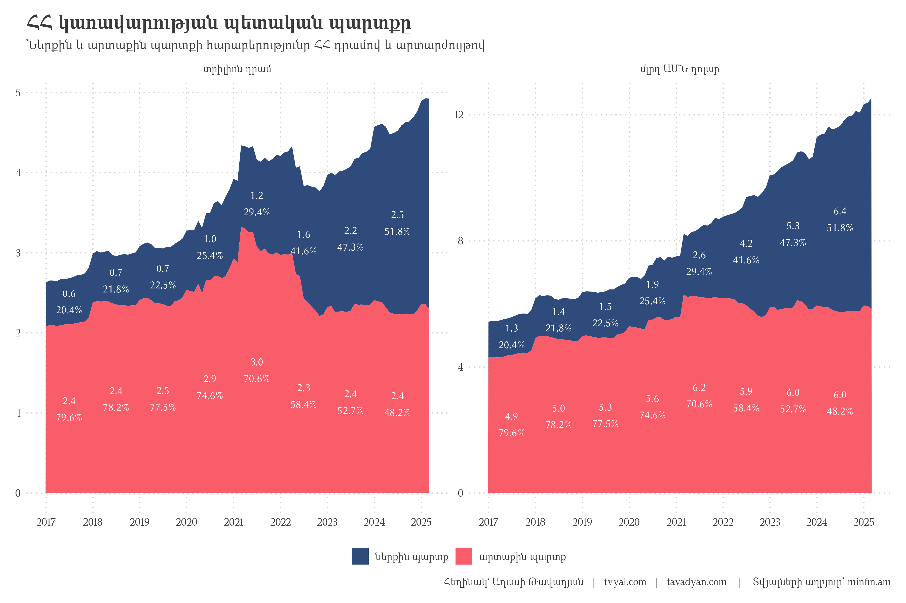

```{r setup, include=FALSE}
knitr::opts_chunk$set(
  echo = FALSE,          # Don't show code
  warning = FALSE,       # Don't show warnings
  message = FALSE,       # Don't show messages
  error = FALSE,        # Don't show errors
  fig.align = "center", # Center align figures
  out.width = "100%",   # Make figures full width
  dpi = 300,           # High resolution for plots
  fig.showtext = TRUE,  # Enable showtext for custom fonts
  dev = "png",         # Use png device for plots
  cache = TRUE         # Cache results to speed up rendering
)

# For better figure handling
options(
  digits = 2,          # Number of digits to show in numbers
  scipen = 999,        # Avoid scientific notation
  knitr.kable.NA = '', # Empty string for NA in tables
  width = 120          # Console width for output
)

library(tidyverse)
library(rvest)
library(scales)
library(RcppRoll)

# rm(list = ls()); gc()

setwd(dirname(rstudioapi::getActiveDocumentContext()$path))

source("../../initial_setup.R")

yaml_date <- as.Date(rmarkdown::metadata$date)

# Format the date for different uses
formatted_date_dmy <- format(yaml_date, "%d-%m-%Y")
formatted_date_year <- format(yaml_date, "%Y")
formatted_date_url <- format(yaml_date, "%Y_%m_%d")

# Create URL paths
newsletter_url <- paste0("https://www.tvyal.com/newsletter/", formatted_date_year, "/", formatted_date_url)
github_url <- paste0("https://github.com/tavad/tvyal_newsletter/blob/main/", formatted_date_year, "/")

```

```{r scraping data, include=FALSE}
# info pages:
# xlsx: https://minfin.am/hy/page/amsakan_vichakagrakan_teghekagrer/
# pdf:  https://minfin.am/hy/page/amsakan_ampop_teghekagir/

arm_month_names <- c(
  "Հունվար", "Փետրվար", "Մարտ", "Ապրիլ", "Մայիս", "Հունիս", "Հուլիս",
  "Օգոստոս", "Սեպտեմբեր", "Հոկտեմբեր", "Նոյեմբեր", "Դեկտեմբեր"
)

xlsx_elements <- 
  read_html("https://minfin.am/hy/page/amsakan_vichakagrakan_teghekagrer/") |> 
  html_elements(".doc_title > a")

max_avalable_date_in_dbs <- 
  tibble(db_name =html_text(xlsx_elements)) |> 
  extract(
    db_name, into = c("year", "month_arm"), 
    regex = ".* (\\d{4}) թվական ?\\(?([Ա-Ֆա-ֆ]*)?\\)?"
  ) |> 
  mutate(
    month_arm = str_to_sentence(month_arm),
    month_arm = ifelse(month_arm == "", "Դեկտեմբեր", month_arm),
    month = c(1:12)[match(month_arm, arm_month_names)],
    date = ym(paste(year, month)) + months(1) - days(1)
  ) |> 
  filter(date == max(date)) |> 
  pull(date)

```

```{r deciding to download data or not, include=FALSE}

dept_clean <-  
  read_csv("dept_clean.csv")

if (max_avalable_date_in_dbs != max(dept_clean$date)) {
  
  dept_dict <- read_csv("dept_dict.csv")
  
  initial_data <- 
    tibble(
      title = html_text(xlsx_elements),
      link = html_attr(xlsx_elements, "href")
    ) |> 
    mutate(
      data = map(link, ~rio::import(URLencode(.x), which = 1))
    )
  
  # the convoluted function below just adjusts 2 out-of-pace values in 2017 database
  dept_data_initial_setup <- function(tbl){
    
    rnumber_of_rows <- nrow(tbl)
    
    result_tbl <-
      tbl |> 
      rename(indicator = 1) |> 
      mutate(
        indicator = ifelse(
          lag(indicator) %in% c("մլրդ դրամ", "մլն ԱՄՆ դոլար") & is.na(indicator), 
          lag(indicator),
          indicator
        ),
        indicator = ifelse(is.na(indicator), "NA", indicator),
        indicator = ifelse(
          lead(indicator) != indicator | row_number() == rnumber_of_rows, 
          indicator,
          NA
        ),
        indicator = ifelse(indicator == "NA", NA, indicator)
      )
    
    return(result_tbl)
  }
  
  
  dept_data_get_colnames <- function(tbl){
    colnames <- 
      tbl |> 
      filter(indicator == "մլրդ դրամ") |> 
      mutate(indicator = "indicator")
    
    colnames <- unlist(colnames[1,], use.names = FALSE)
    
    return(colnames)
  }
  
  
  dept_data_manipulate <- function(tbl, colnames){
    
    FX_units <- c("մլրդ դրամ", "մլն ԱՄՆ դոլար")
    
    tbl_result <- 
      tbl |> 
      set_names(colnames) |> 
      mutate(
        unit_FX = ifelse(
          is.na(lag(indicator)) | grepl(
            "անվանական արժեքով", lag(indicator)) | 
            grepl("ՀՀ.+պետական.+պարտք", lead(indicator)
            ),
          indicator, 
          NA
        )
      ) |> 
      fill(unit_FX, .direction = "down") |> 
      filter(!indicator %in% FX_units, !is.na(indicator)) |> 
      pivot_longer(-c(indicator, unit_FX), names_to = "date") |> 
      mutate(
        value = parse_number(value),
        date = dmy(date)
      )
    
    return(tbl_result)
  }
  
  dept_clean <- 
    initial_data |> 
    # filter(!grepl("2017", title)) |> 
    mutate(
      data = map(data, dept_data_initial_setup),
      colnames = map(data, dept_data_get_colnames),
      data = map2(data, colnames, dept_data_manipulate)
    ) |> 
    select(-colnames) |> 
    unnest(data) |> 
    mutate(
      year = year(date),
      month = month(date),
      year_report = str_replace(title, ".*(\\d{4}).*", "\\1"),
      indicator = str_remove_all(indicator, "\\*")
    ) |> 
    filter(
      !is.na(value),
      year_report == year | year_report == 2017
    ) |> 
    unique() |> 
    left_join(dept_dict, by = join_by(unit_FX, indicator)) |> 
    select(date, year, month, unit_FX, indicator, code, value) |> 
    arrange(code, unit_FX, indicator, date)
  
  dept_clean |> 
     write_excel_csv("dept_clean.csv")
  
}

```

```{r dept plot 1, include=FALSE}

dept_plot_1 <-
  dept_clean |> 
  filter(indicator %in% c(
    "արտաքին պարտք", "ներքին պարտք" 
    # "ՀՀ կենտրոնական բանկի արտաքին պարտք"
  )) |>
  group_by(date, unit_FX) |> 
  mutate(
    pct = value / sum(value, na.rm = TRUE)
  ) |> 
  group_by(year) |> 
  mutate(
    pct_text = percent(pct, accuracy = 0.1),
    value_text = number(value/1000, accuracy = 0.1),
    text = ifelse(
      month == max(month) & year != 2025,
      paste0(value_text, "\n", pct_text),
      NA
    ),
  ) |>
  group_by(unit_FX, indicator) |> 
  mutate(
    text_correcton = ifelse(date == max(date), text, lead(text, 6)),
    text_correcton = ifelse(
      date == (max(date) + days(1) - months(6) - days(1)),
      NA, 
      text_correcton
    ),
    
    value = value / 1000,
    unit_FX = case_when(
      unit_FX == "մլրդ դրամ" ~ "տրիլիոն դրամ",
      unit_FX == "մլն ԱՄՆ դոլար" ~ "մլրդ ԱՄՆ դոլար",
    ),
  ) |> 
  ungroup() |> 
  mutate(
    indicator = fct_rev(indicator),
    unit_FX = fct_rev(unit_FX),
  ) |> 
  ggplot(aes(date, value, fill = indicator, label = text_correcton)) +
  geom_area(alpha = 1) +
  geom_text(
    position = position_stack(vjust = .5),
    color = "white"
  ) +
  facet_wrap(~unit_FX, scales = "free_y") +
  # facet_grid(unit_FX~indicator, scales = "free_y") +
  scale_x_date(date_breaks = "1 year", date_labels = "%Y") +
  scale_y_continuous(labels = number_format(accuracy = 1)) +
  scale_fill_manual(values = new_palette_colors[c(2,6)]) +
  labs(
    x = NULL,
    y = NULL,
    fill = NULL,
    title = "ՀՀ կառավարության պետական պարտքը",
    subtitle = "Ներքին և արտաքին պարտքի հարաբերությունը ՀՀ դրամով և արտարժույթով",
    caption = caption_f("minfin.am"), #suffix_text = "2024 թվականի տվյալները մայիս ամսվա կտրվածքով")
  )

```

```{r dept plot 2, include=FALSE}

dept_plot_2 <- 
  dept_clean |> 
  filter(
    grepl("AMD", code), 
    !grepl("Dept", code),
    grepl("[A-Z]{3}\\.1\\.\\d\\.\\d", code),
    # value != 0
  ) |>
  mutate(
    dept_posstion = ifelse(
      str_replace(code, "AMD.1.(\\d).\\d.", "\\1") == 1,
      "արտաքին պարտք",
      "ներքին պարտք"
    ),
    indicator = str_trunc(indicator, 60),
    indicator = fct_inorder(indicator)
  ) |> 
  arrange(desc(dept_posstion), code) |> 
  mutate(indicator = fct_inorder(indicator)) |> 
  group_by(date) |> 
  mutate(pct = value / sum(value) * 1000) |> 
  ungroup() |> 
  pivot_longer(c(value, pct)) |> 
  mutate(name = fct_rev(name)) |> 
  ggplot(aes(date, value, fill = indicator)) +
  geom_area(alpha = 1) +
  facet_grid(
    name ~ ., scales = "free_y", space = "free", 
    labeller = as_labeller(c(value = "մլրդ դրամ", pct = "կշիռ"))
  ) +
  scale_x_date(date_breaks = "1 year", date_labels = "%Y") +
  scale_y_continuous(
    labels = function(x) {
      if(max(x, na.rm = TRUE) > 1000) {  # For the value facet
        number(x, big.mark = " ")
      } else {  # For the percentage facet
        percent(x/1000, accuracy = 1)
      }
    },
    breaks = breaks_pretty(n = 4)
  ) +
  scale_fill_manual(
    values = colfunc3(10)[c(10:7, 1:5)]
  ) +
  guides(fill = guide_legend(nrow = 4)) +
  labs(
    x = NULL,
    y = NULL,
    fill = NULL,
    title = "Պետական պարտքի կառուցվածքն ըստ ներքին և արտաքին պարտքի տեսակների",
    subtitle = "բայց երագներով պատկերված է ներքին պարտքը, մուգ երանգենրով՝ արտաքին",
    caption = caption_f("minfin.am")
  )

```


```{r dept plot 3, include=FALSE}
# 
# dept_plot_3 <- 
#   dept_clean |> 
#   filter(code %in% c("FX", "USD.", "AMD.")) |> 
#   mutate(
#     value = ifelse(code !=  "FX", value / 1000, value),
#     unit_FX = case_when(
#       unit_FX == "մլրդ դրամ" ~ "տրիլիոն դրամ",
#       unit_FX == "մլն ԱՄՆ դոլար" ~ "մլրդ ԱՄՆ դոլար",
#       TRUE ~ "դոլար / դրամ փոխարժեք"
#     ),
#     unit_FX = fct_inorder(unit_FX)
#   ) |> 
#   ggplot(aes(date, value, color = unit_FX)) +
#   geom_line(size = 1.2) +
#   facet_grid(unit_FX~., scales = "free_y") +
#   scale_x_date(date_breaks = "1 year", date_labels = "%Y") +
#   scale_y_continuous(
#     label = function(x) {
#       ifelse(
#         x < 5, 
#         scales::label_number(accuracy = 0.1)(x),
#         scales::label_number(accuracy = 1)(x)
#       )
#     }
#   ) +
#   scale_color_manual(values = new_palette_colors[c(2,6,3)]) +
#   labs(
#     x = NULL,
#     y = NULL,
#     color = NULL,
#     title = "Պետական պարտքի սպասարկման և փոխարժեքի փոխկապվածությունը",
#     subtitle = "Դրամի արժեզրկման պարագայում դոլարային պետական պարտքը մեծանալու է",
#     caption = caption_f("minfin.am")
#   ) +
#   theme(
#     legend.position = "none"
#   )

```

```{r dept to GDP 1, include=FALSE}
dept_to_GDP <- read_csv("dept_to_GDP.csv")

fetch_armstat_download_link <- function(page_link, description){
  return_link <-
    read_html(page_link) |>
    html_elements(xpath = paste0('//a[contains(text(), "', description, '")]')) |>
    html_attr("href") |>
    str_replace("\\.{2}/", "https://www.armstat.am/")

  return(return_link)
}

gdp_data <- 
  tibble(
    links = fetch_armstat_download_link("https://armstat.am/am/?nid=202", "Համախառն ներքին արդյունքը (ՀՆԱ)") |> rev()
  ) |> 
  mutate(
    data = map(links, rio::import, col_names = FALSE)
  )

gdp <- 
  gdp_data |> 
  unnest(data) |> 
  select(-links) |> 
  rename(year = 1, gdp_m = 2) |> 
  select(year, gdp_m) |> 
  filter(grepl("\\d{4}", year)) |> 
  mutate(
    year = parse_number(year),
    gdp_m = parse_number(gdp_m)
  ) |> 
  filter(!is.na(gdp_m)) |> 
  group_by(year) |> 
  filter(gdp_m == max(gdp_m)) |> 
  ungroup()


dept_to_GDP_2 <- 
  dept_clean |> 
  filter(
    month == 12,
    unit_FX == "մլրդ դրամ",
    code == "AMD."
  ) |> 
  transmute(year, debt = value * 1000) |> 
  left_join(gdp, by = join_by(year)) |> 
  mutate(dept_to_GDP = debt / gdp_m) |> 
  
  filter(year > 2021) |> 
  select(year, dept_to_GDP)


 # mutate(date = ymd(paste(year, "12-31")))

dept_to_GDP_plot_1 <-
  dept_to_GDP |> 
  filter(year <= 2021) |> 
  bind_rows(dept_to_GDP_2) |> 
  filter(year >= 2002) |> 
  mutate(
    labs = percent(dept_to_GDP, accuracy = 0.1)
  ) |> 
  ggplot(aes(year, dept_to_GDP, label = labs)) +
  geom_hline(yintercept = 0.5, color = new_palette_colors[5], linetype = "dotted") +
  geom_col() +
  geom_text(vjust = -0.5) +
  geom_text(
    aes(2010, 0.52, label = "Պարտք / ՀՆԱ 50% սհամանագիծ"), 
    color = new_palette_colors[5], size = 3, hjust = 0
  ) +
  scale_x_continuous(breaks = seq(2002, 2024, 1)) +
  scale_y_continuous(breaks = seq(0, 0.7, 0.1), labels = percent_format(accuracy = 1)) +
  labs(
    x = NULL,
    y = NULL,
    title = "Պետական պարտք / ՀՆԱ հարաբերությունը Հայաստանում",
    subtitle = "տոկոս",
    caption = caption_f("minfin.am")
  ) +
  theme(
    panel.grid.major.x = element_blank(),
    panel.grid.major.y = element_blank(),
    axis.text.y = element_blank()
  )
```

```{r download GDP quarter data, include=FALSE}

GDP_links <- 
  read_html("https://www.armstat.am/en/?nid=202") |> 
  html_elements("a") %>%
  .[html_text(.) == "GDP"] |> 
  html_attr("href") |> 
  str_replace("\\.{2}/", "https://www.armstat.am/")

# value - ընթացիկ գներով, մլն դրամ 
GDP_quarter <-
  rio::import(GDP_links[2], skip = 4) |> 
  as_tibble() |> 
  rename(code = 1, name_arm = 2, name_eng = 3, name_rus = 4) |> 
  pivot_longer(-c(code, contains("name")), names_to = "date") |> 
  group_by(code, name_arm) |> 
  mutate(
    date = yq(date) + months(3) - days(1),
    value_yoy = roll_sumr(value, 4)
  ) |> 
  ungroup()

# GDP_value_yoy - ընթացիկ գներով, մլրդ դրամ 
GDP_quarter_only <- 
  GDP_quarter |> 
  filter(
    grepl("Ներքին արդյունք", name_arm),
    !is.na(value_yoy)
  ) |> 
  transmute(date, GDP_value_yoy = value_yoy / 1000)

GDP_quarter_dept <-
  dept_clean |> 
  filter(code == "AMD.1.") |> 
  rename(dept = value) |> 
  left_join(GDP_quarter_only, by = "date") |> 
  filter(!is.na(GDP_value_yoy)) |> 
  mutate(
    dept_gdp = dept / GDP_value_yoy
  )


```


```{r dept to GDP 2 setup, include=FALSE}

# usd_amd_data <- 
#   read_csv("~/R/Gcapatker/2024_03_24_CBA_FX/CBA_FX_data_cleaned.csv") |> 
#   filter(FX_ISO == "USD")
# usd_amd_data |> write_csv("USD_AMD_rates.csv")

usd_amd_data <- read_csv("USD_AMD_rates.csv")

dept_to_GDP <- 
  dept_to_GDP |> 
  mutate(
    date = ymd(paste(year, "12 31"))
  ) |> 
  filter(year <= 2015) |> 
  select(-year) |> 
  bind_rows(
    GDP_quarter_dept |> transmute(date, dept_to_GDP = dept_gdp)
  )

dept_and_gdp_indicators <-
  WDI::WDI(
    country = "AM",
    indicator = c(
      # "GC.DOD.TOTL.GD.ZS",
      # "NY.GDP.MKTP.CD",
      "NY.GDP.MKTP.KD.ZG"
    )
  ) |> 
  as_tibble() |> 
  rename(
    # dept_to_gdp = GC.DOD.TOTL.GD.ZS,
    # gdp = NY.GDP.MKTP.CD, 
    gdp_growth = NY.GDP.MKTP.KD.ZG
  )

gdp_growth_armenia <- 
  dept_and_gdp_indicators |> 
  filter(iso2c == "AM") |> 
  select(year, gdp_growth) |> 
  mutate(
    gdp_growth = ifelse(year == 2023, 8.7, gdp_growth),
    gdp_growth = gdp_growth / 100
  ) |> 
  filter(!is.na(gdp_growth)) |> 
  mutate(date = ymd(paste(year, "12-31"))) |> 
  select(-year) |> 
  
  bind_rows(
    tibble(gdp_growth = 0.059, date = ymd("2024-12-31"))
  )
```

```{r dept to GDP 2, include=FALSE}

dept_to_GDP_plot_2 <- 
  dept_to_GDP |> 
  left_join(gdp_growth_armenia, by = join_by(date)) |> 
  pivot_longer(-date) |> 
  filter(!is.na(value), date >= ymd("1999-01-01")) |> 
  ggplot(aes(date, value, color = name)) +
  geom_vline(xintercept = ymd(paste(c(2009, 2020), "12-31")), color = "gray40") +
  geom_hline(yintercept = c(0, 0.5), color = new_palette_colors[c(3,6)], alpha = 0.8) +
  geom_line(size = 1.2) +
  geom_line(
    data = mutate(
      usd_amd_data,
      FX_ISO = factor(FX_ISO, levels = c("USD", "dept_to_GDP", "gdp_growth"))
    ),
    mapping = aes(date, AMD/700, color = FX_ISO),
    size = 1.2
  ) +
  geom_text(
    aes(ymd("1999-02-01"), 0.52, label = "Պարտք / ՀՆԱ 50% սհամանագիծ"), 
    color = new_palette_colors[5], size = 3, hjust = 0
  ) +
  geom_text(
    aes(ymd("1999-02-01"), -0.02, label = "Բացասական ՀՆԱ աճ"), 
    color = new_palette_colors[2], size = 3, hjust = 0
  ) +
  scale_x_date(date_breaks = "2 years", date_labels = "%Y") +
  scale_y_continuous(
    breaks = seq(-0.1, 0.8, 0.1), 
    labels = c(percent(seq(-0.1, 0.6, 0.1), accuracy = 1), "", ""),
    name = NULL,
    sec.axis = sec_axis(
      transform = ~.*700,
      name = "Փոխարժեք",
      breaks = seq(280, 560, length.out = 5)
    )
  ) +
  scale_color_manual(
    values = new_palette_colors[c(8,6,2)],
    labels = c(
      "USD" = "ԱՄՆ դոլար ՀՀ դրամ փոխարժեք", 
      "dept_to_GDP" = "Պետական պարտք ՀՆԱ հարաբերություն", 
      "gdp_growth" = "ՀՆԱ աճ"
    )
  ) +
  guides(color = guide_legend(nrow = 1)) +
  labs(
    x = NULL,
    color = NULL,
    title = "Պետական պարտք, փոխարժեք և ՀՆԱ աճ",
    subtitle = "փոխկապվածությունները*",
    caption = paste0("* 2017 թվականից պետական պարտք / ՀՆԱ հարաբերությունը ներկայացված է եռամսյակային կտրվածքով\n\n", caption_f())
  ) +
  theme(axis.title.y.right = element_text(hjust = 0.2))
```

```{r, include=FALSE}

budget_annex_clean <- read_csv("budget_annex_clean.csv") |> mutate(year = as_factor(year))

plot_budget_spendings <- 
  budget_annex_clean |> 
  filter(!is.na(code_name)) |> 
  filter(value >= 0) |> 
  mutate(
    code_name = fct_lump_n(code_name, n = 7, w = pct, other_level = "Այլ ծախսեր")
  ) |> 
  group_by(year, code_name, total) |> 
  summarise(
    value = sum(value), pct  = sum(pct), rank = min(rank),
    .groups = "drop"
  ) |> 
  mutate(
    code_name = fct_reorder(code_name, pct, .desc = TRUE),
    code_name = fct_relevel(code_name, "Այլ ծախսեր", after = Inf),
    text_label = ifelse(
      pct >= 0.08,
      paste0(number(value / 1e6, accuracy = 0.1, suffix = " Դ"), "\n"), 
      ""
    ),
    text_label = paste0(text_label, percent(pct, accuracy = 0.1))
  ) |> 
  ggplot(aes(year, pct)) +
  geom_col(aes(fill = code_name), alpha = 1) +
  geom_text(
    aes(label = text_label, fill = code_name), 
    position = position_stack(vjust = 0.5), 
    color = "white"
  ) +
  geom_text(
    data = budget_annex_clean |> filter(is.na(code_name)), 
    mapping = aes(year, 1.04, label = number(value / 1e6, accuracy = 0.1, suffix = " Դ"))
  ) +
  # geom_text(
  #   data = tibble(label = "Ընդհամենը բյուջետային ծախսեր, մլրդ ՀՀ դրամ", code_name = NA), 
  #   mapping = aes("2019", 1.1, label = label), hjust = 0.05
  # ) +
  scale_y_continuous(breaks = seq(0, 1, 0.25), labels = percent_format()) +
  scale_fill_manual(values = new_palette_colors) +
  guides(fill = guide_legend(nrow = 3)) +
  labs(
    x = NULL,
    y = NULL,
    fill = NULL,
    title = "ՀՀ պետական բյուջեի հիմնական ծախսերը",
    subtitle = "Ընդհամենը բյուջետային ծախսեր, մլրդ ՀՀ դրամ",
    caption = caption_f(source = "Ֆինանսների նախարարություն")
  ) +
  theme(
    panel.grid.major.x = element_blank(),
    panel.grid.major.y = element_blank()
  )

```

```{r save plots, include=FALSE}

ggsave("plots/dept_plot_1.png", dept_plot_1, width = 12, height = 8)
ggsave("plots/dept_plot_2.png", dept_plot_2, width = 12, height = 8)
ggsave("plots/dept_to_GDP_plot_1.png", dept_to_GDP_plot_1, width = 12, height = 8)
ggsave("plots/dept_to_GDP_plot_2.png", dept_to_GDP_plot_2, width = 12, height = 8)
ggsave("plots/plot_budget_spendings.png", plot_budget_spendings, width = 12, height = 8)

system("cd ../.. | git all")

```


բառցիկ չունենք, եթե 2002-2007 թվականի ֆինանսական միջոցների ներհոսքի և տնտեսական աճի արդյունքում հայաստանը կարողացավ կրճատել պետական պարտքը մինչև 14.2 տոկոս, որի արդյունքում կարողացավ մեծացնելով պետական պարտքը մինչև 34.1 տոկոս 2009թ․ ապահովել տնտեսությունը 2008թ․ ֆինանսական ճգնաժամի պայմաններում։ Իսկ 2014թ․ ճգնաժամի արդյունքում պետական պարտքը նույնպես աճեց, նույնը 2020թ․ քովիդով պայմանավորված։ Սակայն 2022-23 թվականների աճը լիարժեք չոգտագործվեց պետական պարտքի շեմը հնարավորինս կրճատելու համար և այժմ տնտեսությունը վտանգի առաջ է կանգնած։ Եթե տնտեսությունում գրանցի 0-ական աճ, ինչպիսին եղել է 2008, 2016 և 2020 թվականին ապա պետական պարտք ՀՆԱ հարաբերությունը, նախորդ փորձը հաշվի առնելով կարող է մոտ 15 տոկոսային կետով աճել։ Հաշվի առնելով 2025թ․ տնտեսկան մարտահրավերները այս սցենարը հավանակաան է։

***English summary below.***

## [💰🚧⚖️ Պետական պարտքի ճոճանակ․ Առաջին անգամ ներքին պարտքը գերազանցում է արտաքինը](`r newsletter_url`)

Հայաստանի Հանրապետության պետական պարտքի կառուցվածքում առաջին անգամ ներքին պարտքի կշիռը գերազանցել է 50 տոկոսը։ 2024 թվականի մայիսի կտրվածքով կառավարության պետական պարտքը կազմել է 11 մլրդ 577 մլն դոլար կամ 4 տրիլիոն 496 մլրդ դրամ, որի 50.2 տոկոսը բաժին է ընկնումներքին աղբյուրներին, իսկ 49.8-ը՝ արտաքին։

Այս փոփոխությունը նշանակալի առաջընթաց է 2017 թվականի համեմատ, երբ Կառավարության ներքին պետական պարտքը կազմում էր ընդհանուր պարտքի 20.4 տոկոսը, իսկ արտաքինը՝ 79.6 տոկոսը։


**Գծապատկեր 1.**



Նշենք, որ 2017 թվականի կտրվածքով Հայաստանի կառավարության պարտքը կազմում էր 6 մլրդ 173 մլն դոլար, կամ 2 տրիլիոն 988 մլրդ դրամ։ Այս ժամանակահատվածի ընթացքում պետական պարտքը աճել է դրամով 50.5 տոկոսով, իսկ դոլարով գրեթե 2 անգամ՝ 87.5 տոկոսով, որը հիմնականում պայմանավորված է 2017 թվականի սկզբից դրամի արժեզրկմամբ 480 դրամից մինչև 387, որը էժանացրել է դոլարային պարքի սպասարկումը։

Վերջին տարիներին պետական պարտքի կառուցվածքում ներքին պարտքի մեծացման քաղաքականությունը իրականացվում է արտարժութային ռիսկերը զսպելու համար։ Նշենք, որ 2023 թվականի կտրվածքով պետական պարտք / ՀՆԱ հարաբերությունը կազմում է 48.1 տոկոս, որը դոլարի հանդեպ ՀՀ դրամի 20 կետով արժեզրկման պարագայում կհատի 50 տոկոսի սահմանը։ Ըստ ԵԱՏՄ համաձայնագրի 63-րդ կետի՝ ընդհանուր պետական պարտքը չպիտի գերազանցի համախառն ներքին արդյունքի 50 տոկոսը, իսկ ըստ հարկաբյուջետային գործող կանոնների՝ երբ Կառավարության պարտքը գերազանցում է ՀՆԱ-ի 60%-ը, գործադիրը պարտավորվում է ընթացիկ ծախսերը սահմանափակել, ինչպես նաև ներկայացնել ծրագիր՝ ՀՆԱ-ի նկատմամբ Կառավարության պարտքի մակարդակը նվազեցնելու վերաբերյալ։ ՀՀ ֆինանսների նախարարությունը իր միջնաժամկետ քաղաքականությունը իրականացնում է այնպես, որ պետական պարտք/ՀՆԱ հարաբերությունը պահպանի 50 տոկոսի շրջանակներում։

Գծապատկեր 2-ը ներկայացնում է պետական պարտքի կառուցվածքն ըստ ներքին և արտաքին պարտքի տեսակների:

**Գծապատկեր 2.** 


Կառավարության պարտքի միջին կշռված տոկոսադրույքը որոշակիորեն բարձրացել է՝ հասնելով 7.3 տոկոսի, ինչը հիմնականում պայմանավորված է այն հանգամանքով, որ ներքին դրամային պարտքերը, որոնք պետությունը ներգրավում է պարտատոմսեր թողարկելով, ավելի բարձր տոկոսադրույքով են։

Համաշխարհային ճգնաժամերը և աշխարհաքաղաքական կտրուկ փոփոխությունները կարող են հանգեցնել պետական պարտք / ՀՆԱ հարաբերության աճին, և ներքին պետական պարտքի մեծացման քաղաքականությունը զսպում է արտաքին ռիսկերը։

Կառավարության պարտքի 49.0 տոկոսը դրամով է, 29.9 տոկոսը՝ դոլարով, 9.1 տոկոսը՝ եվրոյով, մնացածը՝ այլ արժույթներով։

Ներքին պարտքի մեծացումը փոքրացնում է արտաքին ֆինանսական ռիսկերը։ Գծապատկեր 3-ը ցույց է տալիս պետական պարտքի սպասարկման և փոխարժեքի փոխկապվածությունը:


Ինչպես երևում է 4-րդ գծապատկերում, պետական պարտք/ՀՆԱ հարաբերությունը առաջին անգամ հատել է 50 տոկոսի սահմանագիծը 2016 թվականին՝ կազմելով 51.9 տոկոս։ Ս]ա հիմնականում պայմանավորված էր Ռուսաստանում արժութային ճգնաժամով, որի արդյունքում արժեզրկվեցին տարածաշրջանի բոլոր արժույթները, ինչպես նաև դրամը, որը կտրուկ մեծացրեց արտաքին պետական պարտքի սպասարկումը։ Տարեկան կտրվածքով պետական պարտք / ՀՆԱ հարաբերությունը առավելագույնի է հասել 2020 թվականին, երբ այն հատել է 63.5 տոկոսի սահմանագիծը, իսկ եռամսյակային կտրվածքով՝ 2021թ․ առաջին եռամսյակում՝ 69.8 տոկոս։ Նշենք, որ 2020 թվականին ՀՆԱ աճը բացասական էր՝ կազմելով -7.2 տոկոս, ինչը հիմնականում պայմանավորված էր հակահամաճարակային միջոցառումներով և 44-օրյա պատերազմով, որոնք նաև նպաստեցին պետական պարտքի աճին։

2022 թվականին պետական պարտք/ՀՆԱ հարաբերությունը հիմնականում կարողացավ իջնել ի հաշիվ դրամի արժևորման, որը պայմանավորված էր նրանով, որ 2022 թվականին Ռուսաստանի դեմ պատժամիջոցներով դրդված բավականին մեծ քանակությամբ արտարժութային միջոցներ մտան Հայաստան, ինչը արժևորեց դրամը, և, որպես հետևանք, իջեցրեց պետական պարտքի սպասարկումը։

Այս իրավիճակը ցույց է տալիս, որ արտաքին գործոնները կարող են էական ազդեցություն ունենալ Հայաստանի տնտեսության և պետական պարտքի դինամիկայի վրա: Սակայն պետք է նշել, որ նման իրավիճակները չեն կարող դիտարկվել որպես կայուն միտում, և երկարաժամկետ հեռանկարում անհրաժեշտ է ուշադրություն դարձնել պետական պարտքի կառավարման ավելի կայուն մեխանիզմների մշակմանը:

**Գծապատկեր 3.**


Վերջին գծապատկերում հստակ երևում է դոլարի փոխարժեքի ազդեցությունը պետական պարտքի սպասարկման և, որպես հետևանք, պետական պարտք/ՀՆԱ հարաբերության վրա։

Ինչքան արժևորվում է դրամը դոլարի հանդեպ, այնքան պետական պարտքի սպասարկումը էժանանում է, հետևաբար պետական պարտք/ՀՆԱ հարաբերությունը նվազում է, և հակառակը՝ որքան դրամը արժեզրկվում է, այնքան պետական պարտք/ՀՆԱ հարաբերությունը ունի աճի միտում։

[Հարկ է նշել, որ հայկական դրամը 2020 թվականից փոխարկելի արժույթներից ամենաարժևորվածն է, որը բացասաբար է անդրադառնում իրական արտահանման, ինչպես նաև տուրիզմի և ՏՏ ոլորտի վրա։ Սա որոշակի ճնշում է գործադրում փաստացի դոլարին փափուկ կցված դրամի վրա](https://www.tvyal.com/newsletter/2024/2024_04_05)։ Դրամի արժեզրկումը բացասաբար կանդրադառնա պետական պարտքի սպասարկման և, որպես երկրորդային հետևանք, ՀՆԱ-ի աճի վրա։

Գծապատկերում երևում է նաև պետական պարտք/ՀՆԱ աճ փոխկապվածությունը, որը ունի հակադարձ ազդեցություն։ ՀՆԱ-ի բացասական աճի պարագայում պետական պարտքը կտրուկ աճում է, քանի որ ՀՆԱ-ի բացասական աճով չի կատարվում պետական բյուջեով սահմանված թիրախը, որի արդյունքում ստիպված սպառվում է բյուջեի պահուստային ֆոնդը և հետագայում նաև աճում է պետական պարտքը։

Այս միտումը վերջին գծապատկերում երևում է 2010 թվականին՝ 2002-2008 թվականների միջին 12 տոկոս տնտեսական աճից հետո։ Այս անկումը պայմանավորված էր Համաշխարհային ֆինանսական ճգնաժամով։ Նմանատիպ իրավիճակ դիտվեց նաև 2020 թվականին․ տնտեսական անկումը, այս անգամ, պայմանավորված էր մեկ այլ Համաշխարհային երևույթով՝ COVID-19 համաճարակով։ Արդյունքում երկու ճգնաժամերն էլ մեծացրեցին պետական պարտք/ՀՆԱ հարաբերությունը։

Այսինքն՝ դրամի փոխարժեքը ունի ուղղակի ազդեցություն պետական պարտքի աճի վրա, իսկ ՀՆԱ-ի աճը՝ հակադարձ։ Վերջին 25 տարիների ընթացքում բացասական ՀՆԱ-ի աճը հիմնականում պայմանավորված է եղել համաշխարհային “սև կարապ” իրադարձություններով։

**Գծապատկեր 4.**


Այս վերլուծությունը ցույց է տալիս, որ Հայաստանի տնտեսությունը զգայուն է գլոբալ շոկերի նկատմամբ, և պետական պարտքի կառավարումը պահանջում է զգուշավոր մոտեցում՝ հաշվի առնելով արտաքին գործոնների հնարավոր ազդեցությունը:

Ընդհանուր առմամբ ողջունելի է և հուսադրող, որ պետական պարտքի կառուցվածքում ներքին պարտքի կշիռը առաջին անգամ հատել է 50 տոկոսի սահմանակետը, ինչպես նաև այն, որ պետական պարտքի մեջ գերակշռող արժույթը հայկական դրամն է։ Սակայն 2022 թվականից սկսած փոխարկելի արժույթների մեջ դրամը ամենաարժեզրկվածն է, որը բացասական ազդեցություն ունի իրական արտահանման, ինչպես նաև զբոսաշրջության և ՏՏ արտադրանքի արտահանման վրա։ Սա իր հերթին կարող է բացասաբար անդրադառնալ 2024 թվականի բյուջեի օրենքով նախատեսված 7 տոկոս տնտեսական աճի հեռանկարի վրա։ [Ներկայումս տնտեսությունում առկա են առանցքային խնդիրներ](https://www.tvyal.com/newsletter/2024/2024_06_07)։ Պետք է նշել, որ ինչպես ՀՀ դրամի հետագա արժեզրկումը, այնպես էլ ՀՆԱ-ի անկումը բացասաբար կարող են անդրադառնալ պետական պարտքի սպասարկման տեսանկյունից՝ որի պարագայում պետական պարտք / ՀՆԱ հարաբերությունը կարող է հատել 50 տոկոսի սահմանագիծը։

**Գծապատկեր 5.**


**Եզրակացություն**

Այս վերլուծությունը ցույց է տալիս, որ Հայաստանի պետական պարտքի կառավարման քաղաքականությունը վերջին տարիներին էական փոփոխություններ է կրել: Ներքին պարտքի կշռի աճը և դրամով պարտքի գերակշռությունը դրական միտումներ են, որոնք նպաստում են արտարժութային ռիսկերի նվազեցմանը: Սակայն, միևնույն ժամանակ, պետք է հաշվի առնել մի շարք մարտահրավերներ:

* Դրամի արժեզրկման հնարավոր ազդեցությունը պետական պարտքի և ՀՆԱ-ի հարաբերակցության վրա:
* Գլոբալ տնտեսական շոկերի նկատմամբ Հայաստանի տնտեսության խոցելիությունը:
* Արտահանման, զբոսաշրջության և ՏՏ ոլորտների վրա դրամի արժևորման բացասական ազդեցությունը:

Այս իրավիճակում անհրաժեշտ է շարունակել զգուշավոր և հավասարակշռված պետական պարտքի կառավարման քաղաքականությունը՝ միաժամանակ ուշադրություն դարձնելով տնտեսության իրական հատվածի զարգացմանը և արտաքին մրցունակության պահպանմանը:


-----

-----

Եթե հնարավոր է, խնդրում եմ այս նյութը ուղարկել նաև այն մարդկանց, ում այն կարծում եք կարող է հետաքրքրել:

**ԱՅՍ ՀՈԴՎԱԾԻ ՀՂՈՒՄԸ**


***Թավադյան, Աղ․Ա․ (`r formatted_date_year`)․ Շքեղ թվերի ետևում․ Հայաստանի տնտեսական աճի ստվերը [Tvyal.com platform], `r formatted_date_dmy`․ `r newsletter_url`***

**Արգելվում է այս հարթակի նյութերը արտատպել առանց հղում կատարելու։**    

<small>\* Այս և մեր բոլոր այլ վերլուծությունների տվյալները վերցված են պաշտոնական աղբյուրներից։ Հաշվարկները ամբողջությամբ հասանելի են github-ում, դրանք կարելի է ստուգել\` այցելելով [github-ի](`r github_url`) մեր էջը, որտեղ տրված են տվյալները, հաշվարկների և գծապատկերների կոդը։

</small>

-----

# ՀԱՄԱԳՈՐԾԱԿՑՈՒԹՅՈՒՆ

<style>
.ai-services-banner-tvyal {
background-color: #0a192f;
color: #e6f1ff;
padding: 30px;
font-family: Arial, sans-serif;
border-radius: 10px;
box-shadow: 0 4px 6px rgba(0, 0, 0, 0.1);
position: relative;
overflow: hidden;
min-height: 400px;
display: flex;
flex-direction: column;
justify-content: center;
}
.ai-services-banner-tvyal::before {
content: '';
position: absolute;
top: -25%;
left: -25%;
right: -25%;
bottom: -25%;
background: repeating-radial-gradient(
circle at 50% 50%,
rgba(100, 255, 218, 0.1),
rgba(100, 255, 218, 0.1) 15px,
transparent 15px,
transparent 30px
);
animation: gaussianWaveTvyal 10s infinite alternate;
opacity: 0.3;
z-index: 0;
}
@keyframes gaussianWaveTvyal {
0% {
transform: scale(1.5) rotate(0deg);
opacity: 0.2;
}
50% {
transform: scale(2.25) rotate(180deg);
opacity: 0.5;
}
100% {
transform: scale(1.5) rotate(360deg);
opacity: 0.2;
}
}
.ai-services-banner-tvyal > * {
position: relative;
z-index: 1;
}
.ai-services-banner-tvyal h2,
.ai-services-banner-tvyal h3 {
margin-bottom: 20px;
color: #ccd6f6;
}
.ai-services-banner-tvyal ul {
margin-bottom: 30px;
padding-left: 20px;
}
.ai-services-banner-tvyal li {
margin-bottom: 10px;
}
.ai-services-banner-tvyal a {
color: #64ffda;
text-decoration: none;
transition: color 0.3s ease;
}
.ai-services-banner-tvyal a:hover {
color: #ffd700;
text-decoration: underline;
}
</style>

<div class="ai-services-banner-tvyal">
## [Եթե ուզում եք  AI գործիքներով ձեր տվյալներից օգուտ քաղել` ԴԻՄԵՔ ՄԵԶ](mailto:a@tavadyan.com?subject=Let's Put Data to Work!)

### Մենք առաջարկում ենք

- Extensive databases for finding both international and local leads
- Exclusive reports on the Future of the Armenian Economy
- Work and browser automation to streamline operations and reduce staffing needs
- AI models for forecasting growth and optimizing various aspects of your business
- Advanced dashboarding and BI solutions
- Algorithmic trading

### [Let's Put Your Data to Work!](mailto:a@tavadyan.com?subject=Let's Put Data to Work!)

### [ՄԻԱՑԵՔ ՄԵՐ ԹԻՄԻՆ](mailto:a@tavadyan.com?subject=Work application)
</div>


-----

>
> Ձեզ կարող են հետաքրքրել նաև այս նյութերը.
>
> * [💼✈🥶️ Հայաստանի հյուրընկալության սառչում](https://www.tvyal.com/newsletter/2024/2024_04_21)։
> * [💵🪙🎭 Դրամի դրամա․ Ինչո՞ւ է արժեզրկվում և արժևորվում դրամը](https://www.tvyal.com/newsletter/2024/2024_04_05)։
>


-----

## ԶԼՄ հաղորդագրություն


[Դիտեք 1in.am լրատվամիջոցին տված իմ վերջին հարցազրույցը, որը քննարկում է նաև պետական պարտքի հիմնահարցերը։](https://youtu.be/PCBU0nOurUs)

📺  Սպեկուլյացիա է. ինչո՞ւ հենց Հայաստանով պետք է այդքան մեծ քանակությամբ ոսկի անցնի. Աղասի Թավադյան 📺

* 🎯 Պետական պարտքի մեջ ներքին պարտքի սահմանը հատել է ՀՆԱ 50 տոկոս սհամանաչափը։
* 🎯 Ինչո՞վ է պայմանավորված ռուբլու վերջին տատանումները։
* 🎯 ՌԴ ոսկու քանի՞ տոկոսն է անցնում Հայաստանով։
* 🎯 Ի՞նչ առանցքային խնդիրներ կան Հայաստանի տնտեսությունում
* 🎯 Ինչ կտա Հայաստանի տնտեսությանը ԵԱՏՄ-ից դուրս գալը։

<a href="https://youtu.be/PCBU0nOurUs">
  
</a>


-----


## English Summary

### 💰🚧⚖ The Pendulum of Public Debt: For the First Time, Domestic Debt Exceeds External Debt

This article examines a significant shift in Armenia's public debt structure, where domestic debt has surpassed external debt for the first time in the country's history. As of May 2024, the government's public debt stood at $11.577 billion or 4.496 trillion drams, with domestic sources accounting for 50.2% of the total debt. This marks a substantial change from 2017 when domestic debt comprised only 20.4% of the total public debt.

The analysis explores the implications of this shift, including reduced foreign exchange risks and changes in debt servicing costs. It also delves into the complex interplay between debt structure, exchange rates, and economic indicators such as GDP growth and export performance. The article highlights how global economic shocks and geopolitical changes can impact the debt-to-GDP ratio, emphasizing the need for careful management of public finances in a volatile international economic environment.


---

Այս վերլուծությունը առկա է նաև [մեր կայքէջում](https://www.tvyal.com/newsletter/2024/2024_06_28), այս վերլուծության կոդը և տվյալները դրված են նաև [Github-ում](https://github.com/tavad/tvyal_newsletter)։       

---    

 


Հարգանքներով,            
Աղասի Թավադյան         
`r format(yaml_date, "%d.%m.%Y")`          
[tvyal.com](https://www.tvyal.com/)      
[tavadyan.com](https://www.tavadyan.com/)

---

[Was this email forwarded to you? Subscribe here.](https://www.tvyal.com/subscribe)

[Բաժանորդագրվեք](https://www.tvyal.com/subscribe)

       
---              
               


####### **Ուշադրություն. Ձեր էլ.փոստը մեյլլիսթի մեջ է, որի միջոցով ես կիսվում եմ շաբաթական նյութեր, որոնք հիմնականում ներկայացնում են Հայաստանի տնտեսությունը: Նյութերը ներառում են գծապատկերներ, [տվյալների բազաներ](https://github.com/tavad/tvyal_newsletter), տեսանյութեր, հոդվածներ, [առցանց վահանակներ](https://www.tvyal.com/projects), տնտեսական գործիքներ, կանխատեսումներ և հաշվետվություններ: Եթե ցանկանում եք չեղարկել բաժանորդագրությունը, խնդրում եմ տեղեկացրեք ինձ, և ես կհեռացնեմ ձեր էլ. փոստը ցուցակից: Գրեք նաև եթե ունեք մենկնաբանություններ:**

####### **Important! Your email is part of the mailing list where I share weekly materials primarily focused on the Armenian economy. These materials encompass charts, [databases](https://github.com/tavad/tvyal_newsletter), videos, articles, [online dashboards](https://www.tvyal.com/projects), economic tools, forecasts, and reports. If you wish to unsubscribe, please let me know, and I will remove your email from the list. Please share your comments as well․**


