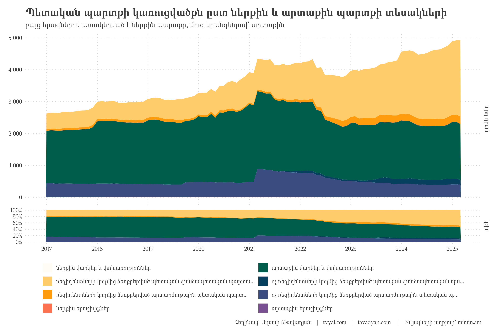
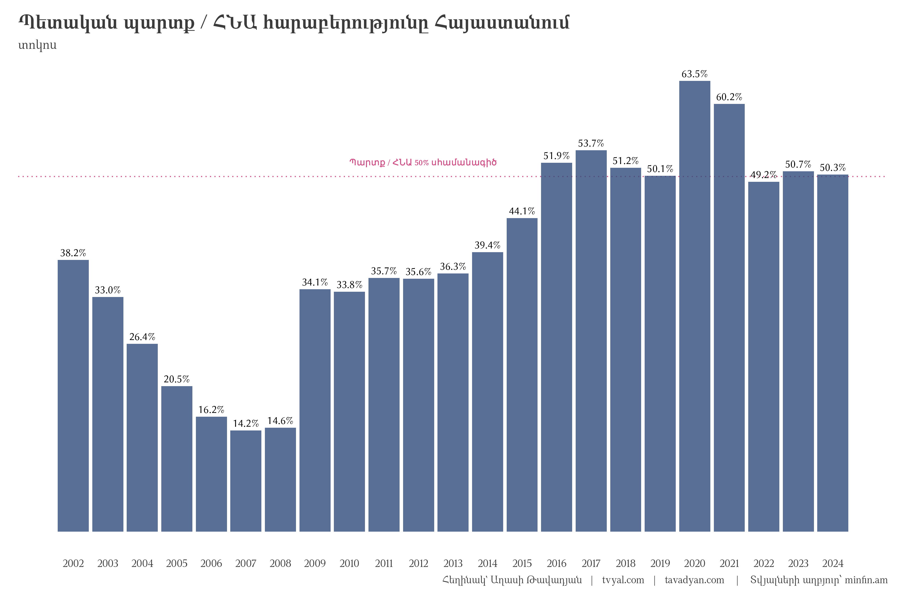
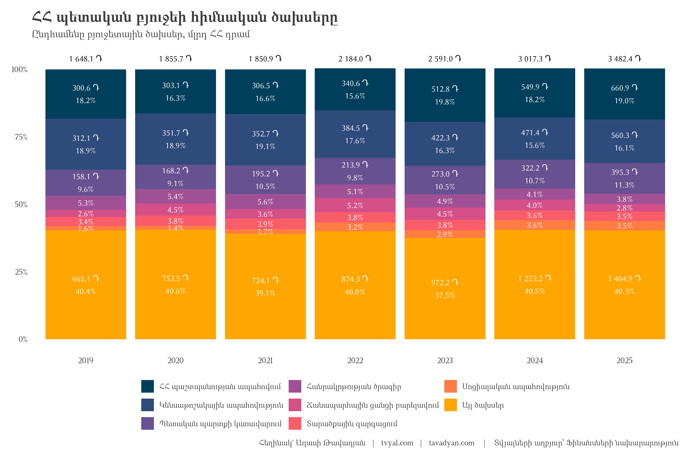
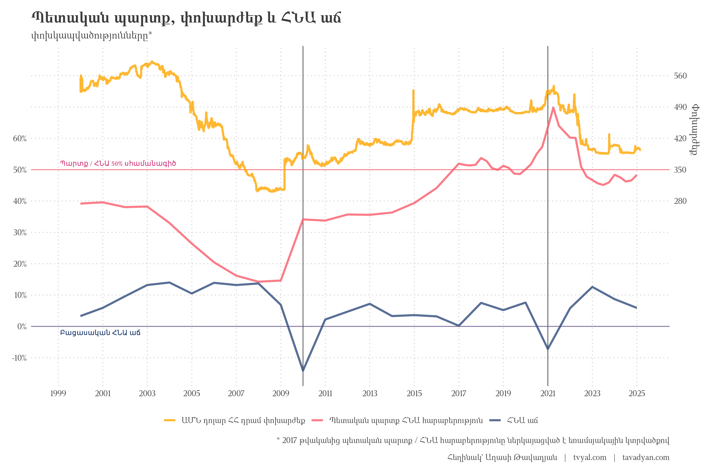

```{r setup, include=FALSE}
knitr::opts_chunk$set(
  echo = FALSE,          # Don't show code
  warning = FALSE,       # Don't show warnings
  message = FALSE,       # Don't show messages
  error = FALSE,        # Don't show errors
  fig.align = "center", # Center align figures
  out.width = "100%",   # Make figures full width
  dpi = 300,           # High resolution for plots
  fig.showtext = TRUE,  # Enable showtext for custom fonts
  dev = "png",         # Use png device for plots
  cache = TRUE         # Cache results to speed up rendering
)

# For better figure handling
options(
  digits = 2,          # Number of digits to show in numbers
  scipen = 999,        # Avoid scientific notation
  knitr.kable.NA = '', # Empty string for NA in tables
  width = 120          # Console width for output
)

library(tidyverse)
library(rvest)
library(scales)
library(RcppRoll)

# rm(list = ls()); gc()

setwd(dirname(rstudioapi::getActiveDocumentContext()$path))

source("../../initial_setup.R")

yaml_date <- as.Date(rmarkdown::metadata$date)

# Format the date for different uses
formatted_date_dmy <- format(yaml_date, "%d-%m-%Y")
formatted_date_year <- format(yaml_date, "%Y")
formatted_date_url <- format(yaml_date, "%Y_%m_%d")

# Create URL paths
newsletter_url <- paste0("https://www.tvyal.com/newsletter/", formatted_date_year, "/", formatted_date_url)
github_url <- paste0("https://github.com/tavad/tvyal_newsletter/blob/main/", formatted_date_year, "/")

```

```{r scraping data, include=FALSE}
# info pages:
# xlsx: https://minfin.am/hy/page/amsakan_vichakagrakan_teghekagrer/
# pdf:  https://minfin.am/hy/page/amsakan_ampop_teghekagir/

arm_month_names <- c(
  "Հունվար", "Փետրվար", "Մարտ", "Ապրիլ", "Մայիս", "Հունիս", "Հուլիս",
  "Օգոստոս", "Սեպտեմբեր", "Հոկտեմբեր", "Նոյեմբեր", "Դեկտեմբեր"
)

xlsx_elements <- 
  read_html("https://minfin.am/hy/page/amsakan_vichakagrakan_teghekagrer/") |> 
  html_elements(".doc_title > a")

max_avalable_date_in_dbs <- 
  tibble(db_name =html_text(xlsx_elements)) |> 
  extract(
    db_name, into = c("year", "month_arm"), 
    regex = ".* (\\d{4}) թվական ?\\(?([Ա-Ֆա-ֆ]*)?\\)?"
  ) |> 
  mutate(
    month_arm = str_to_sentence(month_arm),
    month_arm = ifelse(month_arm == "", "Դեկտեմբեր", month_arm),
    month = c(1:12)[match(month_arm, arm_month_names)],
    date = ym(paste(year, month)) + months(1) - days(1)
  ) |> 
  filter(date == max(date)) |> 
  pull(date)

```

```{r deciding to download data or not, include=FALSE}

dept_clean <-  
  read_csv("dept_clean.csv")

if (max_avalable_date_in_dbs != max(dept_clean$date)) {
  
  dept_dict <- read_csv("dept_dict.csv")
  
  initial_data <- 
    tibble(
      title = html_text(xlsx_elements),
      link = html_attr(xlsx_elements, "href")
    ) |> 
    mutate(
      data = map(link, ~rio::import(URLencode(.x), which = 1))
    )
  
  # the convoluted function below just adjusts 2 out-of-pace values in 2017 database
  dept_data_initial_setup <- function(tbl){
    
    rnumber_of_rows <- nrow(tbl)
    
    result_tbl <-
      tbl |> 
      rename(indicator = 1) |> 
      mutate(
        indicator = ifelse(
          lag(indicator) %in% c("մլրդ դրամ", "մլն ԱՄՆ դոլար") & is.na(indicator), 
          lag(indicator),
          indicator
        ),
        indicator = ifelse(is.na(indicator), "NA", indicator),
        indicator = ifelse(
          lead(indicator) != indicator | row_number() == rnumber_of_rows, 
          indicator,
          NA
        ),
        indicator = ifelse(indicator == "NA", NA, indicator)
      )
    
    return(result_tbl)
  }
  
  
  dept_data_get_colnames <- function(tbl){
    colnames <- 
      tbl |> 
      filter(indicator == "մլրդ դրամ") |> 
      mutate(indicator = "indicator")
    
    colnames <- unlist(colnames[1,], use.names = FALSE)
    
    return(colnames)
  }
  
  
  dept_data_manipulate <- function(tbl, colnames){
    
    FX_units <- c("մլրդ դրամ", "մլն ԱՄՆ դոլար")
    
    tbl_result <- 
      tbl |> 
      set_names(colnames) |> 
      mutate(
        unit_FX = ifelse(
          is.na(lag(indicator)) | grepl(
            "անվանական արժեքով", lag(indicator)) | 
            grepl("ՀՀ.+պետական.+պարտք", lead(indicator)
            ),
          indicator, 
          NA
        )
      ) |> 
      fill(unit_FX, .direction = "down") |> 
      filter(!indicator %in% FX_units, !is.na(indicator)) |> 
      pivot_longer(-c(indicator, unit_FX), names_to = "date") |> 
      mutate(
        value = parse_number(value),
        date = dmy(date)
      )
    
    return(tbl_result)
  }
  
  dept_clean <- 
    initial_data |> 
    # filter(!grepl("2017", title)) |> 
    mutate(
      data = map(data, dept_data_initial_setup),
      colnames = map(data, dept_data_get_colnames),
      data = map2(data, colnames, dept_data_manipulate)
    ) |> 
    select(-colnames) |> 
    unnest(data) |> 
    mutate(
      year = year(date),
      month = month(date),
      year_report = str_replace(title, ".*(\\d{4}).*", "\\1"),
      indicator = str_remove_all(indicator, "\\*")
    ) |> 
    filter(
      !is.na(value),
      year_report == year | year_report == 2017
    ) |> 
    unique() |> 
    left_join(dept_dict, by = join_by(unit_FX, indicator)) |> 
    select(date, year, month, unit_FX, indicator, code, value) |> 
    arrange(code, unit_FX, indicator, date)
  
  dept_clean |> 
     write_excel_csv("dept_clean.csv")
  
}

```

```{r dept plot 1, include=FALSE}

dept_plot_1 <-
  dept_clean |> 
  filter(indicator %in% c(
    "արտաքին պարտք", "ներքին պարտք" 
    # "ՀՀ կենտրոնական բանկի արտաքին պարտք"
  )) |>
  group_by(date, unit_FX) |> 
  mutate(
    pct = value / sum(value, na.rm = TRUE)
  ) |> 
  group_by(year) |> 
  mutate(
    pct_text = percent(pct, accuracy = 0.1),
    value_text = number(value/1000, accuracy = 0.1),
    text = ifelse(
      month == max(month) & year != 2025,
      paste0(value_text, "\n", pct_text),
      NA
    ),
  ) |>
  group_by(unit_FX, indicator) |> 
  mutate(
    text_correcton = ifelse(date == max(date), text, lead(text, 6)),
    text_correcton = ifelse(
      date == (max(date) + days(1) - months(6) - days(1)),
      NA, 
      text_correcton
    ),
    
    value = value / 1000,
    unit_FX = case_when(
      unit_FX == "մլրդ դրամ" ~ "տրիլիոն դրամ",
      unit_FX == "մլն ԱՄՆ դոլար" ~ "մլրդ ԱՄՆ դոլար",
    ),
  ) |> 
  ungroup() |> 
  mutate(
    indicator = fct_rev(indicator),
    unit_FX = fct_rev(unit_FX),
  ) |> 
  ggplot(aes(date, value, fill = indicator, label = text_correcton)) +
  geom_area(alpha = 1) +
  geom_text(
    position = position_stack(vjust = .5),
    color = "white"
  ) +
  facet_wrap(~unit_FX, scales = "free_y") +
  # facet_grid(unit_FX~indicator, scales = "free_y") +
  scale_x_date(date_breaks = "1 year", date_labels = "%Y") +
  scale_y_continuous(labels = number_format(accuracy = 1)) +
  scale_fill_manual(values = new_palette_colors[c(2,6)]) +
  labs(
    x = NULL,
    y = NULL,
    fill = NULL,
    title = "ՀՀ կառավարության պետական պարտքը",
    subtitle = "Ներքին և արտաքին պարտքի հարաբերությունը ՀՀ դրամով և արտարժույթով",
    caption = caption_f("minfin.am"), #suffix_text = "2024 թվականի տվյալները մայիս ամսվա կտրվածքով")
  )

```

```{r dept plot 2, include=FALSE}

dept_plot_2 <- 
  dept_clean |> 
  filter(
    grepl("AMD", code), 
    !grepl("Dept", code),
    grepl("[A-Z]{3}\\.1\\.\\d\\.\\d", code),
    # value != 0
  ) |>
  mutate(
    dept_posstion = ifelse(
      str_replace(code, "AMD.1.(\\d).\\d.", "\\1") == 1,
      "արտաքին պարտք",
      "ներքին պարտք"
    ),
    indicator = str_trunc(indicator, 60),
    indicator = fct_inorder(indicator)
  ) |> 
  arrange(desc(dept_posstion), code) |> 
  mutate(indicator = fct_inorder(indicator)) |> 
  group_by(date) |> 
  mutate(pct = value / sum(value) * 1000) |> 
  ungroup() |> 
  pivot_longer(c(value, pct)) |> 
  mutate(name = fct_rev(name)) |> 
  ggplot(aes(date, value, fill = indicator)) +
  geom_area(alpha = 1) +
  facet_grid(
    name ~ ., scales = "free_y", space = "free", 
    labeller = as_labeller(c(value = "մլրդ դրամ", pct = "կշիռ"))
  ) +
  scale_x_date(date_breaks = "1 year", date_labels = "%Y") +
  scale_y_continuous(
    labels = function(x) {
      if(max(x, na.rm = TRUE) > 1000) {  # For the value facet
        number(x, big.mark = " ")
      } else {  # For the percentage facet
        percent(x/1000, accuracy = 1)
      }
    },
    breaks = breaks_pretty(n = 4)
  ) +
  scale_fill_manual(
    values = colfunc3(10)[c(10:7, 1:5)]
  ) +
  guides(fill = guide_legend(nrow = 4)) +
  labs(
    x = NULL,
    y = NULL,
    fill = NULL,
    title = "Պետական պարտքի կառուցվածքն ըստ ներքին և արտաքին պարտքի տեսակների",
    subtitle = "բայց երագներով պատկերված է ներքին պարտքը, մուգ երանգենրով՝ արտաքին",
    caption = caption_f("minfin.am")
  )

```


```{r dept plot 3, include=FALSE}
# 
# dept_plot_3 <- 
#   dept_clean |> 
#   filter(code %in% c("FX", "USD.", "AMD.")) |> 
#   mutate(
#     value = ifelse(code !=  "FX", value / 1000, value),
#     unit_FX = case_when(
#       unit_FX == "մլրդ դրամ" ~ "տրիլիոն դրամ",
#       unit_FX == "մլն ԱՄՆ դոլար" ~ "մլրդ ԱՄՆ դոլար",
#       TRUE ~ "դոլար / դրամ փոխարժեք"
#     ),
#     unit_FX = fct_inorder(unit_FX)
#   ) |> 
#   ggplot(aes(date, value, color = unit_FX)) +
#   geom_line(size = 1.2) +
#   facet_grid(unit_FX~., scales = "free_y") +
#   scale_x_date(date_breaks = "1 year", date_labels = "%Y") +
#   scale_y_continuous(
#     label = function(x) {
#       ifelse(
#         x < 5, 
#         scales::label_number(accuracy = 0.1)(x),
#         scales::label_number(accuracy = 1)(x)
#       )
#     }
#   ) +
#   scale_color_manual(values = new_palette_colors[c(2,6,3)]) +
#   labs(
#     x = NULL,
#     y = NULL,
#     color = NULL,
#     title = "Պետական պարտքի սպասարկման և փոխարժեքի փոխկապվածությունը",
#     subtitle = "Դրամի արժեզրկման պարագայում դոլարային պետական պարտքը մեծանալու է",
#     caption = caption_f("minfin.am")
#   ) +
#   theme(
#     legend.position = "none"
#   )

```

```{r dept to GDP 1, include=FALSE}
dept_to_GDP <- read_csv("dept_to_GDP.csv")

fetch_armstat_download_link <- function(page_link, description){
  return_link <-
    read_html(page_link) |>
    html_elements(xpath = paste0('//a[contains(text(), "', description, '")]')) |>
    html_attr("href") |>
    str_replace("\\.{2}/", "https://www.armstat.am/")

  return(return_link)
}

gdp_data <- 
  tibble(
    links = fetch_armstat_download_link("https://armstat.am/am/?nid=202", "Համախառն ներքին արդյունքը (ՀՆԱ)") |> rev()
  ) |> 
  mutate(
    data = map(links, rio::import, col_names = FALSE)
  )

gdp <- 
  gdp_data |> 
  unnest(data) |> 
  select(-links) |> 
  rename(year = 1, gdp_m = 2) |> 
  select(year, gdp_m) |> 
  filter(grepl("\\d{4}", year)) |> 
  mutate(
    year = parse_number(year),
    gdp_m = parse_number(gdp_m)
  ) |> 
  filter(!is.na(gdp_m)) |> 
  group_by(year) |> 
  filter(gdp_m == max(gdp_m)) |> 
  ungroup()


dept_to_GDP_2 <- 
  dept_clean |> 
  filter(
    month == 12,
    unit_FX == "մլրդ դրամ",
    code == "AMD."
  ) |> 
  transmute(year, debt = value * 1000) |> 
  left_join(gdp, by = join_by(year)) |> 
  mutate(dept_to_GDP = debt / gdp_m) |> 
  
  filter(year > 2021) |> 
  select(year, dept_to_GDP)


 # mutate(date = ymd(paste(year, "12-31")))

dept_to_GDP_plot_1 <-
  dept_to_GDP |> 
  filter(year <= 2021) |> 
  bind_rows(dept_to_GDP_2) |> 
  filter(year >= 2002) |> 
  mutate(
    labs = percent(dept_to_GDP, accuracy = 0.1)
  ) |> 
  ggplot(aes(year, dept_to_GDP, label = labs)) +
  geom_hline(yintercept = 0.5, color = new_palette_colors[5], linetype = "dotted") +
  geom_col() +
  geom_text(vjust = -0.5) +
  geom_text(
    aes(2010, 0.52, label = "Պարտք / ՀՆԱ 50% սհամանագիծ"), 
    color = new_palette_colors[5], size = 3, hjust = 0
  ) +
  scale_x_continuous(breaks = seq(2002, 2024, 1)) +
  scale_y_continuous(breaks = seq(0, 0.7, 0.1), labels = percent_format(accuracy = 1)) +
  labs(
    x = NULL,
    y = NULL,
    title = "Պետական պարտք / ՀՆԱ հարաբերությունը Հայաստանում",
    subtitle = "տոկոս",
    caption = caption_f("minfin.am")
  ) +
  theme(
    panel.grid.major.x = element_blank(),
    panel.grid.major.y = element_blank(),
    axis.text.y = element_blank()
  )
```

```{r download GDP quarter data, include=FALSE}

GDP_links <- 
  read_html("https://www.armstat.am/en/?nid=202") |> 
  html_elements("a") %>%
  .[html_text(.) == "GDP"] |> 
  html_attr("href") |> 
  str_replace("\\.{2}/", "https://www.armstat.am/")

# value - ընթացիկ գներով, մլն դրամ 
GDP_quarter <-
  rio::import(GDP_links[2], skip = 4) |> 
  as_tibble() |> 
  rename(code = 1, name_arm = 2, name_eng = 3, name_rus = 4) |> 
  pivot_longer(-c(code, contains("name")), names_to = "date") |> 
  group_by(code, name_arm) |> 
  mutate(
    date = yq(date) + months(3) - days(1),
    value_yoy = roll_sumr(value, 4)
  ) |> 
  ungroup()

# GDP_value_yoy - ընթացիկ գներով, մլրդ դրամ 
GDP_quarter_only <- 
  GDP_quarter |> 
  filter(
    grepl("Ներքին արդյունք", name_arm),
    !is.na(value_yoy)
  ) |> 
  transmute(date, GDP_value_yoy = value_yoy / 1000)

GDP_quarter_dept <-
  dept_clean |> 
  filter(code == "AMD.1.") |> 
  rename(dept = value) |> 
  left_join(GDP_quarter_only, by = "date") |> 
  filter(!is.na(GDP_value_yoy)) |> 
  mutate(
    dept_gdp = dept / GDP_value_yoy
  )


```


```{r dept to GDP 2 setup, include=FALSE}

# usd_amd_data <- 
#   read_csv("~/R/Gcapatker/2024_03_24_CBA_FX/CBA_FX_data_cleaned.csv") |> 
#   filter(FX_ISO == "USD")
# usd_amd_data |> write_csv("USD_AMD_rates.csv")

usd_amd_data <- read_csv("USD_AMD_rates.csv")

dept_to_GDP <- 
  dept_to_GDP |> 
  mutate(
    date = ymd(paste(year, "12 31"))
  ) |> 
  filter(year <= 2015) |> 
  select(-year) |> 
  bind_rows(
    GDP_quarter_dept |> transmute(date, dept_to_GDP = dept_gdp)
  )

dept_and_gdp_indicators <-
  WDI::WDI(
    country = "AM",
    indicator = c(
      # "GC.DOD.TOTL.GD.ZS",
      # "NY.GDP.MKTP.CD",
      "NY.GDP.MKTP.KD.ZG"
    )
  ) |> 
  as_tibble() |> 
  rename(
    # dept_to_gdp = GC.DOD.TOTL.GD.ZS,
    # gdp = NY.GDP.MKTP.CD, 
    gdp_growth = NY.GDP.MKTP.KD.ZG
  )

gdp_growth_armenia <- 
  dept_and_gdp_indicators |> 
  filter(iso2c == "AM") |> 
  select(year, gdp_growth) |> 
  mutate(
    gdp_growth = ifelse(year == 2023, 8.7, gdp_growth),
    gdp_growth = gdp_growth / 100
  ) |> 
  filter(!is.na(gdp_growth)) |> 
  mutate(date = ymd(paste(year, "12-31"))) |> 
  select(-year) |> 
  
  bind_rows(
    tibble(gdp_growth = 0.059, date = ymd("2024-12-31"))
  )
```

```{r dept to GDP 2, include=FALSE}

dept_to_GDP_plot_2 <- 
  dept_to_GDP |> 
  left_join(gdp_growth_armenia, by = join_by(date)) |> 
  pivot_longer(-date) |> 
  filter(!is.na(value), date >= ymd("1999-01-01")) |> 
  ggplot(aes(date, value, color = name)) +
  geom_vline(xintercept = ymd(paste(c(2009, 2020), "12-31")), color = "gray40") +
  geom_hline(yintercept = c(0, 0.5), color = new_palette_colors[c(3,6)], alpha = 0.8) +
  geom_line(size = 1.2) +
  geom_line(
    data = mutate(
      usd_amd_data,
      FX_ISO = factor(FX_ISO, levels = c("USD", "dept_to_GDP", "gdp_growth"))
    ),
    mapping = aes(date, AMD/700, color = FX_ISO),
    size = 1.2
  ) +
  geom_text(
    aes(ymd("1999-02-01"), 0.52, label = "Պարտք / ՀՆԱ 50% սհամանագիծ"), 
    color = new_palette_colors[5], size = 3, hjust = 0
  ) +
  geom_text(
    aes(ymd("1999-02-01"), -0.02, label = "Բացասական ՀՆԱ աճ"), 
    color = new_palette_colors[2], size = 3, hjust = 0
  ) +
  scale_x_date(date_breaks = "2 years", date_labels = "%Y") +
  scale_y_continuous(
    breaks = seq(-0.1, 0.8, 0.1), 
    labels = c(percent(seq(-0.1, 0.6, 0.1), accuracy = 1), "", ""),
    name = NULL,
    sec.axis = sec_axis(
      transform = ~.*700,
      name = "Փոխարժեք",
      breaks = seq(280, 560, length.out = 5)
    )
  ) +
  scale_color_manual(
    values = new_palette_colors[c(8,6,2)],
    labels = c(
      "USD" = "ԱՄՆ դոլար ՀՀ դրամ փոխարժեք", 
      "dept_to_GDP" = "Պետական պարտք ՀՆԱ հարաբերություն", 
      "gdp_growth" = "ՀՆԱ աճ"
    )
  ) +
  guides(color = guide_legend(nrow = 1)) +
  labs(
    x = NULL,
    color = NULL,
    title = "Պետական պարտք, փոխարժեք և ՀՆԱ աճ",
    subtitle = "փոխկապվածությունները*",
    caption = paste0("* 2017 թվականից պետական պարտք / ՀՆԱ հարաբերությունը ներկայացված է եռամսյակային կտրվածքով\n\n", caption_f())
  ) +
  theme(axis.title.y.right = element_text(hjust = 0.2))
```

```{r, include=FALSE}

budget_annex_clean <- read_csv("budget_annex_clean.csv") |> mutate(year = as_factor(year))

plot_budget_spendings <- 
  budget_annex_clean |> 
  filter(!is.na(code_name)) |> 
  filter(value >= 0) |> 
  mutate(
    code_name = fct_lump_n(code_name, n = 7, w = pct, other_level = "Այլ ծախսեր")
  ) |> 
  group_by(year, code_name, total) |> 
  summarise(
    value = sum(value), pct  = sum(pct), rank = min(rank),
    .groups = "drop"
  ) |> 
  mutate(
    code_name = fct_reorder(code_name, pct, .desc = TRUE),
    code_name = fct_relevel(code_name, "Այլ ծախսեր", after = Inf),
    text_label = ifelse(
      pct >= 0.08,
      paste0(number(value / 1e6, accuracy = 0.1, suffix = " Դ"), "\n"), 
      ""
    ),
    text_label = paste0(text_label, percent(pct, accuracy = 0.1))
  ) |> 
  ggplot(aes(year, pct)) +
  geom_col(aes(fill = code_name), alpha = 1) +
  geom_text(
    aes(label = text_label, fill = code_name), 
    position = position_stack(vjust = 0.5), 
    color = "white"
  ) +
  geom_text(
    data = budget_annex_clean |> filter(is.na(code_name)), 
    mapping = aes(year, 1.04, label = number(value / 1e6, accuracy = 0.1, suffix = " Դ"))
  ) +
  # geom_text(
  #   data = tibble(label = "Ընդհամենը բյուջետային ծախսեր, մլրդ ՀՀ դրամ", code_name = NA), 
  #   mapping = aes("2019", 1.1, label = label), hjust = 0.05
  # ) +
  scale_y_continuous(breaks = seq(0, 1, 0.25), labels = percent_format()) +
  scale_fill_manual(values = new_palette_colors) +
  guides(fill = guide_legend(nrow = 3)) +
  labs(
    x = NULL,
    y = NULL,
    fill = NULL,
    title = "ՀՀ պետական բյուջեի հիմնական ծախսերը",
    subtitle = "Ընդհամենը բյուջետային ծախսեր, մլրդ ՀՀ դրամ",
    caption = caption_f(source = "Ֆինանսների նախարարություն")
  ) +
  theme(
    panel.grid.major.x = element_blank(),
    panel.grid.major.y = element_blank()
  )

```

```{r save plots, include=FALSE}

ggsave("plots/dept_plot_1.png", dept_plot_1, width = 12, height = 8)
ggsave("plots/dept_plot_2.png", dept_plot_2, width = 12, height = 8)
ggsave("plots/dept_to_GDP_plot_1.png", dept_to_GDP_plot_1, width = 12, height = 8)
ggsave("plots/dept_to_GDP_plot_2.png", dept_to_GDP_plot_2, width = 12, height = 8)
ggsave("plots/plot_budget_spendings.png", plot_budget_spendings, width = 12, height = 8)

system("cd ../.. | git all")

```


***English summary below.***

## [💰🚧⚖️ Պետական պարտքի ճոճանակ․ Ինչո՞ւ է Հայաստանը վերցնում պարտք պարտքը մարելու համար](`r newsletter_url`)

### **750 միլիոն դոլար նոր պարտք, բարձր տոկոսադրույքով**

Մարտի 12-ին Հայաստանը միջազգային շուկայում թողարկեց 750 միլիոն դոլարի եվրապարտատոմսեր՝ 7.1% տոկոսադրույքով։ Այս թիվը խոսուն է․ տոկոսադրույքը բարձր է, ինչը նշանակում է՝ արտաքին ներդրողները բարձր են գնահատում Հայաստանի տնտեսության ռիսկայնությունը։

Բայց ինչո՞ւ է պետությունը նոր պարտք վերցնում այն դեպքում, երբ իշխանությունները հաճախ պնդում են, թե մեր տնտեսությունը «թռիչքաձև» աճում է։

Պատճառը պարզ է․ բյուջեում կա մեծ ճեղքվածք: 2024-ին հարկերից գանձվող միջոցները 8%-ով պակաս են եղել, քան նախատեսված էր։ Նման իրավիճակ չի եղել վերջին 3 կառավարության ներքո։ Հիմնականում պակասել են ԱԱՀ-ի մուտքերը, ինչը նշանակում է, որ երկրում կա՛մ առևտուրը կրճատվել է, կա՛մ այն վերադարձել է ստվեր։ 

Արդյունքում ստացվում է՝ Հայաստանը պարտք է վերցնում պարտքերը փակելու համար։ Այս մոտեցումը նման է մի ընտանիքի, որը, ծախսերը կրճատելու փոխարեն, վերցնում է նոր վարկ՝ հին վարկի պարտքը մարելու համար:

Վերջին ընթացքում կառավարության անդամները և էկոնոմիկայի նախարարության ներկայացուցիչները ցուցադրել են ոչ լիարժեք [պատկերացում պետական պարքի մասին](https://hetq.am/hy/article/172659)։ Այս հոդվածի նպատակն է ներկայացնել պետական պարտքի դրական և բացասական կողմերը, որը հուսով ենք որոշակի պարզության կմտցնի այս թեմայի շուրջ։ 

### Ակնհայտ հաջողություն. առաջին անգամ ներքին պարտքն ավելի մեծ է, քան արտաքինը 

**Գծապատկեր 1.**


Տնտեսության համար կան նաև դրական լուրեր։ Հայաստանի պետական պարտքի կառուցվածքում առաջին անգամ ներքին պարտքի կշիռը գերազանցել է 50%-ը։ Թվերով ասած՝ ընդհանուր 12.5 միլիարդ դոլար (կամ 4.9 տրիլիոն դրամ) պարտքից արդեն 50.2%-ը ներքին պարտք է, մնացած 49.8%-ը՝ արտաքին։

Այս փոփոխությունն իսկապես նշանակալի է, եթե նկատի ունենանք, որ դեռ 2017 թվականին ներքին պարտքը կազմում էր ընդամենը 20.4%։ Միաժամանակ տագնապալի է, որ 2018-ի համեմատ մեր պետական պարտքը գրեթե կրկնապատկվել է՝ 6.4 միլիարդից հասնելով 12.5 միլիարդ դոլարի։

**Գծապատկեր 2.**



Ներկայումս կառավարության պարտքի 49%-ը դրամով է, 29.9%-ը՝ դոլարով, 9.1%-ը՝ եվրոյով, իսկ մնացածը՝ այլ արժույթներով: Այս տեղաշարժը դրական է, քանի որ նվազեցնում է արտարժութային ռիսկերը, բայց ունի իր գինը․ դրամային պարտքի սպասարկումն ավելի թանկ է, քանի որ դրա տոկոսադրույքներն ավելի բարձր են:

### Մոտենում ենք վտանգավոր սահմանագծին. պարտք/ՀՆԱ հարաբերակցությունը 50%-ի շեմին

**Գծապատկեր 3.**



Ցանկացած երկրի համար կարևորագույն ցուցանիշներից մեկը պետական պարտքի և ՀՆԱ-ի հարաբերակցությունն է, որն այսօր Հայաստանում մոտ 50% է։ Սա վտանգավոր գոտի է, քանի որ ԵԱՏՄ համաձայնագրով մենք պարտավորվել ենք այդ ցուցանիշը 50%-ից բարձր չպահել։ 

Ավելին, ՀՀ օրենսդրությամբ, եթե պարտք/ՀՆԱ հարաբերակցությունը հատի 60%-ի շեմը, կառավարությունը պետք է անմիջապես սկսի կրճատել ծախսերը։ Cement: TODO: explain in the terms of a family which depth  is bigger then half of their income (or product), if it is so this can be dangerous as the burdon of interest payments will pe put on the future generations.

Հետաքրքիր է, որ պատմականորեն այս շեմը հատելու դեպքեր արդեն եղել են։ 2016-ին պարտք/ՀՆԱ հարաբերակցությունը հասավ 51.9%-ի, իսկ 2020-21 թվականներին (կորոնավիրուսի և պատերազմի պատճառով) ցուցանիշը բարձրացավ մինչև 63.5%։ Առանձին եռամսյակներում այն նույնիսկ հասել է նույնիսկ 69.8%-ի։

### «Թռիչքաձև» աճի ետևում թաքնված ճշմարտությունը 

Իշխանությունները հաճախ հպարտանում են «շլացուցիչ» տնտեսական ցուցանիշներով։ Օրինակ, 2024-ին Հայաստանի արտահանումը գրանցել է 52% աճ՝ հասնելով 13.1 միլիարդ դոլարի։ Սակայն այս թվի ետևում թաքնված է մի կարևոր իրողություն՝ [արտահանման 61.4%-ը կազմել է Ռուսաստանից Հայաստանի միջոցով այլ երկրներ վերաարտահանված ոսկին](https://www.tvyal.com/newsletter/2025/2025_02_25)։

Այս երևույթը խիստ կարճաժամկետ է և չի արտացոլում տնտեսության իրական վիճակը։ Փաստն այն է, որ մեր «իրական» արտահանումը նվազել է․ դեպի ԵԱՏՄ՝ 11%-ով, դեպի ԵՄ՝ 14%-ով։

Նույն պատկերն է 5.9% պաշտոնական աճի հարցում։ Այս աճի մոտ 25%-ն ապահովել է առևտուրը, որն իրականում 2024-ին ավելի դանդաղ է աճել, քան նախորդ տարիներին։ Երկրորդ խոշոր ներդրողը եղել է անշարժ գույքի ոլորտը (բնակարանների վարձակալության արժեքի բարձրացումը), բայց այս շուկայում արդեն նկատվում է լճացում․ [գները ընկել են թե՛ վարձակալության, թե՛ առքուվաճառքի պարագայում](https://www.tvyal.com/newsletter/2025/2025_03_11)։

Հանքարդյունաբերությունը և արտադրական ոլորտները նվազում են ապրել։ Այսպիսի պայմաններում միակ կայուն աճ գրանցող ոլորտները եղել են բանկային համակարգը և շինարարությունը։

### Բյուջեի երրորդ խոշորագույն ծախսը՝ պարտքի սպասարկում

**Գծապատկեր 4.**



Վերջերս նաև տարածվեց թյուր ըմբռնում, որ պետական պետական պարտքի սպասարկումը պետական բյուջեի ծախսերի մեջ արդեն 3-րդ տեղում է և շուտով այն դառնելու է երկրորդ խոշորագույ հոդվածը՝ [գերազանցելով նույնիսկ կենսաթոշակային ապահովագրության ծախսերը](https://www.panorama.am/am/news/2025/03/14/%D4%B1%D6%80%D5%A9%D5%B8%D6%82%D6%80-%D4%B4%D5%A1%D5%B6%D5%AB%D5%A5%D5%AC%D5%B5%D5%A1%D5%B6/3125811)։ Իհարկե ճշմարիտ է և մտահոգիչ այն որ 750 մլն դոլարի պարտատոմս է թողարկվել բարձր տոկոսադրույքով, սակայն սա չի կարող զգալի առաջացնել բանկային համակարգում։ Սա ոչ լիարժեք պատկերացում է բյուջետային սախսերի մասին։ Իհարկե 2025թ․ պլանավորված է պետական պարքի կառավարման ծախսերը կկազմեն բյուջեի զգալի 11.3%ը կամ 395.3 մլրդ դրամ։ Սակայն սա ունի իր պատճառները։

Չնայած այս մեծ թվերին, պետք է նշել, որ պարտքի սպասարկումը բյուջեի 9-11% շրջանակներում է պահպանվում վերջին տարիներին, այն չի դարձել բյուջեի ամենամեծ խնդիրը, ինչպես երբեմն ներկայացվում է։ Ճիշտ է պետական պարտքի սպասարկումը բավականին մեծացել է և արդեն ունի ռիսկայնության որոշակի աստիճան, սակայն, ինչպես պատկերված է չորրորդ գծապատկերում, այն վերջին տարիներին միշտ գտնվել է երրորդ տեղում զբաղեցնելով բյուջեի ծախսերի 9-11%ը։ Պետական պարտքի սպասարկման աճը բյուջեի հիմնականում պայմանավորված է նրանով որ հայկական դրամով պարտքը արդեն գերազանցում է ընդհանուր պարտքի կեսից ավելին, որը փոխարժեքից կտրուկ տատանումից առաջացած ռիսկերը մեղմում է երկարաժամկետում, սակայն կարճաժամկետում մեծացնում է սպասարկման վճարը, որովհետև դրամով պետական պարտքի տոկոսադրույքները ավելի մեծ են քան դոլարինը։ Սակայն հիմնական պատճառը 2024թ․ բյուջեի զգալի ճողքվածքն է, որը սպասարկվում է պետական պարտքով։ Չի ակնկալվում որ պետական պարտքի սպասարկման վճարները անցնելու են կենսաթոշակային ծախսերը բյուջեի ծախսերի մեջ և չի ակնկալվում որ սա զգալի բացասական ազդեցւոթյուն ունենա բանկային համակարգի կամ ավանդների վրա, քանզի բանկային համակարգը գուցե թե միակ կայուն ոլորտն է Հայաստանում։

2025-ին ինչի՞ վրա է ծախսվում մեր հարկերից գոյացած փողը։ Առաջին տեղում ռազմական ծախսերն են, երկրորդում՝ սոցիալական, իսկ երրորդ տեղում՝ պետական պարտքի սպասարկումը։ Այս վերջինի վրա ծախսվում է բյուջեի 11.3%-ը կամ 395.3 միլիարդ դրամ։ 

Հետաքրքիր է, որ 2019-ին պարտքի սպասարկման ծախսը կազմում էր 158.1 միլիարդ դրամ, այսինքն՝ 7 տարում այն ավելի քան կրկնապատկվել է։ Սա հիմնականում կապված է պարտքի կառուցվածքի փոփոխության հետ՝ դրամային պարտքի աճը թեև պաշտպանում է մեզ արտարժույթի տատանումներից, բայց ավելի թանկ է նստում բյուջեի վրա։

### Փոխարժեքի ազդեցությունը պետական պարտքի և ՀՆԱ աճի վրա

Վերջին գծապատկերում հստակ երևում է դոլարի փոխարժեքի ազդեցությունը պետական պարտքի սպասարկման և, որպես հետևանք, պետական պարտք/ՀՆԱ հարաբերության վրա։

Ինչքան արժևորվում է դրամը դոլարի հանդեպ, այնքան պետական պարտքի սպասարկումը էժանանում է, հետևաբար պետական պարտք/ՀՆԱ հարաբերությունը նվազում է, և հակառակը՝ որքան դրամը արժեզրկվում է, այնքան պետական պարտք/ՀՆԱ հարաբերությունը ունի աճի միտում։

**Գծապատկեր 5.**



[Հարկ է նշել, որ հայկական դրամը 2020 թվականից փոխարկելի արժույթներից ամենաարժևորվածն է, որը բացասաբար է անդրադառնում իրական արտահանման, ինչպես նաև տուրիզմի և ՏՏ ոլորտի վրա։ Սա որոշակի ճնշում է գործադրում փաստացի դոլարին փափուկ կցված դրամի վրա](https://www.tvyal.com/newsletter/2024/2024_12_09)։ Դրամի արժեզրկումը բացասաբար կանդրադառնա պետական պարտքի սպասարկման և, որպես երկրորդային հետևանք, ՀՆԱ-ի աճի վրա։

Գծապատկերում երևում է նաև պետական պարտք/ՀՆԱ աճ փոխկապվածությունը, որը ունի հակադարձ ազդեցություն։ ՀՆԱ-ի բացասական աճի պարագայում պետական պարտքը կտրուկ աճում է, քանի որ ՀՆԱ-ի բացասական աճով չի կատարվում պետական բյուջեով սահմանված թիրախը, որի արդյունքում ստիպված սպառվում է բյուջեի պահուստային ֆոնդը և հետագայում նաև աճում է պետական պարտքը։

Այս միտումը վերջին գծապատկերում երևում է 2010 թվականին՝ 2002-2008 թվականների միջին 12 տոկոս տնտեսական աճից հետո։ Այս անկումը պայմանավորված էր Համաշխարհային ֆինանսական ճգնաժամով։ Նմանատիպ իրավիճակ դիտվեց նաև 2020 թվականին․ տնտեսական անկումը, այս անգամ, պայմանավորված էր մեկ այլ Համաշխարհային երևույթով՝ COVID-19 համաճարակով։ Արդյունքում երկու ճգնաժամերն էլ մեծացրեցին պետական պարտք/ՀՆԱ հարաբերությունը։

Այսինքն՝ դրամի փոխարժեքը ունի ուղղակի ազդեցություն պետական պարտքի աճի վրա, իսկ ՀՆԱ-ի աճը՝ հակադարձ։ Վերջին 25 տարիների ընթացքում բացասական ՀՆԱ-ի աճը հիմնականում պայմանավորված է եղել համաշխարհային [«սև կարապ» իրադարձություններով](https://www.karapp.am/book/sev-karap-the-black-swan)։

### 2025-ը՝ բարդ տարի տնտեսության համար

Ներկայիս տնտեսական իրավիճակը ունի դրական և բացասական կողմեր, որոնք պետք է հաշվի առնել 2025 թվականի ընթացքում:

**Ի՞նչն է լավ**

* Պարտքի կեսից ավելին ներքինն է, ինչը պաշտպանում է մեզ արտարժույթի տատանումներից,
* Պարտքի գրեթե կեսը (49%) դրամով է, ինչը նվազեցնում է դոլարի արժեզրկման հնարավոր բացասական ազդեցությունը:

**Ինչի՞ց պետք է անհանգստանալ**

* Պարտք/ՀՆԱ հարաբերակցությունը (մոտ 50%) արդեն հասել է ԵԱՏՄ-ով սահմանված առավելագույն շեմին,
* 2024-ին մեր «իրական» արտահանումը (առանց ոսկու) նվազել է,
* Բյուջեում առկա է ճեղքվածք, հարկերը թերհավաքագրվել են 8%-ով,
* Անշարժ գույքի շուկան, որը նպաստել էր տնտեսական աճին, հիմա լճացման մեջ է,
* 2025-ին սպասվում է ոսկու վերաարտահանման կտրուկ նվազում, ինչը կարող է հանգեցնել ընդհանուր արտահանման մոտ 30%-ով կրճատման (13.1 միլիարդից մինչև 9 միլիարդ դոլար):

Այս ամենը ցույց է տալիս, որ 2025-ը լինելու է բարդ տարի Հայաստանի տնտեսության համար։ Ոսկու արտահանման գործարքները թաքցրել են տնտեսության իրական վիճակը, և այժմ պետք է առերեսվել այդ իրականությանը։ Սա պոտենցիալ ռիսկ է 2025թ․ բյուջեի թերկատարման մասով, որը արդյունքում բյուջեի ճեղքվածքը կարող է մեծանալ և հետագայում նոր պետական պարտք մեծացման տեսանկյունից։ Այս ռիսկը պետք է հաշվի առնել

Այժմ այլևս հնարավոր չէ պարտքի կտրուկ ավելացումը՝ տնտեսությունը խթանելու նպատակով: Այս պահին, երբ Հայաստանը գտնվում է կրիտիկական կետի վրա, անհրաժեշտ է ավելի մեծ ուշադրություն դարձնել ծախսերի արդյունավետությանը և պետական պարտքի կառավարման հավասարակշռված ռազմավարության մշակմանը:

Առաջին հերթին պետք է մտածել ծախսերի արդյունավետության և կրճատման մասին, քանի որ շարունակել նույն տեմպով ծախսերն իրականացնելը՝ պարտք վերցնելով, բավականին վտանգավոր է:

2025 թվականը լինելու է լի մարտահրավերներով հայկական տնտեսության համար: Իրավիճակը դեռևս կառավարելի է, սակայն շատ զգուշավոր մոտեցում է պահանջում, հատկապես պետական պարտքի կառավարման մեջ:

Ընդհանուր առմամբ պետք է մտածել բյուջետային ծախսերի արդյունավետության բարձրացման մասին և, որպես արդյունք պետական պարտք / ՀՆԱ հարաբերության իջացման մասին, որը ապագայում կմեծացնի տնտեսական բարձիկը համաշխարհային տնտեսական շոկերի դեպքում։ 

-----

-----

Եթե հնարավոր է, խնդրում եմ այս նյութը ուղարկել նաև այն մարդկանց, ում այն կարծում եք կարող է հետաքրքրել:

**ԱՅՍ ՀՈԴՎԱԾԻ ՀՂՈՒՄԸ**

***Թավադյան, Աղ․Ա․ (`r formatted_date_year`)․ Պետական պարտքի ճոճանակ․ Ինչո՞ւ է Հայաստանը վերցնում պարտք պարտքը մարելու համար [The Pendulum of Public Debt: Why is Armenia Taking Debt to Pay Off Debt?] Tvyal.com հարթակ [Tvyal.com platform], `r formatted_date_dmy`․ `r newsletter_url`***

**Արգելվում է այս հարթակի նյութերը արտատպել առանց հղում կատարելու։**

<small>\* Այս և մեր բոլոր այլ վերլուծությունների տվյալները վերցված են պաշտոնական աղբյուրներից։ Հաշվարկները ամբողջությամբ հասանելի են github-ում, դրանք կարելի է ստուգել\` այցելելով [github-ի](`r github_url`) մեր էջը, որտեղ տրված են տվյալները, հաշվարկների և գծապատկերների կոդը։

</small>

-----

# ՀԱՄԱԳՈՐԾԱԿՑՈՒԹՅՈՒՆ

<style>
.ai-services-banner-tvyal {
background-color: #0a192f;
color: #e6f1ff;
padding: 30px;
font-family: Arial, sans-serif;
border-radius: 10px;
box-shadow: 0 4px 6px rgba(0, 0, 0, 0.1);
position: relative;
overflow: hidden;
min-height: 400px;
display: flex;
flex-direction: column;
justify-content: center;
}
.ai-services-banner-tvyal::before {
content: '';
position: absolute;
top: -25%;
left: -25%;
right: -25%;
bottom: -25%;
background: repeating-radial-gradient(
circle at 50% 50%,
rgba(100, 255, 218, 0.1),
rgba(100, 255, 218, 0.1) 15px,
transparent 15px,
transparent 30px
);
animation: gaussianWaveTvyal 10s infinite alternate;
opacity: 0.3;
z-index: 0;
}
@keyframes gaussianWaveTvyal {
0% {
transform: scale(1.5) rotate(0deg);
opacity: 0.2;
}
50% {
transform: scale(2.25) rotate(180deg);
opacity: 0.5;
}
100% {
transform: scale(1.5) rotate(360deg);
opacity: 0.2;
}
}
.ai-services-banner-tvyal > * {
position: relative;
z-index: 1;
}
.ai-services-banner-tvyal h2,
.ai-services-banner-tvyal h3 {
margin-bottom: 20px;
color: #ccd6f6;
}
.ai-services-banner-tvyal ul {
margin-bottom: 30px;
padding-left: 20px;
}
.ai-services-banner-tvyal li {
margin-bottom: 10px;
}
.ai-services-banner-tvyal a {
color: #64ffda;
text-decoration: none;
transition: color 0.3s ease;
}
.ai-services-banner-tvyal a:hover {
color: #ffd700;
text-decoration: underline;
}
</style>

<div class="ai-services-banner-tvyal">
## [Եթե ուզում եք  AI գործիքներով ձեր տվյալներից օգուտ քաղել` ԴԻՄԵՔ ՄԵԶ](mailto:a@tavadyan.com?subject=Let's Put Data to Work!)

### Մենք առաջարկում ենք

- Extensive databases for finding both international and local leads
- Exclusive reports on the Future of the Armenian Economy
- Work and browser automation to streamline operations and reduce staffing needs
- AI models for forecasting growth and optimizing various aspects of your business
- Advanced dashboarding and BI solutions
- Algorithmic trading

### [Let's Put Your Data to Work!](mailto:a@tavadyan.com?subject=Let's Put Data to Work!)

### [ՄԻԱՑԵՔ ՄԵՐ ԹԻՄԻՆ](mailto:a@tavadyan.com?subject=Work application)
</div>


-----

>
> Ձեզ կարող են հետաքրքրել նաև այս նյութերը.
>
> * [🔢🕵️‍♀️🕳️️ Շքեղ թվերի ետևում․ Հայաստանի տնտեսական աճի ստվերը](https://www.tvyal.com/newsletter/2025/2025_03_11)։
> * [💎🎭🔮️ Ոսկե Պատրանք. Հայաստանի արտահանման իրական պատկերը](https://www.tvyal.com/newsletter/2025/2025_02_15)։
> * [💸🎢🏦 Ռուսական փողերը հետ են գնում. ի՞նչ է սպասվում Հայաստանի տնտեսությանը](https://www.tvyal.com/newsletter/2025/2025_02_18)։
>

-----


## English Summary

### 💰🚧⚖️ The Pendulum of Public Debt: Why is Armenia Taking Debt to Pay Off Debt?

This article examines a significant milestone in Armenia's public debt structure, where domestic debt has surpassed external debt for the first time in the country's history. As of early 2025, the government's public debt stood at $12.5 billion or 4.9 trillion drams, with domestic sources accounting for 50.2% of the total debt. This marks a substantial change from 2017 when domestic debt comprised only 20.4% of the total.

The analysis explores the implications of this structural shift, including reduced foreign exchange risks but increased debt servicing costs. It also examines how Armenia is approaching the critical 50% debt-to-GDP threshold mandated by EAEU agreements, the impact of currency exchange rates on debt sustainability, and how economic growth affects debt ratios. The article contrasts official economic growth statistics with underlying challenges, particularly how gold re-exports have inflated export figures while masking declines in "real" exports, and highlights budget collection shortfalls raising concerns for 2025.


---

Այս վերլուծությունը առկա է նաև [մեր կայքէջում](https://www.tvyal.com/newsletter/2024/2024_06_28), այս վերլուծության կոդը և տվյալները դրված են նաև [Github-ում](https://github.com/tavad/tvyal_newsletter)։       

---


Հարգանքներով,            
Աղասի Թավադյան         
`r format(yaml_date, "%d.%m.%Y")`          
[tvyal.com](https://www.tvyal.com/)      
[tavadyan.com](https://www.tavadyan.com/)

---

[Was this email forwarded to you? Subscribe here.](https://www.tvyal.com/subscribe)

[Բաժանորդագրվեք](https://www.tvyal.com/subscribe)

       
---              
               


####### **Ուշադրություն. Ձեր էլ.փոստը մեյլլիսթի մեջ է, որի միջոցով ես կիսվում եմ շաբաթական նյութեր, որոնք հիմնականում ներկայացնում են Հայաստանի տնտեսությունը: Նյութերը ներառում են գծապատկերներ, [տվյալների բազաներ](https://github.com/tavad/tvyal_newsletter), տեսանյութեր, հոդվածներ, [առցանց վահանակներ](https://www.tvyal.com/projects), տնտեսական գործիքներ, կանխատեսումներ և հաշվետվություններ: Եթե ցանկանում եք չեղարկել բաժանորդագրությունը, խնդրում եմ տեղեկացրեք ինձ, և ես կհեռացնեմ ձեր էլ. փոստը ցուցակից: Գրեք նաև եթե ունեք մենկնաբանություններ:**

####### **Important! Your email is part of the mailing list where I share weekly materials primarily focused on the Armenian economy. These materials encompass charts, [databases](https://github.com/tavad/tvyal_newsletter), videos, articles, [online dashboards](https://www.tvyal.com/projects), economic tools, forecasts, and reports. If you wish to unsubscribe, please let me know, and I will remove your email from the list. Please share your comments as well․**


