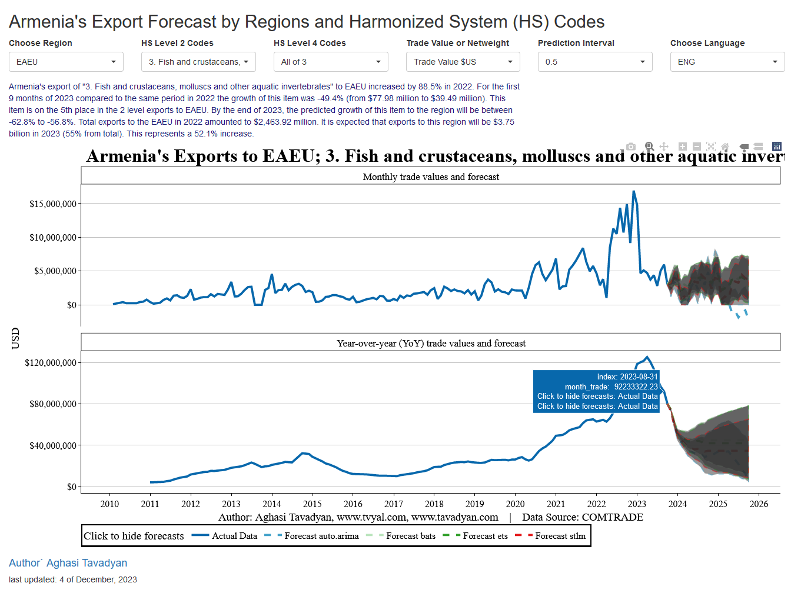
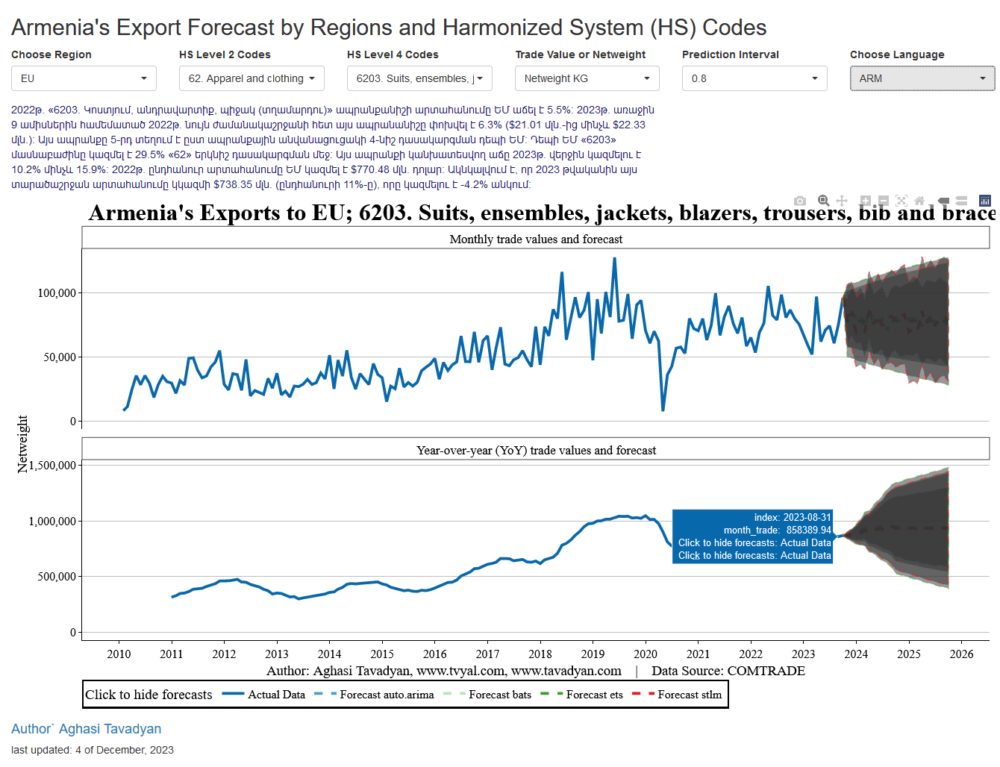
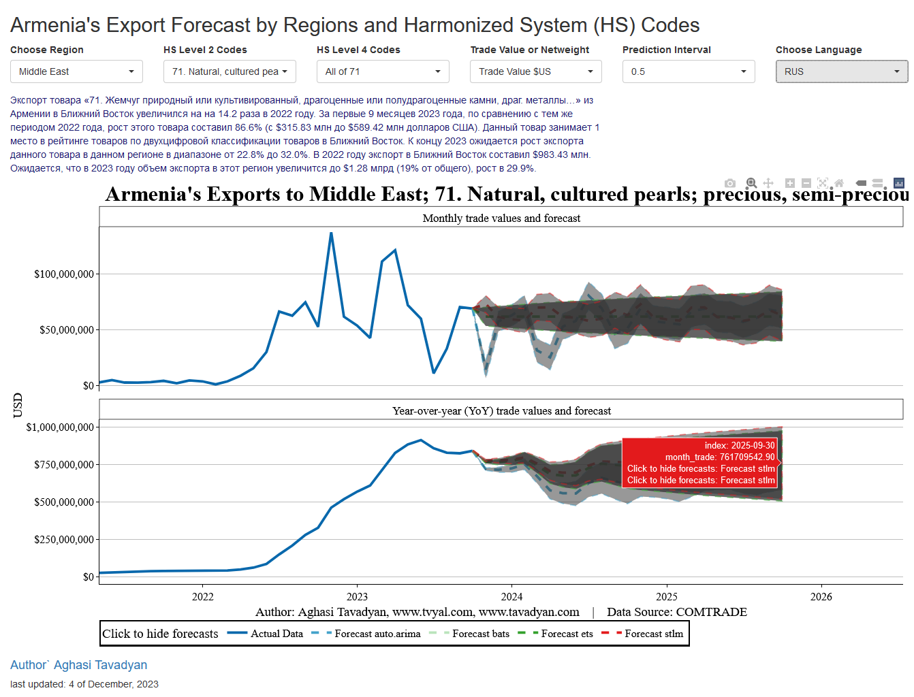

```{r setup, include=FALSE}
knitr::opts_chunk$set(echo = TRUE)

library(tidyverse)
library(scales)

rm(list = ls()); gc()

theme_tvyal <- function(base_size = 12, base_family = "sans") 
{
  colors <- deframe(ggthemes::ggthemes_data[["fivethirtyeight"]])
  (ggthemes::theme_foundation(
    base_size = base_size, base_family = base_family) + 
      theme(
        line = element_line(colour = "black"), 
        rect = element_rect(fill = colors["Light Gray"], linetype = 0, colour = NA), 
        text = element_text(colour = colors["Dark Gray"]), 
        # axis.title = element_blank(),
        # axis.text = element_text(), 
        axis.ticks = element_blank(),
        axis.line = element_blank(), 
        legend.background = element_rect(), 
        legend.position = "bottom", 
        legend.direction = "horizontal", 
        legend.box = "vertical", 
        panel.grid = element_line(colour = NULL), 
        panel.grid.major = element_line(colour = colors["Medium Gray"]), 
        panel.grid.minor = element_blank(), 
        plot.title = element_text(hjust = 0, size = rel(1.5), face = "bold"),
        plot.margin = unit(c(1, 1, 1, 1), "lines"), strip.background = element_rect()
      )
  )
}

theme_set(theme_tvyal())

save_last_plot <- 
  function(filename, extension = "png", width = 1920, height = 1080) {
    
    filename <- str_replace_all(filename, " ", "_")
    last_plot <- recordPlot()
    
    if (extension == "png") {
      png(paste0(filename, ".", extension), width = width, height = height)
    } else if (extension == "pdf") {
      pdf(paste0(filename, ".", extension), width = width, height = height)
    } else {
      stop("Unsupported file extension. Use 'png' or 'pdf'.")
    }
    
    replayPlot(last_plot)
    dev.off()
    paste0(filename, ".", extension)
  }

main_palette_colors <- RColorBrewer::brewer.pal(12, name = "Paired")
update_geom_defaults("rect", list(fill  = main_palette_colors[2], alpha = 0.8)) 
update_geom_defaults("line", list(color = main_palette_colors[2], alpha = 0.8))
update_geom_defaults("area", list(fill  = main_palette_colors[2], alpha = 0.8))

caption_arm <-  "Հեղինակ` Աղասի Թավադյան   |   tvyal.com   |   tavadyan.com"
caption_eng <-  "Author: Aghasi Tavadyan   |   tvyal.com   |   tavadyan.com"

doParallel::registerDoParallel(cores = 8)

setwd(dirname(rstudioapi::getActiveDocumentContext()$path))
```


***English summary below.***

Հարգելի գործընկեր,

Հուսով եմ լավ եք:
Ներկայացնում եմ անցած շաբաթվա վերլուծությունները և աշխատանքները.

1. Հայաստանի արտահանման Առացանց վահանակի հնարավարությունների նկարագրություն
2. ԶԼՄ հաղորդագրություններ արտահանման վերաբերյալ
3. English summary


## 1. Հայաստանի արտահանման Առացանց վահանակի հնարավարությունների նկարագրություն

[Մեր կողմից ատեղծվել է առցանց կառավարման վահանակ, որը կայքի տեսքով արտացոլում է 4 մեթոդաբանությամբ կատարված ավելի քան 2000 կանխատեսում Հայաստանի հիմնական արտահանման ԱՏԳ ԱԱ երկնիշ և քառանիշ ապրանքների հիմնական գործընկեր ուղղություններով:](https://tavad.shinyapps.io/exports_forecast/)

[Ստորև, գծապատկերներում ներկայացված է կանխատեսված արդյունքների հիման վրա ստացված առցանց ինտերակտիվ վահանակի տեսքը: Վահանակը բաղկացած է վեց ընտրության դաշտից, երեք լեզվով ավտոմատ գեներացվող տեքստից, ինչպես նաև երկու ինտերակտիվ գծապատկերներից, որոնք ներկայացնում են ընտրված ապրանք-տարածաշրջան համակցության արտահանման դինամիկան և 2 տարի կանխատեսման հորիզոնը` կատարված 2 մոդելով:](https://tavad.shinyapps.io/exports_forecast/)

Վեց ընտրության դաշտերը հետևյալն են՝ 

* Տարածաշրջան (Choose region), որտեղից կարելի է ընտրել 5 գործընկեր տարածաշրջաններից որևիցե մեկը: Գործընկեր տարածաշրջաններն են` Եվրասիական տնտեսական միություն (EAEU), Եվրոմիություն (EU), Միջին Արևելիք (Middle East), Մեծ Չինաստան (Greater China) և այլ երկներ (other countries): Ըստ այս դաշտի ընտրության այլ դաշտերում զետեղված արժեքները և գծապատկերները թարմացվում են:
* Ընտրեք ԱՏԳ ԱԱ երկնիշ ծածկագրերը (HS Level 2 codes): Այս դաշտում զետեղված արժեքները թարմացվում են ըստ տարածաշրջան դաշտում ընտրված արժեքները` միայն ցուցադրելով այն ապրանքանիշերը որոնք տվյալ ուղղությամբ ունեն շոշափելի արտահանման արժեքներ: Այս դաշտում զետեղվում է ԱՏԳ ԱԱ երկնիշ ծածկագիրը, ինչպես նաև ապրանքի անվանումը:
* Ընտրեք ԱՏԳ ԱԱ քառանիշ ծածկագրերը (HS Level 4 codes): Այս դաշտի արժեքը թարմացվում է նախորդ 2 դաշտերում ընտրված արժեքների հիման վրա: Այստեղ ցուցադրվում են ընտրված երկնեիշ ծածկագրի դաշտի քառանիշ դասիչները: Այսպես՝ երիկրորդ դաշտում ԱՏԳ ԱԱ 62 երկնիշ ապրանքանիշը ընտրելուց հետո այս դաշտը թարմացվելու է և ցույց է տալու միայն հետևյալ ԱՏԳ ԱԱ քառանիշ ապրանքանիշերը, որոնք ունեն դեպի տվյալ տարածաշրջան շոշափելի արտահանման արժեքներ: Օրինակ՝ 6201, 6202, 6203, 6204, 6206, 6211, ինչպես նաև «All of 62», այսինքն 62 ապրանքանիշի մեջ զետեղված բոլոր ապրանքների արժեքները: Բացի ապրանքային ծածկագրից այս դաշտում արտացոլվում է նաև ապրանքի անվանումը:
* Հաջորդ դաշտով ընտրվում է տվյալ ապրանքի ժամանակային շարքի և կանխատեսման բնեղեն (կիլոգրամ) կամ արժեքային (ԱՄՆ դոլար) ցուցանիշը: Նշենք որ բնեղեն արժեքները հասանելի են միայն քառանիշ ապրանքների ծածկագրերի համար:
* Հաջորդ դշտով ընտրվում է կանխատեսման միջակայքը, որը փոփոխում է գծապատկերներում զետեղված կանխատեսումների միջակայքերը: Հասանելի են 50%, 80% և 95% կանխատեսումների միջակայքեր:
* Վերջին դաշտով ընտրվում է ավտոմատ կարպով գեներավող տեքստի լեզուն: Հասանելի են 3 լեզուներ` անգլերեն, հայերեն և ռուսերեն: 
Ինտերակտիվ վահանակի հաջորդ տարրը դա ավտոմատ գեներացվող տեքստն է, որը թարմացվում է ըստ դաշտերում ընտրված արժեքները: Տեքստի նկարագրությունը և գեներացման քայլերը կարելի է տեսնել նախորդ բաժնում: Հայաստանի արտահանման հիմանական ապրանքների համար ավտոմատ կերպով գեներացված տեքստը կարելի է տեսնել նաև Հավելված 1-ում:

Գծապատկերները ցույց են տալիս արտահանման ամսական և տարեկան (12 ամսվա շարժական) գումարի արժեքները բնեղեն կամ արժեքային արտահայտությամբ: Գծապատկերները ինտերակտիվ են մկնիկի տեղաշարժման պահին ցույց են տալիս արտահանման կամ կանխատեսման հստակ արժեքը: Հնարավոր է գծապատկերները մեծացնել, ցուցադրել կամ փակել կանխատեսումներից մեկը, ինչպես նաև ներբեռնել գծապատկերը նկարի տեքսով:
Նշենք որ տվյալ առցանց վահանակը ամենից լավ աշխատում է համակարգիչով:

Առաջին Գծապատկեր ներկայացված է արտահանման վահանակը, որտեղ ընտրված են Եվրասիական տնտեսական միությունը որպես գործընկեր տարածաշրջան, ԱՏԳ ԱԱ 3 ծածկագիրը` «ձուկ և ձկնամթերք», կանխատեսման 50% միջակայքը, և տեքստի գեներացման անգլերեն լեզուն: Մկնիկը բերված է իրական ցուցանիշենրի վերջին տվյալի վրա և ուղղանկյան մեջ ցույց է տալիս այդ ժամանակահատվածի արժեքը: Ինչպես տեսնում ենք ձկան և ձկնամթերքի արտահանման տարեկան ցուցանիշը դեպի ԵԱՏՄ գրանցել է կայուն աճ 2016թ. սկսած, որից հետո 2020թ. կեսից աճի տեմպը կրկնապատկվել է: 2023 թվականին արդեն ունեցել ենք ձկնաբուծության արտահանման 50 տոկոս անկում: Այսինքն 2022 թվականի աճը ուներ ժամանակավոր բնույթ:


**Գծապատկեր 1.** Կանխատեսումների առցան վահանակի օրինակ 1

[](https://tavad.shinyapps.io/exports_forecast/)

Գծապատկեր 9.2.-ում ընտրված է Եվրոմիությունը որպես արտահանման գործընկեր, 62 ապրանքանիշը՝ որից ԱՏԳ ԱԱ 6203 «Կոստյում, անդրավարտիք, պիջակ (տղամարդու)» քառանիշ ապրանքանիշը: Ապրանքի արտահանումը ընտրված է բնեղեն արտահայտությամբ (Netweight KG), կանխատեսման միջակայքը 80%, իսկ ավտոմատ կերպով արտացոլվող տեքստի լեզուն՝ հայերեն: Գծապատկերնեից երևում է որ տղամարդկանց կոստյումների արտահանումը դեպի ԵՄ պարբերաբար աճել է մինչև 2020թ, որից հետո գրանցվել է անկում՝ ամենայն հավանականությամբ պայմանավորված հակահամաճարագային միջոցառումներով: 2021-22թթ. գրանցվել է վերականգնողական աճ: Ըստ կանխատեսումները հաջորդ տարիների կտրվածքով տվյալ ապրանք-տարածաշրջան արտահանման համակցությունը զգալի աճ չի գրանցի:


**Գծապատկեր 2.** Կանխատեսումների առցան վահանակի օրինակ 2

[](https://tavad.shinyapps.io/exports_forecast/)

Գծապատկեր 9.3. ցույց է տալիս արտահանման ինտերակտիվ վահանակը, որտեղ ընտրված են Միջին Արևելքը, որպես տարածաշրջան և 71.՝ «թանկարժեք և կիսաթանկարժեք մետաղներ և քարեր» երկնիշ ապրանքանիշը: Կանխատեսման միջակայքը ընտրված է 50%, իսկ տեքստի արտացոլման լեզուն՝ ռուսերեն: Ինտերակտիվ գծապատկերները խոշորացվել են և արտացոլում են 2021 թվականը մինչև 202+ թվականը: [Այս աճը հիմնականում պայմանավորված է Ռուսատանից դեպի Միացյալ Արաբական Էմիրություններ ոսկու և ադամանդների վերաարտահանմամբ](https://www.tvyal.com/newsletter/2023_11_13): Ըստ կանխատեսման արտահանման աճ չի սպասվում:

**Գծապատկեր 3.** Կանխատեսումների առցան վահանակի օրինակ 3

[](https://tavad.shinyapps.io/exports_forecast/)

### Ձեզ նաև կհետաքրքրի.

* [Հայաստանի արտահանման այլընտրանքային ուղղություններ](https://www.tvyal.com/newsletter/2023_11_13)
* [Ռուսաստանի տնտեսությունը Հայաստանից ավելի մեծ կախման մեջ է](https://www.tvyal.com/newsletter/week-32)

## 2. ԶԼՄ հաղորդագրություններ արտահանման վերաբերյալ

Դիտեք իմ հարցազրույցը տված [factor.tv լրատվամիջոցոին](https://youtu.be/mKZ7evjPVkY), որտեղ քննարկվում է թե որ երկրներ կարող է արտահանվել Հայաստանի գյուղատնտեսական ապրանքները, բացի Ռուսատանից։

[](https://youtu.be/mKZ7evjPVkY)


## 3. English Summary

**Introducing the Armenia Export Online Dashboard**

We've developed a user-friendly online Dashboard, offering insights into over 2,000 forecasts for Armenia's primary exports. The website generates automatic text descriptions in Armenian, English, and Russian, providing a comprehensive overview of product exports to key partner regions. The interactive dashboard boasts six selection fields, including region, product codes, forecast indicators, and language preferences. Explore dynamic charts illustrating export dynamics and a 2-year forecast horizon for informed decision-making. Please note that for the best experience, the panel is currently optimized for computers.

Experience the power of the Armenia Export Online Panel by visiting [this link](https://tavad.shinyapps.io/exports_forecast/).


---

Այս վերլուծությունը առկա է նաև [մեր կայքէջում](https://www.tvyal.com/newsletter/2023_12_04), այս վերլուծության կոդը և տվյալները դրված են նաև [Github-ում](https://github.com/tavad/tvyal_newsletter)։                        
---                  

Եթե հնարավոր է, խնդրում եմ այս նյութը ուղարկել նաև այն մարդկանց, ում այն կարծում եք կարող է հետաքրքրել:

Սպասեք հաջորդ հաղորդագրությանը մի շաբաթվա ընթացքում:        


Հարգանքներով,            
Աղասի Թավադյան         
04.12.2023          
[tvyal.com](https://www.tvyal.com/)      
[tavadyan.com](https://www.tavadyan.com/)

---

[Was this email forwarded to you? Subscribe here.](https://www.tvyal.com/subscribe)

[Բաժանորդագրվեք](https://www.tvyal.com/subscribe)
       
              
               


####### **Ուշադրություն. Ձեր էլ.փոստը մեյլիսթի մեջ է, որի միջոցով ես կիսվում եմ շաբաթական նյութեր, որոնք հիմնականում ներկայացնում են Հայաստանի տնտեսությանը: Նյութերը ներառում են գծապատկերներ, [տվյալների բազաներ](https://github.com/tavad/tvyal_newsletter), տեսանյութեր, հոդվածներ, [առցանց վահանակներ](https://www.tvyal.com/projects), տնտեսական գործիքներ, կանխատեսումներ և հաշվետվություններ: Եթե ցանկանում եք չեղարկել բաժանորդագրությունը, խնդրում եմ տեղեկացրեք ինձ, և ես կհեռացնեմ ձեր էլ. փոստը ցուցակից: Գրեք նաև եթե ունեք մենկնաբանություններ:**

####### **Important! Your email is part of the mailing list where I share weekly materials primarily focused on the Armenian economy. These materials encompass charts, [databases](https://github.com/tavad/tvyal_newsletter), videos, articles, [online dashboards](https://www.tvyal.com/projects), economic tools, forecasts, and reports. If you wish to unsubscribe, please let me know, and I will remove your email from the list. Please share your comments as well․**


